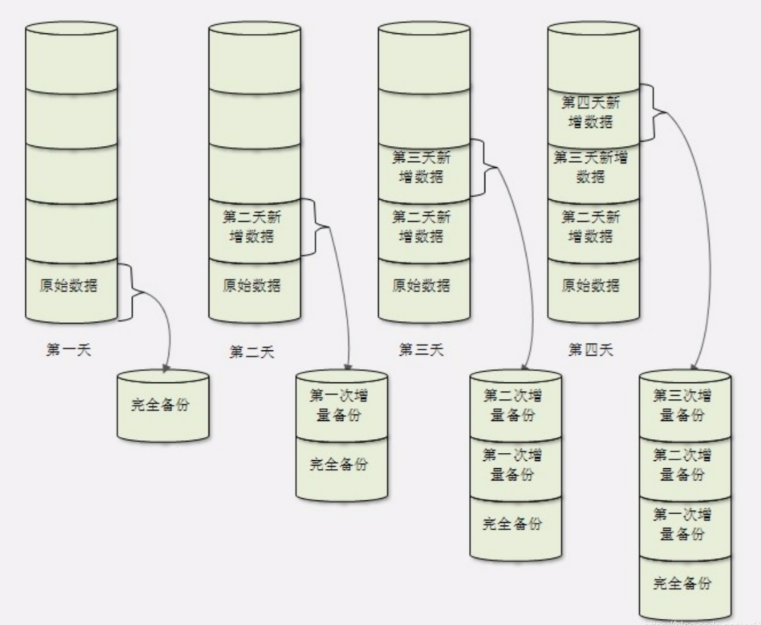

#

# 第一章 Linux 起源

**unix，C 语言，TCP-IP 可以看作三胞胎，他们结合在一起相互诞生，其他具体自行可以看：计算机组成原理，计算机网络，以及 C 语言。可以结合在一起来学习，效果更佳。**

# 第二章 系统分区

**Linux 与 Windows 一样，它的主分区和拓展分区加起来不能超过四个，而且拓展分区最多一个且不能放入数据文件以及它不能格式化，拓展分区里放的逻辑分区可以放数据和格式化。
Linux 硬件全为文件 这一点与 Windows 不一样，下面介绍一些 Linux 的主要硬件文件名已经存放路径。**

- IDE 硬盘 /dev/hd[a-d]

- SCSI/SATA/USB 硬盘 /dev/sd[a-p]

- 光驱 /dev/cdrom 或/dev/sr0

- 软盘 /dev/fd[0-1]

- 打印机（25 针） /dev/lp[0-2]

- 打印机（USB） /dev/usb/lp[0-15]

- 鼠标 /dev/mouse

  **分区：把大硬盘分为小的逻辑分区
  格式化：写入文件系统
  分区设备文件名：给每个分区定义设备文件名
  挂载：给每个分区分配挂载点
  注意：根分区 “/ ” 以下的子分区可以单独使用硬盘
  在虚拟机安装中 swap 的大小为内存的两倍但是超过 2G 没有意义，建议 1000MB 合适
  /boot 路径是为了让 Linux 系统可以顺利运行 里面最好不要存放数据 在虚拟机安装中分配 200M 左右大小就可以了**

_安装教程可以观看一下视频，新手学习建议安装 CentOS_

链接: [Linux 安装](https://www.bilibili.com/video/BV1mW411i7Qf?p=8).

# 第三章 Linux 安装与配置

**在 Linux 远程登录管理配置 IP 时，需要的一些简单命令：**

```
ifconfig  查询当前网卡信息
ifconfig eth0  配置网卡
ifconfig eth0 后+ VmNAT8的网络IP
df    查看系统分区
ls /bin/   里面存放的为Linux命令文件
12345
```

**注意：这些配置都是临时配置，在重启之后 IP 会丢，永久修改需要在配置文件中修改
VmNAT8 为 VMware 虚拟中虚拟网卡 可以自行查询 IP**

_具体操作看以下视频：_

链接: [VMware 环境配置](https://www.bilibili.com/video/BV1mW411i7Qf?p=9).

# 第四章 Linux 常用命令

## 第一节 文件处理命令

### 第一讲 命令格式与目录处理命令 ls

- 以下为不同文件的不同后缀
  压缩包：.gz .bz2 .tar.bz2 .tgz
  二进制软件包：.rpm
  网页文件：.html .php
  脚本文件：.sh
  配置文件：.conf
- 注意： Linux 不靠扩展名区分文件信息，而且所有存储设备必须挂载后方可使用（硬盘，U 盘，光盘）
- 一些主要目录
  /bin/ ( bin 的意思是二进制可执行文件)
  /sbin/
  /usr/bin/
  /usr/sbin/
  /boot/:系统启动相关数据。需要备份时 /boot 目录（也需备份）
  /dev：硬件信息 设备文件保存文字
  /etc :（也需备份） 配置文件保存位置 如账 户，密码
  /lib/ :系统函数保存位置 （也需备份）
  /lost+found/:意外关机或者系统崩溃产生的碎片文件 可以复原 家目录
  /media/: 挂载目录 软盘或光盘
  /mnt/: 挂载 U 盘或者移动硬盘
- 空目录才可以作为挂载点
  例如：/mnt/cdrom 挂载光盘 /mnt/usb 挂载 U 盘
  /opt/ ：第三方软件保存位置 不过保存到/usr/local/里更好 为约定俗成的
  /proc/ :保存系统内核 进程的 例如 CPU 信息不能存放文件没有意义 内存占满死机 没满重启消失
  /sys/ :与 proc 一样 是在内存里的 不可以写东西 放内核信息
  /tmp/ ：临时目录 做练习
  /usr/：系统软件资源目录（也需备份）
  /var/: 动态数据保存 保存缓存，日志以及软件运行产生的文件（也需备份）
  **文中标记（也需备份）的为在服务器中使用进行安全备份时主要的备份目录 非常重要**
- 常用命令
  ls -a 查看隐藏文件
  ls -l 长显示,显示文件或者目录详细信息包括大小 修改时间
  ls -d 显示目录
  ls -h 更加人性化显示 比如字节转换为 MB，GB 不用自己算
  ls -i 查询文件 inode 号(inode 存储文件的详细信息) 信息编号，类似于人的身份证号码
- 用户有三类
  第一类：所有者（只有一个）
  第二类：所属组
  第三类：其他人
  在 ls -l 查询文件详细信息后，第一列会出现类似：-rwxr-xr-x 这样的字符，其中开头的 - 便是代表这个文件是二进制文件的意思，以下为其他开头的含义： -：二进制文件
  d：目录
  l ：软链接文件
  r 代表可以读 w 代表可以写 x 代表可以执行
  -rwxr-xr-x
  -(rwx)(r-x)(r-x ) Linux 中的文件以这种方式来显示不同用户的不同权限
  u g o
  u 所有者 g 所属组 o 其他人
  -(rwx)(r-x)(r-x )说明这个文件：所有者可以读，写，执行；所属组可以读和执行，但是不能写；其他人可以读和执行，但是不能写。

### 第二讲 目录处理命令

- mkdir 创建目录 在/tmp/目录下创建临时文件 只能创建/tmp/**\*** 二级目录
  mkdir -p 可以递归创建 在没有一级目录的情况下新创建二级目录
  pwd 显示当前所在路径
  cd . . 返回上一级目录(两个点连着）
  rmdir 删除空目录 只能删除没有文件的空目录 （不经常使用）
  cp 复制文件 cp [原文件路径][需要复制到的路径]
  cp -r 复制目录
  cp -p 保留原文件属性复制目录 比如保留创建时间 日志文件的复制需要用到
  cp -rp 复制目录并且保留原文件属性
  mv 剪切 改名（在同一个目录下为改名）
  rm 删除文件
  rm -f 强制删除 不再询问
  rm -r 删除目录 一般是 rm -rf 连着用
  control+C 退出选项
  注意：
  rm -rf 使用时一定要谨慎 切记 ！！！
  使用时一定要谨慎 切记 ！！！
  使用时一定要谨慎 切记 ！！！
  rm -rf /\* 系统直接全部被删除！！！

### 第三讲 文件处理命令

- touch [文件名] 在当前目录下创建空文件
  touch[绝对路径+文件名]。 指明绝对路径，在绝对路径处创建文件
  **“Program files” 加双引号创建带空格的文件名 不推荐使用 以后的查询，操作都需要用到 除了代表根分区的/ 以外 其他符号都可以**
- cat [文件名] 显示文件内容 只适合短的文件内容
  cat -n [文件名] 显示行号 给文件内容的每一行标号
  cat -A [文件名] 显示隐藏字符
  tac [文件名] 逆序显示文件内容 倒着来 不支持-n
- more [文件名] 一页一页显示文件内容 适合长的文件内容 空格或者 f 翻页 回车（Enter）一行一行翻，换行 q 或者 Q ，退出
- less [文件名] 一页一页显示文件内容，只不过这条命令可以往回翻页，查看翻过的文件内容 page up 向上翻页，↑ 箭头向上翻一行
  **其他操作和 more 命令一样 在 less 命令中 可以按/+需要查找文件内容的关键字查询内容，高亮内容即为含有关键字的内容，按 n（表示 next）可以查看下一个含有关键字的内容**
- head [文件名] 显示文件最前几行 具体几行加 n head -n 行数 [文件名] 没有指定 默认 10 行
- tail [文件名] 显示文件最后几行 具体几行加 n tail -n 行数 [文件名] 没有指定 默认 10 行 tail -f 动态显示文件末尾内容

### 第四讲 链接命令

**首先给大家介绍一下软链接：**
_软链接的作用和 Windows 中的快捷方式是差不多的。他只不过是指向源文件安装路径的符号链接，所以大小也很小 而且它的文件类型是 lrwxrwxrwx 看似三种用户都可以拥有所有权限。其实，真正拥有的权限是源文件所决定的权限 ，所以这中显示也是软链接的一大特征之一。_

- ln -s [原文件] [目标文件] 创建软链接

**硬链接：**
_硬链接就是把源文件拷贝到目标位置，而他与 cp -p 最大的一点区别就是他可以同步更新，源文件有变化 硬链接文件也会同时发生变化，但是如果源文件丢失或者被删除，硬链接也并不会消失。可以通过 i 节点来区分，源文件和硬链接文件的 i 节点是一样的，所以他们会同步更新，但是他不能跨分区放置硬链接比如：/分区 硬链接 不能放到/boot 分区 ，而且不能对目录使用。_

- ln [原文件] [目标文件] 创建硬链接

## 第二节 权限管理命令

### 第一讲 权限管理命令 chmod

**这一部分主要说明一下如何修改文件或者目录的权限。**

- chmod [{u,g,o,a}{+,-,=}{r,w,x}] [文件或者目录]
  **u ：所有者
  g ：所属组
  o ：其他人
  a ：所有用户**
  **例如：chomd g+x,o+r /tmp/testfile
  就是把 testfile 文件的所有组增加执行权限，其他人增加读权限
  chomd a=rwx /tmp/testfile
  就是 testfile 文件的所有用户增加读写执行权限**

**权限位的数字表示：**

- chmod [rwx 的和,rwx 的和,rwx 的和]] [文件或者目录]
  首先需要知道 r=4 w=2 x=1
  例如：rwxrw-r- - 它的权限位数字表示就是 764
  具体算法：
  **r+w+x=4+2+1=7
  r+w=4+2+0=6
  r=4+0+0=4**
- chmod -R [rwx 的和,rwx 的和,rwx 的和][文件或目录]
  **这条命令与 mkdir -p 递归创建目录一样 这个命令把一个目录下的所有子目录的操作权限全部修改为同样的**
- 创建用户命令
  useradd [用户名] 创建普通用户
  passwd [用户名] 用户密码
  su - [用户名] 切换普通用户\*\*

我们仍需注意在文件与目录中的不同权限，他们具体可以实施的操作是什么！这一点非常重要，有许多人到现在也不太清楚，认为对文件有写权限就可以删除文件。这一点是非常错误的。

附下表以供参考：

| 代表字符 | 权限     | 对文件的含义                                  | 对目录的含义                                         |
| -------- | -------- | --------------------------------------------- | ---------------------------------------------------- |
| r        | 读权限   | 可以查看文件内容 可以 cat/more/head/tail/less | 可以列出目录中的内容 可以 ls                         |
| w        | 写权限   | 可以修改文件内容 可以 vim                     | 可以在目录中创建，删除文件 可以 touch/mkdir/rmdir/rm |
| x        | 执行权限 | 可以执行文件 可以 script(脚本) command(命令)  | 可以进入目录 可以 cd                                 |

### 第二讲 其他权限管理命令

**改变文件或者目录所有者**

- chown [所有者] [文件或者目录]

**改变所有组**

- Groupadd [所有组组名] 添加组
- chgrp [所有组][文件或者目录]
  **默认组为创建文件的所有者的缺省组**
- umask -S 以 rwx 形式显示新建文件缺省权限

**改变文件或者目录所有者和所属组**

- chown [所有者]:[所属组] [文件或者目录]

**但是在 mkdir 一个目录之后
进行 ls -ld 发现他的权限为 drwxr-xr-x
但是在 touch 一个文件之后
进行 ls -l 发现他的权限为-rw-r- -r- -
这是因为在 Linux 系统里面把任何新建的文件都会把可执行权限去掉，其实 umask 值还没变，只不过是因为他是文件，木马病毒入侵之后没有可执行权限，就没有作用了。**

- umask

**umask 指令直接输入之后会显示 0022
其中 0 代表特殊权限
022 代表 777 与 022 之间的一种逻辑与的关系
他会进行逻辑比对，两者重复的不能保留，把没有的写下来**

777 rwx rwx rwx
022 — -w- -w-
—————————
755 rwx r-x r-x 目录
rw- r— r— 二进制文件
**如果想把默认创建的文件改为 700**
700 rwx — --- 目录
rw- — --- 二进制文件
这样运算 进行逻辑与比对
777 rwx rwx rwx
X
—————————
700 rwx — ---
**这就像一个解方程 求 X
X=— rwx rwx 077**

**可以使用 umask 077 修改缺省创建文件权限，但是不推荐修改。**

## 第三节 文件搜索命令

### 第一讲 文件搜索命令 find

- find [搜索范围][匹配条件] **用于文件搜索**
- find [搜索范围] -name [关键字] **在特定路径下搜索文件名作为关键字的文件或者目录**
- find [搜索范围] -name [关键字]\* **这样为带有关键字开头的任何文件都可以被搜索出来**
- find [搜索范围] -name _ [关键字] _ **这样为带有关键字的任何文件都可以被搜索出来**
  匹配任意字符 加通配符\*
- find [搜索范围] -name [关键字]??? **这样搜索的是关键字后带三个字符的 几个问号为几个字符**
- find [搜索范围] -iname [关键字] **不区分大小写搜索**
  **注意：不能在服务区高峰时候使用查找命令。太占内存资源，搜索的范围路径越小越好，搜索条件越精准越好**
- find [搜索范围] -size [数据块] **根据文件大小查找**
  **数据块前面加+表示查找大于这个大小的文件，-表示查找小于这个大小的文件，不加表示查找等于这个大小的文件(一般不常用)**
  1 个数据块=512 字节=0.5K
  size 后接的数据只能为数据块 需要换算，比如需要查找大于 100MB 的文件
  100MB=102400KB=204800
  find /etc -size +204800
  数据块为 Linux 存储文件最小单位
- find [搜索范围] -user [所有者名] **根据所有者查找**
- find [搜索范围] -group [所属组名] **根据所属组查找**
- find [搜索范围] -amin [时间] **查找时间以内被访问过的文件和目录 a：access**
- find [搜索范围] -cmin [时间] **查找时间以内被修改过属性的文件和目录 c：change**
- find [搜索范围] -mmin [时间] **查找时间以内被修改过内容的文件和目录 m：modift**
  **+：超过多长时间 -：多长时间以内**
- find [搜索范围] -size [数据块] -a -size [数据块]
  **-a：两个条件同时满足
  -o：两个条件满足任意一个即可**
  **find /etc -size +163840 -a -size -204800
  在/etc 下查找大于 80MB 小于 100MB 的文件**
- find [搜索范围] -name [关键字] -a -type f
  **在特定路径下搜索文件名作为关键字的文件**
  **-type 根据不同类型查找
  f：文件
  d：目录
  l：软链接**
- find [搜索范围] -name [关键字] -exec ls -l {} \ ;
  **查找到文件之后并且对其进行查看 ls 操作。**
  **-exec：查找到文件之后并且对其进行各种操作 {} \ ;不能丢
  -ok：用于询问确认 一般在删除操作的时候使用，比如：
  find -user yangyang -ok rm {} \ ;**
  **删除 yangyang 用户的文件 他会挨个询问你是不是确定删除**
- find [搜索范围] -inum [i 节点值] **根据 i 节点查询**
  **find /etc -inum 12345 -exec rm {} \ ;
  删除这个 i 节点文件 非常方便
  也可以用来查询一个文件的硬链接
  find /etc inum 12345 -exec ls -l {} \ ;
  因为硬链接和文件肯定在同一个分区，并且 i 节点一样**

### 第二讲 其他文件搜索命令

- locate [文件名]
  **在文件资料库中查找 速度更快**
  **updatedb 更新文件资料库 因为 locate 并不是实时的
  如果存放的文件在/tmp 临时文件存放处下面 locate 就找不到，文件资料库不存储临时文件内容**
  注意：在使用的 Linux 系统为 Linux（CentOS7）的时候，使用命令 locate 时发现系统显示：-bash: locate: 未找到命令，遇到错误。它的原因是：在 CentOS 7 系统中默认没有安装该命令。
  **以下为解决办法：**
  链接: [解决 locate 命令未找到问题](https://blog.csdn.net/yy150122/article/details/106164472).
- locate -i **不区分大小写查找**
- which **查找命令存放位置，可以看到命令可以使用的使用者是谁，也可以查看命令别名 which rm 会显示 alias rm='rm -i’**
  **我们所使用的 rm 只不过是别名 不是真正的 rm 命令，其实是 rm -i 命令，所以才会询问是否真的删除，真正的 rm 是不会询问的，比如：
  /bin/rm /tmp/yangyang 文件直接删除不会询问是否删除 相当于加了 -f**
- whereis **也可以找到命令的绝对路径，还可以找到查询命令的帮助信息文档所在位置**
- grep **在文件内查询字符串或者关键字列出来**
- grep -i **不区分大小写查找**
- grep -v **排除指定字符串**
  **比如：
  grep -v ^# /etc/inittab
  查找排除#开头的注释行文件信息
  ^代表行首
  文件中#开头的行 为配置文件信息,脚本信息**

## 第四节 帮助命令

- man [命令名称或者配置文件名称] **获得命令或者配置文件的帮助信息**
  **man 后面直接写命令或者配置文件的名称就好，不能加绝对路径。进入里面之后操作和 more，或者 less 一样。
  如过使用 CentOS 服务器，没有 man 命令，需要输入下面命令来下载：
  sudo yum install man-pages
  配置文件帮助文档第一步看他是干什么用的，第二步看配置文件的格式。
  man services
  service-name | port/protocol | [aliases …]
  服务名称 | 端口/传输协议 | [别名]
  就可以看懂 more /etc/services 里的配置文件了
  man passwd 他会把命令，命令的帮助，配置文件，全部找到
  通过 whereis passwd 可以发现
  /usr/bin/passwd /etc/passwd /usr/share/man/man1/passwd.1.gz /usr/share/man/man5/passwd.5.gz
  有三个路径 他们分别为命令的路径，命令的帮助的路径，配置文件的帮助路径
  其中 man1 代表命令的帮助，man5 代表配置文件的帮助
  所以我们可以通过 man 5 passed 就可以直接找到配置文件的帮助**
- whatis ls [命令] **查询简短的命令的作用**
- apropos [配置文件名称] **查询简短的配置文件的作用**
- [命令] - -help **找到命令的主要选项**
- date **查询系统当前时间**
  **如果想修改提前用 man date 查看一下时间格式
  例如：
  date 051910272020.18
  修改完毕**
  **man 与 info 作用大同小异，没有本质区别，依照个人习惯使用**
- help **查询 shell 内置命令的帮助信息**
  **在 CentOS7 之前的版本 直接 which 命令是找不到所在路径的，因为：
  Shell 是一个命令解释器 它里面有内置命令比如 cd，umask
  他们使用 which 后找不到命令所在路径，他们就不能使用 man 命令 ,他会把所有的内置命令全列出来 可以直接使用 help
  help 用于内置命令的帮助和 shell 编程查看语法规则**

## 第五节 用户管理命令

- useradd **添加新用户**
- passwd [新用户名称] **给新用户填加密码**
- who **查看登陆用户信息**
  **第一列 登陆用户名
  第二列 登陆终端 tty 表示本地终端 pts 表示远程登陆终端
  第三列 登陆时间
  第四列 登陆主机的 IP 地址 如果没有写表示本机登陆**
- w **查看登陆用户详细信息**
  **第一行显示
  17:04:55 up 22 days, 21:32, | 2 users,| load average: 0.02, 0.02, 0.05
  第一个表示当前时间
  第二个表示服务区系统连续运行时间没有重启或者关机，衡量服务区稳定性
  第三个表示当前总共有多少个用户登陆
  第四个表示负载均衡指数，分别记录了过去一分钟，五分钟，十五分钟系统的负载情况，加起来除以三就是平均负载指数，系统的负载情况主要是指 CPU 和内存的负载情况，数字大表示负载严重**
  **uptime 命令也可以显示此项数据**
  **第二行显示
  USER TTY FROM LOGIN@ IDLE JCPU PCPU WHAT
  其中 IDLE 表示用户登陆过来后空闲多久
  PCPU 表示用户登陆后执行的操作占用的 CPU 的时间 CPU 时间
  JCPU 表示累计占用的 CPU 时间
  WHAT 表示执行的操作**

## 第六节 压缩解压命令

- gzip [文件名] **压缩文件 只能压缩文件不能压缩目录，而且不保留原文件
  压缩后格式为：.gz**
- gunzip [压缩包名] **解压缩.gz 文件**
- gzip -d [压缩包名] **也是一样的作用，解压缩.gz 文件**
- tar [选项] [压缩后文件名] [目录]
  -c 打包
  -v 显示详细信息
  -f 指定文件名
  -z 打包同时压缩
  **例子：
  tar -cfv Japan.tar Japan
  打包目录 Japan 并且以 Japan.tar 命名
  tar -zcfv Japan.tar.gz Japan
  打包并且压缩 目录 Japan 以 Japan.tar.gz 命名
  一步到位**
- tar [选项] [压缩文件名] [目录]
  -x 解包
  -v 显示详细信息
  -f 指定解压文件名
  -z 解压缩
  **tar -xfv Japan.tar Japan
  解包目录 Japan.tar 并且以 Japan 命名
  tar -zxfv Japan.tar.gz
  解压缩并且解包目录 Japan.tar.gz 以 Japan 命名**
- zip [选项] [压缩后文件或目录名] [文件或目录]
  **原文件会保留 而且提示压缩比 deflated
  没有 gzip 压缩比大，不常用
  压缩后格式为：.zip**
  **zip -r 压缩目录**
- unzip [压缩文件] **解压 zip 文件**
- bzip2 [选项] [文件名] **压缩文件，大型文件一般用这个压缩**
  **例子：
  bzip2 -k Japan
  -k：保留原文件 如果不需保留可去掉
  生成 Japan.bz2 压缩文件
  他还可以与 tar 结合使用
  tar -cjfv Japan.tar.bz2 Japan**
- bunzip2 [选项] [压缩文件名] **解压文件**
  **-k：保留压缩包
  与 tar 结合使用
  tar -xjfv Japan.tar.bz2 Japan**

## 第七节 网络命令

- write <用户名> **给在线用户发信息，按 Ctrl+D 保存结束 只能给在线用户发 可以用 w 查询用户在线情况 不在线发不出去**
- wall [信息] **发广播信息 群发所有在线用户**
- ping [IP 地址] **测试网络连通性**
  **ping -c 指定发送次数**
- ifconfig **查看网卡信息 主要功能是查询当前本机 IP 地址**
- mail <用户名>
  **给不在线的用户发送邮件**
  **例子：mail yangyang**
  **进入之后：
  Subject：输入标题
  下面输入正文，按 Ctrl+D 保存结束并发送
  按 mail 查询收到的邮件
  N 表示未读邮件
  想看第几封邮件就按前面的标号数字
  h 键查看邮箱列表
  d [n] 删除第 n 封邮件
  q 退出**
  **在 CentOS7 服务器中，比如阿里云 ESC 服务器中运行的 CentOS7 中，就会出现 mail 命令无法使用：Linux CentOS7 命令错误：send-mail: fatal: parameter inet_interfaces: no local interface found for ::1**
  **解决办法写在了我的另一片博文上：
  链接: [mail 命令错误解决办法](https://blog.csdn.net/yy150122/article/details/106179803).
  以供大家解决问题。**
- last **列出目前与过去登陆系统的用户信息**
- lastlog **检查某特定用户上次登陆的时间**
- lastlog -u [uID] **检查 uID 用户上次登陆的时间**
- traceroute **显示数据包到主机间的路径**
  **这里 CentOS7 用户也会出现 traceroute 命令不能使用的问题，直接下载 traceroute 就好了
  yum install -y traceroute 安装**
- traceroute [网站网址] **可以检查网络哪个节点出现问题**
- netstat [选项] **显示网络相关信息
  -t TCP 协议：传输控制协议
  -u UDP 协议：用户数据报
  -l 监听
  -r 路由：网关
  -n 显示 IP 地址和端口号**
  **netstat -tlun ：查询本机监听的端口
  netstat -an ：查看本机所有的网络连接
  netstat -rn ：查看本机路由（网关）**
- setup **配置网络 redhat 专有命令 ,在其他版本不存在，他是永久生效的 和刚开始介绍的 ifconfig 命令不一样**
  **CentOS7 使用 nmtui 命令代替 setup，不过是在虚拟机中调试**

## 第七节 挂载命令

- mount [-t 文件系统] 设备文件名 挂载点
- mount 设备文件名/挂载点 **卸载光盘，设备文件名和挂载点两者任选其一**
  **第一步：放入光盘，虚拟机中放入，或者服务器下载 ios 文件
  第二步：创建一个空目录，设为挂载点
  mkdir /media/cdrom /media 用来做光盘挂载的，/mnt 也可以
  第三部：输入命令
  mount -t iso9660 /dev/sr0 /media/cdrom
  设备文件名默认就是/dev/sr0，文件系统为 iso9660 它是国际标准的 cd 文件格式，它告诉 mount 命令，我要挂载的是一个标准的 cd。需要死记！！！
  /dev/cdrom 也可以写 /dev/sr0
  /dev/cdrom 是 sr0 的软链接。
  第四步：进入挂载后的盘符
  cd /media/cdrom
  第四步：卸载光盘
  先退出/media/cdrom，输入命令：cd；然后再输入命令：umount /dev/sr0
  注意：如果之前挂载过其他盘，需要卸载之后才能挂载，输入命令：
  umount /dev/sr0**

## 第八节 关机重启命令

- shutdown [选项] 时间
  **时间选项里可以填具体时间比如：
  now 现在关机
  20:30 八点半关机
  -c：取消前一个关机命令
  -h：关机
  -r：重启
  例子：
  shutdown -h now 关机
  shutdown -c 取消上一次设定的关机时间
  在服务器上重启需要谨慎，需要先停掉服务，否则物理内存会坏
  而且远程服务器只能重启，关机后需要管理员手动开机**
- **其他关机命令：
  halt
  poweroff 相当于直接断电
  init 0
  推荐使用 shutdown 关机，会保存正在运行的服务
  其他重启命令：
  reboot
  init 6**
  **系统的运行级别：
  init 0-6
  0：关机
  1：单用户 进入选项菜单 只有 root 用户登陆进去 相当于 Windows 安全模式 F8，只不过没有图形界面
  2：不完全多用户，不含 NFS 服务，没有图形界面 NFS 网络文件系统，Linux 之间文件传输共享方式，除了 NFS 服务，和 3 一样。
  3：完全多用户，没有图形界面
  4：未分配，没有图形界面
  5：图形界面
  6：重启**
- runlevel **查询系统运行级别**
- logout **退出登陆命令
  注意：在服务器中一定要在操作完成之后退出登陆，否则其他人会直接进入你的服务器，造成非常大的损失。最基本的安全意识一定要有！！！**

# 第五章 文本编辑器 Vim

## 第一节 Vim 常用操作

**Vim 没有菜单，只有命令**
**Vim 的工作模式有三种：**

- **第一种：命令模式 vi/vim+文件名 进入命令模式 不可以输入文字，只能识别命令**
  **插入命令：
  a：在光标所在字符后插入
  A：在光标所在行尾插入
  i：在光标所在字符前插入
  I：在光标所在行行首插入
  o：在光标下插入新行
  O：在光标上插入新行**

- **第二种：插入模式 按 i/a/o 进入，可以继续输入文字，按 Esc 退出**

- 第三种：编辑模式 在命令模式下按:，即可进入 编辑模式 可以输入编辑命令 比如：保存并退出，加行号

  定位命令：

  - :set nu **设置行号**
  - :set nonu **取消行号**
  - gg **到第一行**
  - G **到最后一行**
  - nG **到第 n 行**
  - : n **到第 n 行 和上面一样的格式**
  - $ **移动到行尾**
  - 0 **移动到行首**

- 删除命令：

  - x **删除光标所在处的字符**
  - nx **删除光标所在处后 n 个字符**
  - nd **删除光标所在行**
  - ndd **删除 n 行**
  - dG **删除光标所在行到文件末尾的内容**
  - D **删除光标所在处到行尾内容**
  - :n1,n2d **删除指定范围的行 n1-n2 的行全部被删除**

- 复制和剪切命令：

  - yy **复制当前行**
  - nyy **复制当前行一下 n 行**
  - dd **剪切当前行**
  - ndd **剪切当前行以下 n 行**
  - p **粘贴在当前光标所在行下**
  - P **粘贴在当前光标所在行上**

- 替换或取消命令：

  - r **替换光标所在处字符**
  - R **从光标所在处开始替换字符，按 Esc 结束**
  - u **取消上一不操作**

- 搜索和搜索替换命令：

  - /string **搜索指定字符串 string 与 less 命令操作类似**
    **搜索时忽略大小写:set ic
    搜索时不忽略大小写:set noic**
  - n **搜索指定字符串的下一个出现位置**
  - :%s/要替换的字符串/替换的新的字符串/g 不询问
    **把/g 换成/c 进行询问确认
    全文替换指定字符串**
  - :n1,n2s/要替换的字符串/替换的新的字符串/g
    **在一定范围内替换指定字符串**

- **保存和退出命令：**
  :w **保存修改**
  :w new_filename **另存为指定文件**
  :wq **保存修改并退出**
  ZZ **快捷键，保存修改退出**
  :q! **不保存修改退出**
  :wq! **保存修改并退出（只有文件所有者以及 root 可以使用）适合保存 root 只有只读权限的文件**

## 第二节 Vim 使用技巧

**在 Vim 中有许多黑科技小技巧便于我们操作，我总结了以下几天最为方便的操作，以供大家学习：**

- :r !命令 **当前的 Vim 文档导入命令执行结果**
  **例子：
  :r !date 直接把当前时间导入当前的 Vim 文档**
- map [快捷键] [触发命令] 定义快捷键
  **其中快捷键需要按 ctrl+v+需要设定的键位，设定好之后颜色会变，比如想设定 ctrl p 为快捷键那么就按 ctrl+v+p 会出现^P ，不能按 shift+6 出现的^,这两个虽然看起来一样但是颜色不一样
  触发命令按需要执行的命令的先后顺序来排列，比如给脚本加注释#键就可以把[触发命令]设为 I#
  例子：
  map ^P I# 给脚本行首加#注释**
- :n1,n2s/^/#/g **替换行首字符为#，连续行的注释，不过需先设置行号 :set nu**
- :n1,n2s/^#/ /g **取消注释**
- :n1,n2s/^/ \ / \ //g **给行首加// 需先设置行号 :set nu**
  **因为系统无法识别太多的，所以需要在//每一条/前都加转义符\，\表达命令的正在含义，比如 ls /etc 里面的文件会有颜色，但是\ls 就没有，他是表达执行 ls 真正含义不执行 ls 别名**
- ab [a 内容][b内容]
  **例子：
  ab mymail 1771566679@qq.com
  替换命令，当你在 vim 文档中输入 mymail 时按回车或者空格会自动变1771566679@qq.com
  即：会自动把 b 内容替换成 a
  非常实用的小技巧**

**有些时候在重启服务器之后，定义的快捷键会消失，这时候我们需要在用户的家目录下写配置文件，保存快捷键**
**root 用户在 /root/.vimrc
其他用户在 /home/username/.vimrc 在里面进行编辑，永久生效**

# 第六章 软件包管理

## 第一节 软件包管理简介

**源码包：可以看到源代码，但是安装时间较慢，脚本安装包 类似 Windows 安装软件， 他是写了安装界面的源码包**

- 优点：
  - **1.开源，如果有足够的能力，可以修改源代码**
  - **2.可以自由选择所需的功能**
  - **3.软件是编译安装，所以更适合自己的系统，使用更加稳定也效率更高**
  - **4.卸载方便，直接删除安装目录**
- 缺点：
  - **1.安装过程步骤较多，尤其安装较大的软件集合时（如 LAMP 环境搭建），容易出现拼写错误**
  - **2.编译过程时间较长，安装比二进制安装时间长**
  - **3.因为是编译安装，安装过程中一旦报错新手很难解决**

**二进制包：RPM 包，系统默认包，厂商已经进行了编译，看不到源代码，但是安装时间较快**

- 优点：
  - **1.包管理系统简单，只通过几个命令就可以实现包的安装，升级，查询和卸载**
  - **2.安装速度比源码包安装快得多**
- 缺点：
  - **1.经过编译，不再可以看到源代码**
  - **2.功能选择不如源码包灵活**
  - **3.依赖性 依赖性指的是要想安装 A 包就得先安装 B 包，要想安装 B 包又得先安装 C 包，所以只能以 CBA 的顺序安装 RPM 包，删除的时候得按 ABC 顺序删除安装包，基本上所有的 RPM 包全有依赖性**

## 第二节 rpm 命令管理

### 第一讲 包命名与依赖性

**RPM 包命名规则
例子：
Httpd-2.2.15.el6.centos.1.i686.rpm
其中：**

- **Httpd 软件包包名**
- **2.2.15 软件版本**
- **15 软件发布的次数**
- **el6.centos 适合的 Linux 平台**
- **i686 适合的硬件平台 noarch 表示任何硬件平台都可以安装**
- **rpm rpm 包扩展名**

**如果自己组建 rpm 包，都以 rpm 结尾，这样更加清晰，其他管理员可以明白**
**注意：Httpd-2.2.15.el6.centos.1.i686.rpm 为包全名，Httpd 为包名是有区别的，Linux 系统命令严格区分两者
RPM 包依赖性**

- **树形依赖：a→b→c**
- **环形依赖：a→b→c→a**
- **环形依赖需要把 a,b,c 三个同时安装
  模块依赖：模块依赖查询网站：www.rpmfind.net
  ==如果安装时遇到问题，出现依赖性错误
  被依赖文件以.so.[数字]结尾的为库依赖，需要直接安装这个软件，错误会自动解决
  安装这个包时需要进入网站 [www.rpmfind.net](https://blog.csdn.net/yy150122/article/details/www.rpmfind.net).
  查询被依赖文件**

### 第二讲 安装升级与卸载

**包全名：操作的包是没有安装的软件包时，使用包全名。而且要注意路径
包名：操作以及安装的软件包时，使用包名。是默认在搜索/var/lib/rpm 中的数据库**

- rpm -ivh 包全名 **RPM 安装**
  **-i 安装（install）
  -v 显示详细安装信息（verbose）
  -h 显示进度（hash）
  –nodeps 不检测依赖性 一般不用，安装时都得显示依赖性**
  **注意：安装一定要用包全名**
- rpm -Uvh 包全名 **RPM 包升级**
  **-U 升级（upgrade）
  rpm -e 包名
  -e 卸载（erase）
  –nodeps 不检查依赖性**

### 第三讲 查询

- rpm -q 包名 **查询是否安装**
  **-q 查询（query）
  rpm -qa 查询所有安装的包
  -a 所有（all）**
- rpm -qa | grep [关键字]
  **查询所有含义关键字的包，| 为管道符 。作用是管道符左边命令的输出就会作为管道符右边命令的输入**
  **注意：
  1、管道命令只处理前一个命令正确输出，不处理错误输出。
  2、管道命令右边命令，必须能够接收标准输入流命令才行。**
- rpm -qi 包名 **查询安装过软件包详细信息**
  **-i 查询软件信息（information）
  -p 查询未安装包信息（package）**
- rpm -qip 包全名 **查询没安装过软件包详细信息 因为包没有安装所以得加包全名，因为包在生产好的时候他的信息就已经生成，所以可以查到没安装好的包的信息**
- rpm -ql 包名 **查询包中文件安装位置
  -l 列表（list）
  -p 查询未安装包信息（package）**
- rpm -qf 系统文件名 **查询系统文件属于哪个 RPM 包
  -f 查询系统文件属于哪个软件包（file）**
- rpm -qR 包名 **查询软件包的依赖性
  -R 查询软件包的依赖性（requires）
  -p 查询未安装包信息（package）**

### 第四讲 校验和文件提取

- rpm -V 已安装的包名

  RPM 包校验

  -V 校验指定 RPM 包中的文件（verify）
  例子：rpm -V httpd 显示：
  S.5……T. c /etc/httpd/conf/heepd.conf

  - **验证内容中的 8 个信息的具体内容：
    S：文件大小是否改变
    M：文件的类型或文件的权限(rwx)是否被改变
    5：文件 MD5 校验和是否改变(可以看成文件内容是否改变) MD5 是进行文件完整性验证的
    D：设备的中，从代码是否改变
    L：文件路径是否改变
    U：文件的属主(所有者)是否改变
    G：文件的属组是否改变
    T：文件的修改时间是否改变**
  - **文件类型：
    c：配置文件（config file）
    d：普通文档（documentation）
    g：“鬼”文件（ghost file），很少见，就是该文件不应该被这个 RPM 包包含
    l：授权文件（license file）
    r：描述文件（read me）**

- rpm2cpio 包全名 | cpio -idv.文件绝对路径
  **rpm2cpio 将 rpm 包转换为 cpio 格式的命令
  cpio 是一个标准工具，他用于创建软件档案文件和从档案文件中提取文件**

## 第二节 RPM 包管理

### 第一讲 yum 在线管理

#### 第一部分 IP 地址配置和网络 yum 源

**IP 地址配置**
**红帽使用 setup 命令配置 IP，子网掩码，网关，DNS
然后 service network restart 重启网络服务
CentOS7 使用 nmtui 命令配置 IP，子网掩码，网关，DNS
然后 service network restart 重启网络服务
云服务器进阿里云/腾讯云远程登陆端口配置**
**如果还没有联网 输入命令：
vi/etc/sysconfig/network-scripts/ifcfg-eth0
进入 Vim 编辑器后把 ONBOOT=“no”改为 ONBOOT=“yes” ，接着需要使用命令 service network restart，重新启动网卡**
**网络 yum 源**
**vi /etc/yum.repos.d/CentOS-Base.repo**
**其中：**

- **CentOS-Base.repo 为网络 yum 源**
- **CentOS-Media.repo 为本地磁盘 yum 源**

**进入 yum 内部配置文件中可以看到以下内容：**

- **[base]：容器名称，一定要放在[]中**
- **name：容器说明，可以自己随便写**
- **mirrorlist：镜像站点，这个可以注释掉**
- **baseurl：我们的 yum 源服务器的地址。默认是 CentOS 的官方的 yum 源服务器，是可以使用的，如果觉得慢可以改成你喜欢的 yum 镜像源地址**
- **enabled：此容器是否生效**
  **如果不写或者写成 enable=1 都是生效的，写成 enable=0 就是不生效**
- **gpgcheck：如果 1 是指 RPM 的数字证书生效，如果是 0 则不生效**
- **gpgkey：数字证书的公钥文件保存位置。不用修改**

#### 第二部分 yum 命令

- yum list **查询所有可用软件包列表**
- yum search [关键字(包名)] **搜索服务器上所有和关键字相关的包**
- yum -y install [包名] **安装软件包
  install 安装
  -y 自动回答 yes**
- yum -y update [包名] **升级软件包
  update 升级
  -y 自动回答 yes**
  **注意：yum -y update 后必须加包名，否则就是全盘更新，包括 Linux 内核也会更新，Linux 内核在更新完成之后需要在本地进行配置，内核才可以启动，如果你是在服务器上跑这条命令，服务器直接崩溃，永远无法连接，再也不能启动！！！**
- yum -y remove 包名 **卸载包**
  **remove 卸载
  -y 自动回答 yes**
  **注意：yum -y remove 卸载会把包所有的依赖包都会卸载，有时候会把系统文件也同时卸载，小心使用，尽量不要多用！！！**

**Linux 服务器安装软件包原则：
最小化安装，不安装多余软件，使用什么软件安装什么软件，手工装，尽量不卸载，尤其 yum 卸载尽量不要用！！！**

**yum 软件组管理命令**

- yum grouplist **列出所有可用的软件组列表**
- yum groupinstall “软件组名” **安装指定软件组，组名可以由 grouplist 查询出来，如果组名之间有空格，用双引号扩起来**
- yum groupmove 软件组名 **卸载指定软件组**

#### 第三部分 光盘 yum 源搭建

**光盘 yum 源搭建步骤：**

- **第一步：挂载光盘
  mount /dev/sr0 /mnt/cdrom**
- **第二步：让网络 yum 源失效
  把/etc/yum.repos.d/文件里除了 CentOS-Media.repo 文件的其他文件全部改名，把 repo 后缀改了，随便改一个，比如.bak
  还可以让每个文件里面的 enabled=0**
- **第三步：修改光盘 yum 源文件
  vim CentOS-Media.repo
  [容器] 改为 c6-media 叫什么都可以
  name=CentOS-$releaserver - Media 名称叫什么都可以
  baseurl=file:///mnt/cdrom 地址为自己的光盘挂载地址 file:// 为固定格式不能省略 /mnt/cdrom 为光盘挂载地址
  把下面两个多余地址用#注释了
  然后把 enabled=0 改为 enabled=1 让源配置文件生效**
  **注意：千万不要随意改配置文件格式，加注释，加空格缩紧 都会造成命令错误！！！！！**

## 第三节 源码包管理

### 第一讲 源码包和 RPM 包的区别

**安装之前的区别：概念上的区别**
**安装之后的区别：安装位置不同**

- **RPM 包默认安装路径(绝大部分软件文件安装位置)**
  - **/etc 安装文件安装目录**
  - **/usr/bin/ 可执行的命令安装目录**
  - **/usr/lib 程序所使用的函数库保存位置**
  - **/usr/share/doc/ 基本的软件使用手册保存位置**
  - **/usr/share/man 帮助文件保存位置**
- **源码包安装位置：**
  **安装在指定位置当中，一般是
  /usr/local/软件名/**
- **安装位置不同带来的影响**
  **RPM 包安装的服务可以使用系统服务管理命令(service)来管理，例如 RPM 包安装的 Apache 的启动方法是：**
  - **/etc/rc.d/init.d./httpd start**
  - **service httpd start （红帽系列专有命令，如果没有只能靠/etc/rc.d/init.d./启动）**

**RPM 包的启动文件全在/etc/rc.d/init.d./里，servic 会搜索 RPM 包所有的安装路径，所以 service 才能启动 RPM 包软件，但是启动不了源码包软件，因为源码包在/usr/local 里，和 RPM 包不一样**

- **源码包启动使用绝对路径加 start**

### 第二讲 源码包安装过程

**这里举例（安装 Apache）说明一下：**

- **1.安装准备
  安装 C 语言编译器
  使用命令：
  yum -y install gcc gcc-c++ autoconf pcre pcre-devel make automake
  下载源码包
  http://mirror.bit.edu.cn/apache/httpd/
  选择任何版本，比如：
  httpd-2.4.43.tar.bz2 版本**
- **2.注意事项**
  **源码包保存位置：/usr/local/src
  软件安装位置：/usr/local
  然后确定安装过程报错：
  安装过程停止，并出现 error，warning 或者 no 提示，即发生错误**
  **把电脑本机下载好的源码包传输到 Linux 系统或者服务器上
  Windows 下载 WinSCP 软件进行本机与虚拟机或者远程传输
  Mac 连接远程阿里云服务器，终端使用命令 scp 进行传输：
  scp -r localfile.txt username@192.168.0.1:/home/username/
  其中，
  １）scp 是命令，-r 是参数
  ２）localfile.txt 是文件的路径和文件名
  ３）username 是服务器账号，一般为 root
  ４）192.168.0.1 是要上传的服务器 ip 地址
  ５）/home/username/是要拷入的文件夹路径，一般为/root 家目录
  例子：
  scp -r /Users/yangyangyang/Desktop/httpd-2.4.43.tar.bz2 root@47.95.5.171:/root**
- **3.解压下载到源码包
  使用命令 tar -jxvf httpd-2.4.43.tar.bz2
  如果是 tar.gz 压缩包可以使用 tar -zxvf 命令**
- **4.进入解压缩目录
  输入命令：cd httpd-2.4.43
  INSTALL：安装说明
  README：使用说明
  进入安装说明：vi INSTALL
  $ ./configure --prefix=PREFIX 编译前准备
  $ make 进行编译
  $ make install 编译安装
  $ PREFIX/bin/apachectl star 启动命令
  这些为详细的安装步骤，其中：
  ./configure 为软件配置与检查 我们也称编译前准备 1.定义需要的功能选项。 2.检测系统环境是否符合安装要求 3.把定义好的功能选项和检测系统环境的信息都写入 Makefile 文件，用于后续的编辑。**
- **4.定义安装路径
  退出之后
  输入命令：./configure --prefix=/usr/local/apache2**
  **如果报错显示：
  进以下网址寻求解决办法
  http://www.cnblogs.com/yuzhaokai0523/p/4382974.html**
- **5.完成定义：
  输入命令：make 进行编译**
- **6.完成编译：
  输入命令：make install 编译安装**
- **7.启动：**
  **输入命令：/usr/local/apache2/bin/apachectl start
  $ PREFIX/bin/apachectl star 中 $ PREFIX 为软件安装路径**
  **启动 apache 遇到错误：httpd: Could not reliably determine the server’s fully qualified domain name
  解决办法：
  1.cd /usr/local/apache2/conf
  2.vi httpd.conf
  找到#ServerName www.example.com:80
  并且在下面一行添加
  ServerName localhost:80 localhost 可以换成阿里云的 IP 3.保存并退出 4.再重新启动 apache
  /usr/local/apache2/bin/apachectl start**

**阿里云服务器的 Linux 需要关闭防火墙，然后在控制台里面的实例添加一个安全组，端口号为 80 的，协议是 TCP
如果还是不行的话联系我的 QQ：1771566679**

**如果在以后碰到
./configure 这一步编译错误，问题解决不了 自己输入命令：make clear 自己清除所有编译产生的临时文件，因为在输入 make instal 之后软件才真正开始安装。**

## 第四节 脚本包管理

### 第一讲 脚本包安装

**脚本包：**

- **脚本安装包并不是独立的软件包类型，常见安装的是源码包。**
- **是人为把安装过程写成了自动安装的脚步，只要执行脚本，定义简单的参赛，就可以完成安装。**
- **非常类似于 Windows 下软件的安装方式。**

**安装程序以.sh 结尾 下一步点回车
再输入的时候如果想删除字符按 ctrl+退格键
比如安装 Webmin 网页系统用户管理,图形化工具管理**

# 第七章 用户和用户组管理

## 第一节 用户配置文件

### 第一讲 用户信息文件/etc/passwd

- **用户管理简介：**
- **越是对服务器安全性要求高的服务器，越需要建立合理的用户权限登记制度和服务器操作规范**
- **在 Linux 中主要是通过用户配置文件来查看和修改用户信息
  /etc/passwd**
  **通过命令：man 5 passwd 来查看 passwd 配置文件帮助信息 5 代表配置文件**
- **passwd 配置文件分为七个字段：**
  - **第一个字段：用户名称**
  - **第二个字段：密码标志 x 代表用户有密码，真正的密码放在/etc/shadow 里，它里面进行了 SHA512 加密，如果没有 x，代表没有密码，只能进行本地登陆，远程登陆会被禁止，SHA 协议禁止**
  - **第三个字段：UID（用户 ID）**
    - **0：超级用户**
    - **1-499：系统用户（伪用户）**
    - **500-65535：普通用户**
  - **第四个字段：GID（用户初始组 ID）**
    - **初始组：就是指用户一登陆就立刻拥有这个用户组的相关权限，每个用户的初始组只能有一个，一般就是和这个用户的用户名相同的组名作为这个用户的初始组**
    - **附加组：指用户可以加入多个其他的用户组，并拥有这些组的权限，附加组可以有多个**
  - **第五个字段：用户说明**
  - **第六个字段：家目录**
    - **普通用户：/home/用户名/**
    - **超级用户：/root/**
  - **第七个字段：登陆之后的 Shell**
    **Shell 就是 Linux 的命令解释器
    在/etc/passwd 当中，除了标准 Shell 是/bin/bash 之外。还可以写如/sbin/nologin，普通用户全为/sbin/nologin
    /bin/bash 为可以登陆，/sbin/nologin 为禁止登陆，修改之后便可以禁止普通用户登陆**

### 第二讲 影子文件/etc/shadow

**Shadow 配置文件分为个字段：**

- **第一个字段：用户名**
- **第二个字段：加密算法**
  **加密算法升级为 SHA512 散列加密算法
  如果密码是“!!”或者“0”代表没有密码，不能登陆
  可以用感叹号禁用用户密码**
- **第三个字段：密码最后一次修改日期**
  **使用 1970 年 1 月 1 日作为标准时间，每过一天时间戳加 1**
  **时间戳换算：**
  **时间戳换算日期：**
  **date -d “1970-01-01 [时间戳] days”**
  **日期换算时间戳：**
  **echo\*\*( ( ((((\*\*date --date=“年/月/日” +%s)/[时间戳]+1))**
- **第四个字段：两次密码的修改时间间隔时间（和第三个字段相比）**
- **第五个字段：密码有效期（和第三个字段相比）**
- **第六个字段：密码修改到期前的警告天数（和第五个字段相比）**
- **第七个字段：密码过期后的宽限天数（和第五个字段相比）**
  **0：代表密码过期后立即失效**
  **-1：代表密码永远不会失效**
- **第八个字段：账号失效时间**
  **要用时间戳表示**
- **第九个字段：保留**

### 第三讲 组文件信息/etc/group

**组文件信息配置文件分为个字段：**

- **第一个字段：组名**
- **第二个字段：组密码标志**
- **第三个字段：GID**
- **第四个字段：组中附加用户**

### 第四讲 组密码文件/etc/gshadow

**组密码文件配置文件分为个字段：**

- **第一个字段：组名**
- **第二个字段：组密码**
- **第三个字段：组管理员用户名**
- **第四个字段：组中附加用户**

## 第二节 用户管理相关文件

- 用户的家目录
  - **普通用户：/home/用户名/，所有者和所属组都是此用户，权限是 700**
  - **超级用户：/root/，所有者和所属组都是 root 用户，权限是 550**

**普通用户变为超级用户家目录不会变**

- **用户的邮箱
  /var/spool/mail/用户名/**
- **用户模板目录
  /etc/skel
  在/etc/skel 里创建了文件的话，在创建新用户时会自动出现在新用户家目录的默认隐藏信息里（用于写警告信息）**

## 第三节 用户管理命令

### 第一讲 用户添加命令 useradd

**useradd 命令格式**

- useradd[选项] 用户名
  - **-u UID：手工指定用户的 UID 号**
  - **-d 家目录：手工指定用户的家目录**
  - **-c 用户说明：手工指定用户的说明**
  - **-g 组名：手工指定用户的初始组**
  - **-G 组名：手工指定用户的附加组**
  - **-s shell：手工指定用户的登陆 shell。默认是/bin/bash**

**例子：
useradd yangyang
grep yangyang /etc/passwd
grep yangyang /etc/shadow
grep yangyang /etc/group
grep yangyang /etc/gshadow
ll -d /home/yangyang
ll /var/spool/mail/yangyang
里面都有新用户信息**

- 用户默认值文件
  里面定义了建立用户的默认信息
  - /etc/default/useradd
    - **GROUP=100 用户默认组**
    - **HOME=/home 用户家目录**
    - **INACTIVE=-1 密码过期宽限天数（shadow 文件第七个字段）**
    - **EXPIRE= 密码失效时间（shadow 文件第八个字段）**
    - **SHELL=/bin/bash 默认 shell**
    - **SKEL=/etc/skel 模板目录**
    - **CREATE_MALL_SPOOL=yes 是否建立邮箱**
  - /etc/login.defs
    - **PASS_MAX_DAYS 99999 密码有效期 shadow 文件第五个字段）**
    - **PASS_MIN_DAYS 0 密码修改间隔 shadow 文件第四个字段）**
    - **PASS_MIN_LEN 5 密码最小 5 位（PAM）**
      **现在为 PAM 生效，5 位密码不生效**
    - **PASS_WARN_AGE 7 密码到期警告 shadow 文件第六个字段）**
    - **UID_MIN 500**
    - **UID_MAX 60000 最小和最大 UID 范围**
    - **ENCRYPT_METHOD SHA512 加密模式**

### 第二讲 修改用户密码 passwd

**passwd [选项] 用户名**

- **-S 查询用户密码的密码状态。仅 root 用户可以**
- **-l 暂时锁定用户/仅 root 用户可用**
- **-u 解锁用户。仅 root 用户可用**
- **–stdin 可以通过管道符(|)输出的数据作为用户的密码**
  **例子：echo“123” | passwd —stdin [用户名 ]**

### 第三讲 修改用户信息 usermod

**usermod [选项] 用户名**

- **-u UID：修改用户的 UID 号**
- **-c 用户说明：修改用户的说明信息**
- **-G 组名：修改用户的附加组**
- **-L：临时锁定用户（Lock）**
- **-U：解锁用户锁定（Unlock）**

### 第四讲 修改用户密码状态 chage

**chage [选项] 用户名**

- **-l：列出用户的详细密码状态**
- **-d [日期] ：修改密码最后一次更新时间（shadow 文件第三个字段）**
  **例子重要用法：**
  **chage -d 0 [用户名]
  这个命令其实是把密码修改日期归 0 了，这样用户一登陆就要修改密码（学校，公司身份系统修改初始密码）**
- **-m [天数]：两次修改密码间隔（shadow 文件第四个字段）**
- **-M [天数]：密码有效期（shadow 文件第五个字段）**
- **-W [天数]：密码过期前警告天数（shadow 文件第六个字段）**
- **-I [天数]：密码过期后宽限天数（shadow 文件第七个字段）**
- **-E [日期]：账号失效时间（shadow 文件第八 个字段）**

### 第五讲 删除用户 userdel

**userdel [-r] 用户名**

- **-r：删除用户的同时删除用户家目录**
- **Id 用户名 查看用户 ID，UID，GID**

### 第六讲 用户切换命令 su

**su [选项] 用户**

- \- :选项只使用“-”代表连带用户的环境变量一起切换
  - **env：查看用户环境变量**
- **-c：仅执行一次命令，而不切换用户身份**
  **例子：
  su - root -c “useradd yangyang” 不切换成 root，但是执行 useradd 命令添加 yangyang 用户**

## 第四节 用户组管理命令

**groupadd [选项] 组名**

- **-g GID：指定组 ID**

**groupmod [选项] 组名 修改用户组**

- **-g GID：修改组 ID**
- **-n 新组名：修改组名**

**groupdel 组名：删除用户组**
**gpasswd 选项 组名 ：把用户添加入组或者从组中删除**

- **-a 用户名 ：把用户加入组**
- **-d 用户名 ：把用户从组中删除**

# 第八章 权限管理

## 第一节 ACL 权限

### 第一讲 ACL 权限简介与开启

**ACL 权限是为了解决所有者，所属组，其他人三个权限用户身份分配不足的问题**

- **dumpe2fs -h [分区]**
  **dumpe2fs 命令是查询指定分区详细文件系统信息的命令**
- **-h ：仅显示超级块中信息，而不显示磁盘块组的详细信息**

**临时开启分区 ACL 权限**
**mount -o remount,acl / 重新挂载根分区，并挂载加入 acl 权限**
**永久开启分区 ACL 权限**
**vim /etc/fstab**
**显示：UUID=59d9ca7b-4f39-4c0c-9334-c56c182076b5 / ext4 defaults 1 1
在 ext4 后面的 defaults 加,acl 成为
UUID=59d9ca7b-4f39-4c0c-9334-c56c182076b5 / ext4 defaults,acl 1 1**
**然后输入：mount -o remount /**
**重新挂载文件系统或重启系统，使修改生效**
**Linux 现在一般所有分区全部默认开启 ACL，不用修改配置**

### 第二讲 ACL 权限查看与设定

- **getfacl 文件名 查看 ACL 命令 查看 ACL 权限**
- setfacl [选项] 文件名
  - **-m：设定 ACL 权限**
    **例子：**
    - **setfacl -m u:st:rx /tmp/project 给用户设定 ACL 权限读和操作**
    - **setfacl -m g:tg1:rwx /tmp/project 给用户组设定 ACL 权限读，写和操作**
  - **-x：删除指定的 ACL 权限**
  - **-b：删除所有的 ACL 权限**
  - **-d：设定默认的 ACL 权限**
  - **-k：删除默认 ACL 权限**
  - **-R：递归设定 ACL 权限**

### 第三讲 ACL 权限最大有效权限与删除

**最大有效权限 mask**
**mask 是用来指导最大有效权限的。如果给用户赋予了 ASL 权限，是需要和 mask 的权限“相与”才能得到用户的真正权限**

- **setfscl -m m:rx 文件名**
  **设定 mask 权限为 r-x。使用“m:权限”格式**
  **为了防止用户或者用户组给的权限过高，提前设定**

**权限的删除**

- **setfacl -x u:用户名 文件名 删除指定用户的 ACL 权限**
- **setfacl -x g:组名 文件名 删除指定用户组的 ACL 权限**
- **setfacl -b 文件名 会删除文件的所有 ACL 权限**

### 第四讲 ACL 权限默认与递归

**递归 ACL 权限**
**递归是父目录在设定 ACL 权限时，所有的子文件和子目录也会拥有相同的 ACL 权限**
**命令：**

- **setfacl -m u:用户名:权限 -R 目录名 -R 必须在这个位置**

**默认 ACL 权限**
**默认 ACL 权限的作用是如果给父目录设定默认 ACL 权限，那么父目录中所有新建的子文件和子目录都会继承父目录的 ACL 权限**
**命令：**

- **Setfacl -m d:u:用户名:权限 目录名 可以在权限后面加-R 来进行递归**

## 第二节 文件特殊权限

### 第一讲 SetUID

- **只有可以执行的二进制程序才能设定 SUID 权限，普通文件或者目录没有意义**
- **命令执行者要对该程序拥有 x(执行)权限**
- **命令执行者在执行该程序时获得该程序文件属主的身份(在执行程序的过程中灵魂附体为文件的属主)SetUID 权限只在该程序执行过程中有效，也就是说身份改变只在程序执行过程中有效**

**例子：**
**passwd 命令拥有 SetUID 权限，所以普通用户可以修改自己的密码**

- 设定 SetUID 的方法
  - **chmod 4755 文件名 4 代表 SUID 权限**
  - **chmod u+s 文件名**
- 取消 SetUID 的方法
  - **chmod 755 文件名**
  - **chmod u-s 文件名**

**如果用户对文件没有执行权限，就会报错，此时给他加特殊权限，就会显示大 S**
**危险的 SetUID**
**关键目录应当严格控制写权限。比如：“/”，“/usr”等
用户的密码设置要严格遵守密码三原则
对系统中默认应该具有 SetUID 权限的文件作一列表，定时检查有没有这之外的文件被设置了 SetUID 权限**

### 第二讲 SetGID

**SetGID 针对文件**

- **只有可以执行的二进制程序才能设定 SGID 权限**
- **命令执行者要对该程序拥有 x(执行)权限**
- **命令执行在执行程序的时候，组身份升级为该程序文件的所属组 SetGID 权限同只在该程序执行过程中有效，也就是说组身份改变只在程序执行过程中有效**

**例子：**
**locate 命令拥有 SetGID 权限，所以普通用户可以使用 locate 来查询**

- 设定 SetUID 的方法
  - **chmod 2755 文件名 2 代表 SGID 权限**
  - **chmod g+s 文件名**
- 取消 SetUID 的方法
  - **chmod 755 文件名**
  - **chmod g-s 文件名**

**SetGID 针对目录**
**普通用户必须对此目录拥有 r 和 x 权限，才能进入此目录
普通用户在此目录中的有效组会变成此目录的所属组
若普通用户对此目录拥有 w 权限时，新建的文件的默认所属组是这个目录的所属组**

### 第三讲 Sticky BIT

**SBIT 粘着位作用**

- **粘着位目前只对目录有效**
- **普通用户对该目录拥有 w 和 x 权限，即普通用户可以在此目录拥有写入权限**
- **如果没有粘着位，因为普通用户拥有 w 权限，使用可以删除此目录下所有文件，包括其他用户建立的文件。一旦赋予了粘着位，除了 root 可以删除所有文件，普通用户就算拥有了 w 权限，也只能删除自己建立的文件，但是不能删除其他用户建立的文件**
- **设定粘着位的方法**
  - **chmod 1755 目录名 1 代表粘着位**
  - **chmod o+t 目录名**
- **取消粘着位的方法**
  - **chmod 755 目录名**
  - **chmod o-t 目录名**

## 第三节 文件系统属性 chattr 权限

**chattr 命令格式**

- chattr [+ - =] [选项] 文件名或者目录名
  - **+：增加权限**
  - **-：删除权限**
  - **=：等于某权限**
  - **i：如果对文件设置 i 属性，那么不允许对文件进行删除，改名，也不能添加和修改数据；如果对目录设置 i 属性,那么只能修改目录下文件的数据，但是不允许建立和删除文件**
  - **a：如果对文件设置 a 属性，那么只能在文件中增加数据，但是不能删除或者修改数据；如果对目录设置 a 属性,那么只允许在目录中建立和修改文件，但是不允许删除文件**

**查看文件系统属性**

- lsattr [选项] 文件名
  - **-a：显示所有文件和目录**
  - **-d：若目标是目录，仅列出目录本身的属性，而不是子文件的**

## 第三节 系统命令 sudo 权限

**sudo 权限**

- **root 把本来只能超级用户执行的命令赋予普通用户执行**
- **sudo 的操作对象是系统命令**

**sudo 使用**

- visudo 实际修改的是/etc/sudoers 文件
  - **root ALL=(ALL) ALL**
    **用户名 被管理主机的地址=(可使用身份) 授权命令(绝对路径)**
  - **%wheel ALL=(ALL) ALL**
    **%组名 被管理主机的地址=(可使用的身份) 授权命令(绝对路径)**
    **被管理主机的地址：本机 IP 或者 ALL，限制的不是来源 IP，而是访问 IP**

**例子：**
**授权用户可以可以重启服务器**
**visudo**
**yangyang ALL= /sbin/shutdown –r now**

**sudo -l 查看可用的 sudo 命令**
**sudo [授权命令的绝对路径] 普通用户执行 sudo 赋予的命令**
**例子：
sudo /sbin/shutdown -r now**

# 第九章 文件系统管理

## 第一节 回顾分区和文件系统

**分区类型**

- **主分区:总共最多只能分四个**
- **扩展分区:只能有一个，也算作主分区的一种 ，也就是说主分区加扩展分区最多有四个。但 是扩展分区不能存储数据和格式化，必须再划 分成逻辑分区才能使用。**
- **逻辑分区:逻辑分区是在扩展分区中划分的， 如果是 IDE 硬盘，Linux 最多支持 59 个逻辑分区 ，如果是 SCSI 硬盘 Linux 最多支持 11 个逻辑分区**
  **可以这样分区：**

| 分区       | 位置      |
| ---------- | --------- |
| 主分区 1   | /dev/sda1 |
| 主分区 2   | /dev/sda2 |
| 主分区 3   | /dev/sda3 |
| 扩展分区   | /dev/sda4 |
| 逻辑分区 1 | /dev/sda5 |
| 逻辑分区 2 | /dev/sda6 |
| 逻辑分区 3 | /dev/sda7 |

**不过就是主分区只有一个，第一个逻辑分区也只能从 5 开始编号**

| 分区       | 位置      |
| ---------- | --------- |
| 主分区 1   | /dev/sda1 |
| 扩展分区   | /dev/sda2 |
| 逻辑分区 1 | /dev/sda5 |
| 逻辑分区 2 | /dev/sda6 |
| 逻辑分区 3 | /dev/sda7 |

**其中 sda6 中的 sd 代表 SATA 硬盘接口，hd 代表 IDE 硬盘接口，abcd 代表第几块硬盘，1234 代表主分区，5678 代表逻辑分区**

**文件系统**

- **ext2:是 ext 文件系统的升级版本，Red Hat Linux7.2 版本以前的系统默认都是 ext2 文件系统。1993 年发布，最大支持 16TB 的分区和最大 2TB 的文件(1TB=1024GB=1024\*1024KB)**
- **ext3: ext3 文件系统是 ext2 文件系统的升 级版本，最大的区别就是带日志功能，以在系统突然停止时提高文件系统的可靠性 。支持最大 16TB 的分区和最大 2TB 的文件**
- **ext4:它是 ext3 文件系统的升级版。ext4 在性能 、伸缩性和可靠性方面进行了大量改进。它的变化可以说是翻天覆地的，比如向下兼容 EXT3、最大 1EB 文件系统和 16TB 文件、无限数 量子目录、Extents 连续数据块概念、多块分配 、延迟分配、持久预分配、快速 FSCK、日志校 验、无日志模式、在线碎片整理、inode 增强、 默认启用 barrier 等。是 CentOS 6.3 的默认文件系统**
  **(1EB=1024PB=1024\*1024TB)**

## 第二节 文件系统常用命令

### 第一讲 df 命令、du 命令、fsck 命令和 dump2fs 命令

**文件系统查看命令 df**

- df [选项] [挂载点]
  - **-a 显示所有的文件系统信息，包括特殊文件系统，如 /proc、/sysfs**
  - **-h 使用习惯单位显示容量，如 KB，MB 或 GB 等**
  - **-T 显示文件系统类型**
  - **-m 以 MB 为单位显示容量**
  - **-k 以 KB 为单位显示容量。默认就是以 KB 为单位**

**统计目录或文件大小**

- du [选项] [目录或文件名]
  - **-a 显示每个子文件的磁盘占用量。默认只统计 子目录的磁盘占用量**
  - **-h 使用习惯单位显示磁盘占用量，如 KB，MB 或 GB 等**
  - **-s 统计总占用量，而不列出子目录和子文件的 占用量**

**du 命令与 df 命令的区别**

- **df 命令是从文件系统考虑的，不光要考虑 文件占用的空间，还要统计被命令或程序占用的空间(最常见的就是文件已经删除 ，但是程序并没有释放空间)**
- **du 命令是面向文件的，只会计算文件或目录占用的空间**

**文件系统修复命令 fsck**

- fsck [选项] 分区设备文件名
  - **-a: 不用显示用户提示，自动修复文件系统**
  - **-y:自动修复。和-a 作用一致，不过有些文件系统只支持-y**

**注意：知道就行，不必操作，有可能弄崩溃系统**

**显示磁盘状态命令 dumpe2fs**

- **dumpe2fs 分区设备文件名**

### 第二讲 挂载命令

**查询与自动挂载**

- **mount 查询系统中已经挂载的设备**
- **mount -l 查询系统中已经挂载的设备并会显示卷标名称**
- **mount –a 依据配置文件/etc/fstab 的内容，自动挂载**

**挂载命令格式**
**mount [-t 文件系统] [-L 卷标名] [-o 特殊选项] 设备文件名 挂载点**

- **-t 文件系统:加入文件系统类型来指定挂载的类型，如果文件系统是硬盘，分区就写 ext3、ext4 ，如果是光盘，就写 iso9660**
- **-L 卷标名: 挂载指定卷标的分区，而不是安装设备文件名挂载**
- **-o 特殊选项:可以指定挂载的额外选项**

| 参数          | 说明                                                                                           |
| ------------- | ---------------------------------------------------------------------------------------------- |
| atime/noatime | 更新访问时间/不更新访问时间。访问分区文件时，是否更新文件 的访问时间，默认为更新               |
| async/sync    | 异步/同步，默认为异步                                                                          |
| auto/noauto   | 自动/手动，mount –a 命令执行时，是否会自动安装/etc/fstab 文件内容挂载，默认为自动              |
| defaults      | 定义默认值，相当于 rw,suid,dev,exec,auto,nouser,async 这七个选项                               |
| exec/noexec   | 执行/不执行，设定是否允许在文件系统中执行可执行文件，默认 是 exec 允许                         |
| remount       | 重新挂载已经挂载的文件系统，一般用于指定修改特殊权限                                           |
| rw/ro         | 读写/只读，文件系统挂载时，是否具有读写权限，默认是 rw                                         |
| suid/nosuid   | 具有/不具有 SUID 权限，设定文件系统是否具有 SUID 和 SGID 的权限，默认是具有                    |
| user/nouser   | 允许/不允许普通用户挂载，设定文件系统是否允许普通用户挂载 默认是不允许，只有 root 可以挂载分区 |
| usrquota      | 写入代表文件系统支持用户磁盘配额，默认不支持                                                   |
| grpquota      | 写入代表文件系统支持组磁盘配额，默认不支持                                                     |

**注意：针对的都是分区**

### 第三讲 挂载光盘与 U 盘

**挂载光盘**
**例子：**
**mkdir /mnt/cdrom/ 建立挂载点**
**mount -t iso9660 /dev/cdrom /mnt/cdrom/**

- **挂载光盘**
  **mount /dev/sr0 /mnt/cdrom/**
- **卸载命令**
  **umount 设备文件名或挂载点**

**挂载 U 盘**

- **fdisk –l 查看 U 盘设备文件名**
- **mount -t vfat /dev/sdb1 /mnt/usb/**
- **卸载命令**
  **umount 设备文件名或挂载点**

**注意:**

- **Linux 默认是不支持 NTFS 文件系统的**
- **格式化就是重新写入文件系统**
- **fat16 分区识别为 fat fat32 分区识别为 vfat**

### 第四讲 支持 NTFS 文件系统

- **下载 NTFS-3G 插件 tar**
  **wget https://tuxera.com/opensource/ntfs-3g_ntfsprogs-2017.3.23.tgz**
- **解压**
  **tar -zxvf ntfs-3g_ntfsprogs-2013.1.13.tgz**
  **cd ntfs-3g_ntfsprogs-2013.1.13 进入解压目录**
- **安装 NTFS-3G**
  **./configure 编译器准备。没有指定安装目录，安装到默认位置中**
  **make 编译**
  **make install 编译安装**
- **使用**
  **mount -t ntfs-3g 分区设备文件名 挂载点**

## 第三节 fdisk 分区

### 第一讲 fdisk 命令分区过程

- **通过虚拟机加入新硬盘**
  - **查看新硬盘**
    **fdisk -l**
- **使用 fdisk 命令分区**
  **fdisk /dev/sdb 后面不能加数字 因为此时硬盘还没有分区**
  **通过交互进行分区，交互指令如下：**

| 命令 | 说明                                                            |
| ---- | --------------------------------------------------------------- |
| a    | 设置可引导标记                                                  |
| b    | 编辑 bsd 磁盘标签                                               |
| c    | 设置 DOS 操作系统兼容标记                                       |
| d    | 删除一个分区                                                    |
| l    | 显示已知的文件系统类型。82 为 Linux swap 分区，83 为 Linux 分区 |
| m    | 显示帮助菜单                                                    |
| n    | 新建分区                                                        |
| o    | 建立空白 DOS 分区表                                             |
| p    | 显示分区列表                                                    |
| q    | 不保存退出                                                      |
| s    | 新建空白 SUN 磁盘标签                                           |
| t    | 改变一个分区的系统 ID                                           |
| u    | 改变显示记录单位                                                |
| v    | 验证分区表                                                      |
| w    | 保存退出                                                        |
| x    | 附加功能(仅专家)                                                |

- **重新读取分区表信息**
  - **partprobe**
- **格式化分区**
  - **mkfs -t ext4 /dev/sdb1**
- **建立挂载点并挂载**
  - **mkdir /disk1**
  - **mkdir /disk5**
  - **mount /dev/sdb1 /disk1/**
  - **mount /dev/sdb5 /disk5/**

### 第二讲 分区自动挂载与 fstab 文件修复

**上一节说的挂载操作在重启之后便会消失，每次重启都得重新挂载，使用我们需要把它写入系统挂载命令文件中，每次开机都会自动扫描挂载，使用/etc/fstab 文件，将挂载信息写入文件**

- /etc/fstab 文件
  - **第一字段：分区设备文件名或 UUID(硬盘通用唯一识别码)**
  - **第二字段：挂载点**
  - **第三字段:文件系统名称**
  - **第四字段:挂载参数**
  - **第五字段:指定分区是否被 dump 备份，0 代表不备份，1 代表每天备份，2 代表不定期备份**
  - **第六字段:指定分区是否被 fsck 检测，0 代表不检测，其 他数字代表检测的优先级，那么当然 1 的优先级比 2 高**

**注意：在写入文件之后先不要着急重启，我们可以先用 mount -a 命令来实现系统自动重新挂载，如果出现错误会提示，不至于系统崩溃**

**/etc/fstab 文件修复**
**如果一旦写错了，出现了报错，可以在开机显示之后出现一个让你输入 root 用户密码的界面，再输入密码之后，可以使用 vim /etc/fstab 进入 fstab 文件修改错误，如果出现文件只有只读权限，不能修改，强制保存也不行，退出文件输入命令：mount -o remount,rw / ，重新把根分区挂载读写权限，就可以保存了，而且只能在根分区没有错误，在本机登陆，不能使用服务器或者远程连接的情况下才能修复。**

## 第四节 新建 swap 分区

**swap 分区通常被称为交换分区，这是一块特殊的硬盘空间，即当实际内存不够用的时候，操作系统会从内存中取出一部分暂时不用的数据，放在交换分区中，从而为当前运行的程序腾出足够的内存空间。也就是说，当内存不够用时，我们使用 swap 分区来临时顶替。这种“拆东墙，补西墙”的方式应用于几乎所有的操作系统中。**

- **free 命令**
  **free 查看内存与 swap 分区使用状况**

  - **-m：按 MB 字节显示**

  **cached(缓存):是指把读取出来的数据保存在内存当中，当再次读取时，不用读取硬盘而直接从内存当中读取，加速了数据的读取过程**
  **buffer(缓冲):是指在写入数据时，先把分散的写入操作保存到内存当中，当达到一定程度再集中写入硬盘， 减少了磁盘碎片和硬盘的反复寻道，加速了数据的写入过程**

**新建 swap 分区**

- **fdisk /dev/sdb**
  **进行交互式操作**
  **别忘记把分区 ID 改为 82 ，记得保存，然后重启
  格式化**
- **分区完之后需要格式化**
  **mkswap /dev/sdb1 这里不能使用 mkfs 进行格式化**
- **加入 swap 分区**
  **swapon /dev/sdb1 加入 swap 分区**
- **如果不想用了使用以下命令取消：**
  **swapoff /dev/sdb1 取消 swap 分区**
- **swap 分区开机自动挂载**
  **vi /etc/fstab**
  **/dev/sdb1 swap swap defaults 0 0**
  **注意：swap 前面没有/，他不是根分区下的
  修改之后使用 mount -a 命令来检测错误**

# 第十章 Shell 基础

## 第一节 Shell 概述

- **Shell 是什么**

  - **Shell 是一个命令行解释器，它为用户提供 了一个向 Linux 内核发送请求以便运行程 序的界面系统级程序，用户可以用 Shell 来 启动、挂起、停止甚至是编写一些程序。**
  - **Shell 还是一个功能相当强大的编程语言， 易编写，易调试，灵活性较强。Shell 是解 释执行的脚本语言，在 Shell 中可以直接调 用 Linux 系统命令。**

- **Shell 的分类**

  - **Bourne Shell:从 1979 起 Unix 就开始使用 Bourne Shell，Bourne Shell 的主文件名为 sh。**

  - **C Shell: C Shell 主要在 BSD 版的 Unix 系 统中使用，其语法和 C 语言相类似而得名**

    **Shell 的两种主要语法类型有 Bourne 和 C， 这两种语法彼此不兼容。Bourne 家族主要 包括 sh、ksh、Bash、psh、zsh;C 家族主 要包括:csh、tcsh
    Bash: Bash 与 sh 兼容，现在使用的 Linux 就是使用 Bash 作为用户的基本 Shell。**

- **Linux 支持的 Shell
  /etc/shells
  会显示：
  /bin/sh
  /bin/bash
  /sbin/nologin
  /bin/tcsh
  /bin/csh
  都是 Linux 支持的 Shell**

## 第二节 Shell 脚本的执行方式

**echo 输出命令
echo [选项] [输出内容]
-e: 支持反斜线控制的字符转换**
**下表为控制符的作用：**

| 控制字符 | 作用                                                               |
| -------- | ------------------------------------------------------------------ |
| \        | 输出\本身                                                          |
| \a       | 输出警告音                                                         |
| \b       | 退格键，也就是向左删除键                                           |
| \c       | 取消输出行末的换行符。和“-n”选项一致                               |
| \e       | ESCAPE 键                                                          |
| \f       | 换页符                                                             |
| \n       | 换行符                                                             |
| \r       | 回车键                                                             |
| \t       | 制表符，也就是 Tab 键                                              |
| \v       | 垂直制表符                                                         |
| \0nnn    | 按照八进制 ASCII 码表输出字符。其中 0 为数字零，nnn 是三位八进制数 |
| \xhh     | 按照十六进制 ASCII 码表输出字符。其中 hh 是两位十六进制数          |

**例子：**

- **echo -e “ab\bc”
  输出：ac 删除左侧字符**
- **echo -e "a\tb\tc\nd\te\tf"**
  **输出：
  a b c
  d e f** **制表符与换行符**
- **echo -e “\x61\t\x62\t\x63\n\x64\t\x65\t\x66”
  输出：
  a b c
  d e f 按照十六进制 ASCII 码也同样可以输出**
- **echo -e "\e[1;31m abcd \e[0m"**
  **输出：
  红色的 abcd**
  **因为\e[1 表示开启颜色区别 \e[0m 表示结束颜色区别 31m 表示红色 还有其他：
  30m=黑色，31m=红色，32m=绿色，33m=黄色，34m=蓝色，35m=洋红，36m=青色，37m=白色**

**脚本**
**vi hello.sh**
**内容：
\#!/bin/Bash
\#The first program
\#Author: yangyang (E-mail: 1771566679@qq.com
vi)
echo -e ‘Hello World！’**

**注意：在这一段脚本中，#!/bin/Bash 这一句是个例外，他并不是注释，是标识，说明以下语句是 Shell 脚本，‘Hello World！’如果要加感叹号就得是单引号，如果没有感叹号才可以是双引号，这感叹号有意义。**

**脚本执行**

- **赋予执行权限，直接运行**
  **chmod 755 hello.sh
  ./hello.sh**

- **通过 Bash 调用执行脚本
  bash hello.sh**
  **不需要执行权限就可以执行**
  **所有程序必须用绝对路径或者相对路径执行**

  **有一个操作：
  如果从 Windows 里面拷贝一个脚本到 Linux 虽然有的时候格式一样但是还是会报错，这便是因为两个系统中脚本的格式不同，比如 Windows 中的回车在脚本中用^M$表示，而Linux中为$，（可以用 cat -A [文件名] 来查询）所以需要转变，此时用到一个命令：dos2unix [文件名]
  转换后，Linux 就可以执行啦，通过没有这个命令可以使用 yum 安装**

## 第三节 Bash 的基本功能

### 第一讲 历史命令与命令补全

**历史命令**
**history [选项] [历史命令保存文件]**

- **-c: 清空历史命令**

- **-w: 把缓存中的历史命令写入历史命令保存文件 ~/.bash_history**

  **历史命令默认会保存 1000 条,可以在环境 变量配置文件/etc/profile 中进行修改
  找到 HISTSIZE=1000 进行修改，随意修改到 100000 条都可以，修改之后重启使配置文件生效**

**历史命令的调用**

- **使用上、下箭头调用以前的历史命令**
- **使用“!n”重复执行第 n 条历史命令**
- **使用“!!”重复执行上一条命令**
- **使用“!字串”重复执行最后一条以该字 串开头的命令**

**命令与文件补全**
**在 Bash 中，命令与文件补全是非常方便与常用的功能，我们只要在输入命令或文件时，按“Tab”键就会自动进行补全**

### 第二讲 命令别名与常用快捷键

**命令别名**

- **alias 别名=‘原命令’ 设定命令别名**
- **alias 查询命令别名**

**命令执行时顺序**

- **1 第一顺位执行用绝对路径或相对路径执行 的命令。**
- **2 第二顺位执行别名。**
- **3 第三顺位执行 Bash 的内部命令。**
- **4 第四顺位执行按照$PATH 环境变量定义的 目录查找顺序找到的第一个命令。**

**让别名永久生效**
**vi /root/.bashrc**

**删除别名**
**unalias 别名**

**Bash 常用快捷键**
下表：

| 快捷键 | 作用                                                                                                          |
| ------ | ------------------------------------------------------------------------------------------------------------- |
| ctrl+a | 把光标移动到命令行开头。如果我们输入的命令过长，想要把光标移 动到命令行开头时使用。                           |
| ctrl+e | 把光标移动到命令行结尾。                                                                                      |
| ctrl+c | 强制终止当前的命令。                                                                                          |
| ctrl+l | 清屏，相当于 clear 命令。                                                                                     |
| ctrl+u | 删除或剪切光标之前的命令。我输入了一行很长的命令，不用使用退 格键一个一个字符的删除，使用这个快捷键会更加方便 |
| ctrl+k | 删除或剪切光标之后的内容。                                                                                    |
| ctrl+y | 粘贴 ctrl+U 或 ctrl+K 剪切的内容。                                                                            |
| ctrl+r | 在历史命令中搜索，按下 ctrl+R 之后，就会出现搜索界面，只要输入 搜索内容，就会从历史命令中搜索。               |
| ctrl+d | 退出当前终端。                                                                                                |
| ctrl+z | 暂停，并放入后台。这个快捷键牵扯工作管理的内容，我们在系统管 理章节详细介绍。                                 |
| ctrl+s | 暂停屏幕输出。                                                                                                |
| ctrl+q | 恢复屏幕输出。                                                                                                |

**其中标记的为重点快捷键，需要熟练使用
注意：ctrl+z 快捷键一定要谨慎使用，如果使用的多了，系统会占用大量存储空间来存放暂停的数据，用多了系统会变卡！！！**

### 第三讲 输入输出重定向

**标准输入输出**

| 设备   | 设备文件名  | 文件描述符 | 类型         |
| ------ | ----------- | ---------- | ------------ |
| 键盘   | /dev/stdin  | 0          | 标准输入     |
| 显示器 | /dev/sdtout | 1          | 标准输出     |
| 显示器 | /dev/sdterr | 2          | 标准错误输出 |

**输出重定向**
**就是改变输出方向，比如由屏幕输出到文件，非常有用**

| 类型               | 符号             | 作用                                                         |
| ------------------ | ---------------- | ------------------------------------------------------------ |
| 标准输出重定向     | 命令 > 文件      | 以覆盖的方式，把命令的正确输出输 出到指定的文件或设备当中。  |
| 标准输出重定向     | 命令 >> 文件     | 以追加的方式，把命令的 正确输出输出到指定的文 件或设备当中。 |
| 标准错误输出重定向 | 错误命令 2>文件  | 以覆盖的方式，把命令的 错误输出输出到指定的文 件或设备当中。 |
| 标准错误输出重定向 | 错误命令 2>>文件 | 以追加的方式，把命令的错误输出输出到指定的文件或设备当中。   |

**在输入报错文件中 2 和>>必选连着写
标准错误输出不常用**

| 类型                       | 符号                     | 作用                                                         |
| -------------------------- | ------------------------ | ------------------------------------------------------------ |
| 正确输出和错误输出同时保存 | 命令 > 文件 2>&1         | 以覆盖的方式，把正确输 出和错误输出都保存到同 一个文件当中。 |
| 正确输出和错误输出同时保存 | 命令 >> 文件 2>&1        | 以追加的方式，把正确输 出和错误输出都保存到同 一个文件当中。 |
| 正确输出和错误输出同时保存 | 命令 &>文件              | 以覆盖的方式，把正确输出和错误输出都保存到同一个文件当中。   |
| 正确输出和错误输出同时保存 | 命令 &>>文件             | 以追加的方式，把正确输出和错误输出都保存到同一个文件当中。   |
| 正确输出和错误输出同时保存 | 命令 >> 文件 1 2>>文件 2 | 把正确的输出追加到文件 1 中，把错误的输出追加到文件 2 中。   |

**命令 >> 文件 2>&1 ，命令 &>>文件 两种保存都一样，只不过是格式不同**
**有一个用法：
命令 &>/dev/unll 不管命令是否正确，直接丢人这个文件夹，不保存任何数据，在写 shell 脚本时有用**

**输入重定**
**不通过键盘输入，通过文件输入，在实际中用的不多，用在给源码包打补丁**

**wc [选项] [文件名]**

- **-c 统计字节数**
- **-w 统计单词数**
- **-l 统计行数**

**用法：
命令 < 文件 把文件作为命令的输入
命令 << 标识符 一直输入，直到输入标识停止输入把标识符之间内容作为命令的输入**

### 第四讲 多命令顺序执行与管道符 多命令顺序执行

| 多命令执行符 | 格式               | 作用                                                                              |
| ------------ | ------------------ | --------------------------------------------------------------------------------- |
| ;            | 命令 1 ;命令 2     | 多个命令顺序执行，命令之间没有任何逻辑联系，就算第一条报错，第二条也会执行        |
| &&           | 命令 1 && 命令 2   | 逻辑与当命令 1 正确执行，则命令 2 才会执行 当命令 1 执行不正确，则命令 2 不会执行 |
| \|\|         | 命令 1 \|\| 命令 2 | 逻辑或当命令 1 执行不正确，则命令 2 才会执行 当命令 1 正确执行，则命令 2 不会执行 |

**磁盘文件复制：**
**dd if=输入文件 of=输出文件 bs=字节数 count=个数**

- **if=输入文件 指定源文件或源设备**
- **of=输出文件 指定目标文件或目标设备**
- **bs=字节数 指定一次输入/输出多少字节，即把这些字节看做 一个数据块**
- **count=个数 指定输入/输出多少个数据块**
  **这条命令可以把系统文件，磁盘都复制了，非常强大**
  **例子：
  date ; dd if=/dev/zero of=/root/testfile bs=1k count=100000 ; date**

**管道符**
**命令 1 | 命令 2**
**注意：命令 1 的正确输出作为命令 2 的操作对象
颜色显示**
**grep [选项] “搜索内容” 文件名**

- **-i: 忽略大小写**
- **-n: 输出行号**
- **-v: 反向查找**
- **–color=auto 搜索出的关键字用颜色显示**

### 第五讲 通配符与其他特殊符号

**通配符**

| 通配符 | 作用                                                                                      |
| ------ | ----------------------------------------------------------------------------------------- |
| ?      | 匹配一个任意字符                                                                          |
| \*     | 匹配 0 个或任意多个任意字符，也就是可以匹配任何内容                                       |
| []     | 匹配中括号中任意一个字符。例如:[abc]代表一定匹配 一个字符，或者是 a，或者是 b，或者是 c。 |
| [-]    | 匹配中括号中任意一个字符，-代表一个范围。例如:[a-z] 代表匹配一个小写字母。                |
| [^]    | 逻辑非，表示匹配不是中括号内的一个字符。例如:[^0- 9]代表匹配一个不是数字的字符。          |

**Bash 中其他特殊符号**

| 符号 | 作用                                                                                                                     |
| ---- | ------------------------------------------------------------------------------------------------------------------------ |
| ‘’   | 单引号。在单引号中所有的特殊符号，如“$”和“`”(反引号)都 没有特殊含义。                                                    |
| “”   | 双引号。在双引号中特殊符号都没有特殊含义，但是“$”、“`” 和“\”是例外，拥有“调用变量的值”、“引用命令”和“转义符”的特殊含义。 |
| ``   | 反引号。反引号括起来的内容是系统命令，在 Bash 中会先执行它。 和$()作用一样，不过推荐使用$()，因为反引号非常容易看错。    |
| $()  | 和反引号作用一样，用来引用系统命令。                                                                                     |
| #    | 在 Shell 脚本中，#开头的行代表注释。                                                                                     |
| $    | 用于调用变量的值，如需要调用变量 name 的值时，需要用$name 的方式得到变量的值。                                           |
| \    | 转义符，跟在\之后的特殊符号将失去特殊含义，变为普通字符。 如$将输出“$”符号，而不当做是变量引用。                         |

## 第四节 Bash 的变量

### 第一讲 用户自定义变量

**什么是变量：**
**变量是计算机内存的单元，其中存放的值可以改变。当 Shell 脚本需要保存一些信息 时，如一个文件名或是一个数字，就把它 存放在一个变量中。每个变量有一个名字 ，所以很容易引用它。使用变量可以保存 有用信息，使系统获知用户相关设置，变量也可以用于保存暂时信息。**

**变量设置规则：**

- **变量名称可以由字母、数字和下划线组成 ，但是不能以数字开头。如果变量名是 “2name”则是错误的。**
- **在 Bash 中，变量的默认类型都是字符串型 ，如果要进行数值运算，则必需指定变量类型为数值型。**
- **默认变量类型全都是字符串型，和其他语言不太一样
  变量用等号连接值，等号左右两侧不能有空格。**
- **变量的值如果有空格，需要使用单引号或双引号包括。**
- **在变量的值中，可以使用“\”转义符。**
- **如果需要增加变量的值，那么可以进行变量值的叠加。不过变量需要用双引号包含 “$变量名”或用${变量名}包含。**
- **如果是把命令的结果作为变量值赋予变量 ，则需要使用反引号或$()包含命令。**
- **环境变量名建议大写，便于区分。**

**变量的分类：**

- **用户自定义变量**
- **环境变量:这种变量中主要保存的是和系统操作环境相关的数据。**
- **位置参数变量:这种变量主要是用来向脚本当 中传递参数或数据的，变量名不能自定义，变量作用是固定的。**
- **预定义变量:是 Bash 中已经定义好的变量，变量名不能自定义，变量作用也是固定的。**

**本地变量(用户自定义变量)**
**变量定义**
**例子：**
**name=“yang yang”**

- **变量叠加**
  **aa=123
  aa="$aa"456
  aa=${aa}789**
- **变量调用
  echo $变量名**
- **变量查看
  set**
- **变量删除
  unset 变量名**

### 第二讲 环境变量

**环境变量：
用户自定义变量只在当前的 Shell 中生效， 而环境变量会在当前 Shell 和这个 Shell 的所 有子 Shell 当中生效。如果把环境变量写入相应的配置文件，那么这个环境变量就会在所有的 Shell 中生效**

**设置环境变量：**

- **export 变量名=变量值 申明变量**
- **env 查询变量**
- **echo $变量名 变量调用**
- **unset 变量名 删除变量**
- **pstree 树形显示进程数**
  **没有这条命令可以执行以下命令下载：
  yum -y install psmisc**
  **yum provides /命令 查看没有的命令的安装包 配合 yum -y install 使用**

**系统常见环境变量**

- **PATH:系统查找命令的路径**
  **这便是输入命令之前不用输入绝对路径的根本原因，系统会提前在 PATH 环境变量里的所有路径中查询一遍有没有你输入的命令，找到之后直接执行**
  **如果你想直接执行 shell 脚本，不加绝对路径，直接写入 PATH 环境变量，使用叠加**
  **例子：
  echo $PATH
  PATH="$PATH":/root/sh PATH 变量叠加**
  **此后，/root/sh 路径里面的执行文件都可以在任意目录下直接执行，不过是临时生效**
- **PS1：定义系统提示符的变量 用来改[root@localhost ~]# 这个显示**
- **\d:显示日期，格式为“星期 月 日”**
- **\h:显示简写主机名。如默认主机名“localhost”**
- **\t:显示 24 小时制时间，格式为“HH:MM:SS”**
- **\T:显示 12 小时制时间，格式为“HH:MM:SS”**
- **\A:显示 24 小时制时间，格式为“HH:MM”**
- **\u:显示当前用户名**
- **\w:显示当前所在目录的完整名称**
- **\W:显示当前所在目录的最后一个目录**
- **#:执行的第几个命令**
- **$:提示符。如果是root用户会显示提示符为“#”，如果是普通用户 会显示提示符为“$”**

### 第三讲 位置参数变量

**位置参数变量**

| 位置参数变量 | 作用                                                                                                                                                                                                                                      |
| ------------ | ----------------------------------------------------------------------------------------------------------------------------------------------------------------------------------------------------------------------------------------- |
| $n           | n 为数字，$0 代表命令本身，$1-9 代 表 第 一 到 第 九 个 参 数 ， 十 以 上 的 参 数 需 要 用 大 括 号 包 含 ， 如 9 代表第一 到第九个参数，十以上的参数需要用大括号 包含，如 9 代表第一到第九个参数，十以上的参数需要用大括号包含，如{10}. |
| $\*          | 这个变量代表命令行中所有的参数，$\*把所 有的参数看成一个整体                                                                                                                                                                              |
| $@           | 这个变量也代表命令行中所有的参数，不过 $@把每个参数区分对待                                                                                                                                                                               |
| $#           | 这个变量代表命令行中所有参数的个数                                                                                                                                                                                                        |

**例子脚本：**

- **$n 的例子：**
  **#!/bin/bash**
  **num1=$1
  num2=$2**
  **sum=$(( $num1 + $num2)) #变量 sum 的和是 num1 加 num2 echo $sum #打印变量 sum 的值**
- **$\*，$@，$#的例子:**
  **#!/bin/bash**
  **echo “A total of $# parameters” #使用$#代表所有参数的个数**
  **echo “The parameters is: $\*” #使用$\*代表所有的参数**
  **echo “The parameters is: $@” #使用$@也代表所有参数**
- **$\*与$@的区别例子：**
  **#!/bin/bash**
  **for i in “$\*” \**#$\*中的所有参数看成是一个整体，所以这个 for 循环只会循环一次\*\*
  do
  echo “The parameters is: $i”
  done
  x=1
  for y in “$@” \*\*#$@中的每个参数都看成是独立的，所以“$@”中有几个参数，就会循环几次\*\*
  do
  echo “The parameter$x is: $y”
  x=$(( $x +1 ))
  done**

### 第四讲 预定义变量

**预定义变量**

| 预定义变量 | 作用                                                                                                                                                                  |
| ---------- | --------------------------------------------------------------------------------------------------------------------------------------------------------------------- |
| $?         | 最后一次执行的命令的返回状态。如果这个变 量的值为 0，证明上一个命令正确执行;如果 这个变量的值为非 0(具体是哪个数，由命令 自己来决定)，则证明上一个命令执行不正确 了。 |
| $$         | 当前进程的进程号(PID)                                                                                                                                                 |
| $!         | 后台运行的最后一个进程的进程号(PID)                                                                                                                                   |

**例子：**
**#!/bin/bash
\#Author: yangyang (E-mail: 1771566679@qq.com)
echo “The current process is $$”
\#输出当前进程的 PID。
\#这个 PID 就是 variable.sh 这个脚本执行时，生成的进程的 PID
find /root -name hello.sh &
\#使用 find 命令在 root 目录下查找 hello.sh 文件 #符号&的意思是把命令放入后台执行，工作管理在系统管理章节会详细介绍
echo "The last one Daemon process is $!"**

**接受键盘输入**
**read [选项] [变量名]**

- **-p “提示信息”:在等待 read 输入时，输出提示信息**
- **-t 秒数: read 命令会一直等待用户输入，使用 此选项可以指定等待时间**
- **-n 字符数:read 命令只接受指定的字符数，就会执行**
- **-s: 隐藏输入的数据，适用于机密信息的输入**

## 第五节 Bash 的运算符

### 第一讲 数值运算与运算符

**declare 声明变量类型**
**declare [+/-][选项] 变量名**

- **-: 给变量设定类型属性**
- **+: 取消变量的类型属性**
- **-i: 将变量声明为整数型(integer) set-x: 将变量声明为环境变量**
- **-p: 显示指定变量的被声明的类型**

**数值运算**

- **数值运算—方法 1**
  **aa=11
  bb=22 给变量 aa 和 bb 赋值
  declare -i cc=$aa+$bb**
- **expr 或 let 数值运算工具—方法 2
  aa=11
  bb=22 给变量 aa 和 bb 赋值
  dd=$(expr $aa + $bb) dd 的值是 aa 和 bb 的和。注意“+”号左右两 侧必须有空格
  let 与 expr 一样**
- **“$((运算式))”或“$[运算式]” —方法 3**
  **aa=11
  bb=22 给变量 aa 和 bb 赋值
  ff=$(( $aa+$bb ))
  gg=$[ $aa+$bb ]**

**运算符**
**运算符优先级表：**

| 优先级 | 运算符                                                  | 说明                               |
| ------ | ------------------------------------------------------- | ---------------------------------- |
| 13     | -, +                                                    | 单目负、单目正                     |
| 12     | !, ~                                                    | 逻辑非、按位取反或补码             |
| 11     | \*,/, %                                                 | 乘、除、取模                       |
| 10     | +, -                                                    | 加、减                             |
| 9      | << , >>                                                 | 按位左移、按位右移                 |
| 8      | < =, > =, < , >                                         | 小于或等于、大于或等于、小于、大于 |
| 7      | == , !=                                                 | 等于、不等于                       |
| 6      | &                                                       | 按位与                             |
| 5      | ^                                                       | 按位异或                           |
| 4      | \|                                                      | 按位或                             |
| 3      | &&                                                      | 逻辑与                             |
| 2      | \|\|                                                    | 逻辑或                             |
| 1      | =,+=,-=,\*=,/=,%=,&=, ^=,赋值、运算且赋值 \|=, <<=, >>= |                                    |

**例子：**

- **aa=$(( (11+3)\*3/2 ))**
  **虽然乘和除的优先级高于加，但是通过小括号可以调整运算优先级**
- **bb=$(( 14%3 ))
  14 不能被 3 整除，余数是 2**
- **cc=$(( 1 && 0 ))
  逻辑与运算只有想与的两边都是 1，与的结果才是 1，否则与的结果是 0**
- **dd=$(( 1 || 0 ))**
  **逻辑或运算只要有一边是 1，或的结果就是 1，两边都为 0，或的结果才是 0**

### 第二讲 变量测试与内容替换

**用来测试一个变量到底有没有设置，测试表：**

| 变变量置换方式 | 变量 y 没有设置                  | 变量 y 为空值        | 变量 y 设置值 |
| -------------- | -------------------------------- | -------------------- | ------------- |
| x=${y-新值}    | x=新值                           | x 为空               | x=$y          |
| x=${y:-新值}   | x=新值                           | x=新值 x=$y          |               |
| x=${y+新值}    | x 为空                           | x=新值               | x=新值        |
| x=${y:+新值}   | x 为空                           | x 为空               | x=新值        |
| x=${y=新值}    | x=新值 y=新值                    | x 为空 y 值不变      | x=$y y 值不变 |
| x=${y:=新值}   | x=新值 y=新值                    | x=新值 y=新值        | x=$y y 值不变 |
| x=${y?新值}    | 新值输出到标准错误输出(就是屏幕) | x 为空               | x=$y          |
| x=${y:?新值}   | 新值输出到标准错误输出           | 新值输出到标准错误输 | x=$y          |

**例子：**
**测试 x=${y-新值} 测试 y 变量存不存在**

- **unset y 删除变量 y
  x=${y-new} 进行测试
  echo $x
  显示 new，y 变量不存在
  因为变量 y 不存在，所以 x=new**
- **y="" 给变量 y 赋值为空
  x=${y-new} 进行测试
  echo $x
  显示空，y 为空值**
- **y=old 给变量 y 赋值
  x=${y-new} 进行测试
  echo $x
  显示 old ，y 变量存在且有值**

**在用到的时候查询就好，不需要死记硬背。这个表是在写脚本的时候给电脑程序看的，人不参与其中**

## 第六节 Bash 的运算符

### 第一讲 环境变量配置文件简介

**source 命令**

- **source 配置文件 强制使配置文件在修改之后生效，不需要重启**
- **. 配置文件 和 source 配置文件的作用是一样的**

**环境变量配置文件简介**
**环境变量配置文件中主要是定义对系统的操作环境生效的系统默认环境变量，比如 PATH、HISTSIZE、PS1、HOSTNAME 等 默认环境变量。**

**配置文件保存位置**

- **/etc/profile**
- **/etc/profile.d/\*.sh 指/etc/profile.d/下所有的.sh 结尾的文件**
- **~/.bash_profile**
- **~/.bashrc**
- **/etc/bashrc**

**/etc 下的环境变量配置文件是针对所有用户都有效的
而～下的只是对 root 用户的家目录下有效**

### 第二讲 环境变量配置文件作用

**以下几个环境变量的配置文件是最主要的：**

- **/etc/profile**
- **/etc/profile.d/\*.sh 指/etc/profile.d/下所有的.sh 结尾的文件**
- **~/.bash_profile**
- **~/.bashrc**
- **/etc/bashrc**

**环境变量配置文件调用顺序流程图**


**这些是在登陆的时候挨个调用，所以在这里面设置环境变量，登陆之后就会自动设置好**

- **登陆输入密码之后，第一步是读取/etc/profile 文件**
  **/etc/profile 的作用：**
  **USER 变量
  LOGNAME 变量
  MAIL 变量
  PATH 变量
  HOSTNAME 变量
  HISTSIZE 变量
  umask
  里面有以上环境变量的配置**
- **接下来便调用/etc/profile.d/\*.sh 文件**
  **然后就是下面的文件，语言包文件，识别系统自带的语言
  ~/.bash_profile 的作用**
- **调用了~/.bashrc 文件。
  在 PATH 变量后面加入了“:$HOME/bin” 这个目录**
  **~/.bashrc 的作用
  定义默认别名**
- **调用/etc/bashrc
  /etc/bashrc 的作用
  PS1 变量
  umask
  PATH 变量**
- **调用/etc/profile.d/\*.sh 文件**
  **这一块就是进入界面以内，切换 shell 登陆方式，这种不需要密码，所以和前面的/etc/profile 的作用不冲突**

### 第三讲 其他配置文件和登录信息

**注销时生效的环境变量配置文件**

- **~/.bash_logout
  注销登陆时写入**

**其他配置文件**

- **~/bash_history 历史命令文件**

**Shell 登录信息**

- **本地终端欢迎信息: /etc/issue**

| 转义符 | 作用                               |
| ------ | ---------------------------------- |
| \d     | 显示当前系统日期                   |
| \s     | 显示操作系统名称                   |
| \l     | 显示登录的终端号，这个比较常用。   |
| \m     | 显示硬件体系结构，如 i386、i686 等 |
| \n     | 显示主机名                         |
| \o     | 显示域名                           |
| \r     | 显示内核版本                       |
| \t     | 显示当前系统时间                   |
| \u     | 显示当前登录用户的序列号           |

- 远程终端欢迎信息: /etc/issue.net
  - **转义符在/etc/issue.net 文件中不能使用**
  - **是否显示此欢迎信息，由 ssh 的配置文件 /etc/ssh/sshd_config 决定，加入“Banner /etc/issue.net”行才能显示(记得重启 SSH 服务)**

**登陆后欢迎信息:/etc/motd
不管是本地登录，还是远程登录，都可以显示此欢迎信息**

# 第十一章 Shell 编程

## 第一节 基础正则表达式

**正则表达式与通配符**

- **正则表达式用来在文件中匹配符合条件的 字符串，正则是包含匹配。grep、awk、 sed 等命令可以支持正则表达式。**
- **通配符用来匹配符合条件的文件名，通配符是完全匹配。ls、find、cp 这些命令不支持正则表达式，所以只能使用 shell 自己的通配符来进行匹配了。**
  **基础正则表达式**

| 元字符 | 作用                                                                                                                                                         |
| ------ | ------------------------------------------------------------------------------------------------------------------------------------------------------------ |
| \*     | 前一个字符匹配 0 次或任意多次。                                                                                                                              |
| .      | 匹配除了换行符外任意一个字符。                                                                                                                               |
| ^      | 匹配行首。例如:^hello 会匹配以 hello 开头的行。                                                                                                              |
| $      | 匹配行尾。例如:hello&会匹配以 hello 结尾的行。                                                                                                               |
| []     | 匹配中括号中指定的任意一个字符，只匹配一个字符。 例如:[aoeiu] 匹配任意一个元音字母，[0-9] 匹配任意一位 数字， [a-z][0-9]匹配小写字和一位数字构成的两位字符。 |
| [^]    | 匹配除中括号的字符以外的任意一个字符。例如:[^0-9] 匹配 任意一位非数字字符，[^a-z] 表示任意一位非小写字母。                                                   |
| \      | 转义符。用于取消讲特殊符号的含义取消。                                                                                                                       |
| {n}    | 表示其前面的字符恰好出现 n 次。例如:[0-9]{4} 匹配 4 位数 字，[1][3-8][0-9]{9} 匹配手机号码。                                                                 |
| {n,}   | 表示其前面的字符出现不小于 n 次。例如: [0-9]{2,} 表示两 位及以上的数字。                                                                                     |
| {n,m}  | 表示其前面的字符至少出现 n 次，最多出现 m 次。例如: [a- z]{6,8} 匹配 6 到 8 位的小写字母。                                                                   |

- **“\*”前一个字符匹配 0 次，或任意多次**
  - **grep “a\*” test_rule.txt**
    **匹配所有内容，包括空白行**
  - **grep “aa\*” test_rule.txt**
    **匹配至少包含有一个 a 的行**
  - **grep “aaa\*” test_rule.txt**
    **匹配最少包含两个连续 a 的字符串**
  - **grep “aaaaa\*” test_rule.txt**
    **则会匹配最少包含四个个连续 a 的字符串**
- **“.” 匹配除了换行符外任意一个字符**
  - **grep “s…d” test_rule.txt**
    **“s…d”会匹配在 s 和 d 这两个字母之间一定有两个字符的单词**
  - **grep “s.\*d” test_rule.txt**
    **匹配在 s 和 d 字母之间有任意字符**
  - **grep “.\*” test_rule.txt**
    **匹配所有内容**
  - “^”匹配行首，“$”匹配行尾
    - **grep “^M” test_rule.txt**
      **匹配以大写“M”开头的行**
    - **grep “n$” test_rule.txt**
      **匹配以小写“n”结尾的行**
    - **grep -n “^$” test_rule.txt**
      **会匹配空白行**
- **“[]” 匹配中括号中指定的任意一个 字符，只匹配一个字符**
  - **grep “s[ao]id” test_rule.txt**
    **匹配 s 和 i 字母中，要不是 a、要不是 o**
  - **grep “[0-9]” test_rule.txt**
    **匹配任意一个数字**
  - **grep “^[a-z]” test_rule.txt**
    **匹配用小写字母开头的行**
  - “[^]” 匹配除中括号的字符以外的 任意一个字符
    - **grep “^[^a-z]” test_rule.txt**
      **匹配不用小写字母开头的行**
    - **grep “^[^a-z A-Z]” test_rule.txt**
      **匹配不用字母开头的行**
- **“\” 转义符**
  - **grep “\.$” test_rule.txt**
    **匹配使用“.”结尾的行**
  - **“\{n\}”表示其前面的字符恰好出现 n 次**
  - **grep “a\{3\}” test_rule.txt**
    **匹配 a 字母连续出现三次的字符串**
  - **grep “[0-9]\{3\}” test_rule.txt**
    **匹配包含连续的三个数字的字符串**
  - **“\{n,\}”表示其前面的字符出现不小于 n 次**
  - **grep “^\[0-9]\{3,\}[a-z]” test_rule.txt**
    **匹配最少用连续三个数字开头的行**
  - **“\{n,m\}”匹配其前面的字符至少出现 n 次， 最多出现 m 次**
  - **grep “sa\{1,3\}i” test_rule.txt**
    **匹配在字母 s 和字母 i 之间有最少一个 a，最多三个 a**

## 第一节 字符截取命令

### 第一讲 cut 字段提取命令

**cut [选项] 文件名**

- **-f 列号: 提取第几列**
- **-d 分隔符: 按照指定分隔符分割列**

**grep 为提取行，cut 提取列，而且 cut 提取的表格中，只能用制表符隔开不能用空格比如：**

| ID  | Name | gender | Mark |
| --- | ---- | ------ | ---- |
| 1   | Li   | M      | 86   |
| 2   | Shen | M      | 90   |
| 3   | Gao  | M      | 83   |

**他们之间所有的都是拿 Tab 键隔开的，不是空格**

- **提取多列时，用“，”隔开就可以**
  **cut -f 2 student.txt**
  **cut -f 2,3 student.txt**
- **有具体分割符时，也可以没有 Tab 键**
  **cut -d “:” -f 1,3 /etc/passwd 以：为分隔符取 1，3 列**
- **一般在使用 cut 命令的时候和管道符“|”连着使用**

### 第二讲 printf 命令

**printf ‘输出类型输出格式’ 输出内容**

- 输出类型:
  - **%ns: 输出字符串。n 是数字指代输出几个字符**
  - **%ni: 输出整数。n 是数字指代输出几个数字**
  - **%m.nf: 输出浮点数。m 和 n 是数字，指代输出的整数 位数和小数位数。如%8.2f 代表共输出 8 位数， 其中 2 位是小数，6 位是整数。**
- 输出格式:
  - **\a: 输出警告声音**
  - **\b: 输出退格键，也就是 Backspace 键**
  - **\f: 清除屏幕**
  - **\n: 换行**
  - **\r: 回车，也就是 Enter 键**
  - **\t: 水平输出退格键，也就是 Tab 键 \v: 垂直输出退格键，也就是 Tab 键**

**例子：**
**printf %s 1 2 3 4 5 6**
**printf %s %s %s 1 2 3 4 5 6**
**printf ‘%s %s %s’ 1 2 3 4 5 6**
**printf ‘%s %s %s\n’ 1 2 3 4 5 6**
**只有最后一个会输出：**
**1 2 3
4 5 6**
**因为每有一个%s 代表每几个字符输出一次
%s %s %s\n 代表没三个字符输出一次并且换行**
**他在与 cat 命令结合使用的时候，需要用$()把 cat 命令扩起来，使用这种命令赋予变量的方式，才能正确输出文件内容，但是具体格式还得用%s\t 或者%s\n 控制**

- **printf 主要在 awk 命令编程中使用**
  **例子：**
  **vi student.txt**
  **ID Name PHP Linux MySQL Average
  1 Liming 82 95 86 87.66
  2 Sc 74 96 87 85.66
  3 Gao 99 83 93 91.66**
- **printf ‘%s’ $(cat student.txt)**
  **不调整输出格式**
- **printf ‘%s\t %s\t %s\t %s\t %s\t %s\t \n’ $(cat student.txt)
  调整格式输出**

**在 awk 命令的输出中支持 print 和 printf 命令**

- **print:print 会在每个输出之后自动加入一 个换行符(Linux 默认没有 print 命令)**
- **printf:printf 是标准格式输出命令，并不会自动加入换行符，如果需要换行，需要手工加入换行符**

### 第三讲 awk 命令

**awk 命令也叫 awk 编程，可以识别非制表符的空格，用来解决 cut 命令解决不了的提取列工作，他是把需要提取的原文件一行一行扫描，扫描每一行中所需要点列，然后把它记录下来，在全部扫描完之后全部打印出来。**

- awk ‘条件 1{动作 1} 条件 2{动作 2}…’ 文件名
  - **条件(Pattern):**
    **一般使用关系表达式作为条件**
    - **x > 10 判断变量 x 是否大于 10**
    - **x>=10 大于等于**
    - **x<=10 小于等于**
  - **动作(Action):**
  - 格式化输出流程控制语句\*\*
    **例子：**
    **vi student.txt**
    **ID Name PHP Linux MySQL Average
    1 Liming 82 95 86 87.66
    2 Sc 74 96 87 85.66
    3 Gao 99 83 93 91.66**
  - **awk ‘{printf $2 “\t” $6 “\n”}’ student.txt**
    **其中$2 代表第 2 列，$6 代表第 6 列，他可以识别非制表符的空格，单引号里面直接大括号代表没有条件，只要是输入有内容全部符合**
    **取第 2 列和第 6 列**
    **df -h | awk '{print $1 “\t” $3}'**
    **提取 df -h 命令显示之后的内容中第一列和第三列**

**需要注意：**
**printf 不可以自动换行，print 可以在末尾自动换行，但是在 Linux 系统中没有 print 命令，只有 printf 命令，但是在 wak 命令中两个都有，使用 print 可以少一个换行符。**

- **BEGIN**
  **BEGIN 必须是大写，他是一个条件。**
  **awk ‘BEGIN{printf “This is a transcript \n” } {printf $2 “\t” $6 “\n”}’ student.txt**
  **他会在打印出 2，6 行之前先输出一句话 This is a transcript
  它的作用是强者命令第一个执行他后面的语句，也可以指定分割符**
- **FS 内置变量**
  **FS 是用来指定分隔符的**
  **FS=“:”就是指定：为分隔符**

**例子：**
**cat /etc/passwd | grep “/bin/bash” |
awk 'BEGIN {FS=":"} {printf $1 “\t” $3 “\n”}'**

**这是打印用户信息地一和第三列，为什么需要在{FS=":"} 前加 BEGIN 呢？**
**因为如果你不加 BEGIN 你会发现除了第一行，其他都已经按格式打印出来了，但是只有第一行会照原样输出，因为 awk 默认是空格为分隔符，他在执行这条命令的时候，第一行数据已经被扫描了，所以来不及修改格式，但是加了 BEGIN，他会第一步强制先把默认分隔符修改了。**

- **关系运算符**
  **cat student.txt | grep -v Name | awk '$6 >= 87 {printf $2 “\n” }'**

### 第四讲 sed 命令

**sed 命令**
**sed 是一种几乎包括在所有 UNIX 平台(包括 Linux)的轻量级流编辑器。sed 主要是用来将数据进行选取、替换、删除、新增的命令。**
**它不仅可以修改文件内容，还可以修改命令结果，支持管道符操作，这就是与 vim 最大的区别**

**sed [选项] ‘[动作]’ 文件名**
**选项：**

- **-n: 一般 sed 命令会把所有数据都输出到屏幕 ， 如果加入此选择，则只会把经过 sed 命令处理的行输出到屏幕。**
- **-e: 允许对输入数据应用多条 sed 命令编辑**
- **-i: 用 sed 的修改结果直接修改读取数据的文件， 而不是由屏幕输出**

**动作:**

- **a : 追加，在当前行后添加一行或多行。添加多行时，除最后 一行外，每行末尾需要用“\”代表数据未完结。**
- **c : 行替换，用 c 后面的字符串替换原数据行，替换多行时，除最后一行外，每行末尾需用“\”代表数据未完结。**
- **i : 插入，在当期行前插入一行或多行。插入多行时，除最后 一行外，每行末尾需要用“\”代表数据未完结。**
- **d: 删除，删除指定的行。**
- **p:打印，输出指定的行。**
- **s:字串替换，用一个字符串替换另外一个字符串。格式为“行范 围 s/旧字串/新字串/g”(和 vim 中的替换格式类似)。**

**例子：**
**sed ‘2p’ student.txt**
**查看文件的第二行会显示：**

| ID  | Name   | PHP | Linux | MySQL | Average |
| --- | ------ | --- | ----- | ----- | ------- |
| 1   | Liming | 82  | 95    | 86    | 87.66   |
| 1   | Liming | 82  | 95    | 86    | 87.66   |
| 2   | Sc     | 74  | 96    | 87    | 85.66   |
| 3   | Gao    | 99  | 83    | 93    | 91.66   |

**会发现多了一行，因为一般 sed 命令会把所有数据都输出到屏幕 ，只不过会先输出你想要的，这时候就需要-n 配合**

- **sed -n ‘2p’ student.txt
  输入-n 后就没有多余的了**
- **sed ‘2,4d’ student.txt**
  **删除第二行到第四行的数据，但不修改文件本身**
- **sed ‘2a hello’ student.txt**
  **在第二行后追加 hello**
- **sed ‘2i hello \ world’ student.txt**
  **在第二行前插入两行数据**
- **sed '2c No such person‘ student.txt**

**数据替换**
**字符串替换**
**sed ‘s/旧字串/新字串/g’ 文件名**

- **sed ‘3s/74/99/g’ student.txt**
  **在第三行中，把 74 换成 99**
- **sed -i ‘3s/74/99/g’ student.txt**
  **sed 操作的数据直接写入文件**
- **sed -e ‘s/Liming//g ; s/Gao//g’ student.txt**
  **同时把“Liming”和“Gao”替换为空**

## 第三节 字符处理命令

**排序命令 sort**

**sort [选项] 文件名**

- **-f:忽略大小写**
- **-n:以数值型进行排序，默认使用字符串型排序**
- **-r:反向排序**
- **-t:指定分隔符，默认是分隔符是制表符**
- **-k n[,m]: 按照指定的字段范围排序。从第 n 字段开始， m 字段结束(默认到行尾)**

**例子：**

- **sort /etc/passwd**
  **排序用户信息文件**
- **sort -r /etc/passwd**
  **反向排序**
- **sort -t “:” -k 3,3 /etc/passwd**
  **指定分隔符是“:”，用第三字段开头，第三字段结尾排序，就是只用第三字段排序,但是他不认识数字，会把数字当成字符串，认为 3 比 11 大 ，所以我需要加-n，进行数值排序**
- **sort -n -t “:” -k 3,3 /etc/passwd**

**统计命令 wc**
**wc [选项] 文件名**

- **-l: 只统计行数**
- **-w: 只统计单词数**
- **-m: 只统计字符数**

## 第四节 条件判断

- **按照文件类型进行判断**

| 测试选项 | 作用                                                            |
| -------- | --------------------------------------------------------------- |
| -b 文件  | 判断该文件是否存在，并且是否为 块设备文件(是块设备文件 为真)    |
| -c 文件  | 判断该文件是否存在，并且是否为字符设备文件(是字符设备 文件为真) |
| -d 文件  | 判断该文件是否存在，并且是否为目录文件(是目录为真)              |
| -e 文件  | 判断该文件是否存在(存在为真)                                    |
| -f 文件  | 判断该文件是否存在，并且是否为普通文件(是普通文件为真)          |
| -L 文件  | 判断该文件是否存在，并且是否为管道文件(是管道文件为真)          |
| -p 文件  | 判断该文件是否存在，并且是否为符号链接文件(是符号链接 文件为真) |
| -s 文件  | 判断该文件是否存在，并且是否为非空(非空为真)                    |
| -S 文件  | 判断该文件是否存在，并且是否为套接字文件(是套接字文件 为真)     |

**两种判断格式**
**上面的表结合一下命令来判断**

- **test -e /root/install.log**
- **[ -e /root/install.log ]**
  **中括号两边必须有空格，只能为[ -e /root/install.log ] ，不能是[-e /root/install.log]**

**在判断之后，使用 echo $?来观察输出语句是否为真**
**[ -d /root ] && echo “yes” || echo "no"**
**第一个判断命令如果正确执行，则打印“yes”，否则打印“no”**

- **按照文件权限进行判断**

| 测试选项 | 作用                                                               |
| -------- | ------------------------------------------------------------------ |
| -r 文件  | 判断该文件是否存在，并且是否该文件拥有读权限(有读 权限为真)        |
| -w 文件  | 判断该文件是否存在，并且是否该文件拥有写权限(有写 权限为真)        |
| -x 文件  | 判断该文件是否存在，并且是否该文件拥有执行权限(有 执行权限为真)    |
| -u 文件  | 判断该文件是否存在，并且是否该文件拥有 SUID 权限(有 SUID 权限为真) |
| -g 文件  | 判断该文件是否存在，并且是否该文件拥有 SGID 权限(有 SGID 权限为真) |
| -k 文件  | 判断该文件是否存在，并且是否该文件拥有 SBit 权限(有 SBit 权限为真) |

**例子：**
**[ -w student.txt ] && echo “yes” || echo "no"**
**判断文件是拥有写权限的**
**不过系统不会区分，比如-w，只要所有者，所属组，其他人其中有一个有写权限，他就会返回 yes，所以这个时候就需要我们自己写脚本**

- **两个文件之间进行比较**

| 测试选项          | 作用                                                                                                            |
| ----------------- | --------------------------------------------------------------------------------------------------------------- |
| 文件 1 -nt 文件 2 | 判断文件 1 的修改时间是否比文件 2 的新(如果新则为真)                                                            |
| 文件 1 -ot 文件 2 | 判断文件 1 的修改时间是否比文件 2 的旧(如果旧则为真)                                                            |
| 文件 1 -ef 文件 2 | 判断文件 1 是否和文件 2 的 Inode 号一致，可以理解为两个文件是否为同一个文件。这个判断用于判断硬链接是很好的方法 |

**例子：**
**ln /root/student.txt /tmp/stu.txt**
**创建一个硬链接**
**[ /root/student.txt -ef /tmp/stu.txt ] && echo “yes” || echo “no” yes**
**用 test 测试**

- **两个整数之间比较**

| 测试选项          | 作用                                        |
| ----------------- | ------------------------------------------- |
| 整数 1 -eq 整数 2 | 判断整数 1 是否和整数 2 相等(相等为真)      |
| 整数 1 -ne 整数 2 | 判断整数 1 是否和整数 2 不相等(不相等位置)  |
| 整数 1 -gt 整数 2 | 判断整数 1 是否大于整数 2(大于为真)         |
| 整数 1 -lt 整数 2 | 判断整数 1 是否小于整数 2(小于位置)         |
| 整数 1 -ge 整数 2 | 判断整数 1 是否大于等于整数 2(大于等于为真) |
| 整数 1 -le 整数 2 | 判断整数 1 是否小于等于整数 2(小于等于为真) |

**例子：**

- **[ 23 -ge 22 ] && echo “yes” || echo “no” yes**
  **判断 23 是否大于等于 22**
- **[ 23 -le 22 ] && echo “yes” || echo “no” no**
  **判断 23 是否小于等于 22**
- **字符串的判断**

| 测试选项         | 作用                                             |
| ---------------- | ------------------------------------------------ |
| -z 字符串        | 判断字符串是否为空(为空返回真)                   |
| -n 字符串        | 判断字符串是否为非空(非空返回真)                 |
| 字串 1 ==字串 2  | 判断字符串 1 是否和字符串 2 相等(相等返回真)     |
| 字串 1 != 字串 2 | 判断字符串 1 是否和字符串 2 不相等(不相等返回真) |

**例子：**
**name=sc**
**给 name 变量赋值**
**[ -z “$name” ] && echo “yes” || echo “no” no**
**判断 name 变量是否为空，因为不为空，所以返回 no**
**aa=11**
**bb=22**
**给变量 aa 和变量 bb 赋值**
**[ “$aa” == “$bb" ] && echo “yes” || echo "no"**
**判断两个变量的值是否相等，明显不相等 ，所以返回 no**

- **多重条件判断**

| 测试选项         | 作用                                                  |
| ---------------- | ----------------------------------------------------- |
| 判断 1 -a 判断 2 | 逻辑与，判断 1 和判断 2 都成立，最终的结果才为真      |
| 判断 1 -o 判断 2 | 逻辑或，判断 1 和判断 2 有一个成立，最终的结果就为 真 |
| !判断            | 逻辑非，使原始的判断式取反                            |

**例子：**
**aa=11**
**[ -n “$aa” -a “$aa” -gt 23 ] && echo “yes” || echo "no"**
**判断变量 aa 是否有值，同时判断变量 aa 的是否大于 23**
**因为变量 aa 的值不大于 23，所以虽然第一个判断值为真， 返回的结果也是假**
**aa=24**
**[ -n “$aa” -a “$aa” -gt 23 ] && echo “yes” || echo “no” yes**

## 第五节 流程控制

### 第一讲 if 语句

- **单分支 if 条件语句**

```shell
if [ 条件判断式 ];then
	程序
fi
123
```

**或者**

```shell
if [ 条件判断式 ]
	then
		程序
fi
1234
```

**单分支条件语句需要注意几个点**

- **if 语句使用 fi 结尾，和一般语言使用大括号结尾不同**
- **[ 条件判断式 ]就是使用 test 命令判断，所以中括号和条件判断式之间必须有空格**
- **then 后面跟符合条件之后执行的程序，可以放在[]之后，用“;”分割。也可以换行写入，就不需要“;”了**

**例子：判断分区使用率**

```shell
#!/bin/bash  #统计根分区使用率
#Author: yangyang (E-mail: 1771566679@qq.com)
rate=$(df -h | grep "/dev/sda3" | awk '{print $5}' | cut -d "%" - f1)
#把根分区使用率作为变量值赋予变量rate
if [ $rate -ge 80 ]
	then
	echo "Warning! /dev/sda3 is full!!"
fi
12345678
```

- **双分支 if 条件语句**

```shell
if [ 条件判断式]
   then
   		条件成立时，执行的程序
   else
   		条件不成立时，执行的另一个程序
fi
123456
```

**例子 1:备份 mysql 数据库**

```shell
#!/bin/bash
#备份mysql数据库。
# Author:yangyang (E-mail: 1771566679@qq.com)
ntpdate asia.pool.ntp.org &>/dev/null #同步系统时间
date=$(date +%y%m%d) #把当前系统时间按照“年月日”格式赋予变量date
size=$(du -sh /var/lib/mysql) #统计mysql数据库的大小，并把大小赋予size变量
if [ -d /tmp/dbbak ]
   then
        echo "Date : $date!" > /tmp/dbbak/dbinfo.txt
        echo "Data size : $size" >> /tmp/dbbak/dbinfo.txt
        cd /tmp/dbbak
tar -zcf mysql-lib-$date.tar.gz /var/lib/mysql dbinfo.txt &>/dev/null
        rm -rf /tmp/dbbak/dbinfo.txt
   else
        mkdir /tmp/dbbak
        echo "Date : $date!" > /tmp/dbbak/dbinfo.txt
        echo "Data size : $size" >> /tmp/dbbak/dbinfo.txt
        cd /tmp/dbbak
tar -zcf mysql-lib-$date.tar.gz /var/lib/mysql dbinfo.txt &>/dev/null
        rm -rf /tmp/dbbak/dbinfo.txt
fi
123456789101112131415161718192021
```

**例子 2:判断 apache 是否启动**

```shell
#!/bin/bash
#Author: yangyang (E-mail:1771566679@qq.com)
port=$(nmap -sT 47.95.5.171 | grep tcp | grep http | awk '{print $2}')
#使用nmap命令扫描服务器，并截取apache服务的状态，赋予变量port if [ "$port" == "open" ]
	then
		echo “$(date) httpd is ok!” >> /tmp/autostart-acc.log
    else
        /etc/rc.d/init.d/httpd start &>/dev/null
		echo "$(date) restart httpd !!" >> /tmp/autostart-err.log
fi
12345678910
```

**nmap 远程扫描，检查服务是否启动
nmap -sT 扫描指定服务器上开启的 TCP 端口**

- **多分支 if 条件语句**

```shell
if [ 条件判断式1 ]
			   then
					当条件判断式1成立时，执行程序1
elif [ 条件判断式2 ]
				then
					当条件判断式2成立时，执行程序2
...省略更多条件...
else
					当所有条件都不成立时，最后执行此程序
 fi
12345678910
```

**例子：**

```shell
#!/bin/bash #判断用户输入的是什么文件
#Author: yangyang (E-mail:1771566679@qq.com)
read -p "Please input a filename: " file
#接收键盘的输入，并赋予变量file if [ -z "$file" ]
#判断file变量是否为空
	then
		echo "Error,please input a filename"
		exit 1 #定义错误返回值1
elif [ ! -e "$file" ] #判断file的值是否存在
	then
		echo "Your input is not a file!"
		exit 2   #定义错误返回值2
elif [ -f "$file" ] #判断file的值是否为普通文件
   then
        echo "$file is a regulare file!"
elif [ -d "$file" ] #判断file的值是否为目录文件
   then
        echo "$file is a directory!"
else
        echo "$file is an other file!"
fi
123456789101112131415161718192021
```

### 第二讲 case 语句

**多分支 case 条件语句**
**case 语句和 if…elif…else 语句一样都是多分支条件语句，不过和 if 多分支条件语句不同的是，case 语句只能判断一种条件关系，而 if 语句可以判断多种条件关系。**

```shell
case $变量名 in
	"值1")
		如果变量的值等于值1，则执行程序1
	;;
	"值2")
		如果变量的值等于值2，则执行程序2
	;;
...省略其他分支... *)
   		如果变量的值都不是以上的值，则执行此程序
;;
esac
1234567891011
```

**用于选择列表，打印选择车票**
**例子：**

```shell
#!/bin/bash #判断用户输入
#Author: yangyang (E-mail: 1771566679@qq.com)
read -p "Please choose yes/no: " -t 30 cho
case $cho in
        "yes")
                echo "Your choose is yes!"
		;;
	     "no")
                echo "Your choose is no!"
		;;
			*)
				echo "Your choose is error!"
		;;
esac
1234567891011121314
```

### 第三讲 for 循环

- **语法一**

```shell
for 变量 in 值1 值2 值3
do
	程序
done
1234
```

**例子**

```shell
#!/bin/bash

#Author：yangyang (Email:1771566679@qq.com)
#打印时间

for time in morning noon afternoon evening
	do
		echo “This time is $time!”
	done
123456789
```

**这种方法看起来很笨，需要把循环次数写入 for，但是在系统管理的时候，当我们不确定循环次数的时候，比如解压缩一个文件里所有的压缩包，他会自动加入新的压缩包，这个时候我就需要用这种笨办法，这种后面加次数的也有一个好处，就是循环变量只要是由空格，或者回车，或者 tab 键隔开的，都可以算在内，所以才能和 cat，ls 等命令结合使用，cat 命令执行之后显示的结果就是由回车隔开的，都可以算成是循环变量。在加入或者减少压缩包的时候，不需要修改脚本。**

**例子 1：批量解压缩**

```shell
#!/bin/bash

#Author:yangyang (Email:1771566679@qq.com)
#批量解压缩软件包

cd /lamp
ls *.tar.gz > ls.log  #ls *.tar.gz 输出结果覆盖到ls.log文件
for i in $(cat ls.log)
        do
        tar -zxf $i $>/dev/null
        done
rm -rf /lamp/ls.log
123456789101112
```

**例子 2:打印车票**

```shell
#!/bin/bash

#Author:yangyang (Email:1771566679@qq.com)
#计算文件个数，并打印到屏幕

cd /root/sh
ls *.sh > ls.log
for i in $(cat ls.log)
        do
        echo $y
        y=$(($y+1))
        done
rm -rf ls.log
12345678910111213
```

- **语法二**

```shell
for ((初始值;循环控制调节;变量变化))
   do
   	程序
   done
1234
```

**例子：计算 1 加到 100**

```shell
#!/bin/bash

#Author:yangyang (Email:1771566679@qq.com)
#计算1加到100

s=0
for ((i=1;i<=100;i++))
        do
                s=$(($s+$i))
        done
echo "The sum of 1+2+...+99+100 is $s!"
1234567891011
```

**这种情况适用于知道循环次数**

**例子：批量创建用户**

```shell
 #!/bin/bash

#Author:yangyang (Email:1771566679@qq.com)
#批量添加新用户

read -p "Please input user name: " -t 30 name   #输入用户名，等待时间30s
read -p "Please input the number of users: " -t 30 num  #输入创建用户个数，等待时间30s
read -p "Please input the password of users: " -t 30 pass       #输入用户密码，等待时间30s
if [ ! -z "$name" -a ! -z "$num" -a ! -z "$pass" ]      #判断输入信息是否为空
        then
        y=$(echo $num | sed s/'^[0-9]*$'//g)    #这里是判断输入的用户个数是否为数字，sed后也可以把^[0-9]*$换为's/[0-9]//g'
                if [ -z "$y" ]  #如果上一条语句输出不为空，就是输入的用户个数为数字，继续执行
                        then
                        for ((i=1;i<=$num;i++)) #开始循环
                                do
                                        /usr/sbin/useradd "$name$i" &>/dev/null #建立用户
                                        echo $pass | /usr/bin/passwd --stdin "$name$i" &>/dev/null      #设置用户密码，与用户名相同
                                done
                        echo "Build seccees!"
                fi
fi
123456789101112131415161718192021
```

**如果输入的时候输错了需要按，ctrl+退格键**

### 第四讲 while 循环与 until 循环

**while 循环**
**while 循环是不定循环，也称作条件循环 。只要条件判断式成立，循环就会一直继续，直到条件判断式不成立，循环才会停止。这就和 for 的固定循环不太一样了。**

```shell
while [ 条件判断式 ]
	do
		程序
	done
1234
```

**例子：从 1 加到 100**

```shell
#!/bin/bash

#Author: yangyang (E-mail: 1771566679@qq.com)
#从1加到100

i=1
s=0
while [ $i -le 100 ] #如果变量i的值小于等于100，则执行循环
	do
                s=$(( $s+$i ))
				i=$(( $i+1 ))
	done
echo "The sum is: $s"
12345678910111213
```

**until 循环**
**until 循环，和 while 循环相反，until 循环时只要条件判断式不成立则进行循环，并执行循环程序。一旦循环条件成立，则终止循环。**

```shell
until [ 条件判断式 ]
	do
		程序
	done
1234
```

例子：从 1 加到 100

```shell
#!/bin/bash

#Author: yangyang (E-mail: 1771566679@qq.com)
#从1加到100

i=1
s=0
until [ $i -gt 100 ] #循环直到变量i的值大于100，就停止循环
		do
                s=$(( $s+$i ))
				i=$(( $i+1 ))
		done
echo "The sum is: $s"
12345678910111213
```

# 第十二章 Linux 服务管理

## 第一节 服务简介与分类

**服务的分类**


**启动与自启动**

- **服务启动:就是在当前系统中让服务运行 ，并提供功能。**
- **服务自启动:自启动是指让服务在系统开 机或重启动之后，随着系统的启动而自动 启动服务。**

**查询已安装的服务**

- **RPM 包安装的服务**
  - **chkconfig --list
    查看服务自启动状态，可以看到所有 RPM 包安装的服务，查看在进入不同级别的启动中所有服务的启动状态**
  - **ps aux**
    **查看启动服务的进程**
- **源码包安装的服务**
  **查看服务安装位置，一般是/usr/local/下**

**RPM 安装服务和源码包安装服务的区别**
**就是安装位置的不同**

- **源码包安装在指定位置，一般是/usr/local/**
- **RPM 包安装在默认位置中**

## 第二节 RPM 包安装服务的管理

### 第一讲 独立服务的管理

**RPM 包安装服务的位置**
**RPM 安装服务和源码包安装服务的区别就是安装位置的不同**

- **源码包安装在指定位置，一般是/usr/local/**
- **RPM 包安装在默认位置中**

**/etc/init.d/:启动脚本位置**
**/etc/sysconfig/:初始化环境配置文件位置**
**/etc/:配置文件位置**
**/etc/xinetd.conf:xinetd 配置文件**
**/etc/xinetd.d/:基于 xinetd 服务的启动脚本**
**/var/lib/:服务产生的数据放在这里**
**/var/log/:日志**

**独立服务的启动**

- **/etc/rc.d/init.d/独立服务名 start|stop|status|restart**
- **service 独立服务名 start|stop|restart|status**
  **service --status-all 查询服务器全部已经安装的 RPM 包的服务的运行状态**
  **CentOS7 为 systemctl list-unit-files**
  **不过 server 是红帽版本专有的**

**独立服务的自启动**

- **chkconfig [–level 运行级别] [独立服务名] [on|off]**
  - **chkconfig --level 2345 htttpd on 下次开机自启动 apache**
  - **chkconfig --level 2345 htttpd off 下次开机不自启动 apache**
- **修改/etc/rc.d/rc.local 文件**
  **把/etc/rc.d/init.d/ 独立服务名 start 写入文件**
- **使用 ntsysv 命令管理自启动**
  **如果没有 ntsysv 命令，yum -y install ntsysv 下载即可，不过这个也是红帽专有的**

### 第二讲 基于 xinetd 服务的管理

- **xinetd 是新一代的网络守护进程服务程序，又叫超级 Internet 服务器,常用来管理多种轻量级 Internet 服务。
  xinetd 提供类似于 inetd+tcp_wrapper 的功能，但是更加强大和安全。**
- **Telnet 协议是 TCP/IP 协议族中的一员，是 Internet 远程登录服务的标准协议和主要方式。不过现在已经被 ssh 替代。**

**安装 xinetd 与 telnet**
**yum -y install xinetd**
**yum -y install telnet-server**
**telnet 服务器端不安全，实验完之后立马删除！！！**

**xinetd 服务的启动**

- **进入配置文件，把 disable=yes 改为 no**
  **vim /etc/xinetd.d/telnet**
  **service telnet 服务的名称为 telnet**
  **{**
  **flags = REUSE #标志为 REUSE，设定 TCP/IP socket 可重用**
  **socket_type = stream #使用 TCP 协议数据包**
  **wait =no #允许多个连接同时连接**
  **user =root #启动服务的用户为 root**
  **server =/usr/sbin/in.telnetd #服务的启动程序**
  **log_on_failure += USERID #登陆失败后，记录用户的 ID**
  **disable = no #服务不启动**
  **}**
- **重启 xinetd 服务**
  **service xinetd restart**
  **重启 xinetd 服务,基于他的 telnet 自动重启**

**xinetd 服务的自启动**

- **chkconfig telnet on**
- **ntsysv**
  **基于 xinetd 的服务自启动和启动是相通的，非常不适合做服务器管理，开启自启动，服务自动启动。关闭自启动，服务也关闭 。**

## 第三节 源码包安装服务的管理

- **源码包安装服务的启动**
  **使用绝对路径，调用启动脚本来启动。不同的源码包的启动脚本不同。可以查看源码包的安装说明，查看启动脚本的方法。**
  **/usr/local/apache2/bin/apachectl start|stop**
- **源码包服务的自启动**
  **vi /etc/rc.d/rc.local**
  **加入**
  **/usr/local/apache2/bin/apachectl start**
- **让源码包服务被服务管理命令识别**
  **让源码包的 apache 服务能被 service 命令管理启动**
  **ln -s /usr/local/apache2/bin/apachectl /etc/init.d/apache**
- **让源码包的 apache 服务能被 chkconfig 与 ntsysv 命令管理自启动**
  - **在创建好软链接后，修改 servic 可以扫描的 Apache 文件
    vi /etc/init.d/apache**
    **#chkconfig: 35 86 76**
    **#指定 httpd 脚本可以被 chkconfig 命令管理。格式是: chkconfig: 运行级别 启动顺序 关闭顺序**
    **启动级别在/etc/rc.d/ 里面查看，rc0.d rc1.d rc2.d rc3.d rc4.d rc5.d rc6.d 这六个就是 0-6 运行级别中文件的启动以及关闭顺序，启动顺序以 S 打头，关闭顺序以 K 打头，只需要找一个没有被占用的数字即可，不能和现有的顺序重叠。**
    **#description: source package apache**
    **#说明，内容随意**
    **只需要写两句英文即可，两句都是注释，都得有#号，写在文件开始。**
    **不太推荐修改，使用标准的启动方式就比较好**

## 第四节 服务管理总结


# 第十三章 Linux 系统管理

## 第一节 进程管理

### 第一讲 进程查看

**进程简介**
**进程是正在执行的一个程序或命令，每一个进程都是一个运行的实体，都有自己的地址空间，并占用一定的系统资源。**

**进程管理的作用**

- **判断服务器健康状态**
- **查看系统中所有进程**
- **杀死进程**

**查看系统中所有进程**

- **ps aux**
  **查看系统中所有进程，使用 BSD 操作系统格式。(Unix)**
- **ps -le**
  **查看系统中所有进程，使用 Linux 标准命令格式。**
  **ps aux 输出信息**
- **USER:该进程是由哪个用户产生的;**
- **PID:进程的 ID 号;**
- **%CPU:该进程占用 CPU 资源的百分比，占用越高，进程 越耗费资源;**
- **%MEM:该进程占用物理内存的百分比，占用越高，进程 越耗费资源;**
- **VSZ:该进程占用虚拟内存的大小，单位 KB;**
- **RSS:该进程占用实际物理内存的大小，单位 KB;**
- **TTY:该进程是在哪个终端中运行的。其中 tty1-tty7 代表 本地控制台终端，tty1-tty6 是本地的字符界面终端，tty7 是图形终端。pts/0-255 代表虚拟终端。**
- **STAT:进程状态。常见的状态有:R:运行、S:睡眠 、T:停止状态、s:包含子进程、+:位于后台**
- **START:该进程的启动时间**
- **TIME:该进程占用 CPU 的运算时间，注意不是系统时间**
- **COMMAND:产生此进程的命令名**

**查看系统健康状态**
**top [选项]**

- **-d 秒数: 指定 top 命令每隔几秒更新。默认是 3 秒 在 top 命令的交互模式当中可以执行的命令**
- **?或 h: 显示交互模式的帮助**
- **P: 以 CPU 使用率排序，默认就是此项**
- **M: 以内存的使用率排序**
- **N: 以 PID 排序**
- **q: 退出 top**

**第一行信息为任务队列信息**

| 内容                           | 说明                                                                                                         |
| ------------------------------ | ------------------------------------------------------------------------------------------------------------ |
| 12:26:46                       | 系统当前时间                                                                                                 |
| up 1 day, 13:32                | 系统的运行时间，本机已经运行 1 天 13 小时 32 分钟                                                            |
| 2 users                        | 当前登录了两个用户                                                                                           |
| load average: 0.00, 0.00, 0.00 | 系统在之前 1 分钟，5 分钟，15 分钟 的平均负载。一般认为小于 1 时，负 载较小。如果大于 1，系统已经超出 负荷。 |

**第二行为进程信息**

| 内容            | 说明                                       |
| --------------- | ------------------------------------------ |
| Tasks: 95 total | 系统中的进程总数                           |
| 1 running       | 正在运行的进程数                           |
| 94 sleeping     | 睡眠的进程                                 |
| 0 stopped       | 正在停止的进程                             |
| 0 zombie        | 僵尸进程。如果不是 0，需要手工检查僵尸进程 |

**第三行为 CPU 信息**

| 内容           | 说明                                                                                 |
| -------------- | ------------------------------------------------------------------------------------ |
| Cpu(s): 0.1%us | 用户模式占用的 CPU 百分比                                                            |
| 0.1%sy         | 系统模式占用的 CPU 百分比                                                            |
| 0.0%ni         | 改变过优先级的用户进程占用的 CPU 百分比                                              |
| 99.7%id        | 空闲 CPU 的 CPU 百分比                                                               |
| 0.1%wa         | 等待输入/输出的进程的占用 CPU 百分比                                                 |
| 0.0%hi         | 硬中断请求服务占用的 CPU 百分比                                                      |
| 0.1%si         | 软中断请求服务占用的 CPU 百分比                                                      |
| 0.0%st         | st(Steal time)虚拟时间百分比。就是当有虚拟机时，虚拟 CPU 等待实际 CPU 的时间百分比。 |

**第四行为物理内存信息**

| 内容               | 说明                                                                                          |
| ------------------ | --------------------------------------------------------------------------------------------- |
| Mem: 625344k total | 物理内存的总量，单位 KB                                                                       |
| 571504k used       | 已经使用的物理内存数量                                                                        |
| 53840k free        | 空闲的物理内存数量，我们使用的是虚 拟机，总共只分配了 628MB 内存，所以 只有 53MB 的空闲内存了 |
| 65800k buffers     | 作为缓冲的内存数量                                                                            |

**第五行为交换分区(swap)信息**

| 内容                | 说明                       |
| ------------------- | -------------------------- |
| Swap: 524280k total | 交换分区(虚拟内存)的总大小 |
| 0k used             | 已经使用的交互分区的大小   |
| 524280k free        | 空闲交换分区的大小         |
| 409280k cached      | 作为缓存的交互分区的大小   |

**查看进程树**
**pstree [选项]**

- **-p: 显示进程的 PID**
- **-u: 显示进程的所属用户**

### 第二讲 进程管理

**kill 命令**
**kill [信号代号] PID**
**kill 后加 PID 号**
**kill –l**
**查看可用的进程信号**

**常用进程信号表**

| 信号代号 | 信号名称 | 说明                                                                                                                                         |
| -------- | -------- | -------------------------------------------------------------------------------------------------------------------------------------------- |
| 1        | SIGHUP   | 该信号让进程立即关闭，然后重新读取配置文件之后重启。                                                                                         |
| 2        | SIGINT   | 程序终止信号，用于终止前台进程。相当于输出 ctrl+c 快捷 键。                                                                                  |
| 8        | SIGFPE   | 在发生致命的算术运算错误时发出. 不仅包括浮点运算错误, 还包括溢出及除数为 0 等其它所有的算术的错误。                                          |
| 9        | SIGKILL  | 用来立即结束程序的运行. 本信号不能被阻塞、处理和忽略。 一般用于强制终止进程。                                                                |
| 14       | SIGALRM  | 时钟定时信号, 计算的是实际的时间或时钟时间. alarm 函数 使用该信号。                                                                          |
| 15       | SIGTERM  | 正常结束进程的信号，kill 命令的默认信号。有时如果进程已 经发生问题，这个信号是无法正常终止进程的，我们才会尝 试 SIGKILL 信号，也就是信号 9。 |
| 18       | SIGCONT  | 该信号可以让暂停的进程恢复执行，本信号不能被阻断。                                                                                           |
| 19       | SIGSTOP  | 该信号可以暂停前台进程，相当于输入 ctrl+z 快捷键。本信号 不能被阻断。                                                                        |

**例子：**

- **kill -1 22354**
  **重启进程号为 22354 的进程**
- **kill -9 22368**
  **强制杀死进程号为 22368 的进程**

**killall 命令**
**killall [选项][信号代号] 进程名**
**按照进程名杀死进程**

- **-i: 交互式，询问是否要杀死某个进程**
- **-I: 忽略进程名的大小写**
  **和 kill 不一样，他加进程名**

**pkill 命令**
**pkill [选项] [信号] 进程名**
**按照进程名终止进程**

- -t 终端号: 按照终端号踢出用户

  按照终端号踢出用户

  - **w**
    **使用 w 命令查询本机已经登录的用户**
  - **pkill -t -9 pts/1**
    **强制杀死从 pts/1 虚拟终端登录的进程**

## 第二节 进程管理

**工作管理**
**把进程放入后台**

- 命令后面加&
  - **例子：**
    **tar -zcf etc.tar.gz /etc & （后台运行）**
    **但是像 top，vim 和用户交互的命令放在后台自动停止，不再运行**
- 运行界面按按 ctrl+z
  - **例子：**
    **top**
    **在 top 命令执行的过程中，按 ctrl+z 快捷键放入后台（后台暂停）**

**查看后台的工作**
**jobs [-l]**

- **-l 显示工作的 PID**
  **注意：“+”号代表最近一个放入后台的工作，也是工作恢复时，默认恢复的工作。“-”号代表倒数第二个放入后台的工作**

**将后台暂停的工作恢复到前台执行**

- **fg %工作号**
  **%工作号：%号可以省略，但是注意工作号和 PID 到区别**

**把后台暂停的工作恢复到后台执行**

- **bg %工作号**
  **注意：后台恢复执行的命令，是不能和前台有交互的，否则不能恢复到后台执行**

## 第三节 系统资源查看

- **vmstat 命令监控系统资源**
  **vmstat [刷新延时 刷新次数]**
  **例子：**
  - **vmstat 1 3**
- **dmesg 开机时内核检测信息**
  **dmesg**
  **例子：**
  - **dmesg | grep CPU**
- **free 命令查看内存使用状态**
  **free [-b|-k|-m|-g]**
  - **-b: 以字节为单位显示**
  - **-k: 以 KB 为单位显示，默认就是以 KB 为单位显示**
  - **-m: 以 MB 为单位显示**
  - **-g: 以 GB 为单位显示**
- **缓存和缓冲的区别**
  **简单来说缓存(cache)是用来加速数据 从硬盘中“读取”的，而缓冲(buffer) 是用来加速数据“写入”硬盘的。**
- **查看 CPU 信息**
  **cat /proc/cpuinfo**
- **uptime 命令**
  **uptime**
  **显示系统的启动时间和平均负载，也就是 top 命令的第一行。w 命令也可以看到这个数据。**
- **查看系统与内核相关信息**
  **uname [选项]**
  - **-a: 查看系统所有相关信息;**
  - **-r: 查看内核版本;**
  - **-s: 查看内核名称。**
- **判断当前系统的位数**
  **没有直接的命令可以查看**
  **只能通过查看系统外部命令的文件类型，顺带写出位数
  file /bin/ls**
- **查询当前 Linux 系统的发行版本**
  **lsb_release -a**
- **列出进程打开或使用的文件信息**
  **lsof [选项]**
  **列出进程调用或打开的文件的信息**
- **-c 字符串: 只列出以字符串开头的进程打开的文件**
- **-u 用户名: 只列出某个用户的进程打开的文件**
- **-p pid: 列出某个 PID 进程打开的文件**

## 第四节 系统定时任务

**crond 服务管理与访问控制**

- **service crond restart 启动**
- **chkconfig crond on 自启动**

**用户的 crontab 设置**
**crontab [选项]**

- **-e: 编辑 crontab 定时任务**
- **-l: 查询 crontab 任务**
- **-r: 删除当前用户所有的 crontab 任务 ，如果想删一个，-e 进去之后删除**
  **crontab -e 标准格式**
  **进入 crontab 编辑界面。会打开 vim 编辑你的工作。**
  **\* \* \* \* \* 执行的任务**
  **其中\*号代表**

| 项目       | 含义                 | 范围                     |
| ---------- | -------------------- | ------------------------ |
| 第一个“\*” | 一小时当中的第几分钟 | 0-59                     |
| 第二个“\*” | 一天当中的第几小时   | 0-23                     |
| 第三个“\*” | 一个月当中的第几天   | 1-31                     |
| 第四个“\*” | 一年当中的第几月     | 1-12                     |
| 第五个“\*” | 一周当中的星期几     | 0-7(0 和 7 都代表星期日) |

**这个表可以配合特殊符号使用：**

| 特殊符号 | 含义                                                                                                              |
| -------- | ----------------------------------------------------------------------------------------------------------------- |
| \*       | 代表任何时间。比如第一个“\*”就代表一小时中 每分钟都执行一次的意思。                                               |
| ，       | 代表不连续的时间。比如“0 8,12,16 \* \* \* 命令”， 就代表在每天的 8 点 0 分，12 点 0 分，16 点 0 分都执 行一次命令 |
| -        | 代表连续的时间范围。比如“0 5 \* \* 1-6 命令”， 代表在周一到周六的凌晨 5 点 0 分执行命令                           |
| \*/n     | 代表每隔多久执行一次。比如“_/10 _ \* \* \* 命 令”，代表每隔 10 分钟就执行一遍命令                                 |

**例子：**

| 时间           | 含义                                                                                                                                        |
| -------------- | ------------------------------------------------------------------------------------------------------------------------------------------- |
| 45 22 \* \* \* | 命令 在 22 点 45 分执行命令                                                                                                                 |
| 0 17 \* \* 1   | 命令 每周 1 的 17 点 0 分执行命令                                                                                                           |
| 0 5 1,15 \* \* | 命令 每月 1 号和 15 号的凌晨 5 点 0 分执行命 令                                                                                             |
| 40 4 \* \* 1-5 | 命令 每周一到周五的凌晨 4 点 40 分执行命 令                                                                                                 |
| _/10 4 _ \* \* | 命令 每天的凌晨 4 点，每隔 10 分钟执行一 次命令                                                                                             |
| 0 0 1,15 \* 1  | 命令 每月 1 号和 15 号，每周 1 的 0 点 0 分都会 执行命令。注意:星期几和几号最好 不要同时出现，因为他们定义的都是 天。非常容易让管理员混乱。 |

**注意：在 crontab -e 编辑下 %有特殊含义，所以就应该加转义符**

# 第十四章 日志管理

## 第一节 日志管理简介

**日志服务**
**在 CentOS 6.x 中日志服务已经由 rsyslogd 取代了原先的 syslogd 服务。rsyslogd 日志服务更加先进，功能更多。但是不论该服务的使用，还是日志文件的格式其实都是和 syslogd 服务相兼容的，所以学习起来基本和 syslogd 服务一致。**

**rsyslogd 的新特点:**

- **基于 TCP 网络协议传输日志信息;**
- **更安全的网络传输方式;**
- **有日志消息的及时分析框架;**
- **后台数据库;**
- **配置文件中可以写简单的逻辑判断;**
  **与 syslog 配置文件相兼容。**

**确定服务启动**
**ps aux | grep rsyslogd
查看服务是否启动**
**chkconfig --list | grep rsyslog
查看服务是否自启动**
**CentOS 7 变为 systrmctl list-unit-files | grep rsyslog**

**常见日志的作用**

| 日志文件         | 说明                                                                                                                                                                                                       |
| ---------------- | ---------------------------------------------------------------------------------------------------------------------------------------------------------------------------------------------------------- |
| /var/log/cron    | 记录了系统定时任务相关的日志。                                                                                                                                                                             |
| /var/log/cups/   | 记录打印信息的日志                                                                                                                                                                                         |
| /var/log/dmesg   | 记录了系统在开机时内核自检的信息。也可以使用 dmesg 命令直接查看内核自检信息。                                                                                                                              |
| /var/log/btmp    | 记录错误登录的日志。这个文件是二进制文件，不能直接 vi 查看，而要使用 lastb 命令查看，命令如下: lastbroot tty1 Tue Jun 4 22:38 - 22:38 (00:00) 有人在 6 月 4 日 22:38 使用 root 用户，在本地终端 1 登录错误 |
| /var/log/lastlog | 记录系统中所有用户最后一次的登录时间的日志。这个文件也是二进制文件，不能直接 vi，而要使用 lastlog 命令查看。                                                                                               |
| /var/log/mailog  | 记录邮件信息。                                                                                                                                                                                             |
| /var/log/message | 记录系统重要信息的日志。这个日志文件中会记录 Linux 系统的绝大                                                                                                                                              |
| /var/log/secure  | 记录验证和授权方面的信息，只要涉及账户和密码的程序都会记录。 比如说系统的登录，ssh 的登录，su 切换用户，sudo 授权，甚至添加 用户和修改用户密码都会记录在这个日志文件中。                                   |
| /var/log/wtmp    | 永久记录所有用户的登录、注销信息，同时记录系统的启动、重启、 关机事件。同样这个文件也是一个二进制文件，不能直接 vi，而需 要使用 last 命令来查看。                                                          |
| /var/run/utmp    | 记录当前已经登录的用户的信息。这个文件会随着用户的登录和注 销而不断变化，只记录当前登录用户的信息。同样这个文件不能直 接 vi，而要使用 w，who，users 等命令来查询。                                         |

**除了系统默认的日志之外，采用 RPM 方 式安装的系统服务也会默认把日志记录在/var/log/目录中(源码包安装的服务日志 是在源码包指定目录中)。不过这些日志不是由 rsyslogd 服务来记录和管理的，而 是各个服务使用自己的日志管理文档来记录自身日志。**

| 日志文件        | 说明                                   |
| --------------- | -------------------------------------- |
| /var/log/httpd/ | RPM 包安装的 apache 服务的默认日志目录 |
| /var/log/mail/  | RPM 包安装的邮件服务的额外日志目录     |
| /var/log/samba/ | RPM 包安装的 samba 服务的日志目录      |
| /var/log/sssd/  | 守护进程安全服务目录                   |

## 第二节 rsyslogd 日志服务

**日志文件格式**
**基本日志格式包含以下四列:**

- **事件产生的时间;**
- **发生事件的服务器的主机名;**
- **产生事件的服务名或程序名;**
- **事件的具体信息。**

**/etc/rsyslog.conf 配置文件**
**写入这个文件可以自定义需要记录日志的程序**
**authpriv.\*** **/var/log/secure**
**服务名称[连接符号]日志等级 日志记录位置**
**认证相关服务.所有日志等级记录在/var/log/secure 日志中**

**服务名称**

| 服务名称      | 说明                                                                                                                        |
| ------------- | --------------------------------------------------------------------------------------------------------------------------- |
| auth          | 安全和认证相关消息(不推荐使用 authpriv 替代)                                                                                |
| authpriv      | 安全和认证相关消息(私有的)                                                                                                  |
| cron          | 系统定时任务 cront 和 at 产生的日志                                                                                         |
| daemon        | 和各个守护进程相关的日志                                                                                                    |
| ftp           | ftp 守护进程产生的日志                                                                                                      |
| kern          | 内核产生的日志(不是用户进程产生的)                                                                                          |
| local0-local7 | 为本地使用预留的服务                                                                                                        |
| lpr           | 打印产生的日志                                                                                                              |
| mail          | 邮件收发信息                                                                                                                |
| news          | 与新闻服务器相关的日志                                                                                                      |
| syslog        | 有 syslogd 服务产生的日志信息(虽然服务名 称已经改为 rsyslogd，但是很多配置都还是沿 用了 syslogd 的，这里并没有修改服务名)。 |
| user          | 用户等级类别的日志信息                                                                                                      |
| uucp          | uucp 子系统的日志信息，uucp 是早期 linux 系                                                                                 |

统进行数据传递的协议，后来也常用在新闻 组服务中。

**连接符号**
**连接符号可以识别为:**

- **“\*”代表所有日志等级，比如:“authpriv.\*”代表 authpriv 认证信息服务产生的日志，所有的日志等级都记录**
- **“.”代表只要比后面的等级高的(包含该等级)日志都记录下来。比如:“cron.info”代表 cron 服务产生的日志，只要日 志等级大于等于 info 级别，就记录**
- **“.=”代表只记录所需等级的日志，其他等级的都不记录。比 如:“\*.=emerg”代表人和日志服务产生的日志，只要等级是 emerg 等级就记录。这种用法及少见，了解就好**
- **“.!”代表不等于，也就是除了该等级的日志外，其他等级的 日志都记录。**

**日志等级**

| 等级名称 | 说明                                                                |
| -------- | ------------------------------------------------------------------- |
| debug    | 一般的调试信息说明                                                  |
| info     | 基本的通知信息                                                      |
| notice   | 普通信息，但是有一定的重要性                                        |
| warning  | 警告信息，但是还不回影响到服务或系统的运行                          |
| err      | 错误信息，一般达到 err 等级的信息以及可以影响到服务或系统的运行了。 |
| crit     | 临界状况信息，比 err 等级还要严重                                   |
| alert    | 警告状态信息，比 crit 还要严重。必须立即采取行动                    |
| emerg    | 疼痛等级信息，系统已经无法使用了                                    |

**日志记录位置**

- **日志文件的绝对路径，如“/var/log/secure”**
- **系统设备文件，如“/dev/lp0”**
- **转发给远程主机，如“@192.168.0.210:514”
  用户名，如“root”**
- **忽略或丢弃日志，如“~”**

## 第三节 日志轮替

**日志文件的命名规则**
**如果配置文件中拥有“dateext”参数，那么日志会用日期来作为日志文件的后缀， 例如“secure-20130605”。这样的话日志文件名不会重叠，所以也就不需要日志文 件的改名，只需要保存指定的日志个数， 删除多余的日志文件即可。**

**如果配置文件中没有“dateext”参数，那么日志文件就需要进行改名了。当第一次进行日志 轮替时，当前的“secure”日志会自动改名为 “secure.1”，然后新建“secure”日志，用来 保存新的日志。当第二次进行日志轮替时， “secure.1”会自动改名为“secure.2”，当前的 “secure”日志会自动改名为“secure.1”，然 后也会新建“secure”日志，用来保存新的日志 ，以此类推。**

**logrotate 配置文件**

| 参数                    | 参数说明                                                                                                                                                            |
| ----------------------- | ------------------------------------------------------------------------------------------------------------------------------------------------------------------- |
| daily                   | 日志的轮替周期是每天                                                                                                                                                |
| weekly                  | 日志的轮替周期是每周                                                                                                                                                |
| monthly                 | 日志的轮替周期是每月                                                                                                                                                |
| rotate 数字             | 保留的日志文件的个数。0 指没有备份                                                                                                                                  |
| compress                | 日志轮替时，旧的日志进行压缩                                                                                                                                        |
| create mode owner group | 建立新日志，同时指定新日志的权限与所有者和 所属组。如 create 0600 root utmp                                                                                         |
| mail address            | 当日志轮替时，输出内容通过邮件发送到指定的 邮件地址。如 mail 1771566679@qq.com                                                                                      |
| missingok               | 如果日志不存在，则忽略该日志的警告信息                                                                                                                              |
| notifempty              | 如果日志为空文件，则不进行日志轮替                                                                                                                                  |
| minsize 大小            | 日志轮替的最小值。也就是日志一定要达到这个 最小值才会轮替，否则就算时间达到也不轮替 size 大小 日志只有大于指定大小才进行日志轮替，而不是 按照时间轮替。如 size 100k |
| dateext                 | 使用日期作为日志轮替文件的后缀。如 secure- 20130605                                                                                                                 |

**在/etc/logrotate.conf 配置文件里修改轮替规则，下面大括号外面的变量相当于局部变量，而大括号里面的相当于全局变量，只有大括号里面没有声明，外面的才生效，一旦大括号声明了，大括号里面的优先级高于外面，优先生效**

**把 apache 日志加入轮替**
**vi /etc/logrotate.conf /usr/local/apache2/logs/access_log
{
daily
create
rotate 30
}**
**一般只有源码包安装才需要这样加入，RPM 包在安装时候会自动做日志**

**logrotate 命令**
**logrotate [选项] 配置文件名**
**如果此命令没有选项，则会按照配置文件中的条件进行
日志轮替**

- **-v:显示日志轮替过程。加了-v 选项，会显示日志的轮 替的过程**
- **-f: 强制进行日志轮替。不管日志轮替的条件是否已经 符合，强制配置文件中所有的日志进行轮替**

# 第十五章 启动管理

## 第一节 CentOS 6.x 启动管理

### 第一讲 系统运行级别

**运行级别**

| 运行级别 | 含义                                                         |
| -------- | ------------------------------------------------------------ |
| 0        | 关机                                                         |
| 1        | 单用户模式，可以想象为 windows 的安全模式，主要用 于系统修复 |
| 2        | 不完全的命令行模式，不含 NFS 服务                            |
| 3        | 完全的命令行模式，就是标准字符界面                           |
| 4        | 系统保留                                                     |
| 5        | 图形模式                                                     |
| 6        | 重启动                                                       |

**运行级别命令**

- **runlevel**
  **查看运行级别命令**
- **init 运行级别**
  **改变运行级别命令**

**修改系统默认运行级别**
**vim /etc/inittab**
**id:3:initdefault:**
**系统开机后直接进入哪个运行级别，就把数字改为对应的数字**

### 第二讲 系统启动过程


**initramfs 内存文件系统**
**CentOS 6.x 中使用 initramfs 内存文件系统 取代了 CentOS 5.x 中的 initrd RAM Disk。 他们的作用类似，可以通过启动引导程序加载到内存中，然后加载启动过程中所需要的内核模块，比如 USB、SATA、SCSI 硬盘的驱动和 LVM、RAID 文件系统的驱动**

- 一个实验看 initramfs 文件系统
  - **mkdir /tmp/initramfs
    建立测试目录**
  - **cp /boot/initramfs-2.6.32-279.el6.i686.img /tmp/initramfs/ 复制 initramfs 文件**
  - **cd /tmp/initramfs/**
  - **file initramfs-2.6.32-279.el6.i686.img**
  - **mv initramfs-2.6.32-279.el6.i686.img initramfs-2.6.32-279.el6.i686.img.gz**
    **修改文件的后缀名为.gz**
  - **gunzip initramfs-2.6.32-279.el6.i686.img.gz**
    **解压缩**
  - **file initramfs-2.6.32-279.el6.i686.img
    cpio -ivcdu < initramfs-2.6.32-279.el6.i686.img**
    **解读 cpio 文件**

**调用/etc/init/rcS.conf 配置文件**
**主要功能是两个:**

- **先调用/etc/rc.d/rc.sysinit，然后由 /etc/rc.d/rc.sysinit 配置文件进行 Linux 系统初始化。**
- **然后再调用/etc/inittab，然后由/etc/inittab 配 置文件确定系统的默认运行级别。**

**由/etc/rc.d/rc.sysinit 初始化**

- **1、获得网络环境**
- **2、挂载设备**
- **3、开机启动画面 Plymouth(取替了过往的 RHGB)**
- **4、判断是否启用 SELinux**
- **5、显示于开机过程中的欢迎画面**
- **6、初始化硬件**
- **7、用户自定义模块的加载**
- **8、配置内核的参数**
- **9、设置主机名**
- **10、同步存储器**
- **11、设备映射器及相关的初始化**
- **12、初始化软件磁盘阵列(RAID)**
- **13、初始化 LVM 的文件系统功能**
- **14、检验磁盘文件系统(fsck)**
- **15、设置磁盘配额(quota)**
- **16、重新以可读写模式挂载系统磁盘**
- **17、更新 quota(非必要)**
- **18、启动系统虚拟随机数生成器**
- **19、配置机器(非必要)**
- **20、清除开机过程当中的临时文件**
- **21、创建 ICE 目录**
- **22、启动交换分区(swap)**
- **23、将开机信息写入/var/log/dmesg 文件中**

**调用/etc/rc.d/rc 文件**
**运行级别参数传入/etc/rc.d/rc 这个脚本之 后，由这个脚本文件按照不同的运行级别启动/etc/rc[0-6].d/目录中的相应的程序**

- **/etc/rc3.d/K??开头的文件(??是数字)，会按照数字顺序依次关闭**
- **/etc/rc3.d/S??开头的文件(??是数字)，会 按照数字顺序依次启动**

## 第二节 启动引导程序 grub

### 第一讲 Grub 配置文件

**grub 中分区表示**

| 硬盘             | 分区           | Linux 中设备文件 名 | Grub 中设备文件名 |
| ---------------- | -------------- | ------------------- | ----------------- |
| 第一块 SCSI 硬盘 | 第一个主分区   | /dev/sda1           | hd(0,0)           |
| 第一块 SCSI 硬盘 | 第二个主分区   | /dev/sda2           | hd(0,1)           |
| 第一块 SCSI 硬盘 | 扩展分区       | /dev/sda3           | hd(0,2)           |
| 第一块 SCSI 硬盘 | 第一个逻辑分区 | /dev/sda5           | hd(0,4)           |
| 第二块 SCSI 硬盘 | 第一个主分区   | /dev/sdb1           | hd(1,0)           |
| 第二块 SCSI 硬盘 | 第二个主分区   | /dev/sdb2           | hd(1,1)           |
| 第二块 SCSI 硬盘 | 扩展分区       | /dev/sdb3           | hd(1,2)           |
| 第二块 SCSI 硬盘 | 第一个逻辑     | /dev/sdb5           | hd(1,4)           |

**grub 配置文件 vi /boot/grub/grub.conf**

**default=0 默认启动第一个系统**
**timeout=5 等待时间，默认是 5 秒**
**splashimage=(hd0,0)/grub/splash.xpm.gz**
**这里是指定 grub 启动时的背景图像文件的保存位置的**
**hiddenmenu 隐藏菜单**
**在 CentOS7 中为 vim /etc/default/grub**
**title CentOS (2.6.32-279.el6.i686) title 就是标题的意思**
**root (hd0,0) 是指启动程序的保存分区**
**kernel /vmlinuz-2.6.32-279.el6.i686 ro root=UUID=b9a7a1a8-767f-4a87-8a2b-a535edb362c9 rd_NO_LUKS KEYBOARDTYPE=pc KEYTABLE=us rd_NO_MD crashkernel=auto LANG=zh_CN.UTF-8 rd_NO_LVM rd_NO_DM rhgb quiet
定义内核加载时的选项**
**initrd /initramfs-2.6.32-279.el6.i686.img 指定了 initramfs 内存文件系统镜像文件的所在位置**

### 第二讲 Grub 加密与字符界面分辨率调整

**在开机选择内核界面可以按 e 进入里面破解 root 密码，这个时候为了安全，便需要给 grub 加密才能进入按 e 界面**
**grub 加密**
**命令：**
**grub-md5-crypt**
**生成加密密码串**
**vi /boot/grub/grub.conf**
**在 splashimage=（hd0，0）这一行前面写入**
**password --md5 刚刚生产的密码串**
**Password 选项放在整体设置处**
**重启就可以了**
**CentOS 7.2 以后使用 grub2-setpassword 直接设置密码**

**纯字符界面的分辨率调整**
**查询内核是否支持分辨率调整**
**grep “CONFIG_FRAMEBUFFER_CONSOLE” /boot/config-3.10.0-1127.el7.x86_64**
**显示** **CONFIG_FRAMEBUFFER_CONSOLE=y**
**就为可以调整**

**再输入命令：**
**vim /boot/grub/grub.conf**
**内核的选项文件中**
**Kernel /vmlinuz- \*\*\*\*\*\*\*这句话后面加入 vga=791，便是调整 1024\*768 16 位的分辨率，具体数字对应分辨率见下表：**

| 色深  | 640\*480 | 800\*600 | 1024\*768 | 1280\*1024 |
| ----- | -------- | -------- | --------- | ---------- |
| 8 位  | 769      | 771      | 773       | 775        |
| 15 位 | 784      | 787      | 790       | 793        |
| 16 位 | 785      | 788      | 791       | 794        |
| 32 位 | 786      | 789      | 792       | 795        |

## 第三节 系统修复模式

**单用户模式**
**在登陆选择内核界面，按 e 键进入内核选项**
**单用户模式常见的错误修复**

- **遗忘 root 密码**
- **修改系统默认运行级别**

**修改密码：**
**CentOS7
找到 linux16 这一行 在 CN.UTF-8 后面加入**
**rd.break console=tty0**
**然后按 ctrl+x**
**然后依次输入：**
**mount -o remount,rw /sysroot**
**chroot /sysroot/**
**passwd root 或者 echo 密码 | passwd --stdin root**
**在这之后会出现很多小方块 这行小方块是中文编码问题，不用管它。输一次密码回车，再输一次确认密码，回车。
接着输入：**
**touch /.autorelabel
sync
exit
exit**
**重启就 OK 了，使用新密码登陆**

**光盘修复模式**
**在忘记了 grub 密码的时候可以使用这个模式**
**在虚拟机中放入光盘 iso 文件，在虚拟机 VMware 界面读条的时候，快速按 F2 键，苹果系统可按 fn+F2，进入刚开始学习安装的界面之后，选择上面第四栏 BOOT，调到光盘启动 CR-Drive 为首选(按+号调节)，F10 保存。在安装节目选第三项 Troublesooting 回车，选择第二项 Rescue a CentOS system 回车，选择 2 Shell 模式 回车 回车 ，此时根目录已经被挂载到光盘下 /mnt/sysimage 目录下**
**chroot /mnt/sysimage #改变主目录**
**grub2-setpassword**
**输入新密码即可**

**重要系统文件丢失，导致系统无法启动**
**假设丢了 etc/inittab 文件，你可以在其他同版本的 Linux 查询到这个文件所在的包**
**chroot /mnt/sysimage #改变主目录
cd /root
rpm -qf /etc/inittab #查询下/etc/inittab 文件属于哪个包。
mkdir /mnt/cdrom #建立挂载点
mount /dev/sr0 /mnt/cdrom #挂载光盘
rpm2cpio /mnt/cdrom/Packages/initscripts-8.45.3-1.i386.rpm | cpio -idv ./etc/inittab**
**#提取 inittab 文件到当前目录**
**cp etc/inittab /etc/inittab #复制 inittab 文件到指定位置**

**在光盘修复模式下可以修改大部分问题。**

**Linux 的安全性**

**所以安全性是相对的，这是给我们留的退路**

# 第十六章 备份与恢复

## 第一节 备份概述

**Linux 系统需要备份的数据**

- **/root/目录:**
- **/home/目录:**
- **/var/spool/mail/目录:**
- **/etc/目录:**
- **其他目录:**

**安装服务的数据**

- **apache 需要备份的数据**
  - **配置文件**
  - **网页主目录**
  - **日志文件**
- **mysql 需要备份的数据**
  - **源码包安装的 mysql:/usr/local/mysql/data/**
  - **RPM 包安装的 mysql:/var/lib/mysql/**

**备份策略**

- **完全备份:完全备份就是指把所有需要备 份的数据全部备份，当然完全备份可以备份整块硬盘，整个分区或某个具体的目录**

- **增量备份**
  
  
  
  
  
  
- **差异备份**
  
  
  

## 第二节 dump 和 restore 命令

**dump 命令**
**dump [选项] 备份之后的文件名 原文件或目录**

- **-level:就是我们说的 0-9 十个备份级别**
- **-f 文件名: 指定备份之后的文件名**
- **-u: 备份成功之后，把备份时间记录在/etc/dumpdates 文件**
- **-v:显示备份过程中更多的输出信息**
- **-j: 调用 bzlib 库压缩备份文件，其实就是把备份文件压缩 为.bz2 格式，默认压缩等级是 2**
- **-W: 显示允许被 dump 的分区的备份等级及备份时间**
  **CentOS 7 以前版本需要安装 dump yum -y install dump 下载**

**CentOS 7 以后版本使用 xfsdump 备份 xfs 文件系统**

- **XFS 提供了 xfsdump 和 xfsrestore 工具协助备份 XFS 文件系统中的数据。xfsdump 按 inode 顺序备份一个 XFS 文件系统。**
- **centos7 选择 xfs 格式作为默认文件系统，而且不再使用以前的 ext，仍然支持 ext4，xfs 专为大数据产生，每个单个文件系统最大可以支持 8eb，单个文件可以支持 16tb，不仅数据量大，而且扩展性高。还可以通过 xfsdump，xfsrestore 来备份和恢复。**
- **与传统的 UNIX 文件系统不同，XFS 不需要在备份前被卸载；对使用中的 XFS 文件系统做备份就可以保证镜像的一致性。XFS 的备份和恢复的过程是可以被中断然后继续的，无须冻结文件系统。xfsdump 甚至提供了高性能的多线程备份操作——它把一次 dump 拆分成多个数据流，每个数据流可以被发往不同的目的地。**
- **使用 yum -y install xfsdump 下载**

**只有在备份文件系统才能执行增量备份，执行 1-9 级别，文件和目录只能执行 0 级别**

**备份分区**
**dump -0uj -f /root/boot.bak.bz2 /boot/**
**备份命令。先执行一次完全备份，并压缩和更新备份时间 cat /etc/dumpdates**
**查看备份时间文件**
**cp install.log /boot/**
**复制日志文件到/boot 分区**
**dump -1uj -f /root/boot.bak1.bz2 /boot/**
**增量备份/boot 分区，并压缩**
**dump –W**
**查询分区的备份时间及备份级别的**

**备份文件或目录
dump -0j -f /root/etc.dump.bz2 /etc/
完全备份/etc/目录，只能使用 0 级别进行完全备份 ，而不再支持增量备份**

**restore 命令**
**estore [模式选项] [选项]**

- 模式选项:restore 命令常用的模式有以下四种，这四个模式不能混用。
  - **-C:比较备份数据和实际数据的变化。**
  - **-i: 进入交互模式，手工选择需要恢复的文件。**
  - **-t: 查看模式，用于查看备份文件中拥有哪些数据。**
  - **-r: 还原模式，用于数据还原。**
- 选项:
  - **-f: 指定备份文件的文件名**

**比较备份数据和实际数据的变化**
**mv /boot/vmlinuz-2.6.32-279.el6.i686 /boot/vmlinuz-2.6.32- 279.el6.i686.bak
\#把/boot 目录中内核镜像文件改个名字 restore -C -f /root/boot.bak.bz2 #restore 发现内核镜像文件丢失**

**查看模式
restore -t -f boot.bak.bz2**

**还原模式
还原 boot.bak.bz2 分区备份
先还原完全备份的数据
mkdir boot.test
cd boot.test/
restore -r -f /root/boot.bak.bz2
\#解压缩
restore -r -f /root/boot.bak1.bz2
\#恢复增量备份数据
\#还原/etc/目录的备份 etc.dump.bz2
restore -r -f etc.dump.bz2
\#还原 etc.dump.bz2 备份**
