#

# 以太坊的出现

2014 年 1 月， Vitalik Buterin 在自己任
编辑的比特币杂志(Bitcoin Magazine)
上发表了《以太坊：一个下一代智能
合约和去中心化应用平台》
（Ethereum: A Next-Generation
Smart Contract and Decentralized
Application Platform）

2014 年的迈阿密比特币会议中，布特林宣布了以太坊项目，并且提出
了多项创新性区块链技术，该年 7 月，启动以太坊众筹募资，募得 3.1
万枚比特币（当时约合 1840 万美元）

2015 年 7 月 30 日，当时作为以太坊项目 CCO 的成员 Stephan Tual 在官
方博客上正式宣布了以太坊系统的诞生，以太坊主网上线

# 发展阶段

• “前沿” (Frontier) – Block #0
以太坊的初始阶段，持续时间为 2015 年 7 月 30 日至 2016 年 3 月

• “家园” (Homestead) - Block #1,150,000
以太坊的第二阶段，于 2016 年 3 月推出

• “大都会” (Metropolis) Block #4,370,000
以太坊的第三个阶段，于 2017 年 10 月推出的“拜占庭” (Byzantium)是 Metropolis 的两个硬分
叉中的第一个，也是我们现在所处的阶段。
“君士坦丁堡” (Constantinople)
Metropolis 阶段的第二部分，计划于 2018 年推出。预计将包括切换到混合 POW/POS 共识算
法，以及其他变更。

• “宁静” (Serenity)
以太坊的第四个也是最后一个阶段。 Serenity 尚未有计划的发布日期。

# 重大分叉

• Block #200,000
"Ice Age" - 引入指数难度增加的硬分叉，促使向 Proof-of-Stake 过渡。

• Block #1,192,000
“The DAO" - 扭转了被攻击的 DAO 合约并导致以太坊和以太坊经典分裂成两个竞
争系统的硬分叉。

• Block #2,463,000
“Tangerine Whistle” - 改变某些 IO 运算的 gas 计算，并从拒绝服务攻击中清除累
积状态，该攻击利用了这些操作的低 gas 成本。

• Block #2,675,000
“Spurious Dragon” - 一个解决更多拒绝服务攻击媒介的硬分叉，以及另一种状态
清除。此外，还有重放攻击保护机制。

# 以太坊特点

• 以太坊是“世界计算机”，这代表它是一个开源的、全球分布的计算
基础设施
• 执行称为智能合约（smart contract）的程序

• 使用区块链来同步和存储系统状态以及名为以太币（ether）的加密
货币，以计量和约束执行资源成本

• 本质是一个基于交易的状态机(transaction-based state machine)

• 以太坊平台使开发人员能够构建具有内置经济功能的强大去中心化应
用程序（DApp）；在持续自我正常运行的同时，它还减少或消除了
审查，第三方界面和交易对手风险

# 以太坊的组成部分

• **P2P 网络**

以太坊在以太坊主网络上运行，该网络可在 TCP 端口 30303 上寻址，并运行一个名为
ÐΞVp2p 的协议。

• **交易（Transaction）**

以太坊交易是网络消息，其中包括发送者（sender），接收者（receiver），值（value）
和数据的有效载荷（payload）。

• **以太坊虚拟机（EVM）**

以太坊状态转换由以太坊虚拟机（EVM）处理，这是一个执行字节码（机器语言指令）的
基于堆栈的虚拟机。

• **数据库（Blockchain）**

以太坊的区块链作为数据库（通常是 Google 的 LevelDB）本地存储在每个节点上，包含
序列化后的交易和系统状态。

• **客户端**

以太坊有几种可互操作的客户端软件实现，其中最突出的是 Go-Ethereum（Geth）和
Parity

# 以太坊中的重要概念

• **账户**（Account）
包含地址，余额和随机数，以及可选的存储和代码的对象。

​ • 普通账户（EOA），存储和代码均为空

​ • 合约账户（Contract），包含存储和代码

• **地址**（Address）

​ 一般来说，这代表一个 EOA 或合约，它可以在区块链上接收或发送交易。

​ 更具体地说，它是 ECDSA 公钥的 keccak 散列的最右边的 160 位。

• **交易**（Transaction）

​ • 可以发送以太币和信息

​ • 向合约发送的交易可以调用合约代码，并以信息数据为函数参数

​ • 向空用户发送信息，可以自动生成以信息为代码块的合约账户

• **gas**

​ 以太坊用于执行智能合约的虚拟燃料。以太坊虚拟机使用核算机制来衡量
gas 的消耗量并限制计算资源的消耗

# 以太坊的货币

以太坊的货币单位称为以太（ether），也可以表示为 ETH 或符号 Ξ。
以太币的发行规则：

• 挖矿前（Pre-mine， Genesis）

2014 年 7 月/8 月间，为众筹大约发行了 7200 万以太币。这些币有的时候被称之为“矿
前”。众筹阶段之后，以太币每年的产量基本稳定，被限制不超过 7200 万的 25%

• 挖矿产出（Mining）

——区块奖励（block reward）

——叔块奖励（uncle reward）

——叔块引用奖励（uncle referencing reward）

• 以太币产量未来的变化
以太坊出块机制从工作量证明（PoW）转换为股权证明（PoS）后，以太币的发行会
有什么变化尚未有定论。股权证明机制将使用一个称为 Casper 的协议。在 Casper 协
议下，以太币的发行率将大大低于目前幽灵（GHOST）协议下的发行率。

# 以太坊的挖矿产出

• **区块奖励**（Block rewards）

每产生一个新区块就会有一笔固定的奖励给矿工，初始是 5 个以太币，现在是 3 个。

• **叔块奖励**（Uncle rewards）

有些区块被挖得稍晚一些，因此不能作为主区块链的组成部分。比特币称这类区块为
“孤块”，并且完全舍弃它们。但是，以太币称它们为“叔块”（uncles），并且在
之后的区块中，可以引用它们。如果叔块在之后的区块链中作为叔块被引用，每个叔
块会为挖矿者产出区块奖励的 7/8。这被称之为叔块奖励。

• **叔块引用奖励**（Uncle referencing rewards）

矿工每引用一个叔块，可以得到区块奖励的 1/32 作为奖励（最多引用两个叔块）

• 这样的一套基于 POW 的奖励机制，被称为以太坊的“幽灵协议”

# 以太坊区块收入

• **普通区块收入**

— 固定奖励（挖矿奖励），每个普通区块都有

— 区块内包含的所有程序的 gas 花费的总和

— 如果普通区块引用了叔块，每引用一个叔块可以得到固定奖励的
1/32

• **叔块收入**

叔块收入只有一项，就是叔块奖励，计算公式为：

叔块奖励 = ( 叔块高度 + 8 – 引用叔块的区块高度 ) \* 普通区块奖励 / 8

# “幽灵”（GHOST）协议

• 以太坊出块时间：设计为 12 秒，实际 14~15 秒左右

• 快速确认会带来区块的高作废率，由此链的安全性也会降低

• “幽灵”协议： Greedy Heaviest Observed SubTree, ”GHOST”

——计算工作量证明时，不仅包括当前区块的祖区块，父区块，还要包括
祖先块的作废的后代区块（“叔块”），将他们进行综合考虑。

——目前的协议要求下探到第七层（最早的简版设计是五层），也就是说，
废区块只能以叔区块的身份被其父母的第二代至第七代后辈区块引用，而
不能是更远关系的后辈区块。

——以太坊付给以“叔区块”身份为新块确认作出贡献的废区块 7/8 的奖励，
把它们纳入计算的“侄子区块”将获得区块奖励的 1/32，不过，交易费用不
会奖励给叔区块。

# 以太坊和图灵完备

• 1936 年，英国数学家艾伦·图灵（Alan Turing）创建了一个计算机的数学模型，它由一个
控制器、一个读写头和一根无限长的工作带组成。纸带起着存储的作用，被分成一个个的
小方格（可以看成磁带）；读写头能够读取纸带上的信息，以及将运算结果写进纸带；控
制器则负责根据程序对搜集到的信息进行处理。在每个时刻，机器头都要从当前纸带上读
入一个方格信息，然后结合自己的内部状态查找程序表，根据程序输出信息到纸带方格上，
并转换自己的内部状态，然后进行移动纸带。

• 如果一个系统可以模拟任何图灵机，它就被定义为“图灵完备”（Turing Complete）的。
这种系统称为通用图灵机（UTM）。

• 以太坊能够在称为以太坊虚拟机的状态机中执行存储程序，同时向内存读取和写入数据，
使其成为图灵完备系统，因此成为通用图灵机。考虑到有限存储器的限制，以太坊可以计
算任何可由任何图灵机计算的算法。

• 简单来说，以太坊中支持循环语句，理论上可以运行“无限循环”的程序。

# 去中心化应用

• 基于以太坊可以创建**智能合约（Smart Contract）**来构建
去**中心化应用**（Decentralized Application，简称为 **DApp**）

• 以太坊的构想是成为 DApps 编程开发的平台

• DApp 至少由以下组成：

—— 区块链上的智能合约

—— Web 前端用户界面

# 以太坊应用

• 基于以太坊创建新的加密货币（CryptoCurrency，这种能
力是 2017 年各种 ICO 泛滥的技术动因）

• 基于以太坊创建域名注册系统、博彩系统

• 基于以太坊开发去中心化的游戏，比如 2017 年底红极一
时的以太猫（CryptoKitties，最高单只猫售价高达 80W
美元）

# 代币（Token）

• 代币（token）也称作通证，本意为“令牌”，代表有所有权的资产、
货币、权限等在区块链上的抽象

• 可替代性通证（fungible token）：指的是基于区块链技术发行的，
互相可以替代的，可以接近无限拆分的 token

• 非同质通证（non-fungible token）： 指的是基于区块链技术发行的，
唯一的，不可替代的，大多数情况下不可拆分的 token，如加密猫
（CryptoKitties）

# 名词解释

• **EIP**： Ethereum Improvement Proposals，以太坊改进建议

• **ERC**： Ethereum Request for Comments 的缩写，以太坊征求意见。
一些 EIP 被标记为 ERC，表示试图定义以太坊使用的特定标准的提议

• EOA： External Owned Account，外部账户。由以太坊网络的人类用
户创建的账户

• **Ethash**： 以太坊 1.0 的工作量证明算法。

• **HD 钱包**： 使用分层确定性（HD protocol）密钥创建和转账协议
（BIP32）的钱包。

• **Keccak256**： 以太坊中使用的密码哈希函数。 Keccak256 被标准化
为 SHA-3

• Nonce： 在密码学中，术语 nonce 用于指代只能使用一次的值。以太
坊使用两种类型的随机数，账户随机数和 POW 随机数

# 以太币单位

• 以太坊的货币单位称为以太，也称为 ETH 或符号 Ξ

• ether 被细分为更小的单位，直到可能的最小单位，称为 wei；
1 ether = 10^18 wei

• 以太的值总是在以太坊内部表示为以 wei 表示的无符号整数
值。

• 以太的各种单位都有一个使用国际单位制（SI）的科学名
称，和一个口语名称

# 以太币各单位名称

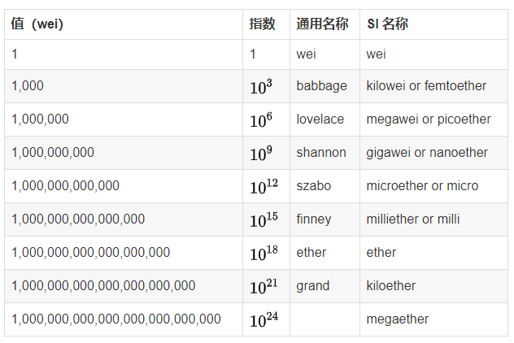

# 以太坊钱包

以太坊钱包是我们进入以太坊系统的门户。它包含了私钥，可以代表我
们创建和广播交易。

• MetaMask：一个浏览器扩展钱包，可在浏览器中运行。

• Jaxx：一款多平台、多币种的钱包，可在各种操作系统上运行，包括
Android， iOS， Windows， Mac 和 Linux。

• MyEtherWallet（MEW）： 一个基于 web 的钱包，可以在任何浏览器中运行。

• Emerald Wallet： 旨在与 ETC 配合使用，但与其他基于以太坊的区块链兼容

# 私钥、公钥和地址

• 私钥（Private Key）

以太坊私钥事实上只是一个 256 位的随机数，用于发送以太的交易
中创建签名来证明自己对资金的所有权。

• 公钥（Public Key）

公钥是由私钥通过椭圆曲线加密 secp256k1 算法单向生成的 512 位
（64 字节）数。

• 地址（Address）

地址是由公钥的 Keccak-256 单向哈希，取最后 20 个字节（160 位）
派生出来的标识符

# 安全须知

• keystore 文件就是加密存储的私钥。所以当系统提示你选择密码时：将其
设置为强密码，备份并不要共享。如果你没有密码管理器，请将其写下来
并将其存放在带锁的抽屉或保险箱中。要访问账户，你必须同时有
keystore 文件和密码。

• 助记词可以导出私钥，所以可以认为助记词就是私钥。请使用笔和纸进行
物理备份。不要把这个任务留给“以后”，你会忘记。
• 切勿以简单形式存储私钥，尤其是以电子方式存储。

• 不要将私钥资料存储在电子文档、数码照片、屏幕截图、在线驱动器、加
密 PDF 等中。使用密码管理器或笔和纸。

• 在转移任何大额金额之前，首先要做一个小的测试交易（例如，小于 1 美
元）。收到测试交易后，再尝试从该钱包发送。

# 安装 MetaMask

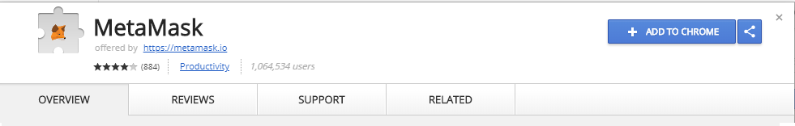

安装 MetaMask 后，应该在浏览器的工具栏中看到一个新图标（狐狸头）。点击它开
始。系统会要求接受条款和条件，然后输入密码来创建新的以太坊钱包

设置密码后， MetaMask 将生成一个钱包，并显示由 12 个英文单词组成的助记符备
份。如果 MetaMask 或计算机出现问题，导致无法打开钱包，我们可以在任何兼容
的钱包中使用这些单词来恢复对资金的访问

### 怎样安全存储助记词

• 将助记词（12 个单词）备份在纸上，两次。

• 将两个纸张备份存放在两个单独的安全位置，例如防火保险箱，锁定抽屉
或保险箱。

• 要将纸质备份视为自己在以太坊钱包中存储的等值现金。任何能够访问这
些单词的人都可以访问并窃取你的资金。

### 显示账户信息

• 一旦确认已安全存储助记符， MetaMask 将显示您的以太
坊帐户详细信息：

——账户名称： Account1

——以太坊地址

——账户余额： 0 ETH

### 助记词

• 助记词是明文私钥的另一种表现形式，最早由 BIP-39 提出，目的是
帮助用户记忆复杂的私钥（256 位）。

• 技术上该提议可以在任意区块链中实现，比如使用完全相同的助记
词在比特币和区块链上生成的地址可以是不同的，用户只需要记住
满足一定规则的词组（就是上面说的助记词），钱包软件就可以基
于该词组创建一些列的账户，并且保障不论是在什么硬件、什么时
间创建出来的账户、公钥、私钥都完全相同，这样既解决了账号识
记的问题，也把账户恢复的门槛降低了很多。

• 支持 BIP39 提议的钱包也可以归类为 HD 钱包（Hierarchical
Deterministic Wallet）， Metamask 当属此类

### 切换网络

• Main Network（Network ID： 1）

主要的、公共的，以太坊区块链。真正的 ETH，真正的价值，真正的结果。

• Ropsten Test Network（Network ID： 3）

以太坊公共测试区块链和网络，使用工作量证明共识（挖矿）。该网络上的 ETH 没
有任何价值。

• Kovan Test Network（Network ID： 42）

以太坊公共测试区块链和网络，使用“Aura”协议进行权威证明 POA 共识（联合签
名）。该网络上的 ETH 没有任何价值。此测试网络仅由 Parity 支持。

• Rinkeby Test Network（Network ID： 4）

以太坊公共测试区块链和网络，使用“Clique”协议进行权威证明 POA 共识（联合签
名）。该网络上的 ETH 没有任何价值。

• Localhost 8545

连接到与浏览器在同一台计算机上运行的节点。该节点可以是任何公共区块链（main
或 testnet）的一部分，也可以是私有 testnet。

• Custom RPC

### 获取测试以太

• 钱包有了，地址有了，接下来需要做的就是为我们的钱包充值。
我们不会在主网络上这样做，因为真正的以太坊需要花钱。

• 以太坊测试网络给了我们免费获取测试以太的途径：水龙头
（ faucet ）

• 现在，我们将尝试把一些测试以太充入我们的钱包

将 MetaMask 切换到 Ropsten 测试网络。单击“Deposit”；然后单击
“Ropsten Test Faucet”。 MetaMask 将打开一个新的网页：

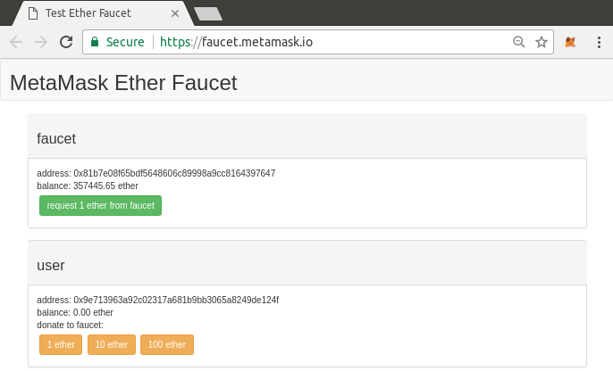

• 按绿色“request 1 ether from faucet”按钮。您将在页面的下半部分看到一
个交易 ID。水龙头应用程序创建了一个交易 - 付款给您。交易 ID 如下所示：

在区块浏览器中查看：

• https://ropsten.etherscan.io/

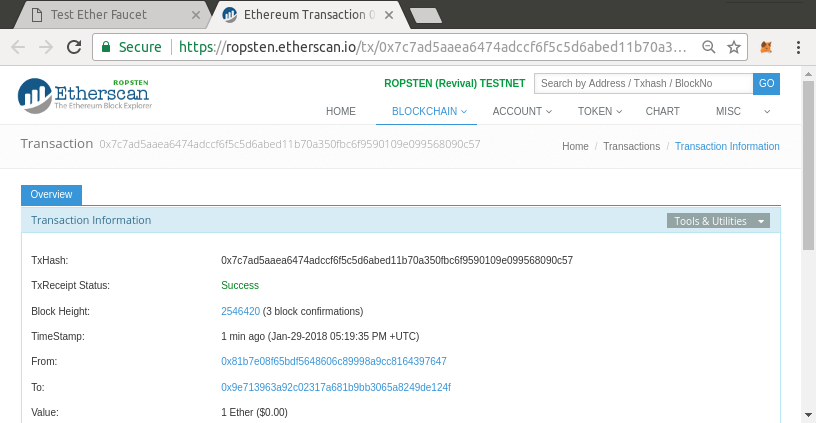

从 MetaMask 发送 Ether

• 单击橙色“1 ether”按钮告诉 MetaMask 创建支付水龙头 1 ether 的交易。
MetaMask 将准备一个交易并弹出一个确认窗口：

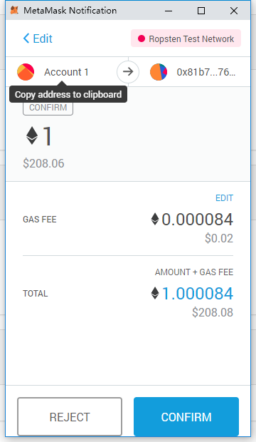

Gas 编辑选项

• Metamask 计算了最近成功交易的平均
gas 价格为 4 GWEI

• 发送基本交易的 gas 成本是 21000 个
gas 单位

• 花费的最大 ETH 量是 4 \* 21000
GWEI = 84000 GWEI = 0.000084ETH

• 做 1 ETH 交易成本为 1.000084 ETH

• 从水龙头请求多一些的以太，如果有 2
个 ETH 的余额，我们就可以再试一次

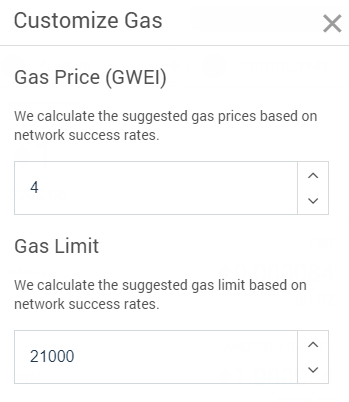

## 搜索地址的交易记录

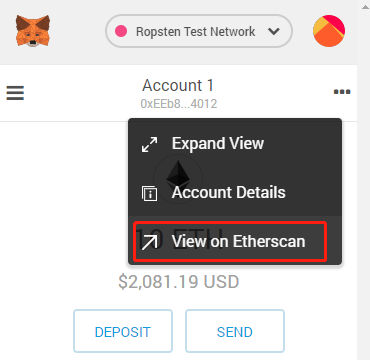

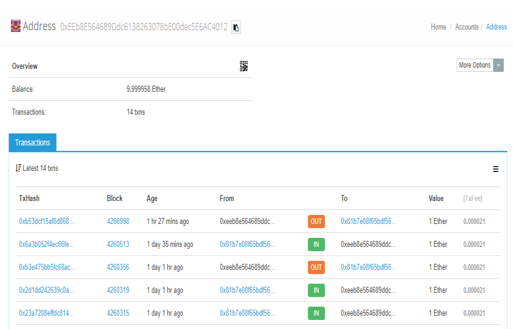

# 获取 Rinkeby 测试以太

Ropsten 是以太坊的主测试网，自然是我们测试练手的首选。不过由于 Robsten 采用与主网完全一样
的 PoW 共识，有时也就会和主网一样拥堵，甚至有过之而无不及。比如前些天 Robsten 测试君士坦丁堡
分叉的时候，一度完全瘫痪，无法发送交易。这时我们可能就需要找别的替代品了。 Rinkey 和 Kovan 采
用的是 PoA 机制，所以出块很快而且很稳定。

现在我们切换到 Rinkby 测试网络，再来看一下如果获取免费的测试以太。
关于在 Rinkeby 的 faucet 上获取测试以太， 社区已经提供了很不错的解决办法。目前发现的免费充
值方法（当然是充值到测试网络中） 主要有两个：

 rinkeby-faucet.com，只要提供账户地址即可充值 0.001 ETH，理论上是可以无限制充值的，
但是如果需要充值 1ETH，需要操作 1000 次，太费劲，建议大家直接使用第 2 种方式；

 faucet.rinkeby.io，可以提供多达 18 ETH （/三天） 的充值金额，但是为了避免被滥用，要求
接受充值的账户持有人必须以太坊账户地址发送到自己的社交网络中（如 Twitter、 Facebook、
Google Plus），同样，该工具限制了充值的频率；

接下来，逐步跟大家介绍下，如何使用 faucet.rinkeby.io 为 Metamask 里面的账户充值 18 ETH。

1. 复制 Metamask 账户的地址。点击小狐狸的图标打开钱包（必要的时候需要输入密码解锁钱包），
   然后点击 "Account 1"把地址复制到剪贴板，如下图：

   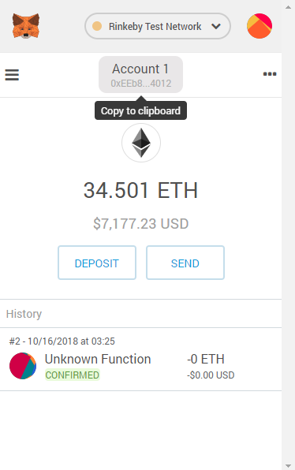

2. 打开 plus.google.com，确保处于登
   面右下角的按钮，准备开始发布新的状态：

3. 把复制到的 Metamask 账户地址粘贴到状态发布输入框里面，然后点击发布：

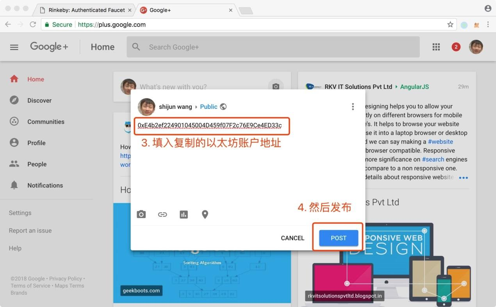

4. 单击新发布状态卡片右上角的分享按钮，会在新标签中打开该状态：

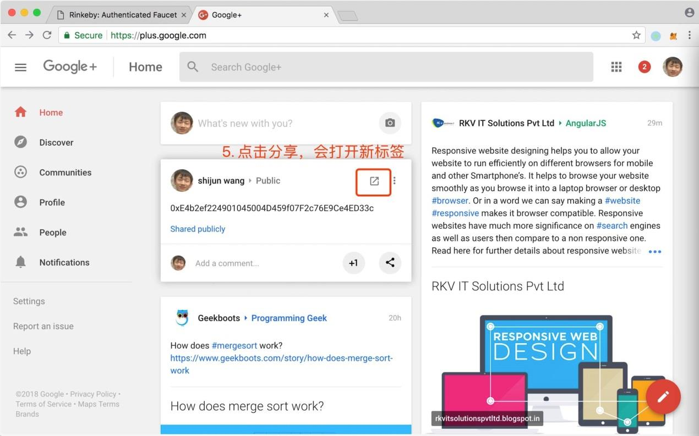

5. 在新标签中复制地址栏中的地址备用：

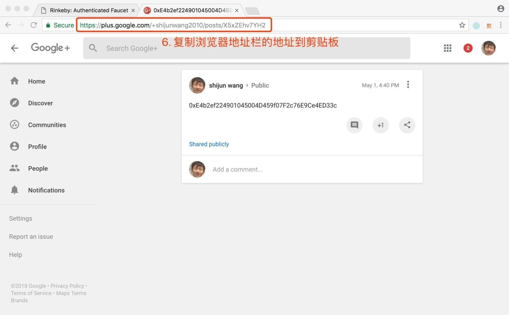

6. 打开 faucet.rinkeby.io，按下图提示操作：

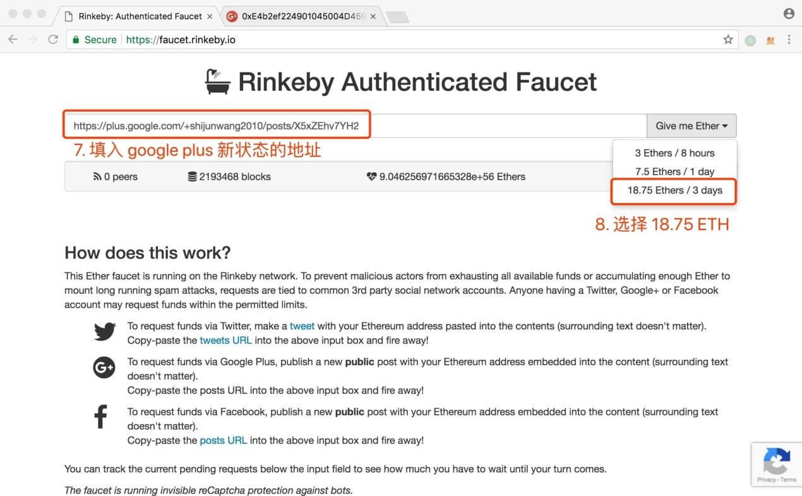

提交充值申请之后，可能会遇到 Google 的图形验证码，按提示操作即可，等待转账完成，可以看到
如下的提示：

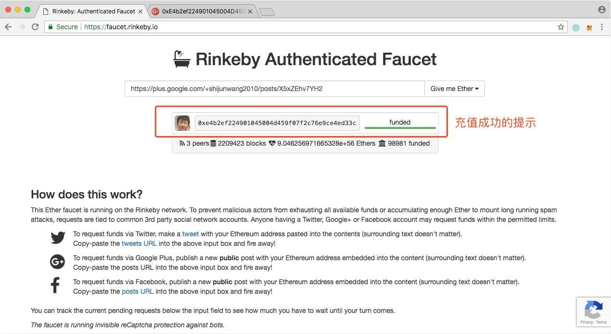

重新打开我们的 Metamask 钱包账户，查看账户余额， 发现还是 0。

可能你会好奇，刚才明明充值成功了，为什么账户余额还是 0 呢？原因是充值操作只发生在 Rinkeby
试网络中，而 Metamask 钱包默认链接的是以太坊主网，还记得主网和测试网络的账号可以还记得主
和测试网络的账号可以通用，但是账户中的数据是完全隔离的么？点击 Metamask 钱包界面左上角的
Main network"，切换到 Rinkeby 测试网络即可。

不出意外，现在可以看到已经有余额了
