#

# 在 Remix 上构建简单的水龙头合约

我们已经创建了一个钱包， 而且接收并发送了以太币。到目前为止，我们看到以太坊和
比特币一样，也可以看作一种加密货币。但以太坊还有更多功能。事实上，加密货币功能服
从于以太坊作为世界计算机的功能; 去中心化的智能合约平台。 Ether 用于支付运行智能合
约的费用，智能合约是在称为以太坊虚拟机（EVM）的模拟计算机上运行的计算机程序

EVM 是一个全局单例，意味着它就像是一个全局的单实例计算机一样运行，无处不在。
以太坊网络上的每个节点都运行 EVM 的本地副本以验证合约执行，而以太坊区块链在处理
交易和智能合约时记录此世界计算机的变化状态

以太坊有许多不同的高级语言，所有这些语言都可用于编写合约并生成 EVM 字节码。
到目前为止，一种高级语言是智能合约编程的主要语言： Solidity。 Solidity 由 Gavin Wood
创建，并已成为以太坊及其他地区使用最广泛的语言。我们将使用 Solidity 编写我们的第
一份合约。

编写水龙头合约

对于我们的第一个例子，我们将编写一个控制水龙头的合约。我们已经在 Ropsten 测
试网络上使用了一个水龙头来测试 ether。水龙头是一件相对简单的事情：它会向任何要求
的地址发出以太，并且可以定期重新填充。 当然，我们可以将水龙头实施为由人（或 Web
服务器）控制的钱包， 不过现在我们的目标是学习智能合约，所以我们将编写实施水龙头的
Solidity 合同：

Faucet.sol：实施水龙头的 Solidity 合同

```
// Version of Solidity compiler this program was written for
pragma solidity ^0.4.19;

// Our first contract is a faucet!
contract Faucet {
// Give out ether to anyone who asks
function withdraw(uint withdraw_amount) public {
// Limit withdrawal amount
require(withdraw_amount <= 100000000000000000);
// Send the amount to the address that requested it
msg.sender.transfer(withdraw_amount);
}
// Accept any incoming amount
function () public payable {}
}
```

这是一个非常简单的合约，尽可能简单。它也是一个有缺陷的合同，表明了一些不良做
法和安全漏洞。我们将通过检查后面部分中的所有缺陷来学习。但就目前而言，让我们一行
一步地看看这份合约的作用及其运作方式。

第一行是注释 ：

```
// Version of Solidity compiler this program was written for
```

注释供人阅读，不包含在可执行 EVM 字节码中。我们通常在我们试图解释的代码之前
将它们放在行上，或者有时在同一行上。注释以两个正斜杠//开头。从斜线到超出的所有内
容，直到该行的结尾，都被视为空行并被忽略。

好的，下一行是我们实际合同开始的地方：

```
contract Faucet {
```

该行声明了一个合约对象， 类似于其他面向对象语言（如 JavaScript， Java 或 C ++）
中的类声明。合约定义包括定义范围的花括号{}之间的所有行，就像在许多其他编程语言中
使用花括号一样。

接下来，我们声明水龙头合约的第一个功能：

```
function withdraw(uint withdraw_amount) public {
```

该函数名为 withdraw，它接受一个名为 withdraw_amount 的无符号整数（uint）参
数。它被声明为公共函数，这意味着它可以被其他合约调用。函数定义遵循花括号：

```
require(withdraw_amount <= 100000000000000000);
```

提现功能的第一部分设定了提款限额。它使用内置的 Solidity 函数 require 来测试一个
前提条件，即 withdraw_amount 小于或等于 100000000000000000 wei，这是 ether 的
基本单位，相当于 0.1 ether。如果使用大于该数量的 withdraw_amount 调用 withdraw
函数，则此处的 require 函数将导致合约执行停止并因异常而失败

这部分合约是我们水龙头的主要逻辑。它通过限制提款来控制合约之外的资金流动。这
是一个非常简单的控制，但可以让你一瞥可编程区块链的力量：控制资金的去中心化软件。

接下来是实际提现：

```
msg.sender.transfer（withdraw_amount） ;
```

这里有一些神奇的东西： msg 对象， 这是所有合约都可以访问的输入之一。它表示触
发此合约执行的交易。属性 sender 是交易的发件人地址。函数传递是一个内置函数，它将
以太从合约传递到调用它的地址。向后读，这意味着转移到触发此合约执行的 msg 的发送
者。传递函数将金额作为其唯一参数。我们将 withdraw_amount 值作为参数传递给上面
几行声明的 withdraw 函数。

下一行是结束大括号，表示我们的 withdraw 函数定义的结束。

下面我们再声明一个功能：

```
function () public payable {}
```

此函数是所谓的“回退” 或默认函数，如果触发合约的交易未命名合约中的任何已声明
函数或任何函数或未包含数据，则调用此函数。合约可以有一个这样的默认函数（没有名称），
它通常是接收以太的函数。这就是为什么它被定义为公共和默认函数，这意味着它可以接受
以太合约。除了接受以太之外，它没有做任何事情，如花括号{}中的空定义所示。如果我们
创建一个将 ether 发送到合约地址的交易，就好像它是钱包一样，这个函数将处理它。

在我们的默认函数下面是最后的结束花括号，它表示了合约 Faucet 的定义结束

# 编译水龙头合约

现在我们有了第一个示例合约，我们需要使用 Solidity 编译器将 Solidity 代码转换为
EVM 字节码，因此它可以由 EVM 执行。

Solidity 编译器作为独立的可执行文件，作为不同框架的一部分，也捆绑在集成开发环
境（IDE）中。为了简单起见，我们将使用一种比较流行的 IDE，称为 Remix

Remix 是以太坊社区开发并开源的、一款非常好用的在线 Solidity 集成开发环境， 我
们可以方便的在其中编写、部署、测试智能合约， Remix 提供了强大的自动完成，语法高
亮，实时编译检查错误等。

使用 Chrome 浏览器导航到 Remix IDE：
https://remix.ethereum.org/

接下来，我们使用 Remix 开发和调试第一个智能合约，初始界面如下图：

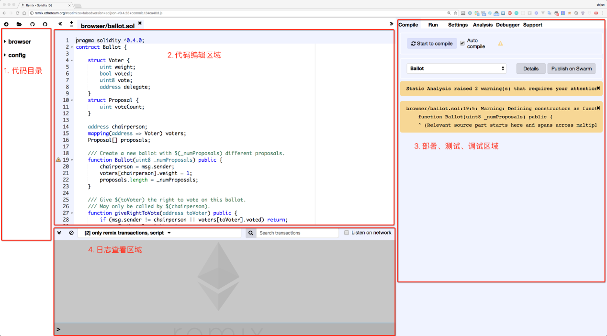

默认的界面可以划分为 4 个区域：

 文件目录：这里有新建文件、从本地打开文件等按钮，可以直观的看到当前编辑过
哪些合约文件，以及删除、重命名这些文件；

 代码编辑：是使用频繁的区域，提供了语法高亮、自动完成等功能，左上角的加号
和减号可以调整编辑器字体，即使刷新浏览器这些代码也不会丢失，因为 Remix
把配置和源代码都保存在了浏览器的 LocalStorage 里面；

 调试工具：是使用频繁的区域，提供了智能合约的编译、运行、单步调试、编译器
选项配置等功能；

 调试输出：会打印出所有测试活动产生的日志，比如部署智能合约，调用智能合约
函数过程中的各种交易； 除了代码区域之外的 3 个区域都是可以折叠起来的，点
击要折叠的区域和代码区域相邻边上的双尖括号即可实现折叠。

第一次加载 Remix 时，它将以一个名为 ballot.sol 的示例合约开始。我们不需要它，
所以让我们关闭它，点击选项卡一角的 x：

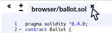

现在，通过单击左侧工具栏中的圆形加号，添加一个新选项卡，命名新文件 Faucet.sol：

打开新选项卡后，复制并粘贴我们的示例 Faucet.sol 中的代码

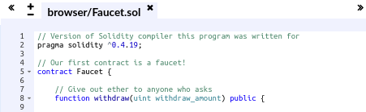

现在我们已经将 Faucet.sol 合约加载到 Remix IDE 中， IDE 将自动编译代码。如果一
切顺利，你会在右侧的 Compile 选项卡下看到一个带有“Faucet” 的绿色框，确认编译成
功：

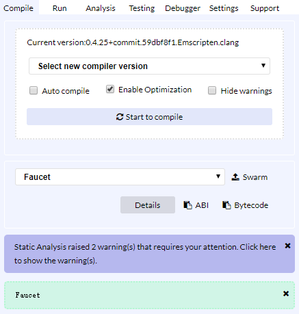

如果出现问题，最可能的问题是 Remix IDE 使用的是与 0.4.19 不同的 Solidity 编译器
版本。在这种情况下，我们的 pragma 指令将阻止 Faucet.sol 编译。要更改编译器版本，
点击“设置” 选项卡，将编译器版本设置为 0.4.19，然后重试。

Solidity 编译器现在已将 Faucet.sol 编译为 EVM 字节码。如果你很好奇，字节码看起
来像这样：

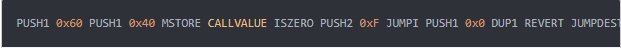

看到这么反人类的字节码，是不是很高兴我们可以使用 Solidity 等高级语言而不是直
接在 EVM 字节码中编程？

# 在区块链上创建合同

所以我们写了合约。我们把它编译成字节码。现在，我们需要在以太坊区块链上“注册”
合约。我们将使用 Ropsten 测试网来测试我们的合约，这就是我们想要记录的区块链。

在区块链上注册合约涉及创建一个特殊交易，其目的地是一个“零地址”，也就是地址
为： 0x0000000000000000000000000000000000000000。零地址是一个特殊地址，告
诉以太坊区块链我们想要注册合约。 不过我们不需要手动输入这么多个 0， Remix IDE 将为
我们处理所有这些并将交易发送到 MetaMask。

首先，切换到“Run” 选项卡，然后在“Environment” 下拉选择框中选择“Injected
Web3” 。这将 Remix IDE 连接到 MetaMask 钱包，并通过 MetaMask 连接到 Ropsten
测试网络。一旦你这样做，你可以在环境下看到“Ropsten” 。此外，在帐户选择框中，它
显示你的钱包的地址：

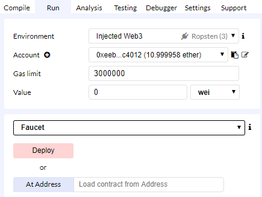

在我们刚刚确认的“Run” 设置的正下方，是水龙头合约，准备好了。单击“Deploy”
按钮:

Remix IDE 将构建特殊的“Create” 交易， MetaMask 将要我们批准它。正如从
MetaMask 中看到的那样，合约创建交易中发送 0 个以太，但它有 224 个字节（已编译的
合约）并将消耗余额 0.000312 以太的 gas 费用。点击“Confirm” 批准它：

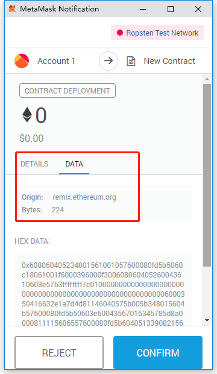

现在， 稍微等一下：在 Ropsten 上部署合约大约需要 15 到 30 秒。 还记得 Ropsten
采用什么共识机制吗？它和主网完全一样采用了 PoW 的机制，出块的时间大概是 15 秒。

创建合约后，它将显示在“Run” 选项卡的底部：

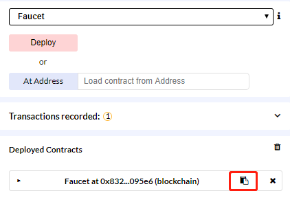

请注意，水龙头合约现在有一个自己的地址： Remix 将其显示为 Faucet，位于 0x832 ....
095e6。右侧的小剪贴板符号允许你将合约地址复制到剪贴板中。我们将在下一节中使用它。

另外如果细心我们可以在控制台 log 中看到，交易成功发送，我们可以用这里的链接到 etherscan 上查询

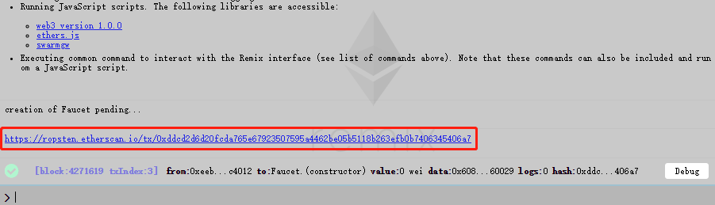

# 与合约交互

让我们回顾一下迄今为止我们学到的东西：以太坊合约是控制资金的程序，它在称为
EVM 的虚拟机内运行。它们由特殊交易创建，该交易提交其字节码以记录在区块链上。一
旦他们在区块链上创建，他们就有了一个以太坊地址，就像钱包一样。只要有人将某个交易
发送到合约地址，就会导致合约在 EVM 中运行，并将该合约作为其输入。

发送到合约地址的交易可能包含 ether 或数据或两者。如果它们含有 ether，则将其“存
入” 合约余额。如果它们包含数据，则数据可以在合约中指定命名函数并调用它，将参数传
递给函数

## 在区块浏览器中查看合同地址

现在，我们已经在 Ropsten 区块链上记录了一份合约，我们可以看到它有一个以太坊
地址。让我们在 ropsten.etherscan.io 区块浏览器上查看它，看看合约是什么样的。

在一个标签中打开 Remix，稍后我们会再次回顾它。现在，将浏览器导航到
ropsten.etherscan.io 并将地址粘贴到搜索框中。你应该看到合约的以太坊地址历史：

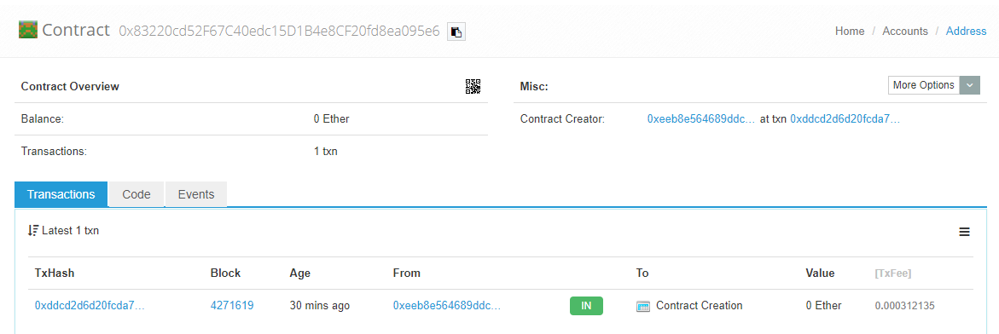

# 资助合约

目前，合约在其历史记录中只有一个交易：合约创建交易。 我们刚才在 etherscan 上
也看到了，合约也还没有以太（零余额）。那是因为我们没有在创建交易中向合约发送任何
以太，当然这本来是可以的。

那就让我们现在给合约发一些以太。 你仍然应该在剪贴板中包含合约的地址（如果没有，
从 Remix 再次复制）。打开 MetaMask，并向其发送 1 个以太，就像你发送给其他任何以
太坊地址一样：

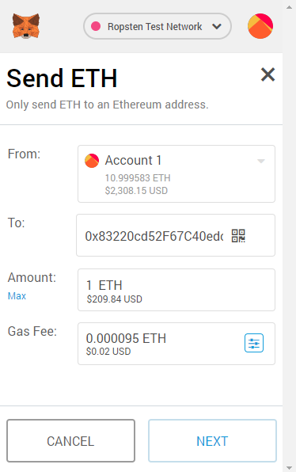

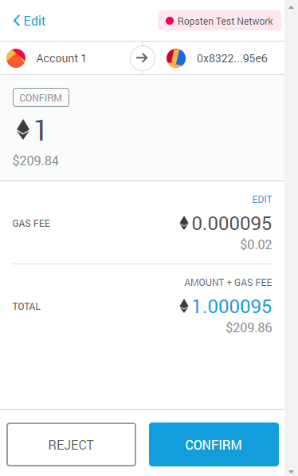

在一分钟内，如果你重新加载 etherscan 区块资源管理器，它将显示合约地址的另一
个交易以及 1 个以太网的更新余额。

还记得我们的 Faucet.sol 代码中未命名的默认公共应付款功能吗？它看起来像这样：

```
function () public payable {}
```

当你将交易发送到合同地址时，没有数据指定要调用的函数，它会调用此默认函数。因
为我们将其声明为应付款，所以它接受并将 1 以太币存入合约账户余额。你的交易导致合
约在 EVM 中运行，更新其余额。我们已经顺利资助了我们的水龙头！

# 提现我们的合约

接下来，让我们从水龙头中提取一些资金。要提现，我们必须构造一个调用 withdraw
函数的交易，并将 withdraw_amount 参数传递给它。为了使事情变得简单， Remix 将为
我们构建该交易， MetaMask 将提供它以供我们批准

返回 Remix 选项卡，查看“Run” 选项卡下的合约。你应该看到一个标有“Withdraw”
的红色框，其中包含一个标记为 uint256 withdraw_amount 的字段条目：

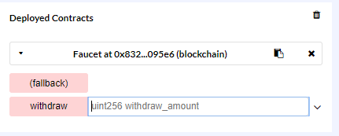

这是合约的 Remix 接口。它允许我们构造调用合约中定义的函数的交易。我们将输入
withdraw_amount 并单击“Withdraw” 按钮以生成交易。

首先，让我们弄清一下 withdraw_amount。我们想尝试提现 0.1 以太，这是我们合约
允许的最大金额。请记住，以太坊中的所有货币值都在内部以 wei 表示，而我们的提现功
能期望 withdraw_amount 也以 wei 计价。我们想要的数量是 0.1 以太， 这是 100000000000000000 wei（1 后跟 17 个零）

由于 JavaScript 的限制， Remix 无法处理大到 10 ^ 17 的数字。相反，我们将它括在
双引号中，以允许 Remix 将其作为字符串接收并将其作为 BigNumber 进行操作。如果
我们不将它括在引号中，则 Remix IDE 将无法处理它并显示“Error encoding arguments：
Error： Assertion failed”， 好在 Remix 会帮我们做自动转换

在 withdraw_amount 框中键入 100000000000000000，然后单击“Withdraw” 按
钮

MetaMask 将弹出一个交易窗口供你批准。点击“Confirm” 将你的提款调用发送给
合约

等一下，然后重新加载 etherscan 区块资源管理器，以查看在水龙头合约地址历史记
录中的交易：

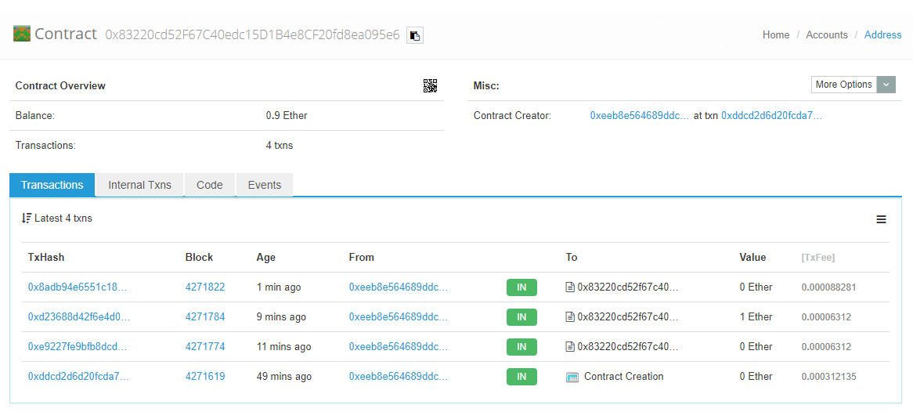

我们现在看到一个新的交易，其中合约地址为目的地，零以太。合约余额已经改变，现
在是 0.9 以太，因为它按要求向我们发送了 0.1 以太。但我们在合约地址历史记录中看不到 “OUT” 交易

提现的地方在哪里？合约的地址历史记录页面中出现了一个新选项卡，名为“Internal
Transactions” 。因为 0.1 以太传输源自合约代码，所以它是内部交易（也称为消息）。单
击“Internal Transactions” 选项卡以查看它：

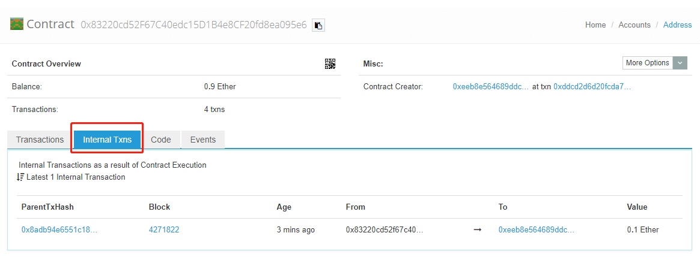

这个“Internal Transactions” 是由合约在这行代码中发出的（来自 Faucet.sol 中的
提现功能）：

```
msg.sender.transfer（withdraw_amount） ;
```

回顾一下：我们从 MetaMask 钱包发送 了一 个包含数据指令的交易，调用
withdraw_amount 参数为 0.1 ether 的 withdraw 函数； 该交易导致合约在 EVM 内部运
行， 当 EVM 运行水龙头合约的提现功能时，首先它调用 require 函数并验证我们的金额小
于或等于允许的最大提现 0.1 以太；然后它调用传递函数向我们发送以太， 运行转账功能会
产生一个内部交易，从合约的余额中将 0.1 以太币存入我们的钱包地址； 这就是 etherscan
中“内部交易” 选项卡中显示的那笔交易。
