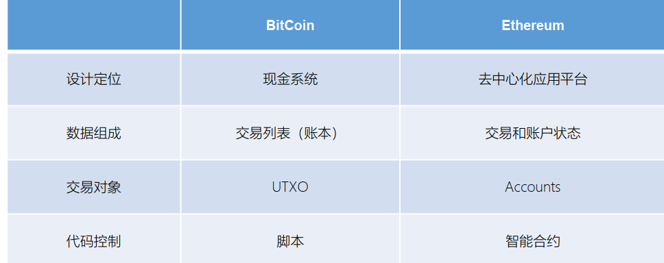

#

# 用 Geth 搭建以太坊私链

# 安装 Geth

安装 Geth 有很多种方式，这里主要就 Linux 环境给出两种：系统包管理器（apt-get）安装和源码安
装。更加推荐大家用源码安装，在整个过程中可以看到 Geth 各组件的构建步骤。

一、 apt-get

```
$ sudo apt-get install software-properties-common
$ sudo add-apt-repository -y ppa:ethereum/ethereum
$ sudo apt-get update
$ sudo apt-get install ethereum
```

二、源码安装

1. 克隆 github 仓库

我们的第一步是克隆 git 仓库，以获取源代码的副本

```
$ git clone https://github.com/ethereum/go-ethereum.git
```

2. 从源码构建 Geth

要构建 Geth，切换到下载源代码的目录并使用 make 命令：

```
$ cd go-ethereum
$ make geth
```

如果一切顺利， 我们将看到 Go 编译器构建每个组件，直到它生成 geth 可执行文件：

```
build/env.sh go run build/ci.go install ./cmd/geth
>>> /usr/local/go/bin/go install -ldflags -X
main.gitCommit=58a1e13e6dd7f52a1d5e67bee47d23fd6cfdee5c -v ./cmd/geth
github.com/ethereum/go-ethereum/common/hexutil
github.com/ethereum/go-ethereum/common/math
github.com/ethereum/go-ethereum/crypto/sha3 github.com/ethereum/go-ethereum/rlp
github.com/ethereum/go-ethereum/crypto/secp256k1
github.com/ethereum/go-ethereum/common [...]
github.com/ethereum/go-ethereum/cmd/utils
github.com/ethereum/go-ethereum/cmd/geth Done building. Run "build/bin/geth" to
launch geth
```

查看 geth version， 确保在真正运行之前安装正常：

```
$ ./build/bin/geth version
Geth
Version: 1.8.0-unstable
Git Commit: e37f7be97e47a032d723db16d8b195998547805a
Architecture: amd64
Protocol Versions: [63 62]
Network Id: 1
Go Version: go1.9
Operating System: linux
GOPATH=/home/ubuntu/project
GOROOT=/usr/local/go
```

# 启动节点同步

安装好了 Geth，现在我们可以尝试运行一下它。执行下面的命令， geth 就会开始同步区块，并存储
在当前目录下。这里的 --syncmode fast 参数表示我们会以“快速”模式同步区块。在这种模式下，我
们只会下载每个区块头和区块体，但不会执行验证所有的交易，直到所有区块同步完毕再去获取一个系统
当前的状态。这样就节省了很多交易验证的时间。

```
$ geth –datadir . --syncmode fast
```

通常，在同步以太坊区块链时，客户端会一开始就下载并验证每个块和每个交易，也就是说从创世区
块开始。 毫无疑问，如果我们不加 --syncmode fast 参数， 同步将花费很长时间并且具有很高的资源要
求（它将需要更多的 RAM，如果你没有快速存储，则需要很长时间）。

有些文章会把这个参数写成 --fast，这是以前快速同步模式的参数写法，现在已经被 –syncmode fast
取代

如果我们想同步测试网络的区块，可以用下面的命令

```
$ geth --testnet --datadir . --syncmode fast
```

--testnet 这个参数会告诉 geth 启动并连接到最新的测试网络， 也就是 Ropsten。测试网络的区块
和交易数量会明显少于主网，所以会更快一点。但即使是用快速模式同步测试网络，也会需要几个小时的
时间。

# 搭建自己的私有链

因为公共网络的区块数量太多，同步耗时太长，我们为了方便快速了解 Geth，可以试着用它来搭一个
只属于自己的私链。

首先，我们需要创建网络的“创世”（genesis）状态，这写在一个小小的 JSON 文件里（例如， 我们
将其命名为 genesis.json）：

```
{
"config": {
"chainId": 15
},
"difficulty": "2000",
"gasLimit": "2100000",
"alloc": {
"7df9a875a174b3bc565e6424a0050ebc1b2d1d82": { "balance": "300000" },
"f41c74c9ae680c1aa78f42e5647a62f353b7bdde": { "balance": "400000" }
}
}
```

要创建一条以它作为创世块的区块链，我们可以使用下面的命令

```
要创建一条以它作为创世块的区块链，我们可以使用下面的命令
```

在当前目录下运行 geth，就会启动这条私链，注意要将 networked 设置为与创世块配置里的
chainId 一致

```
geth --datadir path/to/custom/data/folder --networkid 15
```

我们可以看到节点正常启动：

```
WARN [10-23|02:38:19] No etherbase set and no accounts found as default
INFO [10-23|02:38:19] Starting peer-to-peer node
instance=Geth/v1.8.0-unstable-e37f7be9/linux-amd64/go1.9
…
INFO [10-23|02:38:21] IPC endpoint opened:
/home/ubuntu/project/go_ethereum_test/geth.ipc
INFO [10-23|02:38:21] Mapped network port proto=tcp
extport=30303 intport=30303 interface="UPNP IGDv1-IP1
```

# Geth 控制台命令

Geth Console 是一个交互式的 JavaScript 执行环境， 里面内置了一些用来操作以太坊的 JavaScript
对象， 我们可以直接调用这些对象来获取区块链上的相关信息。这些对象主要包括：

eth： 主要包含对区块链进行访问和交互相关的方法；

net： 主要包含查看 p2p 网络状态的方法；

admin： 主要包含与管理节点相关的方法；

miner： 主要包含挖矿相关的一些方法；

personal：包含账户管理的方法；

txpool：包含查看交易内存池的方法；

web3：包含以上所有对象，还包含一些通用方法。

常用命令有：

personal.newAccount()：创建账户；

personal.unlockAccount()：解锁账户；

eth.accounts： 列出系统中的账户；

eth.getBalance()：查看账户余额，返回值的单位是 Wei；

eth.blockNumber：列出当前区块高度；

eth.getTransaction()：获取交易信息；

eth.getBlock()：获取区块信息；

miner.start()：开始挖矿；

miner.stop()：停止挖矿；

web3.fromWei()： Wei 换算成以太币；

web3.toWei()：以太币换算成 Wei；

txpool.status：交易池中的状态；

# 以太坊账户

### 从 UTXO 谈起

• 比特币在基于 UTXO 的结构中存储有关用户余额的数据：系统的整个
状态就是一组 UTXO 的集合，每个 UTXO 都有一个所有者和一个面值
（就像不同的硬币） ， 而交易会花费若干个输入的 UTXO， 并根据规
则创建若干个新的 UTXO：

• 每个引用的输入必须有效且尚未花费；对于一个交易， 必须包含有与
每个输入的所有者匹配的签名；总输入必须大于等于总输出值

• 所以，系统中用户的余额（balance） 是用户具有私钥的 UTXO 的总
值

### 以太坊的做法

• 以太坊的“状态”，就是系统中所有帐户的列表
• 每个账户都包括了一个余额（balance），和以太坊特殊定义的数据
（代码和内部存储）

• 如果发送帐户有足够的余额来支付，则交易有效；在这种情况下发送
帐户先扣款，而收款帐户将记入这笔收入

• 如果接收帐户有相关代码，则代码会自动运行，并且它的内部存储也
可能被更改，或者代码还可能向其他帐户发送额外的消息，这就会导
致进一步的借贷资金关系

### 优缺点比较

比特币 UTXO 模式优点：

• 更高程度的隐私：如果用户为他们收到的每笔交易使用新地址，那么
通常很难将帐户相互链接。这很大程度上适用于货币，但不太适用于
任意 dapps，因为 dapps 通常涉及跟踪和用户绑定的复杂状态，可能不
存在像货币那样简单的用户状态划分方案。

• 潜在的可扩展性： UTXO 在理论上更符合可扩展性要求。 因为我们只
需要依赖拥有 UTXO 的那些人去维护基于 Merkle 树的所有权证明就够
了，即使包括所有者在内的每个人都决定忘记该数据，那么也只有所
有者受到对应 UTXO 的损失，不影响接下来的交易。 而在帐户模式中，
如果每个人都丢失了与帐户相对应的 Merkle 树的部分， 那将会使得和
该帐户有关的消息完全无法处理，包括发币给它

以太坊账户模式优点：

• 可以节省大量空间：不将 UTXOs 分开存储，而是合为一个账户；每
个交易只需要一个输入、一个签名并产生一个输出。

• 更好的可替代性：货币本质上都是同质化、可替代的； UTXO 的设计
使得货币从来源分成了“可花费”和“不可花费”两类，这在实际应
用中很难有对应的模型。

• 更加简单：更容易编码和理解，特别是设计复杂脚本的时候。 UTXO
在脚本逻辑复杂时更令人费解。

• 便于维护持久轻节点：只要沿着特定方向扫描状态树，轻节点可以很
容易地随时访问账户相关的所有数据。而 UTXO 的每个交易都会使得
状态引用发生改变，这对轻节点来说长时间运行 Dapp 会有很大压力

比特币和以太坊的对比



### 以太坊账户类型

• 外部账户 (Externally owned account, EOA )

• 合约账户 (Contract accounts)

#### EOA

外部账户（用户账户/普通账户）

• 有对应的以太币余额

• 可发送交易（转币或触发合约代码）

• 由用户私钥控制

• 没有关联代码

#### 合约账户

外部账户（用户账户/普通账户）

• 有对应的以太币余额

• 有关联代码

• 由代码控制

• 可通过交易或来自其它合约的调用消息来触发代
码执行

• 执行代码时可以操作自己的存储空间，也可以调
用其它合约


## 以太坊交易（Transaction）

签名的数据包，由 EOA 发送到另一个账户

• 消息的接收方地址

• 发送方签名

• 金额（VALUE）

• 数据（DATA，可选）

• START GAS

• GAS PRICE

#### 消息（Message）

-- 合约可以向其它合约发送“消息”

-- 消息是不会被序列化的虚拟对象，只存在于以太坊执行环境
（EVM）中

-- 可以看作函数调用

• 消息发送方

• 消息接收方

• 金额（VALUE）

• 数据（DATA，可选）

• START GAS

#### 合约（Contract）

• 可以读/写自己的内部存储（32 字节 key-value 的
数据库）

• 可向其他合约发送消息，依次触发执行

• 一旦合约运行结束，并且由它发送的消息触发的
所有子执行（sub-execution）结束， EVM 就会中
止运行，直到下次交易被唤醒

#### 合约应用一

• 维护一个数据存储（账本），存放对其他合约或外部世界有用的内容

• 最典型的例子是模拟货币的合约（代币）

#### 合约应用二

• 通过合约实现一种具有更复杂的访问策略的普通账户（EOA），
这被称为“转发合同”：只有在满足某些条件时才会将传入的消息
重新发送到某个所需的目的地址；例如，一个人可以拥有一份转
发合约，该合约会等待直到给定三个私钥中的两个确认之后，再
重新发送特定消息

• 钱包合约是这类应用中很好的例子

#### 合约应用三

• 管理多个用户之间的持续合同或关系

• 这方面的例子包括金融合同，以及某些特定的托管合同或某种保险

# 以太坊交易详解

### 交易的本质

• 交易是由外部拥有的账户发起的签名消息，由以太坊网络传输，并被
序列化后记录在以太坊区块链上。

• 交易是唯一可以触发状态更改或导致合约在 EVM 中执行的事物。

• 以太坊是一个全局单例状态机，交易是唯一可以改变其状态的东西。

• 合约不是自己运行的，以太坊也不会“在后台”运行。以太坊上的一
切变化都始于交易

### 交易数据结构

交易是包含以下数据的序列化二进制消息：

• nonce：由发起人 EOA 发出的序列号，用于防止交易消息重播。

• gas price：交易发起人愿意支付的 gas 单价（wei）。

• start gas：交易发起人愿意支付的最大 gas 量。

• to：目的以太坊地址。

• value：要发送到目的地的以太数量。

• data：可变长度二进制数据负载（payload）。

• v,r,s：发起人 EOA 的 ECDSA 签名的三个组成部分。

• 交易消息的结构使用递归长度前缀（RLP）编码方案进行序列化，该方案
专为在以太坊中准确和字节完美的数据序列化而创建。

### 交易中的 nonce

• 黄皮书定义： 一个标量值，等于从这个地址发送的交易数，或者对于关联
code 的帐户来说，是这个帐户创建合约的数量。

• nonce 不会明确存储为区块链中帐户状态的一部分。相反，它是通过计算发
送地址的已确认交易的数量来动态计算的。

• nonce 值还用于防止错误计算账户余额。 nonce 强制来自任何地址的交易按
顺序处理，没有间隔，无论节点接收它们的顺序如何。

• 使用 nonce 确保所有节点计算相同的余额和正确的序列交易，等同于用于防
止比特币“双重支付”（“重放攻击”）的机制。但是，由于以太坊跟踪
账户余额并且不单独跟踪 UTXO ，因此只有在错误地计算账户余额时才会
发生“双重支付”。 nonce 机制可以防止这种情况发生

### 并发和 nonce

• 以太坊是一个允许操作（节点，客户端， DApps）并发的系统，但强制执
行单例状态。例如，出块的时候只有一个系统状态。

• 假如我们有多个独立的钱包应用或客户端，比如 MetaMask 和 Geth，它们
可以使用相同的地址生成交易。如果我们希望它们都够同时发送交易，该
怎么设置交易的 nonce 呢？

• 用一台服务器为各个应用分配 nonce，先来先服务——可能出现单点故障，
并且失败的交易会将后续交易阻塞。

• 生成交易后不分配 nonce，也不签名，而是把它放入一个队列等待。另起一
个节点跟踪 nonce 并签名交易。同样会有单点故障的可能，而且跟踪 nonce
和签名的节点是无法实现真正并发的

### 交易中的 gas

• 当由于交易或消息触发 EVM 运行时，每个指令都会在网络的每个节点上
执行。这具有成本：对于每个执行的操作， 都存在固定的成本， 我们把这
个成本用一定量的 gas 表示。

• gas 是交易发起人需要为 EVM 上的每项操作支付的成本名称。 发起交易时，
我们需要从执行代码的矿工那里用以太币购买 gas 。

• gas 与消耗的系统资源对应， 这是具有自然成本的。 因此在设计上 gas 和
ether 有意地解耦， 消耗的 gas 数量代表了对资源的占用，而对应的交易费
用则还跟 gas 对以太的单价有关。 这两者是由自由市场调节的： gas 的价
格实际上是由矿工决定的，他们可以拒绝处理 gas 价格低于最低限额的交
易。 我们不需要专门购买 gas ，只需将以太币添加到帐户即可， 客户端在
发送交易时会自动用以太币购买汽油。而以太币本身的价格通常由于市场
力量而波动。

### gas 的计算

• 发起交易时的 gas limit 并不是要支付的 gas 数量，而只是给定了一个
消耗 gas 的上限，相当于“押金”

• 实际支付的 gas 数量是执行过程中消耗的 gas （gasUsed）， gas
limit 中剩余的部分会返回给发送人

• 最终支付的 gas 费用是 gasUsed 对应的以太币费用，单价由设定的
gasPrice 而定

• 最终支付费用 totalCost = gasPrice \* gasUsed

• totalCost 会作为交易手续费（Tx fee）支付给矿工

### 交易的接收者（to）

• 交易接收者在 to 字段中指定，是一个 20 字节的以太坊地址。地址可以
是 EOA 或合约地址。

• 以太坊没有进一步的验证，任何 20 字节的值都被认为是有效的。如果
20 字节值对应于没有相应私钥的地址，或不存在的合约，则该交易仍
然有效。以太坊无法知道地址是否是从公钥正确派生的。

• 如果将交易发送到无效地址，将销毁发送的以太，使其永远无法访问。

• 验证接收人地址是否有效的工作，应该在用户界面一层完成

### 交易的 value 和 data

• 交易的主要“有效负载”包含在两个字段中： value 和 data。交易可
以同时有 value 和 data，仅有 value，仅有 data，或者既没有 value
也没有 data。所有四种组合都有效。

• 仅有 value 的交易就是一笔以太的付款

• 仅有 data 的交易一般是合约调用

• 进行合约调用的同时，我们除了传输 data， 还可以发送以太，从而交
易中同时包含 data 和 value

• 没有 value 也没有 data 的交易，只是在浪费 gas，但它是有效的

### 向 EOA 或合约传递 data

• 当交易包含数据有效负载时，它很可能是发送到合约地址的，但它同样可
以发送给 EOA

• 如果发送 data 给 EOA，数据负载（data payload） 的解释取决于钱包

• 如果发送数据负载给合约地址， EVM 会解释为函数调用，从 payload 里解
码出函数名称和参数，调用该函数并传入参数

• 发送给合约的数据有效负载是 32 字节的十六进制序列化编码：
——函数选择器：函数原型的 Keccak256 哈希的前 4 个字节。这允许
EVM 明确地识别将要调用的函数。
——函数参数：根据 EVM 定义的各种基本类型的规则进行编码。

### 特殊交易：创建（部署）合约

• 有一中特殊的交易，具有数据负载且没有 value，那就是一个创建新
合约的交易。

• 合约创建交易被发送到特殊目的地地址，即零地址 0x0。该地址既不
代表 EOA 也不代表合约。它永远不会花费以太或发起交易，它仅用
作目的地，具有特殊含义“创建合约”。

• 虽然零地址仅用于合同注册，但它有时会收到来自各种地址的付款。
这种情况要么是偶然误操作，导致失去以太；要么是故意销毁以太。

• 合约注册交易不应包含以太值，只包含合约的已编译字节码的数据有
效负载。此交易的唯一效果是注册合约

# 以太坊虚拟机（EVM）简介

### 以太坊虚拟机（EVM）

• 以太坊虚拟机 EVM 是智能合约的运行环境

• 作为区块验证协议的一部分， 参与网络的每个节点都会运行
EVM。他们会检查正在验证的块中列出的交易，并运行由
EVM 中的交易触发的代码

• EVM 不仅是沙盒封装的，而且是完全隔离的，也就是说在
EVM 中运行的代码是无法访问网络、文件系统和其他进程的，
甚至智能合约之间的访问也是受限的

• 合约以字节码的格式（EVM bytecode）存在于区块链上

• 合约通常以高级语言（solidity）编写，通过 EVM 编译器编译
为字节码，最终通过客户端上载部署到区块链网络中

### 以太坊虚拟机（EVM）

• 以太坊虚拟机 EVM 是智能合约的运行环境

• 作为区块验证协议的一部分， 参与网络的每个节点都会运行
EVM。他们会检查正在验证的块中列出的交易，并运行由
EVM 中的交易触发的代码

• EVM 不仅是沙盒封装的，而且是完全隔离的，也就是说在
EVM 中运行的代码是无法访问网络、文件系统和其他进程的，
甚至智能合约之间的访问也是受限的

• 合约以字节码的格式（EVM bytecode）存在于区块链上

• 合约通常以高级语言（solidity）编写，通过 EVM 编译器编译
为字节码，最终通过客户端上载部署到区块链网络中

### EVM 和交易

• 交易可以看作是从一个帐户发送到另一个帐户的消息，它
可以包含二进制数据（payload）和以太币

• 如果目标账户含有代码，此代码会在 EVM 中执行，并以
payload 作为入参，这就是合约的调用

• 如果目标账户是零账户（账户地址为 0 )，此交易就将创建
一个 新合约 ，这个用来创建合约的交易的 payload 会被
转换为 EVM 字节码并执行，执行的输出作为合约代码永
久存储

### EVM 和 gas

• 合约被交易触发调用时，指令会在全网的每个节点上执行：这需要消
耗算力成本；每一个指令的执行都有特定的消耗， gas 就用来量化表
示这个成本消耗

• 一经创建，每笔交易都按照一定数量的 gas 预付一笔费用， 目的是限
制执行交易所需要的工作量和为交易支付手续费

• EVM 执行交易时， gas 将按特定规则逐渐耗尽

• gas price 是交易发送者设置的一个值，作为发送者预付手续费的单
价。 如果交易执行后还有剩余， gas 会原路返还

• 无论执行到什么位置，一旦 gas 被耗尽（比如降为负值），将会触发
一个 out-of-gas 异常。当前调用帧（call frame）所做的所有状态修改
都将被回滚

### EVM 数据存储

Storage

• 每个账户都有一块持久化的存储空间，称为 storage，这是一个将 256 位字映射到 256 位字的
key-value 存储区，可以理解为合约的数据库

• 永久储存在区块链中，由于会永久保存合约状态变量，所以读写的 gas 开销也最大

Memory（内存）

• 每一次消息调用，合约会临时获取一块干净的内存空间

• 生命周期仅为整个方法执行期间，函数调用后回收，因为仅保存临时变量， 故读写 gas 开销较
小

Stack（栈）

• EVM 不是基于寄存器的，而是基于栈的，因此所有的计算都在一个被称为栈（stack）的区域
执行

• 存放部分局部值类型变量，几乎免费使用的内存，但有数量限制

### EVM 指令集

• 所有的指令都是针对"256 位的字（word） "这个基本的数
据类型来进行操作

• 具备常用的算术、位、逻辑和比较操作，也可以做到有条
件和无条件跳转
• 合约可以访问当前区块的相关属性，比如它的块高度和时
间戳

### 消息调用（ Message Calls ）

• 合约可以通过消息调用的方式来调用其它合约或者发送以
太币到非合约账户

• 合约可以决定在其内部的消息调用中，对于剩余的 gas ，
应发送和保留多少

• 如果在内部消息调用时发生了 out-of-gas 异常（或其他任
何异常），这将由一个被压入栈顶的错误值所指明；此时
只有与该内部消息调用一起发送的 gas 会被消耗掉

### 委托调用（Delegatecall）

• 一种特殊类型的消息调用

• 目标地址的代码将在发起调用的合约的上下文中执行，并
且 msg.sender 和 msg.value 不变

• 可以由此实现“库”（library）：可复用的代码库可以放
在一个合约的存储上，通过委托调用引入相应代码

### 合约的创建和自毁

• 通过一个特殊的消息调用 create calls，合约可以创建其
他合约（不是简单的调用零地址）

• 合约代码从区块链上移除的唯一方式是合约在合约地址上
的执行自毁操作 selfdestruct ；合约账户上剩余的以太币
会发送给指定的目标，然后其存储和代码从状态中被移除
