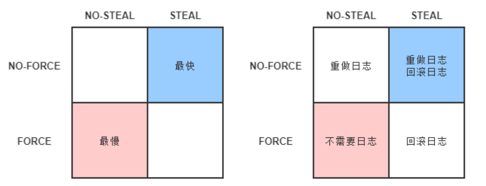

#

# 凤凰架构

某个功能**能够**进行分布式，并不意味着它就**应该**进行分布式，强行追求透明的分布式操作，只会自寻苦果

## IPC 与 RPC

“调用远程方法”与“调用本地方法”尽管只是两字之差，但若要同时兼顾简单、透明、性能、正确、鲁棒、一致等特点的话，两者的复杂度就完全不可同日而语了。且不说远程方法不能再依靠本地方法那些以内联为代表的传统编译优化来提升速度，光是“远程”二字带来的网络环境下的新问题，譬如，远程的服务在哪里（服务发现），有多少个（负载均衡），网络出现分区、超时或者服务出错了怎么办（熔断、隔离、降级），方法的参数与返回结果如何表示（序列化协议），信息如何传输（传输协议），服务权限如何管理（认证、授权），如何保证通信安全（网络安全层），如何令调用不同机器的服务返回相同的结果（分布式数据一致性）等一系列问题，全部都需要设计者耗费大量心思。

## 事务特性（ACID）

原子性和持久性在事务里是密切相关的两个属性，原子性保证了事务的多个操作要么都生效要么都不生效，不会存在中间状态；持久性保证了一旦事务生效，就不会再因为任何原因而导致其修改的内容被撤销或丢失。

由于写入中间状态与崩溃都是无法避免的，为了保证原子性和持久性，就只能在崩溃后采取恢复的补救措施，这种数据恢复操作被称为“崩溃恢复”（Crash Recovery，也有资料称作 Failure Recovery 或 Transaction Recovery）。

为了能够顺利地完成崩溃恢复，在磁盘中写入数据就不能像程序修改内存中变量值那样，直接改变某表某行某列的某个值，而是必须将修改数据这个操作所需的全部信息，包括修改什么数据、数据物理上位于哪个内存页和磁盘块中、从什么值改成什么值，等等，以日志的形式——即仅进行顺序追加的文件写入的形式（这是最高效的写入方式）先记录到磁盘中。只有在日志记录全部都安全落盘，数据库在日志中看到代表事务成功提交的“提交记录”（Commit Record）后，才会根据日志上的信息对真正的数据进行修改，修改完成后，再在日志中加入一条“结束记录”（End Record）表示事务已完成持久化，这种事务实现方法被称为“Commit Logging”（提交日志）。

```
通过日志实现事务的原子性和持久性是当今的主流方案，但并不是唯一的选择。除日志外，还有另外一种称为“[Shadow Paging](https://en.wikipedia.org/wiki/Shadow_paging)”（有中文资料翻译为“影子分页”）的事务实现机制，常用的轻量级数据库 SQLite Version 3 采用的事务机制就是 Shadow Paging。

Shadow Paging 的大体思路是对数据的变动会写到硬盘的数据中，但并不是直接就地修改原先的数据，而是先将数据复制一份副本，保留原数据，修改副本数据。在事务过程中，被修改的数据会同时存在两份，一份是修改前的数据，一份是修改后的数据，这也是“影子”（Shadow）这个名字的由来。当事务成功提交，所有数据的修改都成功持久化之后，最后一步是去修改数据的引用指针，将引用从原数据改为新复制出来修改后的副本，最后的“修改指针”这个操作将被认为是原子操作，现代磁盘的写操作可以认为在硬件上保证了不会出现“改了半个值”的现象。所以 Shadow Paging 也可以保证原子性和持久性。Shadow Paging 实现事务要比 Commit Logging 更加简单，但涉及隔离性与并发锁时，Shadow Paging 实现的事务并发能力就相对有限，因此在高性能的数据库中应用不多。
```

Commit Logging 保障数据持久性、原子性的原理并不难理解：首先，日志一旦成功写入 Commit Record，那整个事务就是成功的，即使真正修改数据时崩溃了，重启后根据已经写入磁盘的日志信息恢复现场、继续修改数据即可，这保证了持久性；其次，如果日志没有成功写入 Commit Record 就发生崩溃，那整个事务就是失败的，系统重启后会看到一部分没有 Commit Record 的日志，那将这部分日志标记为回滚状态即可，整个事务就像完全没好有发生过一样，这保证了原子性。

Commit Logging 的原理很清晰，也确实有一些数据库就是直接采用 Commit Logging 机制来实现事务的，譬如较具代表性的是阿里的[OceanBase](https://zh.wikipedia.org/wiki/OceanBase)。但是，Commit Logging 存在一个巨大的先天缺陷：所有对数据的真实修改都必须发生在事务提交以后，即日志写入了 Commit Record 之后。在此之前，即使磁盘 I/O 有足够空闲、即使某个事务修改的数据量非常庞大，占用了大量的内存缓冲区，无论有何种理由，都决不允许在事务提交之前就修改磁盘上的数据，这一点是 Commit Logging 成立的前提，却对提升数据库的性能十分不利。为了解决这个问题，前面提到的 ARIES 理论终于可以登场。ARIES 提出了“Write-Ahead Logging”的日志改进方案，所谓“提前写入”（Write-Ahead），就是允许在事务提交之前，提前写入变动数据的意思。

Write-Ahead Logging 先将何时写入变动数据，按照事务提交时点为界，划分为 FORCE 和 STEAL 两类情况。

- **FORCE**：当事务提交后，要求变动数据必须同时完成写入则称为 FORCE，如果不强制变动数据必须同时完成写入则称为 NO-FORCE。现实中绝大多数数据库采用的都是 NO-FORCE 策略，因为只要有了日志，变动数据随时可以持久化，从优化磁盘 I/O 性能考虑，没有必要强制数据写入立即进行。
- **STEAL**：在事务提交前，允许变动数据提前写入则称为 STEAL，不允许则称为 NO-STEAL。从优化磁盘 I/O 性能考虑，允许数据提前写入，有利于利用空闲 I/O 资源，也有利于节省数据库缓存区的内存。

Commit Logging 允许 NO-FORCE，但不允许 STEAL。因为假如事务提交前就有部分变动数据写入磁盘，那一旦事务要回滚，或者发生了崩溃，这些提前写入的变动数据就都成了错误。

Write-Ahead Logging 允许 NO-FORCE，也允许 STEAL，它给出的解决办法是增加了另一种被称为 Undo Log 的日志类型，当变动数据写入磁盘前，必须先记录 Undo Log，注明修改了哪个位置的数据、从什么值改成什么值，等等。以便在事务回滚或者崩溃恢复时根据 Undo Log 对提前写入的数据变动进行擦除。Undo Log 现在一般被翻译为“回滚日志”，此前记录的用于崩溃恢复时重演数据变动的日志就相应被命名为 Redo Log，一般翻译为“重做日志”。由于 Undo Log 的加入，Write-Ahead Logging 在崩溃恢复时会执行以下三个阶段的操作。

- **分析阶段**（Analysis）：该阶段从最后一次检查点（Checkpoint，可理解为在这个点之前所有应该持久化的变动都已安全落盘）开始扫描日志，找出所有没有 End Record 的事务，组成待恢复的事务集合，这个集合至少会包括 Transaction Table 和 Dirty Page Table 两个组成部分。
- **重做阶段**（Redo）：该阶段依据分析阶段中产生的待恢复的事务集合来重演历史（Repeat History），具体操作为：找出所有包含 Commit Record 的日志，将这些日志修改的数据写入磁盘，写入完成后在日志中增加一条 End Record，然后移除出待恢复事务集合。
- **回滚阶段**（Undo）：该阶段处理经过分析、重做阶段后剩余的恢复事务集合，此时剩下的都是需要回滚的事务，它们被称为 Loser，根据 Undo Log 中的信息，将已经提前写入磁盘的信息重新改写回去，以达到回滚这些 Loser 事务的目的。

重做阶段和回滚阶段的操作都应该设计为幂等的。为了追求高 I/O 性能，以上三个阶段无可避免地会涉及非常烦琐的概念和细节（如 Redo Log、Undo Log 的具体数据结构等），囿于篇幅限制，笔者并不打算具体介绍这些内容，如感兴趣，阅读本节开头引用的那两篇论文是最佳的途径。Write-Ahead Logging 是 ARIES 理论的一部分，整套 ARIES 拥有严谨、高性能等很多的优点，但这些也是以高度复杂为代价的。数据库按照是否允许 FORCE 和 STEAL 可以产生共计四种组合，从优化磁盘 I/O 的角度看，NO-FORCE 加 STEAL 组合的性能无疑是最高的；从算法实现与日志的角度看 NO-FORCE 加 STEAL 组合的复杂度无疑也是最高的。这四种组合与 Undo Log、Redo Log 之间的具体关系如图 3-1 所示。



​ FORCE 和 STEAL 的四种组合关系

## 隔离级别

现代数据库均提供了以下三种锁。

- **写锁**（Write Lock，也叫作排他锁，eXclusive Lock，简写为 X-Lock）：如果数据有加写锁，就只有持有写锁的事务才能对数据进行写入操作，数据加持着写锁时，其他事务不能写入数据，也不能施加读锁。
- **读锁**（Read Lock，也叫作共享锁，Shared Lock，简写为 S-Lock）：多个事务可以对同一个数据添加多个读锁，数据被加上读锁后就不能再被加上写锁，所以其他事务不能对该数据进行写入，但仍然可以读取。对于持有读锁的事务，如果该数据只有它自己一个事务加了读锁，允许直接将其升级为写锁，然后写入数据。
- **范围锁**（Range Lock）：对于某个范围直接加排他锁，在这个范围内的数据不能被写入。

串行化访问提供了强度最高的隔离性。如果不考虑性能优化的话，对事务所有读、写的数据全都加上读锁、写锁和范围锁即可做到`可串行化`（“即可”是简化理解，实际还是很复杂的，要分成 Expanding 和 Shrinking 两阶段去处理读锁、写锁与数据间的关系，称为[Two-Phase Lock](https://en.wikipedia.org/wiki/Two-phase_locking)，2PL）。但数据库不考虑性能肯定是不行的，[并发控制理论](https://en.wikipedia.org/wiki/Concurrency_control)（Concurrency Control）决定了隔离程度与并发能力是相互抵触的，隔离程度越高，并发访问时的吞吐量就越低。现代数据库一定会提供除`可串行化`以外的其他隔离级别供用户使用，让用户调节隔离级别的选项，根本目的是让用户可以调节数据库的加锁方式，取得隔离性与吞吐量之间的平衡。

`可串行化`的下一个隔离级别是`可重复读`（Repeatable Read），`可重复读`对事务所涉及的数据加读锁和写锁，且一直持有至事务结束，但不再加范围锁。`可重复读`比`可串行化`弱化的地方在于[幻读问题](<https://en.wikipedia.org/wiki/Isolation_(database_systems)#Phantom_reads>)（Phantom Reads），它是指在事务执行过程中，两个完全相同的范围查询得到了不同的结果集

`可重复读`的下一个隔离级别是`读已提交`（Read Committed），`读已提交`对事务涉及的数据加的写锁会一直持续到事务结束，但加的读锁在查询操作完成后就马上会释放。`读已提交`比`可重复读`弱化的地方在于[不可重复读问题](<https://en.wikipedia.org/wiki/Isolation_(database_systems)#Non-repeatable_reads>)（Non-Repeatable Reads），它是指在事务执行过程中，对同一行数据的两次查询得到了不同的结果。

`读已提交`的下一个级别是`读未提交`（Read Uncommitted），`读未提交`对事务涉及的数据只加写锁，会一直持续到事务结束，但完全不加读锁。`读未提交`比`读已提交`弱化的地方在于[脏读问题](<https://en.wikipedia.org/wiki/Isolation_(database_systems)#Dirty_reads>)（Dirty Reads），它是指在事务执行过程中，一个事务读取到了另一个事务未提交的数据。

理论上还存在更低的隔离级别，就是“完全不隔离”，即读、写锁都不加。`读未提交`会有脏读问题，但不会有脏写问题（Dirty Write），即一个事务的没提交之前的修改可以被另外一个事务的修改覆盖掉，脏写已经不单纯是隔离性上的问题了，它将导致事务的原子性都无法实现，所以一般谈论隔离级别时不会将它纳入讨论范围内，而将`读未提交`视为是最低级的隔离级别。

除了都以锁来实现外，以上四种隔离级别还有另一个共同特点，就是幻读、不可重复读、脏读等问题都是由于一个事务在读数据过程中，受另外一个写数据的事务影响而破坏了隔离性，针对这种“一个事务读+另一个事务写”的隔离问题，近年来有一种名为“[多版本并发控制](https://en.wikipedia.org/wiki/Multiversion_concurrency_control)”（Multi-Version Concurrency Control，MVCC）的无锁优化方案被主流的商业数据库广泛采用。MVCC 是一种读取优化策略，它的“无锁”是特指读取时不需要加锁。MVCC 的基本思路是对数据库的任何修改都不会直接覆盖之前的数据，而是产生一个新版副本与老版本共存，以此达到读取时可以完全不加锁的目的。在这句话中，“版本”是个关键词，你不妨将版本理解为数据库中每一行记录都存在两个看不见的字段：CREATE_VERSION 和 DELETE_VERSION，这两个字段记录的值都是事务 ID，事务 ID 是一个全局严格递增的数值，然后根据以下规则写入数据。

- 插入数据时：CREATE_VERSION 记录插入数据的事务 ID，DELETE_VERSION 为空。
- 删除数据时：DELETE_VERSION 记录删除数据的事务 ID，CREATE_VERSION 为空。
- 修改数据时：将修改数据视为“删除旧数据，插入新数据”的组合，即先将原有数据复制一份，原有数据的 DELETE_VERSION 记录修改数据的事务 ID，CREATE_VERSION 为空。复制出来的新数据的 CREATE_VERSION 记录修改数据的事务 ID，DELETE_VERSION 为空。

此时，如有另外一个事务要读取这些发生了变化的数据，将根据隔离级别来决定到底应该读取哪个版本的数据。

- 隔离级别是`可重复读`：总是读取 CREATE_VERSION 小于或等于当前事务 ID 的记录，在这个前提下，如果数据仍有多个版本，则取最新（事务 ID 最大）的。
- 隔离级别是`读已提交`：总是取最新的版本即可，即最近被 Commit 的那个版本的数据记录。

另外两个隔离级别都没有必要用到 MVCC，因为`读未提交`直接修改原始数据即可，其他事务查看数据的时候立刻可以看到，根本无须版本字段。`可串行化`本来的语义就是要阻塞其他事务的读取操作，而 MVCC 是做读取时无锁优化的，自然就不会放到一起用。

MVCC 是只针对“读+写”场景的优化，如果是两个事务同时修改数据，即“写+写”的情况，那就没有多少优化的空间了，此时加锁几乎是唯一可行的解决方案，稍微有点讨论余地的是加锁的策略是“乐观加锁”（Optimistic Locking）还是“悲观加锁”（Pessimistic Locking）。前面笔者介绍的加锁都属于悲观加锁策略，即认为如果不先做加锁再访问数据，就肯定会出现问题。相对地，乐观加锁策略认为事务之间数据存在竞争是偶然情况，没有竞争才是普遍情况，这样就不应该在一开始就加锁，而是应当在出现竞争时再找补救措施。这种思路被称为“[乐观并发控制](https://en.wikipedia.org/wiki/Optimistic_concurrency_control)”（Optimistic Concurrency Control，OCC）

没有必要迷信什么乐观锁要比悲观锁更快的说法，这纯粹看竞争的剧烈程度，如果竞争剧烈的话，乐观锁反而更慢。

## 分布式事务

如果舍弃 C、A、P 时所带来的不同影响。

- **如果放弃分区容忍性**（CA without P），意味着我们将假设节点之间通信永远是可靠的。永远可靠的通信在分布式系统中必定不成立的，这不是你想不想的问题，而是只要用到网络来共享数据，分区现象就会始终存在。在现实中，最容易找到放弃分区容忍性的例子便是传统的关系数据库集群，这样的集群虽然依然采用由网络连接的多个节点来协同工作，但数据却不是通过网络来实现共享的。以 Oracle 的 RAC 集群为例，它的每一个节点均有自己独立的 SGA、重做日志、回滚日志等部件，但各个节点是通过共享存储中的同一份数据文件和控制文件来获取数据的，通过共享磁盘的方式来避免出现网络分区。因而 Oracle RAC 虽然也是由多个实例组成的数据库，但它并不能称作是分布式数据库。
- **如果放弃可用性**（CP without A），意味着我们将假设一旦网络发生分区，节点之间的信息同步时间可以无限制地延长，此时，问题相当于退化到前面“全局事务”中讨论的一个系统使用多个数据源的场景之中，我们可以通过 2PC/3PC 等手段，同时获得分区容忍性和一致性。在现实中，选择放弃可用性的 CP 系统情况一般用于对数据质量要求很高的场合中，除了 DTP 模型的分布式数据库事务外，著名的 HBase 也是属于 CP 系统，以 HBase 集群为例，假如某个 RegionServer 宕机了，这个 RegionServer 持有的所有键值范围都将离线，直到数据恢复过程完成为止，这个过程要消耗的时间是无法预先估计的。
- **如果放弃一致性**（AP without C），意味着我们将假设一旦发生分区，节点之间所提供的数据可能不一致。选择放弃一致性的 AP 系统目前是设计分布式系统的主流选择，因为 P 是分布式网络的天然属性，你再不想要也无法丢弃；而 A 通常是建设分布式的目的，如果可用性随着节点数量增加反而降低的话，很多分布式系统可能就失去了存在的价值，除非银行、证券这些涉及金钱交易的服务，宁可中断也不能出错，否则多数系统是不能容忍节点越多可用性反而越低的。目前大多数 NoSQL 库和支持分布式的缓存框架都是 AP 系统，以 Redis 集群为例，如果某个 Redis 节点出现网络分区，那仍不妨碍各个节点以自己本地存储的数据对外提供缓存服务，但这时有可能出现请求分配到不同节点时返回给客户端的是不一致的数据。

原文链接：https://icyfenix.cn/

作者：周志明
