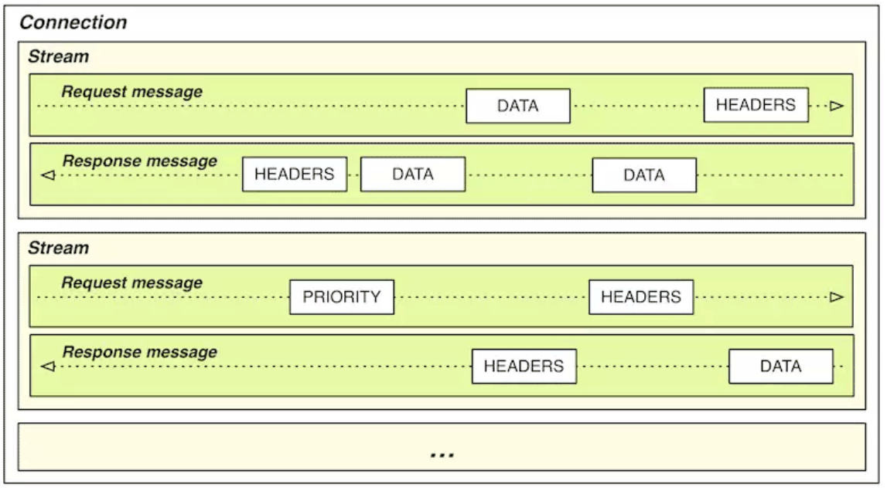

#

# 传输链路

程序发出的请求能否与应用层、传输层协议提倡的方式相匹配，对传输的效率有极大影响

最容易体现这点的是那些前端网页的优化技巧，只要简单搜索一下，就能找到很多以优化链路传输为目的的前端设计原则，譬如经典的[雅虎 YSlow-23 条规则](https://developer.yahoo.com/performance/rules.html)中与传输相关的内容如下。

1. Minimize HTTP Requests。

   减少请求数量：请求每次都需要建立通信链路进行数据传输，这些开销很昂贵，减少请求的数量可有效的提高访问性能，对于前端开发者，可能用来减少请求数量的手段包括：

   - 雪碧图（[CSS Sprites](https://en.wikipedia.org/w/index.php?title=CSS_Sprites&redirect=no)）
   - CSS、JS 文件合并/内联（Concatenation / Inline）
   - 分段文档（[Multipart Document](https://www.w3.org/Protocols/rfc1341/7_2_Multipart.html)）
   - 媒体（图片、音频）内联（[Data Base64 URI](https://en.wikipedia.org/wiki/Data_URI_scheme)）
   - 合并 Ajax 请求（Batch Ajax Request）
   - ……

2. Split Components Across Domains。
   扩大并发请求数：现代浏览器（Chrome、Firefox）一般对每个域名支持 6 个（IE 为 8-13 个）并发请求，如果希望更快地加载大量图片或其他资源，需要进行域名分片（Domain Sharding），将图片同步到不同主机或者同一个主机的不同域名上。

3. GZip Components。
   启用压缩传输：启用压缩能够大幅度减少需要在网络上传输内容的大小，节省网络流量。

4. Avoid Redirects。
   避免页面重定向：当页面发生了重定向，就会延迟整个文档的传输。在 HTML 文档到达之前，页面中不会呈现任何东西，降低了用户体验。

5. Put Stylesheets at the Top，Put Scripts at the Bottom。
   按重要性调节资源优先级：将重要的、马上就要使用的、对客户端展示影响大的资源，放在 HTML 的头部，以便优先下载。

6. …………

这些原则在今天暂时仍算得上有一定价值，但在若干年后再回头看它们，大概率其中多数已经成了奇技淫巧，有些甚至成了反模式。导致这种变化的原因是 HTTP 协议还在持续发展，从 20 世纪 90 年代的 HTTP/1.0 和 HTTP/1.1，到 2015 年发布的 HTTP/2，再到 2019 年的 HTTP/3，由于 HTTP 协议本身的变化，使得“适合 HTTP 传输的请求”的特征也在不断变化。

但是，通过开发人员的 Tricks 来节省 TCP 连接，这样的优化措施并非只有好处，它们同时也带来了诸多不良的副作用：

- 如果你用 CSS Sprites 将多张图片合并，意味着任何场景下哪怕只用到其中一张小图，也必须完整加载整个大图片；任何场景下哪怕一张小图要进行修改，都会导致整个缓存失效，类似地，样式、脚本等其他文件的合并也会造成同样的问题。
- 如果你使用了媒体内嵌，除了要承受 Base64 编码导致传输容量膨胀 1/3 的代价外（Base64 以 8 bit 表示 6 bit 数据），也将无法有效利用缓存。
- 如果你合并了异步请求，这就会导致所有请求返回时间都受最慢的那个请求的拖累，整体响应速度下降.
- 如果你把图片放到不同子域下面，将会导致更大的 DNS 解析负担，而且浏览器对两个不同子域下的同一图片必须持有两份缓存，也使得缓存效率的下降。
- ……

在另一方面，HTTP 的设计者们并不是没有尝试过在协议层面去解决连接成本过高的问题，即使是 HTTP 协议的最初版本（指 HTTP/1.0，忽略非正式的 HTTP/0.9 版本）就已经支持了连接复用技术（连接复用技术在 HTTP/1.0 中并不是默认开启的，是在 HTTP/1.1 中变为默认开启），即今天大家所熟知的[持久连接](https://en.wikipedia.org/wiki/HTTP_persistent_connection)（Persistent Connection），也称为连接[Keep-Alive 机制](https://en.wikipedia.org/wiki/Keepalive)。持久连接的原理是让客户端对同一个域名长期持有一个或多个不会用完即断的 TCP 连接。典型做法是在客户端维护一个 FIFO 队列，每次取完数据（如何在不断开连接下判断取完数据将会放到稍后[传输压缩](https://icyfenix.cn/architect-perspective/general-architecture/diversion-system/transmission-optimization.html#传输压缩)部分去讨论）之后一段时间内不自动断开连接，以便获取下一个资源时直接复用，避免创建 TCP 连接的成本。

但是，连接复用技术依然是不完美的，最明显的副作用是“[队首阻塞](https://en.wikipedia.org/wiki/Head-of-line_blocking)”（Head-of-Line Blocking）问题

队首阻塞问题一直持续到第二代的 HTTP 协议，即 HTTP/2 发布后才算是被比较完美地解决。在 HTTP/1.x 中，HTTP 请求就是传输过程中最小粒度的信息单位了，所以如果将多个请求切碎，再混杂在一块传输，客户端势必难以分辨重组出有效信息。而在 HTTP/2 中，帧（Frame）才是最小粒度的信息单位，它可以用来描述各种数据，譬如请求的 Headers、Body，或者用来做控制标识，譬如打开流、关闭流。这里说的流（Stream）是一个逻辑上的数据通道概念，每个帧都附带一个流 ID 以标识这个帧属于哪个流。这样，在同一个 TCP 连接中传输的多个数据帧就可以根据流 ID 轻易区分出开来，在客户端毫不费力地将不同流中的数据重组出不同 HTTP 请求和响应报文来。这项设计是 HTTP/2 的最重要的技术特征一，被称为 HTTP/2 [多路复用](https://tools.ietf.org/html/rfc7540#page-15)（HTTP/2 Multiplexing）技术，如图 所示。

有了多路复用的支持，HTTP/2 就可以对每个域名只维持一个 TCP 连接（One Connection Per Origin）来以任意顺序传输任意数量的资源，既减轻了服务器的连接压力，开发者也不用去考虑域名分片这种事情来突破浏览器对每个域名最多 6 个连接数限制了。而更重要的是，没有了 TCP 连接数的压力，就无须刻意压缩 HTTP 请求了，所有通过合并、内联文件（无论是图片、样式、脚本）以减少请求数的需求都不再成立，甚至反而是徒增副作用的反模式。

# 传输压缩

在网络时代的早期，服务器处理能力还很薄弱，为了启用压缩，会是把静态资源先预先压缩为.gz 文件的形式存放起来，当客户端可以接受压缩版本的资源时（请求的 Header 中包含 Accept-Encoding: gzip）就返回压缩后的版本（响应的 Header 中包含 Content-Encoding: gzip），否则就返回未压缩的原版，这种方式被称为“[静态预压缩](http://nginx.org/en/docs/http/ngx_http_gzip_static_module.html)”（Static Precompression）

而现代的 Web 服务器处理能力有了大幅提升，已经没有人再采用麻烦的预压缩方式了，都是由服务器对符合条件的请求将在输出时进行“[即时压缩](https://www.usenix.org/legacy/publications/library/proceedings/jvm01/full_papers/hovemeyer/hovemeyer_html/node7.html)”（On-The-Fly Compression），整个压缩过程全部在内存的数据流中完成，不必等资源压缩完成再返回响应，这样可以显著提高“[首字节时间](https://en.wikipedia.org/wiki/Time_to_first_byte)”（Time To First Byte，TTFB），改善 Web 性能体验。而这个过程中唯一不好的地方就是服务器再也没有办法给出 Content-Length 这个响应 Header 了，因为输出 Header 时服务器还不知道压缩后资源的确切大小。

持久链接机制不再依靠 TCP 连接是否关闭来判断资源请求是否结束，它会重用同一个连接以便向同一个域名请求多个资源，这样，客户端就必须要有除了关闭连接之外的其他机制来判断一个资源什么时候算传递完毕，这个机制最初（在 HTTP/1.0 时）就只有 Content-Length，即靠着请求 Header 中明确给出资源的长度，传输到达该长度即宣告一个资源的传输已结束。由于启用即时压缩后就无法给出 Content-Length 了，如果是 HTTP/1.0 的话，持久链接和即时压缩只能二选其一，事实上在 HTTP/1.0 中两者都支持，却默认都是不启用的。依靠 Content-Length 来判断传输结束的缺陷，不仅仅在于即时压缩这一种场景，譬如对于动态内容（Ajax、PHP、JSP 等输出），服务器也同样无法事项得知 Content-Length。

HTTP/1.1 版本中修复了这个缺陷，增加了另一种“[分块传输编码](https://en.wikipedia.org/wiki/Chunked_transfer_encoding)”（Chunked Transfer Encoding）的资源结束判断机制，彻底解决了 Content-Length 与持久链接的冲突问题。分块编码原理相当简单：在响应 Header 中加入“Transfer-Encoding: chunked”之后，就代表这个响应报文将采用分块编码。此时，报文中的 Body 需要改为用一系列“分块”来传输。每个分块包含十六进制的长度值和对应长度的数据内容，长度值独占一行，数据从下一行开始。最后以一个长度值为 0 的分块来表示资源结束。

HTTP/1.1 通过分块传输解决了即时压缩与持久连接并存的问题，到了 HTTP/2，由于多路复用和单域名单连接的设计，已经无须再刻意去提持久链接机制了，但数据压缩仍然有节约传输带宽的重要价值。

# 快速 UDP 网络连接

HTTP 是应用层协议而不是传输层协议，它的设计原本并不应该过多地考虑底层的传输细节，从职责上讲，持久连接、多路复用、分块编码这些能力，已经或多或少超过了应用层的范畴。要从根本上改进 HTTP，必须直接替换掉 HTTP over TCP 的根基，即 TCP 传输协议，这便最新一代 HTTP/3 协议的设计重点。

2013 年，Google 在它的服务器（如 Google.com、YouTube.com 等）及 Chrome 浏览器上同时启用了名为“[快速 UDP 网络连接](https://en.wikipedia.org/wiki/QUIC)”（Quick UDP Internet Connections，QUIC）的全新传输协议。在 2015 年，Google 将 QUIC 提交给 IETF，并在 IETF 的推动下对 QUIC 进行重新规范化（为以示区别，业界习惯将此前的版本称为 gQUIC，规范化后的版本称为 iQUIC），使其不仅能满足 HTTP 传输协议，日后还能支持 SMTP、DNS、SSH、Telnet、NTP 等多种其他上层协议。2018 年末，IETF 正式批准了 HTTP over QUIC 使用 HTTP/3 的版本号，将其确立为最新一代的互联网标准。

从名字上就能看出 QUIC 会以 UDP 协议为基础，而 UDP 协议没有丢包自动重传的特性，因此 QUIC 的可靠传输能力并不是由底层协议提供，而是完全由自己来实现。由 QUIC 自己实现的好处是能对每个流能做单独的控制，如果在一个流中发生错误，协议栈仍然可以独立地继续为其他流提供服务。这对提高易出错链路的性能非常有用，因为在大多数情况下，TCP 协议接到数据包丢失或损坏通知之前，可能已经收到了大量的正确数据，但是在纠正错误之前，其他的正常请求都会等待甚至被重发，这也是 HTTP/2 未能解决传输大文件慢的根本原因。

QUIC 的另一个设计目标是面向移动设备的专门支持，由于以前 TCP、UDP 传输协议在设计时根本不可能设想到今天移动设备盛行的场景，因此肯定不会有任何专门的支持。QUIC 在移动设备上的优势体现在网络切换时的响应速度上，譬如当移动设备在不同 WiFi 热点之间切换，或者从 WiFi 切换到移动网络时，如果使用 TCP 协议，现存的所有连接都必定会超时、中断，然后根据需要重新创建。这个过程会带来很高的延迟，因为超时和重新握手都需要大量时间。为此，QUIC 提出了连接标识符的概念，该标识符可以唯一地标识客户端与服务器之间的连接，而无须依靠 IP 地址。这样，切换网络后，只需向服务端发送一个包含此标识符的数据包即可重用既有的连接，因为即使用户的 IP 地址发生变化，原始连接连接标识符依然是有效的。

无论是 TCP 协议还是 HTTP 协议，都已经存在了数十年时间。它们积累了大量用户的同时，也承载了很重的技术惯性，要使 HTTP 从 TCP 迁移走，即使由 Google 和 IETF 来推动依然不是一件容易的事情。一个最显著的问题是互联网基础设施中的许多中间设备，都只面向 TCP 协议去建造，仅对 UDP 提供很基础的支持，有的甚至完全阻止 UDP 的流量。因此，Google 在 Chromium 的网络协议栈中同时启用了 QUIC 和传统 TCP 连接，并在 QUIC 连接失败时以零延迟回退到 TCP 连接，尽可能让用户无感知地逐步地扩大 QUIC 的使用面。

根据[W3Techs](https://w3techs.com/technologies/overview/site_element)的数据，全球支持 HTTP/2 和 HTTP3 协议的网站都在上涨，可以肯定地说，目前网络链路传输领域正处于新旧交替的时代，许多既有的设备、程序、知识都会在未来几年时间里出现重大更新。

原文链接：https://icyfenix.cn/

作者：周志明
