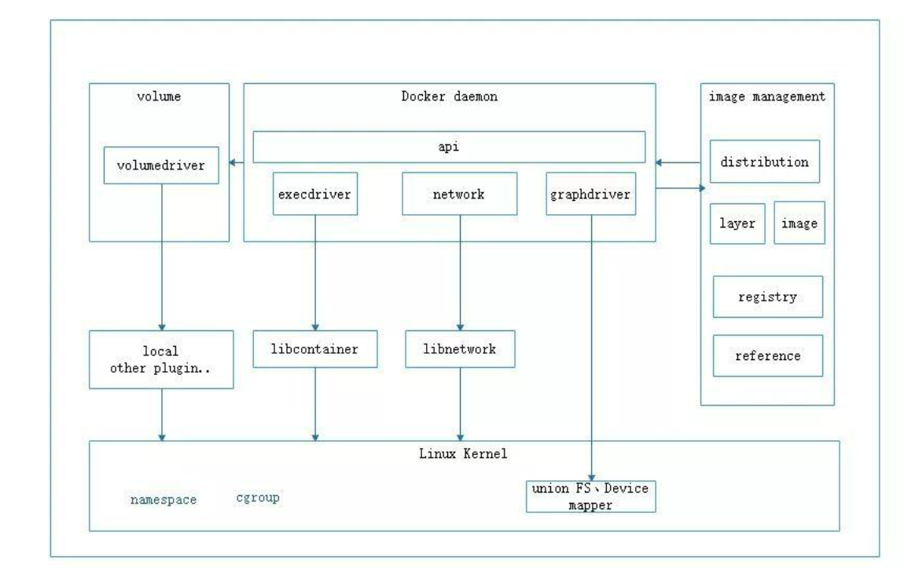
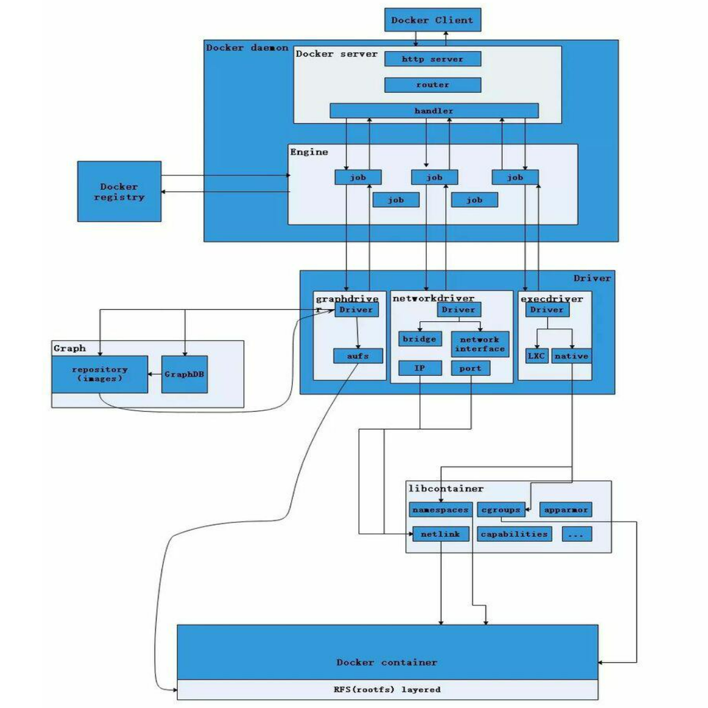

官方文档：https://docs.docker.com/desktop/

GitHub：https://github.com/docker

# 命令

查看可用版本

```sh
yum list docker-ce --showduplicates | sort -r
```

安装

```sh
yum install docker-ce-20.10.6 -y
```

卸载

```sh
yum remove -y docker-xxx
```

配置加速源

```sh
mkdir -p /etc/docker
touch /etc/docker/daemon.json
vim /etc/docker/daemon.json
{
"registry-mirrors" : [
"https://8xpk5wnt.mirror.aliyuncs.com"
]
}
```

启动 docker

```sh
systemctl daemon-reload
systemctl enable docker
systemctl restart docker
```

查看版本

```sh
docker version
```

查看 docker 服务

```sh
docker info
```

搜索镜像

```sh
docker search [镜像名称]
```

下载镜像

```sh
docker pull [镜像名称/镜像id]
```

查看镜像

```sh
docker images

docker image ls
```

只列出镜像 id -q --quiet

```sh
docker image -q
```

格式化查看镜像

```sh
docker images --format "{{.ID}}--{{.Repository}}"
docker images --format "table {{.ID}}\t{{.Repository}}\t{{.Tag}}"
```

查看镜像详细信息

```sh
docker image inspect [镜像id]
```

删除镜像 （-f 强制删除镜像及相关容器）

```sh
docker rmi  [镜像名称/镜像id]
```

批量删除镜像

```sh
docker rmi `docker images -aq`
```

运行容器

```sh
docker run -d -p [port]:[port] --name  [镜像名称/镜像id]
```

查看正在运行的容器

```sh
docker ps
```

查看容器详细信息

```sh
docker [container] inspect [容器id/name]
```

停止容器

```sh
docker stop  [镜像名称/镜像id]
```

删除容器

```sh
docker rm [镜像名称/镜像id]
```

批量删除容器

```sh
docker rm `docker ps -aq`
```

运行并进入容器
-it ： 开启一个交互式的终端

```sh
docker run -it  [id/name] bash
```

进入正在运行的 容器

```sh
docker exec -it [id/name] bash
```

--rm ：退出时删除该容器

```sh
docker run -it --rm centos bash
```

查看容器内的发行版本

```sh
cat /etc/os-release
cat /etc/lsb-release
```

获取不同的发行版本

```sh
docker run -it ubuntu/redhat/centos/debian/opensuse bash
```

导出容器快照(会丢失所有历史记录和容器内数据)

```sh
docker export [容器id]  >  [文件名称].tar
```

导入容器快照

```sh
docker import [文件名称].tar
```

导出镜像 .tgz = .tar.gz （会保存完整记录，体积较大）

```sh
docker image save centos > /opt/centos.tgz
```

导入镜像

```sh
docker image load -i /opt/centos/tgz
```

查看日志 -f 跟踪容器日志,实时刷新 -t 显示时间戳

```sh
docker logs -f [id/name]
```

容器端口映射 宿主机端口：容器暴露端口 -v 目录映射

```sh
docker run -d -p  85:80 --name -v [宿主机port]:[容器暴露port] --restart=always test_nginx nginx
```

随机端口映射

```sh
docker run -d -P --name test_nginx nginx
```

提交容器

```sh
docker commit --author " " --message " " [容器id/name] 【新的镜像名称】
```

查看镜像历史记录

```sh
docker history [id/name]
```

查看容器修改记录

```
docker diff [id/name]
```

查看容器进程列表

```sh
docker top [容器id/name]
```

查看容器列表系统资源状态

```sh
docker stats
```

# Dockfile

制作 docker 镜像的方式：

1. 手动修改容器内容， 导出新的镜像
2. 使用 Dockerfile 文件编写指令，创建镜像

```sh
FROM 指定基础镜像

MAINTAINER 指定维护者信息

RUN 执行命令

COPY 复制宿主机文件到容器内，能够保留源文件的元数据（权限，创建时间），语法满足golang的filepath.Match

ADD copy文件，如果文件时压缩包，会自动解压，如果时Url远程压缩文件，会下载文件但不会自动解压，ADD会使构建缓存失效

WORKDIR 设置工作目录

VOLUME 自动挂载主机目录 ,被挂载为匿名卷，任何向该目录中写入数据的操作都不会被容器记录，保证容器存储层无状态理念

EXPOSE 暴露容器的对外端口

ENTRYPOINT 指定容器启动后要做的命令

CMD ["参数","参数"]指定容器启动后要做的命令，作为ENTRYPOINT的参数

ENV 环境变量，作用于全局，用于构建环境，容器运行时依然存在

ARG 参数，同ENV，容器运行时不存在

USER 改变环境，切换用户
```

```shs
docker build -t [tag] .  # --no-cache
```

```sh
docker build --help

Usage:  docker build [OPTIONS] PATH | URL | -

Build an image from a Dockerfile

Options:
      --add-host list           Add a custom host-to-IP mapping (host:ip)
      --build-arg list          Set build-time variables
      --cache-from strings      Images to consider as cache sources
      --cgroup-parent string    Optional parent cgroup for the container
      --compress                Compress the build context using gzip
      --cpu-period int          Limit the CPU CFS (Completely Fair Scheduler) period
      --cpu-quota int           Limit the CPU CFS (Completely Fair Scheduler) quota
  -c, --cpu-shares int          CPU shares (relative weight)
      --cpuset-cpus string      CPUs in which to allow execution (0-3, 0,1)
      --cpuset-mems string      MEMs in which to allow execution (0-3, 0,1)
      --disable-content-trust   Skip image verification (default true)
  -f, --file string             Name of the Dockerfile (Default is 'PATH/Dockerfile')
      --force-rm                Always remove intermediate containers
      --iidfile string          Write the image ID to the file
      --isolation string        Container isolation technology
      --label list              Set metadata for an image
  -m, --memory bytes            Memory limit
      --memory-swap bytes       Swap limit equal to memory plus swap: '-1' to enable
                                unlimited swap
      --network string          Set the networking mode for the RUN instructions during build
                                (default "default")
      --no-cache                Do not use cache when building the image
      --pull                    Always attempt to pull a newer version of the image
  -q, --quiet                   Suppress the build output and print image ID on success
      --rm                      Remove intermediate containers after a successful build
                                (default true)
      --security-opt strings    Security options
      --shm-size bytes          Size of /dev/shm
  -t, --tag list                Name and optionally a tag in the 'name:tag' format
      --target string           Set the target build stage to build.
      --ulimit ulimit           Ulimit options (default [])

```

# 概念

## 总体架构



- distribution 负责与 docker registry 交互，上传洗澡镜像以及 v2 registry 有关的源数据
- registry 负责 docker registry 有关的身份认证、镜像查找、镜像验证以及管理 registry mirror 等交互操作
- image 负责与镜像源数据有关的存储、查找，镜像层的索引、查找以及镜像 tar 包有关的导入、导出操作
- reference 负责存储本地所有镜像的 repository 和 tag 名，并维护与镜像 id 之间的映射关系
- layer 模块负责与镜像层和容器层源数据有关的增删改查，并负责将镜像层的增删改查映射到实际存储镜像层文件的 graphdriver 模块
- graghdriver 是所有与容器镜像相关操作的执行者



从上图不难看出，用户是使用 Docker Client 与 Docker Daemon 建立通信，并发送请求给后者。

而 Docker Daemon 作为 Docker 架构中的主体部分，首先提供 Server 的功能使其可以接受 Docker Client 的请求；而后 Engine 执行 Docker 内部的一系列工作，每一项工作都是以一个 Job 的形式的存在。

Job 的运行过程中，当需要容器镜像时，则从 Docker Registry 中下载镜像，并通过镜像管理驱动 graphdriver 将下载镜像以 Graph 的形式存储；当需要为 Docker 创建网络环境时，通过网络管理驱动 networkdriver 创建并配置 Docker 容器网络环境；当需要限制 Docker 容器运行资源或执行用户指令等操作时，则通过 execdriver 来完成。

而 libcontainer 是一项独立的容器管理包，networkdriver 以及 execdriver 都是通过 libcontainer 来实现具体对容器进行的操作。当执行完运行容器的命令后，一个实际的 Docker 容器就处于运行状态，该容器拥有独立的文件系统，独立并且安全的运行环境等。

## 基本概念

### Docker 镜像

Docker 镜像是一个特殊的文件系统，这个文件系统封装了运行时需要的库、资源、应用等。Docker 镜像采用分层存储结构。构建时一层一层地进行，每一层构建好后不再变化，后一层以前一层为基础进行构建，最终组成多层文件系统。

一个 Docker 镜像可以构建于另一个 Docker 镜像之上，这种层叠关系可以是多层的。第 1 层的镜像层我们称之为基础镜像（Base Image），其他层的镜像（除了最顶层）我们称之为父层镜像（Parent Image）。这些镜像继承了他们的父层镜像的所有属性和设置，并在 Dockerfile 中添加了自己的配置。

### Docker 容器

Docker 容器本质上是一个进程，运行于自己独立的命名空间中，所有的数据都存储在容器中。容器销毁后，这些数据也随之消失。多个容器互相之间是隔离的，一个容器所做的任何变更都只影响容器自己。

运行容器需要指定一个镜像，容器会在镜像上增加一个可写层。基础镜像本身的变更不会影响运行中的容器。需要执行 docker commit，才能保存容器中的数据，这时在镜像的基础上叠加上容器的存储层生成一个新的镜像。

### repostory 仓库

仓库是集中存储镜像文件的沧桑，registry 是仓库主从服务器，实际上参考注册服务器上存放着多个仓库，每个仓库中又包含了多个镜像，每个镜像有不同的标签（tag）

仓库分为两种，公有参考，和私有仓库，最大的公开仓库是 docker Hub，存放了数量庞大的镜像供用户下周，国内的 docker pool，这里仓库的概念与 Git 类似，registry 可以理解为 github 这样的托管服务

## Docker 核心概念

### ①Docker namespace

Linux 内核 2.4.19 中开始陆续引用了 namespace 概念。目的是将某个特定的全局系统资源(global system resource)通过抽象方法使得 namespace 中的进程看起来拥有它们自己的隔离的全局系统资源实例 命名空间是 Linux 内核强大的特性。每个容器都有自己的命名空间，运行在其中的应用都是在独立操作系统中运行一样。命名空间保证了容器之间彼此互不影响


### ②Docker CGroups （control Group 控制组）

Docker 容器使用 Linux namespace 来隔离其运行环境，使得容器中的进程看起来就像在一个独立的环境中运行。但是光有运行环境隔离还不够，因为这些进程还是可以不受限制地使用系统资源，比如网络、磁盘、CPU 以及内存等。关于其目的，是为了防止它占用了太多的资源而影响到其它进程；另一方面，在系统资源耗尽的时候，Linux 内核会触发 OOM (out of memory killer，OOM 会在系统内存耗尽的情况下跳出来，选择性的干掉一些进程以求释放一些内存)这会让一些被杀掉的进程成了无辜的替死鬼，因此为了让容器中的进程更加可控，Docker 使用 Linux cgroups 来限制容器中的进程允许使用的系统资源 Linux Cgroup 可以让系统中所运行任务(进程)的用户定义组分配资源—比如 CPU 时间、系统内存、网络带宽

特点：

- cgroup 的 api 以一个伪文件系统的实现方式，用户的程序可以通过文件系统实现 cgroup 的组件管理
- cgroup 的组件管理操作单元可以细粒度到线程级别，另外用户可以创建和销毁 cgroup，从而实现资源载分配和再利用
- 所有资源管理的功能都以子系统的方式实现，接口统一子任务创建之初与其父任务处于同一个 cgroup 的控制组

四大功能：

- 资源限制：可以对任务使用的资源总额进行限制
- 优先级分配：通过分配的 cpu 时间片数量以及磁盘 IO 带宽大小，实际上相当于控制了任务运行优先级
- 资源统计：可以统计系统的资源使用量，如 cpu 时长，内存用量等
- 任务控制：cgroup 可以对任务执行挂起、恢复等操作

### ③Docker UnionFS

UnionFS 顾名思义，可以把文件系统上多个目录(分支)内容联合挂载到同一个目录下，而目录的物理位置是分开的。

要理解 unionFS，我们首先需要先了解 bootfs 和 rootfs1.boot file system (bootfs) 包含操作系统 boot loader 和 kernel。用户不会修改这个文件系统，一旦启动成功后，整个 Linux 内核加载进内存，之后 bootfs 会被卸载掉，从而释放内存。同样的内核版本不同 Linux 发行版，其 bootfs 都是一直的 2.root file system (rootfs) 包含典型的目录结构(/dev/,/proc,/bin,/etc,/lib,/usr,/tmp)Linux 系统在启动时，rootfs 首先会被挂载为只读模式，然后在启动完成后被修改为读写模式，随后它们就可以被修改了

### **写时复制 (CoW)**

所有驱动都用到的技术————写时复制，Cow 全称 copy-on-write，表示只是在需要写时才去复制，这个是针对已有文件的修改场景。比如基于一个 image 启动多个 Container，如果每个 Container 都去分配一个 image 一样的文件系统，那么将会占用大量的磁盘空间。而 CoW 技术可以让所有的容器共享 image 的文件系统，所有数据都从 image 中读取，只有当要对文件进行写操作时，才从 image 里把要写的文件复制到自己的文件系统进行修改。所以无论有多少个容器共享一个 image，所做的写操作都是对从 image 中复制到自己的文件系统的副本上进行，并不会修改 image 的源文件，且多个容器操作同一个文件，会在每个容器的文件系统里生成一个副本，每个容器修改的都是自己的副本，互相隔离，互不影响。使用 CoW 可以有效的提高磁盘的利用率。

### **用时分配 （allocate-on-demand）**

写是分配是用在原本没有这个文件的场景，只有在要新写入一个文件时才分配空间，这样可以提高存储资源的利用率。比如启动一个容器，并不会因为这个容器分配一些磁盘空间，而是当有新文件写入时，才按需分配新空间。
