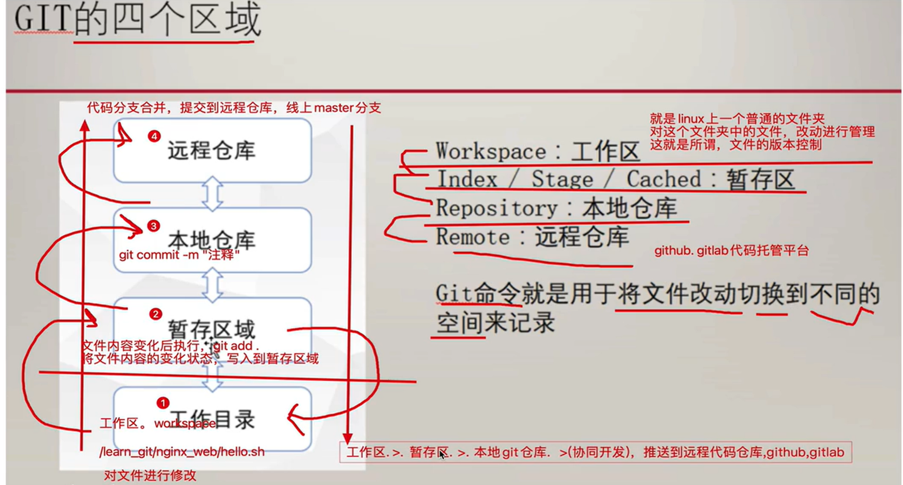
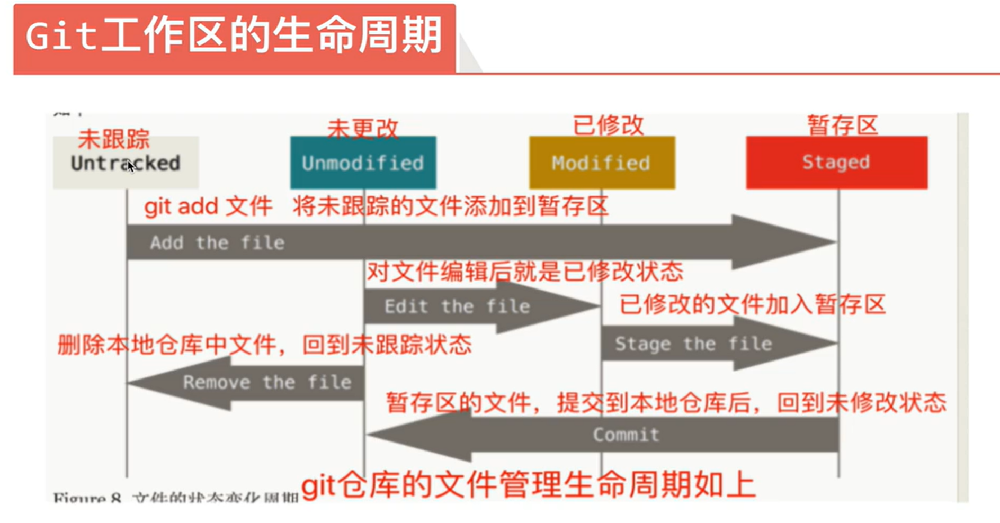
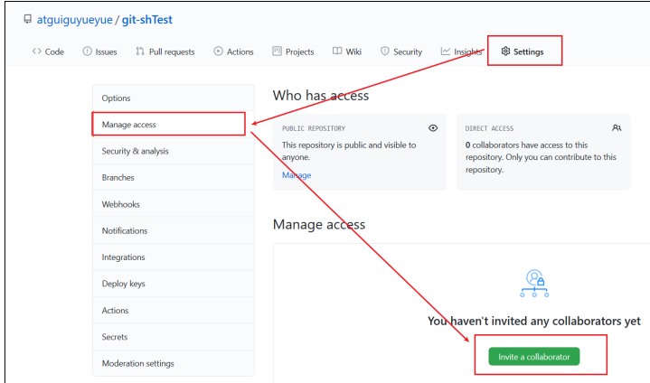
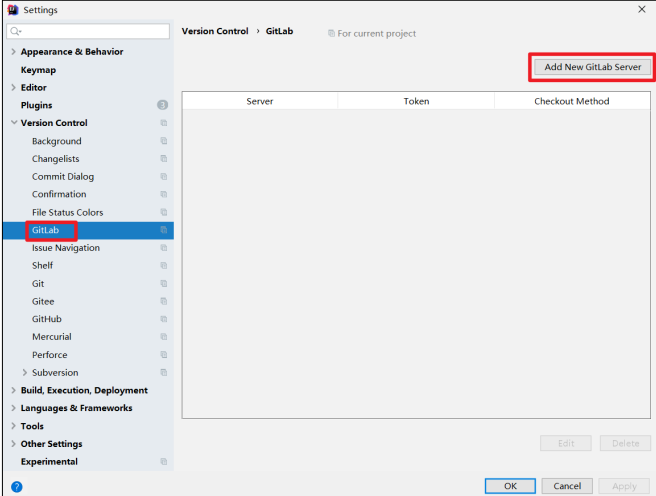

官方文档：https://git-scm.com/doc

GitHub：https://github.com/git/git

# 命令

--system 系统变量，对所有用户都生效，git配置信息写入到/etc/gitconfig

--global 全局变量，对当前用户生效，git配置信息写入到~/.config/git/config

--local 本地变量，对某一个文件夹生效， .git/config

```sh
yum install git -y
git init 初始化本地库
git status 查看本地库状态
git add [name]
git commit -m "message"
git version
```


## 配置

```sh
git config --list 列出所有配置

git config --system --list
等同于 cat /etc/gitconfig

git config --global  --list
等同于 cat ~/.gitconfig

git config --local --list
等同于 cat .git/config

git config user.name 列出某一项配置

git首次安装必须配置用户名：
git config --global user.name “【用户名】” 配置用户名
git config --global user.email “【Email】”  

git config --global color.ui true  配置git语法高亮

git help config 获取config命令的手册
```



```sh
rm -rf test.sh  误删文件

git checkout test.sh  恢复文件
```

## 日志

```sh
git log

git log --oneline  显示简略的git日志

git log -2  显示最新的2个提交记录

git log --all --graph

git log --oneline --decorate --graph

查看历史版本
git reflog
```



## 版本回退

```sh
git reset --hard 【版本id】版本回退

git reset --hard HEAD^ 回退到上一个版本

git reset --hard HEAD^^
```


## stash

```sh
git stash save “注释”  保存暂存区的内容

git stash list 显示stash 保存的任务列表

git stash pop 恢复最新的任务

git stash pop【stash id】恢复指定任务

git stash clear 清空 任务

git stash drop 【id】删除指定任务
```

## 分支

```sh
查看分支
git branch
git branch -v

创建分支
git branch [分支name]

切换分支
git checkout [name]
git checkout -b [name] 创建并切换分支

git merge [name] 合并分支

删除分支
git branch -D [name] 强制删除分支(分支未合并)
git branch -d [name]  删除分支（分支已合并）
```

## 远程 仓库

```sh
git remote
git remote -v

git remote add [name] [addr]关联远程仓库，给远程仓库起别名

git push [name] [branch]推送本地分支

git clone [addr]

git pull [name] [branch] 拉取远程分支并合并
```


## 标签

```sh
git tag 查看当前标签版本

git show [version] 查看指定版本详细信息

git tag -a [version] -m "[message]" 给当前版本加标签

git tag -a [version] [commit id] -m "[message]" 给指定版本加标签

git tag -d [version] 删除tag
```

### 其他

邀请加入团队  



配置免密登录GitHub

```
cd ~
rm -rvf .ssh
ssh-keygen -t rsa -C [email]
```

复制 id_rsa.pub 文件内容，登录 GitHub，点击用户头像→Settings→SSH and GPG keys  

git.ignore 建议放在家目录下

```
# Compiled class file
*.class
# Log file
*.log
# BlueJ files
*.ctxt
# Mobile Tools for Java (J2ME)
.mtj.tmp/
# Package Files #
*.jar
*.war
*.nar
*.ear
*.zip
*.tar.gz
*.rar

hs_err_pid*
.classpath
.project
.settings
target
.idea
*.iml
```

在.gitconfig 文件中引用忽略配置文件  

```
[user]
name = Layne
email = Layne@atguigu.com
[core]
excludesfile = C:/Users/asus/git.ignore
注意：这里要使用“正斜线（/）”，不要使用“反斜线（\）”  
```

### 自建gitlab

```sh
下载
yum install https://packages.gitlab.com/gitlab/gitlabce/packages/el/7/gitlab-ce-13.10.2-ce.0.el7.x86_64.rpm  

编写安装脚本
vim gitlab-install.sh

sudo rpm -ivh /opt/module/gitlab-ce-13.10.2-ce.0.el7.x86_64.rpm
sudo yum install -y curl policycoreutils-python openssh-server cronie
sudo lokkit -s http -s ssh
sudo yum install -y postfix
sudo service postfix start
sudo chkconfig postfix on
curl https://packages.gitlab.com/install/repositories/gitlab/gitlabce/script.rpm.sh | sudo bash
sudo EXTERNAL_URL="http://gitlab.example.com" yum -y install gitlab-ce

chmod +x gitlab-install.sh

./gitlab-install.sh

初始化gitlab服务
gitlab-ctl reconfigure

启动服务
gitlab-ctl start

配置hosts文件
[ip] gitlab-server

浏览器访问
ip/gitlab-server

```

gitlab插件

