# 中药学

我国有中药资源12807种， 其中植物
类11146种， 动物类1581种， 矿物类80种。
中药材中有87%的是来自于植物， 作为中药
的植物， 之所以被用作中药， 是其特性被人
类发现而利用。 他的特性产生不是为人类，
而是为植物本身。 植物为了自身的生存和繁
衍， 必须产生与环境相适应的形态机制和物
质。 人们优选和利用了他们， 变成了中药。  

人们往往把植物的器官作为识别植物
和辨别药材的特征。
由于花的形态特征变异较小， 较其他
器官稳定， 往往能够反映植物在长期
演化过程中所发生的变化。 因此， 花常作为植物分类和鉴别中药
基原植物的依据。  

## 概论

### 一、药用植物学的形成和发展  

#### （一） 药用植物学的萌芽

我国药用植物学的萌芽时期指采取
类比的方法描述药用植物的时期
。

我国有药用植物11146种（包括亚种、
变种或变型1208个） ， 分属于383科
2313属， 约占中药资源总数的87%。  

#### （二） 药用植物学的形成和发展

西方植物学的传入， 和中药传统知识相结合，
形成了药用植物学学科。 人们开始采用定量
的方法描述药用植物， 采用系统发育方法分
类药用植物。  

> 李善兰(1811-1882)， 浙江海宁人， 是中国近
> 代著名的数学家和科学传播家。 创译了一系列
> 植物学术语， 如植物学、 心（雌蕊） 、 须（雄
> 蕊） 、 细胞、 萼、 瓣、 心皮、 子房、 胎座、 胚、
> 胚乳、 唇形科、 伞形科、 石榴科、 菊科、 蔷薇
> 科、 豆科等。 “察植物之精美微妙， 则可见
> 上帝之聪明睿智” ， 已经成为***自然神学***的名句。  

20世纪初至40年代， 有胡先骕、 钱崇树、 张
景钺、 严楚江等植物学家发表了一些植物分
类和植物形态解剖论著。

1934年《中国植物学杂志》 创刊。

至1948年8月药用植物学家李承祐教授编著了
中国第一部《药用植物学》 大学教材。

解放后： 孙雄才（1962） 中国唇形科专家，
丁景和 （1985） 、 谢成科（1986） 、 沈联德
（1995） 、 杨春澍 （1997） 、 詹亚华
（1998） 、 郑汉臣（1999） 教授主编 《药用
植物学》  

### 二、 药用植物学的概念

药用植物（ Medicinal plant） ： 能够调整人体机能、 治
疗疾病的所有药用植物的总称， 包括其全株或部分器官、
组织及其加工制品等药用。

防病、 治病、 保健作用的植物。
全球已知高等植物 28 万多种；
中国有药用植物约 12000 种，
印度尼西亚约 7500 种，
俄罗斯 2000～ 2500 种  

药用植物学（ Pharmaceutical Botany） 是研究
药用植物的形态构造、 分类鉴定、 生长发育、 化
学成分形成与变化及引领新资源开发的一门科学。
研究它们的器官形态、 组织构造、 生理功能、 分
类鉴定、 资源开发和合理利用。

### 三、 药用植物学的研究内容和任务

1. 掌握药用植物的形态、 构造和分类知识

植物形态是学习植物分类、 中药基原鉴定和
性状鉴定的基础； 植物显微构造是学习中药
显微鉴定的基础。 植物分类是药用植物学的
核心内容， 是进行中药和民族药品种整理、
保证中药真实性的重要工具  

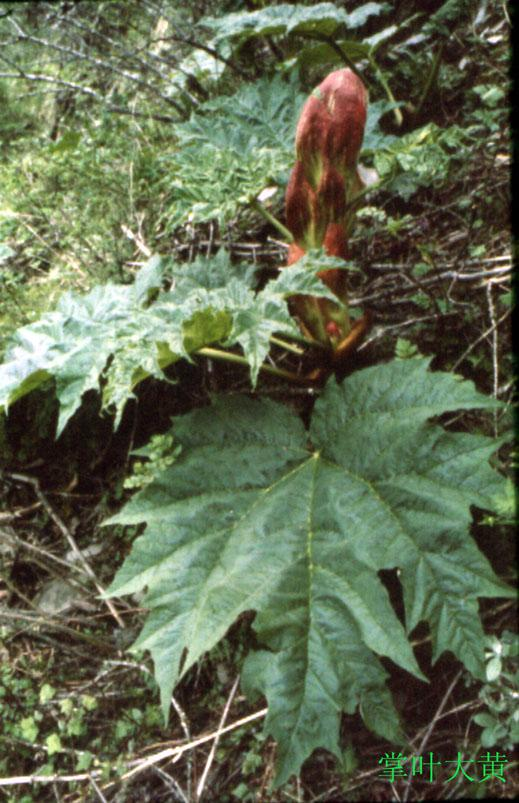

==掌叶大黄Rheum. palmatum==  

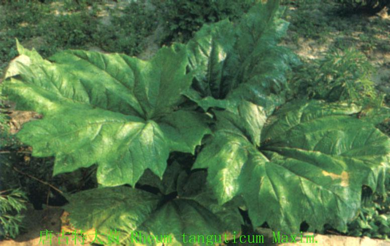

==唐古特大黄 R. tanguticum==  

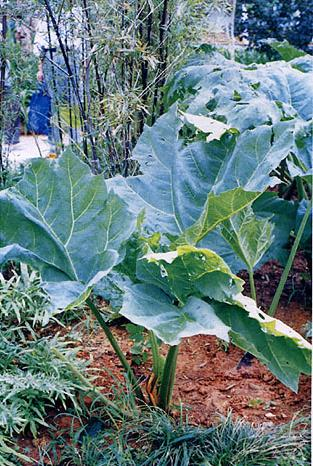

==药用大黄R. officinale==  

八角属 Illicium
八角 I. verum的果实做八角食用和药用
野八角 I. simonsii 的果实含有毒性成分
莽草毒素(anisatin)和2-氧-6-去氧新莽草毒
素  

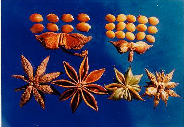

左： 八角； 右： 野八角  

2. 研究药用植物分类鉴定新方法
   在熟练掌握经典分类学的基础上，研究药用
   植物DNA条形码分类鉴定、种质资源分类评价、
   种子种苗鉴定是目前药用植物学的重要任务  

目前DNA条形码研究在植物学领域迅
速发展， 已被引入《 中国药典》
（ 2015年版） ， 也将成为药用植物
学的发展热点  

3. 研究药用植物的生长发育规律
   药用植物的生长发育和药材产量具有密切关系，
   研究药用植物的生长发育规律， 可以为提高药材
   产量奠定理论基础。
   中药的安全性
   研究植物生长调节剂对药用植物产量、 质量和安
   全性的影响也是药用植物学的重要任务。  

4. 研究药用植物化学成分的形成和变化规律
   克隆药用植物化学成分生物合成的功能基因， 并
   对其功能进行表征， 最终解析其生物合成途径是
   揭示药用植物质量形成机制， 寻找调控药用植物
   质量新靶点的基础；
   探寻药用植物化学成分的变化规律， 为优质中药
   材生产奠定基础， 是药用植物学另一个重要任务  

5. 引领药用植物资源开发
   n 利用植物亲缘关系、历代本草文献、民
   间用药经验和国内外药用植物研究新成
   果，结合相关学科，引领药用植物资源
   开发是药用植物学的任务之一。  

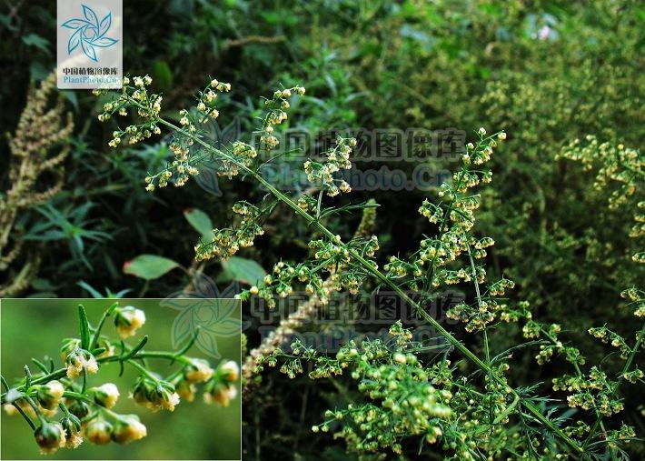

在准确的物种鉴定基础上，发现只有黄花蒿含有青蒿素  

从本草记载治疗疟疾的青蒿(黄花蒿)中已分
离得到高效抗疟成分青蒿素；

从民族药发掘出治疗中风瘫痪有良效的灯盏
细辛以及有麻醉、 止痛、 止血并可作肌松剂
的亚乎奴(锡生藤)等。

近年来， 在广西、 云南找到了可供生产血竭的
剑叶龙血树Dracaena cochinchinensis (Lour.)
S. C. Chen， 填补了国内生产血竭的空白  

研究生物技术新资源

利用组培苗、 毛状根和工程菌， 快速繁
殖药用植物， 生产药用植物的活性成分
越来越受到人们的重视， 已经迅速成为
药用植物学的重要研究方向  

## 根

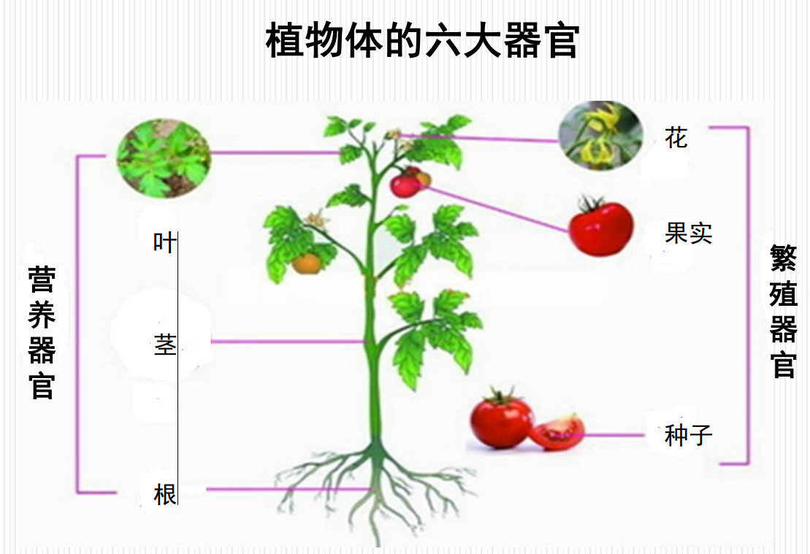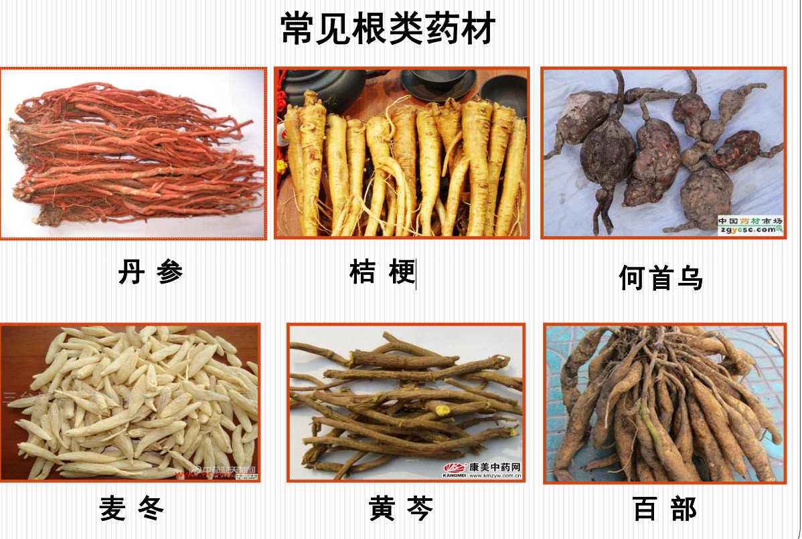

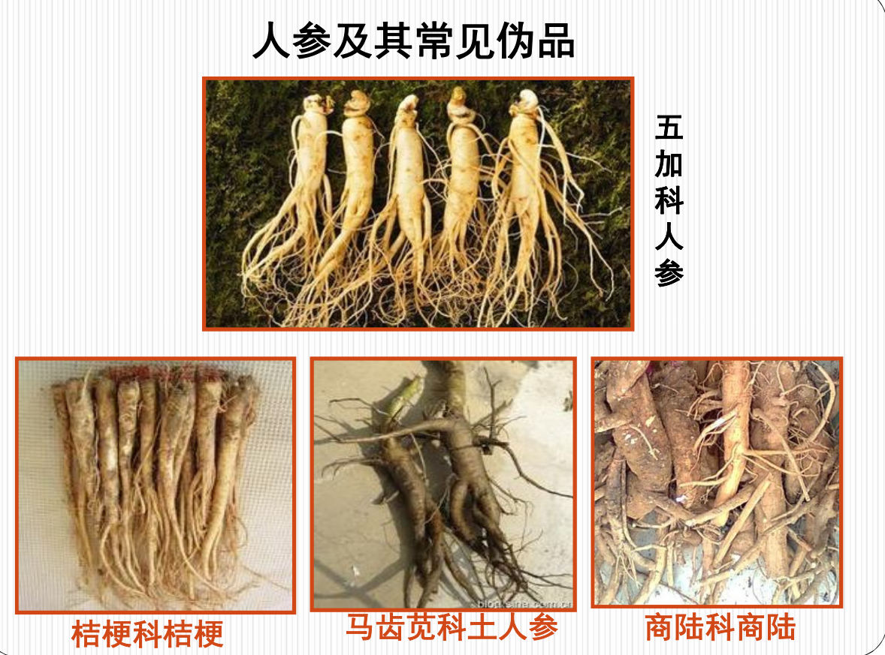

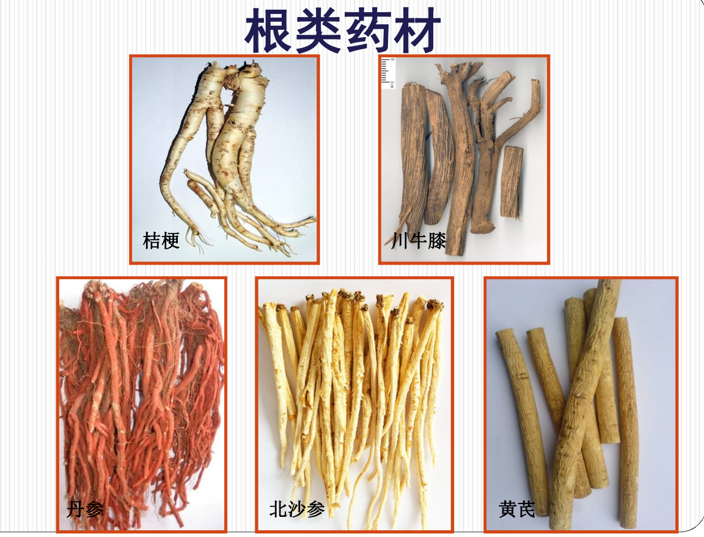

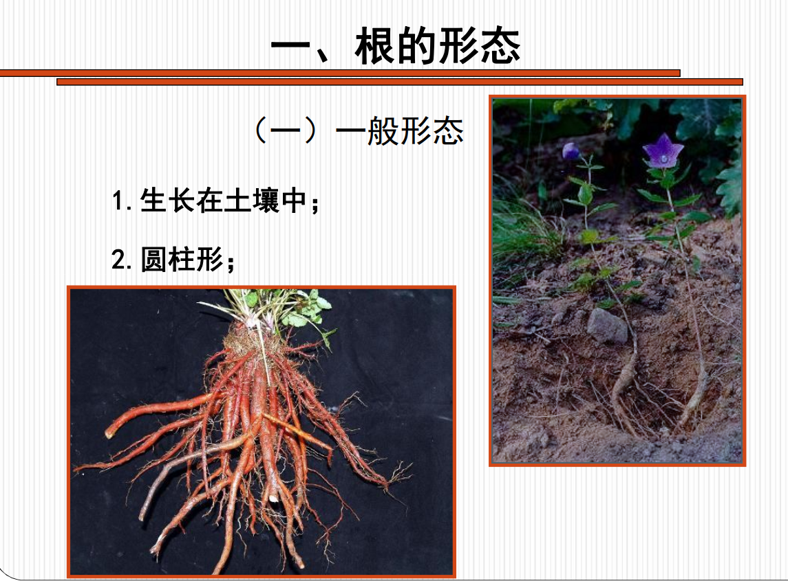

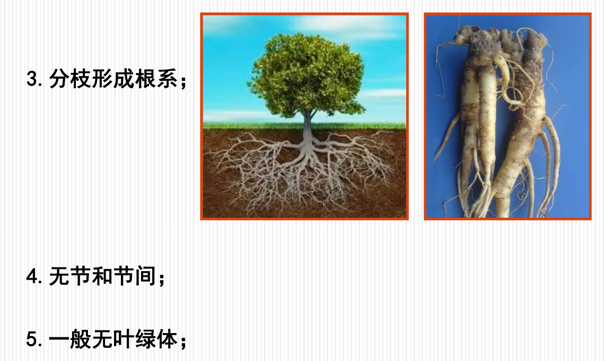

根的变态是指根为了适应环境变化，
在形态、结构和功能上发生的能稳定遗
传的变异。常见根的变态有8种类型：  

1.贮藏根：肥大肉质，贮藏营养物质  

肉质直根和块根的区别

|          | 来源         | 数目 | 组成       | 举例             |
| -------- | ------------ | ---- | ---------- | ---------------- |
| 肉质直根 | 主根         | 一个 | 有胚轴和茎 | 人参、桔梗       |
| 块根     | 不定根或侧根 | 多个 | 无胚轴和茎 | 甘薯、百部、麦冬 |

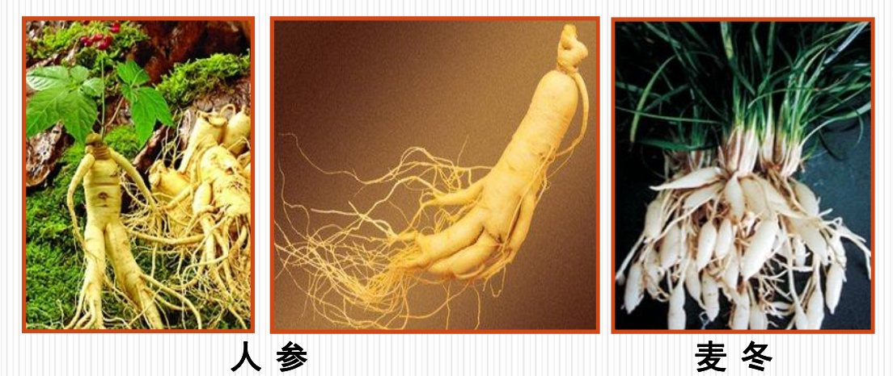

2.支持根：
有些植物在生长的过程中会从靠近地面的茎节处产生许
多不定根，深入到土壤中，增强茎干的支持力量，起到
支持作用

玉米、高粱、薏苡、甘蔗  

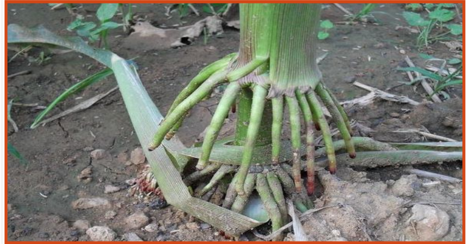

3.气生根：
茎上产生、不伸入土中而暴露在空气中的不定根

吊兰、榕树、石斛。  

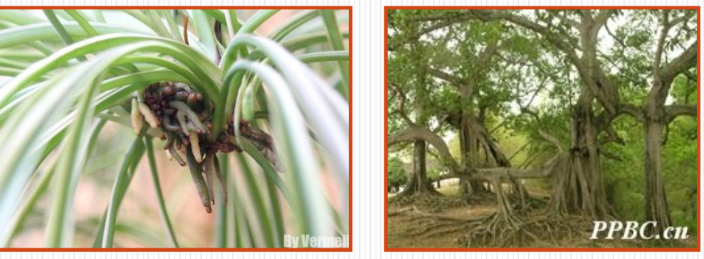

4.攀援根：
茎细长柔弱，不能直立，
茎上生出不定根帮助植物
体攀援上升。

常春藤、爬山虎、络石  

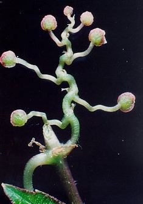

5.水生根：
水生植物的根漂浮在水
中呈须状。

静水面生长的浮萍就有
典型的水生根  

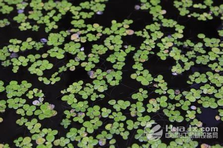

6.寄生根：
寄生植物从寄主体内吸收水分和营养物质的结构，
又称为吸器。

全寄生植物：菟丝子、列当

半寄生植物：槲寄生、桑寄生  

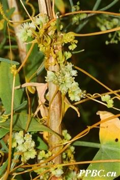

菟丝子  

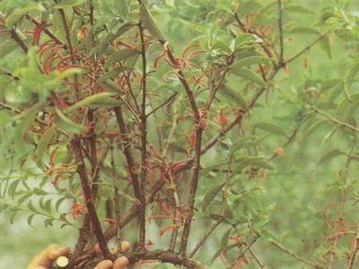

桑寄生  

7.附生根：热带雨林植物
附贴在木本植物的树皮上，并从树皮缝隙内吸收蓄
存的水分，这种根的外表形成根被，由多层厚壁死
细胞组成，可以贮存雨水、露水来供植物体内部组
织使用，干旱时根被失水而被空气所充满。

多见于热带森林中，如兰科、天南星科部分植物常
有附生根  

8.呼吸根：
呼吸根外面有呼吸孔，内有发达的通气组织，有利于
通气和贮存气体。所以当涨潮土壤中缺少空气时，这
些植物就可以利用呼吸根进行呼吸，维持植物的正常
生活。

水龙、红树、白骨壤等。  

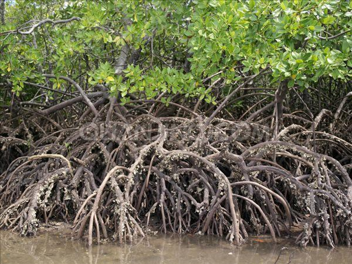

红树  

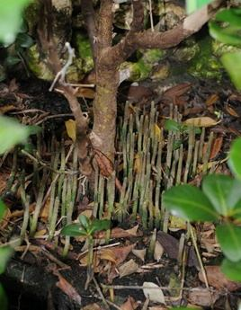

白骨壤  

二、根的类型

（一）主根、侧根和纤维根：根的分支等级

主根：由种子胚根直接发育形成的根。

侧根：当主根生长到一定长度时，侧向生出许多支
根。

纤维根：侧根上形成的小分支  

（二）定根和不定根：根的发生起源

定根：由胚根直接或间接发育而来的主根、
侧根、纤维根，在植物体上有着固定的生长
部位  

不定根：从胚轴、茎、叶或其他部位发生的
根，没有固定的生长部位，称为不定根。玉
米的支持根、吊兰的呼吸根。  

（三）根系：一株植物地下部分全部根的总称。

1、直根系：直根系是指主根发达，主根和侧
根界限明显的根系。绝大多数双子叶植物和裸
子植物均为直根系。桔梗、沙参、人参、蒲公
英等  

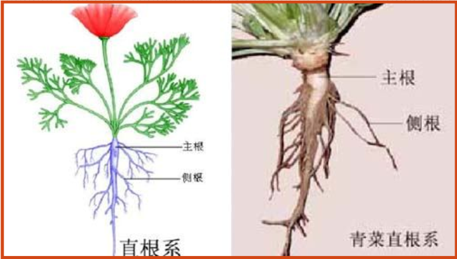

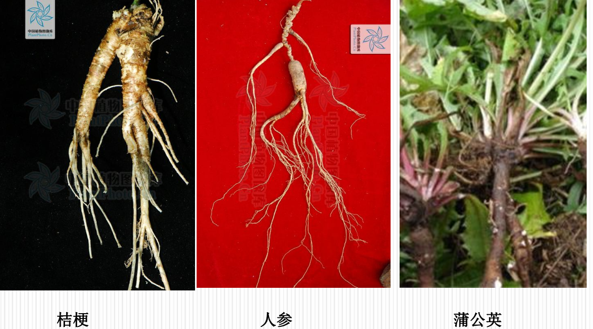

2、须根系：有些植物的主根不发达或者早期
死亡，在胚轴或茎基部的节上生出许多粗细、
长短相仿的不定根，没有明显的主次之分，这
种根系称为须根系。绝大多数单子叶植物为须
根系，如徐长卿、龙胆、玉米、水稻等。  

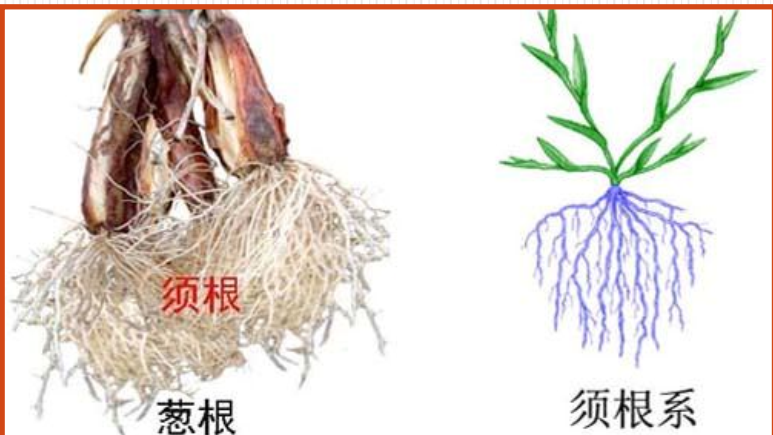

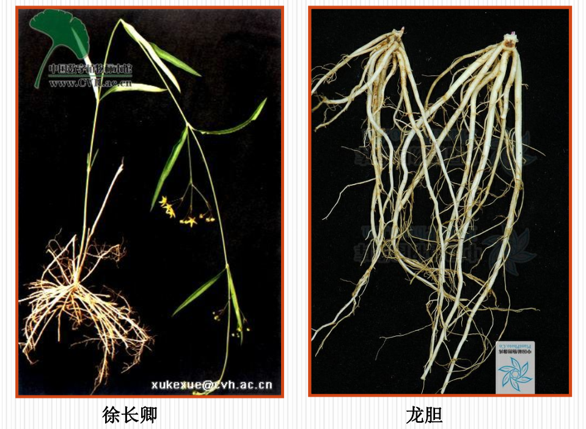

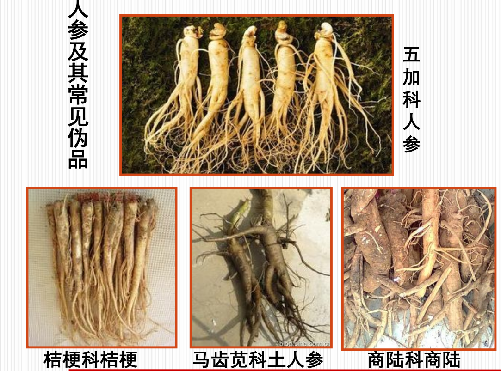