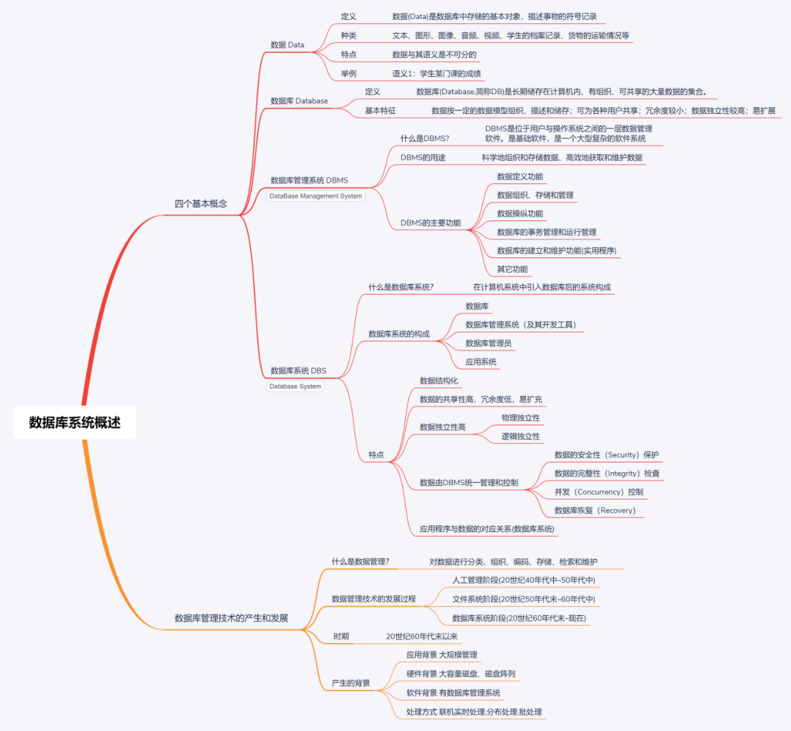
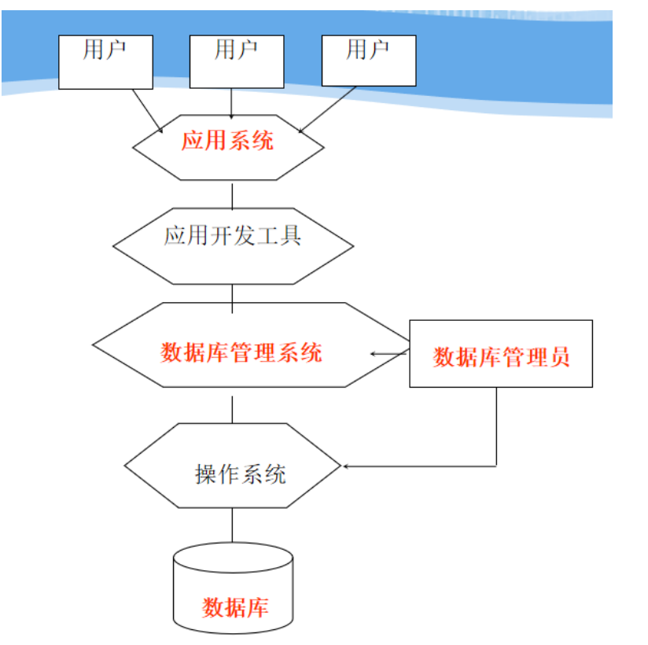
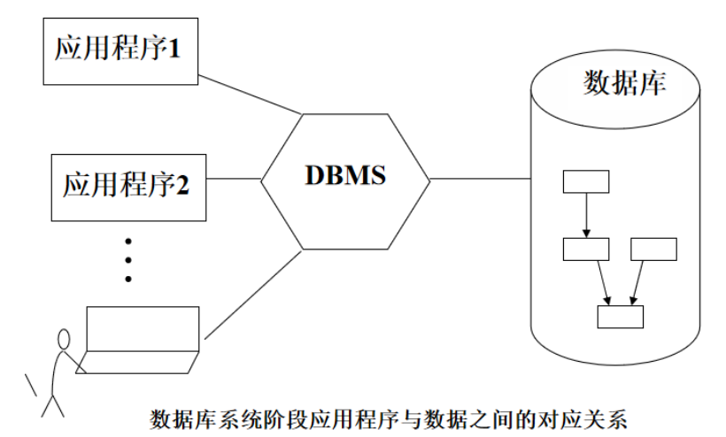

## 1.四大基本概念

### （1）数据–Data

- `数据(Data)是数据库中存储的基本对象`

#### ① 数据的定义

描述事物的符号记录

#### ② 数据的种类

文本、图形、图像、音频、视频、学生的档案记录、货物的运输情况等

#### ③ 数据的特点

数据与其语义是不可分的

#### ④ 数据举例

- `数据的含义称为数据的语义，数据与其语义是不可分的。`

> 例如 93 是一个数据
> 语义 1：学生某门课的成绩
> 语义 2：某人的体重
> 语义 3：计算机系 2003 级学生人数
> 语义 4：请同学给出。。。

> 学生档案中的学生记录
> （李明，男，197205，江苏南京市，计算机系，1990）
> 语义：学生姓名、性别、出生年月、籍贯、所在院系、
> 入学时间
> 解释：李明是个大学生，1972 年 5 月出生，江苏南京市人，1990 年考入计算机系

### （2）数据库–Database

#### ① 数据库的定义

数据库(Database,简称 DB)是`长期储存`在`计算机内`、`有组织`、`可共享`的大量`数据`的`集合`。

#### ② 数据库的基本特征

- 数据按一定的数据模型组织、描述和储存
- 可为各种用户共享
- 冗余度较小
- 数据独立性较高
- 易扩展

### （3）数据库管理系统–DataBase Management System

#### ① 什么是 DBMS?

DBMS 是位于用户与操作系统之间的一层`数据管理软件`。是基础软件，是一个大型复杂的软件系统

#### ② DBMS 的用途

科学地组织和存储数据、高效地获取和维护数据

#### ③ DBMS 的主要功能

- `数据定义功能`
  提供数据定义语言(DDL)
  定义数据库中的数据对象
- `数据组织、存储和管理`
  分类组织、存储和管理各种数据
  确定组织数据的文件结构和存取方式
  实现数据之间的联系
  提供多种存取方法提高存取效率
- `数据操纵功能`
  提供数据操纵语言(DML)
  实现对数据库的基本操作 (查询、插入、删除和修改)
- `数据库的事务管理和运行管理`
  数据库在建立、运行和维护时由 DBMS 统一管理和控制
  保证数据的安全性、完整性、多用户对数据的并发使用
  发生故障后的系统恢复
- `数据库的建立和维护功能(实用程序)`
  数据库初始数据装载转换
  数据库转储
  介质故障恢复
  数据库的重组织
  性能监视分析等
- `其它功能`
  DBMS 与网络中其它软件系统的通信
  两个 DBMS 系统的数据转换
  异构数据库之间的互访和互操作

### （4）数据库系统–Database System

#### ① 什么是数据库系统（Database System，简称 DBS）

在计算机系统中引入数据库后的系统构成

#### ② 数据库系统的构成

- 数据库 Database
- 数据库管理系统（及其开发工具）Database Management System
- 应用系统
- 数据库管理员 Database Administrator

#### ③ 数据库系统的特点

##### ❶ 数据结构化

- `整体数据的结构化`是数据库的主要特征之一
- `整体结构化`
  不再仅仅针对某一个应用，而是面向全组织
  不仅数据内部结构化，整体是结构化的，数据之间具有联系
- `数据库中实现的是数据的真正结构化`
  数据的结构用`数据模型`描述，无需程序定义和解释
  数据可以`变长`
  数据的最小存取单位是`数据项`

##### ❷ 数据的共享性高，冗余度低，易扩充

- 数据库系统从整体角度看待和描述数据，数据面向整个系统，可以被多个用户、多个应用共享使用。
- `数据共享的好处`
  减少数据冗余，节约存储空间
  避免数据之间的不相容性与不一致性
  使系统易于扩充

##### ❸ 数据独立性高

- `物理独立性`
  指用户的应用程序与存储在磁盘上的数据库中数据是相互独立的。当数据的物理存储改变了，应用程序不用改变。
- `逻辑独立性`
  指用户的应用程序与数据库的逻辑结构是相互独立的。数据的逻辑结构改变了，用户程序也可以不变。
- 数据独立性是由 DBMS 的二级映像功能来保证的

##### ❹ 数据由 DBMS 统一管理和控制

**DBMS 提供的数据控制功能**

- (1)·`数据的安全性（Security）保护·`
  保护数据，以防止不合法的使用造成的数据的泄密和破坏。
- (2)`数据的完整性（Integrity）检查`
  将数据控制在有效的范围内，或保证数据之间满足一定的关系。
- (3)`并发（Concurrency）控制`
  对多用户的并发操作加以控制和协调，防止相互干扰而得到错误的结果。
- (4)`数据库恢复（Recovery）`
  将数据库从错误状态恢复到某一已知的正确状态。

##### ❺ 应用程序与数据的对应关系(数据库系统)

## 2.数据管理技术的产生和发展

#### （1） 什么是数据管理

- 对数据进行分类、组织、编码、存储、检索和维护
- 数据处理的中心问题

#### （2） 数据管理技术的发展过程

- 人工管理阶段(20 世纪 40 年代中–50 年代中)
- 文件系统阶段(20 世纪 50 年代末–60 年代中)
- 数据库系统阶段(20 世纪 60 年代末–现在)

#### （3）时期

- 20 世纪 60 年代末以来

#### （4） 产生的背景

- 应用背景 大规模管理
- 硬件背景 大容量磁盘、磁盘阵列
- 软件背景 有数据库管理系统
- 处理方式 联机实时处理,分布处理,批处理
