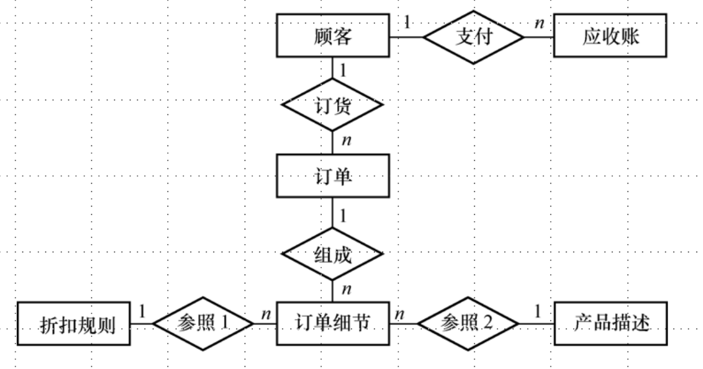

# 1.数据库设计概述及六步骤简介

> 数据库设计是指对于一个给定的应用环境，构造最优的数据库模式，建立数据库及其应用系统，使之能够有效地存储数据，满足各种用户的应用需求。

1. 数据库设计的特点
   数据库设计是一项涉及多学科的综合性技术，又是一项庞大的工程项目，具有如下特点：
   (1) 数据库建设是硬件、软件和干件（技术和管理的界面）的结合。
   (2) 数据库设计应该和应用系统设计相结合。
2. 数据库设计方法
   常用的数据库设计方法如下：
   （1）新奥尔良方法：将数据库设计分为若干阶段和步骤
   （2）基于 E-R 模型的设计方法：概念设计阶段广泛采用
   （3）基于 3NF 的设计方法：逻辑阶段可采用的有效方法
   （4）ODL（Object Definition Language）方法：面向对象的数据库设计方法
   （5）计算机辅助设计：ORACLE Designer 2000、SYBASE PowerDesigner
3. `数据库设计的基本步骤`
   数据库设计分为 6 个阶段：
   （1） 需求分析：准确了解与分析用户需求（包括数据与处理）。
   （2）概念结构设计：对用户需求进行综合、归纳与抽象，形成一个独立于具体 DBMS的概念模型。
   （3）逻辑结构设计：将概念结构转换为某个 DBMS 所支持的数据模型，并对其进行优化。
   （4）物理结构设计：为逻辑数据模型选取一个最适合应用环境的物理结构（包括存储结构和存取方法）。
   （5） 数据库实施：建立数据库，编制与调试应用程序，组织数据入库，并进行试运行。
   （6）数据库运行和维护：对数据库系统进行评价、调整与修改。

> 需求分析和概念设计独立于任何数据库管理系统
> 逻辑设计和物理设计与选用的DBMS密切相关

# 2.需求分析—步骤一

> 需求分析是整个数据库设计过程中最重要的步骤之一，是后继各阶段的基础。在需求分析阶段，从多方面对整个组织进行调查，收集和分析各项应用对信息和处理两方面的需求。

## 2.1 收集资料

收集资料是数据库设计人员和用户共同完成的任务。确定企业组织的目标，从这些目标导出对数据库的总体要求。通过调研，确定由计算机完成的功能。

## 2.2 分析整理

分析的过程是对所收集到的数据进行抽象的过程，产生求解的模型。

## 2.3 数据流图

采用数据流图来描述系统的功能。数据流图可以形象地描述事务处理与所需数据的关联，便于用结构化系统方法，自顶向下，逐层分解，步步细化。

## 2.4 数据字典

对数据流图中的数据流和加工等进一步定义，从而完整地反映系统需求。
**数据字典的用途：**
进行详细的数据收集和数据分析所获得的主要结果
**数据字典的内容：**
数据项
数据结构
数据流
数据存储
处理过程

## 2.5 用户确认

需求分析得到的数据流图和数据字典要返回给用户，通过反复完善，最终取得用户的认可。

# 3.概念结构设计—步骤二

> 概念设计阶段的目标是产生整体数据库概念结构，即概念模式。概念模式是整个组织各个用户关心的信息结构。描述概念结构的有力工具是 E-R 模型。

## 3.1 E-R 模型

（1）基本 E-R 模型
E-R 模型通过 E-R 图表示出来。
将所有实体属性和实体之间的联系均描述出来就构成了一个 E-R 图

**（2）基本 E-R 模型的扩展**
**数据抽象**
一般有 3 种抽象：
(1)分类: 它抽象了对象值和型之间“is member of”的语义。

(2)聚集 :它抽象了对象内部类型和成分之间“is part of”的语义。

(3)概括 :它抽象了类型之间“is subset of”的语义。

**依赖联系**

> 在现实世界中，常常有某些实体对于另一些实体具有很强的依赖关系，即一个实体的存在必须以另一实体的存在为前提。通常把前者称为弱实体。
> 在E-R图中，用双线框表示弱实体，用指向弱实体的箭头表明依赖联系。

**超类和子类**

> 概括定义了类型之间的一种子集联系。
> 例如：学生是一个实体型，本科生、研究生也是实体型。本科生、研究生均是学生的子集。把学生称为超类，本科生、研究生称为学生的子类。
> 在E-R图中，用双竖边的矩形框表示子类，用直线加小圆圈表示超类-子类联系。
> 子类继承超类上定义的全部属性，其本身还可包含其他属性。

## 3.2 建立 E-R 模型

（1）设计局部 E-R 模型
确定局部结构范围
定义实体
联系定义
属性分配

（2）设计全局 E-R 模型
确定公共实体类型
局部E-R模型的合并
消除冲突

（3）全局 E-R 模型的优化
实体类型的合并
冗余属性的消除
冗余联系的消除

# 4.逻辑结构设计—步骤三

> 逻辑结构设计就是把上述概念模型转换成为某个具体的数据库管理系统所支持的数据模型。

## 4.1 E-R 模型向关系模式的转换

**转换原则:**
（1）每一个实体类型转换为一个关系模式，实体的属性就是关系的属性，实体的码就是关系的码。
（2）联系的转换
① 一般1:1，1:m联系不产生新的关系模式，而是将一方实体的码加入到多方实体对应的关系模式中，联系的属性也一并加入。
②m:n联系要产生一个新的关系模式，该关系模式由联系涉及实体的码加上联系的属性（若有）组成。

**具体做法：**

（1）两实体间的 1:1 联系

> 一个 1:1 联系可以转换为一个独立的关系模式，也可以与任意一端对应的关系模式合并。如果转换为一个独立的关系模式，则与该联系相连的各实体的码以及联系本身的属性均转换为关系的属性，每个实体的码均是该关系的候选码。如果与某一端实体对应的关系模式合并，则需要在该关系模式的属性中加入另一个关系模式的码和联系本身的属性。可将任一方实体的主码纳入另一方实体对应的关系中，若有，联系的属性也一并纳入。

例如，如图 6.1 所示的 E-R 图可转换为如下关系模式：
工厂（厂号，厂名，地点，姓名，任期）
厂长（姓名，性别，年龄）
或者：
工厂（厂号，厂名，地点）
厂长（姓名，性别，年龄，厂号，任期）

（2）两实体间的 1:m 联系

> 可将“1”方实体的主码纳入“m”方实体对应的关系中作为外码，同时把联系的属性也一并纳入“m”方对应的关系中。

例如，如图 6.2 所示的 E-R 图转换为如下关系模式：
仓库（仓库号，地点，面积）
商品（货号，品名，价格，仓库号，数量）

（3）同一实体间的 1:m 联系

> 可在这个实体所对应的关系中多设一个属性，作为与该实体相联系的另一个实体的主码。

例如，如图 6.3 所示的 E-R 图可转换为如下关系模式：
职工（工号，姓名，年龄，性别，职称，工资，领导者工号，民意测验）

（4）两实体间的弱实体联系

> 可将被依赖实体的主码纳入弱实体中，作为弱实体的主码或主码中的一部分。

例如，如图 6.4 所示的 E-R 图可转换为如下关系模式：
职工（工号，姓名，年龄，性别，职称）
亲属（工号，亲属姓名，亲属关系）

（5）超类和子类的转换

> 超类、子类实体都可转换为一个关系，并将超类实体的主码加到子类实体中。

例如，如图 6.5 所示的 E-R 图中各个实体的属性为：
职员：职工号，姓名，性别，年龄，参加工作时间
飞行员：飞行小时，健康检查，飞机型号
机械师：学历，级别，专业职称
管理员：职务，职称

该 E-R 图转换为如下关系模式：

职员（职工号，姓名，性别，年龄，参加工作时间）
飞行员（职工号，飞行小时，健康检查，飞机型号）
机械师（职工号，学历，级别，专业职称）
管理员（职工号，职务，职称）

为了查询方便，可在超类实体中增加一个指示器属性，根据指示器的值直接查询子类实体表。所以，职员关系又可以为：
职员（职工号，姓名，性别，年龄，参加工作时间，职员类型）

（6）两实体间的 m:n 联系

> 必须对“联系”单独建立一个关系，该关系中至少包含被它所联系的双方实体的“主码”，如果联系有属性，也要纳入这个关系中。

例如，如图 6.6 所示的 E-R 图转换为如下关系模式：
学生（学号，姓名，性别，年龄）
课程（课程号，课程名，学时）
选修（学号，课程号，成绩）

（7）同一实体间的 m:n 联系

> 必须为这个“联系”单独建立一个关系，该关系中至少应包含被它所联系的双方实体的“主码”，如果联系有属性，也要纳入这个关系中。由于这个“联系”只涉及一个实体，所以加入的实体的主码不能同名。

例如，如图 6.7 所示的 E-R 图转换为如下关系模式：
零部件（代号，名称，价格）
组装（代号，组装件代号，数量）

（8）两个以上实体间的 m:n 联系

> 必须为这个“联系”单独建立一个关系，该关系中至少应包含被它所联系的各个实体的“主码”，若是联系有属性，也要纳入这个关系中。

例如，如图 6.8 所示的 E-R 图可转换为如下关系模式：
供应商（供应商号，供应商名，地址）
零件（零件号，零件名，重量）
项目（项目编号，项目名称，开工日期）
供应（供应商号，项目编号，零件号，零件数）

## 4.2 关系模式的优化

> 最核心的就是要遵循数据库设计的nF范式

应用关系规范化理论对上述产生的关系模式进行优化，具体步骤如下：
（1）确定每个关系模式内部各个属性之间的数据依赖以及不同关系模式属性之间的数据依赖。
（2）对各个关系模式之间的数据依赖进行最小化处理，消除冗余的联系。
（3）确定各关系模式的范式等级。
（4）按照需求分析阶段得到的处理要求，确定要对哪些模式进行合并或分解。
（5）为了提高数据操作的效率和存储空间的利用率，对上述产生的关系模式进行适当的修改、调整和重构。

## 4.3 设计用户子模式

> 全局关系模型设计完成后，还应根据局部应用的需求，结合具体 DBMS 的特点，设计用户的子模式。

设计子模式时应注意考虑用户的习惯和方便性，主要包括：
（1）使用更符合用户习惯的别名。
（2）可以为不同级别的用户定义不同的视图，以保证系统的安全性。
（3）可将经常使用的复杂的查询定义为视图，简化用户对系统的使用。

# 5.物理结构设计—步骤四

> 数据库的物理设计是指对一个给定的逻辑数据库模型选取一个最适合应用环境的物理结构的过程。物理设计通常分为两步：

## 5.1 确定数据库的物理结构

（1）确定数据的存取方法

- 索引方法的选择
- 聚簇方法的选择

（2）确定数据的存储结构

- 确定数据的存放位置
  基本原则:根据应用情况将易变部分与稳定部分分开存放、存取频率较高部分与存取频率较低部分分开存放
- 确定系统配置
  DBMS产品一般都提供了一些存储分配参数
  同时使用数据库的用户数
  同时打开的数据库对象数
  内存分配参数
  使用的缓冲区长度、个数
  存储分配参数
  …….

## 5.2 物理结构进行评价

> 对时间效率、空间效率、维护开销和各种用户要求进行权衡，从多种设计方案中选择一个较优的方案。

评价方法（完全依赖于所选用的DBMS ）

- 定量估算各种方案
  存储空间
  存取时间
  维护代价
- 对估算结果进行权衡、比较，选择出一个较优的合理的物理结构
- 如果该结构不符合用户需求，则需要修改设计

# 6.数据库实施—步骤五

**实施阶段的工作主要有：**

- 建立数据库结构
- 数据载入
  数据库结构建立好后，就可以向数据库中装载数据了。组织数据入库是数据库实施阶段最主要的工作。
- 应用程序的编码和调试
- 数据库试运行
  `功能测试`
  实际运行数据库应用程序，执行对数据库的各种操作，测试应用程序的功能是否满足设计要求
  如果不满足，对应用程序部分则要修改、调整，直到达到设计要求
  `性能测试`
  测量系统的性能指标，分析是否达到设计目标
  如果测试的结果与设计目标不符，则要返回物理设计阶段，重新调整物理结构，修改系统参数，某些情况下甚至要返回逻辑设计阶段，修改逻辑结构

# 7.数据库运行维护—步骤六

**数据库系统投入正式运行后，对数据库经常性的维护工作主要由 DBA 完成，包括：**

- 数据库的转储和恢复
  在数据库试运行阶段，系统还不稳定，硬、软件故障随时都可能发生
  系统的操作人员对新系统还不熟悉，误操作也不可避免
  因此必须做好数据库的转储和恢复工作，尽量减少对数据库的破坏
- 数据库的安全性、完整性控制
- 数据库性能的监督、分析和改造
- 数据库的重组与重构
  `重组织的目标`
  提高系统性能
  `重组织的工作`
  按原设计要求
  重新安排存储位置
  回收垃圾
  减少指针链
  数据库的重组织不会改变原设计的数据逻辑结构和物理结构
  `数据库重构造`
  根据新环境调整数据库的模式和内模式
  增加新的数据项
  改变数据项的类型
  改变数据库的容量
  增加或删除索引
  修改完整性约束条件

参考：《数据库系统概论第五版》、《数据库原理习题与解析第二版》