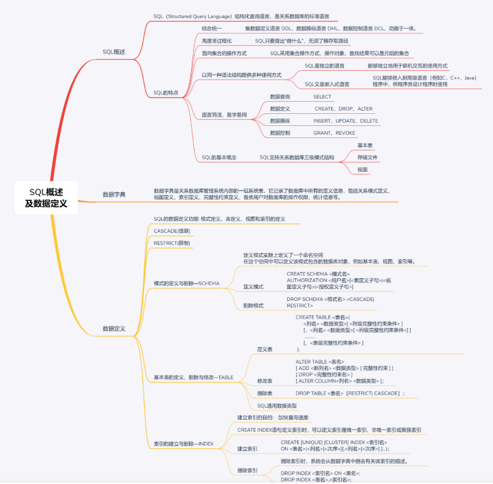
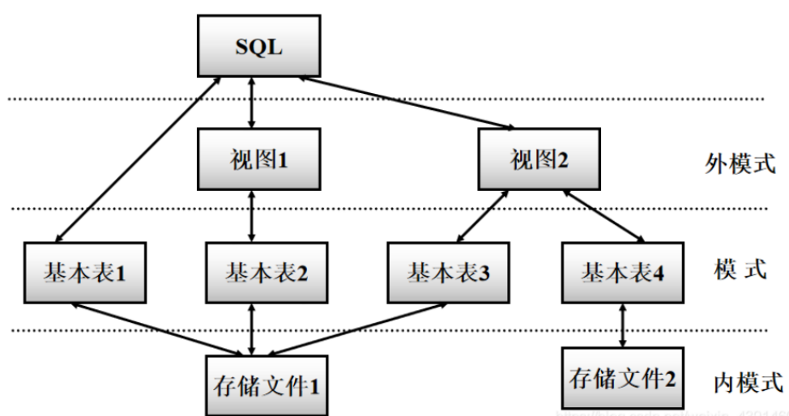
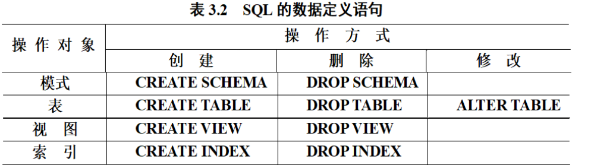
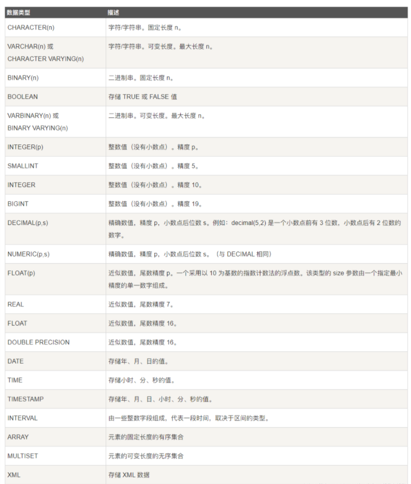

## SQL概述

### （1）什么是SQL?

- SQL（Structured Query Language）结构化查询语言，是关系数据库的标准语言
- SQL是一个通用的、功能极强的关系数据库语言

### （2）SQL的特点

**① 综合统一**

- 集数据定义语言 DDL(Data Definition Language)，数据操纵语言 DML（Data Manipulation Language），数据控制语言 DCL(Data Control Language) 功能于一体。
- 可以独立完成数据库生命周期中的全部活动：
  - 定义关系模式，插入数据，建立数据库；
  - 对数据库中的数据进行查询和更新；
  - 数据库重构和维护
  - 数据库安全性、完整性控制等
- 用户数据库投入运行后，可根据需要随时逐步修改模式，不影响数据的运行。
- 数据操作符统一

**② 高度非过程化**

- 非关系数据模型的数据操纵语言“面向过程”，必须制定存取路径
- SQL只要提出“做什么”，无须了解存取路径。
- 存取路径的选择以及SQL的操作过程由系统自动完成。

**③ 面向集合的操作方式**

- 非关系数据模型采用面向记录的操作方式，操作对象是一条记录
- SQL采用集合操作方式：
  - 操作对象、查找结果可以是元组的集合
  - 一次插入、删除、更新操作的对象可以是元组的集合

**④ 以同一种语法结构提供多种使用方式**

- SQL是独立的语言
  - 能够独立地用于联机交互的使用方式
- SQL又是嵌入式语言
  - SQL能够嵌入到高级语言（例如C，C++，Java）程序中，供程序员设计程序时使用

**⑤ 语言简洁，易学易用**

- SQL功能极强，完成核心功能只用了9个动词。

| SQL功能  | 动词                   |
| -------- | ---------------------- |
| 数据查询 | SELECT                 |
| 数据定义 | CREATE、DROP、ALTER    |
| 数据操纵 | INSERT、UPDATE、DELETE |
| 数据控制 | GRANT、REVOKE          |

### （3） SQL的基本概念

- SQL支持关系数据库三级模式结构


**基本表**

- 本身独立存在的表
- SQL中一个关系就对应一个基本表
- 一个(或多个)基本表对应一个存储文件
- 一个表可以带若干索引

**存储文件**

- 逻辑结构组成了关系数据库的内模式
- 物理结构是任意的，对用户透明

**视图**

- 从一个或几个基本表导出的表
- 数据库中只存放视图的定义而不存放视图对应的数据
- 视图是一个虚表
- 用户可以在视图上再定义视图

## 数据字典

- `数据字典`是`关系数据库管理系统内部`的一组`系统表`，`它记录了数据库中所有的定义信息，包括关系模式定义、视图定义、索引定义、完整性约束定义、各类用户对数据库的操作权限、统计信息等`。
- 关系数据库管理系统在执行SQL的数据定义语句时，实际上就是在更新数据字典表中的相应信息。
- 在进行查询优化和查询处理时，数据字典中的信息是其重要依据。

## 数据定义

### （1）数据定义概览

- SQL的数据定义功能: `模式定义`、`表定义`、`视图`和`索引`的定义



### （2）模式的定义与删除—SCHEMA

**定义模式实际上定义了一个`命名空间`**

- 在这个`空间`中可以`定义`该`模式`包含的`数据库对象`，例如`基本表`、`视图`、`索引`等。
- 在CREATE SCHEMA中可以接受CREATE TABLE，CREATE VIEW和GRANT子句。
- `CREATE SCHEMA <模式名> AUTHORIZATION <用户名>[<表定义子句>|<视图定义子句>|<授权定义子句>]`
- 如果没有指定<模式名>，那么<模式名>隐含为<用户名>

### （3）基本表的定义、删除与修改—TABLE

#### ① 定义基本表的标准格式

```sql
CREATE TABLE <表名>(
      <列名> <数据类型>[ <列级完整性约束条件> ]
      [，<列名> <数据类型>[ <列级完整性约束条件>] ]
       ………
      [，<表级完整性约束条件> ]
 );

1234567
```

- `如果完整性约束条件涉及到该表的多个属性列，则必须定义在表级上，否则既可以定义在列级也可以定义在表级。`

#### ② 数据类型

- SQL中`域`的概念用`数据类型`来实现
- 定义表的`属性`时 需要指明其`数据类型及长度`
- 选用哪种数据类型
  - 取值范围
  - 要做哪些运算
- 以下是通用数据类型，不同数据库的数据类型可能有所不同，可查相关文档。



#### ③ 修改基本表

```sql
ALTER TABLE <表名>
[ ADD <新列名> <数据类型> [ 完整性约束 ] ]
[ DROP <完整性约束名> ]
[ ALTER COLUMN<列名> <数据类型> ]；
1234
```

#### ④ 删除基本表

**标准格式：**
`DROP TABLE <表名>［RESTRICT| CASCADE］；`

- ```
  RESTRICT
  ```

  ：删除表是有限制的。

  - 欲删除的基本表不能被其他表的约束所引用
  - 如果存在依赖该表的对象，则此表不能被删除

- ```
  CASCADE
  ```

  ：删除该表没有限制。

  - 在删除基本表的同时，相关的依赖对象一起删除


### （4）索引的建立与删除—INDEX

**建立索引的目的：`·加快查询速度·`**

- 谁可以建立索引？
  - DBA 或 表的属主（即建立表的人）
  - DBMS一般会自动建立以下列上的索引
  - PRIMARY KEY
  - UNIQUE
- 谁维护索引？
  DBMS自动完成
- 使用索引
  DBMS自动选择是否使用索引以及使用哪些索引
- RDBMS中索引一般采用B+树、HASH索引来实现
  - B+树索引具有动态平衡的优点
  - HASH索引具有查找速度快的特点
- 采用B+树，还是HASH索引 则由具体的RDBMS来决定
- 索引是关系数据库的内部实现技术，属于内模式的范畴
- `CREATE INDEX`语句定义索引时，可以定义索引是`唯一索引、非唯一索引或聚簇索引`

#### ① 建立索引的标准格式

**语句格式**

```sql
CREATE [UNIQUE] [CLUSTER] INDEX <索引名> 
ON <表名>(<列名>[<次序>][,<列名>[<次序>] ]…)；	
12
```

#### ② 删除索引

**`DROP INDEX <索引名> ON <表名>;`
`DROP INDEX <表名>.<索引名>;`**

- 删除索引时，系统会从数据字典中删去有关该索引的
  描述。


