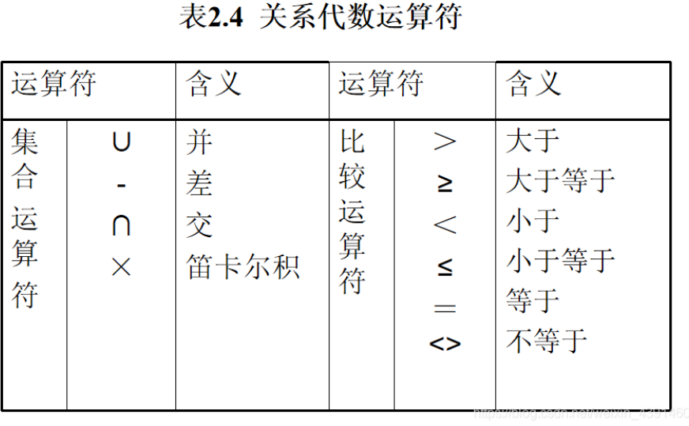
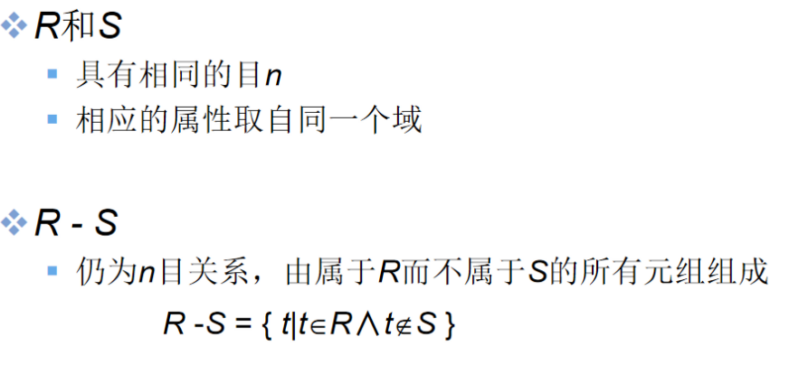
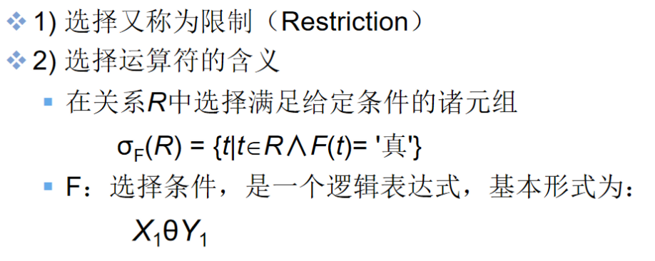

# 关系数据结构及形式化定义


## 1. 关系

**什么是关系？**

- 单一的数据结构----关系
  现实世界的`实体以及实体间的各种联系`均用关系来表示
- 逻辑结构----二维表
  从用户角度，`关系模型中数据的逻辑结构`是一张`二维表`
- 建立在集合代数的基础上

### （1）域（Domain）

- `域`是一组具有`相同数据类型的值的集合`。例:
  整数
  实数
  介于某个取值范围的整数
  长度指定长度的字符串集合
  {‘男’，‘女’}
  ………………

### （2）笛卡尔积（Cartesian Product）

- `笛卡尔积`
  给定一组域D1，D2，…，Dn，这些域中可以有相同的。
  D1，D2，…，Dn的`笛卡尔积`为：
- 
- `所有域的所有取值的一个组合`；
  不能重复；
- `元组`（Tuple）
  `笛卡尔积中每一个元素`（d1，d2，…，dn）叫作`一个n元组`（n-tuple）或简称`元组`(Tuple);
  (张清玫，计算机专业，李勇)、(张清玫，计算机专业，刘晨)等都是元组 ;
- `分量`（Component）
  笛卡尔积元素（d1，d2，…，dn）中的每一个值di叫作一个`分量`;
  张清玫、计算机专业、李勇、刘晨等都是`分量` ;
- `基数`（Cardinal number）
  可以把基数看做笛卡尔积元素的个数，及元组的个数；
  若Di（i＝1，2，…，n）为有限集，其`基数`为mi（i＝1，2，…，n），则D1×D2×…×Dn的基数M为：
- 
- 笛卡尔积的表示方法:
  笛卡尔积可表示为一个`二维表`;
  表中的`每行`对应一个`元组`，表中的每列对应一个`域`;

### （3）关系（Relation）

- `关系`
  `·笛卡尔积·`D1×D2×…×Dn的`子集`叫作在`域`D1，D2，…，Dn上的`关系`，表示为：


- R：关系名
  n：关系的`目`或`度`（Degree）
- `元组`
  `·关系·`中的每个元素是关系中的`元组`，通常用t表示。
- `单元关系与二元关系`
  当n=1时，称该关系为`单元关系`（Unary relation）或`一元关系` ;
  当n=2时，称该关系为`二元关系`（Binary relation）;
- `·关系的表示·`
  关系也是一个`二维表`，表的`每行`对应一个`元组`，表的每`列`对应一个`域`

- `属性`
  关系中不同列可以对应相同的域;
  为了加以区分，必须对每`列`起一个`名字`，称为`属性`（Attribute）;
  n目关系必有n个属性;
- `码`
  - `候选码`（Candidate key）
    若关系中的某一`属性组`的值能`唯一地标识一个元组`，则称该属性组为候选码;
    简单的情况：候选码只包含一个属性;
  - `全码`（All-key）
    最极端的情况：`关系模式的所有属性组是这个关系模式的候选码，称为全码`（All-key）;
  - `主码`
    若一个关系有`多个候选码`，则`选定其中一个为主码`（Primary key）;
  - `主属性`
    `候选码的诸属性称为主属性`（Prime attribute）;
    `不包含在任何侯选码中的属性称为非主属性`（ Non-Prime attribute）或非码属性（Non-key attribute） ;

D1，D2，…，Dn的笛卡尔积的`某个子集才有实际含义`
`·例：·`表2.1 的笛卡尔积`没有实际意义`
`取出有实际意义的元组`来构造关系
关系：SAP(SUPERVISOR，SPECIALITY，POSTGRADUATE)

### （4）三类关系

- `基本关系`（基本表或基表）
  实际存在的表，是实际存储数据的逻辑表示
- `查询表`
  查询结果对应的表
- `视图表`
  由基本表或其他视图表导出的表，是虚表，不对应实际存储的数据

- 由基本表或其他视图表导出的表，是虚表，不对应实际存储的数据

> - 在 SQL 中，`视图是基于 SQL 语句的结果集的可视化的表`。
> - 视图包含行和列，就像一个真实的表。视图中的字段就是来自一个或多个数据库中的真实的表中的字段。
> - 我们可以向视图添加 SQL 函数、WHERE 以及 JOIN 语句，我们也可以提交数据，就像这些来自于某个单一的表。
> - 注释：数据库的设计和结构不会受到视图中的函数、where 或 join 语句的影响。

- `基本关系(二维表)的性质`

   ① 列是同质的（Homogeneous）;

② 不同的列可出自同一个域,其中的每一列称为一个属性,不同的属性要给予不同的属性名;

③ 列的顺序无所谓，列的次序可以任意交换;

④ 任意两个元组的候选码不能相同;

⑤ 行的顺序无所谓，行的次序可以任意交换;

⑥ 分量必须取原子值,这是规范条件中最基本的一条;

## 2.关系模式

### （1）什么是关系模式

**关系模式（Relation Schema）是`型`**
**关系是`值`**
**`关系模式`是对`关系`的`描述`:**

- 元组集合的结构
  - 属性构成
  - 属性来自的域
  - 属性与域之间的映象关系
- 元组语义以及完整性约束条件
- 属性间的数据依赖关系集合

### （2）定义关系模式

**关系模式可以形式化地表示为：**

- R（U，D，DOM，F）
- R 关系名
- U 组成该关系的属性名集合
- D 属性组U中属性所来自的域
- DOM 属性向域的映象集合
- F 属性间的数据依赖关系集合

**关系模式通常可以简记为**
R (U) 或 R (A1，A2，…，An)
R: 关系名
A1，A2，…，An : 属性名
注：域名及属性向域的映象常常直接说明为属性的类型、长度

## 3.关系模式和关系的对比

- **关系模式**
  对关系的描述
  静态的、稳定的
- **关系**
  关系模式在某一时刻的状态或内容
  动态的、随时间不断变化的
  关系模式和关系往往统称为关系

> ```
> 在数据库学科中可以把关系模式理解为表的结构、属性之间的关系、约束条件，把关系理解为二维表
> ```

## 4.关系数据库

- `关系数据库·`
  在一个给定的应用领域中，所有·关系的集合·构成一个关系数据库
- ·`关系数据库模式`包括
  若干域的定义;
  在这些域上定义的若干关系模式;
- `关系数据库`的·`型`·与`值`
  关系数据库的`型`: `关系数据库模式`, 对关系数据库的描述。
  关系数据库的`值`: 关系模式在`某一时刻对应的关系的集合`，简称为关系数据库


# 关系操作、关系完整性、关系代数


## 1.关系操作

### （1）基本关系操作

- 常用的关系操作
  - 查询：选择、投影、连接、除、并、交、差
  - 数据更新：插入、删除、修改
  - 查询的表达能力是其中最主要的部分
  - 选择、投影、并、差、笛卡尔基是5种基本操作
- 关系操作的特点
  - 集合操作方式：操作的对象和结果都是集合，`一次一集合`的方式

### （2）关系数据库语言的分类

- **关系代数语言**
  用对关系的运算来表达查询要求；
  代表：ISBL；
  关系演算语言：用谓词来表达查询要求；
- **元组关系演算语言**
  谓词变元的基本对象是元组变量；
  代表：APLHA, QUEL；
- **域关系演算语言**
  谓词变元的基本对象是域变量；
  代表：QBE；
- 具有关系代数和关系演算双重特点的语言；
  代表：SQL（Structured Query Language） ；

## 2.关系的完整性

### （1）关系的三类完整性约束

- **实体完整性和参照完整性：**
  关系模型必须满足的完整性约束条件;
  称为关系的`两个不变性`，应该由关系系统自动支持;
- **用户定义的完整性：**
  应用领域需要遵循的约束条件，体现了具体领域中的语义约束 ;

### （2） 实体完整性（Entity Integrity）

- 若属性A是基本关系R的主属性，则属性A不能取空值
- `例：`
  SAP(SUPERVISOR，SPECIALITY，POSTGRADUATE)
  POSTGRADUATE：
  主码（假设研究生不会重名）
  不能取空值
- 实体完整性规则的说明
  (1) 实体完整性规则是针对基本关系而言的。一个基本表通常对应现 实世界的一个实体集。
  (2) 现实世界中的实体是可区分的，即它们具有某种唯一性标识。
  (3) 关系模型中以主码作为唯一性标识。
  (4) 主码中的属性即主属性不能取空值。主属性取空值，就说明存在某个不可标识的实体，即存在不可区分的实体，这与第（2）点相矛盾，因此这个规则称为实体完整性

### （3）参照完整性

##### ❶ 关系间的引用

##### ❷ 外码（Foreign Key）

- 设F是基本关系R的一个或一组属性，但不是关系R的码。如果F与基本关系S的主码Ks相对应，则称F是基本关系R的`外码`,即该码是另一个表的主码。
- 基本关系R称为`参照关系`（Referencing Relation），即本表。
- 基本关系S称为`被参照关系`（Referenced Relation） 或`目标关系`（Target Relation），即外码对应的主码所在的表。

- 关系R和S不一定是不同的关系
- 目标关系S的主码Ks 和参照关系的外码F必须定义在同一个（或一组）域上
- 外码并不一定要与相应的主码同名，当外码与相应的主码属于不同关系时，往往取相同的名 字，以便于识别

##### ❸ 参照完整性规则

若属性（或属性组）F是基本关系R的外码它与基本关系S的主码Ks相对应（基本关系R和S不一定是不同的关系），则对于R中每个元组在F上的值必须为：

- 或者取空值（F的每个属性值均为空值）
- 或者等于S中某个元组的主码值
- 外码的值要么为空，要么为S中某个元组的主码值

#### （4）用户定义的完整性

- 针对某一具体关系数据库的约束条件，反映某一具体应用所涉及的数据必须满足的语义要求
- 关系模型应提供定义和检验这类完整性的机制，以便用统一的系统的方法处理它们，而不要由应用程序承担这一功能

## 3.关系代数

### （1）关系代数运算符




### （2）传统的集合运算

#### ① 并（Union）


#### ② 差（Difference）




#### ③ 交（Intersection）


#### ④ 笛卡尔积（Cartesian Product）


### （3）专门的关系运算

#### ① 几个记号


#### ② 选择（Selection）




#### ③ 投影（Projection）


#### ④ 连接（Join）


##### ❶ 左连接、右连接、外连接


#### ⑤ 除（Division）


