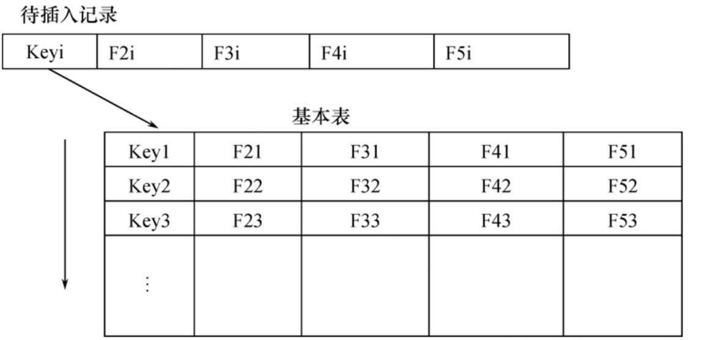
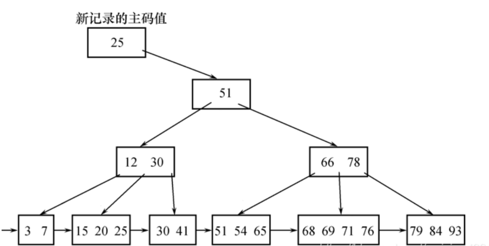
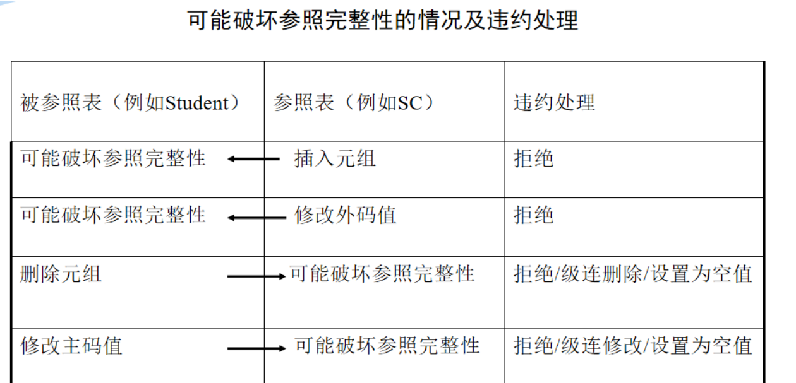
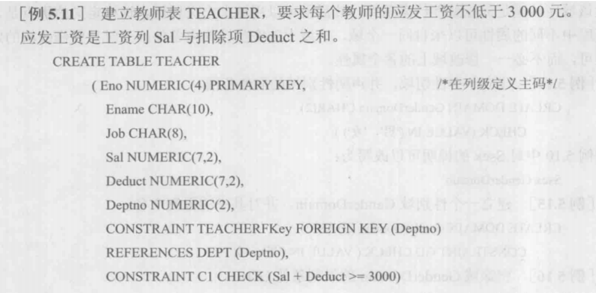

## 1.数据库完整性概述

**简单介绍：**

- 首先先概述一下数据库完整性指的是什么，`数据库完整性`指的是数据的`正确性`和`相容性`。
- 数据的`正确性`是指数据是符合现实世界语义、反映当前实际状况的;比如说人类的性别，只能是男和女。
- 数据的`相容性`是指数据库同一对象在不同关系表中的数据是符合逻辑的。比如说年龄一般都在1-100岁，当然也有超过一百岁的，反正没有两百岁，三百岁成仙的人类。

**既然我们学的是数据库，那么数据库管理系统就应该为数据完整性实现如下的功能：**

1.提供定义完整性约束条件的机制

- 完整约束条件也称`完整性规则`，是数据库中数据必须满足的语义条件规则
- 为保证数据的正确、有效和相容性的一些规则
- 数据的主码、外码、一些约束规则

2.提供完整性检查的方法

- 数据库管理系统中检查数据是否满足完整性规则的机制称为`完整性检查`
- 一般在执行INSERT、UPDATE、DELETE时检查

3.违约处理

- 数据库管理系统若发现用户的操作违背了完整性约束条件将采取一定的动作，如拒绝(NO ACTION)执行该操作或级联(CASCADE)执行其他操作，进行违约处理以保证数据的完整性。

## 2.实体完整性—PRIMARY KEY

### （1）实体完整性的定义

**关系模型的实体完整性**

- CREATE TABLE中用PRIMARY KEY定义

**单属性构成的码有两种说明方法**

- 定义为列级约束条件
- 定义为表级约束条件

**对多个属性构成的码只有一种说明方法**

- 定义为表级约束条件

```
举几个例子
将Student表中的Sno属性定义为码

(1)在列级定义主码
CREATE TABLE Student
(Sno  CHAR(9)  PRIMARY KEY，
Sname  CHAR(20) NOT NULL，     
Ssex  CHAR(2) ，
Sage  SMALLINT，
Sdept  CHAR(20));

(2)在表级定义主码
CREATE TABLE Student
(Sno  CHAR(9)，  
Sname  CHAR(20) NOT NULL，
Ssex  CHAR(2) ，
Sage  SMALLINT，
Sdept  CHAR(20)，
PRIMARY KEY (Sno)
); 

将SC表中的Sno，Cno属性组定义为码
CREATE TABLE SC
(Sno   CHAR(9)  NOT NULL， 
Cno  CHAR(4)  NOT NULL，  
Grade    SMALLINT，
PRIMARY KEY (Sno，Cno)     /*只能在表级定义主码*/
); 
```

### （2）实体完整性检查和违约处理

**插入或对主码列进行更新操作时，RDBMS按照实体完整性规则自动进行检查。包括：**

1. 检查主码值是否唯一，如果不唯一则拒绝插入或修改
2. 检查主码的各个属性是否为空，只要有一个为空就拒绝插入或修改

**检查记录中主码值是否唯一的一种方法是进行全表扫描**



- 全表扫描是十分耗时的。为了避免对基本表进行全表扫描，关系数据库管理系统一般 都在主码上`自动建立一个索引`，如图5.2的B+树索引，通过索引查找基本表中是否已经存在新的主码值将大大提高效率。
- 例如，如果新插入记录的主码值是25，通过主码索引，从B+树的根结点开始查找，只要读取三个结点就可以知道该主码值已经存在，所以不能插入这条记录。这三个结点是根结点(51)、中间结点(1230)和叶结点(15 20 25)。



## 2.参照完整性—REFERENCES

### （1）参照完整性定义

**关系模型的参照完整性定义**

- 在CREATE TABLE中用`FOREIGN KEY`短语定义哪些列为外码
- 用`REFERENCES`短语指明这些外码参照哪些表的主码

**举个例子**

```sql
例如，关系SC中一个元组表示一个学生选修的某门课程的成绩，
（Sno，Cno）是主码。
Sno，Cno分别参照引用Student表的主码和Course表的主码 

定义SC中的参照完整性
CREATE TABLE SC
(Sno    CHAR(9)  NOT NULL， 
Cno     CHAR(4)  NOT NULL，  
Grade    SMALLINT，
PRIMARY KEY (Sno， Cno)，   /*在表级定义实体完整性*/
FOREIGN KEY (Sno) REFERENCES Student(Sno)，  
/*在表级定义参照完整性*/
FOREIGN KEY (Cno) REFERENCES Course(Cno)    
/*在表级定义参照完整性*/
);
123456789101112131415
```

### （2）参照完整性检查和违约处理



**参照完整性违约处理**

1. 拒绝(NO ACTION)执行
   默认策略
2. 级联(CASCADE)操作
3. 设置为空值（SET-NULL）
   对于参照完整性，除了应该定义外码，还应定义`外码列是否允许空值`

```sql
［例4］  显式说明参照完整性的违约处理示例
CREATE TABLE SC
(Sno   CHAR(9)  NOT NULL，
Cno   CHAR(4)  NOT NULL，
Grade  SMALLINT，
PRIMARY KEY（Sno，Cno）， 				
FOREIGN KEY (Sno) REFERENCES Student(Sno) 
ON DELETE CASCADE     /*级联删除SC表中相应的元组*/
ON UPDATE CASCADE， /*级联更新SC表中相应的元组*/
FOREIGN KEY (Cno) REFERENCES Course(Cno) 	                    
ON DELETE NO ACTION 	
/*当删除course 表中的元组造成了与SC表不一致时拒绝删除*/
ON UPDATE CASCADE   
/*当更新course表中的cno时，级联更新SC表中相应的元组*/
)；
```

- 经过测试，当UPDATE更新Student和Course表数据时，SC也自动更新
- 当删除Student的数据时，SC同步删除相应数据
- 当删除Course的数据时，拒绝删除，因为SC中有相应的外码数据，并设置了NO ACTION
- 当删除SC的数据时，对Student和Course无影响

## 3.用户定义的完整性—CHECK

- 用户定义的完整性就是针对`某一具体应用的数据`必须满足的语义要求
- RDBMS提供，而不必由应用程序承担

### （1）属性上的约束条件定义

**CREATE TABLE时定义**

- 列值非空（NOT NULL）
- 列值唯一（UNIQUE）
- 检查列值是否满足一个布尔表达式（CHECK）

```sql
1.不允许取空值 

［例5］  在定义SC表时，说明Sno、Cno、Grade属性不允许取空值。

CREATE TABLE SC
(Sno  CHAR(9)  NOT NULL，	
Cno  CHAR(4)  NOT NULL，	
Grade  SMALLINT NOT NULL，	
PRIMARY KEY (Sno， Cno)，  
/* 如果在表级定义实体完整性，隐含了Sno，Cno不允许取空值，
则在列级不允许取空值的定义就不必写了 */
）;

2.列值唯一 

［例6］建立部门表DEPT，要求部门名称Dname列取值唯一，
部门编号Deptno列为主码

CREATE TABLE DEPT
(Deptno  NUMERIC(2)，
Dname  CHAR(9)  UNIQUE，/*要求Dname列值唯一*/
Location  CHAR(10)，
PRIMARY KEY (Deptno)
)；

3. 用CHECK短语指定列值应该满足的条件

［例7］Student表的Ssex只允许取“男”或“女”。

    CREATE TABLE Student
        (Sno  CHAR(9) PRIMARY KEY，
          Sname CHAR(8) NOT NULL，                     
          Ssex  CHAR(2)  CHECK (Ssex IN (‘男’，‘女’) ) ，                
              /*性别属性Ssex只允许取'男'或'女' */
          Sage  SMALLINT，
          Sdept  CHAR(20)
        );
```

### （2）属性上的约束条件检查和处理

- 插入元组或修改属性的值时，RDBMS检查属性上的约束条件是否被满足
- 如果不满足则操作被拒绝执行

### （3）元组上的约束条件的定义

- 在CREATE TABLE时可以用`CHECK`短语定义元组上的约束条件，即`元组级的限制`
- 同属性值限制相比，元组级的限制可以设置不同属性之间的取值的相互约束条件

```sql
［例9］  当学生的性别是男时，其名字不能以Ms.打头。
    CREATE TABLE Student
         (Sno    CHAR(9)， 
          Sname  CHAR(8) NOT NULL，
          Ssex    CHAR(2)，
          Sage   SMALLINT，
          Sdept  CHAR(20)，
          PRIMARY KEY (Sno)，
          CHECK (Ssex='女' OR Sname NOT LIKE 'Ms.%')
          /*定义了元组中Sname和 Ssex两个属性值之间的约束条件*/
        )；
性别是女性的元组都能通过该项检查，因为Ssex=‘女’成立；
当性别是男性时，要通过检查则名字一定不能以Ms.打头
```

### （4）元组上的约束条件检查和违约处理

- 插入元组或修改属性的值时，RDBMS检查元组上的约束条件是否被满足
- 如果不满足则操作被拒绝执行

## 4.完整性约束命名子句—CONSTRAINT

**CONSTRAINT 约束语句格式：**

```sql
CONSTRAINT <完整性约束条件名>
［PRIMARY KEY短语
   |FOREIGN KEY短语
   |CHECK短语］
1234
```

举个例子：

```sql
［例10］  建立学生登记表Student，要求学号在90000~99999之间，
姓名不能取空值，年龄小于30，性别只能是“男”或“女”。
    CREATE TABLE Student
      (Sno  NUMERIC(6)
        CONSTRAINT C1 CHECK (Sno BETWEEN 90000 AND 99999)，
        Sname  CHAR(20)  
        CONSTRAINT C2 NOT NULL，
        Sage  NUMERIC(3)
        CONSTRAINT C3 CHECK (Sage < 30)，
        Ssex  CHAR(2)
        CONSTRAINT C4 CHECK (Ssex IN ( '男'，'女'))，
        CONSTRAINT StudentKey PRIMARY KEY(Sno)
      )；
在Student表上建立了5个约束条件，包括主码约束（命名为StudentKey）
以及C1、C2、C3、C4四个列级约束。
```

**修改表中的完整性限制**

- 使用ALTER TABLE语句修改表中的完整性限制

```sql
［例13］  修改表Student中的约束条件，要求学号改为在900000~999999之间，
年龄由小于30改为小于40
可以先删除原来的约束条件，再增加新的约束条件
		ALTER TABLE Student
        DROP CONSTRAINT C1;
        ALTER TABLE Student
        ADD CONSTRAINT C1 CHECK (Sno BETWEEN 900000 AND 999999);
        ALTER TABLE Student
        DROP CONSTRAINT C3;
        ALTER TABLE Student
        ADD CONSTRAINT C3 CHECK (Sage < 40);
```

## 5.域中的完整性限制—DOMAIN

> 关于域的定义有些数据库可能不同，或者定义失败，得观看相关的手册深入学习，但是SQL中是有定义DOMAIN，初学先了解一下叭。

**SQL支持域的概念，并可以用`CREATE DOMAIN`语句建立一个域以及该域应该满足的完整性约束条件。**

```sql
［例14］建立一个性别域，并声明性别域的取值范围
           CREATE DOMAIN GenderDomain CHAR(2)
           CHECK (VALUE IN ('男'，'女') );
这样［例10］中对Ssex的说明可以改写为Ssex GenderDomain

［例15］建立一个性别域GenderDomain，并对其中的限制命名
           CREATE DOMAIN GenderDomain CHAR(2)
           CONSTRAINT GD CHECK ( VALUE IN ('男'，'女') );
           
［例16］删除域GenderDomain的限制条件GD。
           ALTER  DOMAIN  GenderDomain  
           DROP CONSTRAINT GD;
           
［例17］在域GenderDomain上增加限制条件GDD。
          ALTER  DOMAIN  GenderDomain  
         ADD CONSTRAINT GDD CHECK (VALUE IN ( '1'，'0') ); 
         
通过［例16］和［例17］，就把性别的取值范围由('男'，'女')改为 ( '1'，'0') 
```

## 6.断言—ASSERTION

> 关于断言还是和域一样，不同的数据库可能实现方式不同，初学先了解，后期再深入

- 在SQL中可以使用数据定义语言中的`CREATE ASSERTION`语句，通过声明性断言(declarative assertions)来指定更具一般性的约束。
- 可以定义涉及多个表或聚集操作的比较复杂的完整性约束。
- 断言创建以后，任何对断言中所涉及关系的操作都会触发关系数据库管理系统对断言的检查，任何使断言不为真值的操作都会被拒绝执行。

### （1）定义断言

标准语句格式：

```
CREATE ASSERTION <断言名> <CHECK子句>
```

- 每个断言都被赋予一个名字，<CHECK子句>中的约束条件与WHERE子句的条件表达式类似。

```sql
[例5.18]限制数据库课程最多 60名学生选修。
CREATE ASSERTION ASSE_SC_DB_ NUM
CHECK(60>=(SELECT count(*)/*此断言的谓词涉及聚集操作count的SQL语句*/
FROM Course,SC
WHERE SC.Cno=Course.Cno AND Course.Cname=数据库)
);
每当学生选修课程时，将在SC表中插入一条元组(Sno, Cno, NULL), 
ASSE_SC_DB_NUM断言被触发检查。如果选修数据库课程的人数已经超过60人，
CHECK子句返回值为“假”，对SC表的插入操作被拒绝。

[例5.19]限制每一 门课程最多60名学生选修。 
CREATE ASSERTION ASSE_SC_CNUMI
CHECK( 60>=ALL( SELECT count (*)/*此断言的谓词，涉及聚集操作count */
FROM SC							/*和分组函数group by的SQL语句*/
GROUP by cno );

[例5.20 限制每个学期每一门课程最多60名学生选修]
首先修改SC表的模式，增加一个“学期(TERM)”的属性。
ALTER TABLE SC ADD TERM DATE;
/*先修改SC表，增加TERM属性，它的类型是DATE*/

然后定义断言:
CREATE ASSERTION ASSE_SC_CNUM2
CHECK (60>=ALL ( select count (*) from SC group by Cno,TERM )); 
```

### （2）删除断言

```
DROP ASSERTION <断言名>;
```

- 如果断言很复杂，则系统在检测和维护断言上的开销较高，这是在使用断言时应该注意的。

## 7.触发器—TRIGGER

- 触发器（Trigger）是用户定义在关系表上的一类由`事件驱动`的特殊过程
  由服务器自动激活
- 可以进行更为复杂的检查和操作，具有更精细和更强大的数据控制能力

### （1）定义触发器

**CREATE TRIGGER语法格式:**

```sql
	  CREATE TRIGGER <触发器名>  
       {BEFORE | AFTER} <触发事件> ON <表名>
        FOR EACH  {ROW | STATEMENT}
      ［WHEN <触发条件>］
        <触发动作体>
```

**定义触发器的语法说明:**

1. 创建者：表的拥有者
2. 触发器名
3. 表名：触发器的目标表,不能建立在视图上
4. 触发事件：INSERT、DELETE、UPDATE
5. 触发器类型
   行级触发器（FOR EACH ROW）;
   语句级触发器（FOR EACH STATEMENT）;



- 例如,假设在［例11］的TEACHER表上创建了一个AFTER UPDATE触发器。如果表TEACHER有1000行，执行如下语句：
  `UPDATE TEACHER SET Deptno=5;`
- 如果该触发器为`语句`级触发器，那么执行完该语句后，触发动作只发生一次
- 如果是`行级`触发器，触发动作将执行1000次

1. 触发条件
   触发条件为真，则执行触发动作体，否则不执行;
   省略WHEN触发条件时，只要触发器激活（触发器事件）则立刻执行触发动作体;
2. 触发动作体
   触发动作体可以是一个匿名PL/SQL过程块;
   也可以是对已创建存储过程的调用;

```sql
［例18］  定义一个BEFORE行级触发器，
为教师表Teacher定义完整性规则“教授的工资不得低于4000元，
如果低于4000元，自动改为4000元”。
    CREATE TRIGGER Insert_Or_Update_Sal 
         BEFORE INSERT OR UPDATE ON Teacher  
        /*触发事件是插入或更新操作*/
         FOR EACH ROW                      /*行级触发器*/
        AS BEGIN                /*定义触发动作体，是PL/SQL过程块*/
              IF (new.Job='教授') AND (new.Sal < 4000) THEN   
              new.Sal :=4000;                
              END IF;
        END;       


［例19］定义AFTER行级触发器，当教师表Teacher的工资发生变化后
就自动在工资变化表Sal_log中增加一条相应记录

   首先建立工资变化表Sal_log
    CREATE TABLE Sal_log
        (Eno    NUMERIC(4)  references teacher(eno)，
          Sal     NUMERIC(7，2)，
          Username  char(10)，
          Date   TIMESTAMP
         )；
              
 [例19]（续）
CREATE TRIGGER Insert_Sal               	
    AFTER INSERT ON Teacher      	/*触发事件是INSERT*/
    FOR EACH ROW
    AS BEGIN
        INSERT INTO Sal_log VALUES(
           new.Eno，new.Sal，CURRENT_USER，CURRENT_TIMESTAMP);
    END;

[例19]（续）
CREATE TRIGGER Update_Sal            	
   AFTER UPDATE ON Teacher    	/*触发事件是UPDATE */
   FOR EACH ROW
   AS BEGIN 
     IF (new.Sal <> old.Sal) THEN INSERT INTO Sal_log VALUES(
          new.Eno，new.Sal，CURRENT_USER，CURRENT_TIMESTAMP);
     END IF;
  END;        
```

> 这个可以在Oracle数据库里运行，但是因为我用的是SQL Sever数据库，所以运行不了，不同的数据库，触发器的实现略有不同，详情请查看相关数据库手册。

### （2）激活触发器

- 触发器的执行，是由`触发事件激活`的，并由数据库服务器自动执行
  一个数据表上可能定义了`多个触发器`
- 同一个表上的多个触发器激活时遵循如下的执行顺序：
  （1） 执行该表上的BEFORE触发器；
  （2） 激活触发器的SQL语句；
  （3） 执行该表上的AFTER触发器。

```sql
［例20］执行修改某个教师工资的SQL语句，激活上述定义的触发器。
     UPDATE Teacher SET Sal=800 WHERE Ename='王五';
执行顺序是：
执行触发器Insert_Or_Update_Sal
执行SQL语句“UPDATE Teacher SET Sal=800 WHERE Ename='王五';”
执行触发器Insert_Sal；
执行触发器Update_Sal 
```

### （3）删除触发器

**删除触发器的SQL语法：**
`DROP TRIGGER <触发器名> ON <表名>;`

触发器必须是一个已经创建的触发器，并且只能由具有相应权限的用户删除。

**［例21］ 删除教师表Teacher上的触发器Insert_Sal**

```
DROP TRIGGER Insert_Sal ON Teacher;
```