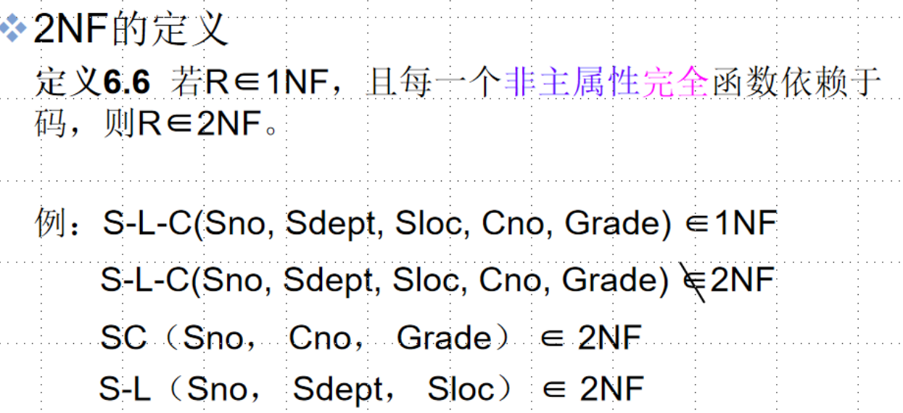
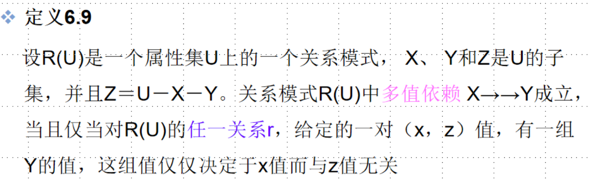
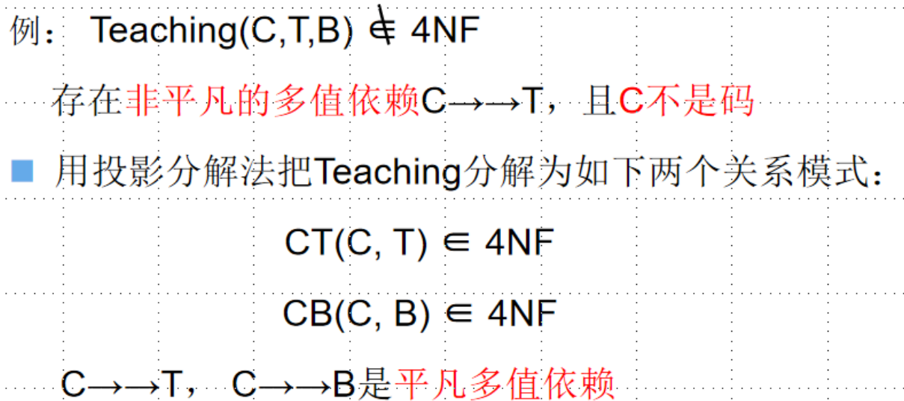

# 1.为什么要学习关系数据库规范化理论？

**感性认识：**

- 当我们面对一个实际问题时，我们应该如何去建数据库，建表，库的结构，表的结构我们该如何组织，才能更好的解决问题。
- 如何省内存，提高查询修改删除更新的效率？
- 如何避免可能出现的隐患，如修改删除更新插入等异常？
- 以上就是关系`数据库规范化理论`研究解决的问题,说白了就是告诉你如何才能设计出合适的库和表

**下面我们回顾几个概念和问题，以便更好地学习后面的关系数据库规范化理论**

## （1）基本概念回顾

- 关系：可简单的理解为二维表
- `关系模式：即二维表的逻辑结构`
- 关系数据库：指采用了关系模型来组织数据的数据库，其以行和列的形式存储数据，`关系型数据库这一系列的行和列被称为表，一组表组成了数据库`。
- 关系数据库的模式：即关系数据库的逻辑结构

## （2）关系模式的形式化定义

- 《数据库系统概论》中对二维表结构的定义

> 关系模式由五部分组成，即它是一个五元组：
> R(U, D, DOM, F)
> R： 关系名,即表名
> U： `组成该关系的属性名集合`
> D： 属性组U中属性所来自的域。数据的取值范围和类型
> DOM： 属性向域的映象集合
> F： `属性组U上的一组数据依赖。`

**关系数据库规范化理论研究的就是R、F、U，之间的关系。
因为D和DOM对研究表的设计关系不大，所以在学习关系数据库规范化理论时可以将五元组简化成三元组**

> 三元组：`R（U, F）`
> 当且仅当U上的一个关系`r`满足`F`时，`r`称为`关系模式 R（U, F）的一个关系`

## （3）什么是数据依赖F？

**这里我们对`F`中的`数据依赖`进行简单解释，后面会详细叙述`函数依赖`和`多值依赖`。**

> `数据依赖`是`一个关系内部属性与属性之间的一种约束关系。`
> 这种约束关系是通过`属性间值的相等与否体现出来的数据间相关联系`。
> 它是现实世界属性间相互联系的抽象，是数据内在的性质，是语义的体现。

**数据依赖分类：**

- 函数依赖（Functional Dependency，简记为FD）

> 函数依赖极为普遍地存在于现实生活中。比如描述一个学生的关系，可以有学号(Sno)、姓名(Sname)、 系名(Sdept) 等几个属性。由于一个学号只对应一个学生，一个学生只在一一个系学习。因而当“学号”值确定之后，学生的姓名及所在系的值也就被唯一地确定了。`属性间的这种依赖关系类似于数学中的函数y=f(x)，自变量x确定之后，相应的函数值y也就唯一地确定 了。`

- 多值依赖（Multivalued Dependency，简记为MVD）
- 其他

## （4）数据依赖F对关系模式的影响

- 因为`关系数据库规范化理论`主要研究的是`三元组R(U,F)`，U我们都好理解，最重要的是F，这里我们简单的了解一下F对关系模式，即表的逻辑结构的影响，让我们理性的认识为什么学习`关系数据库规范化理论`

**举个例子：**

> [例1]建立一个描述学校教务的数据库,数据库涉及的对象有：
> 学生的学号（Sno）、所在系（Sdept）、系主任姓名（Mname）、课程名（Cname）、成绩（Grade）

这里我们用单一的关系模式Student来表示这些对象：
`Student <U、F>`
该关系的属性集合：
`U ＝｛ Sno, Sdept, Mname, Cname, Grade ｝`

**这里说明一下现实世界的事实语义，关于这些对象之间的联系：**
①一个系有若干学生，但一个学生只属于一个系。
②一个系只有一名(正职)负责人。
③一个学生可以选修多门课程，每门课程有若干学生选修。
④每个学生学习每一一门课程有一个成绩。

于是得到`属性组U上的一组函数依赖F`
F={Sno- > Sdept, Sdept- >Mname, (Sno, Cno)- >Grade}
(如图所示)

- 如果只考虑函数依赖这一种数据依赖， 可以得到一个描述学生的关系模式Student <U,F>。表6.1是某一时刻关系模式Student的一个实例，即数据表。
- 

**这个关系模式设计的并不好,存在以下问题:**

### 1️⃣ 数据冗余(Data redundancy)

- 比如，每一个系的系主任姓名重复出现，重复次数与该系所有学生的所有课程成绩出现次数相同，如表6.1所示。这将浪费大量的存储空间。

### 2️⃣ 更新异常(update anomalies )

- 由于数据冗余，当更新数据库中的数据时，系统要付出很大的代价来维护数据库的完整性，否则会面临数据不一致的危险。 比如，某系更换系主任后，必须修改与该系学生有关的每一个元组。

### 3️⃣ 插入异常(insertion anomalies )

- 如果一个系刚成立，尚无学生，则无法把这个系及其系主任的信息存入数据库。

### 4️⃣ 删除异常( deletion anomalies)

- 如果某个系的学生全部毕业了，则在删除该系学生信息的同时，这个系及其系主任的信息也丢掉了。

**鉴于存在以上种种问题，可以得出这样的结论:**

- `Student关系模式不是一个好的模式`。
- `“好”的模式：`
  不会发生插入异常、删除异常、更新异常，数据冗余应尽可能少
- 原因：由存在于模式中的`某些数据依赖`引起的
- 解决方法：通过`分解关系模式`来`消除其中不合适 的数据依赖`

可以把这个单一模式分成3个关系模式：

- `S（Sno，Sdept，Sno → Sdept）;`
- `SC（Sno，Cno，Grade，（Sno，Cno） → Grade）;`
- `DEPT（Sdept，Mname，Sdept→ Mname）`

这三个模式都不会发生插入异常、删除异常的问题，数据的冗余也得到了控制。
`一个模式的数据依赖会有哪些不好的性质，如何改造一个不好的模式`，这就是接下来`2.规范化`要讨论的内容。

# 2.规范化—改造关系模式，解决插入异常、删除异常、更新异常和数据冗余问题。

## （1）规范化研究什么？

- 规范化讨论如何`根据属性间依赖情况来判定关系是否具有某些不合适的性质`
- 通常`按属性间依赖情况来区分关系规范化程度`为`第一范式、第二范式、第三范式和第四范式等`
- 用来改造关系模式，`通过分解关系模式来消除其中不合适的数据依赖，以解决插入异常、删除异常、更新异常和数据冗余问题。`

------

**接下来我们依次学习以下内容，来更好的掌握规范化理论，来更好的设计表的结构，设计关系模式。**

- 函数依赖
- 码
- 范式
- 2NF
- 3NF
- BCNF
- 多值依赖
- 4NF

**`其中函数依赖、码是为了学习范式、1NF,2NF,3NF……打基础`**

## （2）函数依赖

**这里我们讨论数据依赖F中的函数依赖，分为以下几种类型：**

- 函数依赖
- 平凡函数依赖与非平凡函数依赖
- 完全函数依赖与部分函数依赖
- 传递函数依赖

### ① 函数依赖

`注意:`函数依赖不是指关系模式R的某个或某些关系满足的约束条件，而是指R的一切关系均要满足的约束条件。

**以下是一个错误的例子：**
`sno->sdept，sno应该唯一决定sdept`

> 函数依赖和别的数据依赖样是语义范畴的概念，只能根据语义来确定一个函数依赖。
> 例如，姓名→年龄这个函数依赖只有在该部门没有同名人的条件下成立。如果允许有同名人，则年龄就不再函数依赖于姓名了。

### ② 平凡函数依赖与非平凡函数依赖

### ③ 完全函数依赖与部分函数依赖

### ④ 传递函数依赖

**直接依赖这里我们举个例子：**
`BH(sno,idCard,address)`

> X：sno 学号
> Y：idCard 身份证号
> Z：address 住址
> X->Y，Y->X，X<->Y，Y->Z
> 所以我们说Z直接依赖于X

## （3）码

- 码是关系模式中的一个重要概念。在 [码的定义](https://blog.csdn.net/weixin_43914604/article/details/105101908)中有关码的若干定义， 这里用函数依赖的概念来定义码。
- 码唯一决定一个实体集

### ① 候选码、超码、主码

### ② 主属性和非主属性

**主属性与非主属性**

- 包含在任何一个候选码中的属性 ，称为`主属性（Prime attribute）`
- 不包含在任何码中的属性称为`非主属性（Nonprime attribute）`或`非码属性（Non-key attribute）`

**举几个例子：**

**[例2]**
关系模式S(Sno,Sdept,Sage)，单个属性Sno是`码`，
SC（Sno，Cno，Grade）中，（Sno，Cno）是`码`

**[例3]**
关系模式R（P，W，A）
P：演奏者 W：作品 A：听众
一个演奏者可以演奏多个作品
某一作品可被多个演奏者演奏
听众可以欣赏不同演奏者的不同作品
`码为(P，W，A)，即All-Key`

### ③ 外部码

## （4）范式

- 范式是符合某一种级别的关系模式的集合
- 关系数据库中的关系必须满足一定的要求。满足不同程度要求的为不同的范式。
- 级别越高，表设计的越合理

**范式的种类：**

**各种范式之间存在联系：**

- 某一关系模式`R为第n范式`，可简记为`R∈nNF。`
  一个低一级范式的关系模式，通过`模式分解`可以转换为若干个高一级范式的关系模式的集合，这种过程就叫`规范化`

------

### ① 1NF

**1NF的定义:**

- 如果一个关系模式R的所有属性都是`不可分的基本数据项`，则`R∈1NF`
- 第一范式是对关系模式的最起码的要求。不满足第一范式的数据库模式不能称为关系数据库
- 但是满足第一范式的关系模式并不一定是一个好的关系模式

**以下是一个满足1NF，但不是好的关系模式的例子：**

> 关系模式 S-L-C(Sno, Sdept, Sloc, Cno, Grade)
> Sloc为学生住处，假设每个系的学生住在同一个地方

- 这个例子中存在函数依赖，不是一个好的关系模式

**图形化表示：**

**S-L-C不是一个好的关系模式，一个关系模式 R不属于2NF,就会产生以下几个问题:**

- (1)`插入异常`。假若要插入一个学生Sno=S7， Sdept =PHY， Sloc =BLD2， 但该生还未选课，即这个学生`无Cno`,这样的元组就插不进S-L-C中。因为`插入元组时必须给定码值，而这时码值的一部分 为空，因而学生的固有信息无法插入。`
- (2)`删除异常`。假定某个学生只选一门课，如S4就选了一门课C3，现在C3这门课他也不选了，那么C3这个数据项就要删除。而`C3是主属性，删除了C3，整个元组就必须一起删除，使得S4的其他信息也被删除了`，从而造成删除异常，即不应删除的信息也删除了。
- (3)`修改复杂`。某个学生从数学系(MA)转到计算机科学系(CS)，这本来只需修改此学生元组中的Sdept分量即可，但因为关系模式S-L-C中还含有系的住处Sloc属性，学生转系将同时改变住处，因而还必须修改元组中的Sloc分量。另外，如果这个学生选修了k门课，Sdept、 Sloc重复存储了k次，不仅`存储冗余度大`，而且必须无遗漏地修改k个元组中全部Sdept、Sloc 信息，造成`修改的复杂化`。

**为什么会有这些问题呢？**

- 原因：
  Sdept、 Sloc`部分函数依赖于码`。
- 解决方法(也就是2NF的处理方法)
  S-L-C`分解为两个关系模式`，以`消除这些部分函数依赖`
  SC（Sno， Cno， Grade）
  S-L（Sno， Sdept， Sloc）****
  ****

### ② 2NF

- 采用投影分解法将一个1NF的关系分解为多个2NF的关系，可以在一定程度上减轻原1NF关系中存在的插入异常、删除异常、数据冗余度大、修改复杂等问题。
- 将一个1NF关系分解为多个2NF的关系，并不能完全消除关系模式中的各种异常情况和数据冗余。所以又引入了3NF。

### ③ 3NF

**这里我们对上面的2NF例子再次进行剖析：**

**解决方法：**

- 采用投影分解法，把S-L`分解`为两个关系模式，以`消除传递函数依赖`：
  S-D（Sno， Sdept）
  D-L（Sdept，Sloc）
- S-D的码为Sno， D-L的码为Sdept。
- `分解后的关系模式S-D与D-L中不再存在传递依赖`

- 采用投影分解法将一个2NF的关系分解为多个3NF的关系，可以`在一定程度上解决原2NF关系中存在的插入异常、删除异常、数据冗余度大、修改复杂等问题。`
- 将一个2NF关系分解为多个`3NF`的关系后，`仍然不能完全消除关系模式中的各种异常情况和数据冗余。`

### ④ BCNF

> BCNF ( Boyce Codd Normal Form)是由Boyce与Codd提出的，比上述的3NF又进了一步，`通常认为BCNF是修正的第三范式，有时也称为扩充的第三范式。`

**下面用几个例子说明属于3NF的关系模式有的属于BCNF，但有的不属于BCNF。**

**[例5] 关系模式C（Cno，Cname，Pcno）**
C∈3NF
C∈BCNF

> 关系模式C(Cno, Cname, Peno)， 它`只有一个码Cno, 这里没有任何属性对Cno部分依赖或传递依赖，所以C∈3NF。`同时C中`Cno`是`唯一的决定因素`， 所以C ∈BCNF。

**[例6]关系模式S(Sno, Sname, Sdept, Sage)**
假定S有两个码Sno，Sname
S∈3NF。
S ∈ BCNF

> `假定Sname也具有唯一性， 那么S就有两个码，这两个码都由单个属性组成，彼此不相交。其他属性不存在对码的传递依赖与部分依赖，所以S∈3NF。`
> 同时S中除Sno、Sname外没有其他`决定因素`，所以S也属于BCNF。

**［例7］关系模式SJP（S，J，P）**
SJP∈3NF，
SJP∈BCNF

> [例6.7]关系模式SJP(S, J, P)中，S是学生，J表示课程，P表示名次。
> 每一个学生选修每门课程的成绩有一定的名次，
> 每门课程中每一名次只有一个 学生(即没有并列名次)。
> 由语义可得到下面的`函数依赖:`
> `(S,J)→P; (J,P)→S`
> 所以(S,J) 与(J,P)都可以作为`候选码`。
> `这两个码各由两个属性组成，而且它们是相交的。`
> `这个关系模式中显然没有属性对码传递依赖或部分依赖。`
> 所以SJP∈3NF，而且除(S,J)与(J,P)以外没有其他决定因素，所以SJP∈BCNF。

**[例8] 关系模式STJ(S, T, J)中，S表示学生，T表示教师，J表示课程。**

> 每一教师只教一门课，
> 每门课有若干教师，
> 某一学生选定某门课， 就对应一个固定的教师。
> 由语义可得到如下的函数依赖。
> `(S,J)→T，(S,T)-J, T→J`
> `函数依赖`关系可以用如图表示
>
> 
> 这里(S,J)、 (S,T)都是`候选码`。
> STJ是3NF,因为`没有任何非主属性对码传递依赖或部分依赖`，
> 但`STJ不是BCNF关系`，`因为T是决定因素，而T不包含码。`

**如何解决才能让STJ是BCNF关系呢？**

### ⑤ 3NF与BCNF的关系

- 3NF和BCNF是在函数依赖的条件下对模式分解所能达到的分离程度的测度。
- 一个模式中的关系模式如果都属于`BCNF`,那么在函数依赖范畴内它已实现了彻底的分离，`已消除了插入和删除的异常。`
- `3NF的“不彻底”性`表现在`可能存在主属性对码`的`部分依赖`和`传递依赖`。

## （5）多值依赖

### ① 多值依赖的定义

### ② 平凡多值依赖和非平凡多值依赖

**多值依赖具有以下性质:**

### ③ 多值依赖与函数依赖的区别

## （6）4NF

## （7）规范化小结—重点归纳步骤

- 关系数据库的规范化理论是数据库逻辑设计的工具
- 目的：尽量消除插入、删除异常，修改复杂，数据冗余
- 基本思想：逐步消除数据依赖中不合适的部分
  实质：`·概念的单一化·`

**关系模式规范化的基本步骤:**

