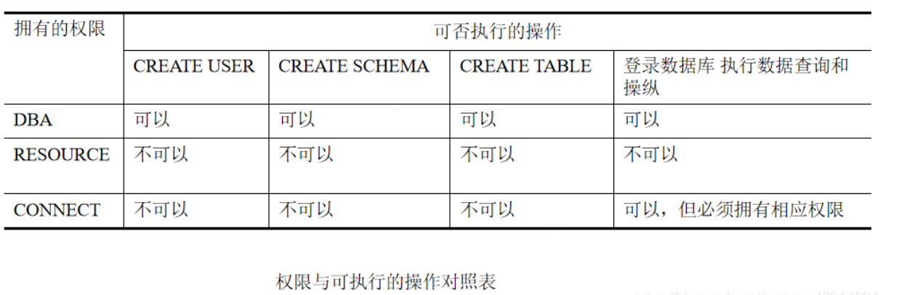

# 1.数据库安全性概述

## （1）为什么要研究数据库的安全性？

**问题的提出：**

- 数据库的一大特点是数据可以共享
- 数据共享必然带来数据库的安全性问题
- `数据库系统中的数据共享不能是无条件的共享`
- 例： 军事秘密、国家机密、新产品实验数据、
  市场需求分析、市场营销策略、销售计划、
  客户档案、医疗档案、银行储蓄数据

**非法使用数据库的情况：**

- 编写合法程序绕过DBMS及其授权机制（黑客等）
- 直接或编写应用程序执行非授权操作（黑客等）
- 通过多次合法查询数据库从中推导出一些保密数据（黑客等）

## （2）安全标准简介


### ① TCSEC/TDI标准的基本内容

- TCSEC/TDI，从四个方面来描述安全性级别划分的指标
  安全策略
  责任
  保证
  文档

### ② TCSEC/TDI安全级别划分

- 按系统可靠或可信程度逐渐增高
- 各安全级别之间：偏序向下兼容
- 

**B2以上的系统：**

- 还处于理论研究阶段
- 应用多限于一些特殊的部门，如军队等
- 美国正在大力发展安全产品，试图将目前仅限于少数领域应用的B2安全级别下放到商业应用中来，并逐步成为新的商业标准

# 2.数据库安全性控制概述


- 用户要求进入计算机系统时，系统首先根据输入的用户标识进行用户身份鉴定，只有合法的用户才准许进入计算机系统;对已进入系统的用户，数据库管理系统还要进行存取控制，只允许用户执行合法操作;操作系统也会有自己的保护措施;数据最后还可以以密码形式存储到数据库中（例如md5加密密码等信息）。


**数据库安全性控制的常用方法：**

- 用户标识和鉴定
- 存取控制
- 视图
- 审计
- 密码存储

# 3.数据库安全性控制

## （1）用户标识与鉴别（Identification & Authentication）

- `是系统提供的最外层安全保护措施`
- 用户标识
  每个用户标识由用户名(user name)和用户标识号(UID)两部分组成。
  UID在系统的整个生命周期内是唯–的。系统内部记录着所有合法用户的标识
- 口令
  系统核对口令以鉴别用户身份 （口令可理解为密码）
- 用户标识和口令易被窃取
  每个用户预先约定好一个计算过程或者函数

**常用的用户身份鉴别方法有以下几种：**

### ① 静态口令鉴别

- 这种方式是当前常用的鉴别方法。
- `静态口令一般由用户自己设定，鉴别时只要按要求输入正确的口令，系统将允许用户使用数据库管理系统。`
- 这些口令是静态不变的，在实际应用中，用户常常用自己的生日、电话、简单易记的数字等内容作为口令，很容易被破解。而一旦被破解，非法用户就可以冒充该用户使用数据库。
- 这种方式虽然简单，但容易被攻击，安全性较低。

### ② 动态口令鉴别

- 它是目前较为安全的鉴别方式。
- 这种方式的口令是动态变化的，每次鉴别时均需使用动态产生的新口令登录数据库管理系统，即采用一次一密的方法。
- `常用的方式如短信密码和动态令牌方式，每次鉴别时要求用户使用通过短信或令牌等途径获取的新口令登录数据库管理系统。`
- 与静态口令鉴别相比，这种认证方式增加了口令被窃取或破解的难度，安全性相对高一些。

### ③ 生物特征鉴别

- 它是一种通过生物特征进行认证的技术，其中，生物特征是指生物体唯一具有的，可测量、识别和验证的稳定生物特征，如`指纹、虹膜和掌纹等`。
- 这种方式通过采用图像处理和模式识别等技术实现了基于生物特征的认证，- 与传统的口令鉴别相比，无疑产生了质的飞跃，安全性较高。

### ④ 智能卡鉴别

- 智能卡是一种不可复制的硬件，内置集成电路的芯片，具有硬件加密功能。
- `智能卡由用户随身携带，登录数据库管理系统时用户将智能卡插入专用的读卡器进行身份验证。`
- 由于每次从智能卡中读取的数据是静态的，通过内存扫描或网络监听等技术还是可能截取到用户的身份验证信息，存在安全隐患。
- 因此，实际应用中一般采用`个人身份识别码(PIN)和智能卡`相结合的方式。这样，即使PIN或智能卡中有一种被窃取，用户身份仍不会被冒充。

## （2）存取控制

- 数据库安全最重要的一点就是确保只授权给有资格的用户访问数据库的权限，同时令所有未被授权的人员无法接近数据，这`主要通过数据库系统的存取控制机制实现。`

### ① 存取控制机制组成:

- `定义用户权限`,并将用户权限登记到数据字典中；
  用户对某一数据对象的操作权力称为权限。
- `合法权限检查`,每当用户发出存取数据库的操作请求后(请求一般应包括操作类型、操作对象和操作用户等信息)，`数据库管理系统查找数据字典，根据安全规则进行合法权限检查`，若用户的操作请求超出了定义的权限，系统将拒绝执行此操作。

**`定义用户权限`和`合法权限检查机制`一起组成了`数据库管理系统的存取控制子系统`。**

- `C2级`的数据库管理系统支持`自主存取控制`( Discretionary Access Control, DAC),
- `B1级`的数据库管理系统支持`强制存取控制`( Mandatory Access Control, MAC)。

**这两类方法的简单定义是:**

- (1)在`自主存取控制`方法中，用户对于不同的数据库对象有不同的存取权限，不同的用户对同一对象也有不同的权限，而且用户还可将其拥有的存取权限转授给其他用户。因此自主存取控制非常灵活。
- (2)在`强制存取控制`方法中，每一个 数据库对象被标以一定的密级，每一个用户也被授予某一个级别的许可证。对于任意一个对象， 只有具有合法许可证的用户才可以存取。强制存取控制因此相对比较严格。

## （3）自动存取控制方法—DAC: Discretionary Access Control

- 通过 SQL 的 `GRANT`语句和 `REVOKE`语句实现
- **用户权限组成**
  `数据对象`
  `操作类型`
- 定义用户存取权限：定义用户可以在哪些数据库对象上进行哪些类型的操作
- `定义存取权限称为授权`


### ① 授权与回收—针对用户

#### 1️⃣ 授权—GRANT

```sql
GRANT语句的一般格式：
       GRANT <权限>[,<权限>]... 
       [ON <对象类型> <对象名>]
       TO <用户>[,<用户>]...
       [WITH GRANT OPTION];
语义：将对指定操作对象的指定操作权限授予指定的用户 
123456
```

**发出GRANT：**

- DBA
- 数据库对象创建者（即属主Owner）
- 拥有该权限的用户

**按受权限的用户:**

- 一个或多个具体用户
- PUBLIC（全体用户）

**WITH GRANT OPTION子句:**

- 指定：可以再授予
- 没有指定：不能传播

**不允许循环授权：**


**[例1] 把查询Student表权限授给用户U1**

```sql
      GRANT   SELECT 
      ON   TABLE   Student 
      TO   U1;
123
```

> 

**[例2] 把对Student表和Course表的全部权限授予用户U2和U3**

```sql
      GRANT ALL PRIVILIGES 
      ON TABLE Student, Course 
      TO U2, U3;
123
```

**[例3] 把对表SC的查询权限授予所有用户**

```sql
     GRANT SELECT 
     ON TABLE SC 
	  TO PUBLIC;
123
```

**[例4] 把查询Student表和修改学生学号的权限授给用户U4**

```sql
对属性列的授权时必须明确指出相应属性列名 
	  	GRANT UPDATE(Sno), SELECT 
		ON TABLE Student 
		TO U4;
1234
```

**[例5] 把对表SC的INSERT权限授予U5用户，并允许他再将此权限授予其他用户**

```sql
   GRANT INSERT 
   ON TABLE SC 
   TO U5
   WITH GRANT OPTION;
1234
```

**执行例5后，U5不仅拥有了对表SC的INSERT权限，
还可以传播此权限：**
[例6]

```sql
GRANT INSERT ON TABLE SC TO U6
        WITH GRANT OPTION;
12
```

同样，U6还可以将此权限授予U7：

[例7]
`GRANT INSERT ON TABLE SC TO U7;`
但U7不能再传播此权限,因为没有写这条语句`WITH GRANT OPTION`。


#### 2️⃣ 回收—REVOKE

**授予的权限可以由DBA或其他授权者用REVOKE语句收回**
REVOKE语句的一般格式为：

```sql
      REVOKE <权限>[,<权限>]... 
      [ON <对象类型> <对象名>]
      FROM <用户>[,<用户>]...;
123
```

**[例8] 把用户U4修改学生学号的权限收回**

```sql
		REVOKE UPDATE(Sno)
		ON TABLE Student 
		FROM U4;
123
```

**[例9] 收回所有用户对表SC的查询权限**

```sql
		REVOKE SELECT 
		ON TABLE SC 
		FROM PUBLIC;
123
```

**[例10] 把用户U5对SC表的INSERT权限收回**

```sql
		REVOKE INSERT 
		ON TABLE SC 
		FROM U5 CASCADE ;
123
将用户U5的INSERT权限收回的时候必须级联（CASCADE）收回 系统只收回直接或间接从U5处获得的权限
```


#### 3️⃣ 小结:SQL灵活的授权机制

- DBA：
  拥有所有对象的所有权限
  不同的权限授予不同的用户
- 用户：拥有自己建立的对象的全部的操作权限
  GRANT：授予其他用户
- 被授权的用户
  “继续授权”（WITH GRANT OPTION）许可：可以再授予给其它用户
- 所有授予出去的权力在必要时又都可用REVOKE语句收回

#### 4️⃣ 创建数据库模式的权限

**DBA在创建用户时实现**

```sql
CREATE USER语句格式
              CREATE  USER  <username> 
            ［WITH］［DBA | RESOURCE | CONNECT］
123
```



### ② 数据库角色—针对角色

**数据库角色：被命名的一组与数据库操作相关的权限**

- 角色是权限的集合 ，`结合我刚刚上面截得黑色背景图片了解`
- 可以为一组具有相同权限的用户创建一个角色
- 简化授权的过程

#### 1️⃣ 角色的创建

```
CREATE ROLE <角色名>
```

#### 2️⃣ 给角色授权

```sql
 GRANT  <权限>［，<权限>］… 
 ON <对象类型>对象名  
 TO <角色>［，<角色>］…
123
```

#### 3️⃣ 将一个角色授予其他的角色或用户

```sql
GRANT  <角色1>［，<角色2>］…
TO  <角色3>［，<用户1>］… 
［WITH ADMIN OPTION］ 
123
```

#### 4️⃣ 角色权限的收回

```sql
REVOKE <权限>［，<权限>］…
ON <对象类型> <对象名>
FROM <角色>［，<角色>］…
123
```

**[例11]　通过角色来实现将一组权限授予一个用户。**
`步骤如下：`

1. 首先创建一个角色 R1
   `CREATE ROLE R1；`
2. 然后使用GRANT语句，使角色R1拥有Student表的SELECT、UPDATE、INSERT权限

```sql
    GRANT SELECT，UPDATE，INSERT 
    ON TABLE Student 
    TO R1；
123
```

1. 将这个角色授予王平，张明，赵玲。使他们具有角色R1所包含的全部权限

```sql
   GRANT  R1 
   TO 王平，张明，赵玲；
12
```

1. 可以一次性通过R1来回收王平的这3个权限

```sql
     REVOKE  R1 
     FROM 王平；
12
```

**[例12]　角色的权限修改**

```sql
      GRANT DELETE 
      ON TABLE Student
      TO R1
123
```

[例13]　角色权限的收回

```sql
    REVOKE SELECT 
    ON TABLE Student
    FROM  R1；
123
```

## （4）强制存取控制方法—MAC: Mandatory Access Control

**自主存取控制缺点:**

- 可能存在数据的“无意泄露”
- 原因：这种机制仅仅通过对数据的存取权限来进行安全控制，而数据本身并无安全性标记
- 解决：对系统控制下的所有主客体实施强制存取控制策略

------

**强制存取控制（MAC):**

- 保证更高程度的安全性

- 用户能不能直接感知或进行控制,因为对数据进行了加密

- 适用于对数据有严格而固定密级分类的部门

  *军事部门

  *政府部门

  ------

**在强制存取控制中，数据库管理系统所管理的全部实体被分为主体和客体两大类。**

- `主体`是系统中的活动实体
  DBMS所管理的实际用户
  代表用户的各进程
- `客体`是系统中的被动实体，是受主体操纵的
  文件
  基表
  索引
  视图

------

**对于主体和客体，数据库管理系统为它们每个实例(值)指派一个敏感度标记(label)。**
**敏感度标记（Label）分为若干个级别：**

- 绝密（Top Secret）
- 机密（Secret）
- 可信（Confidential）
- 公开（Public）
- `主体的敏感度标记称为许可证级别`（Clearance Level）
- `客体的敏感度标记称为密级`（Classification Level）
- 密级：T>=S>=C>=P

------

**强制存取控制规则：**

- (1)仅当主体的许可证级别`大于或等于客体`的密级时，该主体才能`读取`相应的客体
- (2)仅当主体的许可证级别`等于`客体的密级时，该主体才能`写`相应的客体
- 修正规则
  `主体的许可证级别 <=客体的密级→ 主体能写客体`

**规则的共同点:**

- `禁止`了拥有高许可证级别的主体`更新`低密级的数据对象

## （5）DAC与MAC共同构成DBMS的安全机制

- 实现MAC时要首先实现DAC
  原因：较高安全性级别提供的安全保护要包含较低级别的所有保护
- 先进行DAC检查，通过DAC检查的数据对象再由系统进行MAC检查，只有通过MAC检查的数据对象方可存取。
- 

# 4.视图机制

**把要保密的数据对无权存取这些数据的用户隐藏起来，对数据提供一定程度的安全保护**

- 主要功能是提供数据独立性，无法完全满足要求
- 间接实现了支持存取谓词的用户权限定义

------

**[例14]建立计算机系学生的视图，`把对该视图的SELECT权限授于王平，把该视图上的所有操作权限授于张明`**

```sql
先建立计算机系学生的视图CS_Student
 CREATE VIEW CS_Student AS 
    SELECT  *
    FROM   Student
    WHERE  Sdept='CS'；
12345
```

**在视图上进一步定义存取权限：**

```sql
     GRANT  SELECT
     ON  CS_Student  
     TO 王平 ；
     
     GRANT ALL PRIVILIGES
     ON  CS_Student  
     TO  张明； 
1234567
```

# 5.审计（Audit） —日志

**什么是审计：**

- `审计日志（Audit Log）`;
  将用户对数据库的所有操作记录在上面
- DBA利用审计日志
  找出非法存取数据的人、时间和内容
- C2以上安全级别的DBMS必须具有

------

**审计分为:**

- `用户级审计`
  针对自己创建的数据库表或视图进行审计 ;
  记录所有用户对这些表或视图的一切成功和（或）不成功的访问要求以及各种类型的SQL操作 ;
- `系统级审计`
  DBA设置 ;
  监测成功或失败的登录要求 ;
  监测GRANT和REVOKE操作以及其他数据库级权限下的操作;

------

```
AUDIT语句：设置审计功能
NOAUDIT语句：取消审计功能
```

------

**［例15］对修改SC表结构或修改SC表数据的操作进行审计**

```sql
           AUDIT ALTER，UPDATE  
           ON  SC；
12
```

**［例16］取消对SC表的一切审计**

```sql
           NOAUDIT  ALTER，UPDATE  
           ON  SC；
12
```

# 6.数据加密

- 数据加密
  防止数据库中数据在`存储`和`传输`中失密的有效手段
- 数据加密分为`存储加密`和`传输加密`

------

## （1）存储加密

- 对于存储加密，一般提供`透明和非透明`两种存储加密方式。
  `透明`存储加密是`内核级加密保护`方式，`对用户完全透明`
  `非透明`存储加密则是通过`多个加密函数`实现的。
- `透明存储加密`是数据在写到磁盘时对数据进行加密，授权用户读取数据时再对其进行解密。由于数据加密对用户透明，数据库的应用程序不需要做任何修改，只需在创建表语句中说明需加密的字段即可。当对加密数据进行增、删、改、查询操作时，数据库管理系统将自动对数据进行加、解密工作。基于数据库内核的数据存储加密、解密方法性能较好，安全完备性较高。

## （2）传输加密

- 在客户/服务器结构中，数据库用户与服务器之间若采用明文方式传输数据，容易被网络恶意用户截获或篡改，存在安全隐患。因此，为保证二者之间的安全数据交换，数据库管理系统提供了传输加密功能。
- 常用的传输加密方式如`链路加密和端到端加密`。

### ① 链路加密

- 链路加密对传输数据在链路层进行加密，它的传输信息由报头和报文两部分组成，前者是路由选择信息，而后者是传送的数据信息。这种方式对报文和报头均加密。

### ② 端到端加密

- 端到端加密对传输数据在发送端加密，接收端解密。它只加密报文，不加密报头。与链路加密相比，它只在发送端和接收端需要密码设备，而中间节点不需要密码设备，因此它所需密码设备数量相对较少。但这种方式不加密报头，从而容易被非法监听者发现并从中获取敏感信息。

# 7.统计数据库安全性

- `统计数据库`
  允许用户查询聚集类型的信息（如合计、平均值等）
  不允许查询单个记录信息

------

- `统计数据库中特殊的安全性问题:`
  隐蔽的信息通道
  能从合法的查询中推导出不合法的信息

------

**统计数据库安全性规则：**

- 规则1：任何查询至少要涉及N(N足够大)个以上的记录
- 规则2：任意两个查询的相交数据项不能超过M个
- 规则3：任一用户的查询次数不能超过1+(N-2)/M

> 数据库安全机制的设计目标：
> 试图破坏安全的人所花费的代价 >> 得到的利益