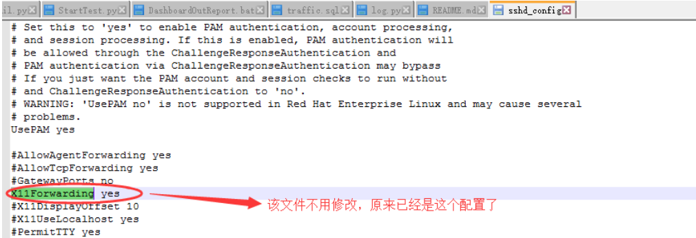

使用`xshell`连接远程主机的时候一直卡在`To escape to local shell,press ‘Ctrl+Alt+]‘.`，要等很久才能连上：

```sh
1. Connecting to 192.168.123.208:22...
2. Connection established.
3. To escape to local shell,press ‘Ctrl+Alt+]‘.
```

```sh
1.  vim /etc/ssh/sshd_con[fig](https://www.jb51.cc/tag/fig/)
2. UseDNS no # 修改UseDNS yes为UseDNS no。
```

`UseDNS`选项打开状态下，当客户端试图登录SSH服务器时，服务器端先根据客户端的IP地址进行DNS PTR反向查询出客户端的主机名，然后根据查询出的客户端主机名进行DNS正向A记录查询，验证与其原始IP地址是否一致，这是防止客户端欺骗的一种措施。但一般我们的是动态IP不会有PTR记录，打开这个选项是在白白浪费时间，关闭即可。


```
WARNING! The remote SSH server rejected X11 forwarding request.
```

登录ssh连接远程Linux系统时提示的信息：

有两个办法可以解决：

一、

```
yum install -y xorg-x11-xauth  
```

同时

```
vim /etc/ssh/sshd_config
```

设置X11Forwarding yes



二、设置Xshell的属性，点击属性中的隧道，然后将下面的“转发x11连接到” √ 取消掉即可。

