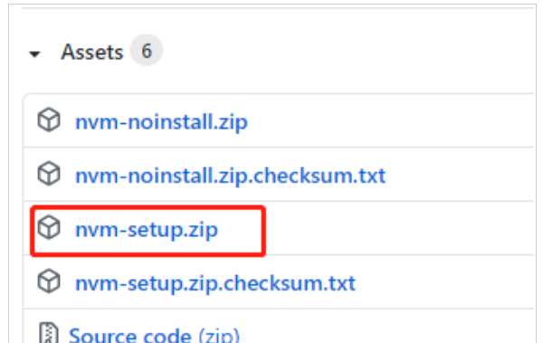

输入where node查看之前本地安装的node的路径

安装nvm管理工具

 https://github.com/coreybutler/nvm-windows/releases

Windows：

根据自身情况自定义选择路径盘，**路径不要出现空格或中文符号**

输入命令nvm v查看，如果出现版本号，即安装成功

输入命令行nvm ls anaillable查看可用的node.js版本号

输入命令行nvm install node版本号(例如：nvm install 12.17.0)即可安装对应版本以及自动安装对应的npm版本

分别输入命令行node -v和npm -v，检验node.js以及对应npm是否安装成功

输入命令行nvm use node版本号（例如：nvm use 12.17.0）即可选择你本地所使用的Node.js版本，使用此命

令行可以随意切换node.js版本运行

如果想删除某node.js版本的话，输入命令行nvm uninstall node版本号（例如：nvm use 12.17.0）即可删除对应版本