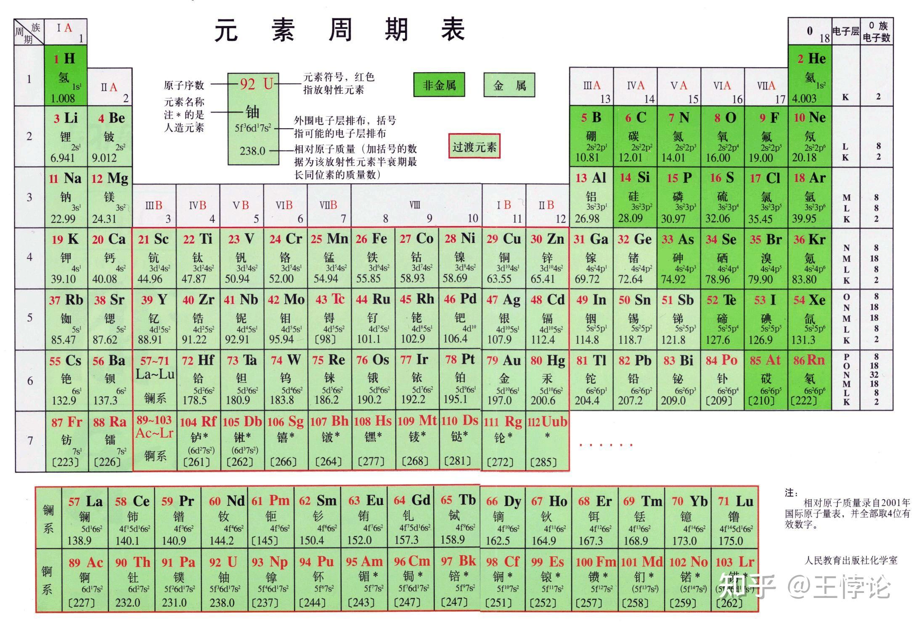

## 1. 元素周期表 - Periodic Table of Elements

元素周期表有着多种形式，此处使用教科书中最常见的维尔纳长式元素周期表。

中文元素周期表 [人民教育出版社化学室]

英文元素周期表[美国国家标准与技术研究院]

**元素周期表（periodic table of elements）**，简称**周期表（periodic table）**。整个周期表根据元素价电子层排布方式被分为了五个大块的区（block）：s区（s-block）、f区（f-Block）、d区（d-block）、ds区（ds-block）、p区（p-block）。除了这些区，元素周期表还被人们划分为了更基本的“周期”与“族”。

中文课本中介绍周期表分区的配图 [来自网络]

### **1.1 原子与元素 - Atom and Element**

**原子（atom）**是化学变化中的最小**粒子（particle）**。一个原子由**中子（neutron）**、**质子（proton）**以及**电子（electron）**组成。中子与质子都属于**核子（nucleon）**，能够组成**原子核（atomic nucleus）**，简称“**核（nucleus）**”；注意不要混淆nucleon与nucleus这两个单词的含义。当原子通过得到或失去额外电子时能够带电，这种粒子被称作**离子（ion）**。，分为带正电的**阳离子（cation）**与带负电的**阴离子（anion）**。两个或以上的原子可以通过化学键组成**分子（molecule）**。

拥有特定中子数与质子数的一类原子可以被称作一种**核素（nuclide / nucleide）**。有些元素的拥有不止一种核素，同种元素（拥有相同质子数）的不同核素被称作彼此的**同位素（isotope）**，如果有放射性则被称作**放射性同位素（radioisotope）。**

中英元素周期表的元素信息标注举例，截取自上文两张元素周期表

周期表上，一个元素的基本信息一般都会被标注在元素的**符号（symbol / chemical symbol）**周围。

化学里的**元素（element）**基本可以分成**金属（metal）**与**非金属（nonmetal）**两类，金属元素中又有一系列特别的**过渡金属（transition metals）**。周期表上金属与非金属交界处又有着一系列具有特殊性质的元素，被称为**准金属（metalloid）**或**半金属（semimetal）**。

以下是几种常见元素信息名称的中英对照：

**原子序数 - Atomic Number**

**质子数 - Proton Number**

**电荷数 - Charge Number**

**相对原子质量 - Relative Atomic Mass**

**标准原子量 - Standard Atomic Weight**

**电离能 - Ionisation Energy / Ionization Energy** (英式/美式英语拼写不同)

**电子亲合能 - Electron Affinity**

**电负性 - Electronegativity**

**基态 - Ground State**

**化合价 - Valance Number**

**氧化数 - Oxidation Number**

**半衰期 - Half-Life**

### **1.2 周期 - Period**

周期表上的一个横行为一个周期，从上往下数，用阿拉伯数字表示，从1开始。例如第一行是“第一周期（period 1）”，第六行是“第六周期（period 6）”。

### **1.3 族 - Group**

元素周期表上的竖列被称为族。最新的相关标准规定元素周期表从左至右一竖列为一族，用阿拉伯数字指代，例如第4族（group 4）、第16族（group 16）。值得注意的是第18族元素在国内也被广泛按照旧标准称为0族元素。

在1988年国际纯粹与应用化学联合会（IUPAC）颁布上述标准之前，人们曾将周期表上的族划分为了主族与副族。迄今为止，“主族与副族”的标准仍然存在于许多课本以及参考资料中，因此在这样两种标准并存的情况下解一下他们之间的区别与联系也是很有必要的。

提出新标准的IUPAC文件中的配图 [1]

- “主族（main group / group A）”指周期表上从左往右数的第1～2，13～18竖列的元素（或s区+p区元素），一列为一族。主族元素用罗马数字加大/小写的字母“A”来表示，例如新标准的第2族在主副族标准中是“IIA族（group IIA） ”。
- “副族（group B）”指周期表上从左往右数的3～12竖列元素（或f区+d区+ds区元素），除“VIII族”一共有三列元素外一列为一族。副族元素用罗马数字加大/小写的字母“B”来表示，例如新标准的第5族在主副族标准中是“VB族（group VB）”。

主副族的数字编号方式与新标准的对应请看上文配图。

### **1.4 成组元素 - Collective of Elements**

许多元素在化学上有着相似的性质，因此人们便经常将他们规划到同一个特殊的组（collective）中并赋予其一个相应的组名。

由于同一族的元素通常有着相似的化学性质，因此许多元素既是一组的同时也是一族。

以下是IUPAC正式认证过的组名[2]：

第1族：**氢 +** 碱金属（Alkali Metals）

- - - - 碱金属：锂，钠，钾，铷，铯，钫 / Li, Na, K, Rb, Cs, Fr

第2族：碱土金属（Alkaline Earth Metals）

- - - - 碱土金属：铍，镁，钙，锶，钡，镭 / Be, Mg, Ca, Sr, Ba, Ra

第3族：稀土金属（Rare Earth Metals）**+ 锕系元素**

- - - - 稀土金属：钪，钇，镧系元素 / Sc, Y, the lanthanoids

第15族：氮族元素（Pnictogens）

- - - - 氮族元素：氮，磷，砷，锑，铋，镆 / N, P, As, Sb, Bi

第16族：氧族元素（Chalcogens）

- - - - 氧族元素：氧，磷，硒，碲，钋，鉝 / O, S, Se, Te, Po, Lv

第17族：卤族元素（Halogens）

- - - - 卤族元素：氟，氯，溴，碘，砹，“石田” / F, Cl, Br, I, At

第18族：稀有气体（Noble Gases）

- - - - 稀有气体：氦，氖，氩，氪，氙，氡，“气奥” / He, Ne, Ar, Kr, Xe, Rn, Og

澜系元素（Lanthanoids）

- - - - La, Ce, Pr, Nd, Pm, Sm, Eu, Gd, Tb, Dy, Ho, Er, Tm, Yb, Lu

锕系元素（Actinoids）

- - - - Ac, Th, Pa, U, Np, Pu, Am, Cm, Bk, Cf, Es, Fm, Md, No, Lr

注意：

- 第1族与碱金属不能画等号；第3族与稀土金属不能画等号。
- 除了上述经过IUPAC正式认证过的名称外，人们也常用一个族的第一个元素来命名整个族，例如第13族也可以用“硼族元素（boron group）”来指代。

## 2. 基础化合物的命名构词法 - Basic Compound Nomenclature

### **2.1 物质的分类 - Classification of Matter**

**2.1.1 物质，纯净物与混合物 - Matter, Pure Substance, and Mixture**

物质分为纯净物与混合物：

- **纯净物（pure substance）**是由单种成分组成的物质，拥有固定的化学式。纯净物可以分为由单种元素组成的**单质**和由多种元素化合成的**化合物**。
- **混合物（Mixture）**是由多种成分（也即多种纯净物）组成的物质，也因此没有固定的化学式。混合物可以按照混合的均匀程度分为**均匀混合物（homogeneous mixture）**与**非均匀混合物（heterogeneous mixture）**。而此处可以见到两个英语构词法中常用的两个构词前缀：“同质的/相同的，homo-”与“异质的/相异的，hetero-”。这些词缀在不同领域代表的具体含义有所不同。

**2.1.2 单质 - Element**

关于单质需要注意的是，”元素“与“单质”的英文都是“element”，因此需要根据语境来判断该英语单词的含义。有时为了去歧义，“单质”的英文也会被写成“free element”或“pure element”或“elementary substance”来与“元素”区分。

特定单质的英文名称同理，例如“氢元素”与“氢气/氢单质”的英文名称都是“hydrogen”，但可以用“hydrogen gas”、“pure hydrogen”来特指“氢气/氢单质”；“铁元素”与“铁单质”的英文名称都是“iron”，但可以用“pure iron”来特指“铁单质”。

**2.1.3 化合物 - Compound**

化合物可以分为**无机化合物（inorganic compound）与有机化合物（organic compound）**两种，也可以按照化学键类型划分为共价化合物（covalent compound）,离子化合物（ionic compound）与络合物（coordinate complex）等。

### **2.2 共价化合物的命名法 - Covalent Compound Nomenclature**

化合物的化学式是根据元素的化合价[[1\]](https://zhuanlan.zhihu.com/p/478675889#ref_1)决定的，一般正价元素在前，副价元素在后。对共价化合物来说，也即**金属性较强（more metallic）**的元素在前，**金属性较弱（less metallic）**的元素在后。

共价化合物指原子以**共价键（covalent bond）**结合在一起的化合物。

**2.2.1 非金属+非金属共价化合物** - **Nonmetal + Nonmetal Covalent Compound**

在中文里，无机化合物名称的读写法是按照化学式从后往前读写，例如CO2读写作“二氧化碳”。但英语里化合物的名称是从前往后读写的，例如CO2读写为“carbon dioxide”，先读写碳，再读写氧。

将写在后面的元素的词尾该为**“-ide”**。例如，二氧化碳中的氧应该写成“dioxide”而非“dioxygen”。这些后缀变为-ide的元素名还有着“x化物”的意思。例如“chlorides”有“氯化物”的意思，“nitrides”有“氮化物”的意思。

然后用希腊语前缀系统来表示化合物中各个元素原子的数量：

| 1     | 2    | 3    | 4      | 5      | 6     | 7      | 8     | 9     | 10    |
| ----- | ---- | ---- | ------ | ------ | ----- | ------ | ----- | ----- | ----- |
| Mono- | Di-  | Tri- | Tetra- | Penta- | Hexa- | Hepta- | Octa- | Nona- | Deca- |

例如一个化合物中有五个氢原子，那么氢在这个化合物中的名字就是“pentahydrogen”；如果一个化合物中有三个碳原子，那么碳在这个化合物中的名字就是“tricarbon”。

但需要注意的是如果写在前面的元素只有一个原子，那么就不需要加**“mono-”**的前缀了，例如NO2中碳只有一个原子，其正式名称是“二氧化氮 - nitrogen dioxide”而非“二氧化一氮 - mononitrogen dioxide”。

如果前缀以“o-”或“a-”结尾而元素名称的首字母是原音时，前缀的尾字母通常会被去掉。例如：“Mon**oo**xide”应该写成“Mon**o**xide”；“tetr**ao**xide”应该写成“tetr**o**xide”。

最后，当两种元素只有一种化合物时，人们经常会省略掉数字前缀。例如硫化氢（H2S）的英文名称比起“dihydrogen monosulfide”更常被写作“hydrogen sulfide”。

该非金属共价化合物命名法只适用于无机化合物与部分简单有机化合物。

**“非金属+非金属”共价化合物的命名规则总结：**

**化合物名称 = {数量前缀 + 金属性强的元素} {数量前缀 + 金属性弱的元素 + -ide}**

- 金属性强的非金属元素写在前，金属性弱的非金属元素写在后。
- 化学式里第二个元素的词尾改为**“-ide”**。
- 在每个元素前面加上表示原子数量的希腊语前缀。
- 写在前面的元素只有一个原子时不需要加**“mono-”**的前缀。
- 当两种元素的共价化合物只有一种化学式时常省去数字前缀。

**常用的非金属元素名称-ide形式：**

| 元素中文名称 | 元素符号 | 元素英文名称     | 元素-ide形式       |
| ------------ | -------- | ---------------- | ------------------ |
| 氢           | H        | Hydrogen         | Hydride            |
| 硼           | B        | Boron            | Boride             |
| 碳           | C        | Carbon           | Carbide            |
| 氮           | N        | Nitrogen         | Nitride            |
| 氧           | O        | Oxygen           | Oxide              |
| 氟           | F        | Fluorine         | Fluoride           |
| 硅           | Si       | Silicon          | Silicide           |
| 磷           | P        | Phosphorous      | Phosphide          |
| 硫           | S        | Sulphur / sulfer | Sulphide / sulfide |
| 氯           | Cl       | Chlorine         | Chloride           |
| 锗           | Ge       | Germanium        | Germanide          |
| 砷           | As       | Arsenic          | Arsenide           |
| 硒           | Se       | Selenium         | Selenide           |
| 溴           | Br       | Bromine          | Bromide            |
| 锑           | Sb       | Antimony         | Antimide           |
| 碲           | Te       | Tellurium        | Telluride          |
| 碘           | I        | Iodine           | Iodide             |
| 钋           | Po       | Polonium         | Polonide           |
| 砹           | At       | Astatine         | Astatide           |

- 表中硫的英文名称“sulphur / sulfur”为英式英语/美式英语之分，本质无区别。

**“非金属+非金属”共价化合物的命名举例：**

| 化学式 | 中文名             | 英文名               |
| ------ | ------------------ | -------------------- |
| CO     | 一氧化碳           | Carbon Monoxide      |
| NO     | 一氧化氮           | Nitrogen Monoxide    |
| N2O3   | 三氧化二氮         | Dinitrogen Trioxide  |
| H2O    | 一氧化二氢         | Dihydrogen Monoxide  |
| BrF3   | 三氟化溴           | Bromine Trifluoride  |
| CCl4   | 四氯化碳（有机物） | Carbon Tetrachloride |

**2.2.2 金属+非金属共价化合物** - **Metal + Nonmetal Covalent Compound**

金属-非金属共价化合物的命名比非金属-非金属共价化合物的命名简单许多。在命名时金属元素不需要做改动，非金属元素进行与非金属-非金属共价化合物中一样的变形。

**“金属+非金属”共价化合物的命名规则总结：**

**化合物名称 = {金属元素} {数量前缀 + 非金属元素 + -ide}**

- 金属元素写在前，非金属元素写在后。
- 非金属元素的词尾改为**“-ide”**。
- 在非金属元素前面加上表示原子数量的希腊语前缀。
- 非金属元素的数字前缀有时也可以省去。

例如氯化铝，AlCl3的英文名是“aluminium trichloride”，也可以直接写“aluminium chloride”。

### **2.3 离子的命名法 - Ion Nomenclature**

在学习离子化合物的命名法之前，需要先了解离子的命名法。

**2.3.1 单原子离子 - Monatomic Ion**

由单个原子构成的离子在英文中被称作

“mono-（单）”+“atomic（原子的）”+“ion（离子）”=“monatomic ion”。

非金属元素一般是带负电的**阴离子（anion）**，金属元素一般是带正电的**阳离子（cation）**：

- **阴离子的名称为“原子元素名-ide形式”。**

例如“氯离子”的英文为“chloride”，“氢负离子”的英文为“hydride”。

因此，也可以认为非金属元素名称的“-ide形式”是“负离子形式”。

- **阳离子的名称是其原子元素名不变。**

例如“钠离子”的英文仍为“sodium”，“氢离子”的英文仍是“hydrogen”。

变价金属的离子命名要稍微复杂一些：

- **变价金属元素名称的离子形式为“{元素名} (罗马数字价态)”或“{元素拉丁名+价态后缀}”。**

例如“铁离子”的英文为“iron (III)”，“亚铁离子”的英文为“iron (II)”。除了用罗马数字表示价态的写法外，有些变价金属也被给予了专门的拉丁名。这些变价金属拉丁名使用专门的后缀来表示其价态：较高价态加“**-ic**”后缀，较低价态加“**-ous**”后缀。

下表提供了三个例子。

| 元素名     | 较高价态离子名  | 较低价态离子名     |
| ---------- | --------------- | ------------------ |
| 铁 iron    | 铁离子 ferric   | 亚铁离子 ferrous   |
| 铜 copper  | 铜离子 cupric   | 亚铜离子 cuprous   |
| 汞 mercury | 汞离子 mercuric | 亚汞离子 mercurous |

**2.3.2 多原子离子(根离子） - Polyatomic Ion**

由多个原子共同构成的原子团离子——“根离子”或“根”——在英文中被称作

“poly-（多）”+“atomic（原子的）”+“ion（离子）”=“polyatomic ion”。

而由两个原子共同构成的原子团离子也被称为“双原子离子（diatomic ion）”。

对于化学基础来说一般只需要知道或记住常见的根离子即可。含氧酸根的命名规律将会在下文2.5.3 含氧酸部分讨论。

以下为常用的根离子英文名：

| 离子中文名 | 离子英文名                           | 离子化学式 |
| ---------- | ------------------------------------ | ---------- |
| 氨根       | Ammonium                             | (NH4) +    |
| 水合氢离子 | Hydronium                            | (H3O) +    |
| 醋酸根     | Acetate                              | (C2H3O2) - |
| 高氯酸根   | Perchlorate                          | (ClO4) -   |
| 氯酸根     | Chlorate                             | (ClO3) -   |
| 亚氯酸根   | Chlorite                             | (ClO2) -   |
| 次氯酸根   | Hypochlorite                         | (ClO) -    |
| 氰离子     | Cyanide                              | (CN) -     |
| 磷酸二氢根 | Dihydrogen phosphate                 | (H2PO4) -  |
| 碳酸氢根   | Hydrogen carbonate                   | (HCO3) -   |
| 硫酸氢根   | Hydrogen sulphate / hydrogen sulfate | (HSO4) -   |
| 氢氧根     | Hydroxide                            | (OH) -     |
| 硝酸根     | Nitrate                              | (NO3) -    |
| 亚硝酸根   | Nitrite                              | (NO2) -    |
| 高猛酸根   | Permanganate                         | (MnO4) -   |
| 硫氰酸根   | Thiocyanate                          | (SCN) -    |
| 碳酸根     | Carbonate                            | (CO3) 2-   |
| 铬酸根     | Chromate                             | (CrO4) 2-  |
| 重铬酸根   | Dichromate                           | (Cr2O7) 2- |
| 磷酸氢根   | Hydrogen phosphate                   | (HPO4) 2-  |
| 过氧根     | Peroxide                             | (O2) 2-    |
| 硫酸根     | Sulphate / sulfate                   | (SO4) 2-   |
| 亚硫酸根   | Sulphite / sulfite                   | (SO3) 2-   |
| 硫代硫酸根 | Thiosuphfate / thiosulfate           | (S2O3) 2-  |
| 磷酸根     | Phosphate                            | (PO4) 3-   |

- 这些根离子的名称本身也可以用来指代其相应的一系列盐或化合物，例如“sulphates”可以指“硫酸盐”，“cyanides”可以指代“氰化物”。

### **2.4 离子化合物命名法 - Ionic Compound Nomenclature**

离子化合物指原子以**离子键（ionic bond）**结合在一起的化合物。

**2.4.1 非金属做阳离子的离子化合物 - Ionic Compound with Nonmetal Cation**

只有非金属元素的离子化合物遵从以下的规则：

**化合物名称 = {阳离子} {阴离子}**

- 阳离子写在前，阴离子写在后。
- 如阴离子为单原子离子则阴离子词尾改为**“-ide”**。
- 在每个单原子离子前面加上表示数量的希腊语前缀* （*见2.2.1）。
- 如果化学式里阳离子部分只有一个离子，那么就不需要加**“mono-”**的前缀了。
- 数字前缀有时也可以省去。

非金属的离子化合物举例：

PCl5，五氯化磷的英文名称为“phosphorous pentachloride”，注意由于磷只有一个离子因此没有加“mono-”的前缀；

(NH4)2SO4，硫酸铵的英文名称为“ammonium sulphate”，注意由于氨根不是单原子离子因此不需要使用数量前缀。

**2.4.2 金属做阳离子的离子化合物 - Ionic Compound with Metal Cation**

带有金属离子的离子化合物遵从以下的规则：

**化合物名称 = {阳离子} {阴离子}**

- 阳离子写在前，阴离子写在后。
- 如阴离子为单原子离子则阴离子词尾改为**“-ide”**。
- 不需要使用数字前缀。

单价金属离子化合物举例：

NaCl，氯化钠的英文名称为“Sodium Chloride”；

Na2SO4，硫酸钠的英文名称为“Sodium Sulphate”。

变价金属离子化合物举例：

Fe2（CO3）3，碳酸铁的英文名称为“iron (III) carbonate”或“ferric carbonate”。

FeCO3，碳酸亚铁的英文名称为“iron (II) carbonate”或“ferrous carbonate”。

### **2.5 酸碱的命名法 - Base and Acid Nomenclature**

**2.5.1 碱 - Base**

碱的命名与其他金属阳离子的离子化合物无异，只不过碱的阴离子都是氢氧根（hydroxide）。

- **碱的名称 = 氢氧化X = “{X元素名} hydroxide”**

X为能够生成碱的金属元素名称，不需要做任何改动。

碱的英语命名举例：

NaOH，氢氧化钠的英文名称为“sodium hydroxide”；

KOH，氢氧化钾的英文名称为“potassium hydroxide”；

Mg(OH)2，氢氧化镁的英文名称为“magnesium hydroxide”。

注意不需要用任何数量前缀。

**2.5.2 氢酸 - Hydracid / Binary Acid**

氢酸（hydrogen + acid = hydracid），或称无氧酸指由氢元素H和另一非金属元素或酸根X构成的不含有氧元素的酸**HX**。

需要注意的是无氧酸的另一个名称英文名“binary acid”并不是指单个酸分子能够电离产生两个氢离子的“二元酸”。“二元酸”真正对应的英语名称是“Diprotic Acid”，即“双质子酸”。

氢酸的化合物HX通常只有在变成水溶液后才会展现出酸性，因此

**氢酸的化合物不是水溶液时命名与其他只由非金属构成的化合物无异**，例如：

HF，氟化氢的英文名称为“hydrogen fluoride”；

HCl，氯化氢的英文名称为“hydrogen chloride”；

H2S，硫化氢的英文名称为“hydrogen sulphide”；

HCN，氰化氢的英文名称为“hydrogen cyanide”。

**在变成水溶液后，氢酸作为酸也有了属于自己的特殊命名法**：

- **酸的名称 = {hydro- + X的词根 + -ic} acid**

溶在水中的氢酸命名举例：

HF，氢氟酸的英文名称为“hydrofluoric acid”；

HCl，氢氯酸的英文名称为“hydrochloric acid”；

H2S，氢硫酸的英文名称为“hydrosulphuric acid”；

HCN，氢氰酸的英文名称为“hydrocyanic acid”。

IUPAC后来又为水溶液中的氢酸制定了以下更为简单的命名法：

- **酸的名称 = aqueous hydrogen {X元素名 + -ide}**

这种命名方法其实就是在氢酸的HX化合物名称前加一个代表水溶液的形容词“aqueous”。

溶在水中的氢酸命名举例：

HF (aq)，氟化氢水溶液的英文名称为“aqueous hydrogen fluoride”；

HCl (aq)，氯化氢水溶液的英文名称为“aqueous hydrogen chloride”；

H2S (aq)，硫化氢水溶液的英文名称为“aqueous hydrogen sulphide”；

HCN (aq)，氰化氢水溶液的英文名称为“aqueous hydrogen cyanide”。

在面对同一种化合物的不同命名方式时不一定需要全部记下来，但是推荐要能够做到看到同一物质的不同名称时不会感到陌生。

**2.5.3 含氧酸 - Oxyacid / Oxoacid**

含氧酸（oxyacid / oxoacid）指由氢元素与含氧酸根组成的酸。含氧酸的命名方式与酸根离子的命名方式联系紧密。

假设含氧酸根**XO**（未注原子数）由氧元素与变价非金属元素X组成，则含氧酸根的命名为：

- **含氧酸根名称 = {前缀 + X元素词根 + 后缀}**

| 酸根相对含氧原子数量 | 中文名  | 前缀  | 后缀 |
| -------------------- | ------- | ----- | ---- |
| 最多                 | 高X酸根 | per-  | -ate |
| 较多                 | X酸根   | 无    | -ate |
| 较少                 | 亚X酸根 | 无    | -ite |
| 最少                 | 次X酸根 | hypo- | -ite |

含氧酸根命名举例：

| 酸根中文名 | 酸根英文名   | 酸根化学式 |
| ---------- | ------------ | ---------- |
| 高氯酸根   | perchlorate  | (ClO4) -   |
| 氯酸根     | chlorate     | (ClO3) -   |
| 亚氯酸根   | chlorite     | (ClO2) -   |
| 次氯酸根   | hypochlorite | (ClO) -    |

如果酸根的含氧原子数量只有两个量级，则使用“较多”与“较少”两个相对数量对应的后缀。例如：

| 酸根中文名 | 酸根英文名 | 酸根化学式 |
| ---------- | ---------- | ---------- |
| 硫酸根     | sulphate   | (SO4) -    |
| 亚硫酸根   | sulphite   | (SO3) -    |

含氧酸的命名即是将相应含氧酸根的名称后缀由“-ite”修改为“-ous”或由“-ate”修改为“-ic”后加上“acid”：

- **含氧酸名称 = {含氧酸根} acid**

| 酸中文名称 | 酸根英文名称 | 酸英文名称      |
| ---------- | ------------ | --------------- |
| 高X酸      | per[X]ate    | per[X]ic acid   |
| X酸        | [X]ate       | [X]ic acid      |
| 亚X酸      | [X]ite       | [X]ous acid     |
| 次X酸      | hypo[X]ite   | hypo[X]ous acid |

含氧酸命名举例：

| 酸中文名 | 酸根英文名   | 酸英文名          | 酸化学式 |
| -------- | ------------ | ----------------- | -------- |
| 高氯酸   | perchlorate  | perchloric acid   | HClO4    |
| 氯酸     | chlorate     | chloric acid      | HClO3    |
| 亚氯酸   | chlorite     | chlorous acid     | HClO2    |
| 次氯酸   | hypochlorite | hypochlorous acid | HClO     |
| 硫酸     | sulphate     | sulphuric acid    | H2SO4    |
| 亚硫酸   | sulphite     | sulphurous acid   | H2SO3    |