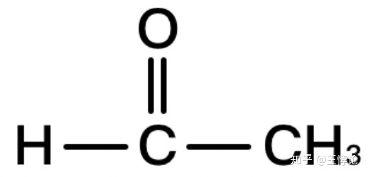

## 1. 有机化学基础概念 - Basic Concepts of Organic Chemistry

### **1.1 化学式的不同类型 - Different Types of Chemical Formulae**

**化学式（chemical formula*****）**（*复数形式：formulae）有许多不同的形式，以下是一些常用化学式名称的中英对照：

- **分子式：molecular formula**
- **实验式/最简式：empirical formula**
- **结构式：structural formula**
- **结构简式：condensed structural formula / condensed formula**
- **骨架式/键线式：skeletal formula / line diagram**

### **1.2 同分异构体 - Isomers**

拥有相同分子式但具有不同结构的化合物被称为彼此的**同分异构体（isomer）**。同分异构体整体可分为两大类：

- 由于分子中原子或原子团连接次序不同导致的**构造异构体（constitutional isomer / structural isomer）**
- 由于原子或原子团在三维空间中的排列形状不同导致的**立体异构体（stereoisomer / spatial isomer）。**

这两大类异构体又可因为更细致的标准分为更多更小的同分异构体类型，本文作为基础类文章将不一一赘述；本文后问会提到立体异构体的其中一种，**顺反异构体（cis/trans isomer）**或称几何异构体。

下图是顺反异构体所处的具体分类位置。

图1.2-1

## 2. 烃类物质的系统与习惯命名法 - Systematic and Common Naming of Hydrocarbons

### **2.1 饱和烃 - Saturated Hydrocarbons**

**2.1.1 （直链）烷烃 - (Straight-Chain) Alkanes**

**烃类物质（hydrocarbons）**是最基本的一类有机物，由碳与氢组成，因此其英文名称也就是hydrogen + carbon = hydrocarbon。**饱和烃**的英文为**saturated hydrocarbon**。

**烷烃**的英文是**“alkane”**，其内部所含的碳碳单键则被叫做**“carbon-carbon single bond”**。

拥有不同碳原子数量的烷烃名称则是**其所含碳原子数量相应的数字前缀加上代表烷烃的“-ane”后缀**。

以下是前二十个直链烷烃对应的前缀以及其名称：

被知乎水印挡住的二十烷的结构简式是CH3(CH2)18CH3

**注意：给单词添加词缀时直接相邻的两个元音字母或重复的字母通常需要去掉一个。这条一般英语构词法的规则适用于整个有机化合物命名法。**

从上表可以看出，中文对烷烃的命名只有前十个用了特殊的天干地支前缀来表示碳原子数量，之后的烷烃名称均直接用数字来表示。而英文对烷烃的命名则是始终用特殊的拉丁或希腊语前缀组合来表达所含碳原子数量。

例如十七烷的英文就是

“hepta-”+“deca-”+“-ane” = “heptadecane”

“七” + “十” + “烷” = “十七烷”

对于基础学习来说一般只要记住前十个烷烃的名字（即前十个前缀）就可以了。如果想要深入了解如何用这套前缀系统表示更大的数字，可以阅读参考以下文章：

https://iupac.qmul.ac.uk/misc/numb.html

有些时候为了与带有支链的同分异构体区分，**直链烷烃（straight-chain alkane）**也即正构烷烃会在**英文名称的前面加上代表“正（normal）”的前缀“n-”**（只有一个字母的词缀使用时需带连字符）。例如：

正丁烷的英文是“n-butane”;

正己烷的英文是“n-hexane”。

**2.1.2 环烷烃 - Cycloalkane**

**环烷烃**在英语中可以被称作**“cyclic alkane”**或**“cycloalkane”**。环烷烃的命名规则与直链烷烃一致，只不过需要**在最前面加上代表闭环的前缀“cyclo-”**。例如：

环丙烷的英文是“cyclopropane”；

环庚烷的英文是“cycloheptane”。

**2.1.3 烷基与支链烷烃 - Alkyl Groups and Branched Alkanes**

有机化学中的**基团**在英文里被称作**“group”**或**“radical”**，**“官能团”**被称作**“functional group”，**而**取代基**则被称作**“substituent”**。

当烷烃变成烷基时候，需要**把代表烷烃的“-ane”后缀变成代表烷基的“-yl”后缀**。

因此烷基的英文名称是**“alkyl group”**，有时也直接简称“alkyl”。前十个烷基的英文名称如下：

被知乎水印挡住的癸基英文名称是“decyl”

在知道了烷基和特定碳原子的名称后就可以命名支链烷烃，或者说正烷烃的同分异构体了。

在有机化学中，带有支链结构的化合物由**母体/主链（parent chain）**以及数量不定的**支链/侧链（side chain）**组成。同一个分子式的支链烷烃可能有多种异构体。对于两种常见的情况，人们还给其制定了专门的两个前缀：

- 如果母体上仅有末端第二个碳原子有一个甲基，则可以使用前缀**“异（iso- / i-）”**
- 如果母体上仅有末端第二个碳原子有两个甲基，则可以使用前缀**“新（neo-）”**

例如正己烷符合这两个条件的异构体：

异己烷的英文是“isohexane”或“i-hexane”。下图是异己烷的结构简式：

新己烷的英文是“neohexane”。下图是新己烷的结构简式：

除了这两个来自习惯命名法的前缀，人们还制定了能够普遍适用于各种构型的系统命名法。

英语的系统命名法与中文基本一致，基本分为以下几个步骤：

**1. 找到最长的碳链当作母体；如果有等长的多个选择，选择支链最多的。**

**2. 找到所有附着在母体上的支链。**

**3. 从母体末端开始数清支链的定位数（连接在第几个碳原子），并且采用让各个支链位置数字最小的数法，写名字时采取“{支链的定位数}-{支链的名字}”的写法，例如“3-methyl”。如果母体上有多个支链，则名称在字母顺序上更靠前的支链应该获得更低的定位数；但所有定位数的总数应达到最小。**

**————3.1. 如果同一个碳原子上有多个相同的支链，则写该支链的名字时要在前面加上相应的希腊语数字前缀（“di-”，“tri-”），并且有几个该种支链就需要写几个位置数字，用逗号隔开（如果在计算机上则使用半角逗号不加空格）。例如：“3,3-dimethyl”；**

**————3.2. 如果母体是环烷烃而只有一个支链，则唯一支链的“1-”定位数在书写名称时可以省略。**

**4. 书写支链烷烃的名称时将各个支链的名字按照字母顺序排列，彼此之间用连字符“-”相连。最后一个支链的名称和母体之间不需要用连字符。**

**支链烷烃名称 = {支链的定位数}-{支链的名字} - … -{支链的定位数}-{支链的名字}{母体的名字}**

其中需要注意的是第4点，中文命名法的习惯是先写简单的支链，比如同时有甲基乙基先写甲基；英文命名法的习惯是按照字母顺序写，比如同时有甲基（methyl）乙基（ethyl）先写乙基。

举例1，参照下方结构简式写出该烷烃的英文名称：

3,3-diethyl-2-methylheptane

在这个例子中注意：

- 母体不选择从最左边的碳开始，而是选择从最下面的碳开始。
- 因为“diethyl”的字母顺序比“methyl”靠前，因此即使二乙基的定位数更高，它仍被写在了甲基前面。
- 尽管“diethyl”的字母顺序比“methyl”靠前，但如果非要让“diethyl”获得更小的定位数，则该烷烃的名称就变成了“5,5-diethyl-6-methylheptane”。应选用定位数总数最小的方案，即“3,3”和“2”。

举例2，参照下方结构简式写出该烷烃的英文名称：

3-cyclobutylpentane

在这个例子中注意：

- 环烷烃作为取代基命名遵守一样的规则，把代表烷烃的“-ane”变成代表烷基的“-yl”：“cyclobutane”变成“cyclobutyl”。

**2.1.4 复杂支链的三种命名方式 - Three Naming Methods for Complicated Side Chains**

这里讨论当支链烷烃的支链与母体连接方式较为复杂时可以使用的三种命名方式。其中一种被称作习惯命名法（common naming），另外两种都属于IUPAC研究颁布的系统命名法（systematic naming）。

我们首先来看最为通用也最为重要的系统命名法：

假设2.1.3中最后一个例子的分子变为以下结构简式（图2.1.4-1）：

图2.1.4-1

这里可以看到，由于环己烷有六个碳，因此环己烷是母体；支链可以被看作是一个正戊烷，但是是通过第三个碳原子连接在母体上的。这种情况下就不能直接写pentylcyclohexane了，因为这个名称指的是另一个分子，也就是正戊基直接通过第一个碳原子与环己烷相连形成的、命名起来较为简单的分子（图2.1.4-2）：

图2.1.4-2

于是为了命名这种类型的支链，人们制定了以下两种系统命名方式：

**系统命名法1：在书写复杂支链名称时把母体在支链上的定位数加在支链名称的数字前缀与“-yl”后缀之间，整个支链名称用括号包裹，并在括号前加上这个支链在母体上的定位数。**

例如,（图2.1.4-1）所示的分子用这种方式可以命名为:

(pent-3-yl)cyclohexane

注意由于戊烷支链通过其第三个碳原子与母体相连，所以他的名称就从单纯的“pentyl”变成了“(pent-3-yl)”。但是这里的数字指的是“母体在支链上的定位数”，如果这个支链在母体上的定位数不可省略，则需要把这个定位数写在括号前。例如，假设“(pent-3-yl)”这个支链在母体上的定位数是3，则需要在最终的分子名称中写“3-(pent-3-yl)”。

比起第一种系统命名方式，第二种系统命名方式的使用范围更加广泛：

**系统命名法2：在书写复杂支链时先把支链当做一个单独的支链烷烃并进行命名（与母体相连的碳原子做1定位数），最后将此支链烷烃的名称变成一个“支链烷基”加到母体的名称里；此“支链烷基”的名称需要用括号包裹，并且需要在名称前面加上其在母体上的定位数。**

例如，（图2.1.4-1）所示的分子中环己烷所拥有的支链可以按照下图（图2.1.4-3）看作一个“在1定位数带有一个乙基的正丙烷”：

图2.1.4-3

一个环己烷在自己的1定位数上有一个“1定位数带乙基的丙基”，因此这个分子的名称可以写作(1-ethylpropyl)cyclohexane。同样，如果“(1-ethylpropyl)”这个支链在母体上的定位数是3，则其名称在最终的分子名里需要写作“3-(1-ethylpropyl)”。

以此类推这种命名法还可以用来命名更复杂一些的分子，例如下图（图2.1.4-4）：

图2.1.4-4

这个分子的名称是(1,1-dimethylpropyl)cyclohexane，其支链是一个在1定位数上带两个甲基的丙基。

了解了系统命名法之后，我们接下来看一看习惯命名法。

**习惯命名法：在书写复杂支链时先把支链当做一个单独的支链烷烃并进行习惯命名（例如异烷烃），最后将此支链烷烃的名称变成一个“支链烷基”加到母体的名称里。**

前文在2.1.3中提到的“异（iso-/i-）”和“新（neo-）”两个前缀就属于习惯命名法的一部分。除此之外，人们还习惯按照碳链中一个碳原子所连接的其他碳原子数量来将其分为四类不同的碳原子：

被知乎水印挡住的季碳原子英文名为“quaternary carbon”

其中二级碳原子拥有自己专属的前缀**“仲（sec-/s-）”**，而三级碳原子则拥有专属的前缀**“叔（tert-/t-）”**。

为了通过举例详细解释习惯命名法，参考以下四个例子：

习惯命名法举例-1: 参照下图（图2.1.4-5）的结构简式写出该分子的英文名称

图2.1.4-5

这里首先把支链当做一个单独的丁烷来看，其与母体相连的碳原子是一个仲碳原子（secondary carbon），因此这个丁烷变成支链后就成为了一个仲丁基（sec-butyl）。于是这个分子的英文名称是sec-butylcyclohexane或s-butylcyclohexane。

习惯命名法举例-2: 参照下图（图2.1.4-6）的结构简式写出该分子的英文名称

图2.1.4-6

这里首先把支链当做一个单独的丁烷来看，其与母体相连的碳原子是一个叔碳原子（tertiary carbon），因此这个丁烷变成支链后就成为了一个叔丁基（tert-butyl）。于是这个分子的英文名称是tert-butylcyclohexane或t-butylcyclohexane。

习惯命名法举例-3: 参照下图（图2.1.4-7）的结构简式写出该分子的英文名称

图2.1.4-7

这里首先把支链当做一个单独的丁烷来看，观察可得这是一个异丁烷（isobutane），因此这个丁烷变成支链后就变成了一个异丁基（isobutyl）。于是这个分子的英文名称是isobutylcyclohexane或i-butylcyclohexane。

习惯命名法举例-4: 参照下图（图2.1.4-8）的结构简式写出该分子的英文名称

图2.1.4-8

这里首先把支链当做一个单独的戊烷来看，观察可得这是一个新戊烷（neopentane），因此这个戊烷变成支链后就变成了一个新戊基（neopentyl）。于是这个分子的英文名称是neopentylcyclohexane。

值得一提的是在英语构词法中，这些冗长的、由连字符连接的有机分子名称是单个单词，因此在需要将其首字母大写时只需要大写整个名称中的第一个英文字母，例如“3,3-Diethyl-2-methylheptane”。

另外，有些资料在记录分子的名称时还会利用如下的两种书写格式：

**有机分子名称 = {母体的名字}, {支链的定位数}-{支链的名字} … -{支链的定位数}-{支链的名字}**

或

**有机分子名称 = {支链的定位数}-{支链的名字} … -{支链的定位数}-{支链的名字}** **{母体的名字}**

例如3,3-diethyl-2-methylheptane在不同的文件里可能还有以下不同写法：

heptane, 3,3-diethyl-2-methyl；

3,3-diethyl-2-methyl heptane （这种写法的区别是支链的名称和母体之间有空格）。

在了解这些不同的命名规则后其实不难注意到，同一个有机分子可能有多个不同的名称。因此在实践中对此要注意辨别，具体分子具体分析。2.1.3和2.1.4两个小节合起来介绍了有机化学中最底层的命名规则，后续有机物的命名也都用到了这里面展现出的命名思路，例如定位数总和应达到最小。在实践中需要灵活运用基本的命名规则与前缀系统的特点来避免错误与歧义或使分子名尽可能的简洁。

**2.1.5 卤代烷 - Alkyl Halides / Haloalkanes**

当卤素原子通过反应取代了一个烷烃中的一个或多个氢原子时，这个烷烃就变成了一个**卤代烷**，英文**“alkyl halide”**或**“haloalkane”**。

卤代烷的命名规则与支链烷烃完全相同，只不过需要对卤素的名称进行卤代基变形：**把卤素名称词尾的“-ine”替换为“-o”**。在命名整个有机物分子时，**卤代基与烷基有着同等的优先级**，也就是说字母顺序上靠前的取代基写在前。

被知乎水印挡住的碘代基英文名为“iodo”

举例-根据结构简式写出分子英文名称：

2-bromo-3-methylheptane

2,2-dichloroheptane

### **2.2 不饱和烃 - Unsaturated Hydrocarbons**

**2.2.1 烯烃，炔烃，烯炔 - Alkenes, Alkynes, Alkenynes**

饱和烃的英文名称是“saturated hydrocarbon”，相对应的，**不饱和烃**的英文就是**“unsaturated hydrocarbon”**。

含有**碳碳双键（carbon-carbon double bond）**的不饱和烃就是**烯烃（alkene）**，拥有代表烯烃的后缀**“-ene”**；

含有**碳碳三键（carbon-carbon triple bond）**的不饱和烃就是**炔烃（alkyne）**，拥有代表炔烃的后缀**“-yne”**；

既含有双键又含有三键的不饱和烃就是**烯炔（alkenyne）**，英语也简称**“enyne”**（ene + yne，但注意中间的e因为与y相接被省略了）。

于是烷烯炔的英文就分别是alkane，alkene与alkyne，要注意它们三者的发音区别。

烯与炔的命名与烷基本一致，只不过需要注意的是有双键或三键的碳链要当母体，同时双键与三键在命名时需要把他们当作取代基来对待，也就是说：

**1. 带有双键或三键的最长碳链当母体（不是单纯最长的碳链），如有等长的多个选择，选支链最多的。**

**2. 碳链中的双键与三键需要像基团一样标出定位数，定位数可以添加在母体的名称前或数量前缀与碳键后缀之间，例如“3-heptyne”与“hept-3-yne”都正确，指代的是同一个东西。**

**————2.1. 在决定定位数时拥有以下优先级：双键>三键>烷基=卤代基。优先级越高，拥有的定位数应越低。但所有定位数的总数应做到最小。**

**————2.2. 如果是同时有双键和三键的烯炔，则需要把定位数分别标在对应的碳键后缀前，例如“pent-2-en-4-yne”。**

**3. 同一条碳链中如果有多个双键或三键则需要将他们的定位数依次标出，并在对应的后缀前加上希腊语数字前缀（如di-，tri-），例如“2,4-diene”、“2，4，6-triyne”。**

总结一下：

**烯链或炔链的名称 =** **{支链的定位数}-{支链的名字}- … -{支链的定位数}-{支链的名字}-{双键或三键的定位数}-{母体的名字}**

或

**烯链或炔链的名称 =** **{支链的定位数}-{支链的名字}- … -{支链的定位数}-{支链的名字}-{母体的数量前缀}-{双键或三键的定位数}-{母体的碳键后缀}**

炔烃命名举例：按照如下结构简式写出分子英文名称

该分子英文名称为4-ethyl-2-hexyne或4-ethylhex-2-yne，两种拼写方式都正确。

烯炔命名举例：请按照如下结构简式写出分子英文名称

该分子英文名称为hex-1-en-4-yne。注意，由于这里的“-ene”后缀因为是“-enyne”的一部分所以末尾的e被去掉了，所以写的是“1-en”而不是“1-ene”。

**2.2.2 烯烃的非对映异构体 - Diastereomers of Alkenes**

由于碳碳双键不能旋转的立体几何性质，有些含有碳碳双键的分子可能会因为分子立体构型不同而形成顺反异构体：

当相同的两个取代基位于双键的同侧时，该种同分异构体被称为**“cis isomer”**，需要在分子名称前加上**“cis-”**前缀；

当相同的两个取代基位于双键的对侧时，该种同分异构体被称为**“trans isomer”**，需要在分子名称前加上**“trans-”**前缀。

举例：cis-but-2-ene与trans-but-2-ene。

顺反异构体属于立体异构体，而前文所提到的异构体均为构造异构体。顺反异构体分类法只能用于给上图所示的简单同分异构体分子分类，因此局限性较大。在此处提出主要为展示立体异构体对有机分子命名造成的影响。

**2.2.3 苯 - Benzenes**

了解完基本**脂肪烃（aliphatic hydrocarbon）**和**脂环烃（alicyclic hydrocarbon）**的命名后再来了解一下较为简单的含苯芳香烃的命名。首先注意**芳香烃**的英文是**“aromatic hydrocarbons”，**而**芳香族化合物**的英文是**“aromatic compound”。**注意两者的区分。

**苯环（benzene ring）**与链烃形成的芳香烃的系统命名法与链烃基本一致，但是要注意以下特殊规则：

**如果苯环所含的碳原子比链烃多即苯环是母体，当苯环是母体时其名称就是“苯（-benzene）”。**

**如果苯环所含碳原子比链烃少或链烃有许多支链则把苯环当取代基代替，名称变为“苯基（phenyl）”。**

正如“1,4-二甲苯”的英文就是“1,4-dimethylbenzene”。

除了系统命名法外，苯环也有属于自己的、适用于一些简单情况的习惯命名法。

如果一个苯环上有两个取代基，人们常对苯环使用临位、间位、对位的命名方法：

例如刚刚提到的“1,4-二甲苯”的英文“1,4-dimethylbenzene”利用“临间对”的前缀的也可以直接写成“p-dimethylbenzene”或“paradimenthylbenzene”。

如果一个苯环上有两个不同的取代基也是一样的，例如“1-ethyl-3-methylbenzene”可以写成“m-ethylmethylbenzene”。

如果一个苯环上有三个（相同的）取代基，则人们又常对苯环使用连位、偏位、均位的命名方法：

需要注意的是，当三个取代基不相同时不同取代基的排列方式可能不同，因此不应使用“连”与“对”的前缀。“均”的前缀由于均位构型的几何对称性可以酌情使用。

除了“临间对”和“连偏均”的前缀外，一些以苯环为主体的简单芳香烃也被赋予了专门的“俗名”：

例如“对二甲苯”在英语语境中最常见的名字并不是上文提到的“1,4-dimethylbenzene”或“p-dimethylbenzene”，而是俗名“p-xylene”。

值得一提的是，这些芳香烃的俗名都因为含有碳碳双键而带有“-ene”的碳键后缀。因此这些分子的俗名与他们的系统命名一样可以当作母体，也可以在对应变形后成为取代基。变成取代基的名称后，人们经常将这些俗名与系统命名法混用。

例如下图所示的分子的名称为间丙基甲苯，“m-propyltoluene”。

## 3. 其他常见有机化合物的系统命名法 - Systematic Naming of Other Common Organic Compounds

本章罗列了基础学习中一些可能会见到的其他类有机化合物。这些有机物都有多种不同的现行命名法（IUPAC，CA，习惯，俗名），而受主题与篇幅限制，本文将仅介绍它们简单化合物的IUPAC系统命名法，但举例化合物的一些其他命名也会给出以供参考。

### **3.1 醇的命名 - Alcohol Naming**

**醇(alcohol)**是烃类支链上的氢原子被**羟基（hydroxyl）**所取代后得到的产物。

与前文2.1.4中提到的伯、仲、叔碳原子息息相关的是，醇类分子也按照其羟基所连接的碳原子类型被对应地分为了**伯醇（primary alcohol）**、**仲醇（secondary alcohol）**与**叔醇（tertiary alcohol）**。

醇类的命名遵循以下规则：

**1. 找到最长的含羟基（-OH）碳链作为母体，标记出羟基在母体上的定位数，羟基应由最高优先级：**

**————1.1. 如果只有一个羟基，则将母体名称最后的“-e”换成代表醇类的后缀“-ol”。羟基定位数可以添加在母体的名称前或数量前缀与醇类后缀之间，例如“2-propanol”与“propan-2-ol”都正确，指代的是同一个东西。**

**————1.2. 如果有多个羟基，则需要在醇类后缀“-ol”前加上相应的希腊语数字前缀，并且把后缀加在母体名称后。例如“pentane-2,3-diol”。**

**2. 命名母体上的其他支链，进而命名整个分子。**

举例：根据结构简式写出下面三个分子的名称

1-丙醇，该分子英语名称为“1-propanol”或“propan-1-ol”。

同样，烃链的习惯命名法也适用，该分子又被称为正丙醇，“n-propanol”。

2,3-戊二醇，该分子英文名称为“pentane-2,3-diol”。

3-丁炔-1,2-二醇，该分子英文名称为“3-butyne-1,2-diol”或“but-3-yne-1,2-diol”。

注意这个例子中醇类命名与炔烃命名规则的结合使用。

### **3.2 醛与酮的命名 - Aldehyde and Ketone Naming**

**醛(aldehyde)**是一类碳链末端连有**羰基（carbonyl group）**形成的化合物；**酮（ketone）**是一类烃链在中间由羰基连接形成的化合物。

醛的命名遵循以下规则：

**找到最长的含羰基（C=O）碳链做母体。由于醛的羰基必定在烃链末端，因此不需要表明羰基的默认的1号定位数；正常命名碳链，最后将母体名称结尾替换成代表醛的后缀“-al”作为最终的分子名称。**

举例，按照结构式写出分子名称：

甲醛，该分子的英文系统命名为“methanal”，俗名“formaldehyde”。

乙醛，该分子的英文名系统命名为“ethanal”，俗名“acetaldehyde”。

酮的命名遵循以下规则：

**找到最长的含羰基碳链做母体，母体的名称结尾要改成代表酮的后缀“-one”。按照取代基命名优先级排序找到并标出羰基的定位数，定位数可以添加在母体的名称前或数量前缀与酮后缀之间，例如“2-propanone”与“propan-2-one”都正确，指代的是同一个东西。**

口语中需注意不要混淆“-ol”，“-al”与“-one”三个后缀的发音。

举例，按照结构式写出分子英文名称：

2-丁酮，该分子的英文系统命名是“2-butanone”或“butan-2-one”，英文习惯命名是“methyl ethyl ketone”。

### **3.3 羧酸的命名 - Carboxylic Acid Naming**

**羧酸（carboxylic acid）**是一类分子中含有**羧基（carboxylic group）**的有机化合物。

不含碳环的一元、二元羧酸命名遵循以下规则：

**找到最长的含羧基（-COOH）碳链做母体并正常命名碳链（注意羧基中的碳也算做直碳链的一部分）。由于羧基必定存在于直碳链的末端（一侧或两端），因此不需要表明羧基默认的1号定位数；将母体名称结尾的“-e”替换成代表羧酸的后缀“-oic acid”。如果母体两端各有一个羧基则直接在母体名称结尾加上代表二羧酸的后缀“-dioic acid”。**

举例，按照结构式写出分子名称：

3-甲基-2-丁烯酸，该分子的英文系统命名为“3-methyl-2-butenoic acid”，英文习惯命名为“senecioic acid”。

含碳环的一元、二元羧酸命名遵循以下规则：

**找到最长的含羧基碳链做母体（如果分子中有碳环则可以直接选碳环当母体）并正常命名母体与其他支链。最后在母体名称结尾加上代表羧酸的后缀“-carboxylic acid”作为最终的羧酸名称。如果有多个羧基则需要在“-carboxylic acid”前加上羧基所处定位数与数量前缀。**

**无论含不含碳环，多元羧酸的命名规则与按照含碳环的一元、二元羧酸一致。**

举例，按照结构式写出分子名称：

1,2-环己烷二羧酸，其英文系统命名是“cyclohexane-1,2-dicarboxylic acid”，英文习惯命名是“hexahydrophthalic acid”。

### **3.4 酯的命名 - Ester Naming**

**酯（ester）**是醇与酸反应后的产物。醇与无机酸的产物是**无机酸酯（inorganic acid ester）**，醇与有机酸的产物是**有机酸酯（organic acid ester）**。

无机酸酯的命名遵循以下规则：

**无机酸酯名称 = {参与反应的醇分子数量希腊语前缀+醇去掉羟基后能形成的烃基名称} {无机酸根名称}**

无机酸根的命名规则可参考本人文章[《化学英语基础：元素周期表与基本无机命名》](https://zhuanlan.zhihu.com/p/478675889)。

例如硫酸二甲酯的英文系统命名“dimethyl sulphate”，磷酸三苯酯的英文系统命名为“triphenyl phosphate”。

有机酸酯的命名遵循以下规则：

**有机酸酯名称 = {醇去掉羟基后能形成的烃基名称} {羧酸的名称，把“-oic acid”替换成“-oate”}**

注意英文有机酸酯名称的书写顺序与中文相反，英文名称先命名来自醇的部分，后命名羧酸的部分，中文则相反。

例如丁酸甲酯的英文系统命名为“methyl butanoate”，英语习惯命名为“methyl butyrate”；

甲酸丁酯的英文系统命名为“butyl methanoate”，英语习惯命名为“butyl formate”。

在根据分子结构式命名时要注意分辨分子的哪一部分来自酸，哪一部分来自醇。

### **3.5 醚的命名 - Ether Naming**

当两个烃基被一个氧原子连接到一起后他们就构成了一个**醚（ether）**。

醚的系统命名遵循以下规则：

**醚的名字 = {较短烃基的碳原子数字数量前缀oxy较长烃基的名称}**

例如甲乙醚的英文系统命名是“methoxyethane”。

如果两个烃基完全一致则无所谓排序前后了，例如乙醚的英文系统命名是“ethoxyethane”。

醚常用的一种习惯命名遵循以下规则：

**{名称字母顺序靠前的烃基} {名称字母顺序靠后的烃基} ether**

而如果氧原子两侧的烃基相同，则名称变成

**{烃基的名称} ether** 或 **{di-烃基的名称} ether**。

例如甲乙醚的习惯命名是“ethyl methyl ether”；

乙醚的习惯命名可以写成“ethyl ether”或“diethyl ether”。

### **3.6 胺的命名 - Amine Naming**

**胺（amine）**是氨分子中的一个或多个氢原子被烃基取代后的产物。

一个氨分子中有三个可供取代的氢原子，因此胺也根据被取代的氢原子数量被分为了三类：

被知乎水印挡住的叔胺英文名为“tertiary amine”

伯胺的系统命名遵循以下规则：

**找到最长的含氨基烃链作为母体，正常命名母体与其他支链，最后在母体的结尾加上代表胺的“-amine”。如果氨基的定位数不是可以省略的1，则需要把定位数添加到“-amine”后缀前；如果有多个氨基，则需要对“-amine”后缀使用相应的希腊语数量前缀。**

伯胺还有一种常用的命名规则，在此提到是因为它将氨基作为一个基团写在分子名里：

**正常命名氨基团所处的烃并且把氨基团“-amino”当作烃上的取代基对待。**

例如乙胺的英文系统命名是“ethanamine”，别名有“ethylamine”（直接将ethane变为ethyl的命名方法）；

1,5-戊二胺的英文系统命名是“pentan-1,5-diamine”，别名有“1,5-diaminopentane”（把氨基当作取代基的命名方法，1,5-二氨基戊烷）。

仲胺与叔胺的命名遵循以下规则：

**找到最长的含氨基烃链当作母体，正常命名母体与其他支链；位于氨基氮原子上的取代基拥有“N”作为定位数。最后在母体的结尾加上氨基的定位数与代表胺的“-amine”。**

举例，按照骨架式写出分子名称：

该分子英文名称“N-ethyl-N-methylpropan-1-amine”。

该分子英文名称“N,N,2,4-tetramethylhexan-3-amine”。

### **3.7 酰胺的命名 - Amide Naming**

**酰胺（amide）**是羧酸与胺发生反应、羧酸中的羟基被氨基所取代后形成的产物。

由一元羧酸反应来获得的酰胺命名遵循以下规则：

**找到氨基上最长的含酰基（acyl group）碳链当作母体，正常命名母体与其他支链；因为默认母体上的氨基与酰基都处于定位数1的位置，因此不用标记氨基的号位，而氨基上的支链则拥有“N”的定位数。最后在母体名称的结尾加上代表酰胺的后缀“-amide”。**

假如氨基上有一个乙酰基和一个丁基，则选择乙酰基做母体；

假如氨基上有一个乙酰基和一个丁酰基，则选择丁酰基做母体。

举例，按照骨架式写出分子名称：

该分子英文名称“N-ethyl-N-methylbutanamide”。

从酰胺的定义可知酰基与氨基会连接在同一个碳原子上，而这个碳原子在命名酰胺时会被用作母体的1号碳原子。

## 4. 基团命名排序优先级 - Priority of Groups in Naming

在命名拥有多个官能团的碳链时，需要遵循以下物质类型优先级排名（从高到低）：

**carboxylic acid > ester > amide > aldehyde > ketone > alcohol > amine > ether > benzene > alkene > alkyne > alkane > halogen**

- 优先级最高的物质对应的官能团一般会决定分子命名的物质类型/母体，而其他的官能团会进行相应的变成对应的取代基被书写在分子名称中；
- 优先级越高的官能团应该获得越低的定位数，但是应该采用能够让定位数总和最小的方案。

注：前文2.1.5提到过在决定定位数时卤代基与烷基有着同等的优先级，而此处写烷烃优先级大于卤代基是因为卤代基在分子命名中只能够当作母体的取代基前缀使用。