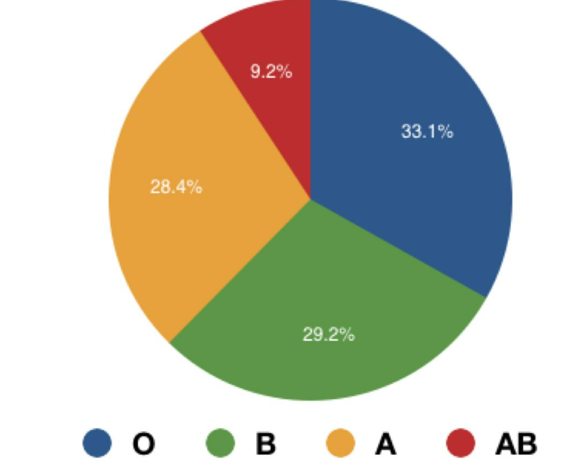
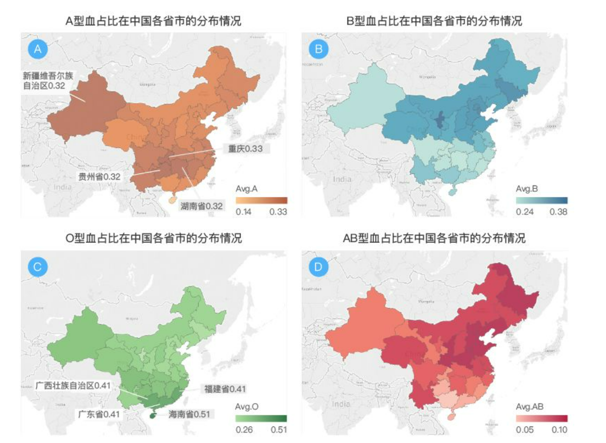
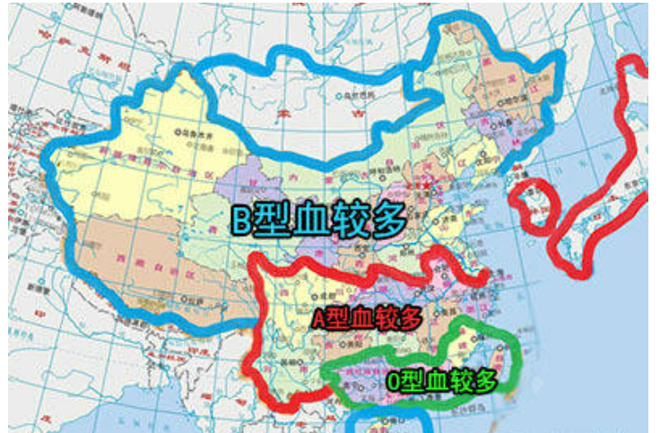
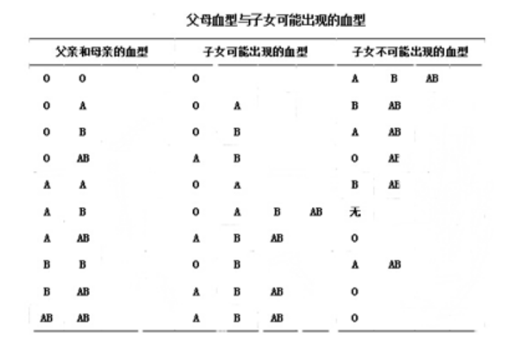
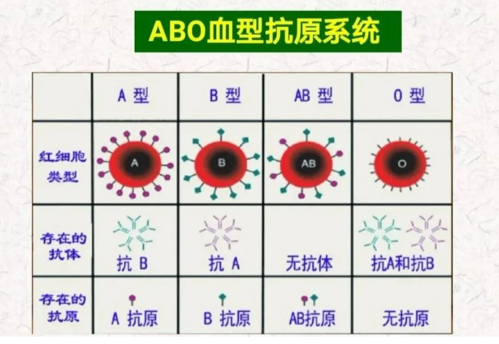
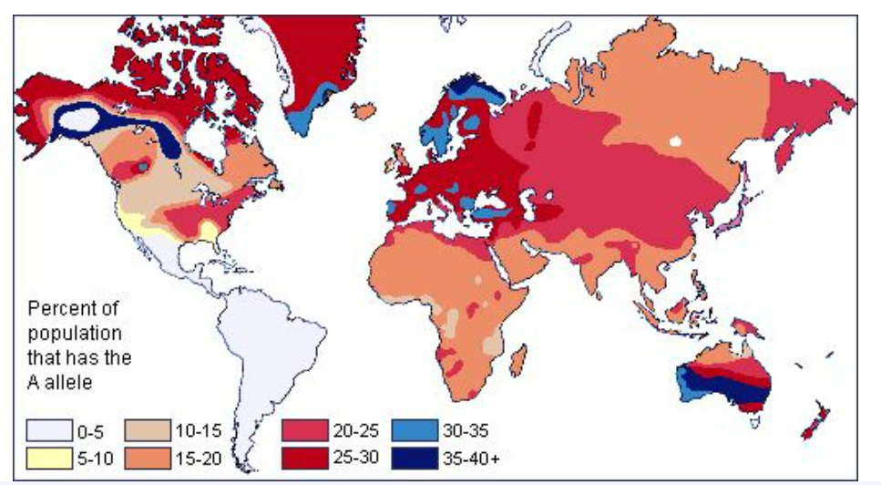
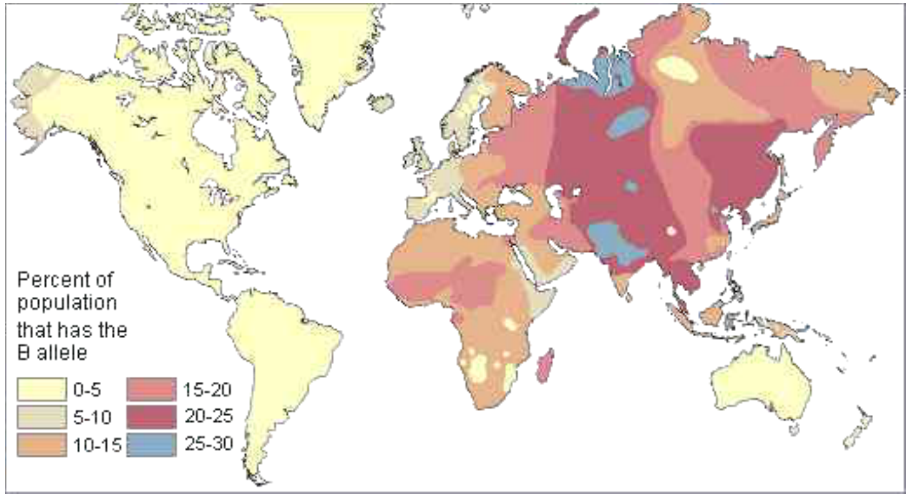

# 中国血型地理分布

血型分A、B、AB、O四种已经是尽人皆知的了。中国人口14亿，平均一种血型有3亿多人，这是一个恐怖的数字，那么，血型到底是不是一种种族的集体特征呢？

根据科学研究和考古发现，从血型上看还是可以推断出古代的祖先的。以汉族为例，目前四种血型的人数占比分别是O型：34.11%，B型：28.98%，A型：28.29%， AB型8.69%。同时研究发现中国人的血型是与原始渊源结合在一起的。

ABO血型分布，呈现出明显的南北差异按照祖籍对用户进行筛选，港澳台地区及西藏地区因为目前数量较少，因此暂不纳入分析。

**有学者分析认为：O型血大约出现于公元前6万至4万年间。是人类学上一种异常古老的血型，叫做佃猎血型；A型血原来是农耕民族菜食主义者的血型，它出现在公元前2.5万年至1.5万年间；B型血的出现相对较晚，它出现在约公元前1.5万年至新纪元之间。这类人是最早习惯气候变化和其他变迁的游牧平易近族，我们称之为游牧血型；而AB型血最晚出现，也是最稀少的血型，占总人口不到5%，而这类人也拥有部分A型血和部分B型血的特点。**

**由于人种的不断迁徙，所以在不同的地区和人群中，血型的分布是不同的。根据相关资料统计显示，在亚洲地区，B型血是占绝大多数的。**

**那么你们知道吗？在中国，由北向西南方向，B型血的数量逐渐减少，而O型血在逐渐增加，在云贵川和长江中下游地区A型血数量相对较多，而两广、福建和台湾地区O型血的人就比其它地区多。**

**在古中国北方长城的两边，匈奴、突厥、鲜卑等古老游牧民族，以肉食为主，B型血占了大多数。现在蒙古、满族中B型血占40~60% 。**

**A型血最多的是华中四省：湖南省、江西省、湖北省、安徽省，青藏（青海省和西藏民族自治区）和海南省最少。**

**在长江流域，AB型血是相对常见的，但数量还是很少，它是B型血人南下跟A型血人繁衍而成的。

**

**在两广、川藏和海南省中O型血占主要地位，其次是东南地区，随之向北方递减。**

**在整个汉族中：**

**B型血是古代游牧民族与汉族相融合而造成的；**

**A型血主要分布在南方，是由楚苗南蛮等古老民族融入华夏集团演变而来的；**

**AB型血是B型血人南下跟A型血人融合而成的；**

**O型血是来源于黄帝集团和东夷集团的。**

## 血型与疾病

血型与免疫系统发生交互作用，进而影响人们患上常见疾病的概率。血型不同的人，患上心脏病、癌症等疾病的风险也各异。

**血型是指血液成分（包括红细胞、白细胞、血小板）表面的抗原类型。**

通常所说的血型是指红细胞血型系统，即红细胞膜上特异性抗原类型。根据国际输血协会（ISBT）的认定，目前共发现30种主要的血型系统，人们所熟知的是ABO血型系统。ABO血型系统是1900年由Landsteiner发现的人类第一个血型系统，与临床关系最为密切。

ABO血型是根据红细胞膜上是否存在抗原A与抗原B而将血液分成4种血型。

红细胞上仅有抗原A为A型，只有抗原B为B型，若同时存在A和B抗原则为AB型，这两种抗原俱无的为O型。**我国各族人民中A型、B型及O型血各占约30%，AB型仅占10%左右。**

**血型的遗传规律有哪些？**

父母双亲的血型可以遗传给子女，并且是按照一定的遗传原则进行的。

决定子女ABO血型的关键则在于父母双方血型所携带的基因是显性基因还是隐性基因。

**血型是否能控制患病率的高低？**

血型不同的人，患心脏病、癌症等疾病的风险也各异。血型主要分为4大种：A型、B型、O型、AB型。那么，不同的血型隐藏了哪些健康隐患呢？

### **O型血**

O型血除了是“万能血”，还被称为“健康性能”之王。

**健康优势**

- 男性罹患阳痿的机率比其他血型低四倍；
- **比较不容易罹患阿兹海默症（老年痴呆）**，英国大学扫描调查了189人的脑部，发现O型血人的大脑灰白质比较多。灰白质多的人年老之后比较不易得老年痴呆症；
- **不易发生脑栓。**O型血罹患血栓的风险也比其他血型少了30%；
- **对抵御疟疾和某些癌症有优势。**各国研究机构也发现了O型血对于疟疾、胃癌或肝癌的耐性比较强，就算得病了也较能抵抗。

- **免疫功能和抵抗力强。**O型血的人具有很强的自身免疫功能和抵抗力，能够很好地保护身体不受各种疾病和病毒的侵袭。一项调查结果显示，O型血**平均寿命明显较长。**

**易患疾病**

**1、消化道溃疡**

O型血的人体内的胃酸含量较高，易患消化道溃疡，如：胃酸、胃溃疡。

建议：平时可适当食用馒头、苏打饼干等碱性食品，中和胃酸，防止溃疡。

**2、凝血功能差**

O型血人群，血液比较稀，不利于血液的凝固，所以，甲状腺功能不稳定。

**3、易过敏**

人体免疫亢奋，有助于抵御外在病毒，敏感度增强，易导致花粉、粉尘等环境因素引起的过敏及食物过敏。

建议：远离过敏源，饮食上，远离慢性食物过敏源，如：牛奶、鸡蛋等，但过敏源，具体因人而异。

**4、怀孕概率低**

据研究发现：O型血女性的卵子数量少和质量低的概率是A型血女性的两倍。研究人员说，这意味着，她们怀孕的概率更低。另一项独立的研究表明，正是这个决定O型血的遗传基因导致了卵子的提前耗尽。

**5、易感染人群**

大量研究表明，感染霍乱后，O型血的人相对于非O型血的群体，更可能发展为严重感染。

**6、其他疾病**

**O型容易生病，但寿命长。**最易患乙型肝炎，且病情较重。易患前列腺癌、膀胱癌、妊娠中毒症和新生儿溶血病，最少患心血管疾病。

### **A型血**

**健康优势**

- A型血的人忍耐能力很强，平时不会经常受到疾病困扰，**亚健康几率也会降低。**
- **A型血的人体重最不易变化。**因为A型血的人相比于其他血型对照组的人，胃酸分泌量较少。即使是肥胖，多数A型血的人也属于敦实的“肌肉类肥胖”，而不是我们常说的“虚胖”。

**易患疾病**

**1、便秘**

A型血的人消化系统功能不强，胃酸含量低，比较缺少消化酶。

建议：少吃油炸、腌制等食物，少饮酒，适量多食用香油、富含纤维素的食物以缓解便秘。

**2、血液循环较差**

胃酸不足，会引发消化不良，营养吸收差，导致血液循环差、易患贫血等疾病。

建议：血液循环差引起的手脚冰冷，平时应多参与运动，适当多吃活血的食物及辛香料。贫血疾病患者，可多吃补血气食物。

**3、脑梗塞**

血液黏稠度在各种血型中，最容易升高，易患心脑血管疾病。此外，A型血的人较易患中风、癌症等多种致命性疾病。

建议：冬季注意保暖。在环境气温低于10℃时，末梢小血管才开始收缩，而A型血的人在气温12℃时，末梢小血管就开始收缩。

**4、偏头痛**

血小板黏附率明显高出正常对照组。

**5、心理障碍**

心脏疾病不仅是器质性问题，还可能是假性心脏病，也会表现出心血管疾病的典型症状，如：胸痛、憋气等，但检查不出任何的阳性体质，属于心理障碍。

### **B型血**

**健康优势**

消化吸收功能强：B型血的人与其他血型的人相比，消化道的吸收功能较强。各种有益的营养物质差不多都能消化和吸收，新陈代谢的速度很快，效率也很高。

**易患疾病**

**1、易患结核、器官排异几率大**

在疾病方面，B型血患结核病的比例普遍高于其他血型的人，除此之外，龋齿、口腔癌、乳腺癌和白血病的比例也普遍高于其他血型的人。

B型血的人器官移植的排异率比其他血型的人高2倍，与排异疾病相关的死亡率高达28%，为A型血者的2倍、O型血者的4倍。

**2、易患胰腺疾病**

B型血人群患胰腺癌几率大于其他血型；暴饮暴食及过量饮酒，都可能导致胰腺炎，甚至诱发胰腺癌。

**3、炎症性疾病**

B型血人群相对来说较喜欢高蛋白饮食，人体摄入过多的高蛋白质食品，易造成蛋白质堆积，可能引发炎症，如：中耳炎等。

建议：适当减少高蛋白食物的摄入，多吃富含维生素A、C、E的蔬果，有益于消炎，减轻症状。

**4、心血管疾病**

高脂肪、高蛋白的饮食，可引起胆固醇堆积，引发心血管疾病。

### **AB型血**

**健康优势**

- AB型血是地球上最晚出现的血型，但人数在不断增加着，由此可见AB型血的人适应能力很强。
- 而且，它同时含有A型和B型两种抗原，在某种程度上讲，拥有A型血和B型血的双重优点。

**易患疾病**

**1、患精神分类几率高**

AB型的朋友患精神分裂症几率比其他血型高出3倍多，且有明显的遗传倾向，在缺血性心脏病病人中，也以AB型者居多。但AB型者患结核病、妊娠贫血的比率，则比其他血型的人低很多。

建议：学会控制自己的情绪，调整认识，积极建立人际关系。

**2、冠心病**

AB型血的人遭受癌症及中风侵袭的可能性虽然小，但患冠心病的机率较高，而且一旦心脏受害，症状多较重，发生心肌梗塞的比例也明显较高。

**3、宫颈癌**

AB型血的女性较易患宫颈癌。

**4、消化不良**

胃酸的含量比较低，影响对营养物质的消化吸收。

**5、呼吸系统疾病**

外界环境中的细菌易随吸气进入呼吸道及肺部。

### 附加

1记忆问题

发表在《神经病学期刊》上的研究成果显示：AB型的人患上认知功能障碍的风险会增高。他们更有可能存在学习和记忆问题。

美国佛蒙特大学医学和病理学教授玛丽•库什曼是该项研究的作者之一，她说：“这是因为，AB型血与某些凝血因子的含量和血液中的蛋白质之间存在关联。”

2胃癌

发表在《美国流行病学杂志》上的一项研究成果显示：AB型血和A型血的人患上胃癌的风险更高，AB型和A型血的人比B型和O型血的人患胃癌风险分别高出约26%和20%。罪魁祸首可能就是“幽门螺杆菌”。

研究作者之一瑞典卡罗林斯卡大学医学院的古斯塔夫•艾奇根博士认为：尽管世界上有约2/3的人肠道内存在幽门螺杆菌，但AB和A型血人强烈的免疫系统反应，增加了患癌风险细菌的产生。

3溃疡

研究发现：O型血的人易患上溃疡，主要也是由“幽门螺杆菌”导致。

4胰腺癌

发表在《美国国家癌症研究所期刊》上的一项研究表明：O型血的人患上胰腺癌的可能性要比其他血型的人低37%。

5心脏病

哈佛大学公共卫生学院的研究者发现：O型血的人患心脏病风险比其他血型低23%，而AB和B型血的人患上心脏病的风险较高。该研究的作者认为某些血型与影响心脏健康的炎症发病率较高之间存在关联。

虽然血型会对疾病风险产生影响，但库什曼认为：保持健康的生活方式，积极锻炼才最重要。

# 世界血型地理分布

**世界部分国家人口血型分布结构表**

说明：由于整个社会对血型心理重要性还缺乏认识，加上统计上的实际困难，所以目前还没有机构发布比较权威的资料。下面搜集到的数据仅供血型心理国民性研究时参考。

| **地****域**   | **不同血型人所占的比例（%）** | **国民性**   |               |      |             |
| -------------- | ----------------------------- | ------------ | ------------- | ---- | ----------- |
| **O** **型**   | **A** **型**                  | **B** **型** | **AB** **型** |      |             |
| 亚洲           | 29                            | 26           | 35            | 10   | B型         |
| 西欧与美洲白人 | 46                            | 43           | 8             | 3    | O型         |
| 非洲           | 43                            | 27           | 25            | 5    | O型         |
| 大洋洲         | 48                            | 39           | 10            | 3    | O型         |
| 中国           | 27                            | 27           | 34            | 12   | B型（偏AB） |
| 印度           | 31                            | 21           | 40            | 8    | B型         |
| 日本           | 30                            | 39           | 22            | 9    | A型         |
| 朝鲜与韩国     | 26                            | 37           | 28            | 9    | A型（偏B）  |
| 泰国           | 37                            | 22           | 33            | 8    | O型（偏B）  |
| 阿富汗         | 49                            | 18           | 29            | 4    | O型         |
| 越南           | 43                            | 22           | 30            | 5    | O型         |
| 缅甸           | 35                            | 25           | 32            | 8    | O型（偏B）  |
| 巴基斯坦       | 34                            | 25           | 31            | 10   | O型（偏B）  |
| 伊朗           | 36                            | 28           | 28            | 8    | O型         |
| 以色列         | 36                            | 41           | 17            | 6    | A型         |
| 科威特         | 47                            | 24           | 24            | 5    | O型         |
| 印度尼西亚     | 40                            | 27           | 26            | 7    | O型         |
| 菲律宾         | 45                            | 22           | 27            | 6    | O型         |
| 伊拉克         | 37                            | 30           | 26            | 7    | O型（偏A）  |
| 摩洛哥         | 42                            | 29           | 23            | 7    | O型         |
| 沙特阿拉伯     | 34                            | 31           | 29            | 6    | O型（偏A）  |
| 尼泊尔         | 30                            | 37           | 24            | 9    | A型         |
| 土耳其         | 32                            | 43           | 18            | 7    | A型         |
| 黎巴嫩         | 36                            | 47           | 12            | 5    | A型         |
| 俄罗斯         | 33                            | 36           | 23            | 8    | A型（偏O）  |
| 乌克兰         | 37                            | 40           | 18            | 5    | A型（偏O）  |
| 格鲁吉亚       | 45                            | 37           | 12            | 6    | O型         |
| 爱沙尼亚       | 34                            | 36           | 22            | 8    | A型（偏O）  |
| 捷克与斯洛伐克 | 34                            | 38           | 19            | 9    | A型（偏O）  |
| 波兰           | 33                            | 39           | 19            | 9    | A型（偏O）  |
| 匈牙利         | 30                            | 42           | 19            | 9    | A型         |
| 罗马尼亚       | 26                            | 47           | 19            | 8    | A型         |
| 芬兰           | 31                            | 46           | 17            | 6    | A型         |
| 希腊           | 43                            | 39           | 13            | 5    | O型（偏A）  |
| 保加利亚       | 32                            | 45           | 15            | 8    | A型         |
| 英国（苏格兰） | 52                            | 34           | 11            | 3    | O型         |
| 英国（英格兰） | 47                            | 42           | 8             | 3    | O型（偏A）  |
| 意大利         | 44                            | 39           | 12            | 5    | O型（偏A）  |
| 奥地利         | 39                            | 44           | 13            | 4    | A型（偏O）  |
| 丹麦           | 41                            | 45           | 11            | 3    | A型（偏O）  |
| 德国           | 41                            | 45           | 10            | 4    | A型（偏O）  |
| 荷兰           | 45                            | 43           | 9             | 3    | O型（偏A）  |
| 比利时         | 46                            | 43           | 8             | 3    | O型（偏A）  |
| 挪威           | 38                            | 50           | 9             | 3    | A型         |
| 葡萄牙         | 41                            | 48           | 8             | 3    | A型（偏O）  |
| 法国           | 43                            | 47           | 7             | 3    | A型（偏O）  |
| 西班牙         | 44                            | 46           | 7             | 3    | A型（偏O）  |
| 瑞典           | 44                            | 46           | 7             | 3    | A型（偏O）  |
| 瑞士           | 40                            | 50           | 7             | 3    | A型         |
| 美国           | 49                            | 38           | 10            | 3    | O型         |
| 巴西           | 47                            | 40           | 10            | 3    | O型         |
| 阿根廷         | 47                            | 40           | 10            | 3    | O型         |
| 哥伦比亚       | 61                            | 27           | 10            | 2    | O型         |
| 埃及           | 33                            | 36           | 24            | 7    | A型（偏O）  |
| 埃塞俄比亚     | 43                            | 27           | 25            | 5    | O型         |
| 澳大利亚       | 48                            | 39           | 10            | 3    | O型         |

 世界血型分布图（附部分国家人口血型结构表）

血型是如何分类的？看下表

　　在人类学上，根据A型、B型及AB型三型的出现率的多少组成种族生化指数来研究各种血型在各人种中的分布规律。O型的高频率分布在欧洲西北部、西南非、部分澳大利亚及南印度和中美洲和美洲土著民族中；B型的最高频率分佈於中亚及北印度；A型在欧洲、西亚及澳大利亚南部的土著中的是最高的，而在某些美洲印第安人部族中是最高的。

世界各地区A型血等位基因的分布图

　　

世界各地区B型血等位基因的分布图

　　

世界各地区O型血等位基因的分布图

　　由上图可知，就全世界范围来说，有O型血的人最多，约占总人口46％。不过，黄色人种为O型血比例最小，日本只占30.1％中国为34.4％；白色人种的英国则占47.9％；西非的黑色人种高达52.3％，澳大利亚东部的棕色人最高，为58.6％。

' fill='%23FFFFFF'%3E%3Crect x='249' y='126' width='1' height='1'%3E%3C/rect%3E%3C/g%3E%3C/g%3E%3C/svg%3E)

中国人口的血型分布——数据来自维基百科

　　B等位基因分布最多的地方是在亚洲中部，其次是非洲，美洲和澳大利亚则相对地少，在世界上，B等位基因是ABO血型等位基因中最少的，只有16%的人口。A等位基因则较B等位基因多些，占世界总人口约21%，他们分布的地方比较散，例如蒙大拿州印第安人的黑脚族（30－35%），澳洲原住民（许多群族40－53%），斯堪的纳维亚地区北部的拉普人，或者萨米人（50－90%），中南美洲的印第安人里则几乎没有A等位基因。至于O血型则是世界上最常见的，约占63%的人口，他们主要集中在中南美洲，那里接近100%的人是O血型，其次是澳洲原住民和西欧地区（尤其是凯尔特人），东欧和亚洲中部则较少。

　　欧洲除东欧以AB为主，北欧部分Ｏ型外，大体是Ａ型。美国自然Ａ占主导。日本本岛基本都是Ａ为主。人类学发现：以Ａ型占主导的地区，基本都是世界或者地区中占主导的人群。以古文明为例，四大文明古国除了中国都是Ａ型主导地区。

　　了解各民族、各地域的ABO血型分布规律，有助於人类学研究各民族的来源和相互关係。

' fill='%23FFFFFF'%3E%3Crect x='249' y='126' width='1' height='1'%3E%3C/rect%3E%3C/g%3E%3C/g%3E%3C/svg%3E)

日本人口的血型分布

基本上，O型是世界上最常见的血型。但在某些地方，如挪威、日本，A型血型的人较多。

[中国人血型的地理分布](http://mp.weixin.qq.com/s?__biz=MzI5NDQxNzM5Mw==&mid=2247599864&idx=1&sn=2ae9138ce7a802511da86902ff89533d&chksm=ec602066db17a9704c93b9bb69bc0ee3c32048a8262d807e19bf6547e15d422476aaf350b560&scene=21#wechat_redirect)

' fill='%23FFFFFF'%3E%3Crect x='249' y='126' width='1' height='1'%3E%3C/rect%3E%3C/g%3E%3C/g%3E%3C/svg%3E)' fill='%23FFFFFF'%3E%3Crect x='249' y='126' width='1' height='1'%3E%3C/rect%3E%3C/g%3E%3C/g%3E%3C/svg%3E)

 

| **地****域**   | **不同血型人所占的比例（%）** | **国民性**   |               |      |             |
| -------------- | ----------------------------- | ------------ | ------------- | ---- | ----------- |
| **O** **型**   | **A** **型**                  | **B** **型** | **AB** **型** |      |             |
| 亚洲           | 29                            | 26           | 35            | 10   | B型         |
| 西欧与美洲白人 | 46                            | 43           | 8             | 3    | O型         |
| 非洲           | 43                            | 27           | 25            | 5    | O型         |
| 大洋洲         | 48                            | 39           | 10            | 3    | O型         |
| 中国           | 27                            | 27           | 34            | 12   | B型（偏AB） |
| 印度           | 31                            | 21           | 40            | 8    | B型         |
| 日本           | 30                            | 39           | 22            | 9    | A型         |
| 朝鲜与韩国     | 26                            | 37           | 28            | 9    | A型（偏B）  |
| 泰国           | 37                            | 22           | 33            | 8    | O型（偏B）  |
| 阿富汗         | 49                            | 18           | 29            | 4    | O型         |
| 越南           | 43                            | 22           | 30            | 5    | O型         |
| 缅甸           | 35                            | 25           | 32            | 8    | O型（偏B）  |
| 巴基斯坦       | 34                            | 25           | 31            | 10   | O型（偏B）  |
| 伊朗           | 36                            | 28           | 28            | 8    | O型         |
| 以色列         | 36                            | 41           | 17            | 6    | A型         |
| 科威特         | 47                            | 24           | 24            | 5    | O型         |
| 印度尼西亚     | 40                            | 27           | 26            | 7    | O型         |
| 菲律宾         | 45                            | 22           | 27            | 6    | O型         |
| 伊拉克         | 37                            | 30           | 26            | 7    | O型（偏A）  |
| 摩洛哥         | 42                            | 29           | 23            | 7    | O型         |
| 沙特阿拉伯     | 34                            | 31           | 29            | 6    | O型（偏A）  |
| 尼泊尔         | 30                            | 37           | 24            | 9    | A型         |
| 土耳其         | 32                            | 43           | 18            | 7    | A型         |
| 黎巴嫩         | 36                            | 47           | 12            | 5    | A型         |
| 俄罗斯         | 33                            | 36           | 23            | 8    | A型（偏O）  |
| 乌克兰         | 37                            | 40           | 18            | 5    | A型（偏O）  |
| 格鲁吉亚       | 45                            | 37           | 12            | 6    | O型         |
| 爱沙尼亚       | 34                            | 36           | 22            | 8    | A型（偏O）  |
| 捷克与斯洛伐克 | 34                            | 38           | 19            | 9    | A型（偏O）  |
| 波兰           | 33                            | 39           | 19            | 9    | A型（偏O）  |
| 匈牙利         | 30                            | 42           | 19            | 9    | A型         |
| 罗马尼亚       | 26                            | 47           | 19            | 8    | A型         |
| 芬兰           | 31                            | 46           | 17            | 6    | A型         |
| 希腊           | 43                            | 39           | 13            | 5    | O型（偏A）  |
| 保加利亚       | 32                            | 45           | 15            | 8    | A型         |
| 英国（苏格兰） | 52                            | 34           | 11            | 3    | O型         |
| 英国（英格兰） | 47                            | 42           | 8             | 3    | O型（偏A）  |
| 意大利         | 44                            | 39           | 12            | 5    | O型（偏A）  |
| 奥地利         | 39                            | 44           | 13            | 4    | A型（偏O）  |
| 丹麦           | 41                            | 45           | 11            | 3    | A型（偏O）  |
| 德国           | 41                            | 45           | 10            | 4    | A型（偏O）  |
| 荷兰           | 45                            | 43           | 9             | 3    | O型（偏A）  |
| 比利时         | 46                            | 43           | 8             | 3    | O型（偏A）  |
| 挪威           | 38                            | 50           | 9             | 3    | A型         |
| 葡萄牙         | 41                            | 48           | 8             | 3    | A型（偏O）  |
| 法国           | 43                            | 47           | 7             | 3    | A型（偏O）  |
| 西班牙         | 44                            | 46           | 7             | 3    | A型（偏O）  |
| 瑞典           | 44                            | 46           | 7             | 3    | A型（偏O）  |
| 瑞士           | 40                            | 50           | 7             | 3    | A型         |
| 美国           | 49                            | 38           | 10            | 3    | O型         |
| 巴西           | 47                            | 40           | 10            | 3    | O型         |
| 阿根廷         | 47                            | 40           | 10            | 3    | O型         |
| 哥伦比亚       | 61                            | 27           | 10            | 2    | O型         |
| 埃及           | 33                            | 36           | 24            | 7    | A型（偏O）  |
| 埃塞俄比亚     | 43                            | 27           | 25            | 5    | O型         |
| 澳大利亚       | 48                            | 39           | 10            | 3    | O型         |

说明：由于整个社会对血型心理重要性还缺乏认识，加上统计上的实际困难，所以目前还没有机构发布比较权威的资料。下面搜集到的数据仅供血型心理国民性研究时参考。

