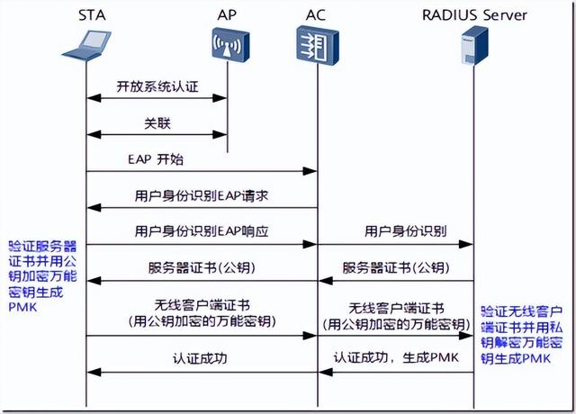
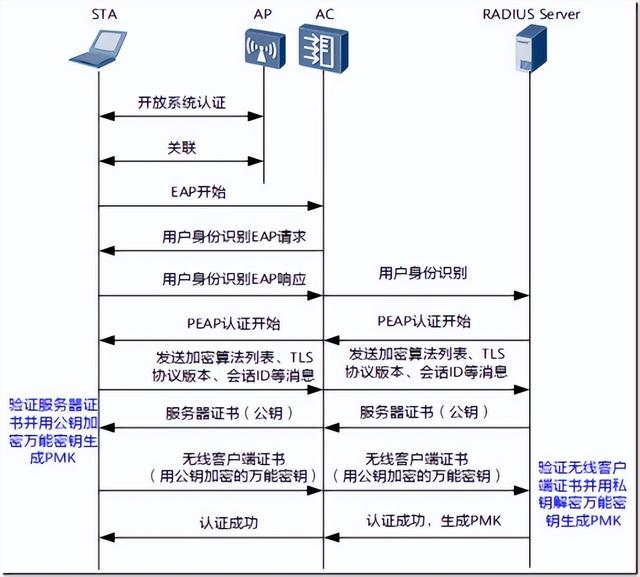
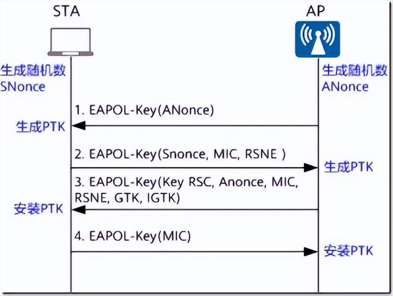
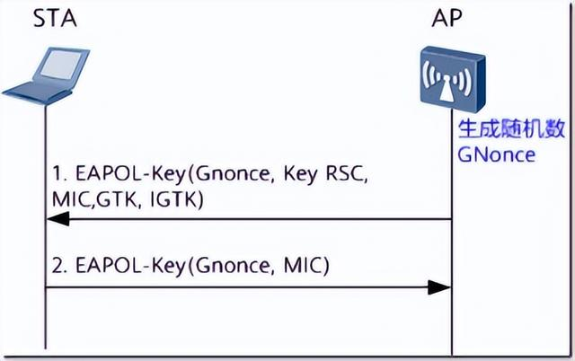
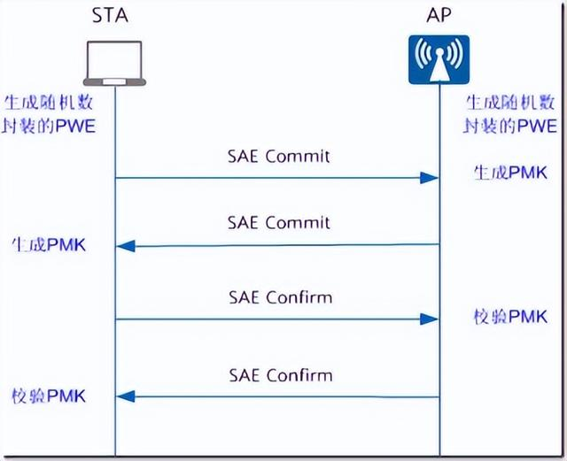
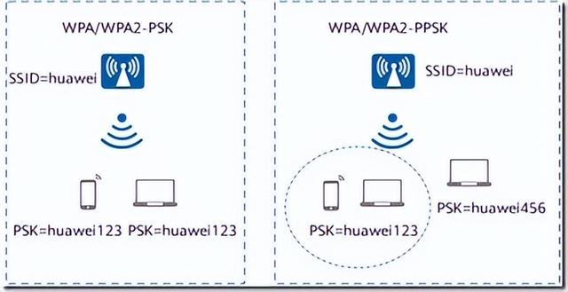
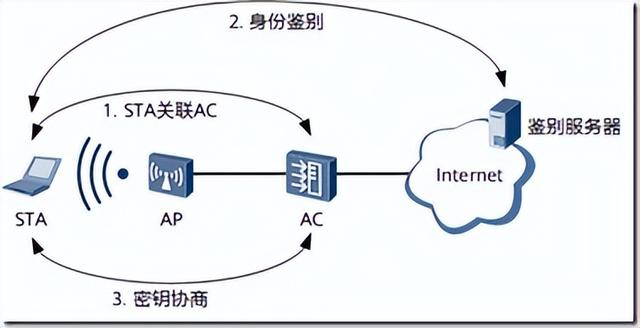
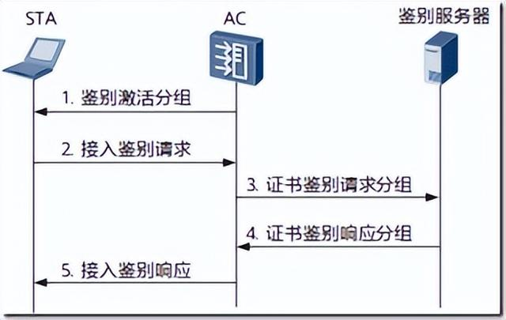
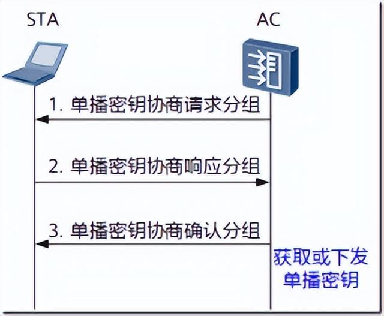
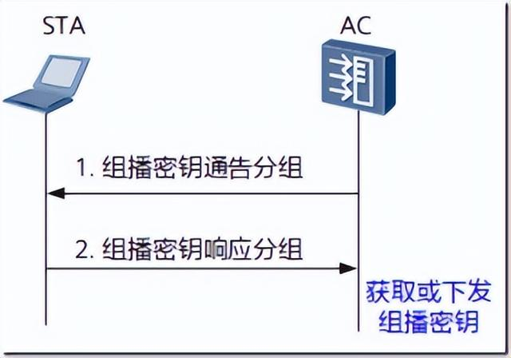

[无线局域网](https://so.csdn.net/so/search?q=无线局域网&spm=1001.2101.3001.7020)的安全机制为认证和加密。认证的目的是为了授权基站使用网络并向基站保证它连接的是一个合法的网络，加密的目的是为了保障消息的完整性和保密性，下表对两类标准重要版本的加密和认证方式做了一个简要的概括。

| 协议 | 加密              | 认证               | 密钥长度          | 时间 |
| ---- | ----------------- | ------------------ | ----------------- | ---- |
| WEP  | RC4               | OSA/SKA            | 64bits/128bits    | 1999 |
| WPA  | RC4-TKIP          | PSK/802.1x-EAP     | 128 bits          | 2003 |
| WPA2 | AES-CCMP          | PSK/802.1x-EAP     | 128 bits          | 2004 |
| WPA3 | AES-CCMP/AES-GCMP | SAE/802.1x-EAP     | 128 bits/256 bits | 2018 |
| WAPI | SM4               | WAPI-CERT/WAPI-PSK | 128bits           | 2003 |

## **WEP**

有线等效加密WEP（Wired Equivalent Privacy）协议是由802.11标准定义的，用来保护无线局域网中的授权用户所传输的数据的安全，防止这些数据被窃听。WEP的核心是采用RC4算法，加密密钥长度有64位、128位和152位，其中有24bit的IV（初始向量）是由系统产生的，所以WLAN服务端和WLAN客户端上配置的密钥长度是40位、104位或128位。WEP加密采用静态的密钥，接入同一SSID下的所有STA使用相同的密钥访问无线网络。

**WEP安全策略**

WEP安全策略包括了**链路认证机制和数据加密机制**。

**链路认证**分为**开放系统认证和共享密钥认证**。详细的内容请参见STA接入过程中的”链路认证阶段“。

如果选择开放系统认证方式，链路认证过程不需要WEP加密。用户上线后，可以通过配置选择是否对业务数据进行WEP加密。

如果选择共享密钥认证方式，链路认证过程中完成了密钥协商。用户上线后，通过协商出来的密钥对业务数据进行WEP加密。

**WEP加密**使用**静态的共享密钥**，不同的用户都采用相同的WEP密钥加密，安全性很低。在802.11i标准推出前，无线加密没有统一的标准，厂商对WEP加密进行了增强，结合802.1X接入认证，产生了**动态WEP加密**，动态WEP加密的40位、104位或128位的密钥由802.1X接入认证的认证服务器动态生成下发，可以实现对不同的用户采用不同的WEP密钥进行加密。

动态WEP的链路认证阶段仅支持开放系统认证，用户上线后，使用服务器动态生成下发的密钥对业务数据进行WEP加密。

## **WPA/WPA2**

由于WEP共享密钥认证采用的是基于RC4对称流的加密算法，需要预先配置相同的静态密钥，无论从加密机制还是从加密算法本身，都很容易受到安全威胁。为了解决这个问题，在802.11i标准没有正式推出安全性更高的安全策略之前，Wi-Fi联盟推出了针对WEP改良的WPA。**WPA的核心加密算法**还是采用RC4，在WEP基础上提出了**临时密钥完整性协议TKIP**（Temporal Key Integrity Protocol）加密算法，采用了802.1X的身份验证框架，支持EAP-PEAP、EAP-TLS等认证方式。随后802.11i安全标准组织又推出WPA2，区别于WPA，**WPA2**采用安全性更高的**区块密码锁链-信息真实性检查码协议CCMP**（Counter Mode with CBC-MAC Protocol）加密算法。

为了实现更好的兼容性，在目前的实现中，WPA和WPA2都可以使用802.1X的接入认证、TKIP或CCMP的加密算法，他们之间的不同主要表现在协议报文格式上。

综上所述，WPA/WPA2安全策略涉及了链路认证阶段、接入认证阶段、密钥协商和数据加密阶段。

**链路认证阶段**

链路认证分为开放式系统认证和共享式密钥认证，详细内容请参见STA接入过程中的“链路认证阶段”。

WPA/WPA2仅支持开放式系统认证。

**接入认证阶段**

WPA/WPA2分为企业版和个人版：

WPA/WPA2企业版：采用WPA/WPA2-802.1X的接入认证方式，使用RADIUS服务器和可扩展认证协议EAP（Extensible Authentication Protocol）进行认证。用户提供认证所需的凭证，如用户名和密码，通过特定的用户认证服务器（一般是RADIUS服务器）来实现对用户的接入认证。在大型企业网络中，通常采用WPA/WPA2企业版的认证方式。

WPA/WPA2支持基于EAP-TLS和EAP-PEAP的802.1X认证方式，其认证流程如图

基于EAP–TLS的802.1X认证流程图

基于EAP-PEAP的802.1X认证流程图

WPA/WPA2个人版：对一些中小型的企业网络或者家庭用户，部署一台专用的认证服务器代价过于昂贵，维护也很复杂，因此，WPA/WPA2提供了一种简化的模式，即WPA/WPA2预共享密钥（WPA/WPA2-PSK）模式，它**不需要专门的认证服务器**，仅要求在每个WLAN节点（WLAN服务端、无线路由器、网卡等）预先输入一个预共享密钥即可。只要密钥吻合，客户就可以获得WLAN的访问权。由于这个密钥仅仅用于认证过程，而不用于加密过程，因此不会导致诸如使用WEP密钥来进行802.11共享认证那样严重的安全问题。

802.1X认证可以支持对有线用户和无线用户进行身份认证，而PSK认证则是专门针对无线用户的认证方法。

PSK认证需要事先在STA和AC端配置相同的预共享密钥，然后通过是否能够对协商的消息成功解密，来确定STA配置的预共享密钥是否和AC配置的预共享密钥相同，从而完成STA和AC的互相认证。如果密钥协商成功，表明PSK接入认证成功；如果密钥协商失败，表明PSK接入认证失败。

**密钥协商阶段**

在802.11i里定义了**两种密钥层次模型**，分别是：

一种是成对密钥层次结构，主要用来保护STA与AP之间往来的数据；

一种是群组密钥层次结构，主要用来描述STA与AP之间的广播或组播数据。

密钥协商阶段是根据接入认证生成的成对主钥PMK（Pairwise Master Key）产生成对临时密钥PTK（Pairwise Transient Key）和群组临时密钥GTK（Group Temporal Key）。PTK用来加密单播报文，GTK用来加密组播和广播无线报文。

针对802.1X接入认证，生成PMK的流程图如图1所示。

针对PSK认证，根据设置预共享密钥的方式不同（通过命令行可以选择设置预共享密钥的方式），生成的PMK方式也不同：

如果设置的预共享密钥是十六进制，则预共享密钥即是PMK；

如果设置的预共享密钥是字符串，则PMK是利用预共享密钥和SSID通过哈希算法计算出来的。

**密钥协商**包括单播密钥协商和组播密钥协商过程。

**单播密钥协商过程**

密钥协商过程也叫做四次握手过程，是通过EAPOL-Key报文进行信息交互的，如图3所示。

​                   单播密钥协商流程图

AP发送EAPOL-Key帧给STA，帧中包含随机数ANonce。

STA根据STA与AP的MAC地址、PMK、ANonce和SNonce计算出PTK，STA发送EAPOL-Key帧给AP，帧中包含SNonce、RSN信息元素和EAPOL-Key帧的消息完整码MIC（Message Integrity Code）。AP根据PMK、ANonce、SNonce、AP的MAC地址、STA的MAC地址计算出PTK，并校验MIC，核实STA的PMK是否和自己的一致。

AP发送EAPOL-Key帧给STA，并通知STA安装密钥，帧中包含Anonce、RSN信息元素、帧MIC、加密过的GTK。

STA发送EAPOL-Key帧给AP，并通知AP已经安装并准备开始使用加密密钥。AP收到后安装加密密钥。

**组播密钥协商过程**

组播密钥协商过程也叫做二次握手过程，此过程是在四次握手产生PTK并安装密钥后开始进行的，如图

组播密钥协商流程图

AP计算出GTK，用单播密钥加密GTK，发送EAPOL-Key帧给STA。

STA收到EAPOL-Key帧后，验证MIC，解密GTK，安装组播加密密钥GTK，并发送EAPOL-Key确认消息给AP。AP收到EAPOL-Key确认帧后，验证MIC，安装GTK。

**数据加密**

WPA/WPA2支持TKIP和CCMP两种加密算法。

**TKIP加密算法**

区别于WEP共用一个共享密钥，TKIP采用一套动态密钥协商和管理方法，每个无线用户都会动态地协商一套密钥，保证了每个用户使用独立的密钥。每个用户的密钥是由密钥协商阶段协商出来的PTK、发送方的MAC地址和报文序列号计算生成的，通过这种密钥混合的防护方式来防范针对WEP的攻击。TKIP采用信息完整性校验机制，一方面保证接收端接收报文的完整性；另一方面保证接收端和发送端数据的合法性。信息完整性校验码是通过密钥协商阶段协商出来的MIC Key、目的MAC地址、源MAC地址和数据包计算生成的。

**CCMP加密算法**

区别于WEP和TKIP采用的流密码机制，CCMP采用了以高级加密标准AES（Advanced Encryption Standard）的块密码为基础的安全协议。这种基于块密码的加密技术克服了RC4算法本身的缺陷，安全性更高。

## **WPA3**

WPA3是Wi-Fi联盟组织发布的新一代Wi-Fi加密协议，在WPA2的基础上增加了新的功能，以简化Wi-Fi安全保障方法、实现更可靠的身份验证，提高数据加密强度。所有的WPA3网络都必须进行管理帧保护PMF（Protected Management Frame），保证数据的安全性。

根据Wi-Fi网络的用途和安全需求的不同，WPA3又分为WPA3个人版、WPA3企业版，即WPA3-SAE和WPA3-802.1X。WPA3为不同网络提供了额外功能：WPA3个人版增强了对密码安全的保护，而WPA3企业版的用户可以选择更高级的安全协议，保护敏感数据。

### **WPA3个人版**

对比WPA2个人版，WPA3个人版能提供更可靠的基于密码的身份验证。这是由于WPA3个人版使用了更安全的协议——对等实体同时验证SAE（Simultaneous Authentication of Equals）。SAE取代了WPA2个人版的PSK认证方式，可以有效地抵御离线字典攻击，增加暴力破解的难度。SAE能够提供前向保密，即使攻击者知道了网络中的密码，也不能解密获取到的流量，大大提升了WPA3个人网络的安全。WPA3个人版只支持AES加密方式。

SAE在WPA/WPA2-PSK原有的四次握手前增加了SAE握手，实质上是为了动态协商成对主密钥PMK。WPA/WPA2-PSK的PMK只与SSID和预共享密钥有关，而SAE引入了动态随机变量，每次协商的PMK都是不同的，提升了安全性。SAE交互流程如图

SAE交互流程

SAE握手可以由任意一方发起，主要分两个阶段：

**交换密钥阶段 （SAE Commit）**

这个阶段的主要目的是生成四次握手的PMK，由认证的两个实体（AP和STA）各自发送一个包含了用随机数封装起来的PWE（password element of an ECC group）。PWE是由密码和协商对象的MAC衍生出来的密钥，最终通过运算得出PMK。Commit阶段结束后，两个认证实体都生成了PMK，但是并不知道两者的PMK是否一致。

**验证密钥阶段 （SAE Confirm）**

这个阶段的主要目的是校验两个实体是否拥有相同的PMK，通过使用PMK的一部分来对上一轮发送的Commit报文进行完整性校验。如果双方都可以校验通过，说明两端的PMK是一致的，可以进行四次握手过程。

SAE交互完成后生成PMK作为四次握手的输入，四次握手的过程与WPA2-PSK认证类似。

**SAE攻击防御**

由于SAE握手使用了大量的复杂算法，如果攻击者不停使用大量不同的MAC来发送SAE Commit报文，将会频繁触发SAE握手，耗费大量计算资源，从而达到拒绝服务攻击的目的。

针对这种方式的攻击，WPA3协议规定SAE交互报文的并发量达到阈值后，如果有新的SAE握手，则SAE Commit报文中必须携带token，token对于用户MAC唯一标示用户，如果不携带token则不能进行SAE交互，从而达到防止攻击的作用。

**终端闪断后快速重新连接**

WPA3个人版支持终端闪断后快速重新连接，掉线后重新连接的终端使用OPEN认证而不是进行SAE交互，在重关联请求报文中携带PMKID，AP对PMKID进行匹配校验，如果校验成功则可以直接使用之前的PMK进行四次握手协商，无需进行SAE协商，从而实现闪断后快速重新连接。

**过渡模式**

由于WPA2仍在广泛使用，为了能兼容暂时不支持WPA3的终端能接入WPA3网络，Wi-Fi联盟规定了WPA3个人版的过渡模式，即WPA3和WPA2在未来的一段时间里可以共存。过渡模式只支持AES加密方式，不支持TKIP加密方式。

WPA3过渡模式中，对于使用WPA2接入的用户，接入流程和WPA2-PSK认证一致，不强制使用PMF。使用WPA3接入的用户，接入流程使用WPA3-SAE认证流程，必须使用PMF。

### **WPA3企业版**

企业、政府和金融机构为了更高的安全性可以采用WPA3企业版。WPA3企业版基于WPA2企业版，提供一种可选模式——WPA3-Enterprise 192bit，该模式有以下优点：

数据保护：使用192位的Suite-B安全套件，增加密钥的长度。

密钥保护：使用HMAC-SHA-384在4次握手阶段导出密钥。

流量保护：使用伽罗瓦计数器模式协议GCMP-256（Galois Counter Mode Protocol）保护用户上线后的无线流量。

管理帧保护：使用GMAC-256（GCMP的伽罗瓦消息认证码，Galois Message Authentication Code）保护组播管理帧。

WPA2企业版支持多种EAP方式的身份验证，但是WPA3企业版仅支持EAP-TLS的方式。WPA3企业版支持的EAP密码套件有以下几种：

TLS_ECDHE_ECDSA_WITH_AES_256_GCM_SHA384

TLS_ECDHE_RSA_WITH_AES_256_GCM_SHA384

TLS_DHE_RSA_WITH_AES_256_GCM_SHA384

## **OWE认证**

针对于开放性Wi-Fi网络，WPA3也在OPEN认证的基础上做了升级，提出了OWE认证。OWE认证是基于机会性无线加密算法OWE（Opportunistic wireless encryption）的新一代开放网络认证方式，也叫做增强型开放网络认证（enhanced-open）。用户无需输入密码即可加入网络，设备使用AES加密算法对网络中的数据进行加密，保护用户设备与Wi-Fi网络之间的数据交换。

OWE认证过程与SAE认证过程相似，但是OWE省去了密码的维护，使用Diffie–Hellman协议进行密钥交换，生成用于后续四次握手过程的PMK。在确保开放性网络的便捷性的同时，OWE认证也保证了开放型网络的数据安全性。

**过渡模式**

由于部分终端不支持OWE认证，为了兼容此类终端，OWE还支持过渡模式，即不支持OWE认证的终端将以OPEN方式接入，支持OWE认证的终端将以OWE方式接入。OWE过渡模式认证仅支持AES加密方式。

## **PPSK**

常用的接入认证方式有WPA/WPA2-802.1X认证、WPA/WPA2-PSK认证和Portal认证，这些接入认证方式各有优缺点。WPA/WPA2-802.1X认证安全性较高，但部署较为复杂，且一些客户端不支持802.1X认证；WPA/WPA2-PSK认证，只需在每个WLAN节点预先输入一个预共享密钥，虽然部署简单，但对于连接到相同SSID的所有客户端，预共享密钥相同，可能会导致未授权的用户共享密钥；Portal认证相对于WPA/WPA2-PSK认证部署也较为复杂。

WPA/WPA2-PPSK（Private PSK）认证继承了WPA/WPA2-PSK认证的优点，部署简单，同时还可以实现对不同的客户端提供不同的预共享密钥，有效提升了网络的安全性。如图1所示，WPA/WPA2-PSK认证，对于连接到指定SSID的所有客户端，密钥将保持相同，从而可能存在安全风险。使用WPA/WPA2-PPSK认证，连接到同一SSID的每个用户都可以有不同的密钥，根据不同的用户可以下发不同的授权，并且如果一个用户拥有多个终端设备，这些终端设备也可以通过同一个PPSK账号连接到网络

PSK认证和PPSK认证对比图

WPA/WPA2-PPSK认证具有以下特点：

连接到同一SSID的每个用户都可以有不同的密钥。

配置和部署简单。

如果一个用户拥有多个终端设备，这些终端设备也可以通过同一个PPSK用户连接到网络。

PPSK用户绑定用户组或者授权VLAN，根据不同的PPSK用户可以下发不同的授权。

## **WAPI**

无线局域网鉴别与保密基础结构WAPI（WLAN Authentication and Privacy Infrastructure）是中国提出的、以802.11无线协议为基础的无线安全标准。WAPI能够提供比WEP和WPA更强的安全性，WAPI协议由以下两部分构成：

无线局域网鉴别基础结构WAI（WLAN Authentication Infrastructure）：用于无线局域网中身份鉴别和密钥管理的安全方案；

无线局域网保密基础结构WPI（WLAN Privacy Infrastructure）：用于无线局域网中数据传输保护的安全方案，包括数据加密、数据鉴别和重放保护等功能。

WAPI采用了基于公钥密码体制的椭圆曲线密码算法和对称密码体制的分组密码算法，分别用于无线设备的数字证书、证书鉴别、密钥协商和传输数据的加解密，从而实现设备的身份鉴别、链路验证、访问控制和用户信息的加密保护。

**WAPI的优势**

体现在以下几个方面：

**双向身份鉴别**

双向鉴别机制既可以防止非法的STA接入WLAN网络，同时也可以杜绝非法的WLAN设备伪装成合法的设备。

**数字证书身份凭证**

WAPI有独立的证书服务器，使用数字证书作为STA和WLAN设备的身份凭证，提升了安全性。对于STA申请或取消入网，管理员只需要颁发新的证书或取消当前证书。

**完善的鉴别协议**

在WAPI中使用数字证书作为用户身份凭证，在鉴别过程中采用椭圆曲线签名算法，并使用安全的消息杂凑算法保障消息的完整性，攻击者难以对进行鉴别的信息进行修改和伪造，所以安全等级高。

如图所示，WAPI安全策略涉及身份鉴别和密钥协商阶段，是在STA与AC建立关联以后开始进行的。

WAPI鉴别组网图

**身份鉴别阶段**

WAPI提供两种身份鉴别方法：基于证书的方式（WAPI-CERT方式）和基于预共享密钥的方式（WAPI-PSK方式）。

### **WAPI-CERT方式**

身份鉴别是基于STA与AC双方的证书所进行的鉴别。鉴别前STA与AC必须预先拥有各自的证书，然后通过鉴别服务器对双方的身份进行鉴别，根据双方产生的临时公钥和临时私钥生成基密钥BK（Base Key），并为随后的密钥协商做好准备。WAPI-CERT方式适用于大型企业网络或运营商网络，这种认证方式需要部署和维护昂贵的证书系统。

WAPI证书鉴别流程图

WAPI证书鉴别流程如下：

鉴别激活：当STA关联或重新关联至AC时，AC判断该用户为WAPI用户时，由AC向STA发送鉴别激活以启动整个鉴别过程。

接入鉴别请求：STA向AC发出接入鉴别请求，将STA证书与STA的当前系统时间发往AC，其中系统时间称为接入鉴别请求时间。

证书鉴别请求：AC收到STA接入鉴别请求后，首先记录鉴别请求时间，然后向鉴别服务器发出证书鉴别请求，即将STA证书、接入鉴别请求时间、AC证书及使用AC的私钥对它们的签名构成证书鉴别请求发送给鉴别服务器。

证书鉴别响应：鉴别服务器收到AC的证书鉴别请求后，验证AC的签名和STA证书的有效性。若不正确，则鉴别过程失败；否则，进一步验证STA证书。验证完毕后，鉴别服务器将STA证书鉴别结果信息、AC证书鉴别结果信息和鉴别服务器对它们的签名构成证书鉴别响应发送给AC。

接入鉴别响应：AC对鉴别服务器返回的证书鉴别响应进行签名验证，得到STA证书的鉴别结果，根据此结果对STA进行接入控制。AC将收到的证书鉴别响应回送至STA。STA验证鉴别服务器的签名后，得到AC证书的鉴别结果，根据该鉴别结果决定是否接入该WLAN服务。若鉴别成功，则AC允许STA接入；否则，解除其关联。

### **WAPI-PSK方式：**

预共享密钥鉴别是基于STA与AC双方的预共享密钥所进行的鉴别。鉴别前STA与AC必须预先配置有相同的密钥，即预共享密钥。鉴别时直接将预共享密钥转换为BK。WAPI-PSK方式不需要昂贵的证书系统，适用于家庭用户或小型企业网络。

**密钥协商阶段**

AC经鉴别服务器认证成功后，会发起与STA的密钥协商过程，密钥协商包括单播密钥协商过程和组播密钥协商过程。

**单播密钥协商过程**

STA与AC之间交互的单播数据利用单播密钥协商过程所协商出的单播加密密钥和单播完整性校验密钥来实现数据的安全性。单播密钥协商是采用KD-HMAC-SHA256算法利用BK生成单播会话密钥USK。单播密钥协商过程不仅要协商出STA和AC会话时单播数据的加密密钥，而且还要协商出会话过程所使用的组播密钥的保护密钥和鉴别密钥。

WAPI单播密钥协商流程图

单播密钥协商的流程如下：

单播密钥协商请求分组建立有效的基密钥安全关联后，AC向STA发送单播密钥协商请求分组，开始与STA进行单播密钥协商。

单播密钥协商响应分组STA收到AC的单播密钥协商请求分组后，进行如下处理：

检查此次单播密钥协商是否为更新过程。

如果是，执行步骤b；

如果不是，执行步骤c。

WAPI密钥管理协议也允许STA直接发送单播密钥协商响应分组给AC，主动发起单播密钥更新过程。

检查AC质询与本地保存的上次单播密钥协商过程所协商的质询是否相同。如果不同，丢弃分组。

STA生成随机数质询，利用基密钥、AC随机数质询、STA随机数质询，采用密钥导出算法KD-HMAC-SHA256，生成单播会话密钥和下次单播密钥协商过程的AC质询。

用消息鉴别密钥通过HMAC-SHA256算法计算本地消息鉴别码，构造单播密钥协商响应分组发送给AC。

单播密钥协商确认分组AC收到单播密钥协商响应分组后，进行如下处理：

检查AC质询是否正确。如果不正确，丢弃分组。

利用基密钥、AC质询、STA质询，采用密钥导出算法KD-HMAC-SHA256，生成单播会话密钥和下次单播会话密钥协商过程的AC质询，利用消息鉴别密钥通过HMAC-SHA256算法计算本地消息鉴别码，与分组中的消息鉴别码比较。如果不同，丢弃分组。

如果为基密钥安全关联建立后的首次单播密钥协商，在基础模式下，检查响应分组中的WAPI信息元素和自己收到的关联请求帧的WAPI信息元素是否相同。如果不同，解除认证。在独立模式（即Ad-hoc网络模式）下，检查响应分组中的WAPI信息元素中的单播密钥算法是否支持，如果不支持，解除认证。

用消息鉴别密钥通过HMAC-SHA256算法计算本地消息鉴别码，构造单播密钥协商确认分组，发送给STA。

**组播密钥协商过程**

组播密钥协商过程建立在单播密钥协商过程基础上，完成AC组播密钥的通告。AC利用自己通告的、由组播主密钥导出的组播加密密钥和组播完整性校验密钥对其发送的广播/组播数据实现安全性，而STA则采用AC通告的、由组播主密钥导出的组播

加密密钥和组播完整性校验密钥对收到的广播/组播数据进行解密。

WAPI组播密钥协商流程图

组播密钥协商的流程如下：

组播密钥通告分组单播密钥协商成功后，AC将组播主密钥（利用随机数算法生成的），利用前面协商出的单播密钥对组播密钥进行加密，发送组播密钥通告分组，向STA通告组播密钥。

组播密钥响应分组STA收到组播密钥通告分组后，进行如下处理：

STA利用单播密钥标识字段标识的消息鉴别密钥计算校验和，与消息鉴别码字段进行比较。如果不同，丢弃分组。

检查密钥通告标识字段值是否单调递增。如果不是，丢弃分组。

对密钥数据解密得到16个八位位组的通告主密钥，利用KD-HMAC-SHA256算法进行扩展，生成长度为32个八位位组的会话密钥（其中前16个八位位组为加密密钥，后16个八位位组为完整性校验密钥）。

保存密钥通告标识字段值，生成组播密钥响应分组发送给AC。

WLAN服务端收到WLAN客户端的组播密钥响应分组后，进行如下处理：

利用单播密钥标识字段标识的消息鉴别密钥计算校验和，与消息鉴别码字段进行比较。如果不同，丢弃分组。

比较密钥通告标识等字段与发送的组播密钥通告分组中的相应字段值。如果都相同，则本次组播密钥通告成功；否则，丢弃分组。

**密钥更新方式**

WAPI标准定义了密钥的动态协商，但是如果STA长时间使用相同的加密密钥，仍然存在安全隐患。WAPI提供基于时间的密钥更新机制。

基于时间更新：同一个STA使用的单播/组播密钥存在一定生存期（用户可以通过命令行配置）。当生存期结束后，STA和AC间将重新进行单播/组播密钥协商并生成新的单播/组播会话密钥。