## 开放式认证方式

## 密码方式认证

可能目前我们用的最多的就是WPA/WPA2了，其实在更早的时候还有一个WEP，WEP是早期的产物，采用RC4加密数据，很早就被破解掉了，后来出现了WPA/WPA2，WEP/WPA/WAP2（个人版）都属于PSK认证，而WPA采用的加密算法是TKIP（核心算法还是RC4，也会出现被破解的可能），后面随着WPA2的出现，采用了更高级的CCMP-aes加密算法，让[安全](https://www.eolink.com/news/tags-446.html)性得到了相对较好的保障。在实际场景中，WEP目前出现的一般扫描枪之类可能会遇到，而最常用的就是使用WPA2+CCMP_AES的组合了，当然我们在家用路由器或者选项中可以选择WPA/WPA2+TKIP/AES的组合，博主这里建议就是直接选择WPA2+AES的组合，兼容性、安全性都很好以及后面提到的一些特性都得用这个组合才能完成。

PSK（预共享秘钥）的特点就是在接入WIFI的时候需要输入事先定义好的秘钥，也就是我们习惯性说的WIFI密码。

## MAC地址认证

在一些安全性较高的场合会选择组合式认证方式，比如既要通过密码认证、而且你的MAC地址还需要在认证一次，如果匹配了才能接入到WIFI网络中来，我们可以把MAC地址输入在本地也可以用外部服务器radius方式进行认证。在实际应用场景中，由于部署外部服务器很麻烦，内置的方式也比较繁琐，客户都比较喜欢用黑白名单的方式来替代这种认证，在有portal认证的情况下，会结合MAC认证来使用，达到MAC优先的portal认证效果。

## 802.1x 认证

WPA/WPA2推出的时候有两个版本，一个是个人版也就是我们说的PSK（密码）认证，还一个版本是企业版，企业版的会是采用802.1x认证，802.1x可能大家听着比较陌生，起始在实际中也是经常遇到的，比如公有网络的CMCC之类有两种，一种是连接的时候要求输入用户名密码，还一种是开放式的，连接后弹出网页形式，这种连接要求输入用户名密码的就是802.1x，比较常见的在企业中，有微软域环境的时候，希望对WIFI用户进行用户名密码的认证方式，集合域用户信息，需要用到radius、CA、域服务器（可选）

## portal（门户网站）认证

黑白名单功能

[Portal](https://so.csdn.net/so/search?q=Portal&spm=1001.2101.3001.7020)认证通常又称Web认证，用户上网时，必须在Portal认证页面进行认证，如果未认证成功，仅可以访问特定的网络资源，认证成功后，才可以访问其他网络资源。

Portal认证具有以下优点：

- 简单方便，客户端不需要安装额外的软件，直接在Web页面上认证。
- 便于运营，可以在Portal页面上进行业务拓展，如广告推送、企业宣传等。
- 技术成熟，被广泛应用于运营商、连锁快餐、酒店、学校等网络。
- 部署位置灵活，可以在接入层或关键数据的入口作[访问控制](https://so.csdn.net/so/search?q=访问控制&spm=1001.2101.3001.7020)。
- 用户管理灵活，可基于用户名与[VLAN](https://so.csdn.net/so/search?q=VLAN&spm=1001.2101.3001.7020)/IP地址/MAC地址的组合对用户进行认证。

Portal认证系统主要包括四个基本要素：客户端、接入设备、Portal服务器与认证服务器。

- 客户端：安装有运行HTTP/HTTPS协议的浏览器的主机。
- 接入设备：交换机、路由器等接入设备的统称，主要有三方面的作用。

1. 在认证之前，将认证网段内用户的所有HTTP/HTTPS请求都重定向到Portal服务器。
2. 在认证过程中，与Portal服务器、认证服务器交互，完成对用户身份认证、授权与计费的功能。
3. 在认证通过后，允许用户访问被管理员授权的网络资源。

- Portal服务器：接收客户端认证请求的服务器系统，提供免费门户服务和认证界面，与接入设备交互客户端的认证信息。

- 认证服务器：与接入设备进行交互，完成对用户的认证、授权与计费。

  Portal认证流程

  根据网络中实施Portal认证的网络层次来分，Portal认证方式分为两种：二层认证方式和三层认证方式。

  - 当客户端与接入设备之间为二层网络时，接入设备可以学习到客户端的MAC地址，则接入设备可以利用IP地址和MAC地址来识别用户，此时可配置Portal认证为二层认证方式。
  - 当客户端与接入设备之间包含三层网络时，接入设备不能获取到认证客户端的MAC地址，只能以IP地址作为用户的唯一标识，此时需要将Portal认证配置为三层认证方式。

  在二层认证方式下，用户上线时的报文交互流程如图所示

  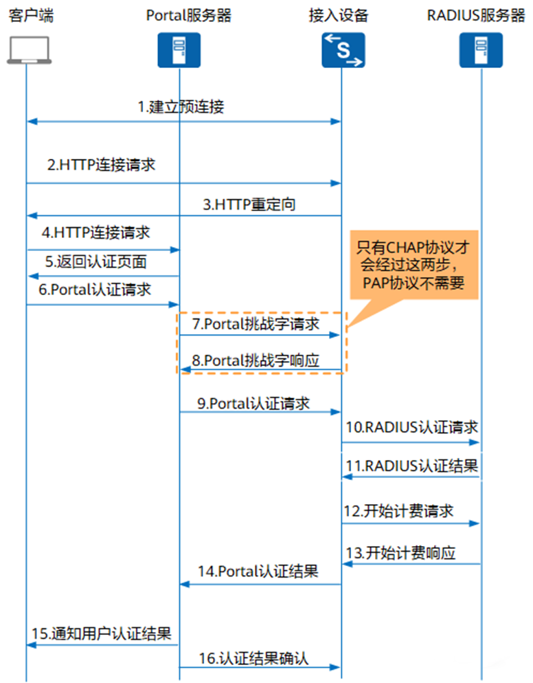

  1. 在认证之前客户端与接入设备之间建立起预连接，即客户端用户在认证成功之前在接入设备上已建立用户在线表项，并且只有部分网络访问权限。

  2. 客户端发起HTTP连接请求。

  3. 接入设备收到HTTP连接请求报文时，如果是访问Portal服务器或免认证网络资源，则接入设备允许其通过；如果是访问其它地址，则接入设备将其URL地址重定向到Portal认证页面。

  4. 客户端根据获得的URL地址向Portal服务器发起HTTP连接请求。

  5. Portal服务器向客户端返回Portal认证页面。

  6. 用户在Portal认证页面输入用户名和密码后，客户端向Portal服务器发起Portal认证请求。

  7. （可选）Portal服务器收到Portal认证请求后，如果Portal服务器与接入设备之间采用CHAP认证，则Portal服务器向接入设备发起Portal挑战字请求报文（REQ_CHALLENGE）；如果Portal服务器与接入设备之间采用PAP认证，则接入设备直接进行第9步。

  8. （可选）接入设备向Portal服务器回应Portal挑战字应答报文（ACK_CHALLENGE）。

  9. Portal服务器将用户输入的用户名和密码封装在Portal认证请求报文（REQ_AUTH）中，并发送给接入设备。

  10. 接入设备根据获取到的用户名和密码，向RADIUS服务器发送RADIUS认证请求（ACCESS-REQUEST）。

  11. RADIUS服务器对用户名和密码进行认证。如果认证成功，则RADIUS服务器向接入设备发送认证接受报文（ACCESS-ACCEPT）；如果认证失败，则RADIUS服务器返回认证拒绝报文（ACCESS-REJECT）。

      由于RADIUS协议合并了认证和授权的过程，因此认证接受报文中也包含了用户的授权信息。

  12. 接入设备根据接收到的认证结果接入/拒绝用户。如果允许用户接入，则接入设备向RADIUS服务器发送计费开始请求报文（ACCOUNTING-REQUEST）。

  13. RADIUS服务器返回计费开始响应报文（ACCOUNTING-RESPONSE），并开始计费，将用户加入自身在线用户列表。

  14. 接入设备向Portal服务器返回Portal认证结果（ACK_AUTH），并将用户加入自身在线用户列表。

  15. Portal服务器向客户端发送认证结果报文，通知客户端认证成功，并将用户加入自身在线用户列表。

  16. Portal服务器向接入设备发送认证应答确认（AFF_ACK_AUTH）。

  对于三层认证方式，客户端与接入设备之间没有建立预连接过程，其余报文处理流程跟二层认证完全一致。

  # **MAC优先的Portal认证流程**

  MAC优先的Portal认证是指用户进行Portal认证成功后，在一定时间（认证服务器上配置的MAC地址有效时间）内断开网络重新连接，能够直接通过MAC认证接入，无需输入用户名密码重新进行Portal认证。具体认证流程如图

  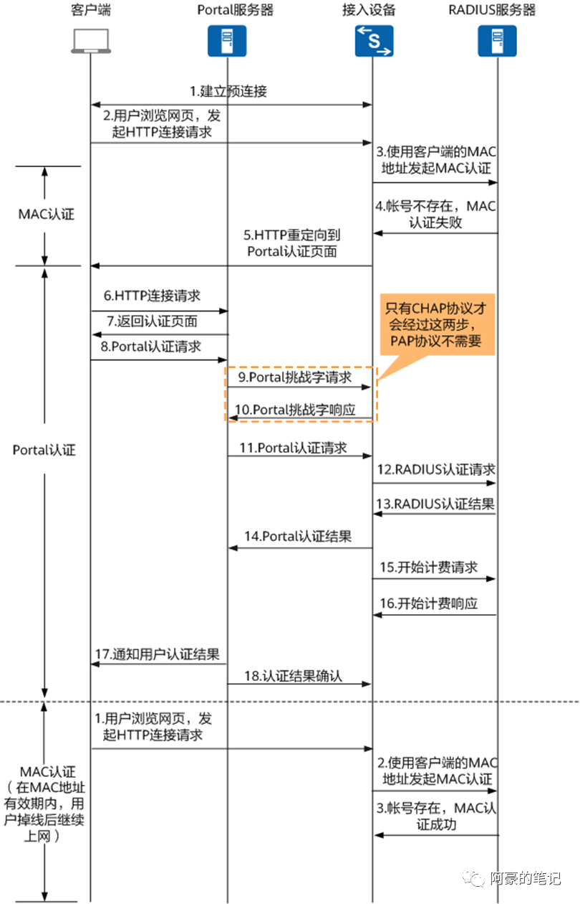

  配置MAC优先Portal认证后，客户端用户首次认证时，接入设备会把客户端的MAC地址发到RADIUS服务器进行认证，但由于RADIUS服务器未查找到MAC地址信息，导致认证失败，触发客户端用户进行Portal认证。

  认证成功后，RADIUS服务器会自动保存客户端的MAC地址。当客户端下线后重新尝试接入网络时，接入设备会把客户端的MAC地址发到RADIUS服务器进行认证。

  - 如果客户端的MAC地址还保存在RADIUS服务器，则RADIUS服务器校验用户名和密码（用户名和密码均为MAC地址）后，直接进行授权，用户授权后即可以直接访问网络，不需要再次输入用户名密码进行认证。
  - 如果客户端的MAC地址在RADIUS服务器已经过期，则RADIUS服务器会删除保存的客户端MAC地址。MAC地址认证失败之后，接入设备会向客户端用户推送Portal认证页面。客户端用户输入帐号和密码完成身份认证。

  # **Portal认证授权**

  认证用于确认尝试接入网络的用户身份是否合法，而授权则用于指定身份合法的用户所能拥有的网络访问权限，即用户能够访问哪些资源。授权最基础也是最常使用的参数是ACL和UCL组，此处以RADIUS授权进行说明

  ## **ACL**

  用户认证成功后，认证服务器将指定ACL授权给用户，则设备会根据该ACL对用户报文进行控制。

  - 如果用户报文匹配到该ACL中动作为permit的规则，则允许其通过。
  - 如果用户报文匹配到该ACL中动作为deny的规则，则将其丢弃。

  RADIUS服务器授权ACL方法:RADIUS服务器通过RADIUS标准属性Filter-Id将ACL ID授权给用户。为使授权的ACL生效，需要提前在设备上配置相应的ACL及规则。

  ## **用户组**

  用户组指具有相同角色、相同权限等属性的一组用户（终端）的集合。由于ACL资源有限，当每用户需要的授权ACL较多时，无法达到上线授权的用户数规格。通常情况下虽然用户数很大，但是用户权限的分类比较少的，所以可以使用用户组，每一组用户复用ACL，以利用有限的ACL支持较大规格的用户进行ACL授权。

  用户组可以在RADIUS服务器上配置，也可以在设备端配置（需在AAA域下应用）。如果用户希望使用RADIUS服务器下发的用户组授权，需要保证RADIUS服务器上下发的用户组在设备上已经配置（不需在AAA域下应用）。RADIUS服务器下发的用户组授权优先级高于设备端配置的用户组授权，当服务器下发的用户组授权失败后，用户会采用设备端配置的用户组授权。

  RADIUS服务器下发用户组授权的方式和下发ACL ID的方式一样，都是用11号标准属性Filter-Id来携带，属性值填充用户组名称。11号属性将优先被当成ACL编号处理。当设备上不存在该ACL编号的时候，则当成用户组处理。

  ## **free-rule**

  用户认证成功之前，为满足用户基本的网络访问需求，需要用户认证成功前就能获取部分网络访问权限。可在free-rule模板中配置free-rule规则，满足用户的认证成功前的网络访问需求。

  # **Portal认证用户下线**

  当用户已下线，而接入设备、RADIUS服务器和Portal服务器未感知到该用户已下线时，会产生以下问题：

  - RADIUS服务器仍会对该用户进行计费，造成误计费。
  - 存在非法用户仿冒合法用户IP地址和MAC地址接入网络的风险。
  - 占用设备用户规格，当已下线用户数量过多的情况下，可能会导致其他用户无法接入网络。

  因此，接入设备要能够及时感知到用户已下线，删除该用户表项，并通知RADIUS服务器停止对该用户进行计费。

  用户下线分为客户端主动下线、接入设备控制用户下线、认证服务器强制用户下线和Portal服务器强制用户下线。

  ## **客户端主动下线**

  由用户发起的主动下线，例如用户点击注销按钮，客户端向Portal服务器发送用户注销请求。

  具体下线流程如图

  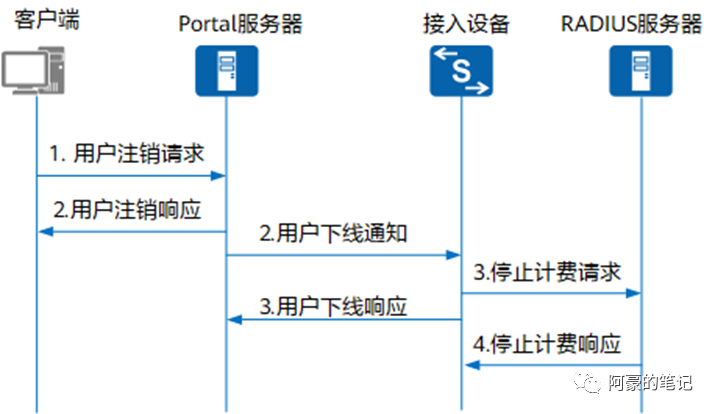

  1. 客户端向Portal服务器发送用户注销请求。

  2. Portal服务器向客户端发送用户注销响应，并向接入设备发送用户下线通知报文（REQ_LOGOUT）。

  3. 接入设备向RADIUS服务器发送停止计费请求报文（ACCOUNTING-REQUEST），并将用户下线。同时向Portal服务器发送用户下线响应报文（ACK_LOGOUT）。

     Portal服务器收到用户下线响应后，将用户下线。

  4. RADIUS服务器返回停止计费响应报文（ACCOUNTING-RESPONSE），并将用户下线。

  ## **接入设备控制用户下线**

  接入设备控制用户下线有两种方式：

  - 在接入设备上执行命令cut access-user强制指定用户下线。
  - 在接入设备上配置用户探测功能，用于探测用户是否在线。当用户在指定的时间内无响应，则认为用户下线，删除用户表项。

  以下线探测的下线流程为例，具体下线流程如图

  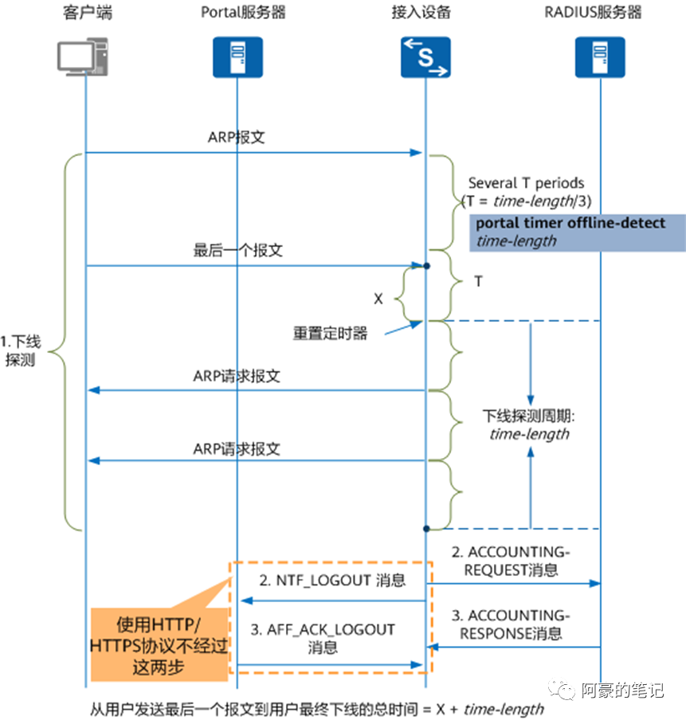

  1. 下线探测过程。

     接入设备获取到客户端IP地址，启动下线探测定时器，周期为time-length。在T时间内（T = time-length/3）收到客户端报文，接入设备认为用户在线，并且在T时刻会重置下线探测定时器。在T时间内未收到客户端报文时，接入设备每隔T时间向客户端发送ARP请求报文，如果连续两次没有收到客户端的ARP请求的应答报文或其他报文，接入设备认为用户已下线。

  2. 接入设备向Portal服务器发送用户下线通知（NTF_LOGOUT），并将用户下线。同时，接入设备向RADIUS服务器发送停止计费请求报文（ACCOUNTING-REQUEST）。

  3. Portal服务器向接入设备发送用户下线响应报文（AFF_ACK_LOGOUT），并将用户下线。RADIUS服务器向接入设备发送停止计费响应报文（ACCOUNTING-RESPONSE），并将用户下线。

  ## **认证服务器强制用户下线**

  服务器强制用户下线有以下方式：

  - RADIUS服务器可通过DM报文（Disconnect Message）强制用户下线。DM是指用户离线报文，即由RADIUS服务器端主动发起的强迫用户下线的报文。
  - RADIUS服务器通过授权RADIUS标准属性Session-Timeout和Termination-Action。其中，Session-Timeout为用户在线时长定时器，Termination-Action属性值为0表示将用户下线。当用户在线的时长达到定时器指定的数值时，设备会将用户下线。

  以RADIUS服务器通过DM报文强制用户下线为例，具体下线流程如图

  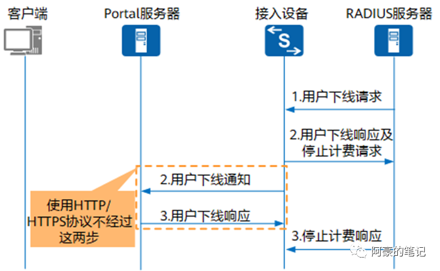

  1. RADIUS服务器向接入设备发送用户下线请求（DMRequest）。
  2. 接入设备向Portal服务器发送下线通知（NTF_LOGOUT），并将用户下线。同时，接入设备向RADIUS服务器发送下线响应（DM ACK）及停止计费请求报文（ACCOUNTING-REQUEST）。
  3. Portal服务器向接入设备发送用户下线响应报文（AFF_ACK_LOGOUT），并将用户下线。RADIUS服务器向接入设备发送停止计费响应报文（ACCOUNTING-RESPONSE），并将用户下线。

  ### Portal服务器强制用户下线

  当管理员注销用户或Portal服务器主动探测发现用户已经离线等事件发生时，Portal服务器将用户下线，并向接入设备发送下线通知。具体下线流程如图

  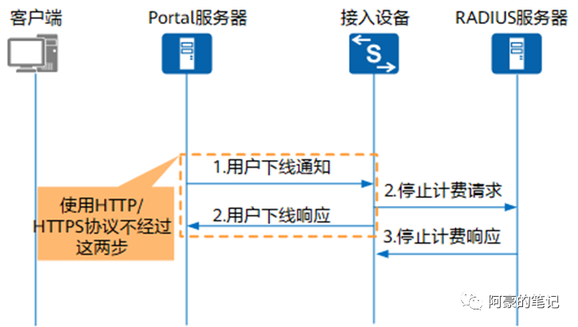

  1. Portal服务器向接入设备发送用户下线通知报文（REQ_LOGOUT）。
  2. 接入设备向RADIUS服务器发送停止计费请求报文（ACCOUNTING-REQUEST），并将用户下线。同时，接入设备向Portal服务器发送用户下线响应报文（ACK_LOGOUT）。
  3. Portal服务器收到用户下线响应后，将用户下线。
  4. RADIUS服务器返回停止计费响应报文（ACCOUNTING-RESPONSE），并将用户下线。

  ### MAC优先的Portal认证配置示例

  如图8所示，某大型企业网络中存在大量无线终端（STA），其中：企业办公楼的前台大厅部署SSID为“guest”的无线网络，为来访的客户提供无线网络接入；办公区域部署SSID为“employee”的无线网络，为企业员工提供无线网络接入。

  为保证网络安全，企业需要部署一套身份认证系统，对所有通过无线接入企业网络的人员进行准入控制，确保只有合法用户才能接入网络。由于无线终端较多且流动性较大，管理员决定在位于三层网络的AC上部署Portal认证以对用户进行接入控制，要求

  1. 用户认证成功前仅能访问公共服务器区（例如Portal服务器、RADIUS服务器和DNS服务器）。
  2. 用户认证成功后能够访问企业内部网络（例如客户问题处理系统）。
  3. 实现在一定的时间内（如：60分钟）用户因位置移动而反复进入、离开无线信号覆盖区域时，不需要重新输入用户名和密码进行认证。

  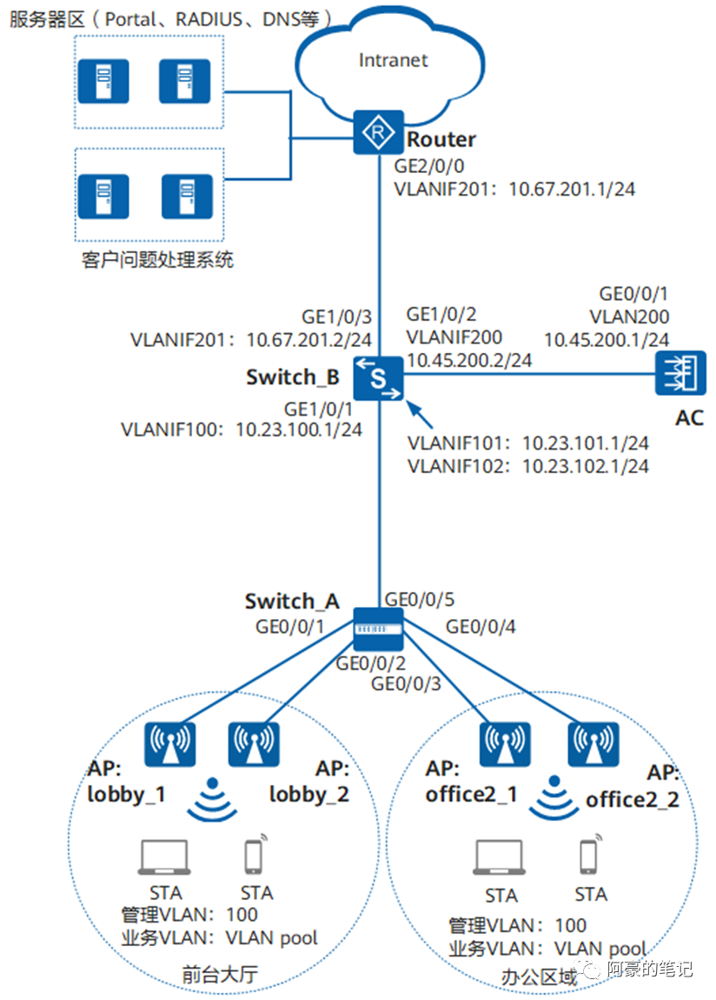

  


### **配置思路**

采用如下的思路配置网络的Portal认证：

1. 配置RADIUS认证参数。
2. 配置Portal服务器模板。
3. 配置Portal接入模板，管理Portal接入控制参数。
4. 配置MAC接入模板，用于MAC优先的Portal认证。
5. 配置免认证规则模板，实现AC放行访问DNS服务器的报文。
6. 配置ACL，实现为认证通过后的用户能够访问客户问题处理系统。
7. 配置认证模板，管理NAC认证的相关配置。

### **数据规划**

| **配置项**       | **数据**                                                     |
| ---------------- | ------------------------------------------------------------ |
| RADIUS认证参数   | RADIUS认证方案名称：radius_huaweiRADIUS计费方案名称：scheme1RADIUS服务器模板名称：radius_huawei，其中：IP地址：172.16.1.1认证端口号：1812共享密钥：Example@123 |
| Portal服务器模板 | 名称：abcIP地址：172.16.1.1AC向Portal服务器主动发送报文时使用的目的端口号：50200Portal认证共享密钥：Admin@123 |
| Portal接入模板   | 名称：portal1绑定的模板：Porta服务器模板abc                  |
| MAC接入模板      | 名称：mac1                                                   |
| 免认证规则模板   | 名称：default_free_rule免认证资源：DNS服务器的地址（172.16.1.2） |
| 认证模板         | ·名称：p1绑定的模板和认证方案：Portal接入模板portal1MAC接入模板mac1RADIUS服务器模板radius_huaweiRADIUS认证方案radius_huawei免认证规则模板default_free_rule |
| VAP模板          | 名称：guest转发模式：隧道转发业务VLAN：VLAN pool绑定模板：SSID模板guest、安全模板wlan-security、认证模板p1                                                                        <br />名称：employee转发模式：隧道转发业务VLAN：VLAN pool绑定模板：SSID模板employee、安全模板wlan-security、认证模板p1 |
| ACL              | 编号：3001规则：允许访问客户问题处理系统（IP地址为172.16.3.1） |

### **操作步骤**

前置条件：已完成wlan网络基础配置

1. 配置RADIUS服务器模板、RADIUS认证方案和RADIUS计费方案

\# 配置RADIUS服务器模板。

```
[AC] radius-server template radius_huawei

[AC-radius-radius_huawei] radius-server authentication 172.16.1.1 1812

[AC-radius-radius_huawei] radius-server accounting 172.16.1.1 1813

[AC-radius-radius_huawei] radius-server shared-key cipher Example@123

[AC-radius-radius_huawei] quit
```

\# 配置RADIUS方式的认证方案。

```
[AC] aaa

[AC-aaa] authentication-scheme radius_huawei

[AC-aaa-authen-radius_huawei] authentication-mode radius

[AC-aaa-authen-radius_huawei] quit

[AC-aaa] quit
```

\# 配置RADIUS方式的计费方案。

```
[AC-aaa] accounting-scheme scheme1

[AC-aaa-accounting-scheme1] accounting-mode radius

[AC-aaa-accounting-scheme1] accounting realtime 15

[AC-aaa-accounting-scheme1] quit

[AC-aaa] quit
```

**说明：**

- 计费功能并非真实意义上的计算费用，而是通过计费报文维护终端的在线信息。
- 实时计费间隔的取值对设备和RADIUS服务器的性能有要求，实时计费间隔的取值越小，对设备和RADIUS服务器的性能要求就越高。需要根据用户数设置实时计费间隔。

2. 配置Portal服务器模板

[AC] web-auth-server server-source all-interface  //华为AC V200R021C00以及之后的版本，必须使用web-auth-server server-source或server-source命令配置设备可以接收和响应Portal服务器报文的本机网关地址，才能正常使用Portal对接功能。

```
[AC] web-auth-server abc 

[AC-web-auth-server-abc] server-ip 172.16.1.1

[AC-web-auth-server-abc] shared-key cipher Admin@123

[AC-web-auth-server-abc] port 50200

[AC-web-auth-server-abc] url https://172.16.1.1:8445/portal

[AC-web-auth-server-abc] quit
```


3. 配置ACL3001，使认证通过后的用户能够访问客户问题处理系统

```
[AC] acl 3001

[AC-acl-adv-3001] rule 5 permit ip destination 172.16.3.0 0.0.0.255

[AC-acl-adv-3001] quit
```

本举例使用远端服务器授权，服务器上需要配置为认证成功后的用户授权ACL3001。

4. 配置Portal接入模板“portal1”

```
[AC] portal-access-profile name portal1

[AC-portal-access-profile-portal1] web-auth-server abc direct

[AC-portal-access-profile-portal1] quit
```


5. 配置MAC接入模板，用于MAC优先的Portal认证

```
[AC] mac-access-profile name mac1

[AC-mac-access-profile-mac1] quit
```


6. 配置免认证规则模板

```
[AC] free-rule-template name default_free_rule

[AC-free-rule-default_free_rule] free-rule 1 destination ip 172.16.1.2 mask 24

[AC-free-rule-default_free_rule] quit
```


7. 配置认证模板“p1”，并启用MAC优先的Portal认证

```
[AC] authentication-profile name p1

[AC-authentication-profile-p1] portal-access-profile portal1

[AC-authentication-profile-p1] mac-access-profile mac1

[AC-authentication-profile-p1] free-rule-template default_free_rule

[AC-authentication-profile-p1] authentication-scheme radius_huawei

[AC-authentication-profile-p1] radius-server radius_huawei

[AC-authentication-profile-p1] quit
```


8. 配置WLAN业务参数

\# 创建名为“wlan-security”的安全模板，并配置安全策略。

```
[AC] wlan

[AC-wlan-view] security-profile name wlan-security

[AC-wlan-sec-prof-wlan-security] security open

[AC-wlan-sec-prof-wlan-security] quit
```

\# 在名为“guest”和“employee”的VAP模板，引用安全模板和认证模板。

```
[AC-wlan-view] vap-profile name guest

[AC-wlan-vap-prof-guest] security-profile wlan-security

[AC-wlan-vap-prof-guest] authentication-profile p1

[AC-wlan-vap-prof-guest] quit

[AC-wlan-view] vap-profile name employee

[AC-wlan-vap-prof-employee] security-profile wlan-security

[AC-wlan-vap-prof-employee] authentication-profile p1

[AC-wlan-vap-prof-employee] quit
```


9. 验证配置结果

- STA上打开浏览器访问网络时，会自动跳转到外置Portal服务器提供的认证页面，在页面上输入正确的用户名和密码后，STA认证成功并可以访问客户问题处理系统。
- 假设服务器配置的MAC地址有效时间为60分钟。用户断开无线网络5分钟，重新连接无线网络时，可以直接访问；用户断开无线网络65分钟，重新连接无线网络时，会被重定向到Portal认证页面。

### TP-LINK示例

企业路由器Portal认证设置指南

智能手机、平板电脑等移动终端已经完全普及，酒店、商场、餐厅等越来越多的服务场所需要给客户提供免费Wi-Fi。但需要对接入终端进行认证，同时推送店铺、商品广告宣传信息。Portal认证功能应用灵活，可以很好地满足该需求。

以ER系列新平台路由器为例介绍Portal认证的设置方法，R系列路由器设置方法基本一致。

**网络拓扑**

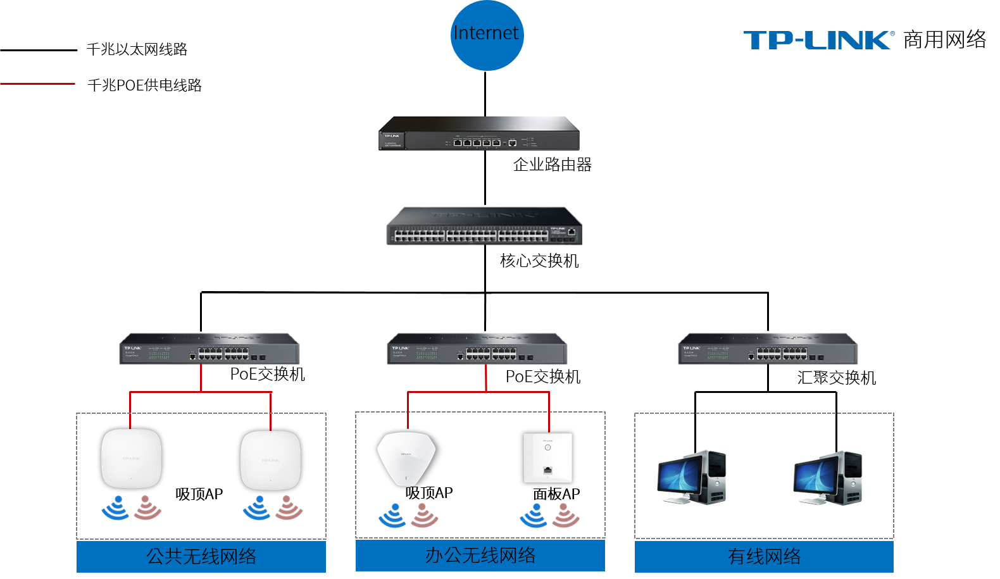

**【温馨提示】**本文适用于TL-ER3220G V4.0、TL-ER3229G V2.0、TL-ER5110G V4.0、TL-ER5120G V4.0、TL-ER5520G V5.0、TL-ER6110G V4.0、TL-ER6120G V6.0、TL-ER6210G V3.0、TL-ER6220G V3.0、TL-ER6229GPE-AC V2.0、TL-ER6520G V5.0等型号ER系列路由器。

**设置方法**

**1.** **选择认证方式**

登录路由器管理界面，点击 认证管理 > 认证设置 > 认证参数，选择认证模式：

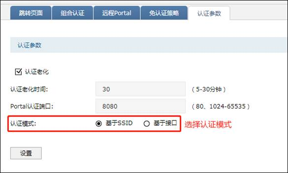

认证模式：设置Portal认证的认证模式，现支持基于SSID和基于VLAN两种模式。

**2.** **设置跳转页面**

新增跳转页面，根据想要展示给用户的内容自定义跳转页面模板，可上传背景图片和logo图片，实现广告推广作用。

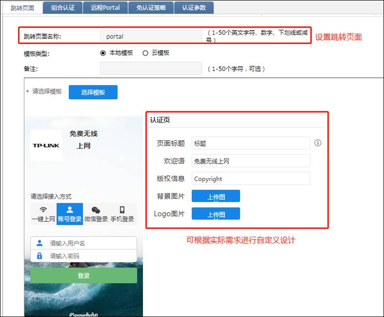

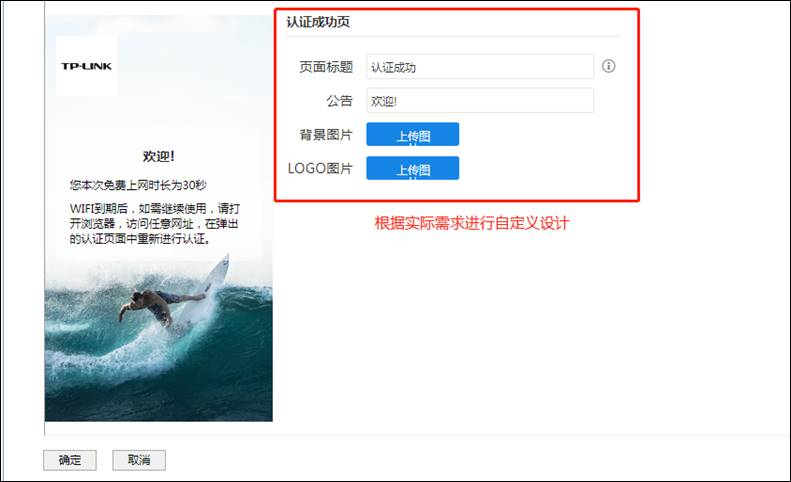

**3.** **新增组合认证**

在组合认证界面新增认证规则，此处介绍用户名和密码认证与短信认证的组合认证。

点击新增，选择跳转页面，VLAN模式下选择生效VLAN，SSID模式下选择生效SSID，在认证方式中选择启用Web认证和短信认证。 短信认证中需要按照短信平台填写相应参数，并可设置免费上网时长。

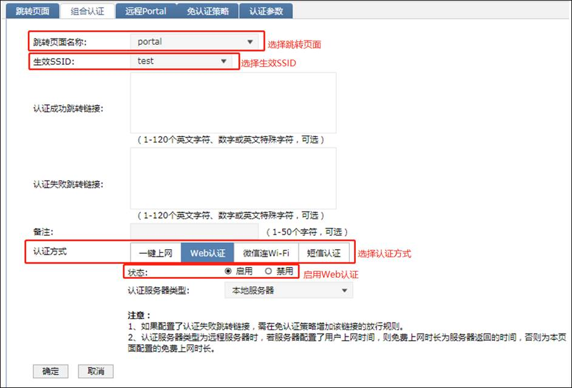

**4.** **添加用户管理**

在用户管理中添加认证用户，用于Web认证用户登录。

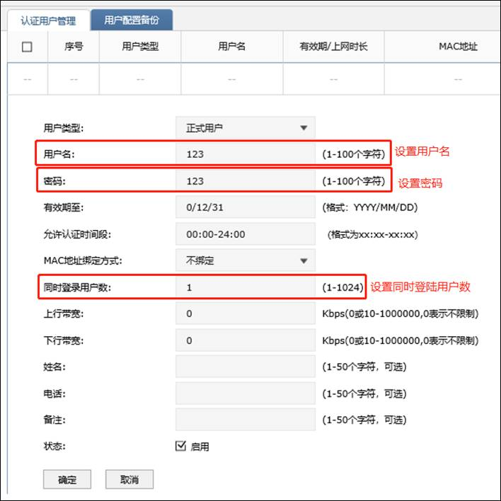

**5.** **设置****portal****认证到期时间**

在认证设置——认证参数 页面，勾选认证老化，并设置认证老化时间，用户断开连接后，超过认证老化时间，重新连接时需要重新进行认证。

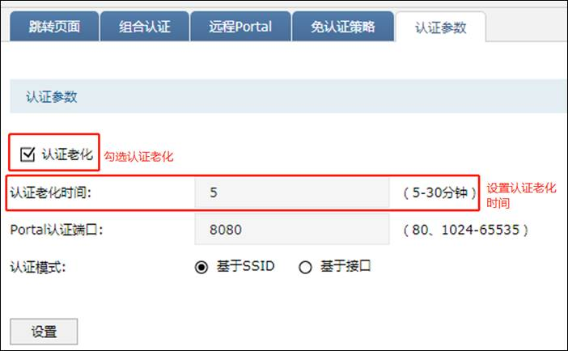

**至此，****Web****认证设置完成，无线终端只需要连接****Wi-Fi****信号，输入对应的认证用户名密码即可上网。**

**6.** **无线终端（手机）上网的方法**

**(1)** **连接无线信号**

无线终端（手机）连接无线网络后，跳转到认证登录页面（部分Android手机需要打开浏览器），如下： 用户可自行选择使用Web认证或者短信认证进行登录。

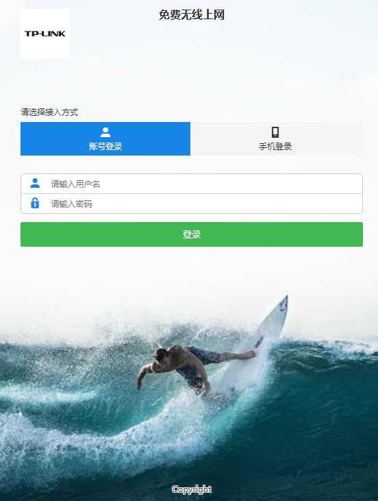

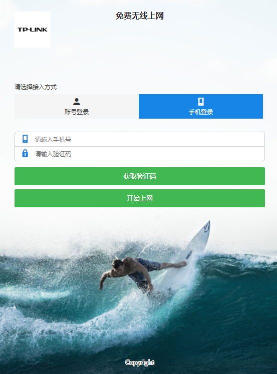

**(2)** **登录上网**

输入用户名、密码，点击 登录 后，无线终端就可以免费上网。


**7.** **查看已认证无线终端（手机）的方法**

点击 认证管理 > 认证状态，如下：

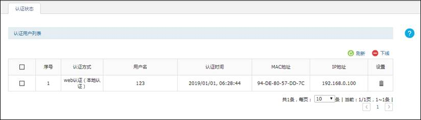

## 组合认证

在实际需求中，客户的想法各种各样，通常需要用组合认证

1、客户希望开放SSID，但是要对接入终端的MAC做认证，这个时候就可以选择Open+MAC地址认证（白名单方式）

2、客户希望密码认证后，在对终端MAC做限制，这个时候选择WPA2 ASE+MAC认证（白名单方式）

3、客户希望用户接入的时候进行帐号密码认证，这个时候可以采用WPA2+802.1X方式或者open +portal方式

4、客户希望用户接入的时候进行用户密码认证，并且对MAC进行认证，可以采用802.1X加MAC地址方式或者portal+MAC地址方式