> 作者：Tyler Akidau, Robert Bradshaw, Craig Chambers, Slava Chernyak, Rafael J. Ferna ́ndez-Moctezuma, Reuven Lax, Sam McVeety, Daniel Mills, Frances Perry, Eric Schmidt, Sam Whittle
> 来自：谷歌

## **摘要**

在日常商业运营中，无边界、乱序、大规模数据集越来越普遍了。（例如，网站日志，手机应用统计，传感器网络）。同时，对这些数据的消费需求也越来越复杂。比如说按事件发生时间序列处理数据，按数据本身的特征进行窗口计算等等。同时人们也越来越苛求立刻得到数据分析结果。然而，实践表明，我们永远无法同时优化数据处理的准确性、延迟程度和处理成本等各个维度。因此，数据工作者面临如何协调这些几乎相互冲突的数据处理技术指标的窘境，设计出来各种纷繁的数据处理系统和实践方法。

我们建议数据处理的方法必须进行根本性的改进。作为数据工作者，我们不能把无边界数据集（数据流）切分成有边界的数据，等待一个批次完整后处理。相反地，我们应该假设我们永远无法知道数据流是否终结，何时数据会变完整。唯一应该确信的是，新的数据会源源不断而来，老的数据可能会被撤销或更新。而能够让数据工作者应对这个挑战的唯一可行的方法是通过一个遵守原则的抽象来平衡折衷取舍数据处理的准确性、延迟程度和处理成本。

在这篇论文中，我们提出了Dataflow模型，并详细地阐述了它的语义，设计的核心原则，以及在实践开发过程中对模型的检验。

## **1. 简介**

现代数据处理是一个复杂而又令人兴奋的领域。MapReduce和它的衍生系统（如Hadoop, Pig, Hive, Spark等）解决了处理数据的“量”上的问题。流处理SQL上社区也做了很多的工作（如查询系统【1,14,15】，窗口【22】，数据流【24】，时间维度【28】，语义模型【9】）。在低延时处理上 Spark Streaming, MillWheel, Storm等做了很多尝试。数据工作者现在拥有了很多强有力的工具把大规模无序的数据加工成结构化的数据，而结构化的数据拥有远大于原始数据的价值。但是我们仍然认为现存的模型和方法在处理一些常见的场景时有心无力。

考虑一个例子：一家流媒体平台提供商通过视频广告，向广告商收费把视频内容进行商业变现。收费标准按广告收看次数、时长来计费。这家流媒体的平台支持在线和离线播放。流媒体平台提供商希望知道每天向广告商收费的金额，希望按视频和广告进行汇总统计。另外，他们想在大量的历史离线数据上进行历史数据分析，进行各种实验。

广告商和内容提供者想知道视频被观看了多少次，观看了多长时间，视频被播放时投放了哪个广告，或者广告播放是投放在哪个视频内容中，观看的人群统计分布是什么。广告商也很想知道需要付多少钱，而内容提供者想知道赚到了多少钱。 而他们需要尽快得到这些信息，以便调整预算/调整报价，改变受众，修正促销方案，调整未来方向。所有这些越实时越好，因涉及到金额，准确性是至关重要的。

尽管数据处理系统天生就是复杂的，视频平台还是希望一个简单而灵活的编程模型。最后，由于他们基于互联网的业务遍布全球，他们需要的系统要能够处理分散在全球的数据。

上述场景需要计算的指标包括每个视频观看的时间和时长，观看者、视频内容和广告是如何组合的（即按用户，按视频的观看“会话”）。概念上这些指标都非常直观，但是现有的模型和系统并无法完美地满足上述的技术要求。

批处理系统如MapReduce (包括Hadoop的变种，如Pig，Hive)，FlumeJava, Spark等无法满足时延的要求，因为批处理系统需要等待收集所有的数据成一个批次后才开始处理。对有些流处理系统来说，目前不了解它们在大规模使用的情况下是否还能保持容错性（如(Aurora [1], TelegraphCQ [14], Niagara [15], Esper[17]），而那些提供了可扩展性和容错性的系统则缺乏准确性或语义的表达性。很多系统缺乏“恰好处理一次”的语义（如Storm, Samza, Pulsar）影响了数据的准确性。或者提供了窗口但语义局限于基于记录数或基于数据处理时间的窗口（Spark Streamming, Sonora, Trident）。而大多数提供了基于事件发生时间窗口的，或者依赖于消息必须有序（SQLStream）或者缺乏按事件发生时间触发窗口计算的语义（Stratosphere/Flink）。CEDR和Trill可能值得一提，它们不仅提供了有用的标记触发语义，而且提供了一种增量模型，这一点上和我们这篇论文一致，但它们的窗口语义无法有效地表达基于会话的窗口。它们基于标记的触发语义也无法有效处理3.3节中的某些场景。MillWheel和Spark Streaming的可扩展性良好，容错性不错，低延时，是一种合理的方案，但是对于会话窗口缺乏一种直观的高层编程模型。我们发现只有Pulsar系统对非对齐窗口（译者注：指只有部分记录进入某一特定窗口，会话窗口就是一种非对齐窗口）提供了高层次语义抽象，但是它缺乏对数据准确性的保证。Lambda架构能够达到上述的大部分要求，但是系统体系太过复杂，必须构建和维护两套系统（译者注：指离线和在线系统）。Summingbird改善了Lambda体系的复杂性，提供了针对批处理和流处理系统的一个统一封装抽象，但是这种抽象限制了能支持的计算的种类，并且仍然需要维护两套系统，运维复杂性仍然存在。

上述的问题并非无药可救，这些系统在活跃的发展中终究会解决这些问题。但是我们认为所有这些模型和系统（除了CEDR和Trill）存在一个比较大的问题。这个问题是他们假设输入数据（不管是无边界或者有边界的）在某个时间点后会变完整。我们认为这种假设是有根本性的问题。我们面临的一方面是庞大无序的数据，另一方面是数据消费者复杂的语义和时间线上的各种需求。对于当下如此多样化和多变的数据使用用例（更别说那些浮现在地平线上的 译者注：应该是指新的，AI时代的到来带来的对数据使用的新玩法），我们认为任何一种有广泛实用价值的方法必须提供简单，强有力的工具，可以为手上某个具体的使用案例平衡数据的准确性、延迟程度和处理成本（译者注：意指对某些用例可能需要低延迟更多，某些用例需要准确性更多。而一个好的工具需要能够动态根据用户的使用场景、配置进行适应，具体的技术细节由工具本身消化）。最后，我们认为需要摆脱目前一个主流的观点，认为执行引擎负责描述系统的语义。合理设计和构建的批，微批次，流处理系统能够保证同样程度的准确性。而这三种系统在处理无边界数据流时都非常常见。如果我们抽象出一个具有足够普遍性，灵活性的模型，那么执行引擎的选择就只是延迟程度和处理成本之间的选择。

从这个方面来说，这篇论文的概念性贡献在于提出了一个统一的模型能够：

- 对无边界，无序的数据源，允许按数据本身的特征进行窗口计算，得到基于事件发生时间的有序结果，并能在准确性、延迟程度和处理成本之间调整。

- 解构数据处理管道的四个相关维度，使得它们透明地，灵活地进行组合。

- - 计算什么结果
  - 按事件发生时间计算
  - 在流计算处理时间时被真正触发计算
  - 早期的计算结果如何在后期被修正


- 分离数据处理的计算逻辑表示和对逻辑的物理实现，使得对批处理，微批处理，流计算引擎的选择成为简单的对准确性、延迟程度和处理成本之间的选择。

具体来说，上述的贡献包含：

- 一个支持非对齐事件发生时间窗口的模型，一组简单的窗口创建和使用的API。（参考2.2）
- 一个根据数据处理管道特征来决定计算结果输出次数的触发模型。一组强有力而灵活的描述触发语义的声明式API。
- 能把数据的更新和撤回和上述窗口、触发模型集成的增量处理模型。（2.3）
- 基于MillWheel流处理引擎和FlumeJava批处理引擎的可扩展实现。为Google Cloud Dataflow重写了外部实现，并提供了一个开源的运行引擎不特定的SDK。（3.1）
- 指导模型设计的一组核心设计原则。
- Google在处理大规模无边界乱序数据流的处理经验，这也是驱动我们开发这套模型的原因。

最后，不足为奇地，这个模型没有任何魔术效果。那些现有的强一致性批处理系统，微批处理系统，流处理系统，Lambda系统所无法计算的东西仍然无法解决。CPU,RAM Disk的内在约束依然存在。我们所提供的是一个能够简单地定义表达并行计算的通用框架。这种表达的方式和底层的执行引擎无关，同时针对任何特定的问题域，提供了根据手上数据和资源的情况来精确地调整延时程度和准确性的能力。从这一点上来说，这个模型的目标是简化大规模数据处理管道的构建。

## **1.1 无边界、有边界与流处理、批处理**

（本论文中）当描述无限/有限数据集时，我们更愿意使用有边界/无边界这组词汇，而不是流/批。因为流/批可能意味着使用某种特定的执行引擎。在现实中，无边界数据集可以用批处理系统反复调度来处理，而良好设计的流处理系统也可以完美地处理有边界数据集。从这个模型的角度来看，区分流/批的意义是不大的，因此我们保留这组词汇（流、批）用来专指执行引擎。

## **1.2 窗口**

窗口操作把一个数据集切分为有限的数据片以便于聚合处理。当面对无边界的数据时，有些操作需要窗口（以定义大多数聚合操作需要的边界：汇总，外链接，以时间区域定义的操作；如最近5分钟xx等）。另一些则不需要（如过滤，映射，内链接等）。对有边界的数据，窗口是可选的，不过很多情况下仍然是一种有效的语义概念（如回填一大批的更新数据到之前读取无边界数据源处理过的数据 译者注：类似于Lambda架构）。窗口基本上都是基于时间的；不过也有些系统支持基于记录数的窗口。这种窗口可以认为是基于一个逻辑上的时间域，该时间域中的元素包含顺序递增的逻辑时间戳。窗口可以是对齐的，也就是说窗口应用于所有落在窗口时间范围内的数据。也可以是非对齐的，也就是应用于部分特定的数据子集（如按某个键值筛选的数据子集）。图一列出了处理无边界数据时常见的三种窗口。

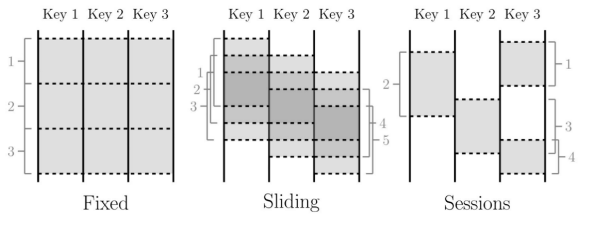

**固定**窗口（有时叫翻滚窗口）是按固定窗口大小定义的，比如说小时窗口或天窗口。它们一般是对齐窗口，也就是说，每个窗口都包含了对应时间段范围内的所有数据。有时为了把窗口计算的负荷均匀分摊到整个时间范围内，有时固定窗口会做成把窗口的边界的时间加上一个随机数，这样的固定窗口则变成了不对齐窗口。

**滑动**窗口按窗口大小和滑动周期大小来定义，比如说小时窗口，每一分钟滑动一次。这个滑动周期一般比窗口大小小，也就是说窗口有相互重合之处。滑动窗口一般也是对齐的；尽管上面的图为了画出滑动的效果窗口没有遮盖到所有的键，但其实五个滑动窗口其实是包含了所有的3个键，而不仅仅是窗口3包含了所有的3个键。固定窗口可以看做是滑动窗口的一个特例，即窗口大小和滑动周期大小相等。

**会话**是在数据的子集上捕捉一段时间内的活动。一般来说会话按超时时间来定义，任何发生在超时时间以内的事件认为属于同一个会话。会话是非对齐窗口。如上图，窗口2只包含key 1，窗口3则只包含key2。而窗口1 和 4 都包含了key 3。（译者注：假设key 是用户id， 那么两次活动之间间隔超过了超时时间，因此系统需要重新定义一个会话窗口。）

## **1.3 时间域**

当处理包含事件发生时间的数据时，有两个时间域需要考虑。尽管已经有很多文献提到（特别是时间管理【28】，语义模型【9】，窗口【22】，乱序处理【23】，标记【30】，心跳【21】，水位线【2】，帧【31】），这里仍然重复一下，因为这个概念清晰之后2.3节会更易于理解。这两个时间域是：

- **事件时间**，即当该事件发生时，该事件所在的系统记录下来的系统时间。
- **处理时间**，即在数据处理管道中处理数据时，一个事件被数据处理系统观察到的时间，是数据处理系统的时间。注意我们这里不假设在分布式系统中时钟是同步的。

一个事件的事件发生时间是永远不变的，但是一个事件的处理时间随着它在数据管道中一步步被处理时持续变化的。这个区别是非常重要的，特别是我们需要根据事件的发生时间进行分析的时候。

在数据处理过程中，由于系统本身的一些现实影响（通信延迟，调度算法，处理时长，管道中间数据序列化等）会导致这两个时间存在差值且动态波动（见图2）。使用记录全局数据处理进度的标记、或水位线，是一种很好的方式来可视化这个差值。在本论文中，我们采用一种类似MillWheel的水位线，它是一个时间戳，代表小于这个时间戳的数据已经完全被系统处理了（通常用启发式方法建立）。

对大多数现实世界中分布式数据集，系统缺乏足够的信息来建立一个100%准确的水位线。举例来说，在视频观看“会话”的例子中，考虑离线观看。如果有人把他们的移动设备带到野外，系统根本没有办法知道他们何时会回到有网络连接的地带，然后开始上传他们在没有网络连接时观看视频的数据。因此，大多数的水位定义是基于有限的信息启发式地定义。对于带有未处理数据的元数据的结构化输入源，比如说日志文件（译者注：可能应该不是泛指一般的日志文件），水位线的猜测明显要准确些，因此大多数情况下可以作为一个处理完成的估计。另外，很重要的一点，一旦水位线建立之后，它可以被传递到数据处理管道的下游（就像标记（Punctuation）那样 译者注：类似于Flink的checkpoint barrier）。当然下游要明确知道这个水位线仍然是一个猜测。

我们之前曾经说过，数据已经被完全处理的标记经常和数据的准确性是相互冲突的，因此，我们不会太过于依赖于水位线。不过，它确实是一种有用的手段。系统可以用它猜测所有事件发生时间早于水位线的数据已经完全被观察到。应用可以用它来可视化处理时间差，也用它来监控系统总体的健康状况和总体处理进展，也可以用它里做一些不影响数据准确性的决策，比如基本垃圾回收策略等。

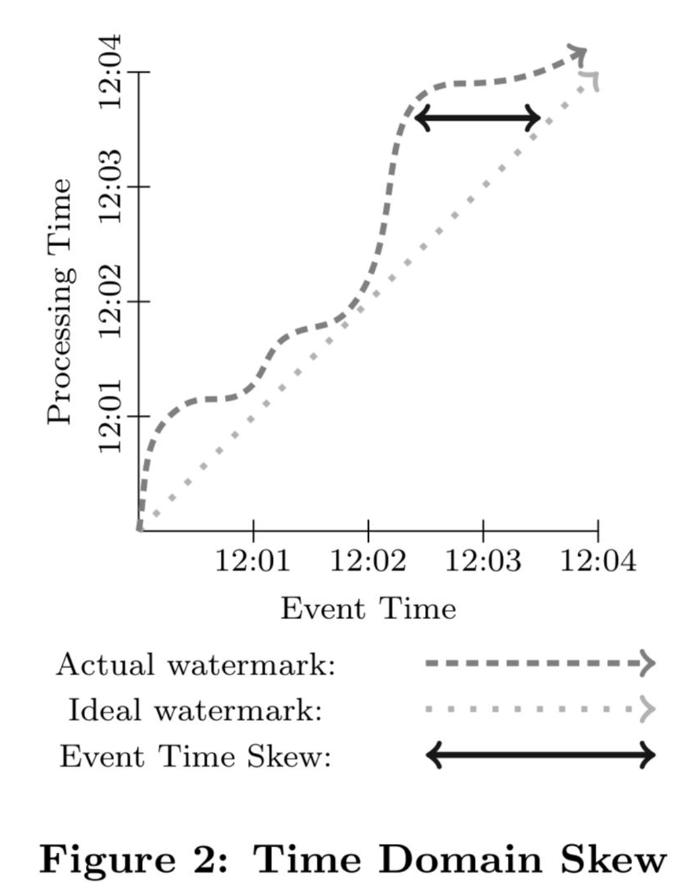

在理想的情况下，两个时间的差值应该永远为零；事件一旦发生，我们就马上处理掉。现实则更像图2那样。从12点开始，由于数据处理管道的延迟，水位线开始偏离真实时间，12:02时则靠近回来，而12:03的时候延迟变得更大。在分布式数据处理系统里，这种偏差波动非常普遍，在考虑数据处理系统如何提供一个正确的，可重复的结果时，把这种情况纳入考虑很关键。

## **2. Dataflow 模型**

在这一个小节中，我们将定义正式的系统模型。我们还会解释为什么它的语义足够泛化，能涵盖标准的批处理，微批次处理，流处理，以及混合了流批语义的Lambda架构。代码示例是基于Dataflow的Java SDK的一个简化版本，是从FlumeJava API演化而来。

## **2.1 核心编程模型**

我们先从经典的批处理模型开始来考虑我们的核心编程模型。Dataflow SDK把所有的数据抽象为键值对，对键值对有两个核心的数据转换操作：

- **ParDo** 用来进行通用的并行化处理。每个输入元素（这个元素本身有可能是一个有限的集合）都会使用一个UDF进行处理（在Dataflow中叫做DoFn），输出是0或多个输出元素。这个例子是把键的前缀进行展开，然后把值复制到展开后的键构成新的键值对并输出。

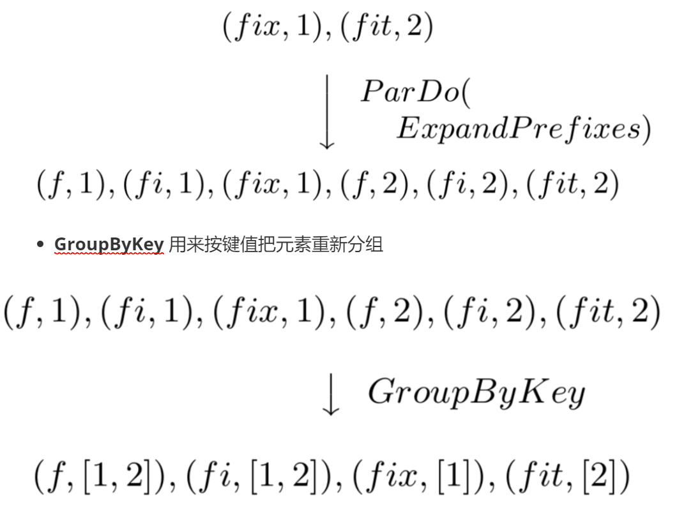

- **GroupByKey** 用来按键值把元素重新分组


ParDo 操作因为是对每个输入的元素进行处理，因此很自然地就可以适用于无边界的数据。而 GroupByKey 操作，在把数据发送到下游进行汇总前，需要收集到指定的键对应的所有数据。如果输入源是无边界的，那么我们不知道何时才能收集到所有的数据。所以通常的解决方案是对数据使用窗口操作。

## **2.2 窗口**

支持聚合操作的系统经常把GroupByKey操作重新定义成为GroupByKeyAndWindow 操作。我们在这一点上的主要贡献是支持非对齐窗口。这个贡献包含两个关键性的洞见：第一是从模型简化的角度上，把所有的窗口策略都当做非对齐窗口，而底层实现来负责把对齐窗口作为一个特例进行优化。 第二点是窗口操作可以被分隔为两个互相相关的操作：

- set<Window> **AssignWindows**(T datum) 即窗口分配操作。这个操作把元素分配到0或多个窗口中去。这个也就是Li在[22]中提到的桶操作符。
- set<window> **MergeWindows**(Set<Window> windows) 即窗口合并操作，这个操作在汇总时合并窗口。这使得数据驱动的窗口在随着数据到达的过程中逐渐建立起来并进行汇总操作。

对于任何一种窗口策略，这两种操作都是密切相关的。滑动窗口分配需要滑动窗口合并，而会话窗口分配需要会话窗口合并。

注意，为了原生地支持事件发生时间窗口，我们现在定义系统中传递的数据不再仅仅是键值对 (key, value)， 而是一个四元组 (key, value, event_time, window)。数据进入系统时需要自带事件发生时间戳（后期在管道处理过程中也可以修改），然后初始化分配一个默认的覆盖所有事件发生时间的全局窗口。而全局窗口语义默认等同于标准的批处理模型。

## **2.2.1 窗口分配**

从模型角度来说，把一条数据分配给某几个窗口意味着把这条数据复制给了这些窗口。以图3为例，它是把两条记录分配给一个2分钟宽，每一分钟滑动一次的窗口。（简单起见，时间戳用HH:MM的格式给出）

在这个例子中，两条数据在两个窗口中冗余存在，因而最后变成了四条记录。另外注意一点，窗口是直接关联到数据元素本身的，因此，窗口的分配可以在处理管道的聚合发生前的任何一处进行。这一点很重要，因为聚合操作有可能是下游复杂组合数据转换的一个子操作。（如Sum.integersPerKey 译者注：下文会提到，这个转换是指键值对中的值为整形，把整形值按键进行求和）

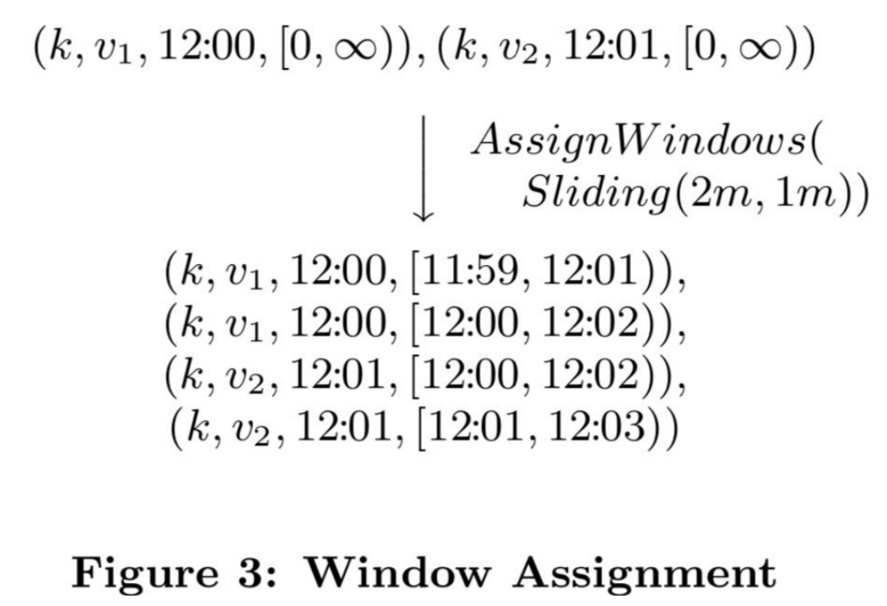

## **2.2.2 窗口合并**

窗口合并作为GroupByKeyAndWindow的一部分出现，要解释清楚的话，我们最好拿例子来阐述。我们拿会话窗口来作为例子，因为会话窗口正是我们想要解决的用例之一。图4展示了例子数据4条，3条包含的键是k1，一条是k2，窗口按会话窗口组织，会话的过期时间是30分钟。所有4条记录初始时都属于缺省的全局窗口。AssignWindows的会话窗口实现把每个元素都放入一个30分钟长的单个窗口，这个窗口的时间段如果和另外一个窗口的时间段相互重合，则意味着这两个窗口应该属于同一个会话。AssignWindows后是GroupByKeyAndWindow的操作，这个操作其实由五个部分组成：

- **DropTimestamps** – 删除数据上的时间戳，因为窗口合并后，后续的计算只关心窗口。
- **GroupByKey** – 把（值，窗口）二元组按键进行分组
- **MergeWindows** – 窗口合并。把同一个键的（值，窗口）进行窗口合并。具体的合并方式取决于窗口策略。在这个例子中，窗口v1和v4重叠，因此会话窗口策略把这两个窗口合并为一个新的，更长的会话窗口。（如粗体所示）
- **GroupAlsoByWindow** – 对每个键，把值按合并后的窗口进行进一步分组。在本例中，由于v1和v4已经合并进了同一个窗口，因此这一步里面v1和v4被分到了同一组。
- **ExpandToElements** – 把已经按键，按窗口分好组的元素扩展成(键，值，事件发生时间，窗口)四元组。这里的时间戳是新的按窗口的时间戳。在这个例子里我们取窗口的结束时间作为这条记录的时间戳，但任何大于或等于窗口中最老的那条记录的时间戳都认为是符合水位线正确性的。

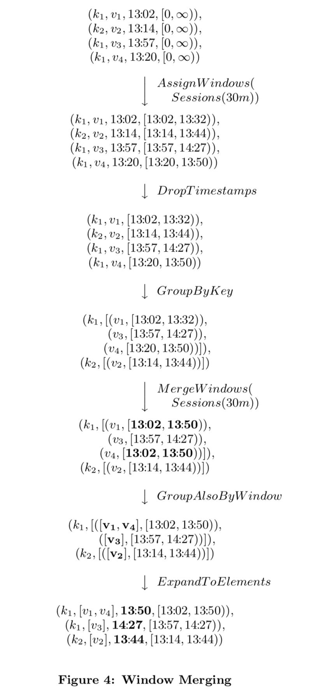

## **2.2.3 API**

下面我们使用Cloud Dataflow SDK来展示使用窗口操作的例子，现对同一个键的整型数值求和。

```java
PCollection<KV<String, Integer>> input = IO.read(...);
PCollection<KV<String, Integer>> output = input.apply(Sum.integersPerKey());
```

假如说要对30分钟长的会话窗口进行同样的计算，那么只要在求和前增加一个 `window.into` 调用就可以了：

```java
PCollection<KV<String, Integer>> input = IO.read(...);
PCollection<KV<String, Integer>> output = input
.apply(Window.into(Sessions.withGapDuration( Duration.standardMinutes(30))))
  .apply(Sum.integersPerKey());
```

## **2.3 触发器和增量处理**

构建非对齐的事件发生时间窗口是一个进步，不过我们还有两个问题需要解决。

- 我们需要提供基于记录和基于处理时间的窗口。否则我们会和现有的其他系统的窗口语义不兼容
- 我们需要知道何时把窗口计算结果发往下游。由于数据事件发生时间的无序性，我们需要某种其他的信号机制来明确窗口已经完结（译者注：就是说，窗口所应该包含的数据已经完全到达并且被窗口观察到，包含到）。

关于第一点，基于记录数和基于处理时间的窗口，我们会在2.4里解决。 而眼下需要讨论建立一个保证窗口完整性的方法。提到窗口完整性，一个最开始的想法是使用某种全局事件发生时间进展机制，比如水位线来解决。然而，水位线本身对数据处理的准确性有两个主要的影响

- 水位线可能设置的**过短**，因此在水位线达到后仍然有记录到达。对于分布式的数据源头来说，很难去推断出一个完全完美的事件发生时间水位线，因此无法完全依赖于水位线，否则我们无法达到１００％的准确性。
- 水位线可能设置的**过长**。因为水位线是全局性的进度指标，只要一个迟到的数据项就能影响到整个数据处理管道的水位线。就算是一个正常工作的数据处理管道，它的处理延迟波动很小，受输入源的影响，这种延迟的基准仍然可能有几分钟甚至更高。因此，使用水位线作为窗口完整信号并触发窗口计算结果很可能导致整个处理结果比Lambda架构有更高的延迟。

由于上述的原因，我们认为光使用水位线是不够的。从 Lambda 架构中我们获得了规避完整性问题的启发：它不是尽快地提供完全准确的答案，而是说，它先是尽快通过流式处理管道提供一个最佳的低延迟估计，同时承诺最终会通过批处理管道提供正确的和一致的答案（当然前提条件是批处理作业启动时，需要的数据应该已经全部到达了；如果数据后期发生了变化，那么批处理要重新执行以获得准确答案）。如果我们要在一个单一的数据处理管道里做到同样的事情（不管采用哪种执行引擎），那么我们需要一种对任一窗口能够提供多种答案（或者可以叫做窗格 译者注：对窗口这个比喻的引申）的方式。我们把这种功能叫做“触发器”。这种“触发器”可以选择在何时触发指定窗口的输出结果。

简单来说，触发器是一种受内部或者外信号激励的激发 GroupByKeyAndWindow 执行并输出执行结果的机制。他们对窗口模型是互补的，各自从不同的时间维度上影响系统的行为：

- **窗口** 决定哪些事件发生时间段（where）的数据被分组到一起来进行聚合操作
- **触发** 决定在什么处理时间（when）窗口的聚合结果被处理输出成一个窗格

我们的系统提供了基于窗口的完成度估计的预定义触发器。（完成度估计基于水位线。完成度估计也包括水位线完成百分位。它提供了一种有效的处理迟到记录的语义，而且在批处理和流处理引擎中都适用。允许使用者处理少量的一部分的记录来快速获得结果，而不是痴痴地等待最后的一点点数据到来）。触发器也有基于处理时间的，基于数据抵达状况的（如记录数，字节数，数据到达标记（punctuations），模式匹配等）。我们也支持对基础触发器进行逻辑组合（与，或），循环，序列和其他一些复合构造方法。另外，用户可以基于执行引擎的元素（如水位计时器，处理时间计时器，数据到达，复合构造）和任意的外部相关信号（如数据注入请求，外部数据进展指标，RPC完成回调等）自定义触发器。在2.4里我们会更详细地看一些具体的例子。

除了控制窗口结果计算何时触发，触发器还提供了三种不同的模式来控制不同的窗格（计算结果）之间是如何相互关联的。

- **抛弃** 窗口触发后，窗口内容被抛弃，而之后窗口计算的结果和之前的结果不存在相关性。当下游的数据消费者（不管是数据处理管道的内部还是外部）希望触发计算结果之间相互独立（比如对插入的数据进行求和的场景），那么这种情况就比较适用。另外，抛弃因为不需要缓存历史数据，因此对比其他两种模式，抛弃模式在状态缓存上是最高效的。不过累积性的操作可以建模成Dataflow的 Combiner，对窗口状态管理可以用增量的方式处理。对我们视频观看会话的用例来说，抛弃模式是不够的，因为要求下游消费者只关心会话的部分数据是不合理的。
- **累积：**触发后，窗口内容被完整保留住持久化的状态中，而后期的计算结果成为对上一次结果的一个修正的版本。这种情况下，当下游的消费者收到同一个窗口的多次计算结果时，会用新的计算结果覆盖掉老的计算结果。这也是Lambda架构使用的方式，流处理管道产出低延迟的结果，之后被批处理管道的结果覆盖掉。对视频会话的用例来说，如果我们把会话窗口的内容进行计算然后把结果直接写入到支持更新的输出源（如数据库或者键值存储），这种方案是足够的了。
- **累积和撤回：**出发后，在进行累积语义的基础上，计算结果的一份复制也被保留到持久化状态中。当窗口将来再次触发时，上一次的结果值先下发做撤回处理，然后新的结果作为正常数据下发。如果数据处理管道有多个串行的GroupByKeyAndWindow操作时，撤回是必要的，因为同一个窗口的不同触发计算结果可能在下游会被分组到不同键中去。在这种情况下，除非我们通过一个撤回操作，撤回上一次聚合操作的结果，否则下游的第二次聚合操作会产生错误的结果。Dataflow的combiner操作是支持撤回的，只要调用uncombine方法就可以进行撤回。而对于视频会话用例来说，这种模型是非常理想的。比如说，如果我们在下游从会话创建一开始，我们就基于会话的某些属性进行汇总统计，例如检查不受欢迎的广告（比如说在很多会话中这个广告的被观察时长不长于5秒）。早期的计算结果随着输入的增加（比如说原来在野外观看视频的用户已经回来了并上传了他们的日志）可能变得无效。对于包含多个阶段的聚合操作的复杂数据处理管道，撤回方式帮助我们应对源头数据的变化，得到正确的数据处理结果。（简单的撤回实现只能支持确定性的计算，而非确定性计算的支持需要更复杂，代价也更高。我们已经看到这样的使用场景，比如说概率模型 译者注：比如说基于布隆过滤器的UV统计）

## **2.4 例子**

我们现在来考察一系列的例子来说明Dataflow模型支持的计算模式是非常普遍适用的。我们下面例子是关于2.2.3中提到的对整数求和的例子：

```java
PCollection<KV<String, Integer>> output = input
  .apply(Sum.integersPerKey());
```

我们假设从某个数据源我们观察到了10个数据点，每个数据点都是一个比较小的整数。我们会考虑有边界输入源和无边界输入源两种情况。为了画图简单，我们假设这些数据点的键是一样的，而生产环境里我们这里所描述的数据处理是多个键并行处理的。图5展示了数据在我们关心的两个时间轴上的分布。X轴是事件发生时间（也就是事件发生的时间），而Y轴是处理时间（即数据管道观测到数据的时间）。（译者注：圆圈里的数值是从源头采样到的数值）除非是另有说明，所有例子假设数据的处理执行都是在流处理引擎上。


很多例子都要考虑水位线，因此我们的图当中也包括了理想的水位线，也包括了实际的水位线。直的虚线代表了理想的水位线，即，事件发生时间和数据处理时间不存在任何延迟，所有的数据一产生就马上消费了。不过考虑到分布式系统的不确定性，这两个时间之间有偏差是非常普遍的。在图5中，实际的水位线（黑色弯曲虚线）很好的说明了这一点。另外注意由于实际的水位线是猜测获得的，因此有一个迟到比较明显的数据点落在了水位线的后面。

如果我们在传统的批处理系统中构建上述的对数据进行求和的数据处理管道，那么我们会等待所有的数据到达，然后聚合成一个批次（因为我们现在假设所有的数据拥有同样的键），再进行求和，得到了结果51。如图6所示黑色的长方形是这个运算的示意图。长方形的区域代表求和运算涵盖的处理时间和参与运算的数据的事件发生时间区间。长方形的上沿代表计算发生，获得结果的管道处理时间点。因为传统的批处理系统不关心数据的事件发生时间，所有的数据被涵盖在一个大的全局性窗口中，因此包含了所有事件发生时间内的数据。而且因为管道的输出在收到所有数据后只计算一次，因此这个输出包含了所有处理时间的数据（译者注：处理时间是数据系统观察到数据的时间，而不是运算发生时的时间。。）

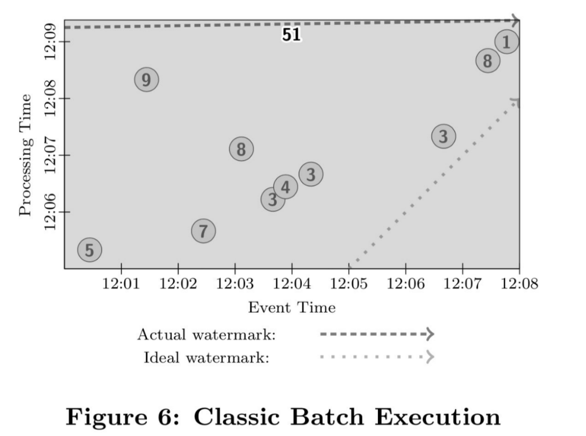

注意上图中包含了水位线。尽管在传统批处理系统中不存在水位线的概念，但是在语义上我们仍然可以引入它。批处理的水位线刚开始时一直停留不动。直到系统收到了所有数据并开始处理，水位线近似平行于事件发生时间轴开始平移，然后一直延伸到无穷远处。我们之所以讨论这一点，是因为如果让流处理引擎在收到所有数据之后启动来处理数据，那么水位线进展和传统批处理系统是一模一样的。（译者注：这提示我们其实水位线的概念可以同样适用于批处理）

现在假设我们要把上述的数据处理管道改造成能够接入无边界数据源的管道。在Dataflow模型中，默认的窗口触发方式是当水位线移过窗口时吐出窗口的执行结果。但如果对一个无边界数据源我们使用了全局性窗口，那么窗口就永远不会触发（译者注：因为窗口的大小在不停地扩大）。因此，我们要么用其他的触发器触发计算（而不是默认触发器），或者按某种别的方式开窗，而不是一个唯一的全局性窗口。否则，我们永远不会获得计算结果输出。

我们先来尝试改变窗口触发方式，因为这会帮助我们产生概念上一致的输出（一个全局的包含所有时间的按键进行求和），周期性地输出更新的结果。在这个例子中，我们使用了Window.trigger操作，按处理时间每分钟周期性重复触发窗口的计算。我们使用累积的方式对窗口结果进行修正（假设结果输出到一个数据库或者KV数据库，因而新的结果会持续地覆盖之前的计算结果）。这样，如图7所示，我们每分钟（处理时间）产生更新的全局求和结果。注意图中半透明的输出长方形是相互重叠的，这是因为累积窗格处理机制计算时包含了之前的窗口内容：

```java
PCollection<KV<String, Integer>> output = input 
  .apply(Window.trigger(Repeat(AtPeriod(1, MINUTE)))
               .accumulating()) 
  .apply(Sum.integersPerKey());
```


如果我们想要求出每分钟的和的增量，那么我们可以使用窗格的抛弃模式，如图8所示。注意这是很多流处理引擎的处理时间窗口的窗口计算模式。窗格不再相互重合，因此窗口的结果包含了相互独立的时间区域内的数据：

```java
PCollection<KV<String, Integer>> output = input
  .apply(Window.trigger(Repeat(AtPeriod(1, MINUTE)))
               .discarding()) 
  .apply(Sum.integersPerKey());
```

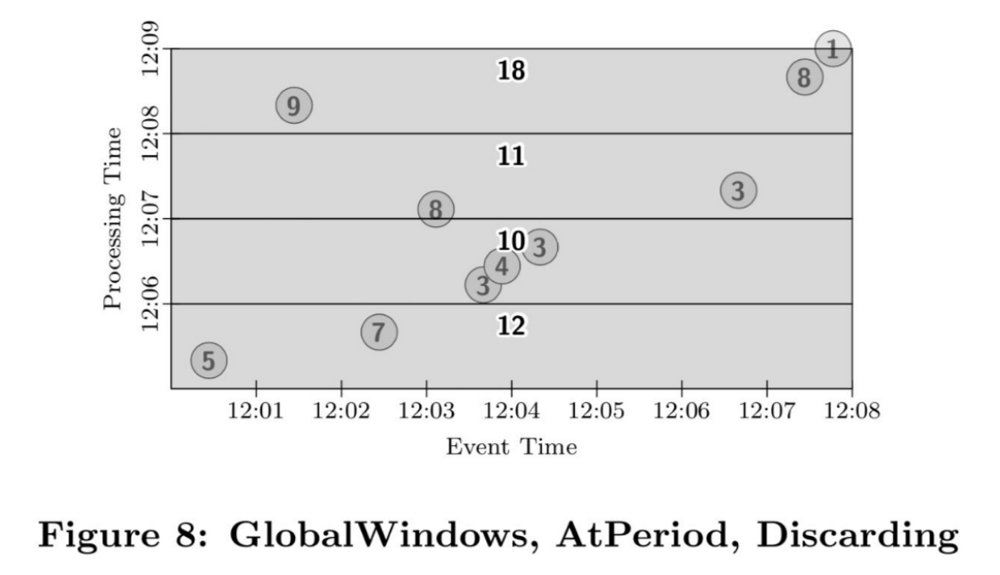

另外一种更健壮的处理时间窗口的实现方式，是把数据摄入时的数据到达时间作为数据的事件发生时间，然后使用事件发生时间窗口。这样的另一个效果是系统对流入系统的数据的事件发生时间非常清楚，因而能够生成完美的水位线，不会存在迟到的数据。如果数据处理场景中不关心真正的事件发生时间，或者无法获得真正的事件发生时间，那么采用这种方式生成事件发生时间是一种非常低成本且有效的方式。

在我们讨论其他类型的窗口前，我们先来考虑下另外一种触发器。一种常见的窗口模式是基于记录数的窗口。我们可以通过改变触发器为每多少条记录到达触发一次的方式来实现基于记录数的窗口。图9是一个以两条记录为窗口大小的例子。输出是窗口内相邻的两条记录之和。更复杂的记录数窗口（比如说滑动记录数窗口）可以通过定制化的窗口触发器来支持：

```java
PCollection<KV<String, Integer>> output = input 
  .apply(Window.trigger(Repeat(AtCount(2)))
               .discarding())
  .apply(Sum.integersPerKey());
```

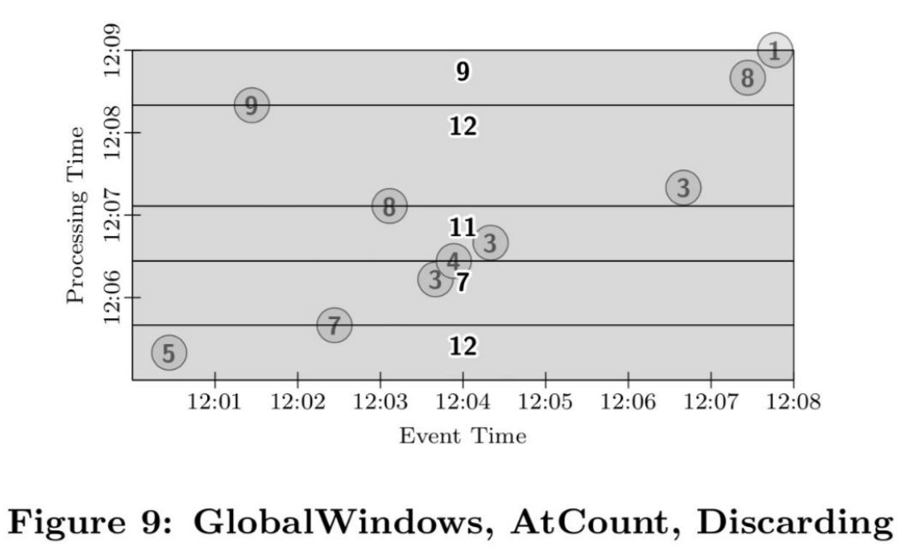

我们接下来考虑支持无边界数据源的其他选项，不再仅仅考虑全局窗口。一开始，我们来观察固定的2分钟窗口，累积窗格：

```java
PCollection<KV<String, Integer>> output = input
 .apply(Window.into(FixedWindows.of(2, MINUTES)
               .accumulating())
  .apply(Sum.integersPerKey());
```

这里没有定义触发器，那么系统采用的是默认触发器。相当于：

```java
PCollection<KV<String, Integer>> output = input
  .apply(Window.into(FixedWindows.of(2, MINUTES))
               .trigger(Repeat(AtWatermark())))
               .accumulating())
  .apply(Sum.integersPerKey());
```

水位线触发器是指当水位线越过窗口底线时窗口被触发。我们这里假设批处理和流处理系统都实现了水位线（详见3.1）。Repeat代表的含义是如何处理迟到的数据。在这里Repeat意味着当有迟于水位线的记录到达时，窗口都会立即触发再次进行计算，因为按定义，此时水位线早已经越过窗口底线了。

图10-12描述了上述窗口在三种不同的数据处理引擎上运行的情况。首先我们来观察下批处理引擎上这个数据处理管道如何执行的。受限于我们当前的实现，我们认为数据源现在是有边界的数据源，而传统的批处理引擎会等待所有的数据到来。之后，我们会根据数据的事件发生时间处理，在模拟的水位线到达后窗口计算触发吐出计算结果。整个过程如图10所示：


然后来考虑一下微批次引擎，每分钟做一次批次处理。系统会每分钟收集输入的数据进行处理，反复重复进行。每个批次开始后，水位线会从批次的开始时间迅速上升到批次的结束时间（技术上来看基本上是即刻完成的，取决于一分钟内积压的数据量和数据处理管道的吞吐能力）。这样每轮微批次完成后系统会达到一个新的水位线，窗口的内容每次都可能会不同（因为有迟到的数据加入进来），输出结果也会被更新。这种方案很好的兼顾了低延迟和结果的最终准确性。如图11所示：

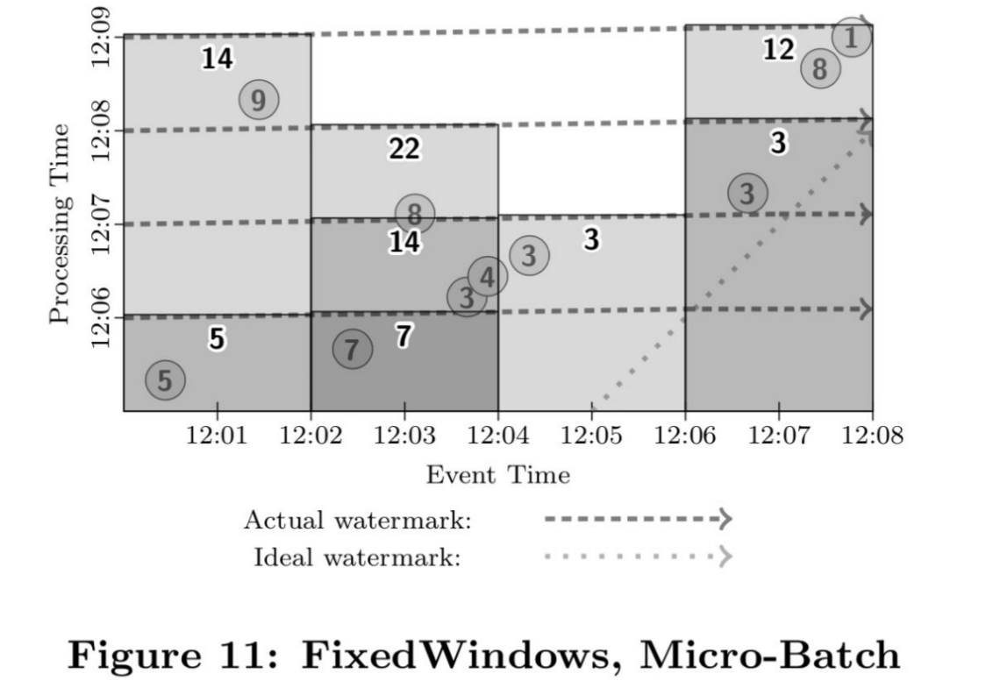

接下来考虑数据管道在流处理引擎上的执行情况，如图12所示。大多数窗口在水位线越过它们之后触发执行。注意值为9的那个数据点在水位线之后到达。不管什么原因（移动设备离线，网络故障分区等），系统并没有意识到那一条数据并没有到达，仍然提升了水位线并触发了窗口计算。当值为9的那条记录到达后，窗口会重新触发，计算出一个新的结果值。

如果说我们一个窗口只有一个输出，而且针对迟到的数据仅做一次的修正，那么这个计算方式还是不错的。不过因为窗口要等待水位线进展，整体上的延迟比起微批次系统可能要更糟糕，这就是我们之前在2.3里所说的，单纯依赖水位线可能引起的问题（水位线可能太慢）

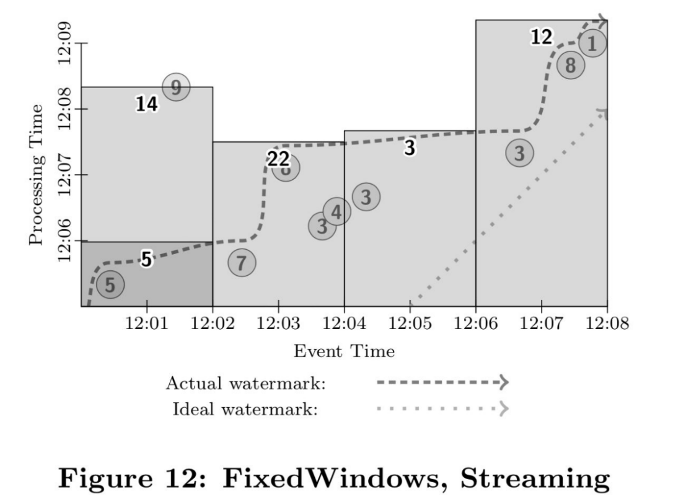

如果我们想降低整体的延迟，那么我们可以提供按数据处理时间的触发器进行周期性的触发，这样我们能够尽早得到窗口的计算结果，并且在随后得到周期性的更新，直到水位线越过窗口边界。参见图13。这样我们能够得到比微批次系统更低的延迟，因为数据一到达就进入了窗口随后就可能被触发，而不像在微批次系统里必须等待一个批次数据完全到达。假设微批次系统和流处理系统都是强一致的，那么我们选择哪种引擎，就是在能接受的延迟程度和计算成本之间的选择（对微批次系统也是批大小的选择）。这就是我们这个模型想要达到的目标之一。参见图13：固定窗口，流处理，部分窗格。

```java
PCollection<KV<String, Integer>> output = input
  .apply(Window.into(FixedWindows.of(2, MINUTES))
               .trigger(SequenceOf(
                   RepeatUntil(
                       AtPeriod(1, MINUTE),
                       AtWatermark()),
                   Repeat(AtWatermark())))
               .accumulating())
  .apply(Sum.integersPerKey());
```

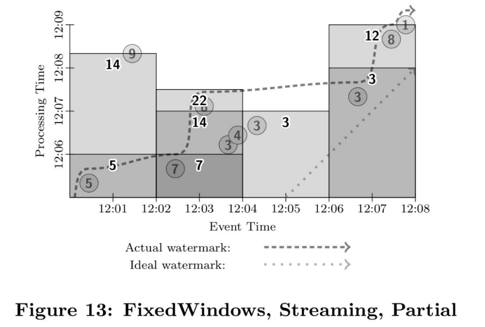

作为最后一个例子，我们来看一下如何支持之前提到的视频会话需求（为了保持例子之间的一致性，我们继续把求和作为我们的计算内容。改变成其他的聚合函数也是很容易的）。我们把窗口定义为会话窗口，会话超时时间为1分钟，并且支持回撤操作。这个例子也体现了我们把模型的四个维度拆开之后带来的灵活的可组合性（计算什么，在哪段事件发生时间里计算，在哪段处理时间里真正触发计算，计算产生的结果后期如何进行修正）。也演示了对之前的计算结果可以进行撤回是一个非常强力的工具，否则可能会让下游之前接收到的数据无法得到修正。

```java
PCollection<KV<String, Integer>> output = input      .apply(Window.into(Sessions.withGapDuration(1, MINUTE))
               .trigger(SequenceOf(
                 RepeatUntil(
                   AtPeriod(1, MINUTE),
                   AtWatermark()),
                   Repeat(AtWatermark())))
                .accumulatingAndRetracting()) 
    .apply(Sum.integersPerKey());
```

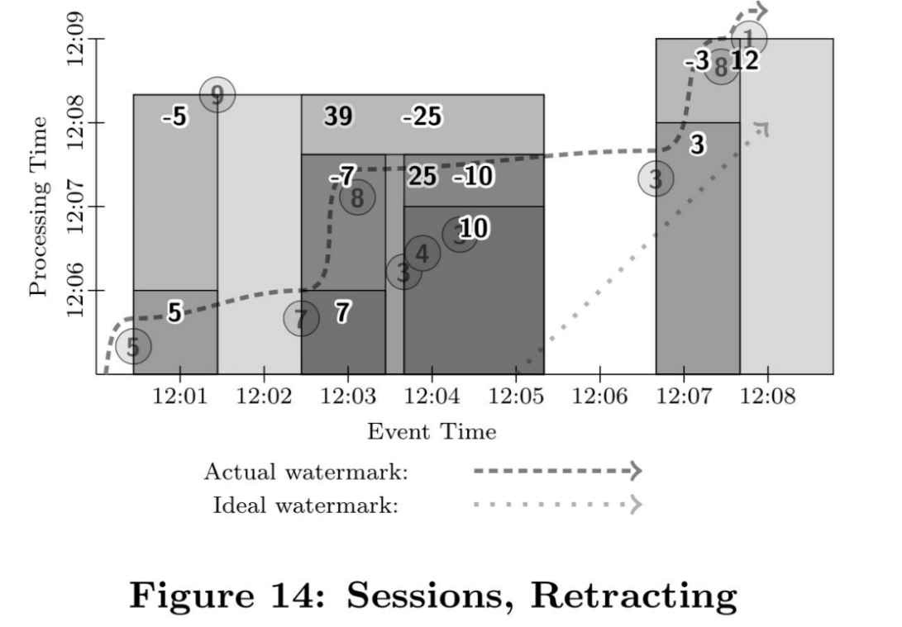

在这个例子中，我们首先接收到了数据5 和数据7。由于5和7之间事件发生时间大于1分钟，因此被当做了两个会话。在第一次窗口被触发时，产生了两条计算结果，和分别为5和7。在第二个因处理时间引起的窗口触发时，我们接收到了数据3,4,3，并且第一个3和上一个7之间时间大于1分钟，因此被分组到一个新的会话窗口，窗口触发计算并输出了计算结果10。紧接着，数据8到达了。数据8的到达使得数据7,3,4,3,8合并成了一个大窗口。当水位线越过数据点8后，新窗口计算被触发。触发后需要先撤回之前两个小窗口的计算结果，撤回方式是往下游发送两条键为之前的两个会话标记，值为-7和-10的记录，然后发送一个新的值为25的新窗口计算结果。同样，当值为9的记录迟于水位线到达后，之前的所有7条记录都合并成了一个会话，因此要对之前的会话再次进行撤回。值为-5和-25的记录又被发送往下游，新的值为39的会话记录随后也被发往下游。同样的操作在处理最后3条值为3,8,1的记录时也会发生，先是输出了结果值3，随后回撤了这个计算结果，输出了合并会话后的结果值12。

## **3. 实现和设计**

## **3.1 实现**

我们已经用FlumeJava实现了这个模型，使用MillWheel作为底层的流执行引擎；在本文写作的时候，针对公有云服务Cloud Dataflow的重新实现也接近完成。由于这些系统要么是谷歌的内部系统，要么是共有云服务，因此为简洁起见，实现的细节我们略掉了。可以提及的让人感兴趣的一点是，核心的窗口机制代码，触发机制代码是非常通用的，绝大部分都同时适用于批处理引擎实现和流处理引擎实现。这个实现本身也值得在将来进行更进一步的分析。

## **3.2 设计原则**

尽管我们很多的设计其实是受到3.3节所描述的真实业务场景启发，我们在设计中也遵从了一系列的核心原则。这些原则我们认为是这个模型必须要遵循的。

- 永远不要依赖任何的数据完整性标记（译者注：如水位线）
- 灵活性，要能覆盖已知的多样化的使用用例，并且覆盖将来可能的使用用例
- 对于每个预期中的执行引擎，（模型抽象）不但要正确合理，而且要有额外的附加价值
- 鼓励实现的透明性
- 支持对数据在它们产生的上下文中进行健壮的分析。

可以这么说，下述的使用案例决定了模型的具体功能，而这些设计原则决定了模型整体的特征和框架。我们认为这两者是我们设计的模型具有完全性，普遍性的根本原因。

## **3.3 业务场景**

在我们设计Dataflow模型的过程中，我们考虑了FlumeJava和MillWheel系统在这些年遇到的各种真实场景。那些良好工作的设计，我们保留到了模型中，而那些工作不那么良好的设计激励我们采用新的方法重新设计。下面我们简单介绍一些影响过我们设计的场景。

## **3.3.1 大规模数据回写和Lambda架构；统一模型**

有一些团队在MillWheel上跑日志链接作业。这其中有一个特别大的日志链接处理作业在MillWheel上按流模式运行，而另外一个单独的FlumeJava批处理作业用来对流处理作业的结果进行大规模的回写。一个更好的设计是使用一个统一的模型，对数据处理逻辑只实现一次，但是能够在流处理引擎和批处理引擎不经修改而同时运行。这是第一个激发我们思考去针对批处理，微批次处理和流处理建立一个统一模型的业务场景。这也是图10-12所展示的。

有一些团队在MillWheel上跑日志链接作业。这其中有一个特别大的日志链接处理作业在MillWheel上按流模式运行，而另外一个单独的FlumeJava批处理作业用来对流处理作业的结果进行大规模的回写。一个更好的设计是使用一个统一的模型，对数据处理逻辑只实现一次，但是能够在流处理引擎和批处理引擎不经修改而同时运行。这是第一个激发我们思考去针对批处理，微批次处理和流处理建立一个统一模型的业务场景。这也是图10-12所展示的。

## **3.3.2 非对齐窗口：会话**

从一开始我们就知道我们需要支持会话；事实上这是我们窗口模型对现有模型而言一个重大的贡献。会话对谷歌来说是一个非常重要的使用场景（也是MillWheel创建的原因之一）。会话窗口在一系列的产品域中都有应用，如搜索，广告，分析，社交和YouTube。基本上任何关心把用户的分散活动记录进行相互关联分析都需要通过会话来进行处理。因此，支持会话成为我们设计中的最重要考虑。如图14所示，支持会话在Dataflow中是非常简单的。

## **3.3.3 支付：触发器，累加和撤回**

有两个在MillWheel上跑支付作业的团队遇到的问题对模型的一部分也有启发作用。当时我们的设计实践是使用水位线作为数据完全到达的指标。然后写额外的逻辑代码来处理迟到的数据或者更改源头数据。由于缺乏一个支持更新和撤回的系统，负责资源利用率方案的团队最终放弃了我们的平台，构建了自己独立的解决方案（他们最后使用的模型和我们同时设计开发的模型事实上非常类似）。另一个支付团队的数据源头有少部分缓慢到达的数据，造成了水位线延迟，这给他们带来了大问题。这些系统上的缺陷成为我们对现有系统需要进行改良设计的重要动因，并且把我们的考虑点从保证数据的完整性转移到了对迟到数据的可适应性。对于这个场景的思考总结带来了两个方面：一个方面是能够精确，灵活地确定何时将窗口内容物化的触发器（如7-14所示），对同样的输入数据集也可以使用多种多样地结果输出模式进行处理。另外一方面是通过累积和撤回能够支持增量处理。（图14）

## **3.3.4 统计计算：水位线触发器**

很多MillWheel作业用来进行汇总统计（如平均延迟）。对这些作业来说，100%的准确性不是必须的，但是在合理的时间范围内得到一个接近完整的统计是必须的。考虑到对于结构化的输入（如日志文件），使用水位线就能达到很高程度的准确度。这些客户发现使用单次的的基于水位线的触发器就可以获得高度准确的统计。水位线触发器如图12所示。

我们有一些滥用检测的作业运行在MillWheel中。滥用检测是另外一种快速处理大部分数据比缓慢处理掉所有数据要远远更有价值的场景。因此，他们会大量地使用水位线百分位触发器。这个场景促使我们在模型中加入了对水位线百分位触发器的支持。

与此相关的，批处理作业中的一个痛点是部分处理节点的缓慢进度会成为执行时间中的长尾，拖慢整个进度。除了可以通过动态平衡作业来缓解这个问题，FlumeJava也支持基于整体完成百分度来选择是否终止长尾节点。用统一模型来描述批处理中遇到的这个场景的时候，水位线百分位触发器可以很自然地进行表达，不需要在引入额外的定制功能、定制接口。

## **3.3.5 推荐：处理时间触发器**

另外一种我们考虑过的场景是从大量的谷歌数据资产中构建用户活动树（本质上是会话树）。这些树用来根据用户的兴趣来做推荐。在这些作业中我们使用处理时间作为触发器。这是因为，对于用户推荐来说，周期性更新的，即便是基于不完备数据的用户活动树比起持续等待水位线越过会话窗口边界（即会话结束）获得完全的数据要有意义的多。这也意味着由于部分少量数据引起的水位线进展延迟不影响基于其他已经到达的数据进行计算并获得有效的用户活动树。考虑到这种场景，我们包含了基于处理时间的触发器（如图7和图8所示）

## **3.3.6 异常探测：数据驱动和组合触发器**

在MillWheel的论文中，我们描述了一种用来检测谷歌网站搜索查询趋势的微分异常探测数据处理管道。当我们为模型设计触发器的时候，这种微分异常探测系统启发我们设计了数据驱动触发器。这种微分探测器检测网站检索流，通过统计学估计来计算搜索查询请求量是否存在一个毛刺。如果系统认为一个毛刺即将产生，系统将发出一个启动型号。当他们认为毛刺已经消除，那么他们会发出一个停止信号（译者注：可能会对接系统自动对系统扩容或缩容）。尽管我们可以采用别的方式来触发计算，比如说Trill的标点符(Punctuations)，但是对于异常探测你可能希望一旦系统确认有异常即将发生，系统应该立即输出这个判断。标点符的使用事实上把流处理系统转换成了微批次处理系统，引入了额外的延迟。在调查过一些用户场景后，我们认为标点符不完全适合我们。因此我们在模型中引入了可定制化数据驱动触发器。同时这个场景也驱使我们支持触发器组合，因为在现实场景中，一个系统可能在处理多种微分计算，需要根据定义的一组逻辑来支持多种多样的输出。图9中的AtCount触发器是数据驱动触发器的例子，而图10-14使用了组合触发器。

## **4. 总结**

在MillWheel的论文中，我们描述了一种用来检测谷歌网站搜索查询趋势的微分异常探测数据处理管道。当我们为模型设计触发器的时候，这种微分异常探测系统启发我们设计了数据驱动触发器。这种微分探测器检测网站检索流，通过统计学估计来计算搜索查询请求量是否存在一个毛刺。如果系统认为一个毛刺即将产生，系统将发出一个启动型号。当他们认为毛刺已经消除，那么他们会发出一个停止信号（译者注：可能会对接系统自动对系统扩容或缩容）。尽管我们可以采用别的方式来触发计算，比如说Trill的标点符(Punctuations)，但是对于异常探测你可能希望一旦系统确认有异常即将发生，系统应该立即输出这个判断。标点符的使用事实上把流处理系统转换成了微批次处理系统，引入了额外的延迟。在调查过一些用户场景后，我们认为标点符不完全适合我们。因此我们在模型中引入了可定制化数据驱动触发器。同时这个场景也驱使我们支持触发器组合，因为在现实场景中，一个系统可能在处理多种微分计算，需要根据定义的一组逻辑来支持多种多样的输出。图9中的AtCount触发器是数据驱动触发器的例子，而图10-14使用了组合触发器。

根据我们多年在谷歌处理大规模无边界数据的实践经验，我们相信我们提出的模型一个非常好的进展。它支持非对齐，事件发生时间窗口。这些都是当前用户所需要的。它提供了灵活的窗口触发机制，支持窗口累积和撤回，把关注点从寻求等待数据的完整性变为自动适应现实世界中持续变更的数据源。它对批处理，微批次，流处理提供了统一的抽象，允许数据开发人员灵活从三者中选择。同时，它避免了单一系统容易把系统本身的构建蔓延到数据处理抽象层面中去的问题。它的灵活性让数据开发者能根据使用场景恰当地平衡数据处理的准确性，成本和延迟程度。对于处理多样化的场景和需求来说，这一点很关键。最后，通过把数据处理的逻辑划分为计算什么，在哪个事件发生时间范围内计算，在什么处理时间点触发计算，如何用新的结果订正之前的数据处理结果让整个数据处理逻辑透明清晰。我们希望其他人能够认同这个模型并且和我们一起推进这个复杂而又令人着迷的领域的发展。

## **5. 致谢**

我们感谢这篇文章的所有评审者：他们专注付出，提供了很有思考的意见。他们是：Atul Adya, Ben Birt,Ben Chambers, Cosmin Arad, Matt Austern, Lukasz Cwik,Grzegorz Czajkowski, Walt Drummond, Je_ Gardner, An-thony Mancuso, Colin Meek, Daniel Myers, Sunil Pedapudi,Amy Unruh, and William Vambenepe。我们也想在此赞扬谷歌Cloud Dataflow团队，FlumeJava团队，MillWheel团队和其他相关团队的成员，他们为这项工作付出了令人影响深刻的不倦的努力。

## **6. 参考**

[1] D. J. Abadi et al. Aurora: A New Model and Architecture for Data Stream Management. The VLDB Journal, 12(2):120-139, Aug. 2003.

[2] T. Akidau et al. MillWheel: Fault-Tolerant Stream Processing at Internet Scale. In Proc. of the 39th Int.Conf. on Very Large Data Bases (VLDB), 2013.

[3] A. Alexandrov et al. The Stratosphere Platform for Big Data Analytics. The VLDB Journal, 23(6):939-964, 2014.

[4] Apache. Apache Hadoop. [http://hadoop.apache.org](http://hadoop.apache.org/), 2012.

[5] Apache. Apache Storm.[http://storm.apache.org](http://storm.apache.org/), 2013.

[6] Apache. Apache Flink. http://flink.apache.org/, 2014.

[7] Apache. Apache Samza [http://samza.apache.org](http://samza.apache.org/), 2014.

[8] R. S. Barga et al. Consistent Streaming Through Time: A Vision for Event Stream Processing. In Proc.of the Third Biennial Conf. on Innovative Data Systems Research (CIDR), pages 363-374, 2007.

[9] Botan et al. SECRET: A Model for Analysis of the Execution Semantics of Stream Processing Systems. Proc. VLDB Endow., 3(1-2):232-243, Sept. 2010.

[10] O. Boykin et al. Summingbird: A Framework for Integrating Batch and Online MapReduce Computations. Proc. VLDB Endow., 7(13):1441-1451, Aug. 2014.

[11] Cask. Tigon. http://tigon.io/, 2015.

[12] C. Chambers et al. FlumeJava: Easy, E_cient Data-Parallel Pipelines. In Proc. of the 2010 ACM SIGPLAN Conf. on Programming Language Design and Implementation (PLDI), pages 363-375, 2010.

[13] B. Chandramouli et al. Trill: A High-Performance Incremental Query Processor for Diverse Analytics. In

Proc. of the 41st Int. Conf. on Very Large Data Bases (VLDB), 2015.

[14] S. Chandrasekaran et al. TelegraphCQ: Continuous Dataow Processing. In Proc. of the 2003 ACM SIGMOD Int. Conf. on Management of Data (SIGMOD), SIGMOD '03, pages 668-668, New York, NY, USA, 2003. ACM.

[15] J. Chen et al. NiagaraCQ: A Scalable Continuous Query System for Internet Databases. In Proc. of the 2000 ACM SIGMOD Int. Conf. on Management of Data (SIGMOD), pages 379-390, 2000.

[16] J. Dean and S. Ghemawat. MapReduce: Simplifed Data Processing on Large Clusters. In Proc. of the Sixth Symposium on Operating System Design and Implementation (OSDI), 2004.

[17] EsperTech. Esper. http://www.espertech.com/esper/, 2006.

[18] Gates et al. Building a High-level Dataow System on Top of Map-Reduce: The Pig Experience. Proc.VLDB Endow., 2(2):1414-1425, Aug. 2009.

[19] Google. Dataow SDK. https://github.com/ GoogleCloudPlatform/DataflowJavaSDK, 2015.

[20] Google. Google Cloud Dataow.https://cloud.google.com/dataflow/, 2015.

[21] T. Johnson et al. A Heartbeat Mechanism and its Application in Gigascope. In Proc. of the 31st Int. Conf. on Very Large Data Bases (VLDB), pages 1079-1088, 2005.

[22] J. Li et al. Semantics and Evaluation Techniques for Window Aggregates in Data Streams. In Proceedings og the ACM SIGMOD Int. Conf. on Management of Data (SIGMOD), pages 311-322, 2005.

[23] J. Li et al. Out-of-order Processing: A New Architecture for High-performance Stream Systems. Proc. VLDB Endow., 1(1):274-288, Aug. 2008.

[24] D. Maier et al. Semantics of Data Streams and Operators. In Proc. of the 10th Int. Conf. on Database Theory (ICDT), pages 37-52, 2005.

[25] N. Marz. How to beat the CAP theorem. http://nathanmarz.com/blog/how-to-beat-the-cap-theorem.html, 2011.

[26] S. Murthy et al. Pulsar - Real-Time Analytics at Scale. Technical report, eBay, 2015.

[27] SQLStream. http://sqlstream.com/, 2015.

[28] U. Srivastava and J. Widom. Flexible Time Management in Data Stream Systems. In Proc. of the 23rd ACM SIGMOD-SIGACT-SIGART Symp. on Princ. of Database Systems, pages 263-274, 2004.

[29] A. Thusoo, J. S. Sarma, N. Jain, Z. Shao, P. Chakka, S. Anthony, H. Liu, P. Wycko_, and R. Murthy. Hive: A Warehousing Solution over a Map-reduce Framework. Proc. VLDB Endow., 2(2):1626-1629, Aug. 2009.

[30] P. A. Tucker et al. Exploiting punctuation semantics in continuous data streams. IEEE Transactions on Knowledge and Data Engineering, 15, 2003.

[31] J. Whiteneck et al. Framing the Question: Detecting and Filling Spatial- Temporal Windows. In Proc. of the ACM SIGSPATIAL Int. Workshop on GeoStreaming (IWGS), 2010.

[32] F. Yang and others. Sonora: A Platform for Continuous Mobile-Cloud Computing. Technical Report MSR-TR-2012-34, Microsoft Research Asia.

[33] M. Zaharia et al. Resilient Distributed Datasets: A Fault-Tolerant Abstraction for In-Memory Cluster Computing. In Proc. of the 9th USENIX Conf. on Networked Systems Design and Implementation (NSDI), pages 15-28, 2012.

[34] M. Zaharia et al. Discretized Streams: Fault-Tolerant Streaming Computation at Scale. In Proc. of the 24th ACM Symp. on Operating Systems Principles, 2013.