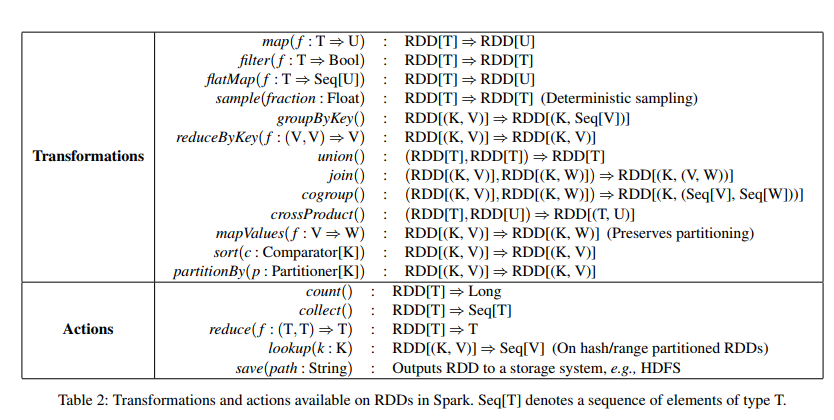

# Resilient Distributed Datasets: A Fault-Tolerant Abstraction for In-Memory Cluster Computing

# 1 Introduction

问题1：
    许多框架缺乏充分利用分布式内存的抽象，这使得它们不适用于大量计算都需要重用中间结果的情形，但数据重用又比较常见，比如许多迭代机器学习和图算法、交互式数据工具。
    

分布式内存抽象的概念——弹性分布式数据集（RDD，Resilient  Distributed Datasets），在大量应用中支持数据重用，具有容错性、并行数据结构，这使得用户可将中间结果保留在内存中，通过控制分区来优化数据的放置，并通过丰富的操作进行管理。

问题2：
    设计RDD的挑战是定义能高效提供容错性的编程接口。而现有在集群上的内存存储抽象，如分布式共享内存、键-值存储等，只能通过跨机器复制数据或跨机器更新日志保证容错性，对于数据密集型任务来说，代价太高。
    

RDD提供了一种基于粗粒度转换的接口，即将同一操作应用于多个数据 项，这样它就可以通过记录建立一个数据集的转换操作来支持容错性， 而不需要记录真实数据，降低了存储开销。
    

RDD会将一系列转换记录下来，即Lineage，如果RDD中的一个分区丢失了，该RDD拥有足够的信息：它是如何从其他RDD衍生的 ，以重新计算丢失的分区，这样不需要检查点操作就可以重构丢失的数据分区 ，速度快且不需要高代价的复制。

实现：
    

RDD系统---Spark，能够被用于开发多种并行应用，它提供了Scala接口，      可被用于开发多种并行应用，可用于交互式查询大数据集。它是第一个能够使用有效、通用编程语言，并在集群上对大数据集进行交互式分析的系统。

评估：
    

实验表明，在处理迭代式应用上Spark比Hadoop快高达20多倍，计算数据分析类报表的性能提高了40多倍，同时能够在5-7秒的延时内交互式扫描1TB数据集。

# 2 Resilient Distributed Datasets (RDDs)

## 2.1 RDD Abstraction

​    RDD是只读的、分区记录的集合。RDD只能基于在稳定物理存储中的数据集和其他已有的RDD上执行确定性操作来创建。这些确定性操作被称为转换，如map、filter、groupBy、join。
​    

RDD不总是需要物化。RDD含有如何从其他数据集衍生（即计算）出本RDD的相关信息（即Lineage），据此可以从物理存储的数据计算出相应RDD分区。

 用户可以控制RDD的其它两个方面：缓存和分区。用户可确定哪些RDD将被重用，并为之指定存储策略。也可以通过一个RDD每个记录中的键值，指定哪些元素被分区。

## 2.2 Spark Programming Interface

​    Spark中，RDD被表示成对象，转换被这些对象中的方法所调用。

 定义好了RDD，程序员就可在动作中使用RDD了。动作是向应用程序返回值，或向存储系统导出数据的那些操作，例如，count（返回RDD中的元素个数），collect（返回元素本身），save（将RDD输出到存储系统）。在Spark中，只有在动作第一次使用RDD时，才会计算RDD（即延迟计算）。这样在构建RDD的时候，运行时通过管道的方式传输多个转换。
    

Spark默认是存储到RAM中的，但当RAM不够的时候，Spark会将一些RDD写到磁盘上。用户可以为每个RDD指定缓存优先级，以指定内存中的那些数据被先写到磁盘上。

### 2.2.1 Example: Console Log Minin

​    假定有一个大型网站出错，操作员想要检查Hadoop文件系统（HDFS）中的日志文件（TB级大小）来找出原因。通过使用Spark，操作员只需将日志中的错误信息通过一组节点装载到内存中，然后执行交互式查询。首先，需要输入如下Scala命令：

```cpp
     lines = spark.textFile("hdfs://...")
     errors = lines.filter(_.startsWith("ERROR"))
     errors.cache()
```


    第1行从HDFS文件定义了一个RDD（即一个文本行集合），第2行获得一个过滤后的RDD，第3行请求将errors缓存起来。注意在Scala语法中filter的参数是一个闭包。
    这时集群还没有开始执行任何任务。但是，用户已经可以在这个RDD上执行相应的动作，例如统计错误消息的数目： 

```cpp
    errors.count()
```

​    用户还可以在RDD上执行更多的转换操作，并使用转换结果，如：

```cpp
    // Count errors mentioning MySQL:
       errors.filter(_.contains("MySQL")).count()

    // Return the time fields of errors mentioning
    // HDFS as an array (assuming time is field
    // number 3 in a tab-separated format):
       errors.filter(_.contains("HDFS"))
	     .map(_.split('\t')(3))
	     .collect()   
```

​     包含错误的第一个动作执行后，Spark会将errors分区存储在内存中，极大提升了后续计算速度。注意，最初的RDD, lines, 是不会被缓存的，因为errors信息也许只是数据的一小部分（小到足以放到内存中）。

​     为说明模型是如何实现容错性的，下图显示了第3个查询的lineage图


  在lines执行filter后，得到了errors，然后继续执行filter、map操作得到新的RDD，接着就可以在新的RDD上执行collect了。Spark以管道方式执行后2个转换，向拥有errors分区缓存的节点发送一组任务。如果一个errors分区丢失，Spark只在相应的lines分区上执行filter操作来重建该errors分区。

##  2.3 Advantages of the RDD Model

优点1：高效的容错性

​    RDD与DSM的区别，RDD只能被粗粒度的转换所创建（即“写”），而DSM允许对任意内存位置读写。这使得RDD只限于执行批量写的应用，但却提高了高效的容错性。尤其是，RDD无检查点开销，因为可以通过lineage恢复。另外，只有丢失的RDD分区需被重新计算，并且可在不同的结点上并行计算，不需要回滚整个程序。

优点2：缓解慢结点负担
    

系统可通过运行慢结点的备份副本来缓解慢结点负担。而DSM难以实现备份，因为一个任务的两个副本都需要读写同一个内存位置，会干扰彼此的更新。    

​    相对于DSM，Spark还有以下2个优点

优点3：数据局部性

在RDD的批量操作中，运行时将通过数据局部性来安排调度任务，从而提高性能。

优点4：有效应对内存不够的情况
    

对于基于扫描的操作，如果内存不足以缓存整个RDD，就进行部分缓存。把内存放不下的分区存储到磁盘上，此时性能与现有的数据流系统差不多


## 2.4 Applications Not Suitable for RDDs

RDD适用于：     

​    对数据集中的所有元素使用同一操作的批量应用。在这种情况中，RDD可通过lineage高效记住每个转换，并且无需大量数据即可恢复丢失分区。

RDD不适用于：
    在共享状态下的异步细粒度的更新，比如web存储系统，或增量式web爬虫，这些更适合于用传统的日志更新，或是数据检查点。

 我们的目标是为批量分析提供高效的编程模型。

# 3 Spark Programming Interface

​     在Spark上，选择了Scala，因为它简洁（方便交互），高效（因为是静态类型）。为了使用Spark，开发者需要编写连接一个集群中所有worker的driver程序，如图所示：


 图2  Spark的运行时。用户的driver程序启动多个worker，worker从分布式文件系统中读取数据块，并将计算后的RDD分区缓存在内存中。
     

​    driver定义了一个或多个RDD，并调用这些RDD上的动作，driver也可以跟踪RDD的lineage，worker是生存期较长的进程，它们可以将RDD分区存储在RAM中。

​    正如2.2.1中的例子，用户在使用如map之类的RDD操作时，需要提供一个闭包（函数式编程中的概念）作为参数，Scala将闭包表示为Java对象，这些对象被序列化并装载到其它结点上。Scala会将闭包中的变量保存为Java对象中的字段。比如代码：var x = 5; rdd.map(_ + x)，会将RDD中的每个元素增加5.
​    

RDD是静态类型对象，由参数指定其元素类型，如RDD[int]是一个整型RDD，但可以省略类型，因为Scala支持类型推断。
    

尽管用Scala实现RDD在概念上很简单，但还需要解决Scala闭包对象采用反射所带来的问题。如何通过Scala编译器来使Spark可用，需要做的还有很多，但不需要修改Scala编译器。

## 3.1 RDD Operations in Spark

​    列表2列出了主要的RDD转换，以及Spark中可用的动作，方括号中的是参数类型。转换用于定义新的RDD，是比较慢的操作。而动作用于发起计算，并返回值，或者将数据写到外存中。



##  3.2 Example Applications

###  3.2.1 Logistic Regression

​    大多数机器学习算法都是迭代的，如梯度下降，如果将数据保存在内存，运行效率会更高。
​    逻辑回归是是一种比较常见的分类器，旨在寻找一个能将两个数据集分开的超平面w，它采用梯度下降：将w初始化为 一个随机值，在每次迭代中，将w的函数求和，并朝着优化的方向移动。

​    以下是逻辑回归：

```
val points = spark.textFile(...)
.map(parsePoint)
.persist()
var w = // random initial vector
for (i <- 1 to ITERATIONS) {
val gradient = points.map{ p =>
p.x * (1/(1+exp(-p.y*(w dot p.x)))-1)*p.y
}.reduce((a,b) => a+b)
w -= gradient
}
```

  首先定义了一个名为points的缓存RDD，通过在一个文本上执行map转换，从而将文本中的每一行解析为point对象而得到。然后在每次迭代中对points重复使用map、reduce，对当前w的函数进行求和来计算梯度

### 3.2.2 PageRank

​     一种更加复杂的数据共享模式在PageRank中
​     

PageRank算法：通过将其它连向它的文章的贡献加在一起，来迭代更新每篇文章的rank。
     

当前PageRank记为r，顶点表示状态。在每次迭代中，各个顶点向其所有邻居发送贡献值r/n，这里n是邻居的数目。下一次迭代开始时，每个顶点将其分值（rank）更新为 α/N + (1 - α) * ΣCi，这里的求和是各个顶点收到的所有贡献值的和，N是顶点的总数。


```
val links = spark.textFile(...).map(...).persist()
var ranks = // RDD of (URL, rank) pairs
for (i <- 1 to ITERATIONS) {
// Build an RDD of (targetURL, float) pairs
// with the contributions sent by each page
val contribs = links.join(ranks).flatMap {
(url, (links, rank)) =>
links.map(dest => (dest, rank/links.size))
}
// Sum contributions by URL and get new ranks
ranks = contribs.reduceByKey((x,y) => x+y)
.mapValues(sum => a/N + (1-a)*sum)
}
```

   在每次迭代中，基于前次迭代的contribs、ranks以及静态links数据集，创建一个新的ranks数据集。数据集会比ranks大很多 ，因为一篇文章有好多连接，但作为rank的值却只有一个，所以使用lineage比使用检查点更省时。

​    优化：
​    

可通过控制分区进而对PageRanke算法进行优化。如果明确了links分区（如，哈希分区跨结点的URL的link列表），就可以以同样的方式分区ranks，以确保links和ranks之间的join 操作无需通信（就好像URL的rank和link列表在同一台机器上）
    

也可以写一个客户分区类将同时连向彼此的页面组在一起（如，通过域名分区URL）。
    

以上优化操作可被定义为partitionBy：

```
links = spark.textFile(...).map(...)
.partitionBy(myPartFunc).persist()
```

# 4 Representing RDDs

挑战：
    

选择一种表示，以在广泛的转换中追踪lineage。理想情况下，应该提供尽可能丰富的转换操作，用户可任意组合。
    

提出了一种简单的基于图的表示方式，无需添加别的逻辑，以简化系统设计。在内核中，通过一个通用接口来表示RDD，该接口有5种信息：一组分区，是数据集的原子件；一组对父RDD的依赖；一个函数，基于其父结点来计算数据集；元数据，描述其分区方案以及数据的放置。

​    下表总结了RDD内部接口.


 有趣的问题：
    

在RDD之间如何表示依赖：窄依赖、宽依赖。窄依赖：父RDD的分区至多被一个子RDD分区使用。宽依赖：可被多个子RDD分区可使用。比如map导致窄依赖，join导致宽依赖（除非父RDD被哈希分区）。


最有趣的问题：
     

讨论它们之间区别的原因有两个：

​    1、窄独立性允许在一个集群结点上执行管道操作，以计算出所有的父分区。而宽独立性需要先计算父分区的数据，然后节点之间执行类似MapReduce中的洗牌操作。

​    2、倘若有一个节点失效，窄独立性可更高效的恢复，因为仅仅需要计算丢失的分区，并且可并行地在其它节点上计算。而对于宽独立性，单节点的失效可能会造成所有祖先某些分区信息的丢失，恐怕要全部重算。

​    RDD上的通用接口仅用少于20行代码便可实现Spark中的大部分转换。一些RDD实现大致如下：

 HDFS files: 在例子中的输入RDD都是HDFS文件。对于这些RDD，分区返回为每个文件的块返回一个分区（块的偏移量存储在分区对象中）， preferredLocations给出块所在节点列表，iterator读取块。

​     map：在任何RDD上调用map会返回一个 MappedRDD对象。该对象具有与其父节点相同的分区和首选地址。该操作通过传递一个函数参数给map，对父RDD上的记录按照iterator中的方法执行该函数。
​    

union：在两个RDD上调用union，返回他们父RDD的并集，每个子分区都通过相应父节点运用窄依赖关系计算。
    

sample：类似于mapping，除了RDD为每个分区存储随机数生成器种子，以确定地抽样父记录。

 join：连接两个RDD可能会导致2个窄依赖（如果它们有相同的hash/range分区），或是2个宽依赖，或是混合（如果一个父节点有分区，而另一个没有）。不管是那种情况，输出的RDD都会有一个分区器（继承自父节点的，或者是默认的哈希分区）。

# 5 Implementation

## 5.1 Job Scheduling

​    1、考虑了哪些RDD分区在内存中，当用户在RDD上执行一个动作（如，count或save），调度器会根据该RDD上的lineage图创建一个有stage构成的有向无环图，如图 


 图5  Spark如何计算任务阶段（stage）的例子。实线方框表示RDD，实心矩形表示分区（黑色表示该分区已在内存中）。要在RDD G上执行一个动作，调度器根据宽依赖创建一组stage，并在每个stage内部将具有窄依赖的转换管道化（pipeline）。 本例不用再执行stage 1，因为B已经存在RAM中了，所以只需要运行2和3。

 2、调度器基于数据局部性，采用延迟调度为每台机器分配任务。如果一个任务需要处理一个缓存的分区，则将该任务分配给拥有该缓存分区的节点。如果一个任务需要处理的分区位于多个可能的位置，则将该任务分配给一组节点。

 3、当一个任务失败，如果它的父stage可用，就在另一个节点上重新运行该任务。如果某些stage不可用（比如shuffle时某个map输出丢失），重新提交该stage的任务以计算丢失的分区。

 4、lookup操作可通过key来随机存取被哈希分区的RDD中的元素。这种情况下，如果某个需要的分区丢失，任务需要告诉调度器计算该分区。

## 5.2  Interpreter Integration

Scala具有类似于python的交互式shell，使用内存的数据时具有低时延。
    

Scala解释器一般这样运行：将用户键入的每一行解析为类，装入JVM，调用类中的函数。比如，如果用户输入x=5, 接着输入println(x)，解释器会定义一个包含x的Line1类，并将第2行编译为println(Line1().getInstance().x)
    

在Spark中，对编译器做了2点改变：
    

1、类传输。让worker结点获取每行代码创建的类的字节码，并让解释器支持通过HTTP传输这些字节码。

 2、对代码的生成逻辑做出修改。之前，是通过类的静态方法来访问行代码所创建的相应对象的，这意味着当序列化一个闭包，它引用了前一行所定义的变量， 比如上例中的Line1.x，Java不会根据对象关系传输包含x的Line1实例。因此，worker节点不会收到x。现在将代码生成逻辑修改为直接引用各个行对象的实例。图6显示了在修改后，编译器是如何将用户键入的行解释为Java对象的。


## 5.3  Memory Management

​     Spark为缓存RDD提供了3个选择：
​    

1、在内存中反序列化为Java对象。这种方式性能最快，因为Java VM可以在本地访问每一个RDD元素。
    

2、在内存中反序列化为数据。这种方式允许用户在空间受限时，可以选择一种比Java对象更有效的内存策略。

 3、存储在磁盘上。这种方式对于太长的以致不能放在RAM中的RDD比较有用，但在使用时计算代价较高。
    

为了管理有限的内存空间，提出了RDD级别上的LRU策略（最近最少使用）。当计算一个新的RDD时所需空间不足，便将最近最少使用的RDD替换出去，除非如它与具有新分区的RDD是同一个RDD。这种情况下，在内存中记录旧分区，以防止同一个RDD循环的进来、出去。

 另外，用户可以为每个RDD指定“缓存优先级”

## 5.4  Support for Checkpointing

​    为长lineage链设置检查点：尽管多数情况下可以依赖lineage来恢复失效的RDD，但当lineage链比较长时，这种恢复较为耗时，这时，对稳定存储器中的RDD执行检查点操作会更有效，如PageRank例子。
​    

当前Spark版本提供检查点API，但由用户决定是否需要执行检查点操作。今后将实现自动检查点，因为调度器掌握了RDD的各种信息，可根据成本效益分析确定RDD Lineage图中的最佳检查点位置。
    

此外，RDD是只读的，不需要考虑一致性，因此它的检查点操作相对于别的通用分布式内存会更简单。

# 6  Evaluation

​    在Amazon EC2及其他上进行了一系列实验来评估Spark及RDD的性能，结果如下：
​    

1）对于迭代式机器学习应用，Spark比Hadoop快20多倍。这种加速比是因为：数据存储在内存中，同时Java对象缓存避免了反序列化操作。

 2）用户编写的应用程序执行结果很好。尤其是，Spark分析报表比Hadoop快40多倍。
    

3）如果节点发生失效，通过只重建那些丢失的RDD分区，Spark能够实现快速恢复。
    

4）Spark能够在5-7s延时范围内，交互式地查询1TB大小的数据集。
    
    在下面的测试中，除非特殊说明，实验使用4核15GB内存的m1.xlarge EC2 节点，块大小为256M的HDFS作为存储。在每个作业运行执行时，为了保证磁盘读时间更加精确，清理集群中的OS缓存。

## 6.1  Iterative Machine Learning Applications

​     实现了两个迭代机器学习：logistics回归和k-means算法，并与如下系统作对比：
​     

Hadoop：0.20.2稳定版。
     

HadoopBinMem：一个hadoop部署，在首轮迭代中将输入数据转换为开销较低的二进制，以减少后续文本解析的开销，并存入位于内存的HDFS实例中。
     

Spark：RDD的实现。
     

2个算法的运行环境：使用25-100台机器，在100GB的数据集上迭代10代。它们的主要区别在于：每字节的运算量不同。k-means是计算密集型，而logistics回归不是，但在反序列化和I/O方面比较耗时。
     

因为典型的学习算法都需要数十次迭代达到收敛，分别统计了第一次迭代和后续迭代的时间，发现基于RDD共享数据的方式极大提高了后续迭代速度。

​     首轮迭代：3个系统都以从HDFS读入的文本作为输入，即图7中较亮的长条，Spark比Hadoop稍快，主要是因为Hadoop的心跳机制带来了额外开销。HadoopBinMem是最慢的，因为它需要额外运行一个MapReduce作业以将数据转换为二进制，并通过网络复制到位于内存中的HDFS实例中。


后续迭代：图7同时也显示了后续迭代的平均耗时，在图8中，随着集群规模的扩大，平均耗时的变化。对于logistics回归来说，100台机器时，Spark比Hadoop、HadoopBinMem分别快25.3、20.7倍。对于计算更加密集的k-means来说，Spark仍然快1.9、3.2倍。

​     理解速度提升：Spark竟然比基于内存存储二进制数据的Hadoop（HadoopBinMem）提升了20倍。Hadoop比较慢的原因有：
​    

 1、Hadoop软件栈的最小开销。
     

2、使用数据时，HDFS的开销。
     

3、将二进制记录转换为内存中Java对象时的反序列化开销。
     

为了测估1，运行空的Hadoop作业，至少需要25s来完成启动作业、开始任务、清理。
     

对于2，发现为了服务每个数据集，HDFS执行了多次复制和校验和计算。    

为了测估3，在单个节点上运行了微基准程序，在输入的256M数据上计算Logistic回归，比较了处理分别来自HDFS的文本文件、二进制输入和位于本地内存中的文件所需的时间。结果如图9所示。


​    首先，内存中的HDFS文件和内存中的本地文件之间的差别导致HDFS读取文件耗时2秒。其次，文本和二进制的不同导致解析耗时7秒。最后，即便是在读取内存文件时，将预解析的二进制数据转换为Java对象也需要耗时3秒。而通过将RDD存储为内存中的Java对象，Spark可以避免那些开销。

## 6.2  PageRank

​    使用54G的Wikipedia数据来比较Spark和Hadoop计算PageRank的性能。PageRank算法通过10轮迭代处理了大约400万文章的链接图，结果如图10。


   图10表明，30个节点时，Spark比Hadoop快2.4倍。此外，控制RDD分区使其在迭代中保持一致，如3.2.2中所述，可以提速7.4倍。这个结果可以在60个节点时被近似线性放大。

​    在评估7.1中所实现的Pregel时，迭代时间跟图10很像，但会有约4秒的延迟，因为每次迭代时，需要额外的操作：让顶点投票，以决定是否结束作业。

## 6.3  Fault Recovery

​     在k-means算法中，评估了单点故障时，使用lineage来重建RDD分区的开销。图11显示了，在75个节点的集群上，将2种情况进行了对比：
​     

1、将k-means算法正常运行10代
     

2、第6代时一个节点失效
     

每一代都包含了运行在100GB数据上的400个任务。


  前5代平均迭代时间大约58秒，第6代时，一个结点失效，任务终止，Spark在其他机器上重新并行执行这些任务，读取相应的输入，通过lineage重建RDD，时间增加到80秒。一旦RDD被重建，平均迭代时间又回到58秒。
     

但如果一个检查点失效，至少需要几代来恢复，取决于检查点的频率。甚至，需要复制100GB的数据，导致要么消耗的RAM是Spark的2倍，要么等待100GB的写盘。而RDD的lineage仅仅需要少于10KB的空间。

## 6.4  Behavior with Insufficient Memory

​     通过配置Spark，使得在每台机器上存储RDD时，不要超过内存的一定比例。在不同的缓存配置条件下执行Logistic回归，如图12，随着缓存的减小，性能平缓地下降。


## 6.5  User Applications Built with Spark

​     In-Memory分析：视频分发公司Conviva使用Spark极大地提升了为客户处理分析报告的速度。比如，在Hadoop中，一个报表需要运行一系列Hive查询来计算大量的统计数据， 这些查询作用在相同的数据子集上（满足用户提供的条件），但是在不同分组的字段上执行聚合操作（SUM、AVG、COUNT DISTINCT等），需要使用单独的MapReduce作业。而通过使用Spark中的查询，并只将相关数据加载到RDD中一次，报表处理速度便提升了40倍。在Hadoop集群上处理200G压缩数据耗时20小时，而使用Spark仅需2个节点耗时30分钟即可完成，并且仅需96G的RAM，主要是因为仅需存储满足用户条件的行、列，而不是整个数据集。

​     交通建模：在Berkeley的Mobile Millennium项目中，研究者基于一些GPS数据，使用并行机器学习算法来推断城市道路拥堵情况。数据来自有10000链接的线路网，还有60000个汽车GPS自动采集装置采集的样本数据。在交通模型中，使用EM（期望最大化）算法，重复迭代执行map、reduceByKey，应用从20个节点扩展到80个节点（每个节点4核），如图13(a)所示：


 社交网络垃圾邮件分类：Berkeley的Monarch项目使用Spark识别Twitter消息上的垃圾链接。他们在Spark实现了一个类似6.1的logistics回归，但使用了分布式的reduceByKey对梯度向量并行求和，如图13(b)显示了基于50GB的数据子集训练分类器分类的结果，包含250000个URL，10^7特征。

## 6.6  Interactive Data Mining

​    在100个m2.4xlarge EC2实例（8核68G内存）上使用Spark分析1TB（2年的数据）的Wikipedia页面浏览日志数据，在整个输入数据集上简单地查询如下内容以获取页面浏览总数：

（1）全部页面；

（2）页面的标题能精确匹配给定的关键词；

（3）页面的标题能部分匹配给定的关键词。仅仅需要5-7秒，较户能力强大。


# 7  Discussion

​     由于其不可变的本质以及粗粒度的转换，RDD似乎提供了一种受限的编程接口，但我们发现，它仍然适用于广泛的应用。

## 7.1  Expressing Existing Programming Models

​     RDD很“高效”：不仅可以与那些已存在的模型所编写的程序生成相同的输出，还可以实现优化，比如将特定的数据保存在内存中，分区以最小化通信，高效地从故障中恢复。
​     可用RDD表达的模型包括：
​     

a、MapReduce
    

 b、DryadLINQ
     

c、SQL
     

d、Pregel
     

e、Iterative MapReduce
    

 f、Batched Stream Processing

​     对RDD表达的解释：

 1）许多应用程序本身就对许多记录应用相同操作，这使得它们易于表达。

 2）RDD本身的不变性并不是障碍，因为1个RDD可以创建多个RDD来表示不同的数据集版本。
    

3）为什么以前的框架没有同等的通用性？它们共同原因在于：缺乏数据共享的抽象。

## 7.2  Leveraging RDDs for Debugging

​     设计RDD的初衷是通过实现特定的重算以实现容错，这个特性同样适用于调试器。尤其是，通过记录lineage，用户可以：
​     

1）重建RDD，并执行交互式查询。
    

 2）当作业位于单进程调试器中时，通过重新计算所依赖的RDD，可重新运行该作业的任何任务。

# 8  Conclusion

​     RDD：弹性分布式数据库，对于集群中共享数据来说，是一个高效、通用、  容错的抽象。
​     

通用：可表达广泛的并行应用，包括许多为迭代计算而设计的专用模型，和那些模型没有处理的新应用。
    

 容错：RDD提供了基于粗粒度转换的API，可使用lineage高效恢复数据。

 高效：已经实现的RDD---Spark，实现处理迭代式作业的速度超过Hadoop大约20倍，而且还能够交互式查询数百G数据