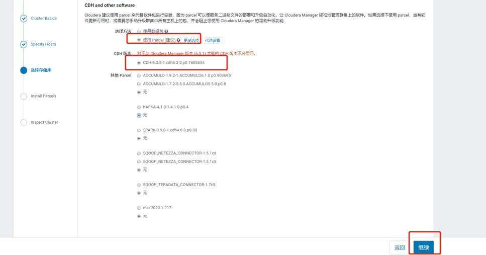
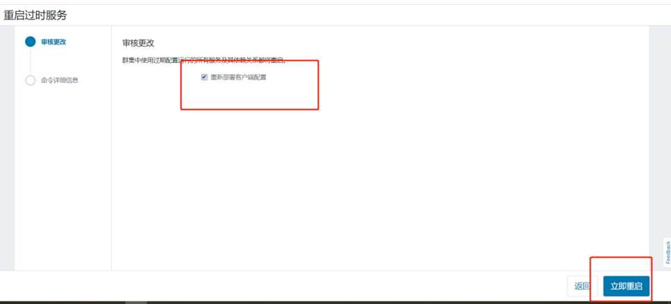
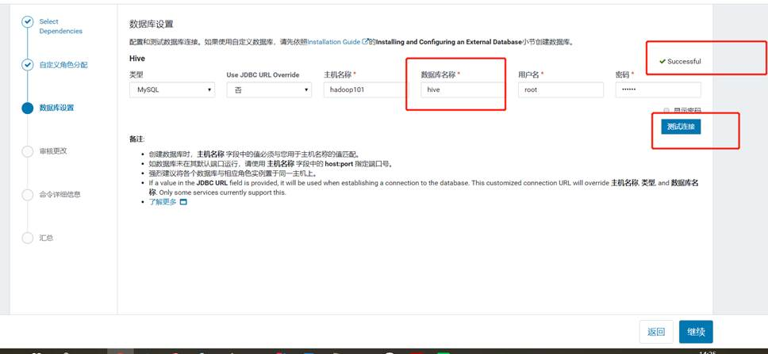
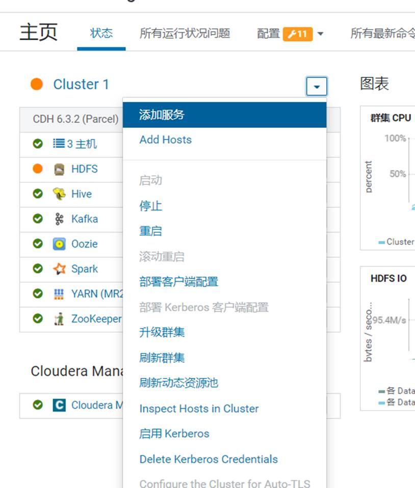

 

# 第1章     数仓之Cloudera Manager 

## 1.1 CM简介

### 1.1.1 CM简介

Cloudera Manager是一个拥有集群自动化安装、中心化管理、集群监控、报警功能的一个工具，使得安装集群从几天的时间缩短在几个小时内，运维人员从数十人降低到几人以内，极大的提高集群管理的效率。


### 1.1.2 CM架构


## 1.2 环境准备

### 1.2.1 虚拟机准备

克隆三台虚拟机（hadoop101、hadoop102、hadoop103），配置好对应主机的网络IP、主机名称、关闭防火墙。

设置hadoop101、hadoop102、hadoop103的主机对应内存分别是：8G、8G、8G

### 1.2.2 SSH免密登录

配置hadoop101对hadoop101、hadoop102、hadoop103三台服务器免密登录。CDH服务开启与关闭是通过server和agent来完成的，所以这里不需要配置SSH免密登录，但是为了我们分发文件方便，在这里我们也配置SSH。

1）生成公钥和私钥：

[root@hadoop101 .ssh]$ ssh-keygen -t rsa

然后敲（三个回车），就会生成两个文件id_rsa（私钥）、id_rsa.pub（公钥）

2）将公钥拷贝到要免密登录的目标机器上

[root@hadoop101 .ssh]$ ssh-copy-id hadoop101

[root@hadoop101 .ssh]$ ssh-copy-id hadoop102

[root@hadoop101 .ssh]$ ssh-copy-id hadoop103

3）重复1和2的操作，配置hadoop102，hadoop103对hadoop101、hadoop102、hadoop103三台服务器免密登录。

### 1.2.3安装JDK（重要）

需要使用官网提供的jdk

（1）在hadoop101的/opt目录下创建module和software文件夹

[root@hadoop101 opt]# mkdir module

[root@hadoop101 opt]# mkdir software

（2）上传oracle-j2sdk1.8-1.8.0+update181-1.x86_64.rpm并安装

[root@hadoop101 software]# rpm -ivh oracle-j2sdk1.8-1.8.0+update181-1.x86_64.rpm 

[root@hadoop101 software]# vim /etc/profile

export JAVA_HOME=/usr/java/jdk1.8.0_181-cloudera

export CLASSPATH=.:$CLASSPATH:$JAVA_HOME/lib

export PATH=$PATH:$JAVA_HOME/bin

[root@hadoop101 software]# source /etc/profile

[root@hadoop101 software]# java -version

java version "1.8.0_181"

（3）分发,并source

[root@hadoop101 software]# scp -r /usr/java/ hadoop102:/usr/

[root@hadoop101 software]# scp -r /usr/java/ hadoop103:/usr/

[root@hadoop101 software]# scp /etc/profile hadoop102:/etc/

[root@hadoop101 software]# scp /etc/profile hadoop103:/etc/

[root@hadoop102 module]# source /etc/profile

[root@hadoop102 module]# java -version

[root@hadoop103 module]# source /etc/profile

[root@hadoop103 module]# java -version

### 1.2.4 安装MySQL

注意：一定要用root用户操作如下步骤；先卸载MySQL再安装

**1** **）安装包准备**

（1）查看MySQL是否安装

[root@hadoop101 桌面]# rpm -qa|grep -i mysql

mysql-libs-5.1.73-7.el6.x86_64

（2）如果安装了MySQL，就先卸载

[root@hadoop101 桌面]# 

rpm -e --nodeps mysql-libs-5.1.73-7.el6.x86_64

（3）删除阿里云原有MySql依赖

[root@hadoop101 桌面]# yum remove mysql-libs

（4）下载MySql依赖并安装

[root@hadoop101 ~]# yum install libaio

[root@hadoop101 ~]# yum -y install autoconf

[root@hadoop101 software]# wget https://downloads.mysql.com/archives/get/p/23/file/MySQL-shared-compat-5.6.24-1.el6.x86_64.rpm

 

[root@hadoop101 software]# wget [https://downloads.mysql.com/archives/get/p/23/file/MySQL-shared-5.6.24-1.el6.x86_64.rpm](https://downloads.mysql.com/archives/get/file/MySQL-shared-5.6.24-1.el7.x86_64.rpm)

 

[root@hadoop101 software]# rpm -ivh MySQL-shared-5.6.24-1.el6.x86_64.rpm

[root@hadoop101 software]# rpm -ivh MySQL-shared-compat-5.6.24-1.el6.x86_64.rpm

（4）上传mysql-libs.zip到hadoop101的/opt/software目录，并解压文件到当前目录

[root@hadoop101 software]# yum install unzip

[root@hadoop101 software]# unzip mysql-libs.zip

[root@hadoop101 software]# ls

mysql-libs.zip

mysql-libs

​    （5）进入到mysql-libs文件夹下

 [root@hadoop101 mysql-libs]# ll

总用量 76048

-rw-r--r--. 1 root root 18509960 3月 26 2015 MySQL-client-5.6.24-1.el6.x86_64.rpm

-rw-r--r--. 1 root root 3575135 12月 1 2013 mysql-connector-java-5.1.27.tar.gz

-rw-r--r--. 1 root root 55782196 3月 26 2015 MySQL-server-5.6.24-1.el6.x86_64.rpm

**2** **）安装MySQL** **服务器**

（1）安装MySQL服务端

[root@hadoop101 mysql-libs]# rpm -ivh MySQL-server-5.6.24-1.el6.x86_64.rpm

（2）查看产生的随机密码

[root@hadoop101 mysql-libs]# cat /root/.mysql_secret

OEXaQuS8IWkG19Xs

（3）查看MySQL状态

[root@hadoop101 mysql-libs]# service mysql status

（4）启动MySQL

[root@hadoop101 mysql-libs]# service mysql start

**3** **）安装MySQL** **客户端**

（1）安装MySQL客户端

[root@hadoop101 mysql-libs]# rpm -ivh MySQL-client-5.6.24-1.el6.x86_64.rpm

（2）链接MySQL（密码替换成产生的随机密码）

[root@hadoop102 mysql-libs]# mysql -uroot -pOEXaQuS8IWkG19Xs

（3）修改密码

mysql>SET PASSWORD=PASSWORD('000000');

（4）退出MySQL

mysql>exit

**4** **）MySQL** **中user** **表中主机配置**

配置只要是root用户+密码，在任何主机上都能登录MySQL数据库。

（1）进入MySQL

[root@hadoop101 mysql-libs]# mysql -uroot -p000000

（2）显示数据库

mysql>show databases;

（3）使用MySQL数据库

mysql>use mysql;

（4）展示MySQL数据库中的所有表

mysql>show tables;

（5）展示user表的结构

mysql>desc user;

（6）查询user表

mysql>select User, Host, Password from user;

（7）修改user表，把Host表内容修改为%

mysql>update user set host='%' where host='localhost';

（8）删除root用户的其他host

mysql> delete from user where host!='%';

（9）刷新

mysql>flush privileges;

（10）退出

mysql>quit;

## 1.3 CM安装部署

### 1.3.1 MySQL中建库

1）创建各组件需要的数据库

mysql> GRANT ALL ON scm.* TO 'scm'@'%' IDENTIFIED BY 'scm';

 

mysql> CREATE DATABASE scm DEFAULT CHARACTER SET utf8 DEFAULT COLLATE utf8_general_ci;

mysql> CREATE DATABASE hive DEFAULT CHARSET utf8 COLLATE utf8_general_ci;

mysql> CREATE DATABASE oozie DEFAULT CHARSET utf8 COLLATE utf8_general_ci;

mysql> CREATE DATABASE hue DEFAULT CHARSET utf8 COLLATE utf8_general_ci;

 

### 1.3.2 CM安装

（1）将mysql-connector-java-5.1.27-bin.jar拷贝到**/usr/share/java**路径下，并**重命名**

[root@hadoop101 mysql-libs]# tar -zxvf mysql-connector-java-5.1.27.tar.gz 

[root@hadoop101 mysql-libs]# cd mysql-connector-java-5.1.27

[root@hadoop101 mysql-connector-java-5.1.27]# mv mysql-connector-java-5.1.27-bin.jar mysql-connector-java.jar

[root@hadoop101 mysql-connector-java-5.1.27]# mkdir /usr/share/java

[root@hadoop101 mysql-connector-java-5.1.27]# cp mysql-connector-java.jar /usr/share/java/

[root@hadoop101 mysql-connector-java-5.1.27]# scp -r /usr/share/java/ hadoop102:/usr/share/

[root@hadoop101 mysql-connector-java-5.1.27]# scp -r /usr/share/java/ hadoop103:/usr/share/

集群规划

| **节点** | **hadoop101**                           | **hadoop102**      | **hadoop103**      |
| -------- | --------------------------------------- | ------------------ | ------------------ |
| **服务** | cloudera-scm-server  cloudera-scm-agent | cloudera-scm-agent | cloudera-scm-agent |

（2）创建cloudera-manager目录,存放cdh安装文件

[root@hadoop101 mysql-connector-java-5.1.27]# mkdir /opt/cloudera-manager

[root@hadoop101 mysql-connector-java-5.1.27]# cd /opt/software/

[root@hadoop101 software]# tar -zxvf cm6.3.1-redhat7.tar.gz

[root@hadoop101 software]# cd cm6.3.1/RPMS/x86_64/

[root@hadoop101 x86_64]# mv cloudera-manager-agent-6.3.1-1466458.el7.x86_64.rpm /opt/cloudera-manager/

[root@hadoop101 x86_64]# mv cloudera-manager-server-6.3.1-1466458.el7.x86_64.rpm /opt/cloudera-manager/

[root@hadoop101 x86_64]# mv cloudera-manager-daemons-6.3.1-1466458.el7.x86_64.rpm /opt/cloudera-manager/

[root@hadoop101 x86_64]# cd /opt/cloudera-manager/

[root@hadoop101 cloudera-manager]# ll

total 1185876

-rw-r--r-- 1 2001 2001  10483568 Sep 25 2019 cloudera-manager-agent-6.3.1-1466458.el7.x86_64.rpm

-rw-r--r-- 1 2001 2001 1203832464 Sep 25 2019 cloudera-manager-daemons-6.3.1-1466458.el7.x86_64.rpm

-rw-r--r-- 1 2001 2001   11488 Sep 25 2019 cloudera-manager-server-6.3.1-1466458.el7.x86_64.rpm

（3）安装cloudera-manager-daemons,安装完毕后多出/opt/cloudera目录

[root@hadoop101 cloudera-manager]# rpm -ivh cloudera-manager-daemons-6.3.1-1466458.el7.x86_64.rpm 

[root@hadoop101 cloudera-manager]# cd /opt/cloudera

cloudera/     cloudera-manager/ 

[root@hadoop101 cloudera-manager]# cd ..

[root@hadoop101 opt]# scp -r /opt/cloudera-manager/ hadoop102:/opt/

[root@hadoop101 opt]# scp -r /opt/cloudera-manager/ hadoop103:/opt/

[root@hadoop102 ~]# cd /opt/cloudera-manager/

[root@hadoop102 cloudera-manager]# rpm -ivh cloudera-manager-daemons-6.3.1-1466458.el7.x86_64.rpm 

[root@hadoop103 ~]# cd /opt/cloudera-manager/

[root@hadoop103 cloudera-manager]# rpm -ivh cloudera-manager-daemons-6.3.1-1466458.el7.x86_64.rpm

（4）安装cloudera-manager-agent

[root@hadoop101 cloudera-manager]# yum install bind-utils psmisc cyrus-sasl-plain cyrus-sasl-gssapi fuse portmap fuse-libs /lib/lsb/init-functions httpd mod_ssl openssl-devel python-psycopg2 MySQL-python libxslt

[root@hadoop101 cloudera-manager]# rpm -ivh cloudera-manager-agent-6.3.1-1466458.el7.x86_64.rpm

[root@hadoop102 cloudera-manager]# yum install bind-utils psmisc cyrus-sasl-plain cyrus-sasl-gssapi fuse portmap fuse-libs /lib/lsb/init-functions httpd mod_ssl openssl-devel python-psycopg2 MySQL-python libxslt

[root@hadoop102 cloudera-manager]# rpm -ivh cloudera-manager-agent-6.3.1-1466458.el7.x86_64.rpm

[root@hadoop103 cloudera-manager]# yum install bind-utils psmisc cyrus-sasl-plain cyrus-sasl-gssapi fuse portmap fuse-libs /lib/lsb/init-functions httpd mod_ssl openssl-devel python-psycopg2 MySQL-python libxslt

[root@hadoop103 cloudera-manager]# rpm -ivh cloudera-manager-agent-6.3.1-1466458.el7.x86_64.rpm

（5）安装agent的server节点

[root@hadoop101 cloudera-manager]# vim /etc/cloudera-scm-agent/config.ini

server_host=hadoop101

[root@hadoop102 cloudera-manager]# vim /etc/cloudera-scm-agent/config.ini

server_host=hadoop101

[root@hadoop103 cloudera-manager]# vim /etc/cloudera-scm-agent/config.ini

server_host=hadoop101

（6）安装cloudera-manager-server

[root@hadoop101 cloudera-manager]# rpm -ivh cloudera-manager-server-6.3.1-1466458.el7.x86_64.rpm 

（7）上传CDH包导parcel-repo

[root@hadoop101 parcel-repo]# pwd

/opt/cloudera/parcel-repo

[root@hadoop101 parcel-repo]# ll

total 2033432

-rw-r--r-- 1 root root 2082186246 May 21 11:10 CDH-6.3.2-1.cdh6.3.2.p0.1605554-el7.parcel

-rw-r--r-- 1 root root     40 May 21 10:56 CDH-6.3.2-1.cdh6.3.2.p0.1605554-el7.parcel.sha1

-rw-r--r-- 1 root root   33887 May 21 10:56 manifest.json

[root@hadoop101 parcel-repo]# mv CDH-6.3.2-1.cdh6.3.2.p0.1605554-el7.parcel.sha1 CDH-6.3.2-1.cdh6.3.2.p0.1605554-el7.parcel.sha

（8）修改server的db.properties

[root@hadoop101 parcel-repo]# vim /etc/cloudera-scm-server/db.properties 

com.cloudera.cmf.db.type=mysql

com.cloudera.cmf.db.host=hadoop101:3306

com.cloudera.cmf.db.name=scm

com.cloudera.cmf.db.user=scm

com.cloudera.cmf.db.password=scm

com.cloudera.cmf.db.setupType=EXTERNAL

（9）启动server服务

[root@hadoop101 log]# /opt/cloudera/cm/schema/scm_prepare_database.sh mysql scm scm

[root@hadoop101 software]# systemctl start cloudera-scm-server 

（10）启动agent节点

[root@hadoop101 software]# systemctl start cloudera-scm-agent

[root@hadoop102 software]# systemctl start cloudera-scm-agent

[root@hadoop103 software]# systemctl start cloudera-scm-agent

## 1.4 CM的集群部署

### 1.4.1 接受条款和协议


### 1.4.2 集群安装

 


 

### 1.4.3 指定主机


### 1.4.4 选择CDH版本6.3.2



### 1.4.5 等待下载安装


### 1.4.6检查网络性能，检查主机


[root@hadoop101 software]# echo never > /sys/kernel/mm/transparent_hugepage/defrag

[root@hadoop101 software]# echo never > /sys/kernel/mm/transparent_hugepage/enabled

[root@hadoop102 software]# echo never > /sys/kernel/mm/transparent_hugepage/defrag

[root@hadoop102 software]# echo never > /sys/kernel/mm/transparent_hugepage/enabled

[root@hadoop103 software]# echo never > /sys/kernel/mm/transparent_hugepage/defrag

[root@hadoop103 software]# echo never > /sys/kernel/mm/transparent_hugepage/enabled


### 1.4.7群集设置


第2章 数仓之数据采集模块

## 2.1 HDFS、YARN、Zookeeper安装

### 2.1.1 选择自定义安装


### 2.1.2 选择安装服务


### 2.1.3 分配节点


### 2.1.4 集群设置全部选默认即可


### 2.1.5 自动启动进程


 

### 2.1.6 修改HDFS的权限检查配置

关闭HDFS中的权限检查：dfs.permissions。





2.1.7 配置NameNode HA

1）进入HDFS页面点击启用High Availability


2）命名


3）分配角色


4）审核更改


5）等待启动服务


2.1.8 配置Yarn HA


2.3 Kafka安装

可以选择在线安装和离线包安装，在线安装下载时间较长，离线包安装时间较短。这里我们为了节省时间，选择离线安装。

2.3.1 Kafka安装

3） 回到首页，点击添加服务


4）选择Kafka，点击继续


5）Kafka的Broker选择三台机器


 

 

2.3.2查看Kafka Topic

[root@hadoop101 parcel-repo]# /opt/cloudera/parcels/CDH/bin/kafka-topics --zookeeper hadoop102:2181 --list

2.3.3 创建 Kafka Topic

进入到/opt/cloudera/parcels/KAFKA目录下分别创建：启动日志主题、事件日志主题。

1）创建topic test

[root@hadoop101 parcel-repo]# /opt/cloudera/parcels/CDH/bin/kafka-topics --bootstrap-server hadoop101:9092,hadoop102:9092,hadoop103:9092 --create --replication-factor 1 --partitions 1 --topic test

### 2.3.4 删除 Kafka Topic

1）删除启动日志主题

[root@hadoop101 parcel-repo]# /opt/cloudera/parcels/CDH/bin/kafka-topics --delete --bootstrap-server hadoop101:9092,hadoop102:9092,hadoop103:9092--topic test

# 第3章 数仓之数仓搭建环境准备

## 3.1 Hive安装

3.1.1 添加服务


3.1.2 添加Hive服务


3.1.3 将 Hive 服务添加到 Cluster 1


3.1.4 配置hive元数据



3.1.5 测试通过后继续

 


3.1.6 自动启动Hive进程


# 第4章 Spark安装

CDH6.x自带spark2.4无需升级 

## 4.1安装spark


# 第5章其它配置

## 5.1 HDFS配置域名访问

 在阿里云环境下 Hadoop集群必须用域名访问，不能用IP访问，开启如下配置dfs.client.use.datanode.hostname


## 5.2 设置物理核和虚拟核占比

 当前购买的阿里云配置物理核一共为6核，为演示效果将虚拟核扩大1倍，一般真实场景下物理核和虚拟核对比值为1:1或1:2

修改配置，每台机器物理核2核虚拟成4核

yarn.nodemanager.resource.cpu-vcores


## 5.3修改单个容器下最大cpu申请资源

修改yarn.scheduler.maximum-allocation-vcores参数调整4核


 

## 5.4 设置每个任务容器内存大小和单节点大小

  将每个任务容器默认大小从1G调大至4G，当前集群环境下每个节点的物理内存为8G，设置每个yarn可用每个节点内存为7G

 修改yarn.scheduler.maximum-allocation-mb 每个任务容器内存所需大小


 

 修改yarn.nodemanager.resource.memory-mb每个节点内存所需大小


 

## 5.5 关闭Spark动态分配资源参数

关闭spark.dynamicAllocation.enabled 参数否则分配的资源不受控制


 


## 5.6 修改HDFS副本数

  修改副本数为1


## 5.7 设置容量调度器

CDH默认公平调度器，修改为容量调度器


默认root队列，可以进行修改,添加3个队列spark,hive,flink，spark资源设置占yarn集群40%,hive设置占yarn集群20%,flink设置占40%

 


 

配置完毕后重启服务，到yarn界面查看调度器,已经发生变化有hive队列和spark队列


# 第6章 配置OOZIE


# 第7章 配置HUE




 


# 第8章 配置KUDU


 

# 第9章 配置Impala


 

# 第10章 编译Flink（可选）

## 10.1 安装maven

（1）在103机器上进行安装,创建software文件夹，并解压

```
[root@hadoop103 ~]# mkdir /opt/software

[root@hadoop103 ~]# cd /opt/software/

[root@hadoop103 software]# tar -zxvf apache-maven-3.6.1-bin.tar.gz -C /opt/module/
```

（2）添加环境变量,在profile文件结尾添加以下内容

```
/opt/module/apache-maven-3.6.1

[root@hadoop103 software]# vim /etc/profile

\#MAVEN_HOME

export MAVEN_HOME=/opt/module/apache-maven-3.6.1

export PATH=$PATH:$MAVEN_HOME/bin

[root@hadoop103 software]# source /etc/profile
```

（3）测试安装结果

```
[root@hadoop103 software]# mvn -v

Apache Maven 3.6.1 (d66c9c0b3152b2e69ee9bac180bb8fcc8e6af555; 2019-04-05T03:00:29+08:00)

Maven home: /opt/module/apache-maven-3.6.1

Java version: 1.8.0_211, vendor: Oracle Corporation, runtime: /opt/module/jdk1.8.0_211/jre

Default locale: zh_CN, platform encoding: UTF-8

OS name: "linux", version: "3.10.0-862.el7.x86_64", arch: "amd64", family: "unix"
```

（4）配置镜像,注意添加miroor镜像一定要在mirrors标签内，否则无效

```
[root@hadoop102 software]# cd /opt/module/apache-maven-3.6.1/conf/

[root@hadoop102 conf]# vim settings.xml    

 <!-- 阿里云仓库 -->

​     <mirror>

​      <id>alimaven</id>

​      <name>aliyun maven</name>

​      <url>http://maven.aliyun.com/nexus/content/repositories/central/</url>

​      <mirrorOf>central</mirrorOf>

​    </mirror>

​    <mirror>

​      <id>nexus-aliyun</id>

​      <name>aliyun maven</name>

​      <url>http://maven.aliyun.com/nexus/content/groups/public/</url>

​      <mirrorOf>central</mirrorOf>

​    </mirror>

​    <!-- Maven中央仓库中国镜像 -->

​    <mirror>

​      <id>maven cn repo</id>

​      <name>oneof the central mirrors in china</name>

​      <url>http://maven.net.cn/content/groups/public/</url>

​      <mirrorOf>central</mirrorOf>

​    </mirror>

​    <mirror>

​      <id>maven repo</id>

​      <name>Maven Repository Switchboard</name>

​      <url>http://repo1.maven.org/maven2/</url>

​      <mirrorOf>central</mirrorOf>

​    </mirror>

​    <mirror>

​      <id>maven repo2</id>

​       <mirrorOf>central</mirrorOf>

​      <name>Human Readable Name for this Mirror.</name>

​      <url>http://repo2.maven.org/maven2/</url>

​    </mirror>
```

 

 

 

## 10.2 编译flink-shaed

（1）上传flink-shaded-10.0-src.tgz到/opt/software,并解压

```
[root@hadoop103 software]# tar -zxvf flink-shaded-10.0-src.tgz -C /opt/module/

[root@hadoop103 software]# cd /opt/module/flink-shaded-10.0/
```

（2）修改pom.xml 添加以下内容

```
[root@hadoop103 flink-shaded-10.0]# vim pom.xml 

   <repositories>

​    <repository>

​      <id>cloudera repo</id>

​      <url>https://repository.cloudera.com/artifactory/cloudera-repos/</url>

​    </repository>

​    <repository>

​      <id>mvn repo</id>

​      <url>https://mvnrepository.com</url>

​    </repository>

  </repositories>
```

（3）修flink-shaded-hadoop-2-parent的pom.xml 添加以下内容，需要加在dependencies标签里

```
[root@hadoop103 flink-shaded-10.0]# cd flink-shaded-hadoop-2-parent/

[root@hadoop103 flink-shaded-hadoop-2-parent]# vim pom.xml 

<dependency>

​      <groupId>commons-cli</groupId>

​      <artifactId>commons-cli</artifactId>

​      <version>1.3.1</version>

​     </dependency>
```

（4）执行编译

```
[root@hadoop103 flink-shaded-hadoop-2-parent]# cd /opt/module/flink-shaded-10.0/

[root@hadoop103 flink-shaded-10.0]# mvn -T10C clean install -Dhadoop.versioin=3.0.0-cdh6.3.2
```


## 10.3 编译flink1.10.1

（1）上传flink-10.0-src.tgz到/opt/software,并解压

[root@hadoop103 software]# tar -zxvf flink-1.10.1-src.tgz -C /opt/module/

（2）修改flink-10的/flink-yarn/pom.xml文件,添加以下内容,要加在plugins标签里

```
[root@hadoop103 software]# cd /opt/module/flink-1.10.1/

[root@hadoop103 flink-1.10.1]# vim flink-yarn/pom.xml 

<plugin>

​    <groupId>org.apache.maven.plugins</groupId>

​    <artifactId>maven-compiler-plugin</artifactId>

​    <version>3.8.0</version>

​    <configuration>

​      <source>${java.version}</source>

​      <target>${java.version}</target>

​      <skip>true</skip>

​      <!-- The semantics of this option are reversed, see MCOMPILER-209. -->

​      <useIncrementalCompilation>false</useIncrementalCompilation>

​      <compilerArgs>

​        <!-- Prevents recompilation due to missing package-info.class, see MCOMPILER-205 -->  

​        <arg>-Xpkginfo:always</arg>

​      </compilerArgs>

​    </configuration>

  </plugin>
```

（3）修改flink-1.10 pom.xml 

```
[root@hadoop103 flink-1.10.1]# vim pom.xml 

<flink.shaded.version>10.0</flink.shaded.version>
```

（4）编译

```
[root@hadoop103 flink-1.10.1]# yum install npm

[root@hadoop103 flink-1.10.1]# npm update

[root@hadoop103 flink-1.10.1]# mvn -T10C clean package -DskipTests -Pvendor-repos -Dhadoop.version=3.0.0-cdh6.3.2 -Dscala-2.11 -Pinclude-hadoop
```


（5）将编译好的flink复制到software

```
[root@hadoop103 flink-1.10.1]# cp -r flink-dist/target/flink-1.10.1-bin/ /opt/software/
```


# 第11章 安装Flink

## 11.1启动Flink

（1）上传编译好的flink,存放到/opt/module下

```
[root@hadoop103 software]# mv flink-1.10.1/ /opt/module/
```

（2）编辑flink-conf.yaml 

```
[root@hadoop103 flink-1.10.1]# vim conf/flink-conf.yaml 

jobmanager.rpc.address: hadoop103

jobmanager.rpc.port: 6123

jobmanager.heap.size: 2048m

state.savepoints.dir: hdfs://nameservice1/flink/savepoint

jobmanager.execution.failover-strategy: region

rest.port: 8081

web.submit.enable: true

env.java.home: /opt/module/jdk1.8.0_211

env.java.opts: -XX:+UseConcMarkSweepGC -XX:+PrintGCDetails -XX:-UseGCOverheadLimit -XX:+HeapDumpOnOutOfMemoryError -XX:HeapDumpPath=/tmp/wormhole/gc

yarn.application-attempts: 2
```

（3）配置环境变量

```
[root@hadoop103 flink-1.10.1]# vim /etc/profile

\#FLINK_HOME

export FLINK_HOME=/opt/module/flink-1.10.1

export PATH=$PATH:$FLINK_HOME/bin

[root@hadoop103 flink-1.10.1]# source /etc/profile

[root@hadoop103 flink-1.10.1]# chmod +777 bin/*.sh

[root@hadoop103 flink-1.10.1]# chmod +777 bin/flink
```

（4）启动yan-session

```
[root@hadoop103 flink-1.10.1]# bin/yarn-session.sh --queue flink
```

（5）查看对应地址


# 第12章 实时数仓准备工作

## 12.1表模型

（1）宽表


（2）基础表


## 12.2创建对应topic

```
[root@hadoop101 ~]# kafka-topics --zookeeper hadoop102:2181 --create --replication-factor 2 --partitions 3 --topic basewebsite

[root@hadoop101 ~]# kafka-topics --zookeeper hadoop102:2181 --create --replication-factor 2 --partitions 3 --topic basead

[root@hadoop101 ~]# kafka-topics --zookeeper hadoop102:2181 --create --replication-factor 2 --partitions 10 --topic member

[root@hadoop101 ~]# kafka-topics --zookeeper hadoop102:2181 --create --replication-factor 2 --partitions 10 --topic memberpaymoney

[root@hadoop101 ~]# kafka-topics --zookeeper hadoop102:2181 --create --replication-factor 2 --partitions 10 --topic memberregtype

[root@hadoop101 ~]# kafka-topics --zookeeper hadoop102:2181 --create --replication-factor 2 --partitions 3 --topic membervip

[root@hadoop101 ~]# kafka-topics --zookeeper hadoop102:2181 --create --replication-factor 2 --partitions 10 --topic dwdmember

[root@hadoop101 ~]# kafka-topics --zookeeper hadoop102:2181 --create --replication-factor 2 --partitions 10 --topic dwdmemberpaymoney

[root@hadoop101 ~]# kafka-topics --zookeeper hadoop102:2181 --create --replication-factor 2 --partitions 10 --topic dwdmemberregtype
```


## 12.3创建对应kudu表

```
[root@hadoop101 ~]# impala-shell 

[hadoop101:21000] default> create database education;

[hadoop101:21000] default> use education

[hadoop101:21000] education> create table dws_member(

id string primary key,

uid int,

ad_id int,

fullname string,

iconurl string,

mailaddr string,

memberlevel string,

password string,

phone string,

qq string,

register string,

regupdatetime string,

unitname string,

userip string,

zipcode string,

appkey string,

appregurl string,

bdp_uuid string,

regsource string,

adname string,

siteid int,

sitename string,

siteurl string,

site_delete string,

site_createtime string,

site_creator string,

vip_id int,

vip_level string,

vip_start_time timestamp,

vip_end_time timestamp,

vip_last_modify_time timestamp,

vip_max_free string,

vip_min_free string,

vip_operator string,

paymoney decimal(12,4),

dt string,

dn string)

PARTITION BY HASH PARTITIONS 16

STORED AS KUDU;

[hadoop101:21000] education> create table dwd_vip_level(

​              vip_id int,

​              dn string,

​              vip_level string,

​              start_time timestamp,

​               end_time timestamp,

​              last_modify_time timestamp,

​              max_free string,

​              min_free string,

​              next_level string,

​              operator string,

​              primary key(vip_id,dn))

​              STORED AS KUDU;

[hadoop101:21000] education> create table dwd_base_ad(

​              adid int ,

​              dn string,

​              adname string,

​              primary key(adid,dn))

​              stored as kudu;

[hadoop101:21000] education> create table dwd_base_website(

​              site_id int,

​              dn string,

​              sitename string,

​              siteurl string,

​              `delete` int,

​              createtime string,

​              creator string,

​              primary key(site_id,dn))

​              stored as kudu;
```


## 12.4配置kudu安全网

配置安全网域，-trusted_subnets=0.0.0.0/0，让ide可以外部访问


# 第13章编写代码

## 13.1构建项目

(1)采用官方通过maven构建的项目的方式，首先保证本机配置了maven环境变量


（2）构建项目

mvn archetype:generate   -DarchetypeGroupId=org.apache.flink  -DarchetypeArtifactId=flink-quickstart-scala  -DarchetypeVersion=1.10.0


 

（3）输入相应pom配置信息后，通过ide打开项目

 


 

## 13.2配置pom.xml    

（1）需要替换原有build工具，让项目支持既能打包java代码，又能打包scala代码

```
<?xml version="1.0" encoding="UTF-8"?>
<project xmlns="http://maven.apache.org/POM/4.0.0"
         xmlns:xsi="http://www.w3.org/2001/XMLSchema-instance"
         xsi:schemaLocation="http://maven.apache.org/POM/4.0.0 http://maven.apache.org/xsd/maven-4.0.0.xsd">
    <modelVersion>4.0.0</modelVersion>

    <groupId>com.atguigu.education-flink</groupId>
    <artifactId>education-flink-online</artifactId>
    <version>1.0-SNAPSHOT</version>
    <packaging>jar</packaging>

    <properties>
        <project.build.sourceEncoding>UTF-8</project.build.sourceEncoding>
        <flink.version>1.10.0</flink.version>
        <scala.binary.version>2.11</scala.binary.version>
        <scala.version>2.11.12</scala.version>
    </properties>

    <dependencies>
        <!-- Apache Flink dependencies -->
        <!-- These dependencies are provided, because they should not be packaged into the JAR file. -->
        <dependency>
            <groupId>org.apache.flink</groupId>
            <artifactId>flink-scala_${scala.binary.version}</artifactId>
            <version>${flink.version}</version>
        </dependency>
        <dependency>
            <groupId>org.apache.flink</groupId>
            <artifactId>flink-streaming-scala_${scala.binary.version}</artifactId>
            <version>${flink.version}</version>
        </dependency>

        <dependency>
            <groupId>org.apache.flink</groupId>
            <artifactId>flink-statebackend-rocksdb_${scala.binary.version}</artifactId>
            <version>${flink.version}</version>
        </dependency>
        <!-- Scala Library, provided by Flink as well. -->
        <dependency>
            <groupId>org.scala-lang</groupId>
            <artifactId>scala-library</artifactId>
<!--            <scope>provided</scope>-->
            <version>${scala.version}</version>
        </dependency>
        <!-- https://mvnrepository.com/artifact/com.alibaba/fastjson -->
        <dependency>
            <groupId>com.alibaba</groupId>
            <artifactId>fastjson</artifactId>
            <version>1.2.68</version>
        </dependency>

        <dependency>
            <groupId>org.apache.flink</groupId>
            <artifactId>flink-connector-kafka-0.10_${scala.binary.version}</artifactId>
            <version>${flink.version}</version>
        </dependency>

        <dependency>
            <groupId>org.apache.flink</groupId>
            <artifactId>flink-scala_2.11</artifactId>
<!--            <scope>provided</scope>-->
            <version>1.10.0</version>
        </dependency>
        <dependency>
            <groupId>org.apache.flink</groupId>
            <artifactId>flink-streaming-scala_2.11</artifactId>
            <version>1.10.0</version>
        </dependency>
        <dependency>
            <groupId>org.apache.flink</groupId>
            <artifactId>flink-clients_2.11</artifactId>
            <version>1.10.0</version>
        </dependency>
        <!-- https://mvnrepository.com/artifact/org.apache.hbase/hbase-server -->
        <dependency>
            <groupId>org.apache.hbase</groupId>
            <artifactId>hbase-server</artifactId>
            <version>2.2.4</version>
        </dependency>
        <!-- https://mvnrepository.com/artifact/org.apache.hbase/hbase-client -->
        <dependency>
            <groupId>org.apache.hbase</groupId>
            <artifactId>hbase-client</artifactId>
            <version>2.2.4</version>
        </dependency>

        <!-- https://mvnrepository.com/artifact/com.google.guava/guava -->
        <dependency>
            <groupId>com.google.guava</groupId>
            <artifactId>guava</artifactId>
            <version>29.0-jre</version>
        </dependency>
        <dependency>
            <groupId>org.apache.flink</groupId>
            <artifactId>flink-runtime-web_2.11</artifactId>
<!--            <scope>provided</scope>-->
            <version>${flink.version}</version>
        </dependency>
        <!-- Add connector dependencies here. They must be in the default scope (compile). -->

        <dependency>
            <groupId>com.alibaba</groupId>
            <artifactId>druid</artifactId>
            <scope>provided</scope>
            <version>1.1.16</version>
        </dependency>

        <!-- https://mvnrepository.com/artifact/org.apache.kudu/kudu-client -->
        <dependency>
            <groupId>org.apache.kudu</groupId>
            <artifactId>kudu-client</artifactId>
            <version>1.10.0</version>
        </dependency>
<!--        <dependency>-->
<!--            <groupId>org.postgresql</groupId>-->
<!--            <artifactId>postgresql</artifactId>-->
<!--            <version>42.2.12</version>-->
<!--        </dependency>-->

        <!-- Example:

        <dependency>
            <groupId>org.apache.flink</groupId>
            <artifactId>flink-connector-kafka-0.10_${scala.binary.version}</artifactId>
            <version>${flink.version}</version>
        </dependency>
        -->

        <!-- Add logging framework, to produce console output when running in the IDE. -->
        <!-- These dependencies are excluded from the application JAR by default. -->
<!--        <dependency>-->
<!--            <groupId>org.slf4j</groupId>-->
<!--            <artifactId>slf4j-log4j12</artifactId>-->
<!--            <version>1.7.7</version>-->
<!--            <scope>runtime</scope>-->
<!--        </dependency>-->
<!--        <dependency>-->
<!--            <groupId>log4j</groupId>-->
<!--            <artifactId>log4j</artifactId>-->
<!--            <version>1.2.17</version>-->
<!--            <scope>runtime</scope>-->
<!--        </dependency>-->
    </dependencies>

    <build>
        <plugins>
            <plugin >
                <groupId>org.apache.maven.plugins</groupId>
                <artifactId>maven-compiler-plugin</artifactId>
                <version>3.6.1</version>
                <!-- 所有的编译都依照JDK1.8来搞 -->
                <configuration>
                    <source>1.8</source>
                    <target>1.8</target>
                </configuration>
            </plugin>

            <plugin>
                <groupId>org.scala-tools</groupId>
                <artifactId>maven-scala-plugin</artifactId>
                <version>2.15.1</version>
                <executions>
                    <execution>
                        <id>compile-scala</id>
                        <goals>
                            <goal>add-source</goal>
                            <goal>compile</goal>
                        </goals>
                    </execution>
                    <execution>
                        <id>test-compile-scala</id>
                        <goals>
                            <goal>add-source</goal>
                            <goal>testCompile</goal>
                        </goals>
                    </execution>
                </executions>
            </plugin>
            <plugin>
                <groupId>org.apache.maven.plugins</groupId>
                <artifactId>maven-assembly-plugin</artifactId>
                <configuration>
                    <archive>
                        <manifest>
                        </manifest>
                    </archive>
                    <descriptorRefs>
                        <descriptorRef>jar-with-dependencies</descriptorRef>
                    </descriptorRefs>
                </configuration>
            </plugin>
            <plugin>
                <groupId>net.alchim31.maven</groupId>
                <artifactId>scala-maven-plugin</artifactId>
                <version>3.2.2</version>
                <executions>
                    <execution>
                        <!-- 声明绑定到maven的compile阶段 -->
                        <goals>
                            <goal>compile</goal>
                            <goal>testCompile</goal>
                        </goals>
                    </execution>
                </executions>
            </plugin>

            <!-- 用于项目的打包插件 -->
            <plugin>
                <groupId>org.apache.maven.plugins</groupId>
                <artifactId>maven-assembly-plugin</artifactId>
                <version>3.0.0</version>
                <executions>
                    <execution>
                        <id>make-assembly</id>
                        <phase>package</phase>
                        <goals>
                            <goal>single</goal>
                        </goals>
                    </execution>
                </executions>
            </plugin>
        </plugins>
    </build>
</project>

```


## 13.3编写生产者代码

(1) 模拟数据收集，编写kafka生产者代码，对应6张表6个topic，所以编写 6个生产者代码

### 13.3.1广告基础信息表

```
package com.atguigu.education.kafkaproducer;
 
 import com.alibaba.fastjson.JSON;
 import org.apache.kafka.clients.producer.KafkaProducer;
 import org.apache.kafka.clients.producer.ProducerRecord;
 
 import java.util.Properties;
 
 public class BaseAdLogKafkaProducer {
   public static void main(String[] args) {
     Properties props = new Properties();
     props.put("bootstrap.servers", "hadoop101:9092,hadoop102:9092,hadoop103:9092");
     props.put("acks", "-1");
     props.put("batch.size", "16384");
     props.put("linger.ms", "10");
     props.put("buffer.memory", "33554432");
     props.put("key.serializer",
         "org.apache.kafka.common.serialization.StringSerializer");
     props.put("value.serializer",
         "org.apache.kafka.common.serialization.StringSerializer");
     KafkaProducer<String, String> producer = new KafkaProducer<String, String>(props);
     for (int i = 0; i < 10; i++) {
       GdmBaseAd gdmBaseAd = GdmBaseAdLog.generateLog(String.valueOf(i));
       String jsonString = JSON.toJSONString(gdmBaseAd);
       producer.send(new ProducerRecord<String, String>("basead", jsonString));
     }
     producer.flush();
     producer.close();
   }
 
   public static class GdmBaseAd {
     private String adid;
     private String adname;
     private String dn;
 
     public String getAdid() {
       return adid;
     }
 
     public void setAdid(String adid) {
       this.adid = adid;
     }
 
     public String getAdname() {
       return adname;
     }
 
     public void setAdname(String adname) {
       this.adname = adname;
     }
 
     public String getDn() {
       return dn;
     }
 
     public void setDn(String dn) {
       this.dn = dn;
     }
   }
 
   public static class GdmBaseAdLog {
     public static GdmBaseAd generateLog(String adid) {
       GdmBaseAd basead = new GdmBaseAd();
       basead.setAdid(adid);
       basead.setAdname("注册弹窗广告" + adid);
       basead.setDn("webA");
       return basead;
     }
   }
 }
```


### 13.3.2用户基础表

```
package com.atguigu.education.kafkaproducer;
 
 import com.alibaba.fastjson.JSON;
 import org.apache.kafka.clients.producer.KafkaProducer;
 import org.apache.kafka.clients.producer.ProducerRecord;
 
 import java.text.SimpleDateFormat;
 import java.time.LocalDateTime;
 import java.time.format.DateTimeFormatter;
 import java.util.Properties;
 import java.util.Random;
 
 public class BaseMemberKafkaProducer {
   public static void main(String[] args) {
     Properties props = new Properties();
     props.put("bootstrap.servers", "hadoop101:9092,hadoop102:9092,hadoop103:9092");
     props.put("acks", "-1");
     props.put("batch.size", "16384");
     props.put("linger.ms", "10");
     props.put("buffer.memory", "33554432");
     props.put("key.serializer",
         "org.apache.kafka.common.serialization.StringSerializer");
     props.put("value.serializer",
         "org.apache.kafka.common.serialization.StringSerializer");
     KafkaProducer<String, String> producer = new KafkaProducer<String, String>(props);
     for (int i = 0; i < 1000000; i++) {
       GdmMember gdmMember = MemberLog.generateLog(String.valueOf(i));
       String jsonString = JSON.toJSONString(gdmMember);
       producer.send(new ProducerRecord<String, String>("member", jsonString));
     }
     producer.flush();
     producer.close();
   }
 
   public static class GdmMember {
 
     private String uid; //用户id
     private String password; //密码
     private String email;
     private String username; //用户名
     private String fullname; //用户名
     private String birthday;
     private String phone;
     private String qq;
     private String ad_id;
     private String unitname;
     private String mailaddr;
     private String zipcode;
     private String kjlevel;
     private String register;
     private String memberlevel;
     private String paymoney;
     private String userip;
     private String regupdatetime;
     private String lastlogin;
     private String iconurl;
     private String dt;
     private String dn;
 
 
     public String getFullname() {
       return fullname;
     }
 
     public void setFullname(String fullname) {
       this.fullname = fullname;
     }
 
     public String getUid() {
       return uid;
     }
 
     public void setUid(String uid) {
       this.uid = uid;
     }
 
     public String getPassword() {
       return password;
     }
 
     public void setPassword(String password) {
       this.password = password;
     }
 
     public String getEmail() {
       return email;
     }
 
     public void setEmail(String email) {
       this.email = email;
     }
 
     public String getUsername() {
       return username;
     }
 
     public void setUsername(String username) {
       this.username = username;
     }
 
     public String getBirthday() {
       return birthday;
     }
 
     public void setBirthday(String birthday) {
       this.birthday = birthday;
     }
 
     public String getPhone() {
       return phone;
     }
 
     public void setPhone(String phone) {
       this.phone = phone;
     }
 
     public String getQq() {
       return qq;
     }
 
     public void setQq(String qq) {
       this.qq = qq;
     }
 
     public String getAd_id() {
       return ad_id;
     }
 
     public void setAd_id(String ad_id) {
       this.ad_id = ad_id;
     }
 
     public String getUnitname() {
       return unitname;
     }
 
     public void setUnitname(String unitname) {
       this.unitname = unitname;
     }
 
     public String getMailaddr() {
       return mailaddr;
     }
 
     public void setMailaddr(String mailaddr) {
       this.mailaddr = mailaddr;
     }
 
     public String getZipcode() {
       return zipcode;
     }
 
     public void setZipcode(String zipcode) {
       this.zipcode = zipcode;
     }
 
     public String getKjlevel() {
       return kjlevel;
     }
 
     public void setKjlevel(String kjlevel) {
       this.kjlevel = kjlevel;
     }
 
     public String getRegister() {
       return register;
     }
 
     public void setRegister(String register) {
       this.register = register;
     }
 
     public String getMemberlevel() {
       return memberlevel;
     }
 
     public void setMemberlevel(String memberlevel) {
       this.memberlevel = memberlevel;
     }
 
     public String getPaymoney() {
       return paymoney;
     }
 
     public void setPaymoney(String paymoney) {
       this.paymoney = paymoney;
     }
 
     public String getUserip() {
       return userip;
     }
 
     public void setUserip(String userip) {
       this.userip = userip;
     }
 
     public String getRegupdatetime() {
       return regupdatetime;
     }
 
     public void setRegupdatetime(String regupdatetime) {
       this.regupdatetime = regupdatetime;
     }
 
     public String getLastlogin() {
       return lastlogin;
     }
 
     public void setLastlogin(String lastlogin) {
       this.lastlogin = lastlogin;
     }
 
     public String getIconurl() {
       return iconurl;
     }
 
     public void setIconurl(String iconurl) {
       this.iconurl = iconurl;
     }
 
     public String getDn() {
       return dn;
     }
 
     public void setDn(String dn) {
       this.dn = dn;
     }
 
     public String getDt() {
       return dt;
     }
 
     public void setDt(String dt) {
       this.dt = dt;
     }
   }
 
   public static class MemberLog {
 
 
     private static String[] dns = new String[]{"webA", "webB", "webC"};
     private static String[] type = new String[]{"insert", "update"};
     private static int[][] range = {{607649792, 608174079},//36.56.0.0-36.63.255.255
         {1038614528, 1039007743},//61.232.0.0-61.237.255.255
         {1783627776, 1784676351},//106.80.0.0-106.95.255.255
         {2035023872, 2035154943},//121.76.0.0-121.77.255.255
         {2078801920, 2079064063},//123.232.0.0-123.235.255.255
         {-1950089216, -1948778497},//139.196.0.0-139.215.255.255
         {-1425539072, -1425014785},//171.8.0.0-171.15.255.255
         {-1236271104, -1235419137},//182.80.0.0-182.92.255.255
         {-770113536, -768606209},//210.25.0.0-210.47.255.255
         {-569376768, -564133889}, //222.16.0.0-222.95.255.255
     };
 
     public static GdmMember generateLog(String uid) {
       GdmMember member = new GdmMember();
       Random rand = new Random();
       member.setAd_id(rand.nextInt(10) + "");
       String birthday = new SimpleDateFormat("yyyy-MM-dd")
           .format(RondomDate.randomDate("1960-01-01 00:00:00", "2000-01-01 00:00:00"));
       member.setDt(DateTimeFormatter.ofPattern("yyyyMMdd").format(LocalDateTime.now().minusDays(8)));
       member.setDn(dns[0]);
       member.setUid(uid);
       member.setPassword("123456");
       member.setEmail("test@126.com");
       member.setFullname("王" + uid);
       member.setPhone("13711235451");
       member.setBirthday(birthday);
       member.setQq("10000");
       member.setUnitname("-");
       member.setMailaddr("-");
       member.setZipcode("-");
 //      String registerdata = new SimpleDateFormat("yyyy-MM-dd HH:mm:ss")
 //          .format(RondomDate.randomDate("2019-06-30 10:00:00", "2019-06-30 11:00:00"));
       member.setRegister(String.valueOf(System.currentTimeMillis()));
       member.setMemberlevel((rand.nextInt(8) + 1) + "");
       member.setPaymoney("-");
       member.setUserip("-");
       int index = rand.nextInt(10);
       String ip = num2ip(range[index][0]
           \+ new Random().nextInt(range[index][1] - range[index][0]));
       member.setUserip(ip);
       member.setRegupdatetime("-");
       member.setLastlogin("-");
       member.setIconurl("-");
       return member;
     }
 
     public static String num2ip(int ip) {
       int[] b = new int[4];
       String x = "";
 
       b[0] = (int) ((ip >> 24) & 0xff);
       b[1] = (int) ((ip >> 16) & 0xff);
       b[2] = (int) ((ip >> 8) & 0xff);
       b[3] = (int) (ip & 0xff);
       x = Integer.toString(b[0]) + "." + Integer.toString(b[1]) + "."
           \+ Integer.toString(b[2]) + "." + Integer.toString(b[3]);
 
       return x;
     }
   }
 }
```


### 13.3.3用户支付金额表

```
package com.atguigu.education.kafkaproducer;
 
 import com.alibaba.fastjson.JSON;
 import org.apache.kafka.clients.producer.KafkaProducer;
 import org.apache.kafka.clients.producer.ProducerRecord;
 
 import java.text.DecimalFormat;
 import java.text.SimpleDateFormat;
 import java.time.LocalDateTime;
 import java.time.format.DateTimeFormatter;
 import java.util.Properties;
 import java.util.Random;
 import java.util.concurrent.BlockingQueue;
 import java.util.concurrent.LinkedBlockingDeque;
 
 public class BaseMemberPayMoney {
   //创建池
   public static BlockingQueue<KafkaProducer<String, String>> queue = new LinkedBlockingDeque<>(10);
 
 
   public static void main(String[] args) {
 
     Properties props = new Properties();
     props.put("bootstrap.servers", "hadoop101:9092,hadoop102:9092,hadoop103:9092");
     props.put("acks", "-1");
     props.put("batch.size", "16384");
     props.put("linger.ms", "10");
     props.put("buffer.memory", "33554432");
     props.put("key.serializer",
         "org.apache.kafka.common.serialization.StringSerializer");
     props.put("value.serializer",
         "org.apache.kafka.common.serialization.StringSerializer");
     KafkaProducer<String, String> producer = new KafkaProducer<String, String>(props);
     for (int i = 0; i < 1000000; i++) {
       GdmPcenterMemPaymoney memPaymoney = GdmPcenterMemPayMoneyLog.generateLog(String.valueOf(i));
       String jsonString = JSON.toJSONString(memPaymoney);
       producer.send(new ProducerRecord<String, String>("memberpaymoney", jsonString));
     }
     producer.flush();
     producer.close();
   }
 
   public static class GdmPcenterMemPaymoney {
 
     private String uid;
     private String paymoney;
     private String vip_id;
     private String updatetime;
     private String siteid;
     private String dt;
     private String dn;
     private String createtime;
 
     public String getCreatetime() {
       return createtime;
     }
 
     public void setCreatetime(String createtime) {
       this.createtime = createtime;
     }
 
     public String getDt() {
       return dt;
     }
 
     public void setDt(String dt) {
       this.dt = dt;
     }
 
     public String getUid() {
       return uid;
     }
 
     public void setUid(String uid) {
       this.uid = uid;
     }
 
     public String getPaymoney() {
       return paymoney;
     }
 
     public void setPaymoney(String paymoney) {
       this.paymoney = paymoney;
     }
 
     public String getVip_id() {
       return vip_id;
     }
 
     public void setVip_id(String vip_id) {
       this.vip_id = vip_id;
     }
 
     public String getUpdatetime() {
       return updatetime;
     }
 
     public void setUpdatetime(String updatetime) {
       this.updatetime = updatetime;
     }
 
     public String getSiteid() {
       return siteid;
     }
 
     public void setSiteid(String siteid) {
       this.siteid = siteid;
     }
 
     public String getDn() {
       return dn;
     }
 
     public void setDn(String dn) {
       this.dn = dn;
     }
   }
 
   public static class GdmPcenterMemPayMoneyLog {
 
     public static GdmPcenterMemPaymoney generateLog(String uid) {
       GdmPcenterMemPaymoney memPaymoney = new GdmPcenterMemPaymoney();
       Random random = new Random();
       DecimalFormat df = new DecimalFormat("0.00");
       double money = random.nextDouble() * 1000;
       memPaymoney.setPaymoney(df.format(money));
       memPaymoney.setDt(DateTimeFormatter.ofPattern("yyyyMMdd").format(LocalDateTime.now().minusDays(8)));
       memPaymoney.setDn("webA");
       memPaymoney.setSiteid(String.valueOf(random.nextInt(5)));
       memPaymoney.setVip_id(String.valueOf(random.nextInt(5)));
       memPaymoney.setUid(uid);
 //      String registerdata = new SimpleDateFormat("yyyy-MM-dd HH:mm:ss")
 //          .format(RondomDate.randomDate("2019-06-30 10:00:00", "2019-06-30 11:00:00"));
       memPaymoney.setCreatetime(String.valueOf(System.currentTimeMillis()));
       return memPaymoney;
     }
 
   }
 }
```


### 13.3.4用户注册跳转地址表

```
package com.atguigu.education.kafkaproducer;
 
 import com.alibaba.fastjson.JSON;
 import org.apache.kafka.clients.producer.KafkaProducer;
 import org.apache.kafka.clients.producer.ProducerRecord;
 
 import java.text.SimpleDateFormat;
 import java.time.LocalDateTime;
 import java.time.format.DateTimeFormatter;
 import java.util.Properties;
 import java.util.Random;
 
 public class BaseMemberRegtypeProducer {
 
   public static void main(String[] args) {
     Properties props = new Properties();
     props.put("bootstrap.servers", "hadoop101:9092,hadoop102:9092,hadoop103:9092");
     props.put("acks", "-1");
     props.put("batch.size", "16384");
     props.put("linger.ms", "10");
     props.put("buffer.memory", "33554432");
     props.put("key.serializer",
         "org.apache.kafka.common.serialization.StringSerializer");
     props.put("value.serializer",
         "org.apache.kafka.common.serialization.StringSerializer");
     KafkaProducer<String, String> producer = new KafkaProducer<String, String>(props);
     for (int i = 0; i < 1000000; i++) {
       GdmMemberRegType memberRegType = GdmMemberRegTypeLog.generateLog(String.valueOf(i), "webA");
       String jsonString = JSON.toJSONString(memberRegType);
       producer.send(new ProducerRecord<String, String>("memberregtype", jsonString));
     }
     producer.flush();
     producer.close();
   }
 
   public static class GdmMemberRegTypeLog {
 
     private static String[] webAappregUrl = new String[]{
         "http:www.webA.com/product/register/index.html", "http:www.webA.com/sale/register/index.html",
         "http:www.webA.com/product10/register/aa/index.html",
         "http:www.webA.com/hhh/wwww/index.html"};
     private static String[] webBappregUrl = new String[]{
         "http:www.webB.com/product/register/index.html", "http:www.webB.com/sale/register/index.html",
         "http:www.webB.com/hhh/wwww/index.html"};
     private static String[] webcappregUrl = new String[]{
         "http:www.webC.com/product/register/index.html", "http:www.webB.com/sale/register/index.html",
         "http:www.webC.com/product52/register/ac/index.html"};
 
 
     public static GdmMemberRegType generateLog(String uid, String dn) {
       GdmMemberRegType memberRegType = new GdmMemberRegType();
       memberRegType.setAppkey("-");
       Random random = new Random();
       String url = "";
       int index = random.nextInt(4);
       switch (dn) {
         case "webA":
           url = webAappregUrl[index];
           break;
         case "webB":
           url = webBappregUrl[index];
           break;
         case "webC":
           url = webcappregUrl[index];
           break;
       }
       memberRegType.setAppregurl(url);
       memberRegType.setBdp_uuid("-");
 //      String createTime = new SimpleDateFormat("yyyy-MM-dd HH:mm:ss")
 //          .format(RondomDate.randomDate("2019-06-30 10:00:00", "2019-06-30 11:00:00"));
       memberRegType.setCreatetime(String.valueOf(System.currentTimeMillis()));
       memberRegType.setDt(DateTimeFormatter.ofPattern("yyyyMMdd").format(LocalDateTime.now().minusDays(8)));
       memberRegType.setDn(dn);
       memberRegType.setDomain("-");
       memberRegType.setIsranreg("-");
       memberRegType.setDomain("-");
       memberRegType.setWebsiteid(String.valueOf(random.nextInt(5)));
       memberRegType.setRegsource(String.valueOf(random.nextInt(5)));
       memberRegType.setUid(uid);
       return memberRegType;
     }
   }
 
   public static class GdmMemberRegType {
 
     private String reflagid;
     private String uid;
     private String regsource; //注册来源 1.pc 2.mobile 3.app 4.wechat
     private String appkey;
     private String appregurl;
     private String websiteid;
     private String domain;
     private String isranreg;
     private String bdp_uuid;
     private String createtime;
     private String dt;
     private String dn;
 
 
     public String getDt() {
       return dt;
     }
 
     public void setDt(String dt) {
       this.dt = dt;
     }
 
     public String getReflagid() {
       return reflagid;
     }
 
     public void setReflagid(String reflagid) {
       this.reflagid = reflagid;
     }
 
     public String getUid() {
       return uid;
     }
 
     public void setUid(String uid) {
       this.uid = uid;
     }
 
     public String getRegsource() {
       return regsource;
     }
 
     public void setRegsource(String regsource) {
       this.regsource = regsource;
     }
 
     public String getAppkey() {
       return appkey;
     }
 
     public void setAppkey(String appkey) {
       this.appkey = appkey;
     }
 
     public String getAppregurl() {
       return appregurl;
     }
 
     public void setAppregurl(String appregurl) {
       this.appregurl = appregurl;
     }
 
     public String getWebsiteid() {
       return websiteid;
     }
 
     public void setWebsiteid(String websiteid) {
       this.websiteid = websiteid;
     }
 
     public String getDomain() {
       return domain;
     }
 
     public void setDomain(String domain) {
       this.domain = domain;
     }
 
     public String getIsranreg() {
       return isranreg;
     }
 
     public void setIsranreg(String isranreg) {
       this.isranreg = isranreg;
     }
 
     public String getBdp_uuid() {
       return bdp_uuid;
     }
 
     public void setBdp_uuid(String bdp_uuid) {
       this.bdp_uuid = bdp_uuid;
     }
 
     public String getCreatetime() {
       return createtime;
     }
 
     public void setCreatetime(String createtime) {
       this.createtime = createtime;
     }
 
     public String getDn() {
       return dn;
     }
 
     public void setDn(String dn) {
       this.dn = dn;
     }
   }
 
 }
```


### 13.3.5 Vip级别基础表

```
package com.atguigu.education.kafkaproducer;
 
 import com.alibaba.fastjson.JSON;
 import org.apache.kafka.clients.producer.KafkaProducer;
 import org.apache.kafka.clients.producer.ProducerRecord;
 
 import java.text.SimpleDateFormat;
 import java.util.Properties;
 
 public class BaseMemberVipProducer {
 
     public static void main(String[] args) {
       Properties props = new Properties();
       props.put("bootstrap.servers", "hadoop101:9092,hadoop102:9092,hadoop103:9092");
       props.put("acks", "-1");
       props.put("batch.size", "16384");
       props.put("linger.ms", "10");
       props.put("buffer.memory", "33554432");
       props.put("key.serializer",
           "org.apache.kafka.common.serialization.StringSerializer");
       props.put("value.serializer",
           "org.apache.kafka.common.serialization.StringSerializer");
       KafkaProducer<String, String> producer = new KafkaProducer<String, String>(props);
       for (int i = 0; i < 5; i++) {
         GdmPcenterMemViplevel memViplevel= GdmPcenterMemViplevelLog.generateLog(String.valueOf(i));
         String jsonString = JSON.toJSONString(memViplevel);
         producer.send(new ProducerRecord<String, String>("membervip", jsonString));
       }
       producer.flush();
       producer.close();
   }
   public static class GdmPcenterMemViplevelLog {
 
     private static String[] vipLevels = new String[]{"普通会员", "白金", "银卡", "金卡", "钻石"};
 
     public static GdmPcenterMemViplevel generateLog(String vipid) {
       GdmPcenterMemViplevel memViplevel = new GdmPcenterMemViplevel();
       memViplevel.setDiscountval("-");
       memViplevel.setDn("webA");
       String time = new SimpleDateFormat("yyyy-MM-dd HH:mm:ss")
           .format(RondomDate.randomDate("2015-01-01 00:00:00", "2016-06-30 00:00:00"));
       String time2 = new SimpleDateFormat("yyyy-MM-dd HH:mm:ss")
           .format(RondomDate.randomDate("2016-01-01 00:00:00", "2019-06-30 00:00:00"));
       memViplevel.setLast_modify_time("");
       memViplevel.setStart_time(time);
       memViplevel.setEnd_time(time2);
       memViplevel.setLast_modify_time(time2);
       memViplevel.setMax_free("-");
       memViplevel.setMin_free("-");
       memViplevel.setNext_level("-");
       memViplevel.setVip_id(vipid);
       memViplevel.setOperator("update");
       memViplevel.setVip_level(vipLevels[Integer.parseInt(vipid)]);
       return memViplevel;
     }
 
   }
   public static class GdmPcenterMemViplevel {
 
     private String vip_id;
     private String vip_name;
     private String vip_level;
     private String min_free;
     private String max_free;
     private String start_time;
     private String end_time;
     private String next_level;
     private String discountval;
     private String last_modify_time;
     private String operator;
     private String siteid;
     private String dn;
 
     public String getVip_id() {
       return vip_id;
     }
 
     public void setVip_id(String vip_id) {
       this.vip_id = vip_id;
     }
 
     public String getVip_name() {
       return vip_name;
     }
 
     public void setVip_name(String vip_name) {
       this.vip_name = vip_name;
     }
 
     public String getVip_level() {
       return vip_level;
     }
 
     public void setVip_level(String vip_level) {
       this.vip_level = vip_level;
     }
 
     public String getMin_free() {
       return min_free;
     }
 
     public void setMin_free(String min_free) {
       this.min_free = min_free;
     }
 
     public String getMax_free() {
       return max_free;
     }
 
     public void setMax_free(String max_free) {
       this.max_free = max_free;
     }
 
     public String getStart_time() {
       return start_time;
     }
 
     public void setStart_time(String start_time) {
       this.start_time = start_time;
     }
 
     public String getEnd_time() {
       return end_time;
     }
 
     public void setEnd_time(String end_time) {
       this.end_time = end_time;
     }
 
     public String getNext_level() {
       return next_level;
     }
 
     public void setNext_level(String next_level) {
       this.next_level = next_level;
     }
 
     public String getDiscountval() {
       return discountval;
     }
 
     public void setDiscountval(String discountval) {
       this.discountval = discountval;
     }
 
     public String getLast_modify_time() {
       return last_modify_time;
     }
 
     public void setLast_modify_time(String last_modify_time) {
       this.last_modify_time = last_modify_time;
     }
 
     public String getOperator() {
       return operator;
     }
 
     public void setOperator(String operator) {
       this.operator = operator;
     }
 
     public String getSiteid() {
       return siteid;
     }
 
     public void setSiteid(String siteid) {
       this.siteid = siteid;
     }
 
     public String getDn() {
       return dn;
     }
 
     public void setDn(String dn) {
       this.dn = dn;
     }
   }
 
 }
```


### 13.3.6网站信息基础表

```
package com.atguigu.education.kafkaproducer;
 
 import com.alibaba.fastjson.JSON;
 import org.apache.kafka.clients.producer.KafkaProducer;
 import org.apache.kafka.clients.producer.ProducerRecord;
 
 import java.util.Properties;
 import java.util.Random;
 
 public class BaseWebSiteKafkaProducer {
   public static void main(String[] args) {
     Properties props = new Properties();
     props.put("bootstrap.servers", "hadoop101:9092,hadoop102:9092,hadoop103:9092");
     props.put("acks", "-1");
     props.put("batch.size", "16384");
     props.put("linger.ms", "10");
     props.put("buffer.memory", "33554432");
     props.put("key.serializer",
         "org.apache.kafka.common.serialization.StringSerializer");
     props.put("value.serializer",
         "org.apache.kafka.common.serialization.StringSerializer");
     KafkaProducer<String, String> producer = new KafkaProducer<String, String>(props);
     for (int i = 0; i < 5; i++) {
       GdmBaseWebsite gdmBaseWebsite = GdmBaseWebSieLog.generateLog(String.valueOf(i), "webA");
       String jsonString = JSON.toJSONString(gdmBaseWebsite);
       producer.send(new ProducerRecord<String, String>("basewebsite", jsonString));
     }
     for (int i = 0; i < 5; i++) {
       GdmBaseWebsite gdmBaseWebsite = GdmBaseWebSieLog.generateLog(String.valueOf(i), "webB");
       String jsonString = JSON.toJSONString(gdmBaseWebsite);
       producer.send(new ProducerRecord<String, String>("basewebsite", jsonString));
     }
     for (int i = 0; i < 5; i++) {
       GdmBaseWebsite gdmBaseWebsite = GdmBaseWebSieLog.generateLog(String.valueOf(i), "webC");
       String jsonString = JSON.toJSONString(gdmBaseWebsite);
       producer.send(new ProducerRecord<String, String>("basewebsite", jsonString));
     }
     producer.flush();
     producer.close();
   }
   public static class GdmBaseWebsite {
 
     private String siteid;
     private String sitename;
     private String siteurl;
     private String creator;
     private String createtime;
     private String delete;
     private String dn;
 
     public String getSiteid() {
       return siteid;
     }
 
     public void setSiteid(String siteid) {
       this.siteid = siteid;
     }
 
     public String getSitename() {
       return sitename;
     }
 
     public void setSitename(String sitename) {
       this.sitename = sitename;
     }
 
     public String getSiteurl() {
       return siteurl;
     }
 
     public void setSiteurl(String siteurl) {
       this.siteurl = siteurl;
     }
 
     public String getCreator() {
       return creator;
     }
 
     public void setCreator(String creator) {
       this.creator = creator;
     }
 
     public String getCreatetime() {
       return createtime;
     }
 
     public void setCreatetime(String createtime) {
       this.createtime = createtime;
     }
 
     public String getDelete() {
       return delete;
     }
 
     public void setDelete(String delete) {
       this.delete = delete;
     }
 
     public String getDn() {
       return dn;
     }
 
     public void setDn(String dn) {
       this.dn = dn;
     }
   }
   public static class GdmBaseWebSieLog {
 
     private static String[] siteNames = new String[]{"百度", "163", "114", "126", "谷歌"};
     private static String[] siteUrls = new String[]{"wwww.baidu.com", "www.163.com", "www.114.com",
         "www.126.com", "www.google.com"};
 
     public static GdmBaseWebsite generateLog(String siteid, String dn) {
       GdmBaseWebsite baseWebsite = new GdmBaseWebsite();
       Random rand = new Random();
       baseWebsite.setCreatetime("2000-01-01");
       baseWebsite.setDelete("0");
       baseWebsite.setSiteid(siteid);
       baseWebsite.setCreator("admin");
       baseWebsite.setDn(dn);
       int index = Integer.parseInt(siteid);
       baseWebsite.setSitename(siteNames[index]);
       baseWebsite.setSiteurl(siteUrls[index] + "/" + dn);
       return baseWebsite;
     }
   }
 }
```

 

编写完代码后，点击运行向对应的topic发送数据，注意：用户基础表、用户支付金额表、用户跳转地址表 三表最好同时发送保证延迟误差不是太高

## 13.4编写case class

（1）编写case class用于flink序列化与反序列化

 

```
package com.atguigu.education.model
 
 case class DwdMemberPayMoney(uid: Int, var paymoney: String, siteid: Int, vip_id: Int, createtime: String, dt: String, dn: String)
```

 

```
package com.atguigu.education.model
 
 case class BaseViplevel(vip_id: Int, vip_level: String, start_time: String,
             end_time: String, last_modify_time: String, max_free: String,
             min_free: String, next_level: String, operator: String, dn: String)

 
```

```
package com.atguigu.education.model
 
 case class BaseWebSite(siteid: Int, sitename: String, siteurl: String, delete: String, createtime: String, creator: String, dn: String)
```

 

```
package com.atguigu.education.model
 
 case class DwdMember(uid: Int, ad_id: Int, birthday: String, email: String, fullname: String, iconurl: String,
           lastlogin: String, mailaddr: String, memberlevel: String, password: String, paymoney: String, phone: String,
           qq: String, register: String, regupdatetime: String, unitname: String, userip: String, zipcode: String, dt: String,
            dn: String)
 
```

 

```
package com.atguigu.education.model
 
 case class DwdMemberPayMoney(uid: Int, var paymoney: String, siteid: Int, vip_id: Int, createtime: String, dt: String, dn: String)

 
```

```
package com.atguigu.education.model
 
 case class DwdMemberRegtype(uid: Int, appkey: String, appregurl: String, bdp_uuid: String, createtime: String,
               isranreg: String, regsource: String, websiteid: String, dt: String, dn: String)
```

 

```
package com.atguigu.education.model
 
 case class TopicAndValue(topic:String,value:String)
```


## 13.5编写flink source与sink的反序列化类和序列化类

```
package com.atguigu.education.model
 
 import java.nio.charset.Charset
 
 import org.apache.flink.streaming.util.serialization.KeyedSerializationSchema
 
 
 class DwdKafkaProducerSerializationSchema extends KeyedSerializationSchema[TopicAndValue] {
  val serialVersionUID = 1351665280744549933L;
 
  override def serializeKey(element: TopicAndValue): Array[Byte] = null
 
  override def serializeValue(element: TopicAndValue): Array[Byte] = {
   element.value.getBytes(Charset.forName("utf-8"))
  }
 
  override def getTargetTopic(element: TopicAndValue): String = {
   "dwd" + element.topic
  }
 }
```

 

```
package com.atguigu.education.model
 
 import com.google.gson.Gson
 import org.apache.flink.api.common.typeinfo.{TypeHint, TypeInformation}
 import org.apache.flink.streaming.connectors.kafka.KafkaDeserializationSchema
 import org.apache.kafka.clients.consumer.ConsumerRecord
 
 class DwdMemberDeserializationSchema extends KafkaDeserializationSchema[DwdMember] {
  override def isEndOfStream(nextElement: DwdMember): Boolean = false
 
  override def deserialize(record: ConsumerRecord[Array[Byte], Array[Byte]]): DwdMember = {
   val gson = new Gson()
   gson.fromJson(new String(record.value(), "utf-8"), classOf[DwdMember])
  }
 
  override def getProducedType: TypeInformation[DwdMember] = {
   TypeInformation.of(new TypeHint[DwdMember] {})
  }
 }
```

 

```
package com.atguigu.education.model
 
 import com.google.gson.Gson
 import org.apache.flink.api.common.typeinfo.{TypeHint, TypeInformation}
 import org.apache.flink.streaming.connectors.kafka.KafkaDeserializationSchema
 import org.apache.kafka.clients.consumer.ConsumerRecord
 
 class DwdMemberPayMoneyDeserializationSchema extends KafkaDeserializationSchema[DwdMemberPayMoney] {
  override def isEndOfStream(nextElement: DwdMemberPayMoney): Boolean = false
 
  override def deserialize(record: ConsumerRecord[Array[Byte], Array[Byte]]): DwdMemberPayMoney = {
   val gson = new Gson()
   gson.fromJson(new String(record.value(), "utf-8"), classOf[DwdMemberPayMoney])
  }
 
  override def getProducedType: TypeInformation[DwdMemberPayMoney] = {
   TypeInformation.of(new TypeHint[DwdMemberPayMoney] {})
  }
 }

 
```


```
package com.atguigu.education.model
 
 import com.google.gson.Gson
 import org.apache.flink.api.common.typeinfo.{TypeHint, TypeInformation}
 import org.apache.flink.streaming.connectors.kafka.KafkaDeserializationSchema
 import org.apache.kafka.clients.consumer.ConsumerRecord
 
 class DwdMemberRegtypeDeserializationSchema extends KafkaDeserializationSchema[DwdMemberRegtype] {
  override def isEndOfStream(nextElement: DwdMemberRegtype): Boolean = false
 
  override def deserialize(record: ConsumerRecord[Array[Byte], Array[Byte]]): DwdMemberRegtype = {
   val gson = new Gson()
   gson.fromJson(new String(record.value(), "utf-8"), classOf[DwdMemberRegtype])
  }
 
  override def getProducedType: TypeInformation[DwdMemberRegtype] = {
   TypeInformation.of(new TypeHint[DwdMemberRegtype] {})
  }
 }
```

 

```
package com.atguigu.education.model
 
 import org.apache.flink.api.common.typeinfo.{TypeHint, TypeInformation}
 import org.apache.flink.streaming.connectors.kafka.KafkaDeserializationSchema
 import org.apache.kafka.clients.consumer.ConsumerRecord
 
 class TopicAndValueDeserializationSchema extends KafkaDeserializationSchema[TopicAndValue] {
  //表是流最后一条元素
  override def isEndOfStream(t: TopicAndValue): Boolean = {
   false
  }
 
  override def deserialize(consumerRecord: ConsumerRecord[Array[Byte], Array[Byte]]): TopicAndValue = {
   new TopicAndValue(consumerRecord.topic(), new String(consumerRecord.value(), "utf-8"))
  }
 
  //告诉flink 数据类型
  override def getProducedType: TypeInformation[TopicAndValue] = {
   TypeInformation.of(new TypeHint[TopicAndValue] {})
  }
 }
```

 

## 13.6编写实时数仓ods层处理

### 13.6.1工具类

package com.atguigu.education.util;
 
 import com.alibaba.fastjson.JSON;
 import com.alibaba.fastjson.JSONObject;
 
 
 public class ParseJsonData {
 
   public static JSONObject getJsonData(String data) {
     try {
 
       return JSONObject.parseObject(data);
     } catch (Exception e) {
       return null;
     }
   }
 
   public static String getJsonString(Object o) {
     return JSON.toJSONString(o);
   }
 }

### 13.6.2编写ods逻辑

（1）flink监控多个topic，先对topic中数据进行过滤，使用侧输出流将维度表数据和事实表数据区分开，维度表写入kudu表中，事实表写入第二层kafka topic

```
package com.atguigu.education.etl
 
 import java.util.Properties
 
 import com.alibaba.fastjson.JSONObject
 import com.atguigu.education.model.{DwdKafkaProducerSerializationSchema, GlobalConfig, TopicAndValue, TopicAndValueDeserializationSchema}
 import com.atguigu.education.util.ParseJsonData
 import org.apache.flink.api.common.restartstrategy.RestartStrategies
 import org.apache.flink.api.common.time.Time
 import org.apache.flink.api.java.utils.ParameterTool
 import org.apache.flink.contrib.streaming.state.RocksDBStateBackend
 import org.apache.flink.runtime.state.StateBackend
 import org.apache.flink.streaming.api.environment.CheckpointConfig
 import org.apache.flink.streaming.api.functions.ProcessFunction
 import org.apache.flink.streaming.api.scala.{StreamExecutionEnvironment, _}
 import org.apache.flink.streaming.api.{CheckpointingMode, TimeCharacteristic}
 import org.apache.flink.streaming.connectors.kafka.{FlinkKafkaConsumer010, FlinkKafkaProducer010}
 import org.apache.flink.util.Collector
 
 //flink run -m yarn-cluster -ynm odsetldata -p 12 -ys 4 -yjm 1024 -ytm 2048m -d -c com.atguigu.education.etl.OdsEtlData -yqu flink ./education-flink-online-1.0-SNAPSHOT-jar-with-dependencies.jar --group.id test --bootstrap.servers hadoop101:9092,hadoop102:9092,hadoop103:9092 --topic basewebsite,basead,member,memberpaymoney,memberregtype,membervip
 
 //--group.id test --bootstrap.servers hadoop101:9092,hadoop102:9092,hadoop103:9092 --topic basewebsite,basead,member,memberpaymoney,memberregtype,membervip
 object OdsEtlData {
  val BOOTSTRAP_SERVERS = "bootstrap.servers"
  val GROUP_ID = "group.id"
  val RETRIES = "retries"
  val TOPIC = "topic"
 
  def main(args: Array[String]): Unit = {
   val params = ParameterTool.fromArgs(args)
   //  val env = StreamExecutionEnvironment.getExecutionEnvironment
   val env = StreamExecutionEnvironment.createLocalEnvironmentWithWebUI()
   env.getConfig.setGlobalJobParameters(params)
   env.setStreamTimeCharacteristic(TimeCharacteristic.EventTime) //设置时间模式为事件时间
 
   //checkpoint设置
   env.enableCheckpointing(60000l) //1分钟做一次checkpoint
   val checkpointConfig = env.getCheckpointConfig
   checkpointConfig.setCheckpointingMode(CheckpointingMode.EXACTLY_ONCE) //仅仅一次
   checkpointConfig.setMinPauseBetweenCheckpoints(30000l) //设置checkpoint间隔时间30秒
   checkpointConfig.setCheckpointTimeout(10000l) //设置checkpoint超时时间
   checkpointConfig.enableExternalizedCheckpoints(CheckpointConfig.ExternalizedCheckpointCleanup.RETAIN_ON_CANCELLATION) //cancel时保留checkpoint
   //设置statebackend 为rockdb
   //  val stateBackend: StateBackend = new RocksDBStateBackend("hdfs://nameservice1/flink/checkpoint")
   //  env.setStateBackend(stateBackend)
 
   //设置重启策略  重启3次 间隔10秒
   env.setRestartStrategy(RestartStrategies.fixedDelayRestart(3, Time.seconds(10)))
   import scala.collection.JavaConverters._
   val topicList = params.get(TOPIC).split(",").toBuffer.asJava
   val consumerProps = new Properties()
   consumerProps.setProperty(BOOTSTRAP_SERVERS, params.get(BOOTSTRAP_SERVERS))
   consumerProps.setProperty(GROUP_ID, params.get(GROUP_ID))
   val kafaEventSource = new FlinkKafkaConsumer010[TopicAndValue](topicList, new TopicAndValueDeserializationSchema, consumerProps)
   kafaEventSource.setStartFromEarliest()
 
   val dataStream = env.addSource(kafaEventSource).filter(item => {
    //先过滤非json数据
    val obj = ParseJsonData.getJsonData(item.value)
    obj.isInstanceOf[JSONObject]
   })
   //将dataStream拆成两份 一份维度表写到hbase 另一份事实表数据写到第二层kafka
 //  val sideOutHbaseTag = new OutputTag[TopicAndValue]("hbaseSinkStream")
   //  val sideOutGreenPlumTag = new OutputTag[TopicAndValue]("greenplumSinkStream")
     val sideOutKuduTag = new OutputTag[TopicAndValue]("kuduSinkStream")
   val result = dataStream.process(new ProcessFunction[TopicAndValue, TopicAndValue] {
    override def processElement(value: TopicAndValue, ctx: ProcessFunction[TopicAndValue, TopicAndValue]#Context, out: Collector[TopicAndValue]): Unit = {
     value.topic match {
      case "basead" | "basewebsite" | "membervip" => ctx.output(sideOutKuduTag, value)
      case _ => out.collect(value)
     }
    }
   })
   //侧输出流得到 需要写入kudu的数据
   result.getSideOutput(sideOutKuduTag).addSink(new DwdKuduSink)
   //  //  //事实表数据写入第二层kafka
   result.addSink(new FlinkKafkaProducer010[TopicAndValue](GlobalConfig.BOOTSTRAP_SERVERS, "", new DwdKafkaProducerSerializationSchema))
   env.execute()
  }
 }
```


### 13.6.3编写kudu sink

（1）维度表为广告基础信息表、Vip级别基础表、网站信息基础表,三表数据分别写入对用kudu表中

```
package com.atguigu.education.etl
 
 import java.sql.Timestamp
 
 import com.atguigu.education.model.{BaseAd, BaseViplevel, BaseWebSite, GlobalConfig, TopicAndValue}
 import com.google.gson.Gson
 import org.apache.flink.configuration.Configuration
 import org.apache.flink.streaming.api.functions.sink.{RichSinkFunction, SinkFunction}
 import org.apache.kudu.client.{KuduClient, KuduSession, KuduTable}
 
 class DwdKuduSink extends RichSinkFunction[TopicAndValue] {
  var kuduClient: KuduClient = _
  var kuduSession: KuduSession = _
  var dwdBaseadTable: KuduTable = _
  var dwdBaseWebSiteTable: KuduTable = _
  var dwdVipLevelTable: KuduTable = _
 
  override def open(parameters: Configuration): Unit = {
   kuduClient = new KuduClient.KuduClientBuilder(GlobalConfig.KUDU_MASTER).build()
   kuduSession = kuduClient.newSession()
   kuduSession.setTimeoutMillis(60000)
   dwdBaseadTable = kuduClient.openTable(GlobalConfig.KUDU_TABLE_DWDBASEAD)
   dwdBaseWebSiteTable = kuduClient.openTable(GlobalConfig.KUDU_TABLE_DWDBASEWEBSITE)
   dwdVipLevelTable = kuduClient.openTable(GlobalConfig.KUDU_TABLE_DWDVIPLEVEL)
  }
 
  override def close(): Unit = {
   kuduSession.close()
   kuduClient.close()
  }
 
  override def invoke(value: TopicAndValue, context: SinkFunction.Context[_]): Unit = {
   value.topic match {
    case "basewebsite" => invokeBaseWebSite(value)
    case "basead" => invokeBaseBaseAd(value)
    case _ => invokeBaseVipLevel(value)
   }
  }
 
  def invokeBaseWebSite(value: TopicAndValue): Unit = {
   val gson = new Gson()
   val basewebsite = gson.fromJson(value.value, classOf[BaseWebSite])
   val upsert = dwdBaseWebSiteTable.newUpsert()
   val row = upsert.getRow
   row.addInt("site_id", basewebsite.siteid)
   row.addString("sitename", basewebsite.sitename)
   row.addString("siteurl", basewebsite.siteurl)
   row.addInt("delete", basewebsite.delete.toInt)
   row.addString("createtime", basewebsite.createtime)
   row.addString("creator", basewebsite.creator)
   row.addString("dn", basewebsite.dn)
   kuduSession.apply(upsert)
  }
 
  def invokeBaseBaseAd(value: TopicAndValue): Unit = {
   val gson = new Gson()
   val basead = gson.fromJson(value.value, classOf[BaseAd])
   val upsert = dwdBaseadTable.newUpsert()
   val row = upsert.getRow
   row.addInt("adid", basead.adid)
   row.addString("adname", basead.adname)
   row.addString("dn", basead.dn)
   kuduSession.apply(upsert)
  }
 
  def invokeBaseVipLevel(value: TopicAndValue): Unit = {
   val gson = new Gson()
   val baseViplevel = gson.fromJson(value.value, classOf[BaseViplevel])
   val upsert = dwdVipLevelTable.newUpsert()
   val row = upsert.getRow
   row.addInt("vip_id", baseViplevel.vip_id)
   row.addString("vip_level", baseViplevel.vip_level)
   row.addTimestamp("start_time", Timestamp.valueOf(baseViplevel.start_time))
   row.addTimestamp("end_time", Timestamp.valueOf(baseViplevel.end_time))
   row.addTimestamp("last_modify_time", Timestamp.valueOf(baseViplevel.last_modify_time))
   row.addString("max_free", baseViplevel.max_free)
   row.addString("min_free", baseViplevel.min_free)
   row.addString("next_level", baseViplevel.next_level)
   row.addString("operator", baseViplevel.operator)
   row.addString("dn", baseViplevel.dn)
   kuduSession.apply(upsert)
  }
 
 }
```

 

### 13.6.4编写kafka sink

（1）重写TargetTopic方法，此方法就是要发往的topic名称，拼上前缀各ods层topic发往对应dwd层topic

package com.atguigu.education.model
 
 import java.nio.charset.Charset
 
 import org.apache.flink.streaming.util.serialization.KeyedSerializationSchema
 
 
 class DwdKafkaProducerSerializationSchema extends KeyedSerializationSchema[TopicAndValue] {
  val serialVersionUID = 1351665280744549933L;
 
  override def serializeKey(element: TopicAndValue): Array[Byte] = null
 
  override def serializeValue(element: TopicAndValue): Array[Byte] = {
   element.value.getBytes(Charset.forName("utf-8"))
  }
 
  override def getTargetTopic(element: TopicAndValue): String = {
   "dwd" + element.topic
  }
 }

### 13.6.5编写dim逻辑

（1）dim层逻辑，flink程序监听dwd层topic，也就是对应的三张事实表数据，用户基础表、用户支付金额表、用户注册跳转地址表，形成三个流进行三流join，以用户表为主表使用flink co group实现left join。三流join完之后再使用flink async异步io关联维度表数据，最终写入kudu宽表

```
package com.atguigu.education.etl
 
 import java.lang
 import java.util.Properties
 
 import com.alibaba.fastjson.JSONObject
 import com.atguigu.education.model._
 import com.atguigu.education.util.ParseJsonData
 import org.apache.flink.api.common.functions.CoGroupFunction
 import org.apache.flink.api.common.restartstrategy.RestartStrategies
 import org.apache.flink.api.java.utils.ParameterTool
 import org.apache.flink.streaming.api.environment.CheckpointConfig
 import org.apache.flink.streaming.api.functions.timestamps.BoundedOutOfOrdernessTimestampExtractor
 import org.apache.flink.streaming.api.scala.{StreamExecutionEnvironment, _}
 import org.apache.flink.streaming.api.windowing.assigners.TumblingEventTimeWindows
 import org.apache.flink.streaming.api.windowing.time.Time
 import org.apache.flink.streaming.api.windowing.triggers.CountTrigger
 import org.apache.flink.streaming.api.{CheckpointingMode, TimeCharacteristic}
 import org.apache.flink.streaming.connectors.kafka.FlinkKafkaConsumer010
 import org.apache.flink.util.Collector
 
 //flink run -m yarn-cluster -ynm dimetl -p 12 -ys 4 -yjm 1024 -ytm 2048m -d -c com.atguigu.education.etl.DImJoinData -yqu flink ./education-flink-online-1.0-SNAPSHOT-jar-with-dependencies.jar --group.id test --bootstrap.servers hadoop101:9092,hadoop102:9092,hadoop103:9092
 //--bootstrap.servers hadoop101:9092,hadoop102:9092,hadoop103:9092 --group.id test
 
 object DImJoinData {
  val BOOTSTRAP_SERVERS = "bootstrap.servers"
  val GROUP_ID = "group.id"
  val RETRIES = "retries"
  val TOPIC = "topic"
 
  def main(args: Array[String]): Unit = {
   val params = ParameterTool.fromArgs(args)
   //  val env = StreamExecutionEnvironment.getExecutionEnvironment
   val env = StreamExecutionEnvironment.createLocalEnvironmentWithWebUI()
   env.getConfig.setGlobalJobParameters(params)
   env.setStreamTimeCharacteristic(TimeCharacteristic.EventTime) //设置时间模式为事件时间
   //checkpoint设置
   env.enableCheckpointing(60000l) //1分钟做一次checkpoint
   val checkpointConfig = env.getCheckpointConfig
   checkpointConfig.setCheckpointingMode(CheckpointingMode.EXACTLY_ONCE) //仅仅一次
   checkpointConfig.setMinPauseBetweenCheckpoints(30000l) //设置checkpoint间隔时间30秒
   checkpointConfig.setCheckpointTimeout(10000l) //设置checkpoint超时时间
   checkpointConfig.enableExternalizedCheckpoints(CheckpointConfig.ExternalizedCheckpointCleanup.RETAIN_ON_CANCELLATION) //cancel时保留checkpoint
   //设置statebackend 为rockdb
   //    val stateBackend: StateBackend = new RocksDBStateBackend("hdfs://nameservice1/flink/checkpoint")
   //    env.setStateBackend(stateBackend)
 
   //设置重启策略  重启3次 间隔10秒
   env.setRestartStrategy(RestartStrategies.fixedDelayRestart(3, org.apache.flink.api.common.time.Time.seconds(10)))
 
   val consumerProps = new Properties()
   consumerProps.setProperty(BOOTSTRAP_SERVERS, params.get(BOOTSTRAP_SERVERS))
   consumerProps.setProperty(GROUP_ID, params.get(GROUP_ID))
   val dwdmemberSource = new FlinkKafkaConsumer010[DwdMember]("dwdmember", new DwdMemberDeserializationSchema, consumerProps)
   val dwdmemberpaymoneySource = new FlinkKafkaConsumer010[DwdMemberPayMoney]("dwdmemberpaymoney", new DwdMemberPayMoneyDeserializationSchema, consumerProps)
   val dwdmemberregtypeSource = new FlinkKafkaConsumer010[DwdMemberRegtype]("dwdmemberregtype", new DwdMemberRegtypeDeserializationSchema, consumerProps)
   dwdmemberSource.setStartFromEarliest()
   dwdmemberpaymoneySource.setStartFromEarliest()
   dwdmemberregtypeSource.setStartFromEarliest()
 
   //注册时间作为 事件时间 水位线设置为10秒
   val dwdmemberStream = env.addSource(dwdmemberSource).assignTimestampsAndWatermarks(new BoundedOutOfOrdernessTimestampExtractor[DwdMember](Time.seconds(10)) {
    override def extractTimestamp(element: DwdMember): Long = {
     element.register.toLong
    }
   })
 
   //创建时间作为 事件时间 水位线设置10秒
   val dwdmemberpaymoneyStream = env.addSource(dwdmemberpaymoneySource).assignTimestampsAndWatermarks(new BoundedOutOfOrdernessTimestampExtractor[DwdMemberPayMoney](Time.seconds(10)) {
    override def extractTimestamp(element: DwdMemberPayMoney): Long = {
     element.createtime.toLong
    }
   })
   //
   val dwdmemberregtypeStream = env.addSource(dwdmemberregtypeSource).assignTimestampsAndWatermarks(new BoundedOutOfOrdernessTimestampExtractor[DwdMemberRegtype](Time.seconds(10)) {
    override def extractTimestamp(element: DwdMemberRegtype): Long = {
     element.createtime.toLong
    }
   })
 
   //  用户表先关联注册表 以用户表为主表 用cogroup 实现left join
   val dwdmemberLeftJoinRegtyeStream = dwdmemberStream.coGroup(dwdmemberregtypeStream)
    .where(item => item.uid + "_" + item.dn).equalTo(item => item.uid + "_" + item.dn)
    //   .window(SlidingEventTimeWindows.of(Time.seconds(10), Time.seconds(5)))
    //   .window(ProcessingTimeSessionWindows.withGap(Time.seconds(5)))
    .window(TumblingEventTimeWindows.of(Time.minutes(10)))
    .trigger(CountTrigger.of(1))
    .apply(new MemberLeftJoinRegtype)
    .assignTimestampsAndWatermarks(new BoundedOutOfOrdernessTimestampExtractor[String](Time.seconds(10)) {
     override def extractTimestamp(element: String): Long = {
      val register = ParseJsonData.getJsonData(element).getString("register")
      register.toLong
     }
    })
   //再根据用户信息跟消费金额进行关联 用户表为主表进行 left join 根据uid和dn进行join
   val resultStream = dwdmemberLeftJoinRegtyeStream.coGroup(dwdmemberpaymoneyStream)
    .where(item => {
     val jsonObject = ParseJsonData.getJsonData(item)
     val uid = jsonObject.getString("uid")
     val dn = jsonObject.getString("dn")
     uid + "_" + dn
    }).equalTo(item => item.uid + "_" + item.dn)
    .window(TumblingEventTimeWindows.of(Time.minutes(10)))
    .trigger(CountTrigger.of(1))
    .apply(new resultStreamCoGroupFunction)
   //    val resultDStream = AsyncDataStream.unorderedWait(resultStream, new DimHbaseAsyncFunction, 10l, java.util.concurrent.TimeUnit.MINUTES, 12)
   val resultDStream = AsyncDataStream.unorderedWait(resultStream, new DimKuduAsyncFunction, 10l, java.util.concurrent.TimeUnit.MINUTES, 12)
   resultDStream.print()
   resultDStream.addSink(new DwsMemberKuduSink)
   env.execute()
  }
 
  class MemberLeftJoinRegtype extends CoGroupFunction[DwdMember, DwdMemberRegtype, String] {
   override def coGroup(first: lang.Iterable[DwdMember], second: lang.Iterable[DwdMemberRegtype], out: Collector[String]): Unit = {
    var bl = false
    val leftIterator = first.iterator()
    val rightIterator = second.iterator()
    while (leftIterator.hasNext) {
     val dwdMember = leftIterator.next()
     val jsonObject = new JSONObject()
     jsonObject.put("uid", dwdMember.uid)
     jsonObject.put("ad_id", dwdMember.ad_id)
     jsonObject.put("birthday", dwdMember.birthday)
     jsonObject.put("email", dwdMember.email)
     jsonObject.put("fullname", dwdMember.fullname)
     jsonObject.put("iconurl", dwdMember.iconurl)
     jsonObject.put("lastlogin", dwdMember.lastlogin)
     jsonObject.put("mailaddr", dwdMember.mailaddr)
     jsonObject.put("memberlevel", dwdMember.memberlevel)
     jsonObject.put("password", dwdMember.password)
     jsonObject.put("phone", dwdMember.phone)
     jsonObject.put("qq", dwdMember.qq)
     jsonObject.put("register", dwdMember.register)
     jsonObject.put("regupdatetime", dwdMember.regupdatetime)
     jsonObject.put("unitname", dwdMember.unitname)
     jsonObject.put("userip", dwdMember.userip)
     jsonObject.put("zipcode", dwdMember.zipcode)
     jsonObject.put("dt", dwdMember.dt)
     jsonObject.put("dn", dwdMember.dn)
     while (rightIterator.hasNext) {
      val dwdMemberRegtype = rightIterator.next()
      jsonObject.put("appkey", dwdMemberRegtype.appkey)
      jsonObject.put("appregurl", dwdMemberRegtype.appregurl)
      jsonObject.put("bdp_uuid", dwdMemberRegtype.bdp_uuid)
      jsonObject.put("createtime", dwdMemberRegtype.createtime)
      jsonObject.put("isranreg", dwdMemberRegtype.isranreg)
      jsonObject.put("regsource", dwdMemberRegtype.regsource)
      jsonObject.put("websiteid", dwdMemberRegtype.websiteid)
      bl = true
      out.collect(jsonObject.toJSONString)
     }
     if (!bl) {
      jsonObject.put("appkey", "")
      jsonObject.put("appregurl", "")
      jsonObject.put("bdp_uuid", "")
      jsonObject.put("createtime", "")
      jsonObject.put("isranreg", "")
      jsonObject.put("regsource", "")
      jsonObject.put("websiteid", "")
      out.collect(jsonObject.toJSONString)
     }
    }
   }
  }
 
  class resultStreamCoGroupFunction extends CoGroupFunction[String, DwdMemberPayMoney, String] {
   override def coGroup(first: lang.Iterable[String], second: lang.Iterable[DwdMemberPayMoney], out: Collector[String]): Unit = {
    var bl = false
    val leftIterator = first.iterator()
    val rightIterator = second.iterator()
    while (leftIterator.hasNext) {
     val jsonObject = ParseJsonData.getJsonData(leftIterator.next())
     while (rightIterator.hasNext) {
      val dwdMemberPayMoney = rightIterator.next()
      jsonObject.put("paymoney", dwdMemberPayMoney.paymoney)
      jsonObject.put("siteid", dwdMemberPayMoney.siteid)
      jsonObject.put("vip_id", dwdMemberPayMoney.vip_id)
      bl = true
      out.collect(jsonObject.toJSONString)
     }
     if (!bl) {
      jsonObject.put("paymoney", "")
      jsonObject.put("siteid", "")
      jsonObject.put("vip_id", "")
      out.collect(jsonObject.toJSONString)
     }
    }
   }
  }
 
 }
```


### 13.6.6编写async io关联kudu维度表表

(1)使用线程池，异步操作数据库，同时使用guava缓存功能，减少对kudu的查询操作,关联维度表数据后，再写入kudu表

```
package com.atguigu.education.etl
 
 import java.math.BigInteger
 import java.security.MessageDigest
 import java.sql.Timestamp
 import java.util
 import java.util.concurrent.{ExecutorService, Executors, TimeUnit}
 
 import com.alibaba.fastjson.JSONObject
 import com.atguigu.education.model.GlobalConfig
 import com.atguigu.education.util.ParseJsonData
 import com.google.common.cache.{Cache, CacheBuilder}
 import com.google.gson.JsonObject
 import com.stumbleupon.async.{Callback, Deferred}
 import org.apache.flink.configuration.Configuration
 import org.apache.flink.streaming.api.scala.async.{ResultFuture, RichAsyncFunction}
 import org.apache.flink.util.ExecutorUtils
 import org.apache.kudu.ColumnSchema
 import org.apache.kudu.client.KuduPredicate.ComparisonOp
 import org.apache.kudu.client.SessionConfiguration.FlushMode
 import org.apache.kudu.client.{AsyncKuduClient, AsyncKuduSession, KuduClient, KuduPredicate, KuduSession, KuduTable, RowResultIterator}
 
 /**
  \* flink异步io join kudu
  \* 根据官方推荐 异步io 使用异步客户端 如果没有可以自己实现多线程客户端访问
  */
 class DimKuduAsyncFunction extends RichAsyncFunction[String, String] {
  var executorService: ExecutorService = _
  var cache: Cache[String, String] = _
  var kuduClient: KuduClient = _
  var kuduSession: KuduSession = _
  var dwdBaseadTable: KuduTable = _
  var dwdBaseWebSiteTable: KuduTable = _
  var dwdVipLevelTable: KuduTable = _
 
  override def open(parameters: Configuration): Unit = {
   kuduClient = new KuduClient.KuduClientBuilder(GlobalConfig.KUDU_MASTER).build()
   kuduSession = kuduClient.newSession()
   kuduSession.setFlushMode(FlushMode.AUTO_FLUSH_SYNC)
   dwdBaseadTable = kuduClient.openTable(GlobalConfig.KUDU_TABLE_DWDBASEAD)
   dwdBaseWebSiteTable = kuduClient.openTable(GlobalConfig.KUDU_TABLE_DWDBASEWEBSITE)
   dwdVipLevelTable = kuduClient.openTable(GlobalConfig.KUDU_TABLE_DWDVIPLEVEL)
   executorService = Executors.newFixedThreadPool(12)
   cache = CacheBuilder.newBuilder()
    .concurrencyLevel(12) //设置并发级别 允许12个线程同时访问
    .expireAfterAccess(2, TimeUnit.HOURS) //设置过期时间
    .maximumSize(10000) //设置缓存大小
    .build()
  }
 
  override def close(): Unit = {
   kuduSession.close()
   kuduClient.close()
   ExecutorUtils.gracefulShutdown(100, TimeUnit.MILLISECONDS, executorService);
  }
 
  override def asyncInvoke(input: String, resultFuture: ResultFuture[String]): Unit = {
   executorService.submit(new Runnable {
    override def run(): Unit = {
     try {
      val baseAdResult = getBaseAdData(input)
      val baseWebSiteResult = getBaseWebSite(baseAdResult)
      val result = getBaseVipLevel(baseWebSiteResult)
      resultFuture.complete(Array(result.toJSONString))
     } catch {
      case e: ExceptionInInitializerError => resultFuture.complete(Array("error:" + e.printStackTrace()))
     }
    }
   })
  }
 
  /**
   \* 查询广告表
   *
   \* @param input
   \* @return
   */
  def getBaseAdData(input: String): JSONObject = {
   val jsonObject = ParseJsonData.getJsonData(input)
   //通过adid siteid vipid 去kudu维度表查询数据
   val ad_id = jsonObject.getInteger("ad_id")
   val dn = jsonObject.getString("dn")
   var adname: String = ""
   if (null != ad_id) {
    //查询广告关联表 adname 先去缓存中查询 如果缓存中没有再去kudu中查询
    adname = cache.getIfPresent("adname:" + ad_id + "_" + dn)
    if (adname == null || "".equals(adname)) {
     val kuduTable = dwdBaseadTable
     val schema = kuduTable.getSchema
     //声明查询条件 等于adid的值
     val eqadidPred = KuduPredicate.newComparisonPredicate(schema.getColumn("adid"), ComparisonOp.EQUAL, ad_id)
     //什么查询条件 等于dn的值
     val eqdnPred = KuduPredicate.newComparisonPredicate(schema.getColumn("dn"), ComparisonOp.EQUAL, dn)
     //将查询条件放入scann中进行查询 值查询adnmae列
     val list = new util.ArrayList[String]()
     list.add("adname")
     val kuduScanner = kuduClient.newScannerBuilder(kuduTable).setProjectedColumnNames(list).addPredicate(eqadidPred)
      .addPredicate(eqdnPred)
      .build()
     while (kuduScanner.hasMoreRows) {
      val results = kuduScanner.nextRows()
      while (results.hasNext) {
       adname = results.next().getString("adname")
       cache.put("adname:" + ad_id + "_" + dn, adname) //放入缓存
      }
     }
    }
   }
   jsonObject.put("adname", adname)
   jsonObject
  }
 
  /**
   \* 查询网站表
   *
   \* @param jsonObject
   \* @return
   */
  def getBaseWebSite(jsonObject: JSONObject) = {
   val siteid = jsonObject.getInteger("siteid")
   val dn = jsonObject.getString("dn")
   var sitename: String = ""
   var siteurl: String = ""
   var delete: String = ""
   var site_createtime: String = ""
   var site_creator: String = ""
   //查询网站关联表 sitename siteurl等信息
   if (null != siteid) {
    //先从缓存取数据
    val siteDetail = cache.getIfPresent("siteDetail:" + siteid + "_" + dn)
    if (siteDetail == null || "".equals(siteDetail)) {
     //查询kudu
     val kuduTable = dwdBaseWebSiteTable
     val schema = kuduTable.getSchema
     //声明查询条件 site_id相等
     val eqsiteidPred = KuduPredicate.newComparisonPredicate(schema.getColumn("site_id"), ComparisonOp.EQUAL, siteid)
     //声明查询条件 dn相等
     val eqdnPred = KuduPredicate.newComparisonPredicate(schema.getColumn("dn"), ComparisonOp.EQUAL, dn)
     //声明查询字段
     val list = new util.ArrayList[String]()
     list.add("sitename")
     list.add("siteurl")
     list.add("delete")
     list.add("createtime")
     list.add("creator")
     //查询
     val kuduScanner = kuduClient.newScannerBuilder(kuduTable).setProjectedColumnNames(list).addPredicate(eqsiteidPred).addPredicate(eqdnPred).build()
     while (kuduScanner.hasMoreRows) {
      val results = kuduScanner.nextRows()
      while (results.hasNext) {
       val result = results.next()
       sitename = result.getString("sitename")
       siteurl = result.getString("siteurl")
       delete = result.getInt("delete").toString
       site_createtime = result.getString("createtime")
       site_creator = result.getString("creator")
      }
     }
     //将查询到的数据拼装成json格式 存入缓存
     val jsonObject = new JSONObject()
     jsonObject.put("sitename", sitename)
     jsonObject.put("siteurl", siteurl)
     jsonObject.put("delete", delete)
     jsonObject.put("site_createtime", site_createtime)
     jsonObject.put("site_creator", site_creator)
     cache.put("siteDetail:" + siteid + "_" + dn, jsonObject.toJSONString)
    } else {
     //如果缓存中有数据 则解析缓存中的json数据
     val jsonObject = ParseJsonData.getJsonData(siteDetail)
     sitename = jsonObject.getString("sitename")
     siteurl = jsonObject.getString("siteurl")
     delete = jsonObject.getString("delete")
     site_createtime = jsonObject.getString("site_createtime")
     site_creator = jsonObject.getString("site_creator")
    }
   }
   jsonObject.put("sitename", sitename)
   jsonObject.put("siteurl", siteurl)
   jsonObject.put("delete", delete)
   jsonObject.put("site_createtime", site_createtime)
   jsonObject.put("site_creator", site_creator)
   jsonObject
  }
 
  /**
   \* 查询vip信息
   *
   \* @param jsonObject
   \* @return
   */
  def getBaseVipLevel(jsonObject: JSONObject): JSONObject = {
   val vip_id = jsonObject.getInteger("vip_id")
   val dn = jsonObject.getString("dn")
   var vip_level: String = ""
   var vip_start_time: String = ""
   var vip_end_tiem: String = ""
   var last_modify_time = ""
   var max_free = ""
   var min_free = ""
   var next_level = ""
   var operator = ""
   //查询vip表关联数据
   if (null != vip_id) {
    val vipDetail = cache.getIfPresent("vipDetail:" + vip_id + "_" + dn)
    if (vipDetail == null || "".equals(vipDetail)) {
     val kuduTable = dwdVipLevelTable
     val schma = kuduTable.getSchema
     //声明查询条件 vip_id相等
     val eqvipidPred = KuduPredicate.newComparisonPredicate(schma.getColumn("vip_id"), ComparisonOp.EQUAL, vip_id)
     //声明查询条件 dn相等
     val eqdnPred = KuduPredicate.newComparisonPredicate(schma.getColumn("dn"), ComparisonOp.EQUAL, dn)
     //声明查询字段
     val list = new util.ArrayList[String]()
     list.add("vip_level")
     list.add("start_time")
     list.add("end_time")
     list.add("last_modify_time")
     list.add("max_free")
     list.add("min_free")
     list.add("next_level")
     list.add("operator")
     //查询
     val kuduScanner = kuduClient.newScannerBuilder(kuduTable).setProjectedColumnNames(list).addPredicate(eqvipidPred)
      .addPredicate(eqdnPred).build()
     while (kuduScanner.hasMoreRows) {
      val results = kuduScanner.nextRows()
      while (results.hasNext) {
       val result = results.next()
       vip_level = result.getString("vip_level")
       vip_start_time = result.getTimestamp("start_time").toString
       vip_end_tiem = result.getTimestamp("end_time").toString
       last_modify_time = result.getTimestamp("last_modify_time").toString
       max_free = result.getString("max_free")
       min_free = result.getString("min_free")
       next_level = result.getString("next_level")
       operator = result.getString("operator")
      }
     }
     //将查询到的数据拼装成json 存入缓存
     val jsonObject = new JSONObject()
     jsonObject.put("vip_level", vip_level)
     jsonObject.put("vip_start_time", vip_start_time)
     jsonObject.put("vip_end_tiem", vip_end_tiem)
     jsonObject.put("last_modify_time", last_modify_time)
     jsonObject.put("max_free", max_free)
     jsonObject.put("min_free", min_free)
     jsonObject.put("next_level", next_level)
     jsonObject.put("operator", operator)
     cache.put("vipDetail:" + vip_id + "_" + dn, jsonObject.toJSONString)
    } else {
     //如果缓存中有值 就解析缓存中的数据
     val jsonObject = ParseJsonData.getJsonData(vipDetail)
     vip_level = jsonObject.getString("vip_level")
     vip_start_time = jsonObject.getString("vip_start_time")
     vip_end_tiem = jsonObject.getString("vip_end_tiem")
     last_modify_time = jsonObject.getString("last_modify_time")
     max_free = jsonObject.getString("max_free")
     min_free = jsonObject.getString("min_free")
     next_level = jsonObject.getString("next_level")
     operator = jsonObject.getString("operator")
    }
   }
   jsonObject.put("vip_level", vip_level)
   jsonObject.put("vip_start_time", vip_start_time)
   jsonObject.put("vip_end_time", vip_end_tiem)
   jsonObject.put("last_modify_time", last_modify_time)
   jsonObject.put("max_free", max_free)
   jsonObject.put("min_free", min_free)
   jsonObject.put("next_level", next_level)
   jsonObject.put("operator", operator)
   jsonObject
  }
 
 
 }
```


### 13.6.7编写dws kudu sink

```
package com.atguigu.education.etl
 
 import java.math.BigInteger
 import java.security.MessageDigest
 import java.sql.Timestamp
 
 import com.alibaba.fastjson.JSONObject
 import com.atguigu.education.model.GlobalConfig
 import com.atguigu.education.util.ParseJsonData
 import org.apache.flink.configuration.Configuration
 import org.apache.flink.streaming.api.functions.sink.{RichSinkFunction, SinkFunction}
 import org.apache.kudu.client.{KuduClient, KuduSession, KuduTable}
 
 class DwsMemberKuduSink extends RichSinkFunction[String] {
  var kuduClient: KuduClient = _
  var kuduSession: KuduSession = _
  var dwsMemberTable: KuduTable = _
 
  override def invoke(value: String, context: SinkFunction.Context[_]): Unit = {
   val jsonObject = ParseJsonData.getJsonData(value)
   inserintoDwsMember(jsonObject)
  }
 
  override def open(parameters: Configuration): Unit = {
   kuduClient = new KuduClient.KuduClientBuilder(GlobalConfig.KUDU_MASTER).build()
   kuduSession = kuduClient.newSession()
   dwsMemberTable = kuduClient.openTable(GlobalConfig.KUDU_TABLE_DWSMEMBER)
  }
 
  override def close(): Unit = {
   kuduSession.close()
   kuduClient.close()
  }
 
  def inserintoDwsMember(jsonObject: JSONObject): JSONObject = {
   val upsert = dwsMemberTable.newUpsert()
   val row = upsert.getRow
   val uid = jsonObject.getInteger("uid")
   val dn = jsonObject.getString("dn")
   val id = generateHash(uid.toString).substring(0, 5) + uid + dn
   row.addString("id", id)
   row.addInt("uid", uid);
   row.addInt("ad_id", jsonObject.getInteger("ad_id"))
   row.addString("fullname", jsonObject.getString("fullname"))
   row.addString("iconurl", jsonObject.getString("iconurl"))
   row.addString("mailaddr", jsonObject.getString("mailaddr"))
   row.addString("memberlevel", jsonObject.getString("memberlevel"))
   row.addString("password", jsonObject.getString("password"))
   row.addString("phone", jsonObject.getString("phone"))
   row.addString("qq", jsonObject.getString("qq"))
   row.addString("register", jsonObject.getString("register"))
   row.addString("regupdatetime", jsonObject.getString("regupdatetime"))
   row.addString("unitname", jsonObject.getString("unitname"))
   row.addString("userip", jsonObject.getString("userip"))
   row.addString("zipcode", jsonObject.getString("zipcode"))
   row.addString("appkey", jsonObject.getString("appkey"))
   row.addString("appregurl", jsonObject.getString("appregurl"))
   row.addString("bdp_uuid", jsonObject.getString("bdp_uuid"))
   row.addString("regsource", jsonObject.getString("regsource"))
   row.addString("adname", jsonObject.getString("adname"))
   row.addInt("siteid", jsonObject.getIntValue("siteid"))
   row.addString("sitename", jsonObject.getString("sitename"))
   row.addString("siteurl", jsonObject.getString("siteurl"))
   row.addString("site_delete", jsonObject.getString("delete"))
   row.addString("site_createtime", jsonObject.getString("site_createtime"))
   row.addString("site_creator", jsonObject.getString("site_creator"))
   row.addInt("vip_id", jsonObject.getIntValue("vip_id"))
   row.addString("vip_level", jsonObject.getString("vip_level"))
   if (jsonObject.getString("vip_start_time") != null && !"".equals(jsonObject.getString("vip_start_time"))) {
    row.addTimestamp("vip_start_time", Timestamp.valueOf(jsonObject.getString("vip_start_time")))
   }
   if (jsonObject.getString("vip_end_time") != null && !"".equals(jsonObject.getString("vip_end_time"))) {
    row.addTimestamp("vip_end_time", Timestamp.valueOf(jsonObject.getString("vip_end_time")))
   }
   if (jsonObject.getString("last_modify_time") != null && !"".equals(jsonObject.getString("last_modify_time"))) {
    row.addTimestamp("vip_last_modify_time", Timestamp.valueOf(jsonObject.getString("last_modify_time")))
   }
   row.addString("vip_max_free", jsonObject.getString("max_free"))
   row.addString("vip_min_free", jsonObject.getString("min_free"))
   row.addString("vip_operator", jsonObject.getString("operator"))
   if (jsonObject.getString("paymoney") != null && !"".equals(jsonObject.getString("paymoney"))) {
    row.addDecimal("paymoney", new java.math.BigDecimal(jsonObject.getString("paymoney")))
   }
   row.addString("dt", jsonObject.getString("dt"))
   row.addString("dn", jsonObject.getString("dn"))
   kuduSession.apply(upsert)
   jsonObject
  }
 
  /**
   \* 对字符串进行MD5加密
   *
   \* @param input
   \* @return
   */
  def generateHash(input: String): String = {
   try {
    if (input == null) {
     null
    }
    val md = MessageDigest.getInstance("MD5")
    md.update(input.getBytes());
    val digest = md.digest();
    val bi = new BigInteger(1, digest);
    var hashText = bi.toString(16);
    while (hashText.length() < 32) {
     hashText = "0" + hashText;
    }
    hashText
   } catch {
    case e: Exception => e.printStackTrace(); null
   }
  }
 }
```

 

### 13.6.8打包提交跑yarn

（1）将rockdb注释解开

（2）打包


（3）上传jar包，执行yarn命令

```
[root@hadoop103 work-jar]# ls

education-flink-online-1.0-SNAPSHOT-jar-with-dependencies.ja

[root@hadoop103 work-jar]#   
```

（4）查看web ui与kudu数据库


（5）手动停止程序


（6）根据checkpoint路径，重启恢复任务，flink会根据_metadata来恢复任务，查看hdfs路径，格局路径恢复任务


```
[root@hadoop103 work-jar]# flink run -s hdfs://nameservice1/flink/checkpoint/b14f0941329f8bd9e75b7ec008a9fcf5/chk-1 -m yarn-cluster -ynm dimetl -p 12 -ys 4 -yjm 1024 -ytm 2048m -d -c com.atguigu.education.etl.DImJoinData -yqu flink ./education-flink-online-1.0-SNAPSHOT-jar-with-dependencies.jar --group.id test --bootstrap.servers hadoop101:9092,hadoop102:9092,hadoop103:9092
```

（7）恢复后查看web ui界面


### 13.6.9架构图

 


# 第14 Impala结合Hue进行查询

## 14.1更改hue配置


 


 


## 14.2进行查询指标


查询宽表统计各指标

（1）统计各跳转地址人数


（2）统计所属网站人数


（3）根据用户基本，dn网站分区进行分组，求top3金额前三的用户

```
select *from(select uid,ad_id,memberlevel,cast(paymoney as decimal(10,4)),row_number() over

(partition by dn,memberlevel order by paymoney desc) as rownum,dn from dws_member)t

where rownum<4 order by memberlevel,rownum
```


 