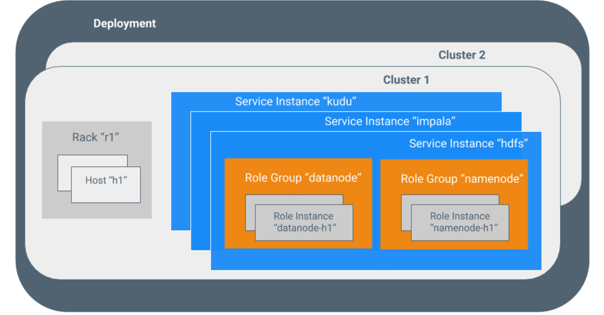
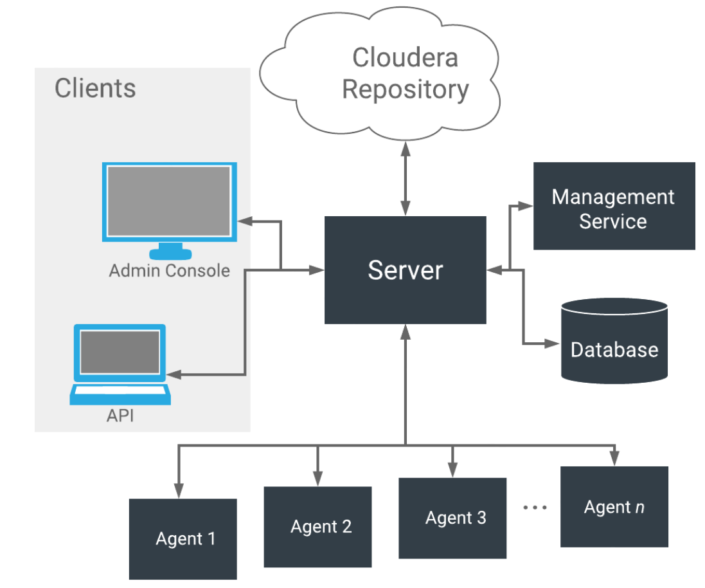

# Cloudera Manager 术语和架构

# Cloudera Manager 术语

为了有效地使用Cloudera Manager，您应该首先了解其术语。

术语之间的关系如下所示，其定义如下：

有时，术语服务和角色用于同时指代类型和实例，这可能会造成混淆。Cloudera Manager 和本节有时对类型和实例使用相同的术语。例如，Cloudera Manager 管理控制台的“主页” >“状态”选项卡和“集群” >“ ClusterName” 菜单列出了服务实例。这类似于编程语言中的惯例，其中“字符串”一词可能表示类型（java.lang.String）或该类型的实例（“ hi there”）。在需要区分类型和实例的地方，单词“ type”被附加以指示类型，而单词“ instance”被附加以显式指示实例。

### 部署

Cloudera Manager 及其管理的所有集群的配置。

### 动态资源池

在 Cloudera Manager 中，这是资源的命名配置，以及用于在池中运行的 YARN 应用程序或 Impala 查询之间调度资源的策略。

### 集群

- 包含 HDFS 文件系统并对该数据运行 MapReduce 和其他进程的一组计算机或计算机机架。
- 在 Cloudera Manager 中，是一个逻辑实体，包含一组主机，在主机上安装的单个版本的 Cloudera Runtime 以及在主机上运行的服务和角色实例。一台主机只能属于一个集群。Cloudera Manager 可以管理多个集群，但是每个集群只能与一个 Cloudera Manager Server 关联。

### 主机

在 Cloudera Manager 中，是运行角色实例的物理或虚拟机。一台主机只能属于一个集群。

### 机架

在 Cloudera Manager 中，是一个物理实体，包含一组通常由同一交换机提供服务的物理主机。

### 服务

- 在尽可能可预测的环境中运行在/etc/init.d/定义的 System V 初始化脚本的 Linux 命令 ，删除大多数环境变量并将当前工作目录设置为/。
- Cloudera Manager 中的托管功能类别，可以在集群中运行，有时称为服务类型。例如：Hive、HBase、HDFS、YARN 和 Spark。

### 服务实例

在 Cloudera Manager 中，是在集群上运行的服务的实例。例如：“ HDFS-1”和“yarn”。服务实例跨越许多角色实例。

### 角色

在 Cloudera Manager 中，服务中的功能类别。例如，HDFS 服务具有以下角色：NameNode、SecondaryNameNode、DataNode 和 Balancer。有时称为角色类型。

### 角色实例

在 Cloudera Manager 中，是在主机上运行的角色的实例。它通常映射到 Unix 进程。例如：“ NameNode-h1”和“ DataNode-h1”。

### 角色组

在 Cloudera Manager 中，这是一组角色实例的一组配置属性。

### 主机模板

Cloudera Manager 中的一组角色组。将模板应用于主机时，将创建每个角色组中的角色实例并将其分配给该主机。

### 网关

一种角色类型，通常为客户端提供对特定群集服务的访问权限。例如，HDFS、Hive、Kafka、MapReduce、Solr 和 Spark 各自具有网关角色，以为其客户提供对其各自服务的访问。网关角色并非总是在其名称中带有“网关”，也不是专门用于客户端访问。例如，Hue Kerberos Ticket Renewer 是一个网关角色，用于代理 Kerberos 中的票证。

支持一个或多个网关角色的节点有时称为网关节点或边缘节点，在网络或云环境中常见“边缘”的概念。对于 Cloudera 集群，当从 Cloudera Manager 管理控制台的“操作”菜单中选择“部署客户端配置”时，群集中的网关节点将接收适当的客户端配置文件。

### Parcel

二进制分发格式，包含编译的代码和元信息，例如程序包描述、版本和依赖项。

### 静态服务池

在 Cloudera Manager 中，是跨一组服务的总群集资源（CPU，内存和I / O权重）的静态分区。

#  

# Cloudera Manager 架构

如下所示，Cloudera Manager 的核心是 Cloudera Manager Server。服务器托管Cloudera Manager 管理控制台、Cloudera Manager API 和应用程序逻辑、并负责安装软件、配置、启动和停止服务以及管理在其上运行服务的集群。

**Cloudera Manager Server 与其他几个组件一起使用：**

- **代理**-安装在每台主机上。该代理负责启动和停止进程、解包配置、触发安装以及监控主机。
- **管理服务**-由一组角色组成的服务，这些角色执行各种监控、警报和报告功能。
- **数据库**-存储配置和监控信息。通常，多个逻辑数据库跨一个或多个数据库服务器运行。例如，Cloudera Manager Server 和监控角色使用不同的逻辑数据库。
- **Cloudera 存储库**-由 Cloudera Manager 分发的软件存储库。
- **客户端**-是与服务器交互的接口：

- Cloudera Manager 管理控制台 -基于Web的用户界面，管理员用于管理集群和Cloudera Manager。
- Cloudera Manager API -API 开发人员用于创建自定义 Cloudera Manager 应用程序。

### 心跳

心跳是 Cloudera Manager 中的主要通信机制。默认情况下，代理每15秒将心跳发送一次到 Cloudera Manager Server。但是，为减少用户等待时间，在状态更改时增加了频率。

在心跳交换期间，代理会将其活动通知给 Cloudera Manager Server。反过来，Cloudera Manager Server 响应代理应执行的操作。代理和 Cloudera Manager Server 最终都进行了一些协调。例如，如果您启动服务，则代理将尝试启动相关进程；否则，代理将尝试启动相关进程。如果进程无法启动，则 Cloudera Manager Server 会将启动命令标记为失败。

# CDH 6.0.1 自带组件版本

| **组件**                           | **版本**                                                     | **发行版**            | **CDH 版本** |
| ---------------------------------- | ------------------------------------------------------------ | --------------------- | ------------ |
| Supervisord                        | 3.0                                                          | 不可用                | 不适用       |
| Cloudera Manager Agent             | 6.0.1                                                        | 610811.el7            | 不适用       |
| Cloudera Manager Management Daemon | 6.0.1                                                        | 610811.el7            | 不适用       |
| flink                              | 1.8.1+flink1.8.1                                             | hadoop_2.8-scala_2.11 | 不适用       |
| Flume NG                           | 1.8.0+cdh6.0.1                                               | 590678                | CDH 6.0.1    |
| Hadoop                             | 3.0.0+cdh6.0.1                                               | 590678                | CDH 6.0.1    |
| HDFS                               | 3.0.0+cdh6.0.1                                               | 590678                | CDH 6.0.1    |
| HttpFS                             | 3.0.0+cdh6.0.1                                               | 590678                | CDH 6.0.1    |
| hadoop-kms                         | 3.0.0+cdh6.0.1                                               | 590678                | CDH 6.0.1    |
| MapReduce 2                        | 3.0.0+cdh6.0.1                                               | 590678                | CDH 6.0.1    |
| YARN                               | 3.0.0+cdh6.0.1                                               | 590678                | CDH 6.0.1    |
| HBase                              | 2.0.0+cdh6.0.1                                               | 590678                | CDH 6.0.1    |
| Lily HBase Indexer                 | 1.5+cdh6.0.1                                                 | 590678                | CDH 6.0.1    |
| Hive                               | 2.1.1+cdh6.0.1                                               | 590678                | CDH 6.0.1    |
| HCatalog                           | 2.1.1+cdh6.0.1                                               | 590678                | CDH 6.0.1    |
| Hue                                | 3.9.0+cdh6.0.1                                               | 590678                | CDH 6.0.1    |
| Impala                             | 3.0.0+cdh6.0.1                                               | 590678                | CDH 6.0.1    |
| Java 8                             | java version "1.8.0_141" Java(TM) SE Runtime Environment (build 1.8.0_141-b15) Java HotSpot(TM) 64-Bit Server VM (build 25.141-b15, mixed mode) | 不可用                | 不适用       |
| Kafka                              | 1.0.0+cdh6.0.1                                               | 590678                | CDH 6.0.1    |
| Kite（仅限 CDH 5 ）                | 1.0.0+cdh6.0.1                                               | 590678                | CDH 6.0.1    |
| kudu                               | 1.6.0+cdh6.0.1                                               | 590678                | CDH 6.0.1    |
| manager                            | manager-2.0.0.2                                              |                       | 不适用       |
| Oozie                              | 5.0.0-beta1+cdh6.0.1                                         | 590678                | CDH 6.0.1    |
| Parquet                            | 1.9.0+cdh6.0.1                                               | 590678                | CDH 6.0.1    |
| Pig                                | 0.17.0+cdh6.0.1                                              | 590678                | CDH 6.0.1    |
| sentry                             | 2.0.0+cdh6.0.1                                               | 590678                | CDH 6.0.1    |
| Solr                               | 7.0.0+cdh6.0.1                                               | 590678                | CDH 6.0.1    |
| spark                              | 2.2.0+cdh6.0.1                                               | 590678                | CDH 6.0.1    |
| Sqoop                              | 1.4.7+cdh6.0.1                                               | 590678                | CDH 6.0.1    |
| ZooKeeper                          | 3.4.5+cdh6.0.1                                               | 590678                | CDH 6.0.1    |