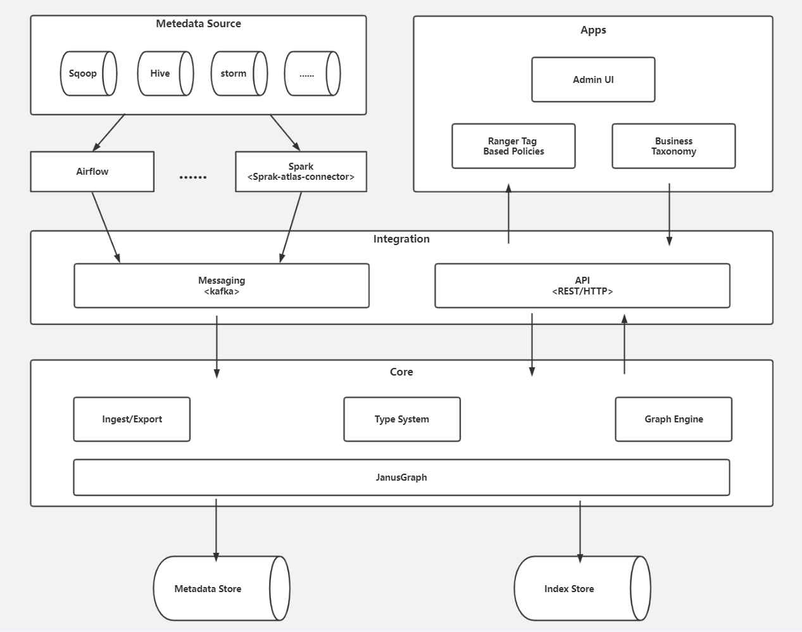

​                                        atlas架构图

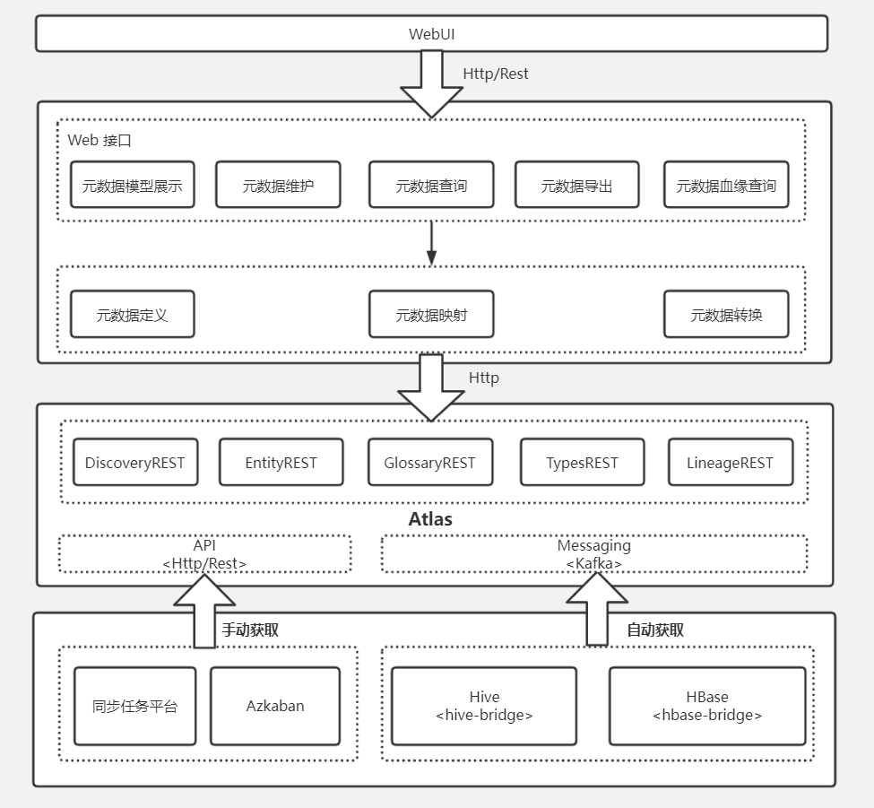

           **基于Atlas的元数据管理平台架构设计**

# 第 1 章 Atlas 入门

## 1.1 Atlas 概述

Apache Atlas 为组织提供开放式元数据管理和治理功能，用以构建其数据资产目录，对
这些资产进行分类和管理， 形成数据字典。 并为数据分析师和数据治理团队， 提供围绕这些
数据资产的协作功能。

注： 数据字典：可以查到 hive 库的释义，表的介绍以及字段的解释和说明。

1）表与表之间的血缘依赖  

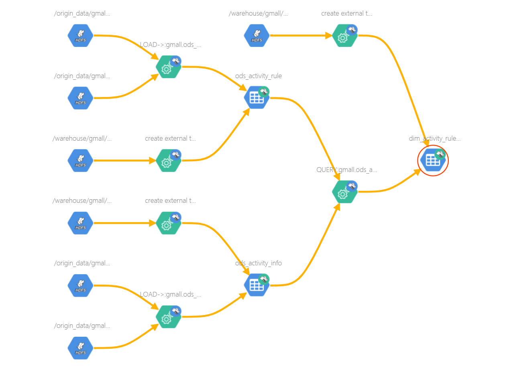

2）字段与字段之间的血缘依赖  

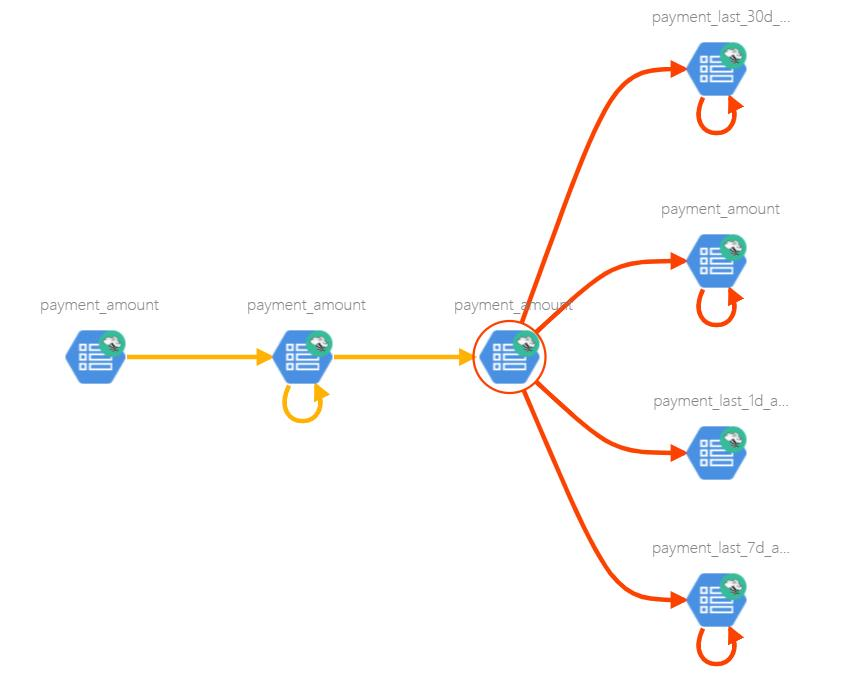

## 1.2 Atlas 架构原理  

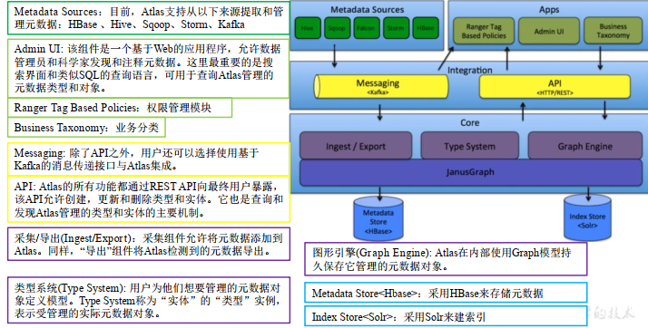

## 1.3 Atlas2.1 特性

1） 更新了组件可以使用 Hadoop3.1、 Hive3.1、 Hive3.0、 Hbase2.0、 Solr7.5 和 Kafka2.0

2） 将 JanusGraph 版本跟新为 0.3.1

3） 更新了身份验证支持可信代理

4） 更新了指标模块收集通知

5） 支持 Atlas 增量导出元数据  

# 第 2 章 Atlas 安装

1） Atlas 官网地址： https://atlas.apache.org/

2） 文档查看地址： https://atlas.apache.org/2.1.0/index

3） 下载地址： https://www.apache.org/dyn/closer.cgi/a

## 2.1 安装环境准备

Atlas 安装分为：集成自带的 HBase + Solr；集成
选择集成外部的 HBase + Solr， 方便项目整体进行集
以下是 Atlas 所以依赖的环境及集群规划  

| 服务名称          | 子服务           | 服务器 hadoop102 | 服务器 hadoop103 | 服务器 hadoop104 |
| ----------------- | ---------------- | ---------------- | ---------------- | ---------------- |
| HDFS              | NameNode         | √                |                  |                  |
| DataNode          | √                | √                | √                |                  |
| SecondaryNameNode | √                |                  |                  |                  |
| Yarn              | Resourcemanager  | √                |                  |                  |
| NodeManager       | √                | √                | √                |                  |
| HistoryServer     | JobHistoryServer | √                |                  |                  |
| Zookeeper         | QuorumPeerMain   | √                | √                | √                |
| Kafka             | Kafka            | √                | √                | √                |
| HBase             | HMaster          | √                |                  |                  |
| HRegionServer     | √                | √                | √                |                  |
| Solr              | Jar              | √                | √                | √                |
| Hive              | Hive             | √                |                  |                  |
| MySQL             | MySQL            | √                |                  |                  |
| Atlas             | Atlas            | √                |                  |                  |

2.1.1 安装 JDK8、 Hadoop3.1.3  

2.1.2 安装 MySQL、 Hive3.1.2  

2.1.3 安装 Zookeeper3.5.7  

2.1.4 安装 Kafka2.4.1  

2.1.5 安装 Hbase2.0.5  

2.1.6 安装 Solr-7.7.3  

2.1.7 安装 Atlas2.1.0  

1.把 apache-atlas-2.1.0-server.tar.gz 上传到 hadoop102 的/opt/software 目录下

2.解压 apache-atlas-2.1.0-server.tar.gz 到/opt/module/目录下面

```
[atguigu@hadoop102 software]$ tar -zxvf apache-atlas-2.1.0-
server.tar.gz -C /opt/module/
```

3.修改 apache-atlas-2.1.0 的名称为 atlas

```
[atguigu@hadoop102 module]$ mv apache-atlas-2.1.0 atlas 
```

 

## 2.2 Atlas 配置

### 2.2.1 Atlas 集成 Hbase

1.修改/opt/module/atlas/conf/atlas-application.properties 配置文件中的以下参数

```
atlas.graph.storage.hostname=hadoop102:2181,hadoop103:2181,hadoop
104:2181
```

2.修改/opt/module/atlas/conf/atlas-env.sh 配置文件，增加以下内容

```
export HBASE_CONF_DIR=/opt/module/hbase/conf
```

### 2.2.2 Atlas 集成 Solr

1.修改/opt/module/atlas/conf/atlas-application.properties 配置文件中的以下参数  

```
atlas.graph.index.search.backend=solr
atlas.graph.index.search.solr.mode=cloud
atlas.graph.index.search.solr.zookeeperurl=hadoop102:2181,hadoop103:2181,hadoop104:2181
```

2.创建 solr collection  

```
[atguigu@hadoop102 ~]$ sudo -i -u solr /opt/module/solr/bin/solr
create -c vertex_index -d /opt/module/atlas/conf/solr -shards 3 -
replicationFactor 2
[atguigu@hadoop102 ~]$ sudo -i -u solr /opt/module/solr/bin/solr
create -c edge_index -d /opt/module/atlas/conf/solr -shards 3 -
replicationFactor 2
[atguigu@hadoop102 ~]$ sudo -i -u solr /opt/module/solr/bin/solr
create -c fulltext_index -d /opt/module/atlas/conf/solr -shards 3
-replicationFactor 2
```

### 2.2.3 Atlas 集成 Kafka  

修改/opt/module/atlas/conf/atlas-application.properties 配置文件中的以下参数  

```
atlas.notification.embedded=false
atlas.kafka.data=/opt/module/kafka/data
atlas.kafka.zookeeper.connect=
hadoop102:2181,hadoop103:2181,hadoop104:2181/kafka
atlas.kafka.bootstrap.servers=hadoop102:9092,hadoop103:9092,hadoo
p104:9092
```

### 2.2.4 Atlas Server 配置  

1.修改/opt/module/atlas/conf/atlas-application.properties 配置文件中的以下参数  

```
######### Server Properties #########
atlas.rest.address=http://hadoop102:21000
# If enabled and set to true, this will run setup steps when the
server starts
atlas.server.run.setup.on.start=false
######### Entity Audit Configs #########
atlas.audit.hbase.tablename=apache_atlas_entity_audit
atlas.audit.zookeeper.session.timeout.ms=1000
atlas.audit.hbase.zookeeper.quorum=hadoop102:2181,hadoop103:2181,
hadoop104:2181
```

2.记录性能指标，进入/opt/module/atlas/conf/路径， 修改当前目录下的 atlas-log4j.xml  

```
[root@hadoop101 conf]$ vim atlas-log4j.xml
#去掉如下代码的注释
<appender name="perf_appender"
class="org.apache.log4j.DailyRollingFileAppender">
<param name="file" value="${atlas.log.dir}/atlas_perf.log" />
<param name="datePattern" value="'.'yyyy-MM-dd" />
<param name="append" value="true" />
<layout class="org.apache.log4j.PatternLayout">
<param name="ConversionPattern" value="%d|%t|%m%n" />
</layout>
</appender>
<logger name="org.apache.atlas.perf" additivity="false">
<level value="debug" />
<appender-ref ref="perf_appender" />
</logger>
```

### 2.2.5 Atlas 集成 Hive  

1.修改/opt/module/atlas/conf/atlas-application.properties 配置文件中的以下参数  

```
######### Hive Hook Configs #######
atlas.hook.hive.synchronous=false
atlas.hook.hive.numRetries=3
atlas.hook.hive.queueSize=10000
atlas.cluster.name=primary
```

2.修改 Hive 配置文件， 在/opt/module/hive/conf/hive-site.xml 文件中增加以下参数，配置 Hive
Hook。  

```
<property>
<name>hive.exec.post.hooks</name>
<value>org.apache.atlas.hive.hook.HiveHook</value>
</property>
```

3.安装 Hive Hook

1）解压 Hive Hook  

```
[atguigu@hadoop102 software]$ tar -zxvf apache-atlas-2.1.0-hivehook.tar.gz
```

2） 将 Hive Hook 依赖复制到 Atlas 安装路径  

```
[atguigu@hadoop102 software]$ cp -r apache-atlas-hive-hook-
2.1.0/* /opt/module/atlas/
```

3）修改/opt/module/hive/conf/hive-env.sh 配置文件  

注：需先需改文件名  

```
[atguigu@hadoop102 conf]$ mv hive-env.sh.template hive-env.sh
```

增加如下参数  

```
export HIVE_AUX_JARS_PATH=/opt/module/atlas/hook/hive
```

4）将 Atlas 配置文件/opt/module/atlas/conf/atlas-application.properties
拷贝到/opt/module/hive/conf 目录  

```
[atguigu@hadoop102 conf]$ cp /opt/module/atlas/conf/atlasapplication.properties /opt/module/hive/conf/
```

## 2.4 Atlas 启动  

1.启动 Atlas 所依赖的环境

1）启动 Hadoop 集群  

（1）在 NameNode 节点执行以下命令，启动 HDFS

```
[atguigu@hadoop102 ~]$ start-dfs.sh
```

（2）在 ResourceManager 节点执行以下命令，启动 Yarn

```
[atguigu@hadoop103 ~]$ start-yarn.sh
```

2）启动 Zookeeper 集群

```
[atguigu@hadoop102 ~]$ zk.sh start  
```

3）启动 Kafka 集群

```
[atguigu@hadoop102 ~]$ kf.sh start
```

4）启动 Hbase 集群
在 HMaster 节点执行以下命令，启动 HBase

```
[atguigu@hadoop102 ~]$ start-hbase.sh
```

5）启动 Solr 集群
在所有节点执行以下命令，使用 solr 用户启动 Solr

```
[atguigu@hadoop102 ~]$ sudo -i -u solr /opt/module/solr/bin/solr
start  
```

6）进入/opt/module/atlas 路径， 启动 Atlas 服务

```
[atguigu@hadoop102 ~]$ bin/atlas_start.py  
```

提示：

（1） 错误信息查看路径：/opt/module/atlas/logs/*.out 和 application.log  

（2）停止 Atlas 服务命令为 atlas_stop.py  

7）访问 Atlas 的 WebUI  

访问地址： http://hadoop102:21000

注意：等待时间大概 2 分钟。

账户： admin

密码： admin  

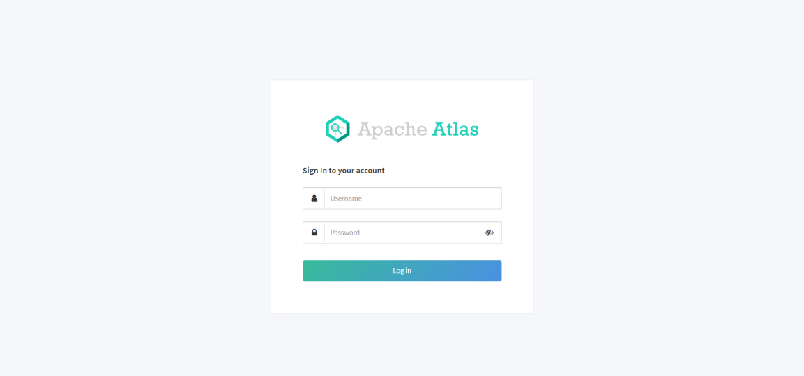

# 第 3 章 Atlas 使用  

Atlas 的使用相对简单，其主要工作是同步各服务（主要是 Hive）的元数据，并构建元
数据实体之间的关联关系，然后对所存储的元数据建立索引，最终未用户提供数据血缘查看  及元数据检索等功能。

Atlas 在安装之初，需手动执行一
增量同步 Hive 的元数据。  

## 3.1 Hive 元数据初次导入  

Atlas 提供了一个 Hive 元数据导入的脚本，直接执行该脚本，即可完成 Hive 元数据的
初次全量导入。

1.导入 Hive 元数据

执行以下命令  

```
[atguigu@hadoop102 ~]$ /opt/module/atlas/hook-bin/importhive.sh
```

按提示输入用户名： admin；输入密码： admin  

等待片刻，出现以下日志， 即表明导入成功  

```
Hive Meta Data import was successful!!!
```

2.查看 Hive 元数据  

1）搜索 hive_table 类型的元数据，可已看到 Atlas 已经拿到了 Hive 元数据  

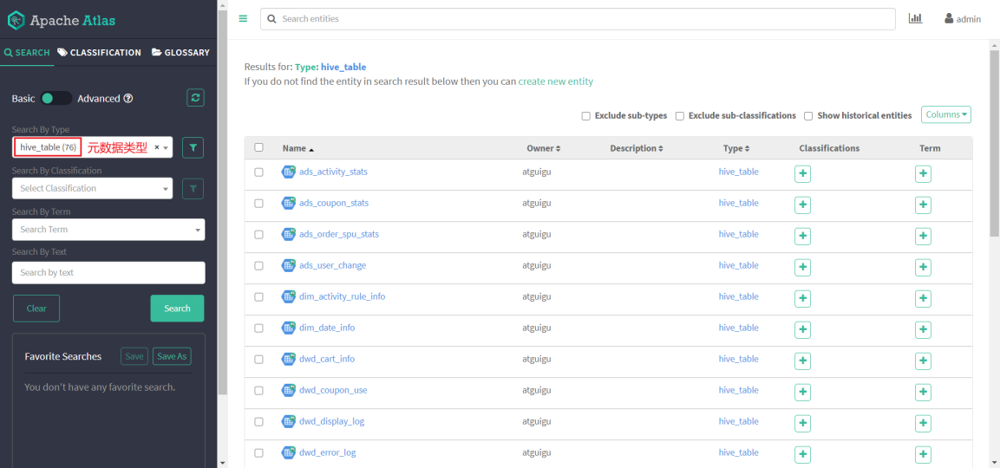

2）任选一张表查看血缘依赖关系  

发现此时并未出现期望的血缘依赖，原因是 Atlas 是根据 Hive 所执行的 SQL 语句获取
表与表之间以及字段与字段之间的依赖关系的，例如执行 insert into table_a select * from
table_b 语句， Atlas 就能获取 table_a 与 table_b 之间的依赖关系。 此时并未执行任何 SQL 语
句，故还不能出现血缘依赖关系。  

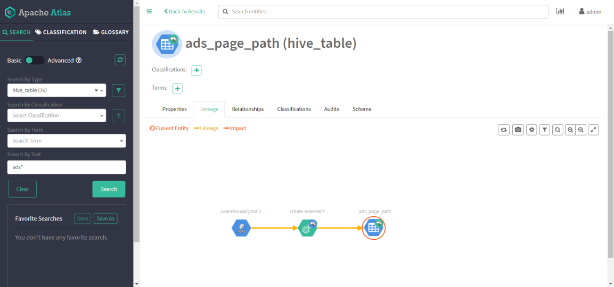

## 3.2 Hive 元数据增量同步  

Hive 元数据的增量同步，无需人为干预，只要 Hive 中的元数据发生变化（执行 DDL 语
句）， Hive Hook 就会将元数据的变动通知 Atlas。除此之外， Atlas 还会根据 DML 语句获取
数据之间的血缘关系。  

### 3.2.1 生成血缘依赖  

为查看血缘关系效果， 在 hive 里面创建两张数据表。  

1.建表语句  

1） 订单事实表  

```
CREATE TABLE dwd_order_info (
`id` STRING COMMENT '订单号',
`final_amount` DECIMAL(16,2) COMMENT '订单最终金额',
`order_status` STRING COMMENT '订单状态',
`user_id` STRING COMMENT '用户 id',
`payment_way` STRING COMMENT '支付方式',
`delivery_address` STRING COMMENT '送货地址',
`out_trade_no` STRING COMMENT '支付流水号',
`create_time` STRING COMMENT '创建时间',
`operate_time` STRING COMMENT '操作时间',
`expire_time` STRING COMMENT '过期时间',
`tracking_no` STRING COMMENT '物流单编号',
`province_id` STRING COMMENT '省份 ID',
`activity_reduce_amount` DECIMAL(16,2) COMMENT '活动减免金额',
`coupon_reduce_amount` DECIMAL(16,2) COMMENT '优惠券减免金额',
`original_amount` DECIMAL(16,2) COMMENT '订单原价金额',
`feight_fee` DECIMAL(16,2) COMMENT '运费',
`feight_fee_reduce` DECIMAL(16,2) COMMENT '运费减免'
) COMMENT '订单表'
ROW FORMAT DELIMITED FIELDS TERMINATED BY '\t';
```

2） 地区维度表  

```
CREATE TABLE dim_base_province (
`id` STRING COMMENT '编号',
`name` STRING COMMENT '省份名称',
`region_id` STRING COMMENT '地区 ID',
`area_code` STRING COMMENT '地区编码',
`iso_code` STRING COMMENT 'ISO-3166 编码，供可视化使用',
`iso_3166_2` STRING COMMENT 'IOS-3166-2 编码，供可视化使用'
) COMMENT '省份表'
ROW FORMAT DELIMITED FIELDS TERMINATED BY '\t';
```

2.数据装载  

将资料里面提前准备好的数据 order_info.txt 和 base_province.txt 上传到两张 hive 表的
hdfs 路径下  

3.需求指标  

1） 根据订单事实表和地区维度表，求出每个省份的订单次数和订单金额

2） 建表语句  

```
CREATE TABLE `ads_order_by_province` (
`dt` STRING COMMENT '统计日期',
`province_id` STRING COMMENT '省份 id',
`province_name` STRING COMMENT '省份名称',
`area_code` STRING COMMENT '地区编码',
`iso_code` STRING COMMENT '国际标准地区编码',
`iso_code_3166_2` STRING COMMENT '国际标准地区编码',
`order_count` BIGINT COMMENT '订单数',
`order_amount` DECIMAL(16,2) COMMENT '订单金额'
) COMMENT '各省份订单统计'
ROW FORMAT DELIMITED FIELDS TERMINATED BY '\t';
```

3）数据装载  

```
insert into table ads_order_by_province
select
'2021-08-30' dt,
bp.id,
bp.name,
bp.area_code,
bp.iso_code,
bp.iso_3166_2,
count(*) order_count,
sum(oi.final_amount) order_amount
from dwd_order_info oi
left join dim_base_province bp
on oi.province_id=bp.id
group by bp.id,bp.name,bp.area_code,bp.iso_code,bp.iso_3166_2;
```

### 3.2.2 查看血缘依赖  

此时再通过 Atlas 查看 Hive 元数据，即可发现血缘依赖图

1） 表血缘依赖  

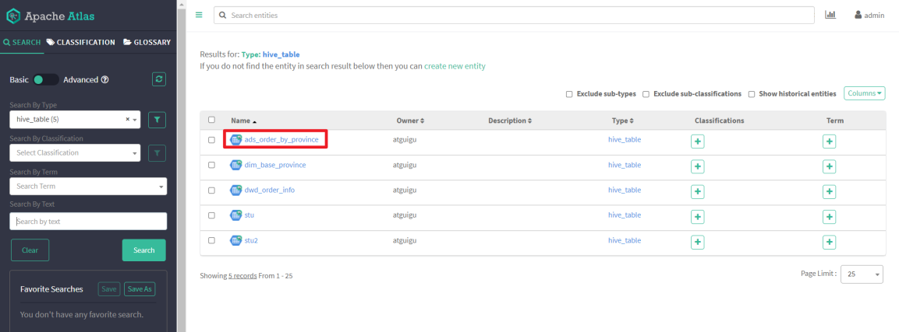

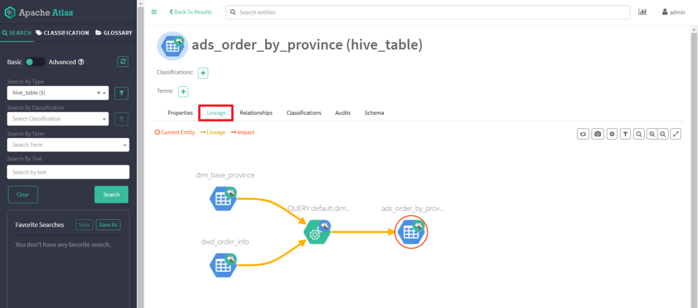

2） 字段血缘依赖  

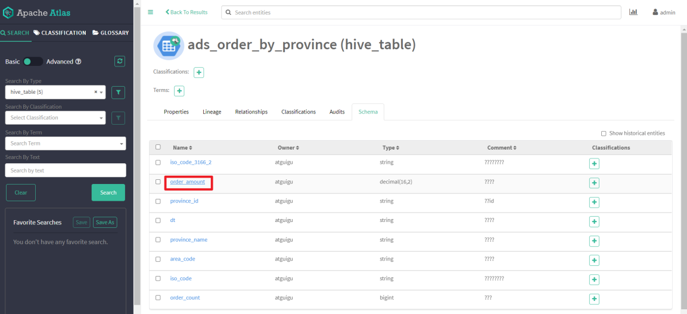

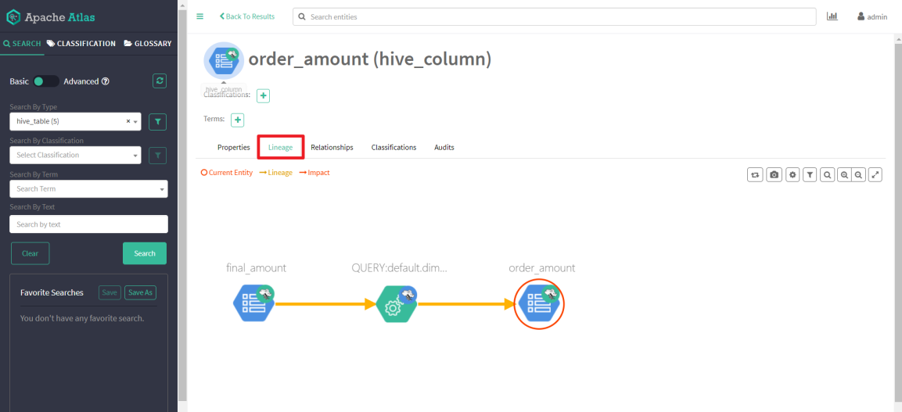