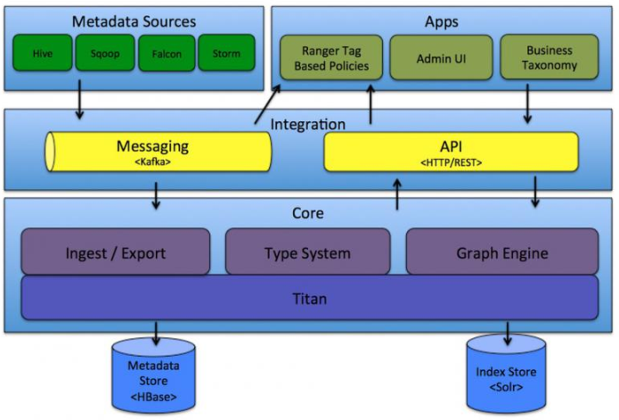

## Apache Atlas 起源

```

在当今大数据的应用越来越广泛的情况下，数据治理一直是企业面临的巨大问题。
大部分公司只是单纯的对数据进行了处理，而数据的血缘，分类等等却很难实现，市场上也急需要一个专注于数据治理的技术框架，这时 Atlas 应运而生。
面对海量且持续增加的各式各样的数据对象，你是否有信心知道哪些数据从哪里来以及它如何随时间而变化？采用 Hadoop 必须考虑数据管理的实际情况，元数据与数据治理成为企业级数据湖的重要部分。
该项目用于管理共享元数据、数据分级、审计、安全性以及数据保护等方面，努力与 Apache Ranger整合，用于数据权限控制策略。
Apache Atlas 是 Hadoop 的数据治理和元数据框架，它提供了一个可伸缩和可扩展的核心基础数据治理服务集，使得 企业可以有效的和高效的满足 Hadoop 中的合规性要求，并允许与整个企业的数据生态系统集成
```

## Apache Atlas 介绍

```

Atlas 是 Hadoop 的数据治理和元数据框架。
Atlas 是一组可扩展和可扩展的核心基础治理服务，使企业能够有效，高效地满足 Hadoop 中的合规性要求，并允许与整个企业数据生态系统集成。
Apache Atlas 为组织提供了开放的元数据管理和治理功能，以建立其数据资产的目录，对这些资产进行分类和治理，并为数据科学家，分析师和数据治理团队提供围绕这些数据资产的协作功能。
Apache Atlas 是 Hadoop 社区为解决 Hadoop 生态系统的元数据治理问题而产生的开源项目，它为Hadoop 集群提供了包括 数据分类、集中策略引擎、数据血缘、安全和生命周期管理 在内的元数据治理核心能力。
官网链接：http://atlas.apache.org/

特点：
1、Atlas 支持各种 Hadoop 和非 Hadoop 元数据类型
2、提供了丰富的 REST API 进行集成
3、对数据血缘的追溯达到了字段级别，这种技术还没有其实类似框架可以实现
4、对权限也有很好的控制
```

## Apache Atlas 架构  



## Apache Atlas 核心组件  

### core

```
Type System：Atlas 允许用户为他们想要管理的元数据对象定义一个模型。该模型由称为 "类型"的定义组成。"类型" 的 实例被称为 "实体" 表示被管理的实际元数据对象。类型系统是一个组件，允许用户定义和管理类型和实体。由 Atlas 管理的所有元数据对象（例如 Hive 表）都使用类型进行建模，并表示为实体。要在 Atlas 中存储新类型的元数据，需要了解类型系统组件的概念。

Ingest/Export：Ingest 组件允许将元数据添加到 Atlas。类似地，Export 组件暴露由 Atlas 检测到的元数据更改，以作为事件引发，消费者可以使用这些更改事件来实时响应元数据更改。

Graph Engine：在内部，Atlas 通过使用图形模型管理元数据对象。以实现元数据对象之间的巨大灵活性和丰富的关系。图形引擎是负责在类型系统的类型和实体之间进行转换的组件，以及基础图形模型。除了管理图形对象之外，图形引擎还为元数据对象创建适当的索引，以便有效地搜索它们。

Titan：目前，Atlas 使用 Titan 图数据库来存储元数据对象。 Titan 使用两个存储：默认情况下元数据存储配置为 HBase ，索引存储配置为 Solr。也可以通过构建相应的配置文件使用BerkeleyDB存储元数据存储 和使用ElasticSearch存储 Index。元数据存储用于存储元数据对象本身，索引存
储用于存储元数据属性的索引，其允许高效搜索
```

### Integration  

```
用户可以使用两种方法管理 Atlas 中的元数据：
API：Atlas 的所有功能都可以通过 REST API 提供给最终用户，允许创建，更新和删除类型和实体。它也是查询和发现通过 Atlas 管理的类型和实体的主要方法。

Messaging：除了 API 之外，用户还可以选择使用基于 Kafka 的消息接口与 Atlas 集成。这对于将元数据对象传输到 Atlas 以及从 Atlas 使用可以构建应用程序的元数据更改事件都非常有用。如果希望使用与 Atlas 更松散耦合的集成，这可以允许更好的可扩展性，可靠性等，消息传递接口是特别有用的。Atlas 使用 Apache Kafka 作为通知服务器用于钩子和元数据通知事件的下游消费者之间的通信。

事件由钩子(hook) 和 Atlas 写到不同的 Kafka 主题：
ATLAS_HOOK：来自各个组件的 Hook 的元数据通知事件通过写入到名为 ATLAS_HOOK 的 Kafkatopic 发送到 Atlas

ATLAS_ENTITIES：从 Atlas 到其他集成组件（如 Ranger）的事件写入到名为 ATLAS_ENTITIES 的Kafka topic
```

### Metadata source  

```
Atlas 支持与许多元数据源的集成，将来还会添加更多集成。目前，Atlas 支持从以下数据源获取和管理元数据：
Hive：通过 hive bridge， atlas 可以接入 Hive 的元数据，包括 hive_db / hive_table /hive_column / hive_process / hive_db_ddl / hive_table_ddl 等

Sqoop：通过 sqoop bridge，atlas 可以接入关系型数据库的元数据，包括
sqoop_operation_type / sqoop_dbstore_usage / sqoop_process / sqoop_dbdatastore

Falcon：通过 falcon bridge，atlas 可以接入 Falcon 的元数据，包括 falcon_cluster /falcon_feed / falcon_feed_creation / falcon_feed_replication / falcon_process

Storm：通过 storm bridge，atlas 可以接入流式处理的元数据，包括 storm_topology /storm_spout / storm_bolt / storm_node

Atlas 集成大数据组件的元数据源需要实现以下两点：
首先，需要基于 atlas 的类型系统定义能够表达大数据组件元数据对象的元数据模型（例如 Hive的元数据模型实现在org.apache.atlas.hive.model.HiveDataModelGenerator）；
然后，需要提供 hook 组件去从大数据组件的元数据源中提取元数据对象，实时侦听元数据的变更并反馈给 atlas；
```

### Applications  

```
Atlas Admin UI：该组件是一个基于 Web 的应用程序，允许数据管理员和科学家发现和注释元数据。Admin UI 提供了搜索界面和 类 SQL 的查询语言，可以用来查询由 Atlas 管理的元数据类型和对象。Admin UI 使用 Atlas 的 REST API 来构建其功能。
Tag Based Policies：Apache Ranger 是针对 Hadoop 生态系统的高级安全管理解决方案，与各种 Hadoop 组件具有广泛的集成。通过与 Atlas 集成，Ranger 允许安全管理员定义元数据驱动的安全策略，以实现有效的治理。 Ranger 是由 Atlas 通知的元数据更改事件的消费者。
Business Taxonomy：从元数据源获取到 Atlas 的元数据对象主要是一种技术形式的元数据。为了增强可发现性和治理能力，Atlas 提供了一个业务分类界面，允许用户首先定义一组代表其业务域的业务术语，并将其与 Atlas 管理的元数据实体相关联。业务分类法是一种 Web 应用程序，目前是 Atlas Admin UI 的一部分，并且使用 REST API 与 Atlas 集成。
在 HDP-2.5 中，Business Taxonomy 是提供了 Technical Preview 版本，需要在 Atlas > Configs >Advanced > Custom application-properties 中添加atlas.feature.taxonomy.enable=true 并重启
atlas 服务来开启
```

## Apache Atlas 核心特性  

Apache Atlas 为 Hadoop 的元数据治理提供了以下特性：  

```
1、数据分类
2、集中审计
3、搜索与血缘
4、安全与策略引擎
```

数据分类  

```
1. 为元数据导入或定义业务导向的分类注释
2. 定义，注释，以及自动捕获数据集和底层元素之间的关系
3. 导出元数据到第三方系统
```

集中审计  

```
1. 捕获与所有应用，过程以及与数据交互的安全访问信息
2. 捕获执行，步骤，活动等操作的信息
```

搜索与血缘  

```
1. 预定义的导航路径用来探索数据分类以及审计信息
2. 基于文本的搜索特性来快速和准确的定位相关联的数据和审计事件
3. 对数据集血缘关系的可视化浏览使用户可以下钻到操作，安全以及数据起源相关的信息
```

安全与策略引擎  

```
1. 基于数据分类模式，属性以及角色的运行时合理合规策略
2. 基于分类-预测的高级策略定义以防止数据推导
3. 基于 cell 的属性和值的行/列级别的 masking
```

