作者：张伯毅

 **一 .前言**

整理一下从1.7 版本到1.14版本之间的相对大的变动. 做到在学习的过程中心里有数。

#### 二 .Flink 1.7 版本

在 Flink 1.7.0，我们更关注实现快速数据处理以及以无缝方式为 Flink 社区构建数据密集型应用程序。我们最新版本包括一些令人兴奋的新功能和改进，例如对 Scala 2.12 的支持，Exactly-Once 语义的 S3 文件接收器，复杂事件处理与流SQL的集成.

**2.1. Flink中的Scala 2.12支持**

Flink 1.7.0 是第一个完全支持 Scala 2.12 的版本。这可以让用户使用新的 Scala 版本编写 Flink 应用程序以及利用 Scala 2.12 的生态系统。

**2.2. 状态变化**

在许多情况下，由于需求的变化，长期运行的 Flink 应用程序会在其生命周期内发生变化。在不丢失当前应用程序进度状态的情况下更改用户状态是应用程序变化的关键要求。Flink 1.7.0 版本中社区添加了状态变化，允许我们灵活地调整长时间运行的应用程序的用户状态模式，同时保持与先前保存点的兼容。通过状态变化，我们可以在状态模式中添加或删除列。当使用 Avro 生成类作为用户状态时，状态模式变化可以开箱即用，这意味着状态模式可以根据 Avro 的规范进行变化。虽然 Avro 类型是 Flink 1.7 中唯一支持模式变化的内置类型，但社区仍在继续致力于在未来的 Flink 版本中进一步扩展对其他类型的支持。

**2.3. Exactly-once语义的S3 StreamingFileSink**

Flink 1.6.0 中引入的 StreamingFileSink 现在已经扩展到 S3 文件系统，并保证 Exactly-once 语义。使用此功能允许所有 S3 用户构建写入 S3 的 Exactly-once 语义端到端管道。

**2.4. Streaming SQL中支持MATCH_RECOGNIZE**

这是 Apache Flink 1.7.0 的一个重要补充，它为 Flink SQL 提供了 MATCH_RECOGNIZE 标准的初始支持。此功能融合了复杂事件处理（CEP）和SQL，可以轻松地对数据流进行模式匹配，从而实现一整套新的用例。此功能目前处于测试阶段。

**2.5. Streaming SQL中的 Temporal Tables 和 Temporal Joins**

Temporal Tables 是 Apache Flink 中的一个新概念，它为表的更改历史记录提供（参数化）视图，可以返回表在任何时间点的内容。例如，我们可以使用具有历史货币汇率的表。随着时间的推移，表会不断发生变化，并增加更新的汇率。Temporal Table 是一种视图，可以返回汇率在任何时间点的实际状态。通过这样的表，可以使用正确的汇率将不同货币的订单流转换为通用货币。

Temporal Joins 允许 Streaming 数据与不断变化/更新的表的内存和计算效率的连接，使用处理时间或事件时间，同时符合ANSI SQL。

流式 SQL 的其他功能除了上面提到的主要功能外，Flink 的 Table＆SQL API 已经扩展到更多用例。以下内置函数被添加到API：TO_BASE64，LOG2，LTRIM，REPEAT，REPLACE，COSH，SINH，TANH。SQL Client 现在支持在环境文件和 CLI 会话中自定义视图。此外，CLI 中还添加了基本的 SQL 语句自动完成功能。社区添加了一个 Elasticsearch 6 table sink，允许存储动态表的更新结果。

**2.6. 版本化REST API**

从 Flink 1.7.0 开始，REST API 已经版本化。这保证了 Flink REST API 的稳定性，因此可以在 Flink 中针对稳定的 API开发第三方应用程序。因此，未来的 Flink 升级不需要更改现有的第三方集成。

**2.7. Kafka 2.0 Connector**

Apache Flink 1.7.0 继续添加更多的连接器，使其更容易与更多外部系统进行交互。在此版本中，社区添加了 Kafka 2.0 连接器，可以从 Kafka 2.0 读写数据时保证 Exactly-Once 语义。

**2.8. 本地恢复**

Apache Flink 1.7.0 通过扩展 Flink 的调度来完成本地恢复功能，以便在恢复时考虑之前的部署位置。如果启用了本地恢复，Flink 将在运行任务的机器上保留一份最新检查点的本地副本。将任务调度到之前的位置，Flink 可以通过从本地磁盘读取检查点状态来最小化恢复状态的网络流量。此功能大大提高了恢复速度。

**2.9. 删除Flink的传统模式**

Apache Flink 1.7.0 标志着 Flip-6 工作已经完全完成并且与传统模式达到功能奇偶校验。因此，此版本删除了对传统模式的支持。

#### 三 .Flink 1.8 版本

新特性和改进：

- Schema Evolution Story 最终版
- 基于 TTL 持续清除旧状态
- 使用用户定义的函数和聚合进行 SQL 模式检测
- 符合 RFC 的 CSV 格式
- 新的 KafkaDeserializationSchema，可以直接访问 ConsumerRecord
- FlinkKinesisConsumer 中的分片水印选项
- DynamoDB Streams 的新用户捕获表更改
- 支持用于子任务协调的全局聚合

重要变化：

- 使用 Flink 捆绑 Hadoop 库的更改：不再发布包含 hadoop 的便捷二进制文件
- FlinkKafkaConsumer 现在将根据主题规范过滤已恢复的分区
- 表 API 的 Maven 依赖更改：之前具有flink-table依赖关系的用户需要将依赖关系从flink-table-planner更新为正确的依赖关系 flink-table-api-，具体取决于是使用 Java 还是 Scala：flink-table-api-java-bridge或者flink-table-api-scala-bridge

**3.1. 使用TTL（生存时间）连续增量清除旧的Key状态**

我们在Flink 1.6（FLINK-9510）中为Key状态引入了TTL（生存时间）。此功能允许在访问时清理并使Key状态条目无法访问。另外，在编写保存点/检查点时，现在也将清理状态。Flink 1.8引入了对RocksDB状态后端（FLINK-10471）和堆状态后端（FLINK-10473）的旧条数的连续清理。这意味着旧的条数将（根据TTL设置）不断被清理掉。

**3.2. 恢复保存点时对模式迁移的新支持**

使用Flink 1.7.0，我们在使用AvroSerializer时添加了对更改状态模式的支持。使用Flink 1.8.0，我们在TypeSerializers将所有内置迁移到新的序列化器快照抽象方面取得了很大进展，该抽象理论上允许模式迁移。在Flink附带的序列化程序中，我们现在支持PojoSerializer （FLINK-11485）和Java EnumSerializer （FLINK-11334）以及有限情况下的Kryo（FLINK-11323）的模式迁移格式。

**3.3. 保存点兼容性**

TraversableSerializer 此序列化程序（FLINK-11539）中的更新，包含Scala的Flink 1.2中的保存点将不再与Flink 1.8兼容。可以通过升级到Flink 1.3和Flink 1.7之间的版本，然后再更新至Flink 1.8来解决此限制。

**3.4. RocksDB版本冲突并切换到FRocksDB（FLINK-10471）**

需要切换到名为FRocksDB的RocksDB的自定义构建，因为需要RocksDB中的某些更改来支持使用TTL进行连续状态清理。FRocksDB的已使用版本基于RocksDB的升级版本5.17.2。对于Mac OS X，仅支持OS X版本> =10.13的RocksDB版本5.17.2。

另见：https://github.com/facebook/rocksdb/issues/4862

**3.5. Maven 依赖**

使用Flink捆绑Hadoop库的更改（FLINK-11266）

包含hadoop的便捷二进制文件不再发布。

如果部署依赖于flink-shaded-hadoop2包含 flink-dist，则必须从下载页面的可选组件部分手动下载并打包Hadoop jar并将其复制到/lib目录中。另外一种方法，可以通过打包flink-dist和激活 include-hadoopmaven配置文件来构建包含hadoop的Flink分发。

由于hadoop flink-dist默认不再包含在内，因此指定-DwithoutHadoop何时打包flink-dist将不再影响构建。

**3.6. TaskManager配置（FLINK-11716）**

TaskManagers现在默认绑定到主机IP地址而不是主机名。可以通过配置选项控制此行为taskmanager.network.bind-policy。如果你的Flink集群在升级后遇到莫名其妙的连接问题，尝试设置taskmanager.network.bind-policy: name在flink-conf.yaml 返回前的1.8的设置行为。

**3.7. Table API 的变动**

- 直接表构造函数使用的取消预测（FLINK-11447） Flink 1.8不赞成Table在Table API中直接使用该类的构造函数。此构造函数以前将用于执行与横向表的连接。你现在应该使用table.joinLateral()或 table.leftOuterJoinLateral()代替。这种更改对于将Table类转换为接口是必要的，这将使Table API在未来更易于维护和更清洁。
- 引入新的CSV格式符（FLINK-9964）

此版本为符合RFC4180的CSV文件引入了新的格式符。新描述符可用作 org.apache.flink.table.descriptors.Csv。

目前，这只能与Kafka一起使用。旧描述符可org.apache.flink.table.descriptors.OldCsv用于文件系统连接器。

静态生成器方法在TableEnvironment（FLINK-11445）上的弃用，为了将API与实际实现分开：TableEnvironment.getTableEnvironment()。

不推荐使用静态方法。你现在应该使用Batch/StreamTableEnvironment.create()。

- 表API Maven模块中的更改（FLINK-11064）

之前具有flink-table依赖关系的用户需要更新其依赖关系flink-table-planner以及正确的依赖关系flink-table-api-?，具体取决于是使用Java还是Scala：flink-table-api-java-bridge或者flink-table-api-scala-bridge。

- 更改为外部目录表构建器（FLINK-11522）

ExternalCatalogTable.builder()不赞成使用ExternalCatalogTableBuilder()。

- 更改为表API连接器jar的命名（FLINK-11026）

Kafka/elasticsearch6 sql-jars的命名方案已经更改。在maven术语中，它们不再具有sql-jar限定符，而artifactId现在以前缀为例，flink-sql而不是flink例如flink-sql-connector-kafka。

- 更改为指定Null的方式（FLINK-11785）

现在Table API中的Null需要定义nullof(type)而不是Null(type)。旧方法已被弃用。

**3.8. 连接器变动**

- 引入可直接访问ConsumerRecord的新KafkaDeserializationSchema（FLINK-8354）

对于FlinkKafkaConsumers，我们推出了一个新的KafkaDeserializationSchema ，可以直接访问KafkaConsumerRecord。这包含了该 KeyedSerializationSchema功能，该功能已弃用但目前仍可以使用。

- FlinkKafkaConsumer现在将根据主题规范过滤恢复的分区（FLINK-10342）

从Flink 1.8.0开始，现在FlinkKafkaConsumer总是过滤掉已恢复的分区，这些分区不再与要在还原的执行中订阅的指定主题相关联。此行为在以前的版本中不存在FlinkKafkaConsumer。

如果您想保留以前的行为。请使用上面的

disableFilterRestoredPartitionsWithSubscribedTopics()

配置方法FlinkKafkaConsumer。

考虑这个例子：如果你有一个正在消耗topic的Kafka Consumer A，你做了一个保存点，然后改变你的Kafka消费者而不是从topic消费B，然后从保存点重新启动你的工作。在此更改之前，您的消费者现在将使用这两个主题A，B因为它存储在消费者正在使用topic消费的状态A。通过此更改，您的使用者将仅B在还原后使用topic，因为我们使用配置的topic过滤状态中存储的topic。

其它接口改变：

1、从TypeSerializer接口（FLINK-9803）中删除了canEqual（）方法

这些canEqual()方法通常用于跨类型层次结构进行适当的相等性检查。在TypeSerializer实际上并不需要这个属性，因此该方法现已删除。

2、删除CompositeSerializerSnapshot实用程序类（FLINK-11073）

该CompositeSerializerSnapshot实用工具类已被删除。

现在CompositeTypeSerializerSnapshot，你应该使用复合序列化程序的快照，该序列化程序将序列化委派给多个嵌套的序列化程序。有关使用的说明，请参阅此处CompositeTypeSerializerSnapshot。

#### 四 .Flink 1.9 版本

2019年 8月22日，Apache Flink 1.9.0 版本正式发布，这也是阿里内部版本 Blink 合并入 Flink 后的首次版本发布。

此次版本更新带来的重大功能包括批处理作业的批式恢复，以及 Table API 和 SQL 的基于 Blink 的新查询引擎（预览版）。同时，这一版本还推出了 State Processor API，这是社区最迫切需求的功能之一，该 API 使用户能够用 Flink DataSet 作业灵活地读写保存点。此外，Flink 1.9 还包括一个重新设计的 WebUI 和新的 Python Table API （预览版）以及与 Apache Hive 生态系统的集成（预览版）。

新功能和改进

- 细粒度批作业恢复 (FLIP-1)
- State Processor API (FLIP-43)
- Stop-with-Savepoint (FLIP-34)
- 重构 Flink WebUI
- 预览新的 Blink SQL 查询处理器
- Table API / SQL 的其他改进
- 预览 Hive 集成 (FLINK-10556)
- 预览新的 Python Table API (FLIP-38)

**4.1. 细粒度批作业恢复 (FLIP-1)**

批作业（DataSet、Table API 和 SQL）从 task 失败中恢复的时间被显著缩短了。在 Flink 1.9 之前，批处理作业中的 task 失败是通过取消所有 task 并重新启动整个作业来恢复的，即作业从头开始，所有进度都会废弃。在此版本中，Flink 将中间结果保留在网络 shuffle 的边缘，并使用此数据去恢复那些仅受故障影响的 task。所谓 task 的 “failover regions” （故障区）是指通过 pipelined 方式连接的数据交换方式，定义了 task 受故障影响的边界。

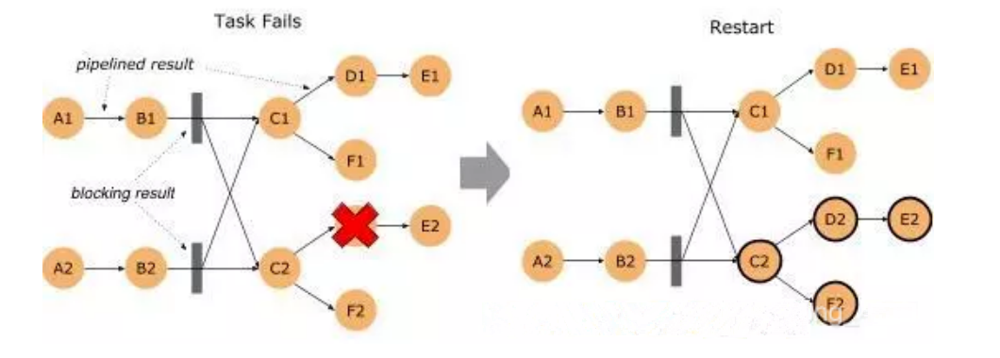

要使用这个新的故障策略，需要确保 flink-conf.yaml 中有 jobmanager.execution.failover-strategy: region 的配置。

注意：1.9 发布包中默认就已经包含了该配置项，不过当从之前版本升级上来时，如果要复用之前的配置的话，需要手动加上该配置。

“Region” 的故障策略也能同时提升 “embarrassingly parallel” 类型的流作业的恢复速度，也就是没有任何像 keyBy() 和 rebalance 的 shuffle 的作业。当这种作业在恢复时，只有受影响的故障区的 task 需要重启。对于其他类型的流作业，故障恢复行为与之前的版本一样。

**4.2. State Processor API (FLIP-43)**

直到 Flink 1.9，从外部访问作业的状态仅局限于：Queryable State（可查询状态）实验性功能。此版本中引入了一种新的、强大的类库，基于 DataSet 支持读取、写入、和修改状态快照。在实践上，这意味着：

- Flink 作业的状态可以自主构建了，可以通过读取外部系统的数据（例如外部数据库），然后转换成 savepoint。
- Savepoint 中的状态可以使用任意的 Flink 批处理 API 查询（DataSet、Table、SQL）。例如，分析相关的状态模式或检查状态差异以支持应用程序审核或故障排查。
- Savepoint 中的状态 schema 可以离线迁移了，而之前的方案只能在访问状态时进行，是一种在线迁移。
- Savepoint 中的无效数据可以被识别出来并纠正。

新的 State Processor API 覆盖了所有类型的快照：savepoint，full checkpoint 和 incremental checkpoint。

**4.3. Stop-with-Savepoint (FLIP-34)**

“Cancel-with-savepoint” 是停止、重启、fork、或升级 Flink 作业的一个常用操作。然而，当前的实现并没有保证输出到 exactly-once sink 的外部存储的数据持久化。为了改进停止作业时的端到端语义，Flink 1.9 引入了一种新的 SUSPEND 模式，可以带 savepoint 停止作业，保证了输出数据的一致性。你可以使用 Flink CLI 来 suspend 一个作业：

> bin/flink stop -p [:targetSavepointDirectory] :jobId

**4.4. 重构 Flink WebUI**

社区讨论了现代化 Flink WebUI 的提案，决定采用 Angular 的最新稳定版来重构这个组件。从 Angular 1.x 跃升到了 7.x 。重新设计的 UI 是 1.9.0 的默认版本，不过有一个按钮可以切换到旧版的 WebUI。

**4.5. 新 Blink SQL 查询处理器预览**

在 Blink 捐赠给 Apache Flink 之后，社区就致力于为 Table API 和 SQL 集成 Blink 的查询优化器和 runtime。第一步，我们将 flink-table 单模块重构成了多个小模块（FLIP-32）。这对于 Java 和 Scala API 模块、优化器、以及 runtime 模块来说，有了一个更清晰的分层和定义明确的接口。

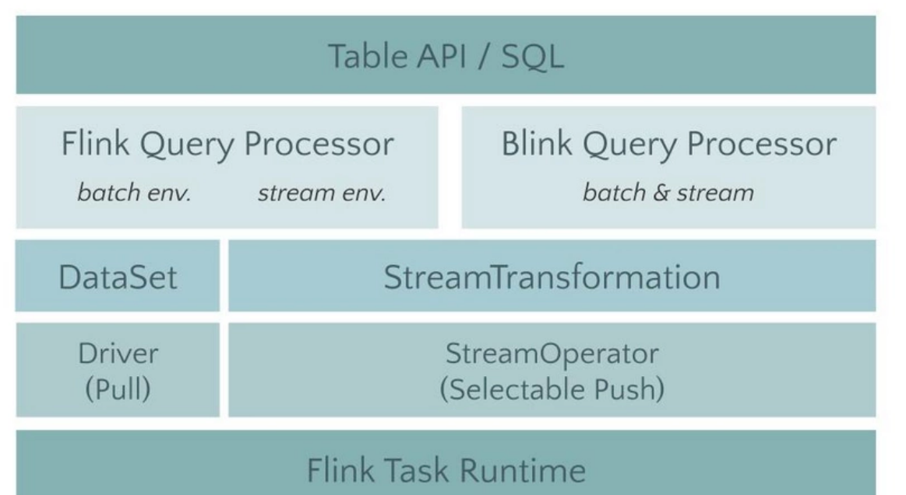

紧接着，我们扩展了 Blink 的 planner 以实现新的优化器接口，所以现在有两个插件化的查询处理器来执行 Table API 和 SQL：1.9 以前的 Flink 处理器和新的基于 Blink 的处理器。基于 Blink 的查询处理器提供了更好地 SQL 覆盖率（1.9 完整支持 TPC-H，TPC-DS 的支持在下一个版本的计划中）并通过更广泛的查询优化（基于成本的执行计划选择和更多的优化规则）、改进的代码生成机制、和调优过的算子实现来提升批处理查询的性能。除此之外，基于 Blink 的查询处理器还提供了更强大的流处理能力，包括一些社区期待已久的新功能（如维表 Join，TopN，去重）和聚合场景缓解数据倾斜的优化，以及内置更多常用的函数。

注：两个查询处理器之间的语义和功能大部分是一致的，但并未完全对齐。具体请查看发布日志。

不过， Blink 的查询处理器的集成还没有完全完成。因此，1.9 之前的 Flink 处理器仍然是1.9 版本的默认处理器，建议用于生产设置。你可以在创建 TableEnvironment 时通过 EnvironmentSettings 配置启用 Blink 处理器。被选择的处理器必须要在正在执行的 Java 进程的类路径中。对于集群设置，默认两个查询处理器都会自动地加载到类路径中。当从 IDE 中运行一个查询时，需要在项目中显式地增加一个处理器的依赖。

**4.6. Table API / SQL 的其他改进**

除了围绕 Blink Planner 令人兴奋的进展外，社区还做了一系列的改进，包括：

- 为 Table API / SQL 的 Java 用户去除 Scala 依赖 （FLIP-32） 作为重构和拆分 flink-table 模块工作的一部分，我们为 Java 和 Scala 创建了两个单独的 API 模块。对于 Scala 用户来说，没有什么改变。不过现在 Java 用户在使用 Table API 和 SQL 时，可以不用引入一堆 Scala 依赖了。
- 重构 Table API / SQL 的类型系统（FLIP-37） 我们实现了一个新的数据类型系统，以便从 Table API 中移除对 Flink TypeInformation 的依赖，并提高其对 SQL 标准的遵从性。不过还在进行中，预计将在下一版本完工，在 Flink 1.9 中，UDF 尚未移植到新的类型系统上。
- Table API 的多行多列转换（FLIP-29） Table API 扩展了一组支持多行和多列、输入和输出的转换的功能。这些转换显著简化了处理逻辑的实现，同样的逻辑使用关系运算符来实现是比较麻烦的。
- 崭新的统一的 Catalog API Catalog 已有的一些接口被重构和（某些）被替换了，从而统一了内部和外部 catalog 的处理。这项工作主要是为了 Hive 集成（见下文）而启动的，不过也改进了 Flink 在管理 catalog 元数据的整体便利性。
- SQL API 中的 DDL 支持 （FLINK-10232） 到目前为止，Flink SQL 已经支持 DML 语句（如 SELECT，INSERT）。但是外部表（table source 和 table sink）必须通过 Java/Scala 代码的方式或配置文件的方式注册。1.9 版本中，我们支持 SQL DDL 语句的方式注册和删除表（CREATE TABLE，DROP TABLE）。然而，我们还没有增加流特定的语法扩展来定义时间戳抽取和 watermark 生成策略等。流式的需求将会在下一版本完整支持。

#### 五 .Flink 1.10 版本 [重要版本 : Blink 整合完成]

作为 Flink 社区迄今为止规模最大的一次版本升级，Flink 1.10 容纳了超过 200 位贡献者对超过 1200 个 issue 的开发实现，包含对 Flink 作业的整体性能及稳定性的显著优化、对原生 Kubernetes 的初步集成（beta 版本）以及对 Python 支持（PyFlink）的重大优化。

Flink 1.10 同时还标志着对 Blink[1] 的整合宣告完成，随着对 Hive 的生产级别集成及对 TPC-DS 的全面覆盖，Flink 在增强流式 SQL 处理能力的同时也具备了成熟的批处理能力。

**5.1. 内存管理及配置优化**

Flink 目前的 TaskExecutor 内存模型存在着一些缺陷，导致优化资源利用率比较困难，例如：

流和批处理内存占用的配置模型不同；流处理中的 RocksDB state backend 需要依赖用户进行复杂的配置。为了让内存配置变的对于用户更加清晰、直观，Flink 1.10 对 TaskExecutor 的内存模型和配置逻辑进行了较大的改动 （FLIP-49 [7]）。这些改动使得 Flink 能够更好地适配所有部署环境（例如 Kubernetes, Yarn, Mesos），让用户能够更加严格的控制其内存开销。

- Managed 内存扩展

Managed 内存的范围有所扩展，还涵盖了 RocksDB state backend 使用的内存。尽管批处理作业既可以使用堆内内存也可以使用堆外内存，使用 RocksDB state backend 的流处理作业却只能利用堆外内存。因此为了让用户执行流和批处理作业时无需更改集群的配置，我们规定从现在起 managed 内存只能在堆外。

- 简化 RocksDB 配置

此前，配置像 RocksDB 这样的堆外 state backend 需要进行大量的手动调试，例如减小 JVM 堆空间、设置 Flink 使用堆外内存等。现在，Flink 的开箱配置即可支持这一切，且只需要简单地改变 managed 内存的大小即可调整 RocksDB state backend 的内存预算。

另一个重要的优化是，Flink 现在可以限制 RocksDB 的 native 内存占用（FLINK-7289 [8]），以避免超过总的内存预算——这对于 Kubernetes 等容器化部署环境尤为重要。关于如何开启、调试该特性，请参考 RocksDB 调试[9]。

注：FLIP-49 改变了集群的资源配置过程，因此从以前的 Flink 版本升级时可能需要对集群配置进行调整。详细的变更日志及调试指南请参考文档[10]。

**5.2. 统一的作业提交逻辑**

在此之前，提交作业是由执行环境负责的，且与不同的部署目标（例如 Yarn, Kubernetes, Mesos）紧密相关。这导致用户需要针对不同环境保留多套配置，增加了管理的成本。

在 Flink 1.10 中，作业提交逻辑被抽象到了通用的 Executor 接口（FLIP-73 [11]）。新增加的 ExecutorCLI （FLIP-81 [12]）引入了为任意执行目标[13]指定配置参数的统一方法。此外，随着引入 JobClient（FLINK-74 [14]）负责获取 JobExecutionResult，获取作业执行结果的逻辑也得以与作业提交解耦。

**5.3. 原生 Kubernetes 集成（Beta）**

对于想要在容器化环境中尝试 Flink 的用户来说，想要在 Kubernetes 上部署和管理一个 Flink standalone 集群，首先需要对容器、算子及像 kubectl 这样的环境工具有所了解。

在 Flink 1.10 中，我们推出了初步的支持 session 模式的主动 Kubernetes 集成（FLINK-9953 [15]）。其中，“主动”指 Flink ResourceManager (K8sResMngr) 原生地与 Kubernetes 通信，像 Flink 在 Yarn 和 Mesos 上一样按需申请 pod。用户可以利用 namespace，在多租户环境中以较少的资源开销启动 Flink。这需要用户提前配置好 RBAC 角色和有足够权限的服务账号。

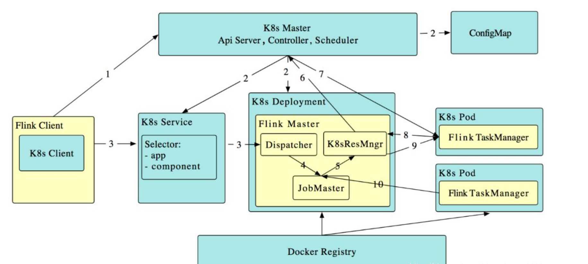

正如在统一的作业提交逻辑一节中提到的，Flink 1.10 将命令行参数映射到了统一的配置。因此，用户可以参阅 Kubernetes 配置选项，在命令行中使用以下命令向 Kubernetes 提交 Flink 作业。

```
./bin/flink run -d -e kubernetes-session -Dkubernetes.cluster-id= examples/streaming/WindowJoin.jar
```

**5.4. Table API/SQL: 生产可用的 Hive 集成**

Flink 1.9 推出了预览版的 Hive 集成。该版本允许用户使用 SQL DDL 将 Flink 特有的元数据持久化到 Hive Metastore、调用 Hive 中定义的 UDF 以及读、写 Hive 中的表。Flink 1.10 进一步开发和完善了这一特性，带来了全面兼容 Hive 主要版本[17]的生产可用的 Hive 集成。

- Batch SQL 原生分区支持

此前，Flink 只支持写入未分区的 Hive 表。在 Flink 1.10 中，Flink SQL 扩展支持了 INSERT OVERWRITE 和 PARTITION 的语法（FLIP-63 [18]），允许用户写入 Hive 中的静态和动态分区。

写入静态分区

> INSERT { INTO | OVERWRITE } TABLE tablename1 [PARTITION (partcol1=val1, partcol2=val2 …)] select_statement1 FROM from_statement;

写入动态分区

> INSERT { INTO | OVERWRITE } TABLE tablename1 select_statement1 FROM from_statement;

对分区表的全面支持，使得用户在读取数据时能够受益于分区剪枝，减少了需要扫描的数据量，从而大幅提升了这些操作的性能。

- 其他优化

除了分区剪枝，Flink 1.10 的 Hive 集成还引入了许多数据读取[19]方面的优化，例如：

投影下推：Flink 采用了投影下推技术，通过在扫描表时忽略不必要的域，最小化 Flink 和 Hive 表之间的数据传输量。这一优化在表的列数较多时尤为有效。

LIMIT 下推：对于包含 LIMIT 语句的查询，Flink 在所有可能的地方限制返回的数据条数，以降低通过网络传输的数据量。读取数据时的 ORC 向量化：为了提高读取 ORC 文件的性能，对于 Hive 2.0.0 及以上版本以及非复合数据类型的列，Flink 现在默认使用原生的 ORC 向量化读取器。

- 将可插拔模块作为 Flink 内置对象（Beta）

Flink 1.10 在 Flink table 核心引入了通用的可插拔模块机制，目前主要应用于系统内置函数（FLIP-68 [20]）。通过模块，用户可以扩展 Flink 的系统对象，例如像使用 Flink 系统函数一样使用 Hive 内置函数。新版本中包含一个预先实现好的 HiveModule，能够支持多个 Hive 版本，当然用户也可以选择编写自己的可插拔模块。

**5.5. 其他 Table API/SQL 优化**

- SQL DDL 中的 watermark 和计算列

Flink 1.10 在 SQL DDL 中增加了针对流处理定义时间属性及产生 watermark 的语法扩展（FLIP-66 [22]）。这使得用户可以在用 DDL 语句创建的表上进行基于时间的操作（例如窗口）以及定义 watermark 策略。

```
CREATE TABLE table_name (

WATERMARK FOR columnName AS <watermark_strategy_expression>

) WITH (
...
)
```

- 其他 SQL DDL 扩展

Flink 现在严格区分临时/持久、系统/目录函数（FLIP-57 [24]）。这不仅消除了函数引用中的歧义，还带来了确定的函数解析顺序（例如，当存在命名冲突时，比起目录函数、持久函数 Flink 会优先使用系统函数、临时函数）。

在 FLIP-57 的基础上，我们扩展了 SQL DDL 的语法，支持创建目录函数、临时函数以及临时系统函数（FLIP-79）：

```
CREATE [TEMPORARY|TEMPORARY SYSTEM] FUNCTION

[IF NOT EXISTS] [catalog_name.][db_name.]function_name

AS identifier [LANGUAGE JAVA|SCALA]
```

关于目前完整的 Flink SQL DDL 支持，请参考最新的文档[26]。

> 注：为了今后正确地处理和保证元对象（表、视图、函数）上的行为一致性，Flink 废弃了 Table API 中的部分对象申明方法，以使留下的方法更加接近标准的 SQL DDL（FLIP-64）。

- 批处理完整的 TPC-DS 覆盖

TPC-DS 是广泛使用的业界标准决策支持 benchmark，用于衡量基于 SQL 的数据处理引擎性能。Flink 1.10 端到端地支持所有 TPC-DS 查询（FLINK-11491 [28]），标志着 Flink SQL 引擎已经具备满足现代数据仓库及其他类似的处理需求的能力。

**5.6. PyFlink: 支持原生用户自定义函数（UDF）**

作为 Flink 全面支持 Python 的第一步，在之前版本中我们发布了预览版的 PyFlink。在新版本中，我们专注于让用户在 Table API/SQL 中注册并使用自定义函数（UDF，另 UDTF / UDAF 规划中）（FLIP-58）。

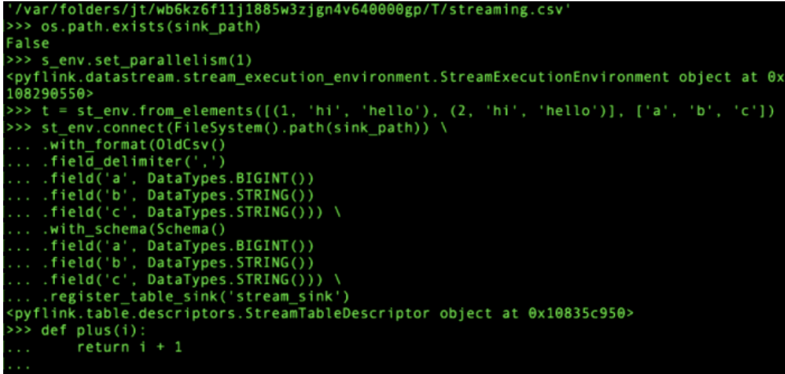

如果你对这一特性的底层实现（基于 Apache Beam 的可移植框架）感兴趣，请参考 FLIP-58 的 Architecture 章节以及 FLIP-78。这些数据结构为支持 Pandas 以及今后将 PyFlink 引入到 DataStream API 奠定了基础。

从 Flink 1.10 开始，用户只要执行以下命令就可以轻松地通过 pip 安装 PyFlink：

> pip install apache-flink

**5.7. 重要变更**

- FLINK-10725[34]：Flink 现在可以使用 Java 11 编译和运行。
- FLINK-15495[35]：SQL 客户端现在默认使用 Blink planner，向用户提供最新的特性及优化。Table API 同样计划在下个版本中从旧的 planner 切换到 Blink planner，我们建议用户现在就开始尝试和熟悉 Blink planner。
- FLINK-13025[36]：新的 Elasticsearch sink connector[37] 全面支持 Elasticsearch 7.x 版本。
- FLINK-15115[38]：Kafka 0.8 和 0.9 的 connector 已被标记为废弃并不再主动支持。如果你还在使用这些版本或有其他相关问题，请通过 @dev 邮件列表联系我们。
- FLINK-14516[39]：非基于信用的网络流控制已被移除，同时移除的还有配置项“taskmanager.network.credit.model”。今后，Flink 将总是使用基于信用的网络流控制。
- FLINK-12122[40]：在 Flink 1.5.0 中，FLIP-6[41] 改变了 slot 在 TaskManager 之间的分布方式。要想使用此前的调度策略，既尽可能将负载分散到所有当前可用的 TaskManager，用户可以在 flink-conf.yaml 中设置 “cluster.evenly-spread-out-slots: true”。
- FLINK-11956[42]：s3-hadoop 和 s3-presto 文件系统不再使用类重定位加载方式，而是使用插件方式加载，同时无缝集成所有认证提供者。我们强烈建议其他文件系统也只使用插件加载方式，并将陆续移除重定位加载方式。

Flink 1.9 推出了新的 Web UI，同时保留了原来的 Web UI 以备不时之需。截至目前，我们没有收到关于新的 UI 存在问题的反馈，因此社区投票决定在 Flink 1.10 中移除旧的 Web UI。

原文: https://developer.aliyun.com/article/744734

官方地址: https://flink.apache.org/news/2020/02/11/release-1.10.0.html

5.7. 重要变更 FLINK-10725[34]：Flink 现在可以使用 Java 11 编译和运行。FLINK-15495[35]：SQL 客户端现在默认使用 Blink planner，向用户提供最新的特性及优化。Table API 同样计划在下个版本中从旧的 planner 切换到 Blink planner，我们建议用户现在就开始尝试和熟悉 Blink planner。FLINK-13025[36]：新的 Elasticsearch sink connector[37] 全面支持 Elasticsearch 7.x 版本。FLINK-15115[38]：Kafka 0.8 和 0.9 的 connector 已被标记为废弃并不再主动支持。如果你还在使用这些版本或有其他相关问题，请通过 @dev 邮件列表联系我们。FLINK-14516[39]：非基于信用的网络流控制已被移除，同时移除的还有配置项“taskmanager.network.credit.model”。今后，Flink 将总是使用基于信用的网络流控制。FLINK-12122[40]：在 Flink 1.5.0 中，FLIP-6[41] 改变了 slot 在 TaskManager 之间的分布方式。要想使用此前的调度策略，既尽可能将负载分散到所有当前可用的 TaskManager，用户可以在 flink-conf.yaml 中设置 “cluster.evenly-spread-out-slots: true”。FLINK-11956[42]：s3-hadoop 和 s3-presto 文件系统不再使用类重定位加载方式，而是使用插件方式加载，同时无缝集成所有认证提供者。我们强烈建议其他文件系统也只使用插件加载方式，并将陆续移除重定位加载方式。Flink 1.9 推出了新的 Web UI，同时保留了原来的 Web UI 以备不时之需。截至目前，我们没有收到关于新的 UI 存在问题的反馈，因此社区投票决定[43]在 Flink 1.10 中移除旧的 Web UI。

原文: https://developer.aliyun.com/article/744734 官方地址: https://flink.apache.org/news/2020/02/11/release-1.10.0.html?spm=a2c6h.12873639.0.0.749e4fc0c1D14m

#### 六 .Flink 1.11 版本 [重要版本]

Flink 1.11.0 正式发布。历时近 4 个月，Flink 在生态、易用性、生产可用性、稳定性等方面都进行了增强和改善。

core engine 引入了 unaligned checkpoints，这是对 Flink 的容错机制的重大更改，该机制可改善在高背压下的检查点性能。

一个新的 Source API 通过统一批处理和 streaming 执行以及将内部组件（例如事件时间处理、水印生成或空闲检测）卸载到 Flink 来简化（自定义）sources 的实现。

Flink SQL 引入了对变更数据捕获（CDC）的支持，以轻松使用和解释来自 Debezium 之类的工具的数据库变更日志。更新的 FileSystem 连接器还扩展了 Table API/SQL 支持的用例和格式集，从而实现了直接启用从 Kafka 到 Hive 的 streaming 数据传输等方案。

PyFlink 的多项性能优化，包括对矢量化用户定义函数（Pandas UDF）的支持。这改善了与 Pandas 和 NumPy 之类库的互操作性，使 Flink 在数据科学和 ML 工作负载方面更强大。

**重要变化**

- [FLINK-17339] 从 Flink 1.11 开始，Blink planner 是 Table API/SQL中的默认设置。自 Flink 1.10 起，SQL 客户端已经存在这种情况。仍支持旧的 Flink 规划器，但未积极开发。
- [FLINK-5763] Savepoints 现在将其所有状态包含在一个目录中（元数据和程序状态）。这样可以很容易地找出组成 savepoint 状态的文件，并允许用户通过简单地移动目录来重新定位 savepoint。
- [FLINK-16408] 为了减轻对 JVM metaspace 的压力，只要任务分配了至少一个插槽，TaskExecutor就会重用用户代码类加载器。这会稍微改变 Flink 的恢复行为，从而不会重新加载静态字段。
- [FLINK-11086] Flink 现在支持 Hadoop 3.0.0 以上的 Hadoop 版本。请注意，Flink 项目不提供任何更新的flink-shaded-hadoop-x jars。用户需要通过HADOOP_CLASSPATH环境变量（推荐）或 lib/ folder 提供 Hadoop 依赖项。
- [FLINK-16963] Flink 随附的所有MetricReporters均已转换为插件。这些不再应该放在/lib中（可能导致依赖冲突），而应该放在/plugins/< some_directory>中。
- [FLINK-12639] Flink 文档正在做一些返工，因此从 Flink 1.11 开始，内容的导航和组织会有所变化。

官方原文: https://flink.apache.org/news/2020/07/06/release-1.11.0.html

**6.1. Table & SQL 支持 Change Data Capture（CDC）**

CDC 被广泛使用在复制数据、更新缓存、微服务间同步数据、审计日志等场景，很多公司都在使用开源的 CDC 工具，如 MySQL CDC。通过 Flink 支持在 Table & SQL 中接入和解析 CDC 是一个强需求，在过往的很多讨论中都被提及过，可以帮助用户以实时的方式处理 changelog 流，进一步扩展 Flink 的应用场景，例如把 MySQL 中的数据同步到 PG 或 ElasticSearch 中，低延时的 temporal join 一个 changelog 等。

除了考虑到上面的真实需求，Flink 中定义的“Dynamic Table”概念在流上有两种模型：append 模式和 update 模式。通过 append 模式把流转化为“Dynamic Table”在之前的版本中已经支持，因此在 1.11.0 中进一步支持 update 模式也从概念层面完整的实现了“Dynamic Table”。

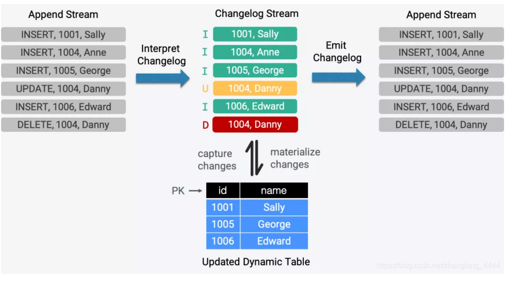

为了支持解析和输出 changelog，如何在外部系统和 Flink 系统之间编解码这些更新操作是首要解决的问题。考虑到 source 和 sink 是衔接外部系统的一个桥梁，因此 FLIP-95 在定义全新的 Table source 和 Table sink 接口时解决了这个问题。

在公开的 CDC 调研报告中，Debezium 和 Canal 是用户中最流行使用的 CDC 工具，这两种工具用来同步 changelog 到其它的系统中，如消息队列。据此，FLIP-105 首先支持了 Debezium 和 Canal 这两种格式，而且 Kafka source 也已经可以支持解析上述格式并输出更新事件，在后续的版本中会进一步支持 Avro（Debezium） 和 Protobuf（Canal）。

```
CREATE TABLE my_table (  
...) WITH (  
'connector'='...', -- e.g. 'kafka'  
'format'='debezium-json',  
'debezium-json.schema-include'='true' -- default: false (Debezium can be configured to include or exclude the message schema)  
'debezium-json.ignore-parse-errors'='true' -- default: false
);
```

**6.2. Table & SQL 支持 JDBC Catalog**

1.11.0 之前，用户如果依赖 Flink 的 source/sink 读写关系型数据库或读取 changelog 时，必须要手动创建对应的 schema。而且当数据库中的 schema 发生变化时，也需要手动更新对应的 Flink 作业以保持一致和类型匹配，任何不匹配都会造成运行时报错使作业失败。用户经常抱怨这个看似冗余且繁琐的流程，体验极差。

实际上对于任何和 Flink 连接的外部系统都可能有类似的上述问题，在 1.11.0 中重点解决了和关系型数据库对接的这个问题。FLIP-93 提供了 JDBC catalog 的基础接口以及 Postgres catalog 的实现，这样方便后续实现与其它类型的关系型数据库的对接。

1.11.0 版本后，用户使用 Flink SQL 时可以自动获取表的 schema 而不再需要输入 DDL。除此之外，任何 schema 不匹配的错误都会在编译阶段提前进行检查报错，避免了之前运行时报错造成的作业失败。这是提升易用性和用户体验的一个典型例子。

**6.3. Hive 实时数仓**

从 1.9.0 版本开始 Flink 从生态角度致力于集成 Hive，目标打造批流一体的 Hive 数仓。经过前两个版本的迭代，已经达到了 batch 兼容且生产可用，在 TPC-DS 10T benchmark 下性能达到 Hive 3.0 的 7 倍以上。

1.11.0 在 Hive 生态中重点实现了实时数仓方案，改善了端到端流式 ETL 的用户体验，达到了批流一体 Hive 数仓的目标。同时在兼容性、性能、易用性方面也进一步进行了加强。

在实时数仓的解决方案中，凭借 Flink 的流式处理优势做到实时读写 Hive：

- Hive 写入：FLIP-115 完善扩展了 FileSystem connector 的基础能力和实现，Table/SQL 层的 sink 可以支持各种格式（CSV、Json、Avro、Parquet、ORC），而且支持 Hive table 的所有格式。
- Partition 支持：数据导入 Hive 引入 partition 提交机制来控制可见性，通过sink.partition-commit.trigger 控制 partition 提交的时机，通过 sink.partition-commit.policy.kind 选择提交策略，支持 SUCCESS 文件和 metastore 提交。
- Hive 读取：实时化的流式读取 Hive，通过监控 partition 生成增量读取新 partition，或者监控文件夹内新文件生成来增量读取新文件。在 Hive 可用性方面的提升：
- FLIP-123 通过 Hive Dialect 为用户提供语法兼容，这样用户无需在 Flink 和 Hive 的 CLI 之间切换，可以直接迁移 Hive 脚本到 Flink 中执行。
- 提供 Hive 相关依赖的内置支持，避免用户自己下载所需的相关依赖。现在只需要单独下载一个包，配置 HADOOP_CLASSPATH 就可以运行。
- 在 Hive 性能方面，1.10.0 中已经支持了 ORC（Hive 2+）的向量化读取，1.11.0 中我们补全了所有版本的 Parquet 和 ORC 向量化支持来提升性能。

**6.4. 全新 Source API**

前面也提到过，source 和 sink 是 Flink 对接外部系统的一个桥梁，对于完善生态、可用性及端到端的用户体验是很重要的环节。社区早在一年前就已经规划了 source 端的彻底重构，从 FLIP-27 的 ID 就可以看出是很早的一个 feature。但是由于涉及到很多复杂的内部机制和考虑到各种 source connector 的实现，设计上需要考虑的很全面。从 1.10.0 就开始做 POC 的实现，最终赶上了 1.11.0 版本的发布。

先简要回顾下 source 之前的主要问题：

对用户而言，在 Flink 中改造已有的 source 或者重新实现一个生产级的 source connector 不是一件容易的事情，具体体现在没有公共的代码可以复用，而且需要理解很多 Flink 内部细节以及实现具体的 event time 分配、watermark 产出、idleness 监测、线程模型等。

批和流的场景需要实现不同的 source。

partitions/splits/shards 概念在接口中没有显式表达，比如 split 的发现逻辑和数据消费都耦合在 source function 的实现中，这样在实现 Kafka 或 Kinesis 类型的 source 时增加了复杂性。

在 runtime 执行层，checkpoint 锁被 source function 抢占会带来一系列问题，框架很难进行优化。

FLIP-27 在设计时充分考虑了上述的痛点：

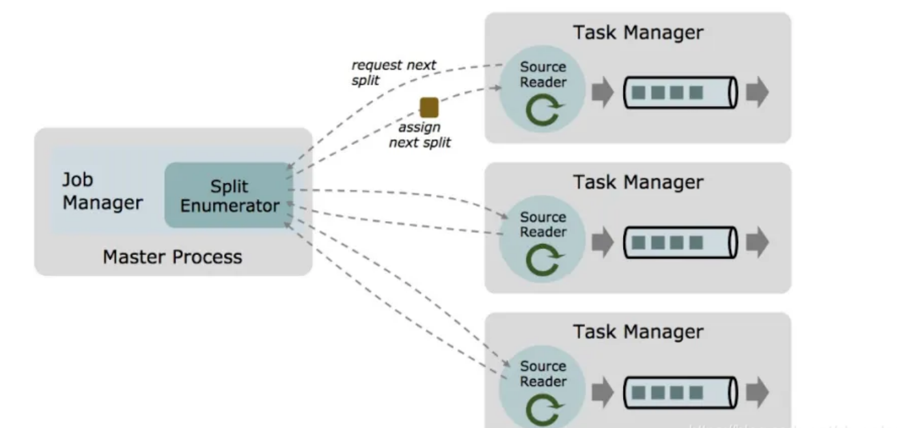

- 首先在 Job Manager 和 Task Manager 中分别引入两种不同的组件 Split Enumerator 和 Source reader，解耦 split 发现和对应的消费处理，同时方便随意组合不同的策略。比如现有的 Kafka connector 中有多种不同的 partition 发现策略和实现耦合在一起，在新的架构下，我们只需要实现一种 source reader，就可以适配多种 split enumerator 的实现来对应不同的 partition 发现策略。
- 在新架构下实现的 source connector 可以做到批流统一，唯一的小区别是对批场景的有限输入，split enumerator 会产出固定数量的 split 集合并且每个 split 都是有限数据集；对于流场景的无限输入，split enumerator 要么产出无限多的 split 或者 split 自身是无限数据集。
- 复杂的 timestamp assigner 以及 watermark generator 透明的内置在 source reader 模块内运行，对用户来说是无感知的。这样用户如果想实现新的 source connector，一般不再需要重复实现这部分功能。

目前 Flink 已有的 source connector 会在后续的版本中基于新架构来重新实现，legacy source 也会继续维护几个版本保持兼容性，用户也可以按照 release 文档中的说明来尝试体验新 source 的开发。

**6.5. PyFlink 生态**

众所周知，Python 语言在机器学习和数据分析领域有着广泛的使用。Flink 从 1.9.0 版本开始发力兼容 Python 生态，Python 和 Flink 合力为 PyFlink，把 Flink 的实时分布式处理能力输出给 Python 用户。前两个版本 PyFlink 已经支持了 Python Table API 和 UDF，在 1.11.0 中扩大对 Python 生态库 Pandas 的支持以及和 SQL DDL/Client 的集成，同时 Python UDF 性能有了极大的提升。

具体来说，之前普通的 Python UDF 每次调用只能处理一条数据，而且在 Java 端和 Python 端都需要序列化/反序列化，开销很大。1.11.0 中 Flink 支持在 Table & SQL 作业中自定义和使用向量化 Python UDF，用户只需要在 UDF 修饰中额外增加一个参数 udf_type=“pandas” 即可。这样带来的好处是：

- 每次调用可以处理 N 条数据。
- 数据格式基于 Apache Arrow，大大降低了 Java、Python 进程之间的序列化/反序列化开销。
- 方便 Python 用户基于 Numpy 和 Pandas 等数据分析领域常用的 Python 库，开发高性能的 Python UDF。

除此之外，1.11.0 中 PyFlink 还支持：

- PyFlink table 和 Pandas DataFrame 之间无缝切换（FLIP-120），增强 Pandas 生态的易用性和兼容性。
- Table & SQL 中可以定义和使用 Python UDTF（FLINK-14500），不再必需 Java/Scala UDTF。
- Cython 优化 Python UDF 的性能（FLIP-121），对比 1.10.0 可以提升 30 倍。
- Python UDF 中用户自定义 metric（FLIP-112），方便监控和调试 UDF 的执行。

上述解读的都是侧重 API 层面，用户开发作业可以直接感知到的易用性的提升。下面我们看看执行引擎层在 1.11.0 中都有哪些值得关注的变化。

**6.6. 生产可用性和稳定性提升**

> 6.6.1 支持 application 模式和 Kubernetes 增强

1.11.0 版本前，Flink 主要支持如下两种模式运行：

Session 模式：提前启动一个集群，所有作业都共享这个集群的资源运行。优势是避免每个作业单独启动集群带来的额外开销，缺点是隔离性稍差。如果一个作业把某个 Task Manager（TM）容器搞挂，会导致这个容器内的所有作业都跟着重启。虽然每个作业有自己独立的 Job Manager（JM）来管理，但是这些 JM 都运行在一个进程中，容易带来负载上的瓶颈。

Per-job 模式：为了解决 session 模式隔离性差的问题，每个作业根据资源需求启动独立的集群，每个作业的 JM 也是运行在独立的进程中，负载相对小很多。

以上两种模式的共同问题是**需要在客户端执行用户代码，编译生成对应的 Job Graph 提交到集群运行。**在这个过程需要下载相关 jar 包并上传到集群，客户端和网络负载压力容易成为瓶颈，尤其当一个客户端被多个用户共享使用。

1.11.0 中引入了 application 模式（FLIP-85）来解决上述问题，按照 application 粒度来启动一个集群，属于这个 application 的所有 job 在这个集群中运行。核心是 Job Graph 的生成以及作业的提交不在客户端执行，而是转移到 JM 端执行，这样网络下载上传的负载也会分散到集群中，不再有上述 client 单点上的瓶颈。

用户可以通过 bin/flink run-application 来使用 application 模式，目前 Yarn 和 Kubernetes（K8s）都已经支持这种模式。Yarn application 会在客户端将运行作业需要的依赖都通过 Yarn Local Resource 传递到 JM。K8s application 允许用户构建包含用户 jar 与依赖的镜像，同时会根据作业自动创建 TM，并在结束后销毁整个集群，相比 session 模式具有更好的隔离性。K8s 不再有严格意义上的 per-job 模式，application 模式相当于 per-job 在集群进行提交作业的实现。

除了支持 application 模式，Flink 原生 K8s 在 1.11.0 中还完善了很多基础的功能特性（FLINK-14460），以达到生产可用性的标准。例如 Node Selector、Label、Annotation、Toleration 等。为了更方便的与 Hadoop 集成，也支持根据环境变量自动挂载 Hadoop 配置的功能。

> 6.6.2 Checkpoint & Savepoint 优化

checkpoint 和 savepoint 机制一直是 Flink 保持先进性的核心竞争力之一，社区在这个领域的改动很谨慎，最近的几个大版本中几乎没有大的功能和架构上的调整。在用户邮件列表中，我们经常能看到用户反馈和抱怨的相关问题：比如 checkpoint 长时间做不出来失败，savepoint 在作业重启后不可用等等。1.11.0 有选择的解决了一些这方面的常见问题，提高生产可用性和稳定性。

1.11.0 之前， savepoint 中 meta 数据和 state 数据分别保存在两个不同的目录中，这样如果想迁移 state 目录很难识别这种映射关系，也可能导致目录被误删除，对于目录清理也同样有麻烦。1.11.0 把两部分数据整合到一个目录下，这样方便整体转移和复用。另外，之前 meta 引用 state 采用的是绝对路径，这样 state 目录迁移后路径发生变化也不可用，1.11.0 把 state 引用改成了相对路径解决了这个问题（FLINK-5763），这样 savepoint 的管理维护、复用更加灵活方便。

实际生产环境中，用户经常遭遇 checkpoint 超时失败、长时间不能完成带来的困扰。一旦作业 failover 会造成回放大量的历史数据，作业长时间没有进度，端到端的延迟增加。1.11.0 从不同维度对 checkpoint 的优化和提速做了改进，目标实现分钟甚至秒级的轻量型 checkpoint。

首先，增加了 Checkpoint Coordinator 通知 task 取消 checkpoint 的机制（FLINK-8871），这样避免 task 端还在执行已经取消的 checkpoint 而对系统带来不必要的压力。同时 task 端放弃已经取消的 checkpoint，可以更快的参与执行 coordinator 新触发的 checkpoint，某种程度上也可以避免新 checkpoint 再次执行超时而失败。这个优化也对后面默认开启 local recovery 提供了便利，task 端可以及时清理失效 checkpoint 的资源。

- 在反压场景下，整个数据链路堆积了大量 buffer，导致 checkpoint barrier 排在数据 buffer 后面，不能被 task 及时处理对齐，也就导致了 checkpoint 长时间不能执行。1.11.0 中从两个维度对这个问题进行解决：

1）尝试减少数据链路中的 buffer 总量（FLINK-16428），这样 checkpoint barrier 可以尽快被处理对齐。

上游输出端控制单个 sub partition 堆积 buffer 的最大阈值（backlog），避免负载不均场景下单个链路上堆积大量 buffer。在不影响网络吞吐性能的情况下合理修改上下游默认的 buffer 配置。上下游数据传输的基础协议进行了调整，允许单个数据链路可以配置 0 个独占 buffer 而不死锁，这样总的 buffer 数量和作业并发规模解耦。根据实际需求在吞吐性能和 checkpoint 速度两者之间权衡，自定义 buffer 配比。这个优化有一部分工作已经在 1.11.0 中完成，剩余部分会在下个版本继续推进完成。

2）实现了全新的 unaligned checkpoint 机制（FLIP-76）从根本上解决了反压场景下 checkpoint barrier 对齐的问题。

实际上这个想法早在 1.10.0 版本之前就开始酝酿设计，由于涉及到很多模块的大改动，实现机制和线程模型也很复杂。我们实现了两种不同方案的原型 POC 进行了测试、性能对比，确定了最终的方案，因此直到 1.11.0 才完成了 MVP 版本，这也是 1.11.0 中执行引擎层唯一的一个重量级 feature。其基本思想可以概括为：

Checkpoint barrier 跨数据 buffer 传输，不在输入输出队列排队等待处理，这样就和算子的计算能力解耦，barrier 在节点之间的传输只有网络延时，可以忽略不计。每个算子多个输入链路之间不需要等待 barrier 对齐来执行 checkpoint，第一个到的 barrier 就可以提前触发 checkpoint，这样可以进一步提速 checkpoint，不会因为个别链路的延迟而影响整体。

为了和之前 aligned checkpoint 的语义保持一致，所有未被处理的输入输出数据 buffer 都将作为 channel state 在 checkpoint 执行时进行快照持久化，在 failover 时连同 operator state 一同进行恢复。

换句话说**，aligned 机制保证的是 barrier 前面所有数据必须被处理完，状态实时体现到 operator state 中；而 unaligned 机制把 barrier 前面的未处理数据所反映的 operator state 延后到 failover restart 时通过 channel state 回放进行体现，从状态恢复的角度来说最终都是一致的。** 注意这里虽然引入了额外的 in-flight buffer 的持久化，但是这个过程实际是在 checkpoint 的异步阶段完成的，同步阶段只是进行了轻量级的 buffer 引用，所以不会过多占用算子的计算时间而影响吞吐性能。

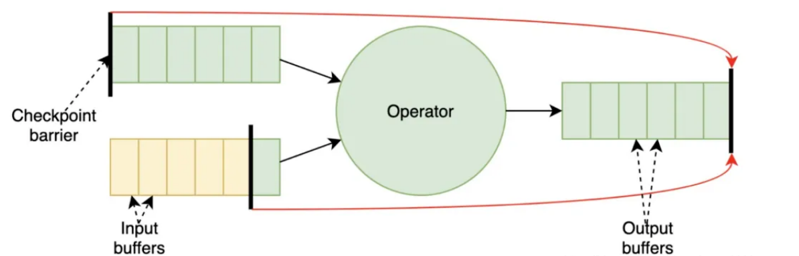

Unaligned checkpoint 在反压严重的场景下可以明显加速 checkpoint 的完成时间，因为它不再依赖于整体的计算吞吐能力，而和系统的存储性能更加相关，相当于计算和存储的解耦。但是它的使用也有一定的局限性，它会增加整体 state 的大小，对存储 IO 带来额外的开销，因此在 IO 已经是瓶颈的场景下就不太适合使用 unaligned checkpoint 机制。

1.11.0 中 unaligned checkpoint 还没有作为默认模式，需要用户手动配置来开启，并且只在 exactly-once 模式下生效。但目前还不支持 savepoint 模式，因为 savepoint 涉及到作业的 rescale 场景，channel state 目前还不支持 state 拆分，在后面的版本会进一步支持，所以 savepoint 目前还是会使用之前的 aligned 模式，在反压场景下有可能需要很长时间才能完成。

引用文章: https://developer.aliyun.com/article/767711

#### 七 .Flink 1.12 版本 [重要版本]

- 在 DataStream API 上添加了高效的批执行模式的支持。这是批处理和流处理实现真正统一的运行时的一个重要里程碑。
- 实现了基于Kubernetes的高可用性（HA）方案，作为生产环境中，ZooKeeper方案之外的另外一种选择。
- 扩展了 Kafka SQL connector，使其可以在 upsert 模式下工作，并且支持在 SQL DDL 中处理 connector 的 metadata。现在，时态表 Join 可以完全用 SQL 来表示，不再依赖于 Table API 了。
- PyFlink 中添加了对于 DataStream API 的支持，将 PyFlink 扩展到了更复杂的场景，比如需要对状态或者定时器 timer 进行细粒度控制的场景。除此之外，现在原生支持将 PyFlink 作业部署到 Kubernetes上。

7.1. DataStream API 支持批执行模式

Flink 的核心 API 最初是针对特定的场景设计的，尽管 Table API / SQL 针对流处理和批处理已经实现了统一的 API，但当用户使用较底层的 API 时，仍然需要在批处理（DataSet API）和流处理（DataStream API）这两种不同的 API 之间进行选择。鉴于批处理是流处理的一种特例，将这两种 API 合并成统一的 API，有一些非常明显的好处，比如：

- 可复用性：作业可以在流和批这两种执行模式之间自由地切换，而无需重写任何代码。因此，用户可以复用同一个作业，来处理实时数据和历史数据。
- 维护简单：统一的 API 意味着流和批可以共用同一组 connector，维护同一套代码，并能够轻松地实现流批混合执行，例如 backfilling 之类的场景。

考虑到这些优点，社区已朝着流批统一的 DataStream API 迈出了第一步：支持高效的批处理（FLIP-134）。从长远来看，这意味着 DataSet API 将被弃用（FLIP-131），其功能将被包含在 DataStream API 和 Table API / SQL 中。

- 有限流上的批处理

您已经可以使用 DataStream API 来处理有限流（例如文件）了，但需要注意的是，运行时并不“知道”作业的输入是有限的。为了优化在有限流情况下运行时的执行性能，新的 BATCH 执行模式，对于聚合操作，全部在内存中进行，且使用 sort-based shuffle（FLIP-140）和优化过的调度策略（请参见 Pipelined Region Scheduling 了解更多详细信息）。因此，DataStream API 中的 BATCH 执行模式已经非常接近 Flink 1.12 中 DataSet API 的性能。有关性能的更多详细信息，请查看 FLIP-140。

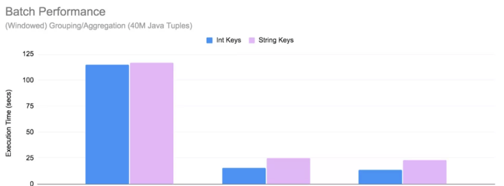

    		datastream/rocksDB       DataStream/Batch Group   DataSet API

在 Flink 1.12 中，默认执行模式为 STREAMING，要将作业配置为以 BATCH 模式运行，可以在提交作业的时候，设置参数 execution.runtime-mode：

> $ bin/flink run -Dexecution.runtime-mode=BATCH examples/streaming/WordCount.jar

或者通过编程的方式:

```
StreamExecutionEnvironment env = StreamExecutionEnvironment.getExecutionEnvironment();
env.setRuntimeMode(RuntimeMode.BATCH);
```

注意：尽管 DataSet API 尚未被弃用，但我们建议用户优先使用具有 BATCH 执行模式的 DataStream API 来开发新的批作业，并考虑迁移现有的 DataSet 作业。

**7.2. 新的 Data Sink API (Beta)**

之前发布的 Flink 版本中[1]，已经支持了 source connector 工作在流批两种模式下，因此在 Flink 1.12 中，社区着重实现了统一的 Data Sink API（FLIP-143）。新的抽象引入了 write/commit 协议和一个更加模块化的接口。Sink 的实现者只需要定义 what 和 how：SinkWriter，用于写数据，并输出需要 commit 的内容（例如，committables）；Committer 和 GlobalCommitter，封装了如何处理 committables。框架会负责 when 和 where：即在什么时间，以及在哪些机器或进程中 commit。

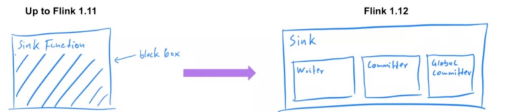

这种模块化的抽象允许为 BATCH 和 STREAMING 两种执行模式，实现不同的运行时策略，以达到仅使用一种 sink 实现，也可以使两种模式都可以高效执行。Flink 1.12 中，提供了统一的 FileSink connector，以替换现有的 StreamingFileSink connector （FLINK-19758）。其它的 connector 也将逐步迁移到新的接口。

**7.3. 基于 Kubernetes 的高可用 (HA) 方案**

Flink 可以利用 Kubernetes 提供的内置功能来实现 JobManager 的 failover，而不用依赖 ZooKeeper。为了实现不依赖于 ZooKeeper 的高可用方案，社区在 Flink 1.12（FLIP-144）中实现了基于 Kubernetes 的高可用方案。该方案与 ZooKeeper 方案基于相同的接口[3]，并使用 Kubernetes 的 ConfigMap[4] 对象来处理从 JobManager 的故障中恢复所需的所有元数据。关于如何配置高可用的 standalone 或原生 Kubernetes 集群的更多详细信息和示例，请查阅文档[5]。

> 注意：需要注意的是，这并不意味着 ZooKeeper 将被删除，这只是为 Kubernetes 上的 Flink 用户提供了另外一种选择。

7.4. 其它功能改进

- 将现有的 connector 迁移到新的 Data Source API

在之前的版本中，Flink 引入了新的 Data Source API（FLIP-27），以允许实现同时适用于有限数据（批）作业和无限数据（流）作业使用的 connector 。在 Flink 1.12 中，社区从 FileSystem connector（FLINK-19161）出发，开始将现有的 source connector 移植到新的接口。

注意: 新的 source 实现，是完全不同的实现，与旧版本的实现不兼容。

- Pipelined Region 调度 (FLIP-119)

在之前的版本中，Flink 对于批作业和流作业有两套独立的调度策略。Flink 1.12 版本中，引入了统一的调度策略， 该策略通过识别 blocking 数据传输边，将 ExecutionGraph 分解为多个 pipelined region。这样一来，对于一个 pipelined region 来说，仅当有数据时才调度它，并且仅在所有其所需的资源都被满足时才部署它；同时也可以支持独立地重启失败的 region。对于批作业来说，新策略可显著地提高资源利用率，并消除死锁。

- 支持 Sort-Merge Shuffle (FLIP-148)

为了提高大规模批作业的稳定性、性能和资源利用率，社区引入了 sort-merge shuffle，以替代 Flink 现有的实现。这种方案可以显著减少 shuffle 的时间，并使用较少的文件句柄和文件写缓存（这对于大规模批作业的执行非常重要）。在后续版本中（FLINK-19614），Flink 会进一步优化相关性能。

注意：该功能是实验性的，在 Flink 1.12 中默认情况下不启用。要启用 sort-merge shuffle，需要在 TaskManager 的网络配置[6]中设置合理的最小并行度。

- Flink WebUI 的改进 (FLIP-75)

作为对上一个版本中，Flink WebUI 一系列改进的延续，Flink 1.12 在 WebUI 上暴露了 JobManager 内存相关的指标和配置参数（FLIP-104）。对于 TaskManager 的指标页面也进行了更新，为 Managed Memory、Network Memory 和 Metaspace 添加了新的指标，以反映自 Flink 1.10（FLIP-102）开始引入的 TaskManager 内存模型的更改[7]。

**7.5. Table API/SQL 变更**

7.5.1. SQL Connectors 中的 Metadata 处理

如果可以将某些 source（和 format）的元数据作为额外字段暴露给用户，对于需要将元数据与记录数据一起处理的用户来说很有意义。一个常见的例子是 Kafka，用户可能需要访问 offset、partition 或 topic 信息、读写 kafka 消息中的 key 或 使用消息 metadata中的时间戳进行时间相关的操作。

在 Flink 1.12 中，Flink SQL 支持了元数据列用来读取和写入每行数据中 connector 或 format 相关的列（FLIP-107）。这些列在 CREATE TABLE 语句中使用 METADATA（保留）关键字来声明。

```
CREATE TABLE kafka_table (
id BIGINT,
name STRING,
event_time TIMESTAMP(3) METADATA FROM 'timestamp', -- access Kafka 'timestamp' metadata
headers MAP METADATA -- access Kafka 'headers' metadata
) WITH (
'connector' = 'kafka',
'topic' = 'test-topic',
'format' = 'avro'
);
```

在 Flink 1.12 中，已经支持 Kafka 和 Kinesis connector 的元数据，并且 FileSystem connector 上的相关工作也已经在计划中（FLINK-19903）。由于 Kafka record 的结构比较复杂，社区还专门为 Kafka connector 实现了新的属性[8]，以控制如何处理键／值对。关于 Flink SQL 中元数据支持的完整描述，请查看每个 connector 的文档[9]以及 FLIP-107 中描述的用例。

7.5.2. Upsert Kafka Connector

在某些场景中，例如读取 compacted topic 或者输出（更新）聚合结果的时候，需要将 Kafka 消息记录的 key 当成主键处理，用来确定一条数据是应该作为插入、删除还是更新记录来处理。为了实现该功能，社区为 Kafka 专门新增了一个 upsert connector（upsert-kafka），该 connector 扩展自现有的 Kafka connector，工作在 upsert 模式（FLIP-149）下。新的 upsert-kafka connector 既可以作为 source 使用，也可以作为 sink 使用，并且提供了与现有的 kafka connector 相同的基本功能和持久性保证，因为两者之间复用了大部分代码。

要使用 upsert-kafka connector，必须在创建表时定义主键，并为键（key.format）和值（value.format）指定序列化反序列化格式。完整的示例，请查看最新的文档[10]。

7.5.3. SQL 中 支持 Temporal Table Join

在之前的版本中，用户需要通过创建时态表函数（temporal table function） 来支持时态表 join（temporal table join） ，而在 Flink 1.12 中，用户可以使用标准的 SQL 语句 FOR SYSTEM_TIME AS OF（SQL：2011）来支持 join。此外，现在任意包含时间列和主键的表，都可以作为时态表，而不仅仅是 append-only 表。这带来了一些新的应用场景，比如将 Kafka compacted topic 或数据库变更日志（来自 Debezium 等）作为时态表。

```
CREATE TABLE orders (
    order_id STRING,
    currency STRING,
    amount INT,              
    order_time TIMESTAMP(3),                
    WATERMARK FOR order_time AS order_time - INTERVAL '30' SECOND
) WITH (
  …
);

-- Table backed by a Kafka compacted topic
CREATE TABLE latest_rates ( 
    currency STRING,
    rate DECIMAL(38, 10),
    currency_time TIMESTAMP(3),
    WATERMARK FOR currency_time AS currency_time - INTERVAL ‘5’ SECOND,
    PRIMARY KEY (currency) NOT ENFORCED      
) WITH (
  'connector' = 'upsert-kafka',
  …
);

-- Event-time temporal table join
SELECT 
  o.order_id,
  o.order_time,
  o.amount * r.rate AS amount,
  r.currency
FROM orders AS o, latest_rates FOR SYSTEM_TIME AS OF o.order_time r
ON o.currency = r.currency;
```

上面的示例同时也展示了如何在 temporal table join 中使用 Flink 1.12 中新增的 upsert-kafka connector。

- 使用 Hive 表进行 Temporal Table Join

用户也可以将 Hive 表作为时态表来使用，Flink 既支持自动读取 Hive 表的最新分区作为时态表（FLINK-19644），也支持在作业执行时追踪整个 Hive 表的最新版本作为时态表。请参阅文档，了解更多关于如何在 temporal table join 中使用 Hive 表的示例。

7.5.4. Table API/SQL 中的其它改进

- Kinesis Flink SQL Connector (FLINK-18858)

从 Flink 1.12 开始，Table API / SQL 原生支持将 Amazon Kinesis Data Streams（KDS）作为 source 和 sink 使用。新的 Kinesis SQL connector 提供了对于增强的Fan-Out（EFO）以及 Sink Partition 的支持。如需了解 Kinesis SQL connector 所有支持的功能、配置选项以及对外暴露的元数据信息，请查看最新的文档。

- 在 FileSystem/Hive connector 的流式写入中支持小文件合并 (FLINK-19345)

很多 bulk format，例如 Parquet，只有当写入的文件比较大时，才比较高效。当 checkpoint 的间隔比较小时，这会成为一个很大的问题，因为会创建大量的小文件。在 Flink 1.12 中，File Sink 增加了小文件合并功能，从而使得即使作业 checkpoint 间隔比较小时，也不会产生大量的文件。要开启小文件合并，可以按照文档[11]中的说明在 FileSystem connector 中设置 auto-compaction = true 属性。

- Kafka Connector 支持 Watermark 下推 (FLINK-20041)

为了确保使用 Kafka 的作业的结果的正确性，通常来说，最好基于分区来生成 watermark，因为分区内数据的乱序程度通常来说比分区之间数据的乱序程度要低很多。Flink 现在允许将 watermark 策略下推到 Kafka connector 里面，从而支持在 Kafka connector 内部构造基于分区的 watermark[12]。一个 Kafka source 节点最终所产生的 watermark 由该节点所读取的所有分区中的 watermark 的最小值决定，从而使整个系统可以获得更好的（即更接近真实情况）的 watermark。该功能也允许用户配置基于分区的空闲检测策略，以防止空闲分区阻碍整个作业的 event time 增长。

> 新增的 Formats

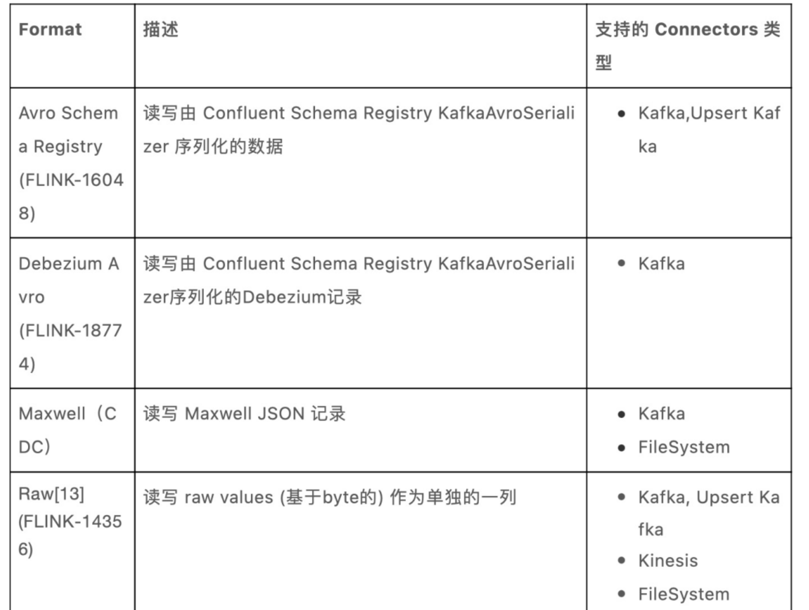

> 利用 Multi-input 算子进行 Join 优化 (FLINK-19621)

Shuffling 是一个 Flink 作业中最耗时的操作之一。为了消除不必要的序列化反序列化开销、数据 spilling 开销，提升 Table API / SQL 上批作业和流作业的性能， planner 当前会利用上一个版本中已经引入的N元算子（FLIP-92），将由 forward 边所连接的多个算子合并到一个 Task 里执行。

> Type Inference for Table API UDAFs (FLIP-65)

Flink 1.12 完成了从 Flink 1.9 开始的，针对 Table API 上的新的类型系统[2]的工作，并在聚合函数（UDAF）上支持了新的类型系统。从 Flink 1.12 开始，与标量函数和表函数类似，聚合函数也支持了所有的数据类型。

**7.6. PyFlink: Python DataStream API**

为了扩展 PyFlink 的可用性，Flink 1.12 提供了对于 Python DataStream API（FLIP-130）的初步支持，该版本支持了无状态类型的操作（例如 Map，FlatMap，Filter，KeyBy 等）。如果需要尝试 Python DataStream API，可以安装PyFlink，然后按照该文档[14]进行操作，文档中描述了如何使用 Python DataStream API 构建一个简单的流应用程序。

```
from pyflink.common.typeinfo import Types
from pyflink.datastream import MapFunction, StreamExecutionEnvironment
class MyMapFunction(MapFunction):
    def map(self, value):
        return value + 1
env = StreamExecutionEnvironment.get_execution_environment()
data_stream = env.from_collection([1, 2, 3, 4, 5], type_info=Types.INT())
mapped_stream = data_stream.map(MyMapFunction(), output_type=Types.INT())
mapped_stream.print()
env.execute("datastream job")
```

**7.7.PyFlink 中的其它改进**

- PyFlink Jobs on Kubernetes (FLINK-17480)

除了 standalone 部署和 YARN 部署之外，现在也原生支持将 PyFlink 作业部署在 Kubernetes 上。最新的文档中详细描述了如何在 Kubernetes 上启动 session 或 application 集群。

- 用户自定义聚合函数 (UDAFs)

从 Flink 1.12 开始，您可以在 PyFlink 作业中定义和使用 Python UDAF 了（FLIP-139）。普通的 UDF（标量函数）每次只能处理一行数据，而 UDAF（聚合函数）则可以处理多行数据，用于计算多行数据的聚合值。您也可以使用 Pandas UDAF[15]（FLIP-137），来进行向量化计算（通常来说，比普通 Python UDAF 快10倍以上）。

注意: 普通 Python UDAF，当前仅支持在 group aggregations 以及流模式下使用。如果需要在批模式或者窗口聚合中使用，建议使用 Pandas UDAF。

原文: https://developer.aliyun.com/article/780123

官方原文: https://flink.apache.org/news/2020/12/10/release-1.12.0.html


#### 八 .Flink 1.13 版本

##### 概要

这个版本是一些永久性的更新，帮助用户更好理解Flink程序的性能。当我们的流处理的速度并不是我们希望看到的性能的时候，这些新特性能帮助我们找到原因：数据加载和背压图能帮助定位性能瓶颈所在, CPU火焰图可以定位哪些代码是程序中的热点代码，State Access Latencies可以查看状态的保存情况

除了上述的特征，Flink社区还改进了系统的许多地方，其中有一些会在下面展示。

##### 主要功能点

###### 响应式伸缩

响应式伸缩是Flink的最新功能，它使流处理应用程序和其他应用程序一样自然，一样管理简单。

Flink的资源管理和部署具有双重特性，我们可以将Flink应用程序部署到K8S或者YARN等资源协调器上，这样Flink会积极管理和分配资源，并释放workers. 这对于快速修改Jobs或者Application的资源要求是非常有用的，比如批处理的应用或者ad-hoc的SQL查询。worker的数量将遵循Flink应用的并行度。

对于长时间运行的无限流程序，部署模式和其他长期运行的程序一样：应用程序不知道自己是运行在K8S，EKS或者YARN平台上，也不需要尝试获取一定数量的worker;相反，只需要提供给应用程序worker的数量，应用程序会根据提供的worker的数量自动调节并行度，我们称这种特性为响应式伸缩。

应用程序的部署模式开启了这项工作，类似于其他的程序部署一样(通过避开两个单独的步骤部署：1. 开启一个集群 2. 提交一个应用)。Flink的响应式伸缩模型完成了这点，使用者不需要使用额外的工具(脚本或者K8S命令)来保持worder的数量和程序的并行度的一致。

现在可以像对待其他典型应用程序一样，在Flink的应用程序中放一个自动伸缩器。同时在配置自动伸缩器的时候，你需要关心重新缩放的成本，因为有状态的流处理在伸缩的时候需要移动它的状态。

如果你需要尝试这个伸缩器的，需要添加scheduler-mode: reactive 这个配置到集群（只能是standalone 或者K8S集群）。详细参考

###### 分析应用程序性能

和其他的程序一样，分析和理解Flink应用程序的性能是非常重要的。通常更关键的是，在了解性能的同时我们希望Flink能够在(近)实时延迟内提供结果，因为Flink应用程序通常是数据密集型的应用。

当程序处理的速度跟不上数据进来的速度，或者应用程序占用的资源超过了预期，下面的功能能帮助我们追踪到原因：

> Bottleneck detection, Back Pressure monitoring

性能分析期间的第一个问题通常是:哪个Operation是瓶颈?

为了帮助回答这个问题，Flink公开了一些指标来描述那些当前处于繁忙或者背压状态的tasks的繁忙程度或者被压程度(背压是指有能力工作但不能工作，因为它们的后续操作符不能接受更多数据)。瓶颈所在都是那些繁忙的operators, 它们的上游operator实际承担大数据量的压力。

Flink 1.13带来了一个改进的背压度量系统(使用任务邮箱计时而不是线程堆栈采样)，以及一个重新设计的作业数据流图形表示，用颜色编码和繁忙度和背压比率表示。

- CPU flame graphs in Web UI

性能分析的第二个问题是：在所有有性能瓶颈的operators中，哪些operator的工作开销是最昂贵的？

回答这个问题，最直观的就是看CPU的火焰图：

1. 当前哪些方法在消耗CPU的资源？
2. 各个方法消耗的CPU的资源的多少对比？
3. 堆栈上的哪些调用会导致执行特定的方法？

火焰图是跟踪堆栈线程然后重复多次采样而生成的。每个方法的调用都会有一个长方型表示，长方型的长度和它在采样中出现的次数成正比。启用后，可以在Operator UI上查看:

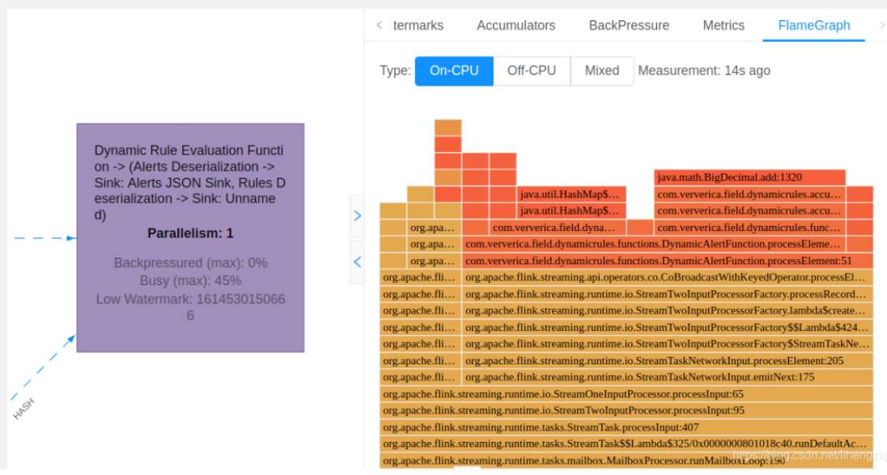

###### Access Latency Metrics for State

还有一个性能瓶颈的地方可能是backend state, 特别是当你的状态大小大于Flink当前可用的主内存并且你使用的是RockDB存储你的状态。

这并不是说RockDB慢，而是它在一定的条件下才能实现良好的性能。如果在云上使用了错误的硬盘资源类型，可有可能导致RockDB对磁盘IOPs的需求不足。

在CPU火焰图之上，新的后端状态延迟指标可以帮助解状态是否响应。e.g. 如果您看到RocksDB状态访问开始花费几毫秒的时间，可能需要查看您的内存和I/O配置。这些指标可以通过设置state.backend.rocksdb.latency-track-enabled可选项来激活使用。指标抽样收集应该对RocksDB状态后端性能有很小的影响。

##### Switching State Backend with savepoints

当需要从savepoint中回复Flink Job的时候，现在可以更改state backend。 这就意味着Flink的应用的状态不再锁定在程序最初启动时使用的状态了。e.g. 基于这个特性，我们可以在开始时使用HashMap来记录状态(纯粹在JVM中), 然后再状态增长太大的时候切换到RockDB来记录状态。

实际上，Flink现在有了规范的Savepoint格式，当为Savepoint创建数据快照时，所有状态后端都使用这种格式。

User-specified pod templates for Kubernetes deployments 在native K8S 部署模式下，用户可以指定pod模板。

使用这些模板，用户可以以Kubernetes-y的方式配置JobManagers和TaskManagers，其灵活性超出了直接内置到Flink的Kubernetes集成中的配置选项。

##### Unaligned Checkpoints - production-ready

非对齐的checkpoint可以在生产中使用了。如果你想在背压状态下看到程序的问题，鼓励使用unaligned checkpoints.

下面这些改变使unaligned checkpoints更容易使用：

1. 在可以从unaligned checkpoints重新调整应用程序。如果您的应用程序由于无法(负担不起)创建Savepoints而需要从checkpoints进行扩展，那么这将非常方便
2. 对于没有back-pressured的应用程序，启用unaligned checkpoints成本更低。unaligned checkpoints现在可以通过超时自适应地触发，这意味着一个checkpoint作为一个对齐的checkpoint开始(不存储任何飞行中的事件)，并回落到一个未对齐的checkpoint(存储一些飞行中的事件)，如果对齐阶段花费的时间超过了一定的时间.

##### Machine Learning Library moving to a separate repository

为了加快Flink机器学习(流、批处理和统一机器学习)的开发, 我们把主要经历放在Flink项目下的新库Flink-ml。在这里，我们遵循类似于Stateful Functions的方法，通过允许更多轻量级贡献工作流和单独的发布周期，单独的存储库帮助加快了开发。

请继续关注机器学习方面的更多更新，比如与ALink (Flink上许多常见的机器学习算法套件)的相互作用，或者Flink与TensorFlow的集成。

#### SQL和表的接口改进

与以前的版本一样，SQL和Table API仍然需求量最大的部分。

##### Windows via Table-valued functions 表值函数定义窗口

定义时间窗口是流SQL查询中最常见的操作之一。Flink 1.13介绍了一种定义窗口的新方法: 通过表值函数。这种方法不仅表达能力更强(允许您定义新的窗口类型)，而且完全符合SQL标准。

Flink 1.13支持新的语法中的TUMBLE和HOP窗口，后续的版本中还会有SESSION窗口。为了演示增加的表达能力，考虑下面两个例子。

```
-- 一种新的 CUMULATE 窗函数，它给窗口分配一个扩展步长直到达到最大窗口大小:
SELECT window_time, window_start, window_end, SUM(price) AS total_price 
  FROM TABLE(CUMULATE(TABLE Bid, DESCRIPTOR(bidtime), INTERVAL '2' MINUTES, INTERVAL '10' MINUTES))
GROUP BY window_start, window_end, window_time;
```

可以引用表值窗口函数的窗口开始时间和窗口结束时间，从而使新类型的构造成为可能。除了常规的窗口聚合和窗口连接之外，现在可以表示窗口Top-K聚合:

```
SELECT window_time, ...
  FROM (
    SELECT *, ROW_NUMBER() OVER (PARTITION BY window_start, window_end ORDER BY total_price DESC) 
      as rank 
    FROM t
  ) WHERE rank <= 100;
```

#### 改进DataStream API和Table API/SQL之间的互操转换

这个版本从根本上简化了DataStream API和Table API程序的混合。Table API是开发应用程序的好方法，它具有声明特性和许多内置函数。 但有时需要转到使用DataStream API，以获得其表达性、灵活性和对状态的显式控制。

新的方法StreamTableEnvironment.toDataStream()/.fromDataStream() 从DataStream API创建一个DataStream作为表的Source或者Sink.

显著的改进有：

1. DataStream和Table API类型自动类型转换
2. Event Time配置的无缝集成; 为了高一致性，水印在边界流动
3. 对Row类(表示来自Table API的行事件)的增强已经得到了重大改进(改进了toString()/hashCode()/equals()方法的行为)，现在支持通过名称访问实例属性值，并支持稀疏表示。

```
Table table=tableEnv.fromDataStream(
    dataStream,Schema.newBuilder()
    .columnByMetadata("rowtime","TIMESTAMP(3)")
    .watermark("rowtime","SOURCE_WATERMARK()")
    .build());

DataStream<Row> dataStream=tableEnv.toDataStream(table)
    .keyBy(r->r.getField("user"))
    .window(...)
```

##### SQL Client: Init scripts and Statement Sets

SQL客户端是一种直接运行和部署SQL流作业和批处理作业的简便方法，不需要命令行编写代码，也不需要CI/CD的支持。

本版本改进了许多SQL客户端的功能，几乎Java应用中可以使用所有的operations都可以在SQL客户端或者SQL脚本中使用。也就是说SQL用户将写更少的代码。

Easier Configuration and Code Sharing 更简单的配置和代码共享

SQL客户端将停止对YAML文件的支持，转而在执行主SQL脚本前接受一个或者多个初始化脚本来配置session.

这些初始化的脚本通常在软对或者部署之间共享，可以用于加载公共的catalogs，应用公共配置设置或者定义标准视图。

```
./sql-client.sh -i init1.sql init2.sql -f sqljob.sql
```

###### 更多的配置选项

一组更大的可识别配置选项和改进的set/RESET命令使得在SQL客户端和SQL脚本中定义和控制应用程序的执行变得更容易。

在一个上下文中支持多查询

支持在一个Flink Job中执行多个SQL语句查询，这对无限流中的SQL查询非常有用。

Statement Set是将应该放在一起执行的查询分组在一起的机制

下面是一个可以通过Flink SQL命令行客户端运行的SQL脚本例子。 它设置和配置环境并执行多个查询。 该脚本捕获端到端查询和所有环境构建和配置工作，使其成为自包含的artifact。

```
-- set up a catalog
CREATE CATALOG hive_catalog WITH ('type' = 'hive');
USE CATALOG hive_catalog;

-- or use temporary objects
CREATE TEMPORARY TABLE clicks (
  user_id BIGINT,
  page_id BIGINT,
  viewtime TIMESTAMP
) WITH (
  'connector' = 'kafka',
  'topic' = 'clicks',
  'properties.bootstrap.servers' = '...',
  'format' = 'avro'
);

-- set the execution mode for jobs
SET execution.runtime-mode=streaming;

-- set the sync/async mode for INSERT INTOs
SET table.dml-sync=false;

-- set the job's parallelism
SET parallism.default=10;

-- set the job name
SET pipeline.name = my_flink_job;

-- restore state from the specific savepoint path
SET execution.savepoint.path=/tmp/flink-savepoints/savepoint-bb0dab;

BEGIN STATEMENT SET;

INSERT INTO pageview_pv_sink
SELECT page_id, count(1) FROM clicks GROUP BY page_id;

INSERT INTO pageview_uv_sink
SELECT page_id, count(distinct user_id) FROM clicks GROUP BY page_id;

END;
```

###### Hive查询语法兼容性

现在可以使用Hive SQL语法编写针对Flink的SQL查询。 除了Hive的DDL方言，Flink现在也接受常用的Hive DML和DQL方言。

要使用Hive SQL方言，设置 table.sql-dialect 为 hive并加载 HiveModule 。 HiveModule 的加载很重要，因为Hive的内置函数需要适当的语法和语义兼容性。 下面的例子说明了这一点:

```
CREATE CATALOG myhive WITH ('type' = 'hive'); -- setup HiveCatalog
USE CATALOG myhive;
LOAD MODULE hive; -- setup HiveModule
USE MODULES hive,core;
SET table.sql-dialect = hive; -- enable Hive dialect
SELECT key, value FROM src CLUSTER BY key; -- run some Hive queries
```

请注意，Hive方言不再支持Flink的SQL语法的DML和DQL语句, 需要切换回Flink语法的默认方言。

###### 改进SQL时间函数的行为

处理时间是任何数据处理的关键要素。 但同时，处理包含不同的时区、日期和时间的数据时是一项非常精细的任务。

在Flink 1.13。 官方花了很多精力简化与时间相关的函数的使用。 调整了(更具体地)函数的返回类型，如 PROCTIME() 、 CURRENT_TIMESTAMP 、 NOW()。

此外，您现在还可以在 TIMESTAMP_LTZ 列上定义event time属性，以便在Daylight Saving Time的支持下优雅地进行窗口处理。

#### PyFlink的改进

PyFlink这个版本的主要的主题是让Python DataStream API和Table API在特性上更接近Java/Scala API。

###### Python DataStream API中的有状态操作

在Flink 1.13中, Python程序员现在也可以充分享受Apache Flink的有状态流处理api的潜力。 Flink 1.12中引入的重新架构过的Python DataStream API，现在拥有完整的状态功能，允许用户记住状态中的事件的信息，并在以后对其进行操作。

这种有状态处理能力是许多更复杂的处理操作的基础，这些操作需要记住跨单个事件的信息(例如，Windowing operations)。

下面这个例子展示了一个自定义计数窗口的实现，使用state:

```
class CountWindowAverage(FlatMapFunction):
    def __init__(self, window_size):
        self.window_size = window_size

    def open(self, runtime_context: RuntimeContext):
        descriptor = ValueStateDescriptor("average", Types.TUPLE([Types.LONG(), Types.LONG()]))
        self.sum = runtime_context.get_state(descriptor)

    def flat_map(self, value):
        current_sum = self.sum.value()
        if current_sum is None:
            current_sum = (0, 0)
        # update the count
        current_sum = (current_sum[0] + 1, current_sum[1] + value[1])
        # if the count reaches window_size, emit the average and clear the state
        if current_sum[0] >= self.window_size:
            self.sum.clear()
            yield value[0], current_sum[1] // current_sum[0]
        else:
            self.sum.update(current_sum)

ds = ...  # type: DataStream
ds.key_by(lambda row: row[0]) \
  .flat_map(CountWindowAverage(5))
```

###### PyFlink DataStream API中用户自定义窗口

Flink 1.13为PyFlink DataStream API增加了对用户定义的窗口的支持。 Flink程序现在可以在标准窗口定义之外使用窗口。

因为窗口是所有处理无限流的程序的核心(通过将无限流分割成有大小的“桶”)，这大大提高了API的表达能力。

###### PyFlink Table API中基于行的操作

Python Table API现在支持基于行的操作，例如，自定义的行转换函数。 这些函数是在内置函数之外对表应用数据转换的一种简单方法。

这是一个在Python Table API中使用map()操作的例子:

```
@udf(result_type=DataTypes.ROW(
  [DataTypes.FIELD("c1", DataTypes.BIGINT()),
   DataTypes.FIELD("c2", DataTypes.STRING())]))
def increment_column(r: Row) -> Row:
  return Row(r[0] + 1, r[1])

table = ...  # type: Table
mapped_result = table.map(increment_column)
```

除了map()之外，该API还支持flat_map()、aggregate()、flat_aggregate()和其他基于行操作的函数。 这使得Python Table API与Java Table API在特性上更相近了。

###### PyFlink DataStream程序的批处理执行模式

PyFlink DataStream API现在也支持有界流的批处理执行模式，这是在Flink 1.12中为Java DataStream API引入的。

批处理执行模式通过利用有界流的特性，绕过状态后端和检查点，简化了有界流上的操作并提高了程序的性能。

#### 其他改进

###### 使用Hugo查看Flink Documentation

Flink文档已经从Jekyll迁移到了Hugo。

###### Web UI中的历史异常

Flink Web UI将显示多个(n个)导致作业失败的异常。 这有助于调试由根故障导致后续故障的场景。 可以在异常历史记录中找到失败的根本原因。

###### 更好的报告失败的checkpoints的异常或者失败的原因

Flink现在提供了失败或被中止的检查点的统计信息，以便更容易地确定失败原因，而不必分析日志

以前版本的Flink只有在检查点成功的情况下才会报告指标(例如，持久化数据的大小、触发时间)。

###### PyFlink Table API支持用户在Group Windows自定义聚合函数

PyFlink的Table API中的组窗口现在同时支持一般的Python用户定义聚合函数(udaf)和Pandas udaf。 这些功能对于许多分析和ML训练程序是至关重要的。

Flink 1.13对以前的版本进行了改进，在以前的版本中，这些函数只支持无界的Group-by聚合。

###### 改进Batch Execution下的Sort-Merge Shuffle

Flink 1.13提高了批执行程序的内存稳定性和Sort-Merge Shuffle的性能，Flink 1.12最初是通过FLIP-148引入的。

具有更高并行度(1000秒)的程序应该不再频繁触发OutOfMemoryError: Direct Memory。 通过更好的I/O调度和广播优化提高了性能(特别是在旋转磁盘上)。

###### HBase连接器支持异步查找和查找缓存

HBase Lookup Table Source现在支持异步查找模式和查找缓存。 这极大地提高了对HBase进行查找连接的Table/SQL作业的性能，同时减少了典型场景下对HBase的I/O请求。

在以前的版本中，HBase Lookup Source只进行同步通信，导致管道利用率和吞吐量较低。

#### 九、Flink1.14版本

##### 批流一体

流批一体其实从 Flink 1.9 版本开始就受到持续的关注，它作为社区 RoadMap 的重要组成部分，是大数据实时化必然的趋势。但是另一方面，传统离线的计算需求其实并不会被实时任务完全取代，而是会长期存在。

在实时和离线的需求同时存在的状态下，以往的流批独立技术方案存在着一些痛点，比如：

- 需要维护两套系统，相应的就需要两组开发人员，人力的投入成本很高；
- 另外，两套数据链路处理相似内容带来维护的风险性和冗余；
- 最重要的一点是，如果流批使用的不是同一套数据处理系统，引擎本身差异可能会存在数据口径不一致的问题，从而导致业务数据存在一定的误差。这种误差对于大数据分析会有比较大的影响。

在这样的背景下，Flink 社区认定了实时离线一体化的技术路线是比较重要的技术趋势和方向。

Flink 在过去的几个版本中，在流批一体方面做了很多的工作。可以认为 Flink 在引擎层面，API 层面和算子的执行层面上做到了真正的流与批用同一套机制运行。但是在任务具体的执行模式上会有 2 种不同的模式：

对于无限的数据流，统一采用了流的执行模式。流的执行模式指的是所有计算节点是通过 Pipeline 模式去连接的，Pipeline 是指上游和下游计算任务是同时运行的，随着上游不断产出数据，下游同时在不断消费数据。这种全 Pipeline 的执行方式可以：

- 通过 eventTime 表示数据是什么时候产生的；
- 通过 watermark 得知在哪个时间点，数据已经到达了；
- 通过 state 来维护计算中间状态；
- 通过 Checkpoint 做容错的处理。

下图是不同的执行模式：

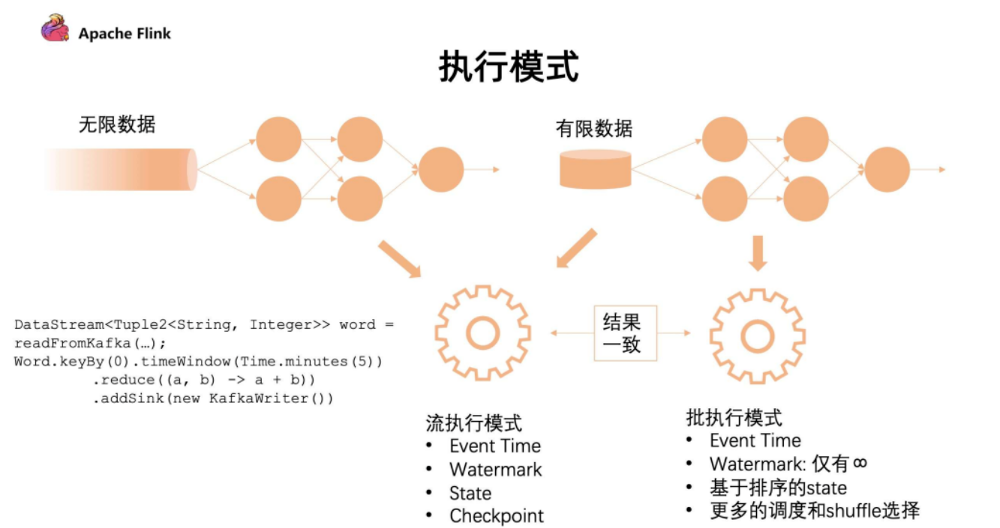

- 对于有限的数据集有 2 种执行模式，我们可以把它看成一个有限的数据流去做处理，也可以把它看成批的执行模式。批的执行模式虽然也有 eventTime，但是对于 watermark 来说只支持正无穷。对数据和 state 排序后，它在任务的调度和 shuffle 上会有更多的选择。

流批的执行模式是有区别的，最主要的就是批的执行模式会有落盘的中间过程，只有当前面任务执行完成，下游的任务才会触发，这个容错机制是通过 shuffle 进行容错的。

这 2 者也各有各的执行优势：

- 对于流的执行模式来说，它没有落盘的压力，同时容错是基于数据的分段，通过不断对数据进行打点 Checkpoint 去保证断点恢复；
- 然而在批处理上，因为要经过 shuffle 落盘，所以对磁盘会有压力。但是因为数据是经过排序的，所以对批来说，后续的计算效率可能会有一定的提升。同时，在执行时候是经过分段去执行任务的，无需同时执行。在容错计算方面是根据 stage 进行容错。

这两种各有优劣，可以根据作业的具体场景来进行选择。

Flink 1.14 的优化点主要是针对在流的执行模式下，如何去处理有限数据集。之前处理无限数据集，和现在处理有限数据集最大的区别在于引入了 "任务可能会结束" 的概念。在这种情况下带来一些新的问题，如下图:

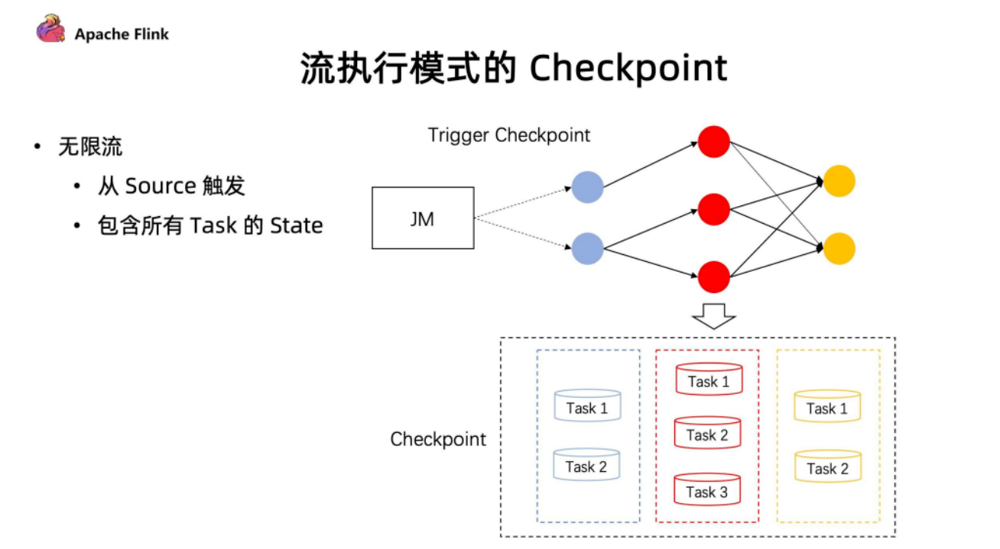

**在流的执行模式下的 Checkpoint 机制**

- 对于无限流，它的 Checkpoint 是由所有的 source 节点进行触发的，由 source 节点发送 Checkpoint Barrier ，当 Checkpoint Barrier 流过整个作业时候，同时会存储当前作业所有的 state 状态。
- 而在有限流的 Checkpoint 机制中，Task 是有可能提早结束的。上游的 Task 有可能先处理完任务提早退出了，但下游的 Task 却还在执行中。在同一个 stage 不同并发下，有可能因为数据量不一致导致部分任务提早完成了。这种情况下，在后续的执行作业中，如何进行 Checkpoint？

在 1.14 中，JobManager 动态根据当前任务的执行情况，去明确 Checkpoint Barrier 是从哪里开始触发。同时在部分任务结束后，后续的 Checkpoint 只会保存仍在运行 Task 所对应的 stage，通过这种方式能够让任务执行完成后，还可以继续做 Checkpoint ，在有限流执行中提供更好的容错保障。

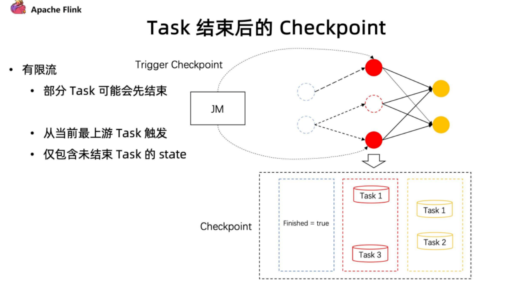

**Task 结束后的两阶段提交**

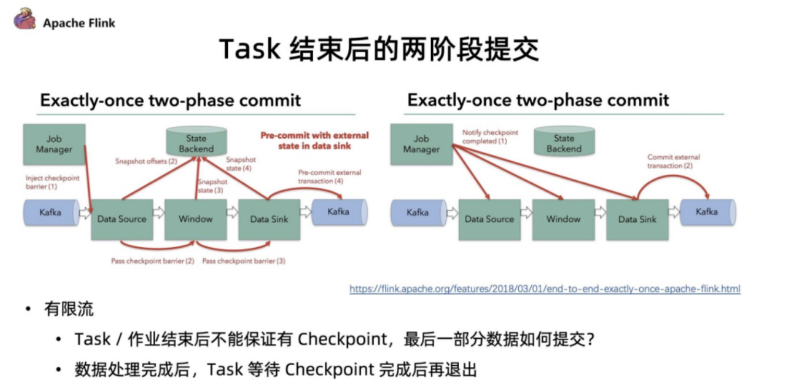

我们在部分 Sink 使用上，例如下图的 Kafka Sink 上，涉及到 Task 需要依靠 Checkpoint 机制，进行二阶段提交，从而保证数据的 Exactly-once 一致性。

具体可以这样说：在 Checkpoint 过程中，每个算子只会进行准备提交的操作。比如数据会提交到外部的临时存储目录下，所有任务都完成这次 Checkpoint 后会收到一个信号，之后才会执行正式的 commit，把所有分布式的临时文件一次性以事务的方式提交到外部系统。

这种算法在当前有限流的情况下，作业结束后并不能保证有 Checkpoint，那么最后一部分数据如何提交？

在 1.14 中，这个问题得到了解决。Task 处理完所有数据之后，必须等待 Checkpoint 完成后才可以正式的退出，这是流批一体方面针对有限流任务结束的一些改进。

##### Checkpoint 机制

###### 1. 现有 Checkpoint 机制痛点

目前 Flink 触发 Checkpoint 是依靠 barrier 在算子间进行流通，barrier 随着算子一直往下游进行发送，当算子下游遇到 barrier 的时候就会进行快照操作，然后再把 barrier 往下游继续发送。对于多路的情况我们会把 barrier 进行对齐，把先到 barrier 的这一路数据暂时性的 block，等到两路 barrier 都到了之后再做快照，最后才会去继续往下发送 barrier。

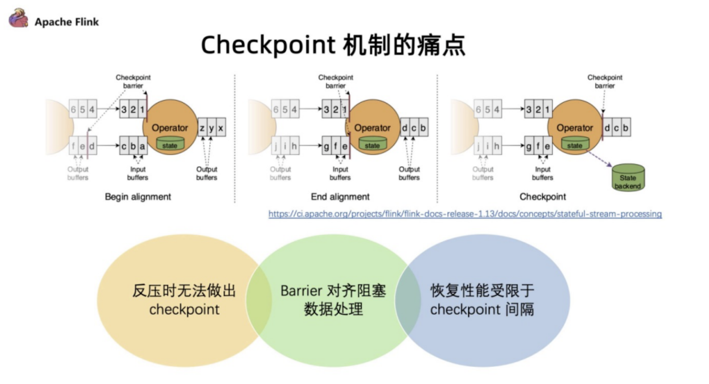

现有的 Checkpoint 机制存在以下问题：

- 反压时无法做出 Checkpoint ：在反压时候 barrier 无法随着数据往下游流动，造成反压的时候无法做出 Checkpoint。但是其实在发生反压情况的时候，我们更加需要去做出对数据的 Checkpoint，因为这个时候性能遇到了瓶颈，是更加容易出问题的阶段；
- Barrier 对齐阻塞数据处理 ：阻塞对齐对于性能上存在一定的影响；
- 恢复性能受限于 Checkpoint 间隔 ：在做恢复的时候，延迟受到多大的影响很多时候是取决于 Checkpoint 的间隔，间隔越大，需要 replay 的数据就会越多，从而造成中断的影响也就会越大。但是目前 Checkpoint 间隔受制于持久化操作的时间，所以没办法做的很快。

###### 2. Unaligned Checkpoint

针对这些痛点，Flink 在最近几个版本一直在持续的优化，Unaligned Checkpoint 就是其中一个机制。barrier 算子在到达 input buffer 最前面的时候，就会开始触发 Checkpoint 操作。它会立刻把 barrier 传到算子的 OutPut Buffer 的最前面，相当于它会立刻被下游的算子所读取到。通过这种方式可以使得 barrier 不受到数据阻塞，解决反压时候无法进行 Checkpoint 的问题。

当我们把 barrier 发下去后，需要做一个短暂的暂停，暂停的时候会把算子的 State 和 input output buffer 中的数据进行一个标记，以方便后续随时准备上传。对于多路情况会一直等到另外一路 barrier 到达之前数据，全部进行标注。

通过这种方式整个在做 Checkpoint 的时候，也不需要对 barrier 进行对齐，唯一需要做的停顿就是在整个过程中对所有 buffer 和 state 标注。这种方式可以很好的解决反压时无法做出 Checkpoint ，和 Barrier 对齐阻塞数据影响性能处理的问题。


###### 3. Generalized Incremental Checkpoint

Generalized Incremental Checkpoint 主要是用于减少 Checkpoint 间隔，如左图 1 所示，在 Incremental Checkpoint 当中，先让算子写入 state 的 changelog。写完后才把变化真正的数据写入到 StateTable 上。state 的 changelog 不断向外部进行持久的存储化。在这个过程中我们其实无需等待整个 StateTable 去做一个持久化操作，我们只需要保证对应的 Checkpoint 这一部分的 changelog 能够持久化完成，就可以开始做下一次 Checkpoint。StateTable 是以一个周期性的方式，独立的去对外做持续化的一个过程。


这两个过程进行拆分后，就有了从之前的需要做全量持久化 (Per Checkpoint) 变成 增量持久化 (Per Checkpoint) + 后台周期性全量持久化，从而达到同样容错的效果。在这个过程中，每一次 Checkpoint 需要做持久化的数据量减少了，从而使得做 Checkpoint 的间隔能够大幅度减少。

其实在 RocksDB 也是能支持 Incremental Checkpoint 。但是有两个问题：

- 第一个问题是 RocksDB 的 Incremental Checkpoint 是依赖它自己本身的一些实现，当中会存在一些数据压缩，压缩所消耗的时间以及压缩效果具有不确定性，这个是和数据是相关的；
- 第二个问题是只能针对特定的 StateBackend 来使用，目前在做的 Generalized Incremental Checkpoint 实际上能够保证的是，它与 StateBackend 是无关的，从运行时的机制来保证了一个比较稳定、更小的 Checkpoint 间隔。 目前 Unaligned Checkpoint 是在 Flink 1.13 就已经发布了，在 1.14 版本主要是针对 bug 的修复和补充，针对 Generalized Incremental Checkpoint，目前社区还在做最后的冲刺，比较有希望在 1.14 中和大家见面。

##### 性能与效率

1. 大规模作业调度的优化

构建 Pipeline Region 的性能提升：所有由 pipline 边所连接构成的子图 。在 Flink 任务调度中需要通过识别 Pipeline Region 来保证由同一个 Pipline 边所连接的任务能够同时进行调度。否则有可能上游的任务开始调度，但是下游的任务并没有运行。从而导致上游运行完的数据无法给下游的节点进行消费，可能会造成死锁的情况 任务部署阶段：每个任务都要从哪些上游读取数据，这些信息会生成 Result Partition Deployment Descriptor。 这两个构建过程在之前的版本都有 O (n^2) 的时间复杂度，主要问题需要对于每个下游节点去遍历每一个上游节点的情况。例如去遍历每一个上游是不是一个 Pipeline 边连接的关系，或者去遍历它的每一个上游生成对应的 Result Partition 信息。

目前通过引入 group 概念，假设已知上下游 2 个任务的连接方式是 all-to-all，那相当于把所有 Pipeline Region 信息或者 Result Partition 信息以 Group 的形式进行组合，这样只需知道下游对应的是上游的哪一个 group，就可以把一个 O (n^2) 的复杂度优化到了 O (n)。我们用 wordcount 任务做了一下测试，对比优化前后的性能。


从表格中可以看到构建速度具有大幅度提升，构建 Pipeline Region 的性能从秒级提升至毫秒级别。任务部署我们是从第一个任务开始部署到所有任务开始运行的状态，这边只统计了流，因为批需要上游结束后才能结束调度。从整体时间来看，整个任务初始化，调度以及部署的阶段，大概能够减少分钟级的时间消耗。

1. 细粒度资源管理

细粒度资源管理在过去很多的版本都一直在做，在 Flink1.14 终于可以把这一部分 API 开放出来在 DataSteam 提供给用户使用了。用户可以在 DataStream 中自定义 SlotSharingGroup 的划分情况，如下图所示的方式去定义 Slot 的资源划分，实现了支持 DataStream API，自定义 SSG 划分方式以及资源配置 TaskManager 动态资源扣减。

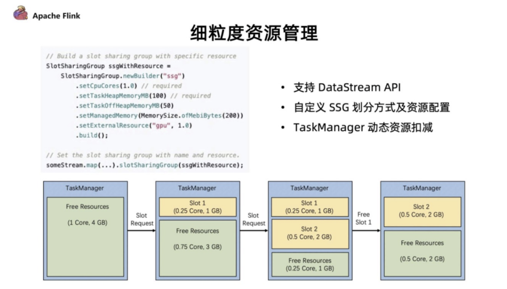

对于每一个 Slot 可以通过比较细粒度的配置，我们在 Runtime 上会自动根据用户资源配置进行动态的资源切割。

这样做的好处是不会像之前那样有固定资源的 Slot，而是做资源的动态扣减，通过这样的方式希望能够达到更加精细的资源管理和资源的使用率。

#### Table / SQL / Python API

###### 1. Table API / SQL

Window Table-Valued Function 支持更多算子与窗口类型 ，可以看如下表格的对比：

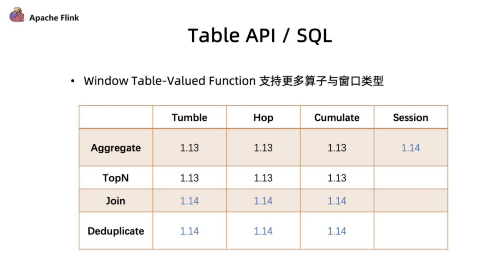

从表格中可以看出对于原有的三个窗口类型进行加强，同时新增 Session 窗口类型，目前支持 Aggregate 的操作。

1.1 支持声明式注册 Source/Sink

- Table API 支持使用声明式的方式注册 Source / Sink 功能对齐 SQL DDL；
- 同时支持 FLIP-27 新的 Source 接口；
- new Source 替代旧的 connect() 接口。

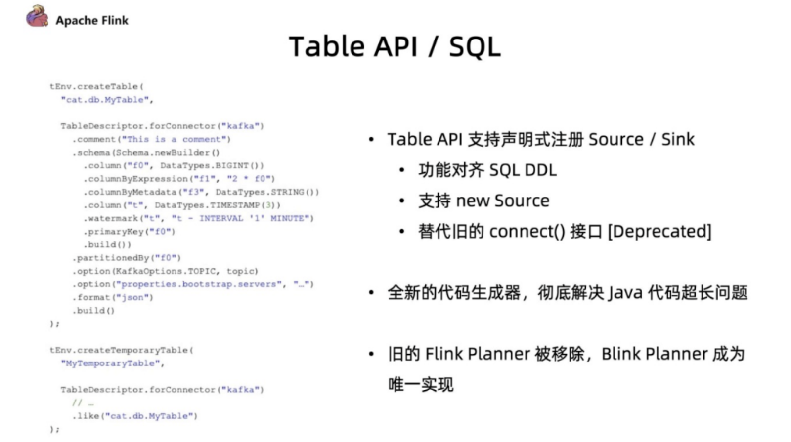

1.2 全新代码生成器

解决了大家在生成代码超过 Java 最长代码限制，新的代码生成器会对代码进行拆解，彻底解决代码超长的问题。

1.3 移除 Flink Planner

新版本中，Blink Planner 将成为 Flink Planner 的唯一实现。

###### 2. Python API

在之前的版本中，如果有先后执行的两个 UDF，它的执行过程如下图左方。在 JVM 上面有 Java 的 Operator，先把数据发给 Python 下面的 UDF 去执行，执行后又发回给 Java，然后传送给下游的 Operator，最后再进行一次 Python 的这种跨进程的传输去处理，会导致存在很多次冗余的数据传输。

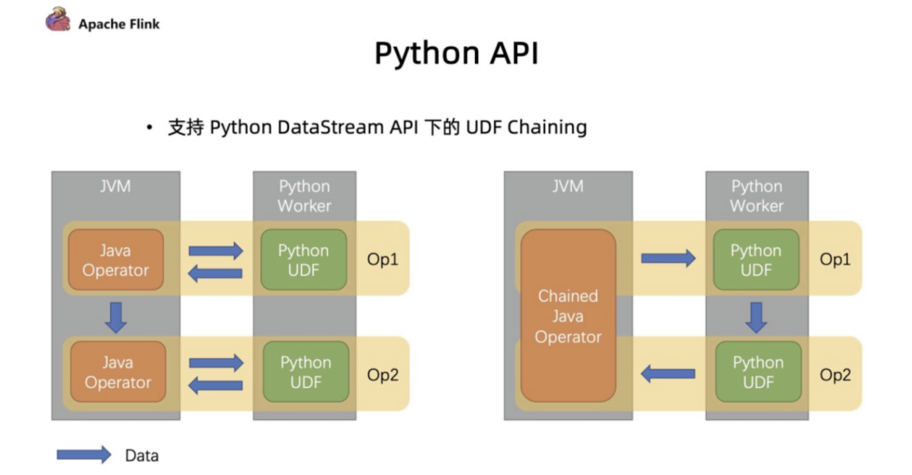

在 1.14 版本中，改进如右图，可以把它们连接在一起，只需要一个来回的 Java 和 Python 进行数据通信，通过减少传输数据次数就能够达到比较好的性能上的提升。

###### 3. 支持 LoopBack 模式

在以往本地执行实际是在 Python 的进程中去运行客户端程序，提交 Java 进程启动一个迷你集群去执行 Java 部分代码。Java 部分代码也会和生产环境部分的一样，去启动一个新的 Python 进程去执行对应的 Python UDF，从图下可以看出新的进程其实在本地调试中是没有必要存在的。

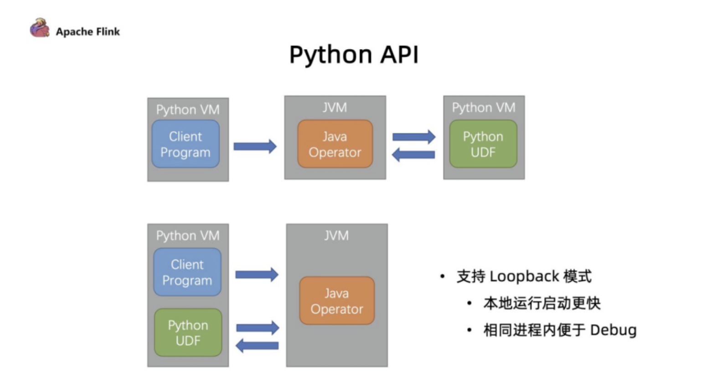

所以支持 lookback 模式后可以让 Java 的 opt 直接把 UDF 运行在之前 Python client 所运行的相同的进程内，通过这种方式：

1. 首先是避免了启动额外进程所带来的开销；
2. 最重要的是在本地调试中，我们可以在同一个进程内能够更好利用一些工具进行 debug，这个是对开发者体验上的一个提升。