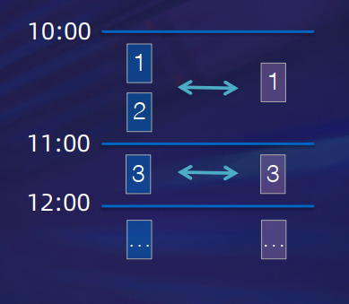
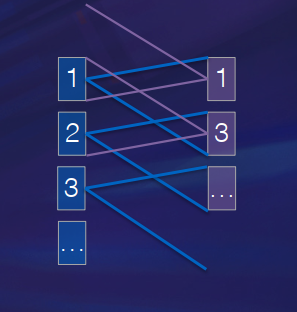
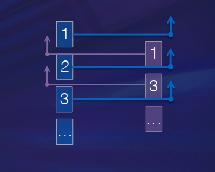
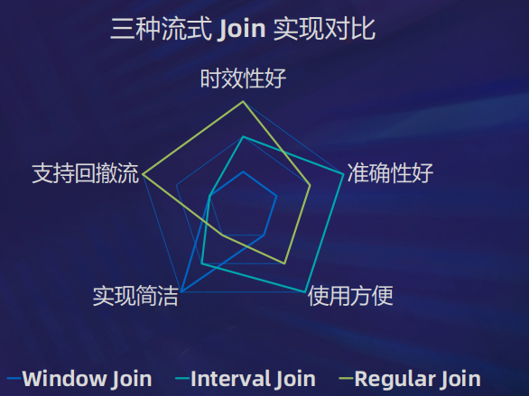

# Join 算子现有实现和问题  

## 为什么需要 Join 算子  

• 事物之间存在关联  

• 聚合计算分析时关注事物间的关联

• 数据对事物的描述是简化后的，存在缺陷的

• 存在关联事物，其属性各自存储在自己的表里  

## 为什么 Join 算子在流计算中备受关注  

• 批计算、关系型数据库中是怎么进行 Join 运算的

基于两侧或其中一侧的全集进行运算
在无界流上都用不了：

​		• Nested Loop Join

​		• Sort Merge Join

​		• Hash Join

• 流计算最大的特点：无界

​		• 跟我关联的那条数据，它什么时候来？

​		• 它到底来不来了？Outer Join 场景它不来我还得补 null 下发

​		• 它还有没有兄弟还没来？

# 常见流式 Join 算子实现  

• 最直观的想法，无界变有界：Window Join

​		• 利用 Flink 时间窗口机制

​		• 只考虑在同一个时间窗口内的数据进行关联  

• 存在的问题

• 窗口边界上的数据关联失败

• 10:59 的曝光，11:01 的点击，互相关联不上

• 时效性差，窗口结束才触发计算和下发  

## Outer Join 场景下对时效性和准确性的权衡  

• 准确性优先：Interval Join

​		• 利用 Flink 的 Watermark 机制

​		• 当前侧的点，关联对侧的时间区间  

• 存在的问题

​		• 时效性较差，Outer 补 null 的数据要等区间结束才下发

​		• 状态过期逻辑需额外处理（在过期时补 null 下发）  

• 时效性优先：Regular Join（Streaming Join）

​		• 利用 Flink Table 的回撤重发机制

​		• 每条数据与对侧当前已到达的所有数据关联

​		• 得到的都是“当下”的正确结果  

• 存在的问题

​		• “准确”是暂时的，下发的并不是最终结果

​		• 回撤重发机制导致数据量放大

​		• 依赖全局的状态清理策略（TTL）  

# 流式 Join 算子的出路  

• 没有完美方案

• 不同场景下需要做不同取舍

• 不同的取舍下有不同的优化方案  

