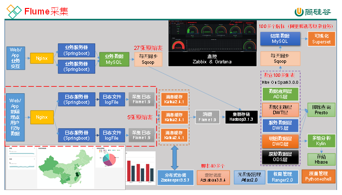
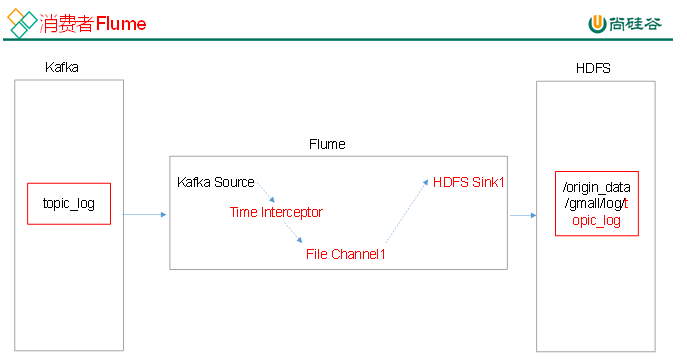

 

# Flume入门

##  Flume安装部署

###  安装地址

（1） Flume官网地址：http://flume.apache.org/

（2）文档查看地址：http://flume.apache.org/FlumeUserGuide.html

（3）下载地址：http://archive.apache.org/dist/flume/

### 安装部署

（1）将apache-flume-1.9.0-bin.tar.gz上传到linux的/opt/software目录下

（2）解压apache-flume-1.9.0-bin.tar.gz到/opt/module/目录下

```shell
[atguigu@hadoop102 software]$ tar -zxf /opt/software/apache-flume-1.9.0-bin.tar.gz -C /opt/module/
```

（3）修改apache-flume-1.9.0-bin的名称为flume

```shell
[atguigu@hadoop102 module]$ mv /opt/module/apache-flume-1.9.0-bin /opt/module/flume
```

（4）将lib文件夹下的guava-11.0.2.jar删除以兼容Hadoop 3.1.3

```shell
[atguigu@hadoop102 module]$ rm /opt/module/flume/lib/guava-11.0.2.jar
```

注意：删除guava-11.0.2.jar的服务器节点，一定要配置hadoop环境变量。否则会报如下异常。

```shell
Caused by: java.lang.ClassNotFoundException: com.google.common.collect.Lists
    at java.net.URLClassLoader.findClass(URLClassLoader.java:382)
    at java.lang.ClassLoader.loadClass(ClassLoader.java:424)
    at sun.misc.Launcher$AppClassLoader.loadClass(Launcher.java:349)
   at java.lang.ClassLoader.loadClass(ClassLoader.java:357)
   ... 1 more
```

（5）将flume/conf下的flume-env.sh.template文件修改为flume-env.sh，并配置flume-env.sh文件

```shell
[atguigu@hadoop102 conf]$ mv flume-env.sh.template flume-env.sh

[atguigu@hadoop102 conf]$ vi flume-env.sh
export JAVA_HOME=/opt/module/jdk1.8.0_212
```

集群规划：

|                 | 服务器hadoop102 | 服务器hadoop103 | 服务器hadoop104 |
| --------------- | --------------- | --------------- | --------------- |
| Flume(采集日志) | Flume           | Flume           |                 |

###  项目经验之Flume组件选型

**1** **）Source**

（1）Taildir Source相比Exec Source、Spooling Directory Source的优势

**TailDir Source：断点续传、多目录。Flume1.6以前需要自己自定义Source记录每次读取文件位置，实现断点续传。不会丢数据，但是有可能会导致数据重复。**

**Exec Source**可以实时搜集数据，但是在Flume不运行或者Shell命令出错的情况下，数据将会丢失。

**Spooling Directory Source**监控目录，支持断点续传。

（2）batchSize大小如何设置？

答：Event 1K左右时，500-1000合适（默认为100）

**2** **）Channel**

**采用Kafka Channel，省去了Sink，提高了效率。KafkaChannel数据存储在Kafka里面，所以数据是存储在磁盘中。**

注意在Flume1.7以前，Kafka Channel很少有人使用，因为发现**parseAsFlumeEvent**这个配置起不了作用。也就是无论parseAsFlumeEvent配置为true还是false，都会转为Flume Event。这样的话，造成的结果是，会始终都把Flume的headers中的信息混合着内容一起写入Kafka的消息中，这显然不是我所需要的，我只是需要把内容写入即可。

###  日志采集Flume配置

**1** **）Flume** **配置分析**


Flume直接读log日志的数据，log日志的格式是app.yyyy-mm-dd.log。

**2** **）Flume** **的具体配置如下：**

​    （1）在/opt/module/flume/conf目录下创建file-flume-kafka.conf文件

```
[atguigu@hadoop102 conf]$ vim file-flume-kafka.conf
```

在文件配置如下内容

```
#为各组件命名
a1.sources = r1
a1.channels = c1

#描述source
a1.sources.r1.type = TAILDIR
a1.sources.r1.filegroups = f1
a1.sources.r1.filegroups.f1 = /opt/module/applog/log/app.*

a1.sources.r1.positionFile = /opt/module/flume/taildir_position.json

a1.sources.r1.interceptors = i1
a1.sources.r1.interceptors.i1.type = com.atguigu.flume.interceptor.ETLInterceptor$Builder

#描述channel
a1.channels.c1.type = org.apache.flume.channel.kafka.KafkaChannel

a1.channels.c1.kafka.bootstrap.servers = hadoop102:9092,hadoop103:9092

a1.channels.c1.kafka.topic = topic_log
a1.channels.c1.parseAsFlumeEvent = false

#绑定source和channel以及sink和channel的关系
a1.sources.r1.channels = c1
```

​     注意：com.atguigu.flume.interceptor.ETLInterceptor是自定义的拦截器的全类名。需要根据用户自定义的拦截器做相应修改。

###  Flume拦截器

1）创建Maven工程flume-interceptor

2）创建包名：com.atguigu.flume.interceptor

3）在pom.xml文件中添加如下配置

```xml
<dependencies>     
    <dependency>         <groupId>org.apache.flume</groupId>         <artifactId>flume-ng-core</artifactId>         <version>1.9.0</version>         <scope>provided</scope>    
    </dependency>     
    <dependency>         <groupId>com.alibaba</groupId>         <artifactId>fastjson</artifactId>         <version>1.2.62</version>     
    </dependency>
</dependencies> 
<build>    
    <plugins>         
        <plugin>             
            <artifactId>maven-compiler-plugin</artifactId>             <version>2.3.2</version>            
            <configuration>                 <source>1.8</source>                 <target>1.8</target>             
            </configuration>        
        </plugin>         
        <plugin>            
            <artifactId>maven-assembly-plugin</artifactId>            
            <configuration>                 <descriptorRefs>                     <descriptorRef>jar-with-dependencies</descriptorRef>                 </descriptorRefs>             </configuration>             
            <executions>                 
                <execution>                     <id>make-assembly</id>                     <phase>package</phase>                    
                    <goals>                         <goal>single</goal>                     
                    </goals>                 </execution>             
            </executions>         
        </plugin>    
    </plugins> 
</build>
```

​    注意：scope中provided的含义是编译时用该jar包。打包时时不用。因为集群上已经存在flume的jar包。只是本地编译时用一下。

4）在com.atguigu.flume.interceptor包下创建JSONUtils类

```java
package com.atguigu.flume.interceptor;
 
 import com.alibaba.fastjson.JSON;
 import com.alibaba.fastjson.JSONException;
 
 public class JSONUtils {
   public static boolean isJSONValidate(String log){
     try {
       JSON.parse(log);
       return true;
     }catch (JSONException e){
       return false;
     }
   }
 }
```

5）在com.atguigu.flume.interceptor包下创建LogInterceptor类

```java
package com.atguigu.flume.interceptor;

import com.alibaba.fastjson.JSON;
import org.apache.flume.Context;
import org.apache.flume.Event;
import org.apache.flume.interceptor.Interceptor;
import java.nio.charset.StandardCharsets;
import java.util.Iterator;
import java.util.List; 

public class ETLInterceptor implements Interceptor {

  @Override
  public void initialize() {

  }

  @Override
  public Event intercept(Event event) {

    byte[] body = event.getBody();

    String log = new String(body, StandardCharsets.UTF_8);

    if (JSONUtils.isJSONValidate(log)) {
     return event;
    } else {
      return null;
    }
  }

  @Override
  public List<Event> intercept(List<Event> list) {

   Iterator<Event> iterator = list.iterator();
    while (iterator.hasNext()){
      Event next = iterator.next();
      if(intercept(next)==null){
        iterator.remove();
      }
    }
    return list;
  }

  public static class Builder implements Interceptor.Builder{
    @Override
    public Interceptor build() {
      return new ETLInterceptor();
    }

    @Override
    public void configure(Context context) {

    }
  }
 
  @Override
  public void close() {
      
  }
}
```

6）打包

                                   

7）需要先将打好的包放入到hadoop102的/opt/module/flume/lib文件夹下面。

```shell
[atguigu@hadoop102 lib]$ ls | grep interceptor

flume-interceptor-1.0-SNAPSHOT-jar-with-dependencies.jar
```

8）分发Flume到hadoop103、hadoop104

```shell
[atguigu@hadoop102 module]$ xsync flume/
```

9）分别在hadoop102、hadoop103上启动Flume

```shell
[atguigu@hadoop102 flume]$ bin/flume-ng agent --name a1 --conf-file conf/file-flume-kafka.conf &

[atguigu@hadoop103 flume]$ bin/flume-ng agent --name a1 --conf-file conf/file-flume-kafka.conf &
```


###  测试Flume-Kafka通道


（1）生成日志

```
[atguigu@hadoop102 ~]$ lg.sh
```

（2）消费Kafka数据，观察控制台是否有数据获取到

```shell
[atguigu@hadoop102 kafka]$ bin/kafka-console-consumer.sh \

--bootstrap-server hadoop102:9092 --from-beginning --topic topic_log
```

说明：如果获取不到数据，先检查Kafka、Flume、Zookeeper是否都正确启动。再检查Flume的拦截器代码是否正常。

###  日志采集Flume启动停止脚本

（1）在/home/atguigu/bin目录下创建脚本f1.sh

```
[atguigu@hadoop102 bin]$ vim f1.sh
```

​    在脚本中填写如下内容

```shell
#! /bin/bash

case $1 in
"start"){
    for i in hadoop102 hadoop103
   do
        echo " --------启动 $i 采集flume-------"
        ssh $i "nohup /opt/module/flume/bin/flume-ng agent --conf-file /opt/module/flume/conf/file-flume-kafka.conf --name a1 -Dflume.root.logger=INFO,LOGFILE >/opt/module/flume/log1.txt 2>&1 &"
    done

};; 

"stop"){
    for i in hadoop102 hadoop103
    do
        echo " --------停止 $i 采集flume-------"
        ssh $i "ps -ef | grep file-flume-kafka | grep -v grep |awk  '{print \$2}' | xargs -n1 kill -9 "
    done
};;

esac
```

说明1：nohup，该命令可以在你退出帐户/关闭终端之后继续运行相应的进程。nohup就是不挂起的意思，不挂断地运行命令。

说明2：awk 默认分隔符为空格

说明3：$2是在“”双引号内部会被解析为脚本的第二个参数，但是这里面想表达的含义是awk的第二个值，所以需要将他转义，用\$2表示。

说明4：xargs 表示取出前面命令运行的结果，作为后面命令的输入参数。

（2）增加脚本执行权限

```
[atguigu@hadoop102 bin]$ chmod u+x f1.sh
```

（3）f1集群启动脚本

```
[atguigu@hadoop102 module]$ f1.sh start
```

（4）f1集群停止脚本

```
[atguigu@hadoop102 module]$ f1.sh stop
```


##  消费Kafka数据Flume


集群规划

|                    | 服务器hadoop102 | 服务器hadoop103 | 服务器hadoop104 |
| ------------------ | --------------- | --------------- | --------------- |
| Flume（消费Kafka） |                 |                 | Flume           |

### Flume组件选型

**1** **）FileChannel** **和MemoryChannel** **区别**

MemoryChannel传输数据速度更快，但因为数据保存在JVM的堆内存中，Agent进程挂掉会导致数据丢失，适用于对数据质量要求不高的需求。

FileChannel传输速度相对于Memory慢，但数据安全保障高，Agent进程挂掉也可以从失败中恢复数据。

选型：

金融类公司、对钱要求非常准确的公司通常会选择FileChannel

传输的是普通日志信息（京东内部一天丢100万-200万条，这是非常正常的），通常选择MemoryChannel。

**2** **）FileChannel** **优化**

通过配置dataDirs指向多个路径，每个路径对应不同的硬盘，增大Flume吞吐量。

官方说明如下：

> Comma separated list of directories for storing log files. Using multiple directories on separate disks can improve file channel peformance

checkpointDir和backupCheckpointDir也尽量配置在不同硬盘对应的目录中，保证checkpoint坏掉后，可以快速使用backupCheckpointDir恢复数据。


**3** **）Sink** **：HDFS Sink**

（1）HDFS存入大量小文件，有什么影响？

**元数据层面：**每个小文件都有一份元数据，其中包括文件路径，文件名，所有者，所属组，权限，创建时间等，这些信息都保存在Namenode内存中。所以小文件过多，会占用Namenode服务器大量内存，影响Namenode性能和使用寿命

**计算层面：**默认情况下MR会对每个小文件启用一个Map任务计算，非常影响计算性能。同时也影响磁盘寻址时间。

​    （2）HDFS小文件处理

官方默认的这三个参数配置写入HDFS后会产生小文件，hdfs.rollInterval、hdfs.rollSize、hdfs.rollCount

基于以上hdfs.rollInterval=3600，hdfs.rollSize=134217728，hdfs.rollCount =0几个参数综合作用，效果如下：

①文件在达到128M时会滚动生成新文件

②文件创建超3600秒时会滚动生成新文件

###  消费者Flume配置

1）Flume配置分析



2）Flume的具体配置如下：

​    （1）在hadoop104的/opt/module/flume/conf目录下创建kafka-flume-hdfs.conf文件

```shell
[atguigu@hadoop104 conf]$ vim kafka-flume-hdfs.conf
```

在文件配置如下内容

```properties
## 组件
a1.sources=r1
a1.channels=c1
a1.sinks=k1

## source1
a1.sources.r1.type = org.apache.flume.source.kafka.KafkaSource

a1.sources.r1.batchSize = 5000
a1.sources.r1.batchDurationMillis = 2000
a1.sources.r1.kafka.bootstrap.servers = hadoop102:9092,hadoop103:9092,hadoop104:9092

a1.sources.r1.kafka.topics=topic_log
a1.sources.r1.interceptors = i1
a1.sources.r1.interceptors.i1.type = com.atguigu.flume.interceptor.TimeStampInterceptor$Builder

## channel1
a1.channels.c1.type = file
a1.channels.c1.checkpointDir = /opt/module/flume/checkpoint/behavior1

a1.channels.c1.dataDirs = /opt/module/flume/data/behavior1/

## sink1
a1.sinks.k1.type = hdfs
a1.sinks.k1.hdfs.path = /origin_data/gmall/log/topic_log/%Y-%m-%d

a1.sinks.k1.hdfs.filePrefix = log-
a1.sinks.k1.hdfs.round = false

#控制生成的小文件
a1.sinks.k1.hdfs.rollInterval = 10
a1.sinks.k1.hdfs.rollSize = 134217728
a1.sinks.k1.hdfs.rollCount = 0

## 控制输出文件是原生文件。
a1.sinks.k1.hdfs.fileType = CompressedStream
a1.sinks.k1.hdfs.codeC = lzop

## 拼装
a1.sources.r1.channels = c1
a1.sinks.k1.channel= c1
```


###  Flume时间戳拦截器

由于Flume默认会用Linux系统时间，作为输出到HDFS路径的时间。如果数据是23:59分产生的。Flume消费Kafka里面的数据时，有可能已经是第二天了，那么这部门数据会被发往第二天的HDFS路径。我们希望的是根据日志里面的实际时间，发往HDFS的路径，所以下面拦截器作用是获取日志中的实际时间。

解决的思路：拦截json日志，通过fastjson框架解析json，获取实际时间ts。将获取的ts时间写入拦截器header头，header的key必须是timestamp，因为Flume框架会根据这个key的值识别为时间，写入到HDFS。

1）在com.atguigu.flume.interceptor包下创建TimeStampInterceptor类

```java
package com.atguigu.flume.interceptor;

import com.alibaba.fastjson.JSONObject;
import org.apache.flume.Context;
import org.apache.flume.Event;
import org.apache.flume.interceptor.Interceptor;
import java.nio.charset.StandardCharsets;
import java.util.ArrayList;
import java.util.List;
import java.util.Map;

public class TimeStampInterceptor implements Interceptor {

  private ArrayList<Event> events = new ArrayList<>();

  @Override
  public void initialize() {

  }

  @Override
  public Event intercept(Event event) { 

    Map<String, String> headers = event.getHeaders();
    String log = new String(event.getBody(), StandardCharsets.UTF_8);
     JSONObject jsonObject = JSONObject.parseObject(log);

    String ts = jsonObject.getString("ts");
    headers.put("timestamp", ts);
    return event;
  }

  @Override
  public List<Event> intercept(List<Event> list) {
    events.clear();
    for (Event event : list) {
     events.add(intercept(event));
    }
    return events;
  }

  @Override
  public void close() {

  } 

  public static class Builder implements Interceptor.Builder {
    @Override
   public Interceptor build() {
     return new TimeStampInterceptor();
   }

    @Override
   public void configure(Context context) {

   }
  }
}
```

2）重新打包

                                   

3）需要先将打好的包放入到hadoop102的/opt/module/flume/lib文件夹下面。

```
[atguigu@hadoop102 lib]$ ls | grep interceptor

flume-interceptor-1.0-SNAPSHOT-jar-with-dependencies.jar
```

4）分发Flume到hadoop103、hadoop104

```
[atguigu@hadoop102 module]$ xsync flume/
```


###  消费者Flume启动停止脚本

（1）在/home/atguigu/bin目录下创建脚本f2.sh

```
[atguigu@hadoop102 bin]$ vim f2.sh
```

​    在脚本中填写如下内容

```shell
#! /bin/bash

case $1 in
"start"){
    for i in hadoop104
    do
        echo " --------启动 $i 消费flume-------"
        ssh $i "nohup /opt/module/flume/bin/flume-ng agent --conf-file /opt/module/flume/conf/kafka-flume-hdfs.conf --name a1 -Dflume.root.logger=INFO,LOGFILE >/opt/module/flume/log2.txt  2>&1 &"
   done

};;

"stop"){
   for i in hadoop104
    do
        echo " --------停止 $i 消费flume-------"
       ssh $i "ps -ef | grep kafka-flume-hdfs | grep -v grep |awk '{print \$2}' | xargs -n1 kill"
    done 
};;

esac
```

（2）增加脚本执行权限

```shell
[atguigu@hadoop102 bin]$ chmod u+x f2.sh
```

（3）f2集群启动脚本

```shell
[atguigu@hadoop102 module]$ f2.sh start
```

（4）f2集群停止脚本

```sh
[atguigu@hadoop102 module]$ f2.sh stop
```


### Flume内存优化

**1** **）问题描述：如果启动消费Flume** **抛出如下异常**

```shell
ERROR hdfs.HDFSEventSink: process failed

java.lang.OutOfMemoryError: GC overhead limit exceeded
```

**2** **）解决方案步骤**

（1）在hadoop102服务器的/opt/module/flume/conf/flume-env.sh文件中增加如下配置

```shell
export JAVA_OPTS="-Xms100m -Xmx2000m -Dcom.sun.management.jmxremote"
```

（2）同步配置到hadoop103、hadoop104服务器

```shell
[atguigu@hadoop102 conf]$ xsync flume-env.sh
```

**3** **）Flume** **内存参数设置及优化**

JVM heap一般设置为4G或更高

-Xmx与-Xms最好设置一致，减少内存抖动带来的性能影响，如果设置不一致容易导致频繁fullgc。

-Xms表示JVM Heap（堆内存）最小尺寸，初始分配；-Xmx 表示JVM Heap(堆内存)最大允许的尺寸，按需分配。如果不设置一致，容易在初始化时，由于内存不够，频繁触发fullgc。

##  采集通道启动/停止脚本

（1）在/home/atguigu/bin目录下创建脚本cluster.sh

```shell
[atguigu@hadoop102 bin]$ vim cluster.sh
```

​    在脚本中填写如下内容

```shell
#!/bin/bash

case $1 in
"start"){
    echo ================== 启动 集群 ==================
    #启动 Zookeeper集群
    zk.sh start
    #启动 Hadoop集群
    hdp.sh start
    #启动 Kafka采集集群
    kf.sh start
    #启动 Flume采集集群
    f1.sh start
    #启动 Flume消费集群
    f2.sh start
    };;

"stop"){
    echo ================== 停止 集群 ==================
    #停止 Flume消费集群
    f2.sh stop
    #停止 Flume采集集群
    f1.sh stop
    #停止 Kafka采集集群
     kf.sh stop
    #停止 Hadoop集群
    hdp.sh stop
   #停止 Zookeeper集群
    zk.sh stop 
};;

esac
```

（2）增加脚本执行权限

```shell
[atguigu@hadoop102 bin]$ chmod u+x cluster.sh         
```

（3）cluster集群启动脚本

```shell
[atguigu@hadoop102 module]$ cluster.sh start
```

（4）cluster集群停止脚本

```shell
[atguigu@hadoop102 module]$ cluster.sh stop
```

