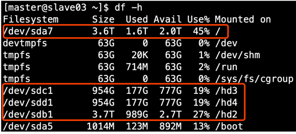

# HDFS存储多目录

（1）给Linux系统新增加一块硬盘

参考：https://www.cnblogs.com/yujianadu/p/10750698.html

（2）生产环境服务器磁盘情况

​                               

（3）在hdfs-site.xml文件中配置多目录，注意新挂载磁盘的访问权限问题

HDFS的DataNode节点保存数据的路径由**dfs.datanode.data.dir**参数决定，其默认值为**file://${hadoop.tmp.dir}/dfs/data**，若服务器有多个磁盘，必须对该参数进行修改。如服务器磁盘如上图所示，则该参数应修改为如下的值。

```properties
<property>

  <name>dfs.datanode.data.dir</name>

<value>file:///dfs/data1,file:///hd2/dfs/data2,file:///hd3/dfs/data3,file:///hd4/dfs/data4</value>

</property>
```

**注意：因为每台服务器节点的磁盘情况不同，所以这个配置配完之后，不需要分发**

# 集群数据均衡

**1** **）节点间数据均衡**

（1）开启数据均衡命令

```
start-balancer.sh -threshold 10
```

对于参数10，代表的是集群中各个节点的磁盘空间利用率相差不超过10%，可根据实际情况进行调整。

（2）停止数据均衡命令

```
stop-balancer.sh
```

**注意：于HDFS需要启动单独的Rebalance Server来执行Rebalance操作，所以尽量不要在NameNode上执行start-balancer.sh，而是找一台比较空闲的机器。**

**2** **）磁盘间数据均衡**

（1）生成均衡计划（**如果只有一块磁盘，不会生成计划**）

```
hdfs diskbalancer -plan hadoop103
```

（2）执行均衡计划

```
hdfs diskbalancer -execute hadoop103.plan.json
```

（3）查看当前均衡任务的执行情况

```
hdfs diskbalancer -query hadoop103
```

（4）取消均衡任务

```
hdfs diskbalancer -cancel hadoop103.plan.json
```

