# 第一章 HBase入门

## 1.  简介

### 1.1   Hadoop

l 从 1970 年开始，大多数的公司数据存储和维护使用的是关系型数据库

l 大数据技术出现后，很多拥有海量数据的公司开始选择像Hadoop的方式来存储海量数据

l Hadoop使用分布式文件系统HDFS来存储海量数据，并使用 MapReduce 来处理。Hadoop擅长于存储各种格式的庞大的数据，任意的格式甚至非结构化的处理

### 1.2   Hadoop的局限

l  Hadoop主要是实现批量数据的处理，并且通过顺序方式访问数据

l  要查找数据必须搜索整个数据集， 如果要进行随机读取数据，效率较低

### 1.3   HBase 与 NoSQL

l NoSQL是一个通用术语，泛指一个数据库并不是使用SQL作为主要语言的非关系型数据库

l HBase是BigTable的开源java版本。是建立在HDFS之上，提供高可靠性、高性能、列存储、可伸缩、实时读写NoSQL的数据库系统

l HBase仅能通过主键(row key)和主键的range来检索数据，仅支持单行事务

l 主要用来存储结构化和半结构化的松散数据

l Hbase查询数据功能很简单，不支持join等复杂操作，不支持复杂的事务（行级的事务），从技术上来说，HBase更像是一个「数据存储」而不是「数据库」，因为HBase缺少RDBMS中的许多特性，例如带类型的列、二级索引以及高级查询语言等

l Hbase中支持的数据类型：byte[]

l 与Hadoop一样，Hbase目标主要依靠横向扩展，通过不断增加廉价的商用服务器，来增加存储和处理能力，例如，把集群从10个节点扩展到20个节点，存储能力和处理能力都会加倍

l HBase中的表一般有这样的特点

l 大：一个表可以有上十亿行，上百万列

l 面向列:面向列(族)的存储和权限控制，列(族)独立检索

l 稀疏:对于为空(null)的列，并不占用存储空间，因此，表可以设计的非常稀疏

### 1.4   HBase应用场景

#### 1.4.1   对象存储

不少的头条类、新闻类的的新闻、网页、图片存储在HBase之中，一些病毒公司的病毒库也是存储在HBase之中

#### 1.4.2   时序数据

HBase之上有OpenTSDB模块，可以满足时序类场景的需求

#### 1.4.3   推荐画像

用户画像，是一个比较大的稀疏矩阵，蚂蚁金服的风控就是构建在HBase之上

#### 1.4.4   时空数据

主要是轨迹、气象网格之类，滴滴打车的轨迹数据主要存在HBase之中，另外在技术所有大一点的数据量的车联网企业，数据都是存在HBase之中

#### 1.4.5   CubeDB OLAP

Kylin一个cube分析工具，底层的数据就是存储在HBase之中，不少客户自己基于离线计算构建cube存储在hbase之中，满足在线报表查询的需求

#### 1.4.6   消息/订单

在电信领域、银行领域，不少的订单查询底层的存储，另外不少通信、消息同步的应用构建在HBase之上

#### 1.4.7   Feeds流

典型的应用就是xx朋友圈类似的应用，用户可以随时发布新内容，评论、点赞。

#### 1.4.8   NewSQL

之上有Phoenix的插件，可以满足二级索引、SQL的需求，对接传统数据需要SQL非事务的需求

#### 1.4.9   其他

l 存储爬虫数据

l 海量数据备份

l 短网址

l …

### 1.5   发展历程

| 年份       | 重大事件                                     |
| ---------- | -------------------------------------------- |
| 2006年11月 | Google发布BigTable论文.                      |
| 2007年10月 | 发布第一个可用的HBase版本，基于Hadoop 0.15.0 |
| 2008年1月  | Hbase成为Hadoop的一个子项目                  |
| 2010年5月  | Hbase成为Apache的顶级项目                    |

### 1.6   HBase特点

l  强一致性读/写

n HBASE不是“最终一致的”数据存储

n 它非常适合于诸如高速计数器聚合等任务

l  自动分块

n HBase表通过Region分布在集群上，随着数据的增长，区域被自动拆分和重新分布

l  自动RegionServer故障转移

l  Hadoop/HDFS集成

n HBase支持HDFS开箱即用作为其分布式文件系统

l  MapReduce

n HBase通过MapReduce支持大规模并行处理，将HBase用作源和接收器

l  Java Client API

n HBase支持易于使用的 Java API 进行编程访问

l  Thrift/REST API

l  块缓存和布隆过滤器

n HBase支持块Cache和Bloom过滤器进行大容量查询优化

l  运行管理

n HBase为业务洞察和JMX度量提供内置网页。

### 1.7   RDBMS与HBase的对比

#### 1.7.1   关系型数据库

##### 1.7.1.1   结构

l 数据库以表的形式存在

l 支持FAT、NTFS、EXT、文件系统

l 使用主键（PK）

l 通过外部中间件可以支持分库分表，但底层还是单机引擎

l 使用行、列、单元格

##### 1.7.1.2   功能

l 支持向上扩展（买更好的服务器）

l 使用SQL查询

l 面向行，即每一行都是一个连续单元

l 数据总量依赖于服务器配置

l 具有ACID支持

l 适合结构化数据

l 传统关系型数据库一般都是中心化的

l 支持事务

l 支持Join

#### 1.7.2   HBase

##### 1.7.2.1   结构

l 以表形式存在

l 支持HDFS文件系统

l 使用行键（row key）

l 原生支持分布式存储、计算引擎

l 使用行、列、列族和单元格

##### 1.7.2.2   功能

l 支持向外扩展

l 使用API和MapReduce、Spark、Flink来访问HBase表数据

l 面向列族，即每一个列族都是一个连续的单元

l 数据总量不依赖具体某台机器，而取决于机器数量

l HBase不支持ACID（Atomicity、Consistency、Isolation、Durability）

l 适合结构化数据和非结构化数据

l 一般都是分布式的

l HBase不支持事务，支持的是单行数据的事务操作

l 不支持Join

### 1.8   HDFS对比HBase

#### 1.8.1   HDFS

l HDFS是一个非常适合存储大型文件的分布式文件系统

l HDFS它不是一个通用的文件系统，也无法在文件中快速查询某个数据

#### 1.8.2   HBase

l HBase构建在HDFS之上，并为大型表提供快速记录查找(和更新)

l HBase内部将大量数据放在HDFS中名为「StoreFiles」的索引中，以便进行高速查找

l Hbase比较适合做快速查询等需求，而不适合做大规模的OLAP应用

### 1.9   Hive对比Hbase

#### 1.9.1   Hive

l 数据仓库工具

Hive的本质其实就相当于将HDFS中已经存储的文件在Mysql中做了一个双射关系，以方便使用HQL去管理查询

l 用于数据分析、清洗

Hive适用于离线的数据分析和清洗，延迟较高

l 基于HDFS、MapReduce

Hive存储的数据依旧在DataNode上，编写的HQL语句终将是转换为MapReduce代码执行

#### 1.9.2   HBase

l NoSQL数据库

是一种面向列存储的非关系型数据库。

l 用于存储结构化和非结构化的数据

适用于单表非关系型数据的存储，不适合做关联查询，类似JOIN等操作。

l 基于HDFS

数据持久化存储的体现形式是Hfile，存放于DataNode中，被RegionServer以region的形式进行管理

l 延迟较低，接入在线业务使用

面对大量的企业数据，HBase可以直线单表大量数据的存储，同时提供了高效的数据访问速度

#### 1.9.3   总结Hive与HBase

l Hive和Hbase是两种基于Hadoop的不同技术

l Hive是一种类SQL的引擎，并且运行MapReduce任务

l Hbase是一种在Hadoop之上的NoSQL 的Key/value数据库

l 这两种工具是可以同时使用的。就像用Google来搜索，用FaceBook进行社交一样，Hive可以用来进行统计查询，HBase可以用来进行实时查询，数据也可以从Hive写到HBase，或者从HBase写回Hive

## 2.  集群搭建

### 2.1   安装

#### 2.1.1   上传解压HBase安装包

  tar -xvzf hbase-2.1.0.tar.gz -C  ../server/  

#### 2.1.2   修改HBase配置文件

##### 2.1.2.1   hbase-env.sh

```
 cd /export/server/hbase-2.1.0/conf
vim hbase-env.sh
# 第28行
export JAVA_HOME=/export/server/jdk1.8.0_241/
export HBASE_MANAGES_ZK=false

```


##### 2.1.2.2   hbase-site.xml

```
  vim hbase-site.xml
------------------------------
<configuration>
        <!-- HBase数据在HDFS中的存放的路径 -->
        <property>
            <name>hbase.rootdir</name>
            <value>hdfs://node1.itcast.cn:8020/hbase</value>
        </property>
        <!-- Hbase的运行模式。false是单机模式，true是分布式模式。若为false,Hbase和Zookeeper会运行在同一个JVM里面 -->
        <property>
            <name>hbase.cluster.distributed</name>
            <value>true</value>
        </property>
        <!-- ZooKeeper的地址 -->
        <property>
            <name>hbase.zookeeper.quorum</name>
            <value>node1.itcast.cn,node2.itcast.cn,node3.itcast.cn</value>
        </property>
        <!-- ZooKeeper快照的存储位置 -->
        <property>
            <name>hbase.zookeeper.property.dataDir</name>
            <value>/export/server/apache-zookeeper-3.6.0-bin/data</value>
        </property>
        <!--  V2.1版本，在分布式情况下, 设置为false -->
        <property>
            <name>hbase.unsafe.stream.capability.enforce</name>
            <value>false</value>
        </property>
</configuration>

```

#### 2.1.3   配置环境变量  

```
# 配置Hbase环境变量  
vim  /etc/profile  
export HBASE_HOME=/export/server/hbase-2.1.0  
export PATH=$PATH:${HBASE_HOME}/bin:${HBASE_HOME}/sbin     
#加载环境变量  source /etc/profile  
```

#### 2.1.4   复制jar包到lib

```
  cp $HBASE_HOME/lib/client-facing-thirdparty/htrace-core-3.1.0-incubating.jar  $HBASE_HOME/lib/  
```

#### 2.1.5   修改regionservers文件

```
  vim regionservers   
  node1.itcast.cn  
  node2.itcast.cn  
  node3.itcast.cn  
```


#### 2.1.6   分发安装包与配置文件

```
  cd  /export/server  
  scp -r hbase-2.1.0/  node2.itcast.cn:$PWD  
  scp -r hbase-2.1.0/  node3.itcast.cn:$PWD  
  scp -r /etc/profile node2.itcast.cn:/etc  
  scp -r /etc/profile node3.itcast.cn:/etc     
```

在node2.itcast.cn和node3.itcast.cn加载环境变量  

```
source /etc/profile  
```

#### 2.1.7   启动HBase

```
  cd /export/onekey  
  # 启动ZK  
  ./start-zk.sh  
  # 启动hadoop  
  start-dfs.sh 
  # 启动hbase  
  start-hbase.sh  
```

#### 2.1.8   验证Hbase是否启动成功

```
# 启动hbase shell客户端
hbase shell
# 输入status

[root@node1 onekey]# hbase shell
SLF4J: Class path contains multiple SLF4J bindings.
SLF4J: Found binding in [jar:file:/export/server/hadoop-2.7.5/share/hadoop/common/lib/slf4j-log4j12-1.7.10.jar!/org/slf4j/impl/StaticLoggerBinder.class]
SLF4J: Found binding in [jar:file:/export/server/hbase-2.1.0/lib/client-facing-thirdparty/slf4j-log4j12-1.7.25.jar!/org/slf4j/impl/StaticLoggerBinder.class]
SLF4J: See http://www.slf4j.org/codes.html#multiple_bindings for an explanation.
SLF4J: Actual binding is of type [org.slf4j.impl.Log4jLoggerFactory]
HBase Shell
Use "help" to get list of supported commands.
Use "exit" to quit this interactive shell.
Version 2.1.0, re1673bb0bbfea21d6e5dba73e013b09b8b49b89b, Tue Jul 10 17:26:48 CST 2018
Took 0.0034 seconds                                                                                                                                           
Ignoring executable-hooks-1.6.0 because its extensions are not built. Try: gem pristine executable-hooks --version 1.6.0
Ignoring gem-wrappers-1.4.0 because its extensions are not built. Try: gem pristine gem-wrappers --version 1.4.0
2.4.1 :001 > status
1 active master, 0 backup masters, 3 servers, 0 dead, 0.6667 average load
Took 0.4562 seconds                                                                                                                                           
2.4.1 :002 >
 
```

### 2.2   WebUI

http://node1.itcast.cn:16010/master-status

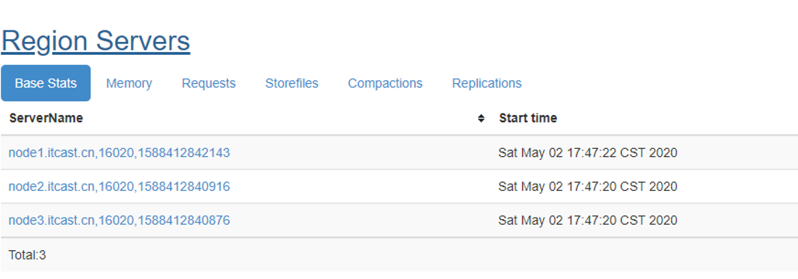

### 2.3   安装目录说明

| 目录名        | 说明                              |
| ------------- | --------------------------------- |
| bin           | 所有hbase相关的命令都在该目录存放 |
| conf          | 所有的hbase配置文件               |
| hbase-webapps | hbase的web ui程序位置             |
| lib           | hbase依赖的java库                 |
| logs          | hbase的日志文件                   |

### 2.4   参考硬件配置

针对大概800TB存储空间的集群中每个Java进程的典型内存配置：

| 进程               | 堆   | 描述                                                        |
| ------------------ | ---- | ----------------------------------------------------------- |
| NameNode           | 8 GB | 每100TB数据或每100W个文件大约占用NameNode堆1GB的内存        |
| SecondaryNameNode  | 8GB  | 在内存中重做主NameNode的EditLog，因此配置需要与NameNode一样 |
| DataNode           | 1GB  | 适度即可                                                    |
| ResourceManager    | 4GB  | 适度即可（注意此处是MapReduce的推荐配置）                   |
| NodeManager        | 2GB  | 适当即可（注意此处是MapReduce的推荐配置）                   |
| HBase HMaster      | 4GB  | 轻量级负载，适当即可                                        |
| HBase RegionServer | 12GB | 大部分可用内存、同时为操作系统缓存、任务进程留下足够的空间  |
| ZooKeeper          | 1GB  | 适度                                                        |

推荐：

l Master机器要运行NameNode、ResourceManager、以及HBase HMaster，推荐24GB左右

l Slave机器需要运行DataNode、NodeManager和HBase RegionServer，推荐24GB（及以上）

l 根据CPU的核数来选择在某个节点上运行的进程数，例如：两个4核CPU=8核，每个Java进程都可以独立占有一个核（推荐：8核CPU）

l 内存不是越多越好，在使用过程中会产生较多碎片，Java堆内存越大， 会导致整理内存需要耗费的时间越大。例如：给RegionServer的堆内存设置为64GB就不是很好的选择，一旦FullGC就会造成较长时间的等待，而等待较长，Master可能就认为该节点已经挂了，然后移除掉该节点

## 3.  HBase数据模型

### 3.1   简介

在HBASE中，数据存储在具有行和列的表中。这是看起来关系数据库(RDBMS)一样，但将HBASE表看成是多个维度的Map结构更容易理解。

| ROWKEY | C1列族 | C2列族 |      |      |      |      |
| ------ | ------ | ------ | ---- | ---- | ---- | ---- |
| rowkey | 列1    | 列2    | 列3  | 列4  | 列4  | 列6  |
|        |        |        |      |      |      |      |

| rowkey    | 0001                               |
| --------- | ---------------------------------- |
| C1（Map） | 列1 => 值1  列2 => 值2  列3 => 值3 |
| C2（Map） | 列4 => 值4  列5 => 值5  列6 => 值6 |

```
{
  "zzzzz" : "woot",
  "xyz" : "hello",
  "aaaab" : "world",
  "1" : "x",
  "aaaaa" : "y"
}

```

### 3.2   术语

#### 3.2.1   表（Table）

l  HBase中数据都是以表形式来组织的

l  HBase中的表由多个行组成

在HBase WebUI（http://node1.itcast.cn:16010中可以查看到目前HBase中的表）

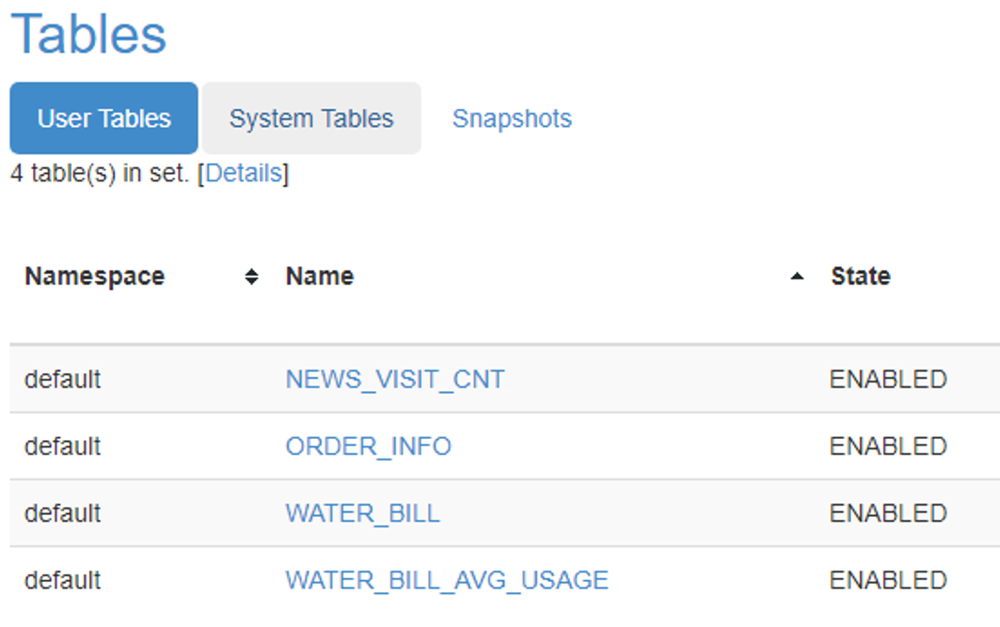

#### 3.2.2   行（row）

l HBASE中的行由一个rowkey（行键）和一个或多个列组成，列的值与rowkey、列相关联

l 行在存储时按行键按字典顺序排序

l 行键的设计非常重要，尽量让相关的行存储在一起

l 例如：存储网站域。如行键是域，则应该将域名反转后存储(org.apache.www、org.apache.mail、org.apache.jira)。这样，所有Apache域都在表中存储在一起，而不是根据子域的第一个字母展开 

后续，我们会讲解rowkey的设计策略。

#### 3.2.3   列（Column）

l  HBASE中的列由列族（Column Family）和列限定符（Column Qualifier）组成

l  表示如下——列族名:列限定符名。例如：C1:USER_ID、C1:SEX

#### 3.2.4   列族（Column Family）

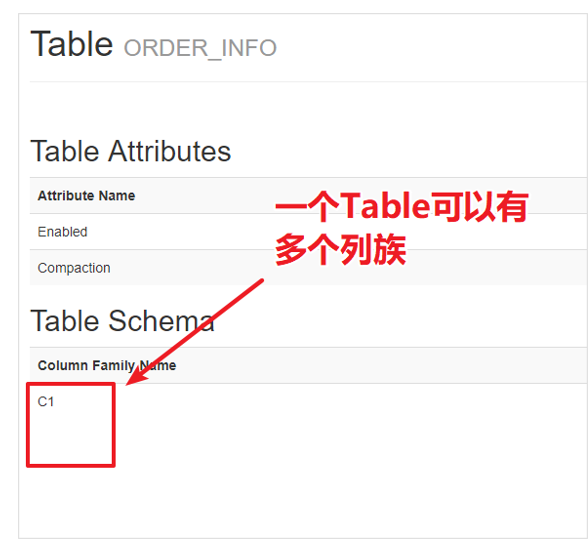

l  出于性能原因，列族将一组列及其值组织在一起

l  每个列族都有一组存储属性，例如：

n 是否应该缓存在内存中

n 数据如何被压缩或行键如何编码等

l  表中的每一行都有相同的列族，但在列族中不存储任何内容

l  所有的列族的数据全部都存储在一块（文件系统HDFS）

l  HBase官方建议所有的列族保持一样的列，并且将同一类的列放在一个列族中

#### 3.2.5   列标识符（Column Qualifier）

l  列族中包含一个个的列限定符，这样可以为存储的数据提供索引

l  列族在创建表的时候是固定的，但列限定符是不作限制的

l  不同的行可能会存在不同的列标识符

#### 3.2.6   单元格（Cell）

l  单元格是行、列系列和列限定符的组合

l  包含一个值和一个时间戳（表示该值的版本）

l  单元格中的内容是以二进制存储的

| ROW     | COLUMN+CELL                                                  |
| ------- | ------------------------------------------------------------ |
| 1250995 | column=C1:ADDRESS, **timestamp**=1588591604729,  value=xC9xBDxCExF7xCA |
| 1250995 | column=C1:LATEST_DATE, **timestamp**=1588591604729,  value=2019-03-28 |
| 1250995 | column=C1:NAME, **timestamp**=1588591604729,  value=xB7xBDxBAxC6xD0xF9 |
| 1250995 | column=C1:NUM_CURRENT, **timestamp**=1588591604729,  value=398.5 |
| 1250995 | column=C1:NUM_PREVIOUS, **timestamp**=1588591604729,  value=379.5 |
| 1250995 | column=C1:NUM_USEAGE, **timestamp**=1588591604729,  value=19 |
| 1250995 | column=C1:PAY_DATE, **timestamp**=1588591604729,  value=2019-02-26 |
| 1250995 | column=C1:RECORD_DATE, **timestamp**=1588591604729,  value=2019-02-11 |
| 1250995 | column=C1:SEX, **timestamp**=1588591604729,  value=xC5xAE    |
| 1250995 | column=C1:TOTAL_MONEY, **timestamp**=1588591604729,  value=114 |

### 3.3   概念模型

| **Row Key**       | **Time Stamp** | **ColumnFamily**   contents | **ColumnFamily**   anchor      | **ColumnFamily**   people   |
| ----------------- | -------------- | --------------------------- | ------------------------------ | --------------------------- |
| "com.cnn.www"     | t9             |                             | anchor:cnnsi.com  = "CNN"      |                             |
| "com.cnn.www"     | t8             |                             | anchor:my.look.ca  = "CNN.com" |                             |
| "com.cnn.www"     | t6             | contents:html  = "<html>…"  |                                |                             |
| "com.cnn.www"     | t5             | contents:html  = "<html>…"  |                                |                             |
| "com.cnn.www"     | t3             | contents:html  = "<html>…"  |                                |                             |
| "com.example.www" | t5             | contents:html  = "<html>…"  |                                | people:author  = "John Doe" |

l  上述表格有两行、三个列族（contents、ancho、people）

l  “com.cnn.www”这一行anchor列族两个列（anchor:cssnsi.com、anchor:my.look.ca）、contents列族有个1个列（html）

l  “com.cnn.www”在HBase中有 t3、t5、t6、t8、t9 5个版本的数据

l  HBase中如果某一行的列被更新的，那么最新的数据会排在最前面，换句话说同一个rowkey的数据是按照倒序排序的

## 4.  常用shell操作

我们可以以shell的方式来维护和管理HBase。例如：执行建表语句、执行增删改查操作等等。

### 4.1   需求

有以下订单数据，我们想要将这样的一些数据保存到HBase中。

| 订单ID | 订单状态 | 支付金额 | 支付方式ID | 用户ID | 操作时间          | 商品分类 |
| ------ | -------- | -------- | ---------- | ------ | ----------------- | -------- |
| 001    | 已付款   | 200.5    | 1          | 001    | 2020-5-2 18:08:53 | 手机;    |

接下来，我们将使用HBase shell来进行以下操作：

1. 创建表

2. 添加数据

3. 更新数据

4. 删除数据

5. 查询数据

### 4.2   创建表

在HBase中，所有的数据也都是保存在表中的。要将订单数据保存到HBase中，首先需要将表创建出来。

#### 4.2.1   启动HBase Shell

HBase的shell其实JRuby的IRB（交互式的Ruby），但在其中添加了一些HBase的命令。

启动HBase shell：

hbase shell

#### 4.2.2   创建表

语法：

create '表名','列族名'...

创建订单表，表名为ORDER_INFO，该表有一个列族为C1

  create 'ORDER_INFO','C1';  

注意：

l create要写成小写

l 一个表可以包含若干个列族

l 命令解析：调用hbase提供的ruby脚本的create方法，传递两个字符串参数

l 通过下面链接可以看到每个命令都是一个ruby脚本

https://github.com/apache/hbase/tree/branch-2.1/hbase-shell/src/main/ruby/shell/commands

#### 4.2.3   查看表

  hbase(main):005:0>  **list**  TABLE                                                                                      ORDER_INFO                                                                                    1  row(s)  Took  0.0378 seconds                                                                               =>  ["ORDER_INFO"]  

#### 4.2.4   删除表

要删除某个表，必须要先禁用表

##### 4.2.4.1   禁用表

语法：disable "表名"

##### 4.2.4.2   删除表

语法：drop "表名"

##### 4.2.4.3   删除ORDER_INFO表

  disable  "ORDER_INFO"  drop  "ORDER_INFO"  

### 4.3   添加数据

#### 4.3.1   需求

接下来，我们需要往订单表中添加以下数据。

| 订单ID | 订单状态 | 支付金额  | 支付方式ID | 用户ID  | 操作时间            | 商品分类 |
| ------ | -------- | --------- | ---------- | ------- | ------------------- | -------- |
| ID     | STATUS   | PAY_MONEY | PAYWAY     | USER_ID | OPERATION_DATE      | CATEGORY |
| 000001 | 已提交   | 4070      | 1          | 4944191 | 2020-04-25 12:09:16 | 手机;    |

#### 4.3.2   PUT操作

HBase中的put命令，可以用来将数据保存到表中。但put一次只能保存一个列的值。以下是put的语法结构：

  put '表名','ROWKEY','列族名:列名','值'  

要添加以上的数据，需要使用7次put操作。如下：

```
  put  'ORDER_INFO','000001','C1:ID','000001'  
  put  'ORDER_INFO','000001','C1:STATUS','已提交' 
  put  'ORDER_INFO','000001','C1:PAY_MONEY',4070 
  put  'ORDER_INFO','000001','C1:PAYWAY',1  
  put  'ORDER_INFO','000001','C1:USER_ID',4944191 
  put  'ORDER_INFO','000001','C1:OPERATION_DATE','2020-04-25 12:09:16' 
  put  'ORDER_INFO','000001','C1:CATEGORY','手机;'  
```


### 4.4   查看添加的数据

#### 4.4.1   需求

要求将rowkey为：000001对应的数据查询出来。

#### 4.4.2   get命令

在HBase中，可以使用get命令来获取单独的一行数据。语法：

  get '表名','rowkey'  

#### 4.4.3   查询指定订单ID的数据

```
get 'ORDER_INFO','000001'
```

| COLUMN            | CELL                                                        |
| ----------------- | ----------------------------------------------------------- |
| C1:CATEGORY       | timestamp=1588415690678,  value=xE6x89x8BxE6x9CxBA;         |
| C1:OPERATION_DATE | timestamp=1588415689773,  value=2020-04-25 12:09:16         |
| C1:PAYWAY         | timestamp=1588415689681,  value=1                           |
| C1:PAY_MONEY      | timestamp=1588415689643,  value=4070                        |
| C1:STATUS         | timestamp=1588415689591,  value=xE5xB7xB2xE6x8Fx90xE4xBAxA4 |
| C1:USER_ID        | timestamp=1588415689721,  value=4944191                     |

#### 4.4.4   显示中文

在HBase shell中，如果在数据中出现了一些中文，默认HBase shell中显示出来的是十六进制编码。要想将这些编码显示为中文，我们需要在get命令后添加一个属性：{FORMATTER => 'toString'}

##### 4.4.4.1   查看订单的数据

```
  get  'ORDER_INFO','000001', {FORMATTER => 'toString'}  
```

注：

l { key => value}，这个是Ruby语法，表示定义一个HASH结构

l get是一个HBase Ruby方法，’ORDER_INFO’、’000001’、{FORMATTER => 'toString'}是put方法的三个参数

l FORMATTER要使用大写

l 在Ruby中用{}表示一个字典，类似于hashtable，FORMATTER表示key、’toString’表示值

### 4.5   更新操作

#### 4.5.1   需求

将订单ID为000001的状态，更改为「已付款」

#### 4.5.2   使用put来更新数据

同样，在HBase中，也是使用put命令来进行数据的更新，语法与之前的添加数据一模一样。

#### 4.5.3   更新指定的列

```
  put 'ORDER_INFO', '000001',  'C1:STATUS', '已付款'  
```

注意：

l  HBase中会自动维护数据的版本

l  每当执行一次put后，都会重新生成新的时间戳

  C1:STATUS  timestamp=1588748844082, value=已提交  C1:STATUS  timestamp=1588748952074, value=已付款  C1:STATUS  timestamp=1588748994244, value=已付款  

### 4.6   删除操作

#### 4.6.1   删除状态列数据

##### 4.6.1.1   需求

将订单ID为000001的状态列删除。

##### 4.6.1.2   delete命令

在HBase中，可以使用delete命令来将一个单元格的数据删除。语法格式如下：

delete '表名', 'rowkey', '列族:列'。

注意：此处HBase默认会保存多个时间戳的版本数据，所以这里的delete删除的是最新版本的列数据。

##### 4.6.1.3   删除指定的列

```
delete 'ORDER_INFO','000001','C1:STATUS'
```

#### 4.6.2   删除整行数据

##### 4.6.2.1   需求

将订单ID为000001的信息全部删除（删除所有的列）

##### 4.6.2.2   deleteall命令

deleteall命令可以将指定rowkey对应的所有列全部删除。语法：

deleteall '表名','rowkey'

##### 4.6.2.3   删除指定的订单

```
deleteall 'ORDER_INFO','000001'
```

#### 4.6.3   清空表

##### 4.6.3.1   需求

将ORDER_INFO的数据全部删除

##### 4.6.3.2   truncate命令

truncate命令用来清空某个表中的所有数据。语法：

truncate "表名"

##### 4.6.3.3   清空ORDER_INFO的所有数据

```
truncate 'ORDER_INFO'
```

### 4.7   导入测试数据集

#### 4.7.1   需求

在资料的 数据集/ ORDER_INFO.txt 中，有一份这样的HBase数据集，我们需要将这些指令放到HBase中执行，将数据导入到HBase中。 

可以看到这些都是一堆的put语句。那么如何才能将这些语句全部执行呢？

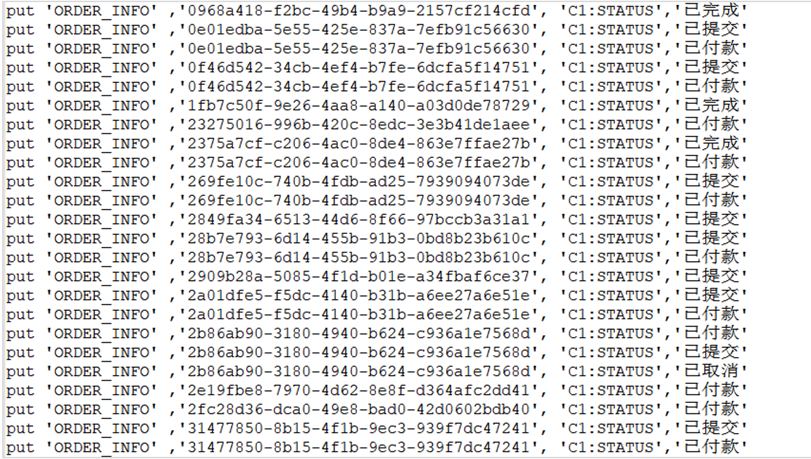

#### 4.7.2   执行command文件

##### 4.7.2.1   上传command文件

将该数据集文件上传到指定的目录中

##### 4.7.2.2   执行

使用以下命令执行：

```
hbase shell /export/software/ORDER_INFO.txt
```

即可。

### 4.8   计数操作

#### 4.8.1   需求

查看HBase中的ORDER_INFO表，一共有多少条记录。

#### 4.8.2   count命令

count命令专门用来统计一个表中有多少条数据。语法：

count ‘表名’

注意：这个操作是比较耗时的。在数据量大的这个命令可能会运行很久。

#### 4.8.3   获取订单数据

 count 'ORDER_INFO'

### 4.9   大量数据的计数统计

当HBase中数据量大时，可以使用HBase中提供的MapReduce程序来进行计数统计。语法如下：

$HBASE_HOME/bin/hbase org.apache.hadoop.hbase.mapreduce.RowCounter '表名'

#### 4.9.1   启动YARN集群

  启动yarn集群  start-yarn.sh  启动history server  mr-jobhistory-daemon.sh  start historyserver  

#### 4.9.2   执行MR JOB

  $HBASE_HOME/bin/hbase org.apache.hadoop.hbase.mapreduce.RowCounter  'ORDER_INFO'   

通过观察YARN的WEB UI，我们发现HBase启动了一个名字为rowcounter_ORDER_INFO的作业。

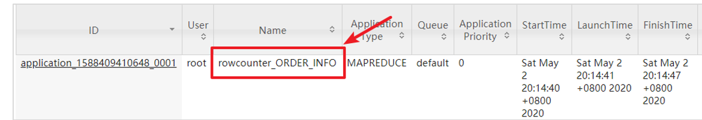

### 4.10  扫描操作

#### 4.10.1     需求一：查询订单所有数据

##### 4.10.1.1    需求

查看ORDER_INFO表中所有的数据

##### 4.10.1.2    scan命令

在HBase，我们可以使用scan命令来扫描HBase中的表。语法：

scan '表名'

##### 4.10.1.3    扫描ORDER_INFO表

```
  scan  'ORDER_INFO',{FORMATTER => 'toString'}   
```

注意：要避免scan一张大表！

#### 4.10.2     需求二：查询订单数据（只显示3条）

```
  scan 'ORDER_INFO', {LIMIT => 3,  FORMATTER => 'toString'}  
```

#### 4.10.3     需求三：查询订单状态、支付方式

##### 4.10.3.1    需求

只查询订单状态以及支付方式，并且只展示3条数据

##### 4.10.3.2    命令

```
  scan 'ORDER_INFO', {LIMIT => 3,  COLUMNS => ['C1:STATUS', 'C1:PAYWAY'], FORMATTER => 'toString'}   
```

注意：

l [‘C1:STATUS’, …]在Ruby中[]表示一个数组

#### 4.10.4     需求四：查询指定订单ID的数据并以中文展示

根据ROWKEY来查询对应的数据，ROWKEY为02602f66-adc7-40d4-8485-76b5632b5b53，只查询订单状态、支付方式，并以中文展示。

要查询指定ROWKEY的数据，需要使用ROWPREFIXFILTER，用法为：

  scan '表名', {ROWPREFIXFILTER => 'rowkey'}  

实现指令：

```
scan 'ORDER_INFO', {ROWPREFIXFILTER => '02602f66-adc7-40d4-8485-76b5632b5b53', COLUMNS => ['C1:STATUS', 'C1:PAYWAY'], FORMATTER => 'toString'}
```

### 4.11  过滤器

#### 4.11.1     简介

在HBase中，如果要对海量的数据来进行查询，此时基本的操作是比较无力的。此时，需要借助HBase中的高级语法——Filter来进行查询。Filter可以根据列簇、列、版本等条件来对数据进行过滤查询。因为在HBase中，主键、列、版本都是有序存储的，所以借助Filter，可以高效地完成查询。当执行Filter时，HBase会将Filter分发给各个HBase服务器节点来进行查询。 

HBase中的过滤器也是基于Java开发的，只不过在Shell中，我们是使用基于JRuby的语法来实现的交互式查询。以下是HBase 2.2的JAVA API文档。

http://hbase.apache.org/2.2/devapidocs/index.html 

#### 4.11.2     HBase中的过滤器

在HBase的shell中，通过show_filters指令，可以查看到HBase中内置的一些过滤器。

```
hbase(main):028:0> show_filters
DependentColumnFilter                                      KeyOnlyFilter                                  
ColumnCountGetFilter                 
SingleColumnValueFilter               
PrefixFilter            
SingleColumnValueExcludeFilter                    
FirstKeyOnlyFilter                     
ColumnRangeFilter           
ColumnValueFilter                          
TimestampsFilter                            
FamilyFilter               
QualifierFilter
ColumnPrefixFilter                  
RowFilter          
MultipleColumnPrefixFilter                              
InclusiveStopFilter                             
PageFilter                  
ValueFilter                                            
ColumnPaginationFilter
```

| **rowkey**  **过滤器**         | RowFilter                                          | 实现行键字符串的比较和过滤                                  |
| ------------------------------ | -------------------------------------------------- | ----------------------------------------------------------- |
| PrefixFilter                   | rowkey前缀过滤器                                   |                                                             |
| KeyOnlyFilter                  | 只对单元格的键进行过滤和显示，不显示值             |                                                             |
| FirstKeyOnlyFilter             | 只扫描显示相同键的第一个单元格，其键值对会显示出来 |                                                             |
| InclusiveStopFilter            | 替代 ENDROW 返回终止条件行                         |                                                             |
| **列过滤器**                   | FamilyFilter                                       | 列簇过滤器                                                  |
| QualifierFilter                | 列标识过滤器，只显示对应列名的数据                 |                                                             |
| ColumnPrefixFilter             | 对列名称的前缀进行过滤                             |                                                             |
| MultipleColumnPrefixFilter     | 可以指定多个前缀对列名称过滤                       |                                                             |
| ColumnRangeFilter              | 过滤列名称的范围                                   |                                                             |
| **值过滤器**                   | ValueFilter                                        | 值过滤器，找到符合值条件的键值对                            |
| SingleColumnValueFilter        | 在指定的列族和列中进行比较的值过滤器               |                                                             |
| SingleColumnValueExcludeFilter | 排除匹配成功的值                                   |                                                             |
| **其他过滤器**                 | ColumnPaginationFilter                             | 对一行的所有列分页，只返回 [offset,offset+limit] 范围内的列 |
| PageFilter                     | 对显示结果按行进行分页显示                         |                                                             |
| TimestampsFilter               | 时间戳过滤，支持等值，可以设置多个时间戳           |                                                             |
| ColumnCountGetFilter           | 限制每个逻辑行返回键值对的个数，在 get 方法中使用  |                                                             |
| DependentColumnFilter          | 允许用户指定一个参考列或引用列来过滤其他列的过滤器 |                                                             |

Java API官方地址：https://hbase.apache.org/devapidocs/index.html

#### 4.11.3     过滤器的用法

过滤器一般结合scan命令来使用。打开HBase的JAVA API文档。找到RowFilter的构造器说明，我们来看以下，HBase的过滤器该如何使用。

**scan '****表名', { Filter => "过滤器(比较运算符, '比较器表达式')” }**

##### 4.11.3.1    比较运算符

| **比较运算符** | **描述** |
| -------------- | -------- |
| =              | 等于     |
| >              | 大于     |
| >=             | 大于等于 |
| <              | 小于     |
| <=             | 小于等于 |
| !=             | 不等于   |

##### 4.11.3.2    比较器

| **比较器**             | **描述**         |
| ---------------------- | ---------------- |
| BinaryComparator       | 匹配完整字节数组 |
| BinaryPrefixComparator | 匹配字节数组前缀 |
| BitComparator          | 匹配比特位       |
| NullComparator         | 匹配空值         |
| RegexStringComparator  | 匹配正则表达式   |
| SubstringComparator    | 匹配子字符串     |

##### 4.11.3.3    比较器表达式

基本语法：比较器类型:比较器的值

| **比较器**             | **表达式语言缩写**     |
| ---------------------- | ---------------------- |
| BinaryComparator       | binary:值              |
| BinaryPrefixComparator | binaryprefix:值        |
| BitComparator          | bit:值                 |
| NullComparator         | null                   |
| RegexStringComparator  | regexstring:正则表达式 |
| SubstringComparator    | substring:值           |

#### 4.11.4     需求一：使用RowFilter查询指定订单ID的数据

##### 4.11.4.1    需求

只查询订单的ID为：02602f66-adc7-40d4-8485-76b5632b5b53、订单状态以及支付方式

**分析**

1. 因为要订单ID就是ORDER_INFO表的rowkey，所以，我们应该使用rowkey过滤器来过滤

2. 通过HBase的JAVA API，找到RowFilter构造器

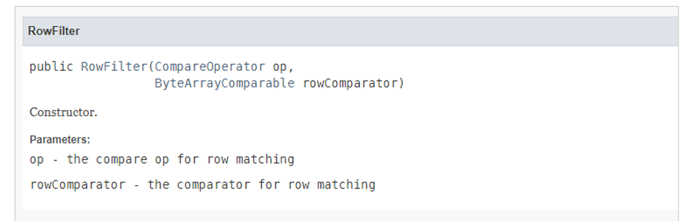

通过上图，可以分析得到，RowFilter过滤器接受两个参数，

l  op——比较运算符

l  rowComparator——比较器

所以构建该Filter的时候，只需要传入两个参数即可

##### 4.11.4.2    命令

  scan 'ORDER_INFO', {FILTER =>  "RowFilter(=,'binary:02602f66-adc7-40d4-8485-76b5632b5b53')"}  

#### 4.11.5     需求二：查询状态为已付款的订单

##### 4.11.5.1    需求

查询状态为「已付款」的订单 

**分析**

1. 因为此处要指定列来进行查询，所以，我们不再使用rowkey过滤器，而是要使用列过滤器

2. 我们要针对指定列和指定值进行过滤，比较适合使用SingleColumnValueFilter过滤器，查看JAVA API

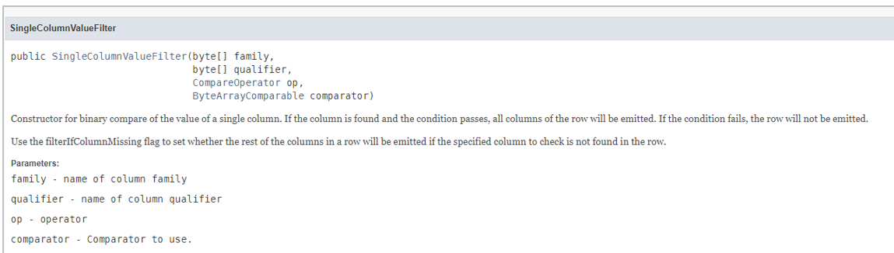

需要传入四个参数：

l  列簇

l  列标识（列名）

l  比较运算符

l  比较器 

注意：

l 列名STATUS的大小写一定要对！此处使用的是大写！

l 列名写错了查不出来数据，但HBase不会报错，因为HBase是无模式的

##### 4.11.5.2    命令 

```
 scan 'ORDER_INFO', {FILTER => "SingleColumnValueFilter('C1',  'STATUS', =, 'binary:已付款')", FORMATTER => 'toString'}  
```

#### 4.11.6     需求三：查询支付方式为1，且金额大于3000的订单

分析

l  此处需要使用多个过滤器共同来实现查询，多个过滤器，可以使用AND或者OR来组合多个过滤器完成查询

l  使用SingleColumnValueFilter实现对应列的查询

##### 4.11.6.1    命令

1. 查询支付方式为1

```
SingleColumnValueFilter('C1', 'PAYWAY', = , 'binary:1')
```

2. 查询金额大于3000的订单

```
SingleColumnValueFilter('C1', 'PAY_MONEY', > , 'binary:3000')
```

3. 组合查询

```
scan 'ORDER_INFO', {FILTER => "SingleColumnValueFilter('C1', 'PAYWAY', = , 'binary:1') AND SingleColumnValueFilter('C1', 'PAY_MONEY', > , 'binary:3000')", FORMATTER => 'toString'} 
```

注意：

l HBase shell中比较默认都是字符串比较，所以如果是比较数值类型的，会出现不准确的情况

l 例如：在字符串比较中4000是比100000大的

### 4.12  INCR

#### 4.12.1     需求

某新闻APP应用为了统计每个新闻的每隔一段时间的访问次数，他们将这些数据保存在HBase中。

该表格数据如下所示：

| 新闻ID     | 访问次数 | 时间段      | ROWKEY                 |
| ---------- | -------- | ----------- | ---------------------- |
| 0000000001 | 12       | 00:00-01:00 | 0000000001_00:00-01:00 |
| 0000000002 | 12       | 01:00-02:00 | 0000000002_01:00-02:00 |

要求：原子性增加新闻的访问次数值。

#### 4.12.2     incr操作简介

incr可以实现对某个单元格的值进行原子性计数。语法如下：

incr '表名','rowkey','列族:列名',累加值（默认累加1） 

l  如果某一列要实现计数功能，必须要使用incr来创建对应的列

l  使用put创建的列是不能实现累加的

#### 4.12.3     导入测试数据

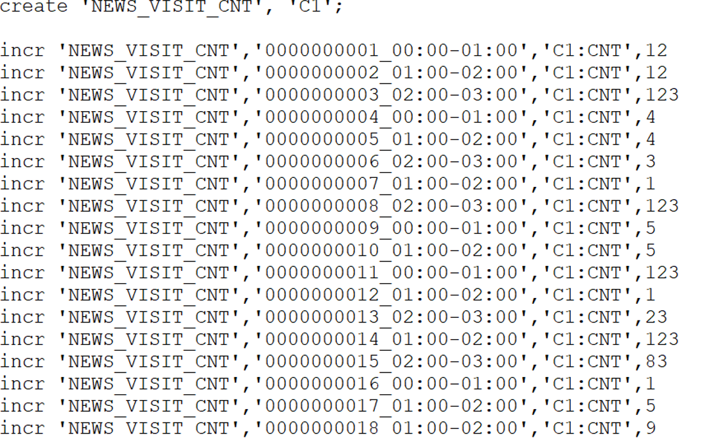

该脚本创建了一个表，名为NEWS_VISIT_CNT，列族为C1。并使用incr创建了若干个计数器，每个rowkey为：新闻的编号_时间段。CNT为count的缩写，表示访问的次数。 

```
  hbase shell  /export/software/NEWS_VISIT_CNT.txt   scan 'NEWS_VISIT_CNT', {LIMIT =>  5, FORMATTER => 'toString'}
```

#### 4.12.4     需求一：对0000000020新闻01:00 - 02:00访问计数+1

1.获取0000000020这条新闻在01:00-02:00当前的访问次数

  get_counter  'NEWS_VISIT_CNT','0000000020_01:00-02:00','C1:CNT'  

此处，如果用get获取到的数据是这样的：

```
base(main):029:0>  get 'NEWS_VISIT_CNT','0000000020_01:00-02:00','C1:CNT'  COLUMN   CELL  C1:CNT  timestamp=1599529533072, value=x00x00x00x00x00x00x00x06                                 
1  row(s)  Took  0.0243 seconds   
```

2.使用incr进行累加

```
  incr  'NEWS_VISIT_CNT','0000000020_01:00-02:00','C1:CNT'  
```

3.再次查案新闻当前的访问次数

```
 get_counter  'NEWS_VISIT_CNT','0000000020_01:00-02:00','C1:CNT'  
```

### 4.13  更多的操作

以下连接可以查看到所有HBase中支持的SHELL脚本。

https://learnhbase.net/2013/03/02/hbase-shell-commands/

## 5.  shell管理操作

### 5.1   status

例如：显示服务器状态

```
  2.4.1  :062 > **status**  1  active master, 0 backup masters, 3 servers, 0 dead, 1.0000 average load  Took  0.0034 seconds     
```

### 5.2   whoami

显示HBase当前用户，例如：

```
  2.4.1  :066 > **whoami**  root  (auth:SIMPLE)    groups: root  Took  0.0080 seconds  
```

### 5.3   list

显示当前所有的表

```
2.4.1 :067 > list
TABLE                                     
ORDER_INFO                                     
1 row(s)
Took 0.0266 seconds                                   
 => ["ORDER_INFO"]
```

### 5.4   count

统计指定表的记录数，例如：

```
 2.4.1  :070 > **count 'ORDER_INFO'**  66  row(s)  Took  0.0404 seconds                         => 66  
```

### 5.5   describe

展示表结构信息

```
2.4.1 :074 > describe 'ORDER_INFO'

Table ORDER_INFO is ENABLED     
ORDER_INFO                 
COLUMN FAMILIES DESCRIPTION       
{NAME => 'C1', VERSIONS => '1', EVICT_BLOCKS_ON_CLOSE => 'false', NEW_VERSION_BEHAVIOR => 'false', KEEP_DELETED_CELLS => 'FALSE', CACHE_DATA_ON_WRITE =

> 'false', DATA_BLOCK_ENCODING => 'NONE', TTL => 'FOREVER', MIN_VERSIONS => '0', REPLICATION_SCOPE => '0', BLOOMFILTER => 'ROW', CACHE_INDEX_ON_WRITE =

> 'false', IN_MEMORY => 'false', CACHE_BLOOMS_ON_WRITE => 'false', PREFETCH_BLOCKS_ON_OPEN => 'false', COMPRESSION => 'NONE', BLOCKCACHE => 'true', BLO
CKSIZE => '65536'}                               
1 row(s)
Took 0.0265 seconds    
```

### 5.6   exists

检查表是否存在，适用于表量特别多的情况

```
2.4.1 :075 > exists 'ORDER_INFO'
Table ORDER_INFO does exist                      
Took 0.0050 seconds              
 => true
```

### 5.7   is_enabled、is_disabled

检查表是否启用或禁用

```
2.4.1 :077 > is_enabled 'ORDER_INFO'
true
Took 0.0058 seconds
 => true 
2.4.1 :078 > is_disabled 'ORDER_INFO'
false
Took 0.0085 seconds
 => 1
```

### 5.8   alter

该命令可以改变表和列族的模式，例如：

```
# 创建一个USER_INFO表，两个列族C1、C2
create 'USER_INFO', 'C1', 'C2'
# 新增列族C3
alter 'USER_INFO', 'C3'
# 删除列族C3
alter 'USER_INFO', 'delete' => 'C3' 
```

注意：

l 'delete' => 'C3'，还是一个Map结构，只不过只有一个key，可以省略两边的{}

### 5.9   disable/enable

禁用一张表/启用一张表

### 5.10  drop

删除一张表，记得在删除表之前必须先禁用

### 5.11  truncate

清空表的数据，禁用表-删除表-创建表

## 6.  Hbase Java编程

### 6.1   需求与数据集

某某自来水公司，需要存储大量的缴费明细数据。以下截取了缴费明细的一部分内容。

| 用户id  | 姓名   | 用户地址                     | 性别 | 缴费时间   | 表示数（本次） | 表示数（上次） | 用量（立方） | 合计金额 | 查表日期   | 最迟缴费日期 |
| ------- | ------ | ---------------------------- | ---- | ---------- | -------------- | -------------- | ------------ | -------- | ---------- | ------------ |
| 4944191 | 登卫红 | 贵州省铜仁市德江县7单元267室 | 男   | 2020-05-10 | 308.1          | 283.1          | 25           | 150      | 2020-04-25 | 2020-06-09   |

因为缴费明细的数据记录非常庞大，该公司的信息部门决定使用HBase来存储这些数据。并且，他们希望能够通过Java程序来访问这些数据。

### 6.2   准备工作

#### 6.2.1   创建IDEA Maven项目

| groupId    | cn.itcast |
| ---------- | --------- |
| artifactId | hbase_op  |

#### 6.2.2   导入pom依赖

```
    <repositories><!-- 代码库 -->
        <repository>
            <id>aliyun</id>
            <url>http://maven.aliyun.com/nexus/content/groups/public/</url>
            <releases>
                <enabled>true</enabled>
            </releases>
            <snapshots>
                <enabled>false</enabled>
                <updatePolicy>never</updatePolicy>
            </snapshots>
        </repository>
    </repositories>

    <dependencies>
        <dependency>
            <groupId>org.apache.hbase</groupId>
            <artifactId>hbase-client</artifactId>
            <version>2.1.0</version>
        </dependency>
        <dependency>
            <groupId>commons-io</groupId>
            <artifactId>commons-io</artifactId>
            <version>2.6</version>
        </dependency>
        <dependency>
            <groupId>junit</groupId>
            <artifactId>junit</artifactId>
            <version>4.12</version>
            <scope>test</scope>
        </dependency>
        <dependency>
            <groupId>org.testng</groupId>
            <artifactId>testng</artifactId>
            <version>6.14.3</version>
            <scope>test</scope>
        </dependency>
    </dependencies>

    <build>
        <plugins>
            <plugin>
                <groupId>org.apache.maven.plugins</groupId>
                <artifactId>maven-compiler-plugin</artifactId>
                <version>3.1</version>
                <configuration>
                    <target>1.8</target>
                    <source>1.8</source>
                </configuration>
            </plugin>
        </plugins>
    </build>
 
```

#### 6.2.3   复制HBase和Hadoop配置文件

将以下三个配置文件复制到resource目录中

l hbase-site.xml

从Linux中下载：sz /export/server/hbase-2.1.0/conf/hbase-site.xml

l core-site.xml

从Linux中下载：sz /export/server/hadoop-2.7.5/etc/hadoop/core-site.xml

l log4j.properties 

注意：请确认配置文件中的服务器节点hostname/ip地址配置正确

#### 6.2.4   创建包结构和类

1.   在**test**目录创建 cn.itcast.hbase.admin.api_test 包结构

2.   创建TableAmdinTest类

#### 6.2.5   创建Hbase连接以及admin管理对象

要操作Hbase也需要建立Hbase的连接。此处我们仍然使用TestNG来编写测试。使用@BeforeTest初始化HBase连接，创建admin对象、@AfterTest关闭连接。 

实现步骤：

1.   使用HbaseConfiguration.create()创建Hbase配置

2.   使用ConnectionFactory.createConnection()创建Hbase连接

3.   要创建表，需要基于Hbase连接获取admin管理对象

4.   使用admin.close、connection.close关闭连接 

参考代码：

```
 public class TableAmdinTest {

    private Configuration configuration;
    private Connection connection;
    private Admin admin;

    @BeforeTest
    public void beforeTest() throws IOException {
        configuration = HBaseConfiguration.create();
        connection = ConnectionFactory.createConnection(configuration);
        admin = connection.getAdmin();
    }

    @AfterTest
    public void afterTest() throws IOException {
        admin.close();
        connection.close();
    }
}
 
```

### 6.3   需求一：使用Java代码创建表

创建一个名为WATER_BILL的表，包含一个列族C1。 

实现步骤：

1.   判断表是否存在

a)   存在，则退出

2.   使用TableDescriptorBuilder.newBuilder构建表描述构建器

3.   使用ColumnFamilyDescriptorBuilder.newBuilder构建列族描述构建器

4.   构建列族描述，构建表描述

5.   创建表 

参考代码：

```
  // 创建一个名为WATER_BILL的表，包含一个列族C1
@Test
public void createTableTest() throws IOException {
    // 表名
    String TABLE_NAME = "WATER_BILL";
    // 列族名
    String COLUMN_FAMILY = "C1";

    // 1. 判断表是否存在
    if(admin.tableExists(TableName.valueOf(TABLE_NAME))) {
        return;
    }

    // 2. 构建表描述构建器
    TableDescriptorBuilder tableDescriptorBuilder = TableDescriptorBuilder.newBuilder(TableName.valueOf(TABLE_NAME));

    // 3. 构建列族描述构建器
    ColumnFamilyDescriptorBuilder columnFamilyDescriptorBuilder = ColumnFamilyDescriptorBuilder.newBuilder(Bytes.toBytes(COLUMN_FAMILY));

    // 4. 构建列族描述
    ColumnFamilyDescriptor columnFamilyDescriptor = columnFamilyDescriptorBuilder.build();

    // 5. 构建表描述
    // 添加列族
    tableDescriptorBuilder.setColumnFamily(columnFamilyDescriptor);
    TableDescriptor tableDescriptor = tableDescriptorBuilder.build();

    // 6. 创建表
    admin.createTable(tableDescriptor);
}

```

### 6.4   需求三：使用Java代码删除表

实现步骤：

1.   判断表是否存在

2.   如果存在，则禁用表

3.   再删除表 

参考代码：

```
 // 删除表
@Test
public void dropTable() throws IOException {
    // 表名
    TableName tableName = TableName.valueOf("WATER_BILL");

    // 1. 判断表是否存在
    if(admin.tableExists(tableName)) {
        // 2. 禁用表
        admin.disableTable(tableName);
        // 3. 删除表
        admin.deleteTable(tableName);
    }
}

```

### 6.5   需求二：往表中插入一条数据

#### 6.5.1   创建包

1.   在 test 目录中创建 cn.itcast.hbase.data.api_test 包

2.   创建DataOpTest类

#### 6.5.2   初始化Hbase连接

在@BeforeTest中初始化HBase连接，在@AfterTest中关闭Hbase连接。

参考代码：

```
public class DataOpTest {
    private Configuration configuration;
    private Connection connection;
    
    @BeforeTest
    public void beforeTest() throws IOException {
        configuration = HBaseConfiguration.create();
        connection = ConnectionFactory.createConnection(configuration);
    }
    
    @AfterTest
    public void afterTest() throws IOException {
        connection.close();
    }
}


```

#### 6.5.3   插入姓名列数据

在表中插入一个行，该行只包含一个列。

| ROWKEY  | 姓名（列名：NAME） |
| ------- | ------------------ |
| 4944191 | 登卫红             |

实现步骤：

1.   使用Hbase连接获取Htable

2.   构建ROWKEY、列族名、列名

3.   构建Put对象（对应put命令）

4.   添加姓名列

5.   使用Htable表对象执行put操作

6.   关闭Htable表对象 

参考代码：

```
 @Test
public void addTest() throws IOException {
    // 1.使用Hbase连接获取Htable
    TableName waterBillTableName = TableName.valueOf("WATER_BILL");
    Table waterBillTable = connection.getTable(waterBillTableName);

    // 2.构建ROWKEY、列族名、列名
    String rowkey = "4944191";
    String cfName = "C1";
    String colName = "NAME";

    // 3.构建Put对象（对应put命令）
    Put put = new Put(Bytes.toBytes(rowkey));

    // 4.添加姓名列
    put.addColumn(Bytes.toBytes(cfName)
        , Bytes.toBytes(colName)
        , Bytes.toBytes("登卫红"));

    // 5.使用Htable表对象执行put操作
    waterBillTable.put(put);
    // 6. 关闭表
    waterBillTable.close();
}


```

#### 6.5.4   查看HBase中的数据

get 'WATER_BILL','4944191',{FORMATTER => 'toString'}

#### 6.5.5   插入其他列

| **列名**     | **说明**       | **值**                       |
| ------------ | -------------- | ---------------------------- |
| ADDRESS      | 用户地址       | 贵州省铜仁市德江县7单元267室 |
| SEX          | 性别           | 男                           |
| PAY_DATE     | 缴费时间       | 2020-05-10                   |
| NUM_CURRENT  | 表示数（本次） | 308.1                        |
| NUM_PREVIOUS | 表示数（上次） | 283.1                        |
| NUM_USAGE    | 用量（立方）   | 25                           |
| TOTAL_MONEY  | 合计金额       | 150                          |
| RECORD_DATE  | 查表日期       | 2020-04-25                   |
| LATEST_DATE  | 最迟缴费日期   | 2020-06-09                   |

参考代码：

```
 @Test
public void addTest() throws IOException {
    // 1.使用Hbase连接获取Htable
    TableName waterBillTableName = TableName.valueOf("WATER_BILL");
    Table waterBillTable = connection.getTable(waterBillTableName);

    // 2.构建ROWKEY、列族名、列名
    String rowkey = "4944191";
    String cfName = "C1";
    String colName = "NAME";
    String colADDRESS = "ADDRESS";
    String colSEX = "SEX";
    String colPAY_DATE = "PAY_DATE";
    String colNUM_CURRENT = "NUM_CURRENT";
    String colNUM_PREVIOUS = "NUM_PREVIOUS";
    String colNUM_USAGE = "NUM_USAGE";
    String colTOTAL_MONEY = "TOTAL_MONEY";
    String colRECORD_DATE = "RECORD_DATE";
    String colLATEST_DATE = "LATEST_DATE";

    // 3.构建Put对象（对应put命令）
    Put put = new Put(Bytes.toBytes(rowkey));

    // 4.添加姓名列
    put.addColumn(Bytes.toBytes(cfName)
            , Bytes.toBytes(colName)
            , Bytes.toBytes("登卫红"));
    put.addColumn(Bytes.toBytes(cfName)
            , Bytes.toBytes(colADDRESS)
            , Bytes.toBytes("贵州省铜仁市德江县7单元267室"));
    put.addColumn(Bytes.toBytes(cfName)
            , Bytes.toBytes(colSEX)
            , Bytes.toBytes("男"));
    put.addColumn(Bytes.toBytes(cfName)
            , Bytes.toBytes(colPAY_DATE)
            , Bytes.toBytes("2020-05-10"));
    put.addColumn(Bytes.toBytes(cfName)
            , Bytes.toBytes(colNUM_CURRENT)
            , Bytes.toBytes("308.1"));
    put.addColumn(Bytes.toBytes(cfName)
            , Bytes.toBytes(colNUM_PREVIOUS)
            , Bytes.toBytes("283.1"));
    put.addColumn(Bytes.toBytes(cfName)
            , Bytes.toBytes(colNUM_USAGE)
            , Bytes.toBytes("25"));
    put.addColumn(Bytes.toBytes(cfName)
            , Bytes.toBytes(colTOTAL_MONEY)
            , Bytes.toBytes("150"));
    put.addColumn(Bytes.toBytes(cfName)
            , Bytes.toBytes(colRECORD_DATE)
            , Bytes.toBytes("2020-04-25"));
    put.addColumn(Bytes.toBytes(cfName)
            , Bytes.toBytes(colLATEST_DATE)
            , Bytes.toBytes("2020-06-09"));

    // 5.使用Htable表对象执行put操作
    waterBillTable.put(put);

    // 6. 关闭表
    waterBillTable.close();
}
```

### 6.6   需求三：查看一条数据

查询rowkey为4944191的所有列的数据，并打印出来。

实现步骤：

1.   获取HTable

2.   使用rowkey构建Get对象

3.   执行get请求

4.   获取所有单元格

5.   打印rowkey

6.   迭代单元格列表

7.   关闭表

参考代码：

```
@Test
public void getOneTest() throws IOException {
    // 1. 获取HTable
    TableName waterBillTableName = TableName.valueOf("WATER_BILL");
    Table waterBilltable = connection.getTable(waterBillTableName);

    // 2. 使用rowkey构建Get对象
    Get get = new Get(Bytes.toBytes("4944191"));

    // 3. 执行get请求
    Result result = waterBilltable.get(get);

    // 4. 获取所有单元格
    List<Cell> cellList = result.listCells();

    // 打印rowkey
    System.out.println("rowkey => " + Bytes.toString(result.getRow()));

    // 5. 迭代单元格列表
    for (Cell cell : cellList) {
        // 打印列族名
        System.out.print(Bytes.toString(cell.getQualifierArray(), cell.getQualifierOffset(), cell.getQualifierLength()));
        System.out.println(" => " + Bytes.toString(cell.getValueArray(), cell.getValueOffset(), cell.getValueLength()));

    }

    // 6. 关闭表
    waterBilltable.close();
}  
```


### 6.7   需求四：删除一条数据

删除rowkey为4944191的整条数据。

实现步骤：

1.    获取HTable对象

2.   根据rowkey构建delete对象

3.   执行delete请求

4.   关闭表

参考代码：

```
 // 删除rowkey为4944191的整条数据
@Test
public void deleteOneTest() throws IOException {
    // 1. 获取HTable对象
    Table waterBillTable = connection.getTable(TableName.valueOf("WATER_BILL"));

    // 2. 根据rowkey构建delete对象
    Delete delete = new Delete(Bytes.toBytes("4944191"));

    // 3. 执行delete请求
    waterBillTable.delete(delete);

    // 4. 关闭表
    waterBillTable.close();
}

```

  

### 6.8   需求五：导入数据

#### 6.8.1   需求

在资料中，有一份10W的抄表数据文件，我们需要将这里面的数据导入到HBase中。

#### 6.8.2   Import JOB

在HBase中，有一个Import的MapReduce作业，可以专门用来将数据文件导入到HBase中。 

**用法**

```
  hbase  org.apache.hadoop.hbase.mapreduce.Import 表名 HDFS数据文件路径  
```

#### 6.8.3   导入数据

1. 将资料中数据文件上传到Linux中

2. 再将文件上传到hdfs中

```
  hadoop  fs -mkdir -p /water_bill/output_ept_10W  
  hadoop fs -put part-m-00000_10w  /water_bill/output_ept_10W  
```

3. 启动YARN集群

```
start-yarn.sh
```

4. 使用以下方式来进行数据导入

```
  hbase  org.apache.hadoop.hbase.mapreduce.Import WATER_BILL  /water_bill/output_ept_10W  
```

#### 6.8.4   导出数据

```
hbase org.apache.hadoop.hbase.mapreduce.Export  WATER_BILL /water_bill/output_ept_10W_export 
```

### 6.9   需求六：查询2020年6月份所有用户的用水量

#### 6.9.1   需求分析

在Java API中，我们也是使用scan + filter来实现过滤查询。2020年6月份其实就是从2020年6月1日到2020年6月30日的所有抄表数据。

#### 6.9.2   准备工作

1.   在cn.itcast.hbase.data.api_test包下创建ScanFilterTest类

2.   使用@BeforeTest、@AfterTest构建HBase连接、以及关闭HBase连接

#### 6.9.3   实现

实现步骤：

1.    获取表

2.   构建scan请求对象

3.   构建两个过滤器

a)   构建两个日期范围过滤器（注意此处请使用RECORD_DATE——抄表日期比较

b)   构建过滤器列表

4.   执行scan扫描请求

5.   迭代打印result

6.   迭代单元格列表

7.   关闭ResultScanner（这玩意把转换成一个个的类似get的操作，注意要关闭释放资源）

8.   关闭表

参考代码：

```
// 查询2020年6月份所有用户的用水量数据
@Test
public void queryTest1() throws IOException {
    // 1. 获取表
    Table waterBillTable = connection.getTable(TableName.valueOf("WATER_BILL"));
    // 2. 构建scan请求对象
    Scan scan = new Scan();
    // 3. 构建两个过滤器
    // 3.1 构建日期范围过滤器（注意此处请使用RECORD_DATE——抄表日期比较
    SingleColumnValueFilter startDateFilter = new SingleColumnValueFilter(Bytes.toBytes("C1")
            , Bytes.toBytes("RECORD_DATE")
            , CompareOperator.GREATER_OR_EQUAL
            , Bytes.toBytes("2020-06-01"));

    SingleColumnValueFilter endDateFilter = new SingleColumnValueFilter(Bytes.toBytes("C1")
            , Bytes.toBytes("RECORD_DATE")
            , CompareOperator.LESS_OR_EQUAL
            , Bytes.toBytes("2020-06-30"));

    // 3.2 构建过滤器列表
    FilterList filterList = new FilterList(FilterList.Operator.MUST_PASS_ALL
            , startDateFilter
            , endDateFilter);

    scan.setFilter(filterList);

    // 4. 执行scan扫描请求
    ResultScanner resultScan = waterBillTable.getScanner(scan);

    // 5. 迭代打印result
    for (Result result : resultScan) {
        System.out.println("rowkey -> " + Bytes.toString(result.getRow()));
        System.out.println("------");

        List<Cell> cellList = result.listCells();

        // 6. 迭代单元格列表
        for (Cell cell : cellList) {
            // 打印列族名
            System.out.print(Bytes.toString(cell.getQualifierArray(), cell.getQualifierOffset(), cell.getQualifierLength()));
            System.out.println(" => " + Bytes.toString(cell.getValueArray(), cell.getValueOffset(), cell.getValueLength()));

        }
        System.out.println("------");
    }

resultScanner.close();


    // 7. 关闭表
    waterBillTable.close();
}

```

#### 6.9.4   解决乱码问题

因为前面我们的代码，在打印所有的列时，都是使用字符串打印的，Hbase中如果存储的是int、double，那么有可能就会乱码了。

```
System.out.print(Bytes.toString(cell.getQualifierArray(), cell.getQualifierOffset(), cell.getQualifierLength()));
System.out.println(" => " + Bytes.toString(cell.getValueArray(), cell.getValueOffset(), cell.getValueLength()));

```

要解决的话，我们可以根据列来判断，使用哪种方式转换字节码。如下：

1.    NUM_CURRENT

2.   NUM_PREVIOUS

3.   NUM_USAGE

4.   TOTAL_MONEY

这4列使用double类型展示，其他的使用string类型展示。

参考代码：

```
String colName = Bytes.toString(cell.getQualifierArray(), cell.getQualifierOffset(), cell.getQualifierLength());
System.out.print(colName);

if(colName.equals("NUM_CURRENT")
        || colName.equals("NUM_PREVIOUS")
        || colName.equals("NUM_USAGE")
        || colName.equals("TOTAL_MONEY")) {
    System.out.println(" => " + Bytes.toDouble(cell.getValueArray(), cell.getValueOffset()));
}
else {
    System.out.println(" => " + Bytes.toString(cell.getValueArray(), cell.getValueOffset(), cell.getValueLength()));
}

```

## 7.  HBase高可用

考虑关于HBase集群的一个问题，在当前的HBase集群中，只有一个Master，一旦Master出现故障，将会导致HBase不再可用。所以，在实际的生产环境中，是非常有必要搭建一个高可用的HBase集群的。

### 7.1   HBase高可用简介

HBase的高可用配置其实就是HMaster的高可用。要搭建HBase的高可用，只需要再选择一个节点作为HMaster，在HBase的conf目录下创建文件backup-masters，然后再backup-masters添加备份Master的记录。一条记录代表一个backup master，可以在文件配置多个记录。

### 7.2   搭建HBase高可用

1. 在hbase的conf文件夹中创建 backup-masters 文件

```
  cd /export/server/hbase-2.1.0/conf  touch backup-masters 
```

2. 将node2.itcast.cn和node3.itcast.cn添加到该文件中

```
  vim backup-masters  node2.itcast.cn  node3.itcast.cn 
```

3. 将backup-masters文件分发到所有的服务器节点中

```
scp backup-masters node2.itcast.cn:$PWD  scp backup-masters node3.itcast.cn:$PWD   
```

4. 重新启动hbase

```
  stop-hbase.sh  start-hbase.sh   
```

5.   查看webui，检查Backup Masters中是否有node2.itcast.cn、node3.itcast.cn

http://node1.itcast.cn:16010/master-status

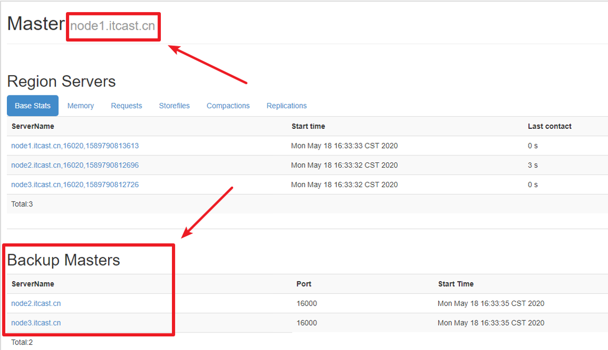

 

6. 尝试杀掉node1.itcast.cn节点上的master

kill -9 HMaster进程id

 

7. 访问[http://node2.itcast.cn:16010](http://node1.itcast.cn:16010/master-status)和http://node3.itcast.cn:16010，观察是否选举了新的Master

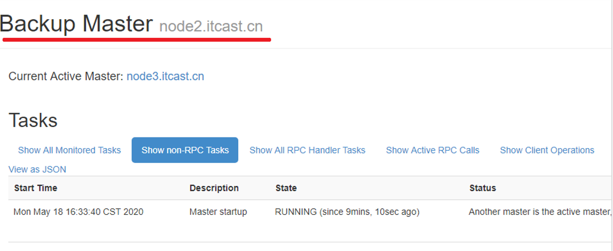

## 8.  HBase架构

### 8.1   系统架构

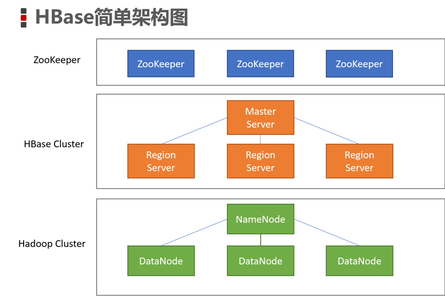

#### 8.1.1   Client

客户端，例如：发出HBase操作的请求。例如：之前我们编写的Java API代码、以及HBase shell，都是CLient

#### 8.1.2   Master Server

在HBase的Web UI中，可以查看到Master的位置。

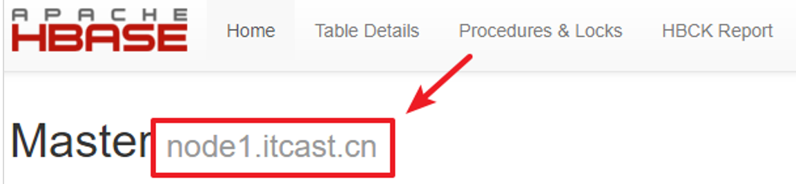

l 监控RegionServer

l 处理RegionServer故障转移

l 处理元数据的变更

l 处理region的分配或移除

l 在空闲时间进行数据的负载均衡

l 通过Zookeeper发布自己的位置给客户端

#### 8.1.3   Region Server

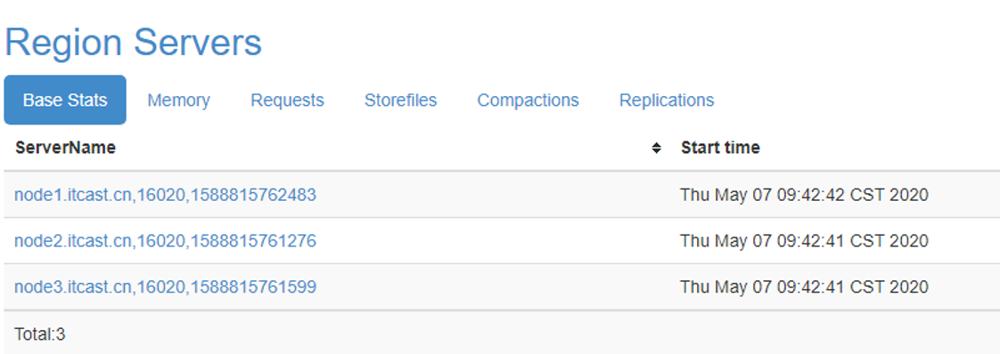

l 处理分配给它的Region

l 负责存储HBase的实际数据

l 刷新缓存到HDFS

l 维护HLog

l 执行压缩

l 负责处理Region分片

 

l RegionServer中包含了大量丰富的组件，如下：

l Write-Ahead logs

l HFile(StoreFile)

l Store

l MemStore

l Region

### 8.2   逻辑结构模型

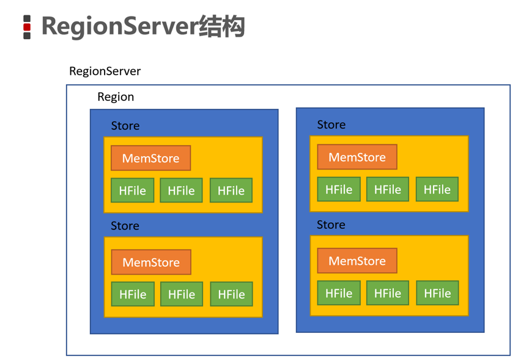

#### 8.2.1   Region

l  在HBASE中，表被划分为很多「Region」，并由Region Server提供服务

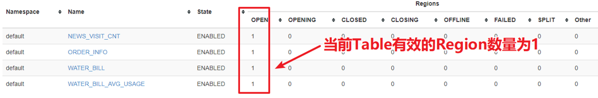

#### 8.2.2   Store

l  Region按列族垂直划分为「Store」，存储在HDFS在文件中

#### 8.2.3   MemStore

l MemStore与缓存内存类似

l 当往HBase中写入数据时，首先是写入到MemStore

l 每个列族将有一个MemStore

l  当MemStore存储快满的时候，整个数据将写入到HDFS中的HFile中

#### 8.2.4   StoreFile

l  每当任何数据被写入HBASE时，首先要写入MemStore

l  当MemStore快满时，整个排序的key-value数据将被写入HDFS中的一个新的HFile中

l  写入HFile的操作是连续的，速度非常快

l  物理上存储的是**HFile**

#### 8.2.5   WAL

l  WAL全称为Write Ahead Log，它最大的作用就是   故障恢复

l  WAL是HBase中提供的一种高并发、持久化的日志保存与回放机制

l  每个业务数据的写入操作（PUT/DELETE/INCR），都会保存在WAL中

l  一旦服务器崩溃，通过回放WAL，就可以实现恢复崩溃之前的数据

l  物理上存储是Hadoop的**Sequence File**

## 9.  常见问题

### 9.1   Could not find or load main class org.apache.hadoop.mapreduce.v2.app.MRAppMaster

1. 找到$HADOOP_HOME/etc/mapred-site.xml,增加以下配置

```
<property>
  <name>yarn.app.mapreduce.am.env</name>
  <value>HADOOP_MAPRED_HOME=${HADOOP_HOME}</value>
</property>
<property>
  <name>mapreduce.map.env</name>
  <value>HADOOP_MAPRED_HOME=${HADOOP_HOME}</value>
</property>
<property>
  <name>mapreduce.reduce.env</name>
  <value>HADOOP_MAPRED_HOME=${HADOOP_HOME}</value>
</property>

```

2. 将配置文件分发到各个节点

3. 重新启动YARN集群

### 9.2   Caused by: java.net.ConnectException: Call to node2.itcast.cn/192.168.88.101:16020 failed on connection exception: org.apache.hbase.thirdparty.io.netty.channel.ConnectTimeoutException: connection timed out: node2.itcast.cn/192.168.88.101:16020

无法连接到HBase，请检查HBase的Master是否正常启动

### 9.3   Starting namenodes on [localhost] ERROR: Attempting to launch hdfs namenode as root ，ERROR: but there is no HDFS_NAMENODE_USER defined. Aborting launch. 

解决办法：

是因为缺少用户定义造成的，所以分别编辑开始和关闭脚本 

$ vim sbin/start-dfs.sh 

$ vim sbin/stop-dfs.sh 

在顶部空白处添加内容： 

HDFS_DATANODE_USER=root

HADOOP_SECURE_DN_USER=hdfs

HDFS_NAMENODE_USER=root

HDFS_SECONDARYNAMENODE_USER=root

### 9.4   Starting resourcemanager ERROR: Attempting to launch yarn resourcemanager as root ERROR: but there is no YARN_RESOURCEMANAGER_USER defined. Aborting launch. Starting nodemanagers ERROR: Attempting to launch yarn nodemanager as root ERROR: but there is no YARN_NODEMANAGER_USER defined. Aborting launch. 

vim sbin/start-yarn.sh 

vim sbin/stop-yarn.sh 

 

YARN_RESOURCEMANAGER_USER=root

HADOOP_SECURE_DN_USER=yarn

YARN_NODEMANAGER_USER=root

### 9.5   Exception in thread "main" java.lang.UnsatisfiedLinkError: org.apache.hadoop.io.nativeio.NativeIO$POSIX.stat

解决方案：

将 hadoop.dll 放到c:/windows/system32文件夹中，重启IDEA，重新运行程序