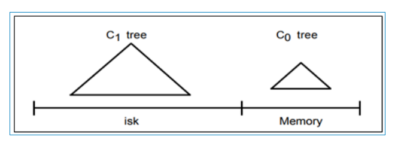
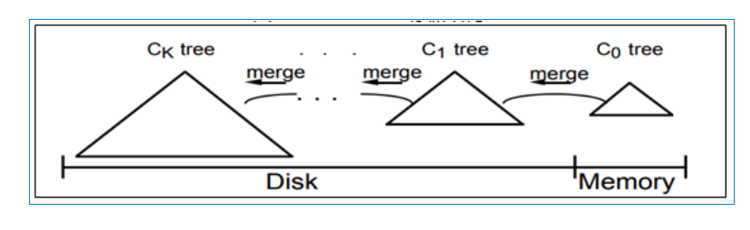
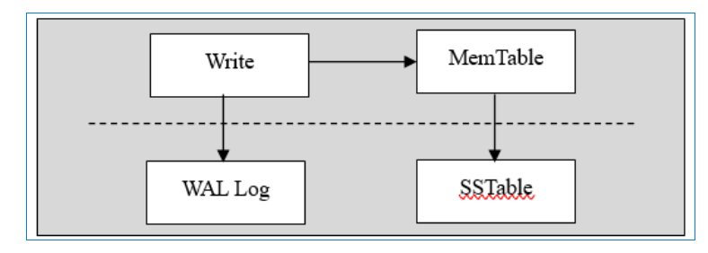
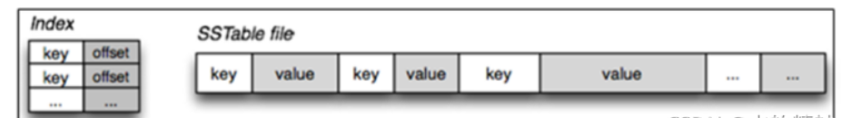
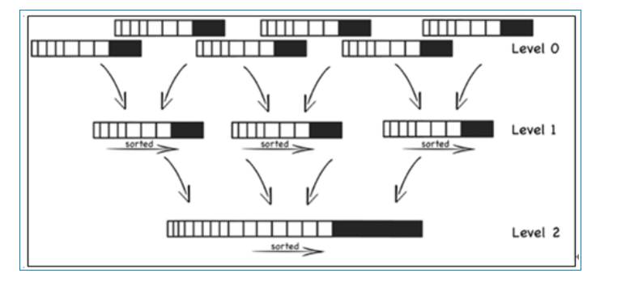
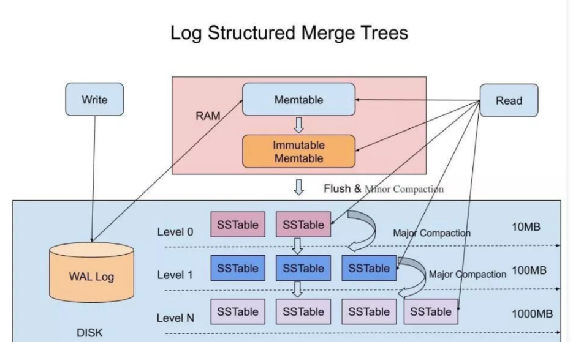

# LSM-Tree

>  LSM-Tree 是一种设计思想。在此思想下，可以带来**极高的写入速度**。但是稍微**牺牲了读取的速度**。另外要知道，在此设计下，**无法对事务有很好的支持**。
>
>  还要知道，这种方式的写入方式，它是**近实时**的，在实时性上略有牺牲。 在此设计下，背后要进行merge，**要花费很多的资源**。
>
>  十多年前，谷歌发布了大名鼎鼎的"三驾马车"的论文，分别是GFS(2003年)，MapReduce（2004 年），BigTable（2006年），为开源界在[大数据](https://cloud.tencent.com/solution/bigdata?from=10680)领域带来了无数的灵感，其中在 “BigTable” 的论文中很多很酷的方面之一就是它所使用的文件组织方式，这个方法更一般的名字叫 Log Structured-Merge Tree。在面对亿级别之上的海量数据的存储和检索的场景下，我们选择的[数据库](https://cloud.tencent.com/solution/database?from=10680)通常都是各种强力的NoSQL，比如Hbase，Cassandra，Leveldb，RocksDB等等，这其中前两者是Apache下面的顶级开源项目数据库，后两者分别是Google和Facebook开源的数据库存储引擎。而这些强大的NoSQL数据库都有一个共性，就是其底层使用的数据结构，都是仿照“BigTable”中的文件组织方式来实现的，也就是我们今天要介绍的LSM-Tree。

# 什么是LSM-Tree

LSM-Tree全称是Log Structured Merge Tree，是一种分层，有序，面向磁盘的数据结构，其核心思想是充分了利用了，磁盘批量的顺序写要远比随机写性能高出很多

 围绕这一原理进行设计和优化，以此让写性能达到最优，正如我们普通的Log的写入方式，这种结构的写入，全部都是以Append的模式追加，不存在删除和修改。当然有得就有舍，这种结构虽然大大提升了数据的写入能力，却是以牺牲部分读取性能为代价，故此这种结构通常适合于写多读少的场景。故LSM被设计来提供比传统的B+树或者ISAM更好的写操作吞吐量，通过消去随机的本地更新操作来达到这个目标。这里面最典型的例子就属于Kakfa了，把磁盘顺序写发挥到了极致，故而在大数据领域成为了互联网公司标配的分布式消息[中间件](https://cloud.tencent.com/product/tdmq?from=10680)组件。

虽然这种结构的写非常简单高效，但其缺点是对读取特别是随机读很不友好，这也是为什么日志通常用在下面的两种简单的场景：

（1） 数据是被整体访问的，大多数数据库的WAL（write ahead log）也称预写log，包括mysql的Binlog等

（2） 数据是通过文件的偏移量offset访问的，比如Kafka。

想要支持更复杂和高效的读取，比如按key查询和按range查询，就得需要做一步的设计，这也是LSM-Tree结构，除了利用磁盘顺序写之外，还划分了内存+磁盘多层的合并结构的原因，正是基于这种结构再加上不同的优化实现，才造就了在这之上的各种独具特点的NoSQL数据库，如Hbase，Cassandra，Leveldb，RocksDB，MongoDB，TiDB等。

#  LSM-Tree 合并思想

LSM 树由两个或以上的存储结构组成，比如在论文中为了方便说明使用了最简单的两个存储结构。一个存储结构常驻内存中，称为 C0 tree ，具体可以是任何方便健值查找的数据结构，比如红黑树、 map 之类，甚至可以是跳表。另外一个存储结构常驻在硬盘中，称为 C1 tree ，具体结构类似 B 树。 C1 所有节点都是 100% 满的，节点的大小为磁盘块大小。

                              LSM-Tree 存储结构 1 

                               LSM-Tree 存储结构 2

 如上图所示，数据库采用了基于 LSM Tree 结构作为数据库的存储引擎，数据被分为基线数据（ SSTable ）和增量数据（ MemTable ）两部分，基线数据被保存在磁盘中，当需要读取的时候会被加载到数据库的缓存中，当数据被不断插入（或者修改时）在内存中缓存增量数据，当增量数据达到一定阀值时，就把增量数据刷新到磁盘上，当磁盘上的增量数据达到一定阀值时再把磁盘上的增量数据和基线数据进行合并。这个本身是 LSM 的核心设计思想，非常朴素，就是将对数据的修改增量保持在内存中，达到指定的大小限制后将这些修改操作批量写入磁盘，从而大幅度提升性能。关于树的节点数据结构，不同数据库在基于 LSM-Tree 思想实现具体存储引擎的时候，可以根据自己的特点去定义。

##  LSM-Tree WAL

 谈及 LSM （ Log Structured Merge Tree ）树存储引擎，从字面意思上，其实我们基本能看到两层意思，第一个是 Merge ，就是我们上一节说到的合并思想；另外一个就是 Log ，就是我们接下来要说的 WAL 文件，从下面展示的基于 LSM 存储引擎的写的流程当中，我们可以看到 WAL 就是数据库的一个日志文件。

​                           LSM-Tree 写数据流程图

当插入一条数据时，数据先顺序写入磁盘保存的 WAL 文件中，之后插入到内存中的 Memtable 当中， Memtable 实际上保存的数据结构就是我们所述的内存当中的小树。这样就保证了数据的持久化，即使因为故障宕机，虽然内存里面的数据已经丢失，但是依然可以通过日志信息恢复当初内存里面的数据信息，并且都是顺序写，速度非常快。当 memtable 写入文件 SSTable 后，这个 log 文件的内容就不再需要了。而新的 memtable 会有新的 log 文件对应。

## SSTable 和 LSM-Tree

 提到LSM-Tree这种结构，就得提一下LevelDB这个存储引擎，我们知道Bigtable是谷歌开源的一篇论文，很难接触到它的源代码实现。如果说Bigtable是分布式闭源的一个高性能的KV系统，那么LevelDB就是这个KV系统开源的单机版实现，最为重要的是LevelDB是由Bigtable的原作者 Jeff Dean 和 Sanjay Ghemawat 共同完成，可以说高度复刻了Bigtable 论文中对于其实现的描述。

 在LSM-Tree里面，核心的数据结构就是SSTable，全称是Sorted String Table，SSTable的概念其 实也是来自于 Google 的 Bigtable 论文，论文中对 SSTable 的描述如下：

>  An SSTable provides a persistent, ordered immutable map from keys to values, where both keys and values are arbitrary byte strings. Operations are provided to look up the value associated with a specified key, and to iterate over all key/value pairs in a specified key range. Internally, each SSTable contains a sequence of blocks (typically each block is 64KB in size, but this is configurable). A block index (stored at the end of the SSTable) is used to locate blocks; the index is loaded into memory when the SSTable is opened. A lookup can be performed with a single disk seek: we first find the appropriate block by performing a binary search in the in-memory index, and then reading the appropriate block from disk. Optionally, an SSTable can be completely mapped into memory, which allows us to perform lookups and scans without touching disk.

 如上所述，SSTable是一种拥有持久化，有序且不可变的的键值存储结构，它的key和value都是任意的字节数组，并且了提供了按指定key查找和指定范围的key区间迭代遍历的功能。SSTable内部包含了一系列可配置大小的Block块，典型的大小是64KB，关于这些Block块的index存储在SSTable的尾部，用于帮助快速查找特定的Block。当一个SSTable被打开的时候，index会被加载到内存，然后根据key在内存index里面进行一个二分查找，查到该key对应的磁盘的offset之后，然后去磁盘把响应的块数据读取出来。当然如果内存足够大的话，可以直接把SSTable直接通过MMap的技术映射到内存中，从而提供更快的查找。

 SSTable 在后台是要经过不断地排序合并，文件随着层次的加深，其大小也逐步变大。同时它也是可以启用压缩功能的，并且这种压缩不是将整个 SSTable 一起压缩，而是根据 locality 将数据分组，每个组分别压缩，这样的好处当读取数据的时候，我们不需要解压缩整个文件而是解压缩部分 Group 就可以读取。如图下图所示的情况， leve0 的 SSTable 达到数据量的阀值之后，会经过排序合并形成 Level1 的 SSTable ， Level1 的 SSTable 达到阀值之后，会经过排序合并成为 Level2 的 SSTable 文件。

                        LSM-Tree SSTable’s merge

 以上图中所示的文件合并过程是一个排序合并的过程，因此每一层都包含大量 SSTable 文件，但是键值值范围不重复，这样查询操作只需要查询这一层的一个 SSTable 文件即可。 

# 关于LSM-Tree的读写原理

在LSM-Tree里，SSTable有一份在内存里面，其他的多级在磁盘上，如下图是一份完整的LSM-Tree图示：

## LSM-Tree写数据的过程

1，当收到一个写请求时，会先把该条数据记录在WAL Log里面，用作故障恢复。

2，当写完WAL Log后，会把该条数据写入内存的SSTable里面（删除是墓碑标记，更新是新记录一条的数据），也称Memtable。注意为了维持有序性在内存里面可以采用红黑树或者跳跃表相关的数据结构。

3，当Memtable超过一定的大小后，会在内存里面冻结，变成不可变的Memtable，同时为了不阻塞写操作需要新生成一个Memtable继续提供服务。

4，把内存里面不可变的Memtable给dump到到硬盘上的SSTable层中，此步骤也称为Minor Compaction，这里需要注意在L0层的SSTable是没有进行合并的，所以这里的key range在多个SSTable中可能会出现重叠，在层数大于0层之后的SSTable，不存在重叠key。

5，当每层的磁盘上的SSTable的体积超过一定的大小或者个数，也会周期的进行合并。此步骤也称为Major Compaction，这个阶段会真正 的清除掉被标记删除掉的数据以及多版本数据的合并，避免浪费空间，注意由于SSTable都是有序的，我们可以直接采用merge sort进行高效合并。

## LSM-Tree读数据的过程

1，当收到一个读请求的时候，会直接先在内存里面查询，如果查询到就返回。

2，如果没有查询到就会依次下沉，知道把所有的Level层查询一遍得到最终结果。

思考查询步骤，我们会发现如果SSTable的分层越多，那么最坏的情况下要把所有的分层扫描一遍，对于这种情况肯定是需要优化的，如何优化？在 Bigtable 论文中提出了几种方式：

1，压缩

SSTable 是可以启用压缩功能的，并且这种压缩不是将整个 SSTable 一起压缩，而是根据 locality 将数据分组，每个组分别压缩，这样的好处当读取数据的时候，我们不需要解压缩整个文件而是解压缩部分 Group 就可以读取。

2，缓存

因为SSTable在写入磁盘后，除了Compaction之外，是不会变化的，所以我可以将Scan的Block进行缓存，从而提高检索的效率

3，索引，Bloom filters

正常情况下，一个读操作是需要读取所有的 SSTable 将结果合并后返回的，但是对于某些 key 而言，有些 SSTable 是根本不包含对应数据的，因此，我们可以对每一个 SSTable 添加 Bloom Filter，因为布隆过滤器在判断一个SSTable不存在某个key的时候，那么就一定不会存在，利用这个特性可以减少不必要的磁盘扫描。

4，合并

这个在前面的写入流程中已经介绍过，通过定期合并瘦身， 可以有效的清除无效数据，缩短读取路径，提高磁盘利用空间。但Compaction操作是非常消耗CPU和磁盘IO的，尤其是在业务高峰期，如果发生了Major Compaction，则会降低整个系统的吞吐量，这也是一些NoSQL数据库，比如Hbase里面常常会禁用Major Compaction，并在凌晨业务低峰期进行合并的原因。

最后有的同学可能会问道，为什么LSM不直接顺序写入磁盘，而是需要在内存中缓冲一下？ 这个问题其实很容易解答，单条写的性能肯定没有批量写来的块，这个原理其实在Kafka里面也是一样的，虽然kafka给我们的感觉是写入后就落地，但其实并不是，本身是 可以根据条数或者时间比如200ms刷入磁盘一次，这样能大大提升写入效率。此外在LSM中，在磁盘缓冲的另一个好处是，针对新增的数据，可以直接查询返回，能够避免一定的IO操作。

##  LSM-Tree 数据修改过程

LSM-Tree 存储引擎的更新过程其实并不存在，它不会像 B 树存储引擎那样，先经过检索过程，然后再进行修改。它的更新操作是通过追加数据来间接实现，也就是说更新最终转换为追加一个新的数据。只是在读取的时候，会从 Level0 层的 SSTable 文件开始查找数据，数据在低层的 SSTable 文件中必然比高层的文件中要新，所以总能读取到最新的那条数据。也就是说此时在整个 LSM Tree 中可能会同时存在多个 key 值相同的数据，只有在之后合并 SSTable 文件的时候，才会将旧的值删除。 

##  LSM-Tree 数据删除过程

LSM-Tree 存储引擎的对数据的删除过程与追加数据的过程基本一样，区别在于追加数据的时候，是有具体的数据值的，而删除的时候，追加的数据值是删除标记。同样在读取的时候，会从 Level0 层的 SSTable 文件开始查找数据，数据在低层的 SSTable 文件中必然比高层的文件中要新，所以如果有删除操作，那么一定会最先读到带删除标记的那条数据。后期合并 SSTable 文件的时候，才会把数据删除。

### B+Tree VS LSM-Tree

传统关系型数据采用的底层数据结构是B+树，那么同样是面向磁盘存储的数据结构LSM-Tree相比B+树有什么异同之处呢？

LSM-Tree的设计思路是，将数据拆分为几百M大小的Segments，并是顺序写入。

B+Tree则是将数据拆分为固定大小的Block或Page, 一般是4KB大小，和磁盘一个扇区的大小对应，Page是读写的最小单位。

在数据的更新和删除方面，B+Tree可以做到原地更新和删除，这种方式对数据库事务支持更加友好，因为一个key只会出现一个Page页里面，但由于LSM-Tree只能追加写，并且在L0层key的rang会重叠，所以对事务支持较弱，只能在Segment Compaction的时候进行真正地更新和删除。

因此**LSM-Tree的优点是支持高吞吐的写**（可认为是O（1）），这个特点在分布式系统上更为看重，当然针对读取普通的LSM-Tree结构，读取是O（N）的复杂度，在使用索引或者缓存优化后的也可以达到O（logN）的复杂度。

而**B+tree**的优点是**支持高效的读**（稳定的OlogN），但是在大规模的写请求下（复杂度O(LogN)），效率会变得比较低，因为随着insert的操作，为了维护B+树结构，节点会不断的分裂和合并。操作磁盘的随机读写概率会变大，故导致性能降低。

还有一点需要提到的是基于LSM-Tree分层存储能够做到写的高吞吐，带来的副作用是整个系统必须频繁的进行compaction，写入量越大，Compaction的过程越频繁。而compaction是一个compare & merge的过程，非常消耗CPU和存储IO，在高吞吐的写入情形下，大量的compaction操作占用大量系统资源，必然带来整个系统性能断崖式下跌，对应用系统产生巨大影响，当然我们可以禁用自动Major Compaction，在每天系统低峰期定期触发合并，来避免这个问题。

阿里为了优化这个问题，在X-DB引入了异构硬件设备FPGA来代替CPU完成compaction操作，使系统整体性能维持在高水位并避免抖动，是存储引擎得以服务业务苛刻要求的关键。

# 总结

 本文主要介绍了LSM-Tree的相关内容，简单的说，其牺牲了部分读取的性能，通过批量顺序写来换取了高吞吐的写性能，这种特性在大数据领域得到充分了体现，最直接的例子就各种NoSQL在大数据领域的应用，学习和了解LSM-Tree的结构将有助于我们更加深入的去理解相关NoSQL数据库的实现原理，掌握隐藏在这些框架下面的核心知识。