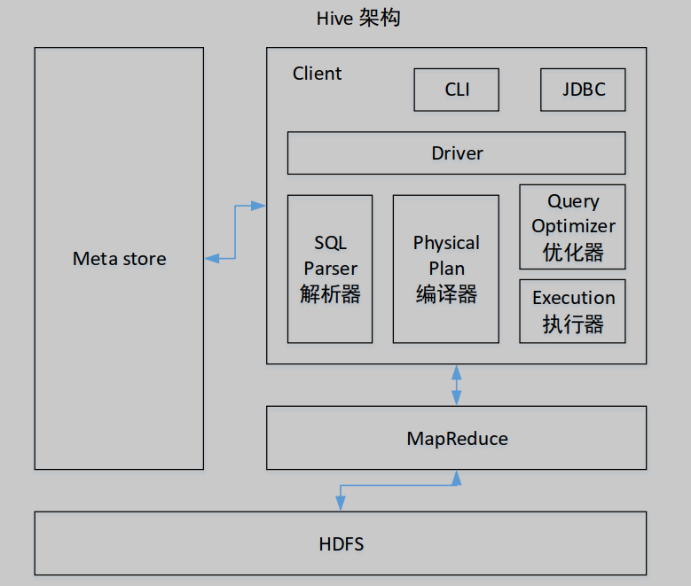
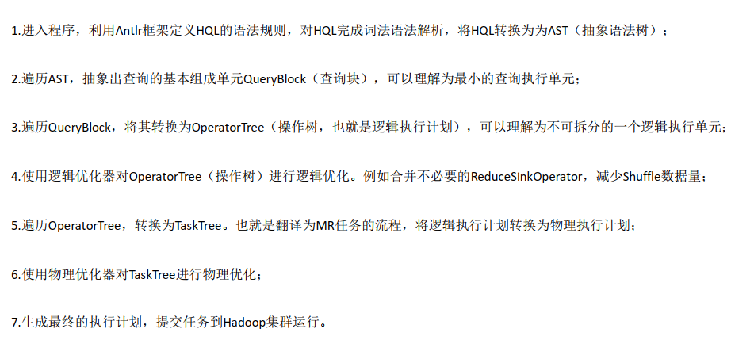
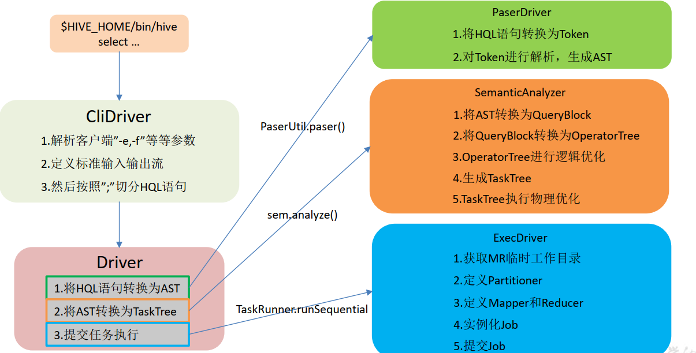
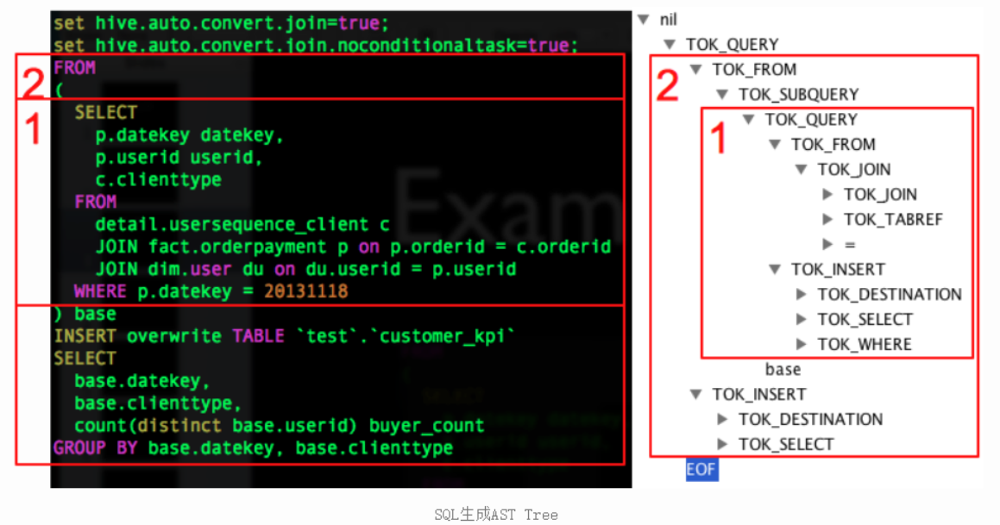

# HQL 是如何转换为 MR 任务的   

## Hive 的核心组成介绍  



1） 用户接口： 

Client
CLI（command-line interface）、 JDBC/ODBC(jdbc 访问 hive)、 WEBUI（浏览器访问 hive）

2） 元数据： Metastore
元数据包括：表名、表所属的数据库（默认是 default）、表的拥有者、列/分区字段、表
的类型（是否是外部表）、表的数据所在目录等；

默认存储在自带的 derby 数据库中，推荐使用 MySQL 存储 Metastore

3） Hadoop
使用 HDFS 进行存储，使用 MapReduce 进行计算。  

4） 驱动器： Driver

5） 解析器（ SQL Parser）
将 SQL 字符串转换成抽象语法树 AST，这一步一般都用第三方工具库完成，比如 antlr
对 AST 进行语法分析，比如表是否存在、字段是否存在、 SQL 语义是否有误。

6）编译器（ Physical Plan）
将 AST 编译生成逻辑执行计划。

7） 优化器（ Query Optimizer）
对逻辑执行计划进行优化。

8）执行器（ Execution）
把逻辑执行计划转换成可以运行的物理计划。对于 Hive 来说，就是 MR/Spark。  

## HQL 转换为 MR 任务流程说明  



# HQL 转换为 MR 源码详细解读  

## HQL 转换为 MR 源码整体流程介绍  



### 程序入口 — CliDriver  

众所周知，我们执行一个 HQL 语句通常有以下几种方式：

1） $HIVE_HOME/bin/hive 进入客户端，然后执行 HQL；

2） $HIVE_HOME/bin/hive -e “hql”；

3） $HIVE_HOME/bin/hive -f hive.sql；

4）先开启 hivesever2 服务端，然后通过 JDBC 方式连接远程提交 HQL。

可 以 知 道 我 们 执 行 HQL 主 要 依 赖 于 $HIVE_HOME/bin/hive 和 $HIVE_HOME/bin/
hivesever2 两种脚本来实现提交 HQL，而在这两个脚本中，最终启动的 JAVA 程序的主类为
“org.apache.hadoop.hive.cli.CliDriver”，所以其实 Hive 程序的入口就是“CliDriver”这个类。  

## HQL 的读取与参数解析  

找到“CliDriver”这个类的“main”方法  

```
public static void main(String[] args) throws Exception {
int ret = new CliDriver().run(args);
System.exit(ret);
}
```

### 主类的 run 方法  

```
public int run(String[] args) throws Exception {
OptionsProcessor oproc = new OptionsProcessor();
//解析系统参数
if (!oproc.process_stage1(args)) {
return 1;
}
... ...
CliSessionState ss = new CliSessionState(new
HiveConf(SessionState.class));
//标准输入输出以及错误输出流的定义,后续需要输入 HQL 以及打印控
ss.in = System.in;
try {
ss.out = new PrintStream(System.out, true, "UTF-8
ss.info = new PrintStream(System.err, true, "UTF-
ss.err = new CachingPrintStream(System.err, true,
} catch (UnsupportedEncodingException e) {
return 3;
}
//解析用户参数,包含"-e -f -v -database"等等
if (!oproc.process_stage2(ss)) {
return 2;
}
... ...
// execute cli driver work
try {
return executeDriver(ss, conf, oproc);
} finally {
ss.resetThreadName();
ss.close();
}
}
```

### executeDriver 方法  

```
private int executeDriver(CliSessionState ss, HiveConf conf,
OptionsProcessor oproc)
throws Exception {
CliDriver cli = new CliDriver();
cli.setHiveVariables(oproc.getHiveVariables());
// use the specified database if specified
cli.processSelectDatabase(ss);
// Execute -i init files (always in silent mode)
cli.processInitFiles(ss);
if (ss.execString != null) {
int cmdProcessStatus = cli.processLine(ss.execString);
return cmdProcessStatus;
}
... ...
setupConsoleReader();
———————————————————————————————————
更多 Java –大数据 –前端 –python 人工智能资料下载，可百度访问：尚硅谷官网
String line;
int ret = 0;
String prefix = "";
String curDB = getFormattedDb(conf, ss);
String curPrompt = prompt + curDB;
String dbSpaces = spacesForString(curDB);
//读取客户端的输入 HQL
while ((line = reader.readLine(curPrompt + "> ")) != null) {
if (!prefix.equals("")) {
prefix += '\n';
}
if (line.trim().startsWith("--")) {
continue;
} /
/以按照“;”分割的方式解析
if (line.trim().endsWith(";") && !line.trim().endsWith("\\;")) {
line = prefix + line;
ret = cli.processLine(line, true);
prefix = "";
curDB = getFormattedDb(conf, ss);
curPrompt = prompt + curDB;
dbSpaces = dbSpaces.length() == curDB.length() ? dbSpaces :
spacesForString(curDB);
} else {
prefix = prefix + line;
curPrompt = prompt2 + dbSpaces;
continue;
}
}
return ret;
}
```

### processLine 方法  

```
public int processLine(String line, boolean allowInterrupting) {
SignalHandler oldSignal = null;
Signal interruptSignal = null;
... ...
try {
int lastRet = 0, ret = 0;
// we can not use "split" function directly as ";" may be quoted
List<String> commands = splitSemiColon(line);
String command = "";
for (String oneCmd : commands) {
if (StringUtils.endsWith(oneCmd, "\\")) {
command += StringUtils.chop(oneCmd) + ";";
continue;
} else {
command += oneCmd;
}
if (StringUtils.isBlank(command)) {
continue;
} /
/解析单行 HQL
ret = processCmd(command);
command = "";
lastRet = ret;
boolean ignoreErrors = HiveConf.getBoolVar(conf,
HiveConf.ConfVars.CLIIGNOREERRORS);
if (ret != 0 && !ignoreErrors) {
return ret;
}
}
return lastRet;
} finally {
// Once we are done processing the line, restore the old handler
if (oldSignal != null && interruptSignal != null) {
Signal.handle(interruptSignal, oldSignal);
}
}
}
```

### processCmd 方法  

```
public int processCmd(String cmd) {
CliSessionState ss = (CliSessionState) SessionState.get();
... ...
//1.如果命令为"quit"或者"exit",则退出
if (cmd_trimmed.toLowerCase().equals("quit") ||
cmd_trimmed.toLowerCase().equals("exit")) {
// if we have come this far - either the previous commands
// are all successful or this is command line. in either case
// this counts as a successful run
ss.close();
System.exit(0);
//2.如果命令为"source"开头,则表示执行 HQL 文件,继续读取文件并解析
} else if (tokens[0].equalsIgnoreCase("source")) {
String cmd_1 = getFirstCmd(cmd_trimmed, tokens[0].length());
cmd_1 = new VariableSubstitution(new HiveVariableSource() {
@Override
public Map<String, String> getHiveVariable() {
return SessionState.get().getHiveVariables();
}
}).substitute(ss.getConf(), cmd_1);
File sourceFile = new File(cmd_1);
if (! sourceFile.isFile()){
console.printError("File: "+ cmd_1 + " is not a file.");
ret = 1;
} else {
try {
ret = processFile(cmd_1);
} catch (IOException e) {
console.printError("Failed processing file "+ cmd_1 +" "+
e.getLocalizedMessage(),
stringifyException(e));
ret = 1;
}
}
//3.如果命令以"!"开头,则表示用户需要执行 Linux 命令
} else if (cmd_trimmed.startsWith("!")) {
// for shell commands, use unstripped command
String shell_cmd = cmd.trim().substring(1);
shell_cmd = new VariableSubstitution(new HiveVariableSource() {
@Override
public Map<String, String> getHiveVariable() {
return SessionState.get().getHiveVariables();
}
}).substitute(ss.getConf(), shell_cmd);
// shell_cmd = "/bin/bash -c \'" + shell_cmd + "\'";
try {
ShellCmdExecutor executor = new ShellCmdExecutor(shell_cmd,
ss.out, ss.err);
ret = executor.execute();
if (ret != 0) {
console.printError("Command failed with exit code = " + ret);
}
} catch (Exception e) {
console.printError("Exception raised from Shell command " +
e.getLocalizedMessage(),
stringifyException(e));
ret = 1;
}
//4.以上三者都不是,则认为用户输入的为"select ..."正常的增删改查 HQL 语句,则进
行 HQL 解析
} else {
try {
try (CommandProcessor proc = CommandProcessorFactory.get(tokens,
(HiveConf) conf)) {
if (proc instanceof IDriver) {
// Let Driver strip comments using sql parser
ret = processLocalCmd(cmd, proc, ss);
} else {
ret = processLocalCmd(cmd_trimmed, proc, ss);
}
}
} catch (SQLException e) {
console.printError("Failed processing command " + tokens[0] + " "
+ e.getLocalizedMessage(),
org.apache.hadoop.util.StringUtils.stringifyException(e));
ret = 1;
}
catch (Exception e) {
throw new RuntimeException(e);
}
}
ss.resetThreadName();
return ret;
}
```

### processLocalCmd 方法  

```
int processLocalCmd(String cmd, CommandProcessor proc, CliSessionS
ss) {
boolean escapeCRLF = HiveConf.getBoolVar(conf,
HiveConf.ConfVars.HIVE_CLI_PRINT_ESCAPE_CRLF);
int ret = 0;
if (proc != null) {
if (proc instanceof IDriver) {
IDriver qp = (IDriver) proc;
PrintStream out = ss.out;
//获取系统时间作为开始时间,以便后续计算 HQL 执行时长
long start = System.currentTimeMillis();
if (ss.getIsVerbose()) {
out.println(cmd);
}
//HQL 执行的核心方法
ret = qp.run(cmd).getResponseCode();
if (ret != 0) {
qp.close();
return ret;
}
// query has run capture the time
//获取系统时间作为结束时间,以便后续计算 HQL 执行时长
long end = System.currentTimeMillis();
double timeTaken = (end - start) / 1000.0;
ArrayList<String> res = new ArrayList<String>();
//打印头信息
printHeader(qp, out);
// print the results,包含结果集并获取抓取到数据的条数
int counter = 0;
try {
if (out instanceof FetchConverter) {
((FetchConverter) out).fetchStarted();
}
while (qp.getResults(res)) {
for (String r : res) {
if (escapeCRLF) {
r = EscapeCRLFHelper.escapeCRLF(r);
}
out.println(r);
}
counter += res.size();
res.clear();
if (out.checkError()) {
break;
}
}
} catch (IOException e) {
console.printError("Failed with exception " +
e.getClass().getName() + ":" + e.getMessage(),
"\n" +
org.apache.hadoop.util.StringUtils.stringifyException(e));
ret = 1;
}
qp.close();
if (out instanceof FetchConverter) {
((FetchConverter) out).fetchFinished();
}
//打印 HQL 执行时间以及抓取数据的条数（经常使用 Hive 的同学是否觉得这句很熟悉
呢，其实就是执行完一个 HQL 最后打印的那句话）
console.printInfo(
"Time taken: " + timeTaken + " seconds" + (counter == 0 ? "" :
", Fetched: " + counter + " row(s)"));
} else {
String firstToken = tokenizeCmd(cmd.trim())[0];
String cmd_1 = getFirstCmd(cmd.trim(), firstToken.length());
if (ss.getIsVerbose()) {
ss.out.println(firstToken + " " + cmd_1);
}
CommandProcessorResponse res = proc.run(cmd_1);
if (res.getResponseCode() != 0) {
ss.out
.println("Query returned non-zero code: " +
res.getResponseCode() + ", cause: " + res.getErrorMessage());
}
if (res.getConsoleMessages() != null) {
for (String consoleMsg : res.getConsoleMessages()) {
console.printInfo(consoleMsg);
}
}
ret = res.getResponseCode();
}
}
return ret;
}
```

### qp.run(cmd)方法  

点击进入“ run” 方法，该方法为 IDriver 接口的抽象方法，此处实际调用的是
“org.apache.hadoop.hive.ql.Driver”类中的“run” 方法，找到“Driver”类中的“run” 方法。  

```
public CommandProcessorResponse run(String command) {
return run(command, false);
}
public CommandProcessorResponse run(String command, boolean
alreadyCompiled) {
try {
runInternal(command, alreadyCompiled);
return createProcessorResponse(0);
} catch (CommandProcessorResponse cpr) {
... ...
}
}
```

runInternal 方法  

```
private void runInternal(String command, boolean alreadyCompil
throws CommandProcessorResponse {
errorMessage = null;
SQLState = null;
downstreamError = null;
LockedDriverState.setLockedDriverState(lDrvState);
lDrvState.stateLock.lock();
... ...
PerfLogger perfLogger = null;
if (!alreadyCompiled) {
// compile internal will automatically reset the perf log
//1.编译 HQL 语句
compileInternal(command, true);
// then we continue to use this perf logger
perfLogger = SessionState.getPerfLogger();
}
... ...
try {
//2.执行
execute();
} catch (CommandProcessorResponse cpr) {
rollback(cpr);
throw cpr;
}
isFinishedWithError = false;
}
}
```

## HQL 生成 AST（抽象语法树）  

### compileInternal 方法  

```
private void compileInternal(String command, boolean deferClose) throws
CommandProcessorResponse {
Metrics metrics = MetricsFactory.getInstance();
if (metrics != null) {
metrics.incrementCounter(MetricsConstant.WAITING_COMPILE_OPS, 1);
}
… …
if (compileLock == null) {
throw
createProcessorResponse(ErrorMsg.COMPILE_LOCK_TIMED_OUT.getErrorCode());
}
try {
compile(command, true, deferClose);
} catch (CommandProcessorResponse cpr) {
try {
releaseLocksAndCommitOrRollback(false);
} catch (LockException e) {
LOG.warn("Exception in releasing locks. " +
org.apache.hadoop.util.StringUtils.stringifyException(e));
}
throw cpr;
}
}
```

### compile 方法  

```
private void compile(String command, boolean resetTaskIds, boolean
deferClose) throws CommandProcessorResponse {
PerfLogger perfLogger = SessionState.getPerfLogger(true);
perfLogger.PerfLogBegin(CLASS_NAME, PerfLogger.DRIVER_RUN);
perfLogger.PerfLogBegin(CLASS_NAME, PerfLogger.COMPILE);
lDrvState.stateLock.lock();
... ...
//HQL 生成 AST
ASTNode tree;
try {
tree = ParseUtils.parse(command, ctx);
} catch (ParseException e) {
parseError = true;
throw e;
} finally {
hookRunner.runAfterParseHook(command, parseError);
}
}
```

### parse 方法  

```
/** Parses the Hive query. */
public static ASTNode parse(String command, Context ctx) throws
ParseException {
return parse(command, ctx, null);
}
```

```
public static ASTNode parse(
String command, Context ctx, String viewFullyQualifiedName) throws
ParseException {
ParseDriver pd = new ParseDriver();
ASTNode tree = pd.parse(command, ctx, viewFullyQualifiedName);
tree = findRootNonNullToken(tree);
handleSetColRefs(tree);
return tree;
}
```

```
public ASTNode parse(String command, Context ctx, String
viewFullyQualifiedName)
throws ParseException {
if (LOG.isDebugEnabled()) {
LOG.debug("Parsing command: " + command);
}
//1.构建词法解析器
HiveLexerX lexer = new HiveLexerX(new
ANTLRNoCaseStringStream(command));
//2.将 HQL 中的关键词替换为 Token
TokenRewriteStream tokens = new TokenRewriteStream(lexer);
if (ctx != null) {
if (viewFullyQualifiedName == null) {
// Top level query
ctx.setTokenRewriteStream(tokens);
} else {
// It is a view
ctx.addViewTokenRewriteStream(viewFullyQualifiedName, tokens);
}
lexer.setHiveConf(ctx.getConf());
}
```

说明： Antlr 框架。 Hive 使用 Antlr 实现 SQL 的词法和语法解析。 Antlr 是一种语言识别
的工具，可以用来构造领域语言。 这里不详细介绍 Antlr，只需要了解使用 Antlr 构造特定
的语言只需要编写一个语法文件，定义词法和语法替换规则即可， Antlr 完成了词法分析、
语法分析、语义分析、中间代码生成的过程。
Hive 中语法规则的定义文件在 0.10 版本以前是 Hive.g 一个文件，随着语法规则越来越
复杂，由语法规则生成的 Java 解析类可能超过 Java 类文件的最大上限， 0.11 版本将 Hive.g
拆成了 5 个文件，词法规则 HiveLexer.g 和语法规则的 4 个文件 SelectClauseParser.g，
FromClauseParser.g， IdentifiersParser.g， HiveParser.g。  

```
HiveParser parser = new HiveParser(tokens);
if (ctx != null) {
parser.setHiveConf(ctx.getConf());
}
parser.setTreeAdaptor(adaptor);
HiveParser.statement_return r = null;
try {
//3.进行语法解析，生成最终的 AST
r = parser.statement();
} catch (RecognitionException e) {
e.printStackTrace();
throw new ParseException(parser.errors);
}
if (lexer.getErrors().size() == 0 && parser.errors.size() == 0) {
LOG.debug("Parse Completed");
} else if (lexer.getErrors().size() != 0) {
throw new ParseException(lexer.getErrors());
} else {
throw new ParseException(parser.errors);
}
ASTNode tree = (ASTNode) r.getTree();
tree.setUnknownTokenBoundaries();
return tree;
}
```

说明：例如 HQL 语句为：  

```
FROM
(
SELECT
p.datekey datekey,
p.userid userid,
c.clienttype
FROM
detail.usersequence_client c
JOIN fact.orderpayment p ON p.orderid = c.orderid
JOIN default.user du ON du.userid = p.userid
WHERE p.datekey = 20131118
) base
INSERT OVERWRITE TABLE `test`.`customer_kpi`
SELECT
base.datekey,
base.clienttype,
count(distinct base.userid) buyer_count
GROUP BY base.datekey, base.clienttype
```

生成对应的 AST（抽象语法树）为：  



## 对 AST 进一步解析  

接下来的步骤包括：

1）将 AST 转换为 QueryBlock 进一步转换为 OperatorTree；

2） 对 OperatorTree 进行逻辑优化（LogicalOptimizer）；  

3）将 OperatorTree 转换为 TaskTree（任务树）；

4）对 TaskTree 进行物理优化（ PhysicalOptimizer）。

之所以将这 4 个步骤写在一起，是因为这几个步骤在源码中存在于一个方法中。  

### compile 方法  

```
private void compile(String command, boolean resetTaskIds, boolean
deferClose) throws CommandProcessorResponse {
PerfLogger perfLogger = SessionState.getPerfLogger(true);
perfLogger.PerfLogBegin(CLASS_NAME, PerfLogger.DRIVER_RUN);
perfLogger.PerfLogBegin(CLASS_NAME, PerfLogger.COMPILE);
lDrvState.stateLock.lock();
... ...
//HQL 生成 AST
ASTNode tree;
try {
tree = ParseUtils.parse(command, ctx);
} catch (ParseException e) {
parseError = true;
throw e;
} finally {
hookRunner.runAfterParseHook(command, parseError);
}
// Do semantic analysis and plan generation
BaseSemanticAnalyzer sem = SemanticAnalyzerFactory.get(queryState,
tree);
if (!retrial) {
openTransaction();
generateValidTxnList();
}
//进一步解析抽象语法树
sem.analyze(tree, ctx);
}
```

### analyze 方法  

```
public void analyze(ASTNode ast, Context ctx) throws
SemanticException {
initCtx(ctx);
init(true);
analyzeInternal(ast);
}
```

### analyzeInternal 方法  

```
public abstract void analyzeInternal(ASTNode ast) throws
SemanticException;
```

此方法为“ org.apache.hadoop.hive.ql.parse.BaseSemanticAnalyzer”抽象类的抽象方法，
我们进入实现类“ org.apache.hadoop.hive.ql.parse.SemanticAnalyzer”的 analyzeInternal 方法。  

```
public void analyzeInternal(ASTNode ast) throws SemanticException {
analyzeInternal(ast, new PlannerContextFactory() {
@Override
public PlannerContext create() {
return new PlannerContext();
}
});
}
```

### 继续调用重载的 analyzeInternal 方法  

```
void analyzeInternal(ASTNode ast, PlannerContextFactory pcf) throws
SemanticException {
LOG.info("Starting Semantic Analysis");
// 1. Generate Resolved Parse tree from syntax tree
boolean needsTransform = needsTransform();
//change the location of position alias process here
processPositionAlias(ast);
PlannerContext plannerCtx = pcf.create();
//处理 AST，转换为 QueryBlock
if (!genResolvedParseTree(ast, plannerCtx)) {
return;
}
... ...
// 2. Gen OP Tree from resolved Parse Tree
Operator sinkOp = genOPTree(ast, plannerCtx);
// 3. Deduce Resultset Schema:定义输出数据的 Schema
… …
// 4. Generate Parse Context for Optimizer & Physical compiler
copyInfoToQueryProperties(queryProperties);
ParseContext pCtx = new ParseContext(queryState, opToPartPruner,
opToPartList, topOps,
new HashSet<JoinOperator>(joinContext.keySet()),
new HashSet<SMBMapJoinOperator>(smbMapJoinContext.keySet()),
loadTableWork, loadFileWork, columnStatsAutoGatherContexts, ctx
idToTableNameMap, destTableId, uCtx,
listMapJoinOpsNoReducer, prunedPartitions, tabNameToTabObject,
opToSamplePruner,
globalLimitCtx, nameToSplitSample, inputs, rootTasks,
opToPartToSkewedPruner,
viewAliasToInput,
reduceSinkOperatorsAddedByEnforceBucketingSorting,
analyzeRewrite, tableDesc, createVwDesc,
materializedViewUpdateDesc,
queryProperties, viewProjectToTableSchema, acidFileSinks);
... ...
// 5. Take care of view creation：处理视图相关
… …
// 6. Generate table access stats if required
if (HiveConf.getBoolVar(this.conf,
HiveConf.ConfVars.HIVE_STATS_COLLECT_TABLEKEYS)) {
TableAccessAnalyzer tableAccessAnalyzer = new
TableAccessAnalyzer(pCtx);
setTableAccessInfo(tableAccessAnalyzer.analyzeTableAccess());
}
// 7. Perform Logical optimization：对操作树执行逻辑优化
if (LOG.isDebugEnabled()) {
LOG.debug("Before logical optimization\n" +
Operator.toString(pCtx.getTopOps().values()));
} /
/创建优化器
Optimizer optm = new Optimizer();
optm.setPctx(pCtx);
optm.initialize(conf);
//执行优化
pCtx = optm.optimize();
if (pCtx.getColumnAccessInfo() != null) {
// set ColumnAccessInfo for view column authorization
setColumnAccessInfo(pCtx.getColumnAccessInfo());
}
if (LOG.isDebugEnabled()) {
LOG.debug("After logical optimization\n" +
Operator.toString(pCtx.getTopOps().values()));
}
// 8. Generate column access stats if required - wait until column
pruning
// takes place during optimization
boolean isColumnInfoNeedForAuth =
SessionState.get().isAuthorizationModeV2()
&& HiveConf.getBoolVar(conf,
HiveConf.ConfVars.HIVE_AUTHORIZATION_ENABLED);
if (isColumnInfoNeedForAuth
|| HiveConf.getBoolVar(this.conf,
HiveConf.ConfVars.HIVE_STATS_COLLECT_SCANCOLS)) {
ColumnAccessAnalyzer columnAccessAnalyzer = new
ColumnAccessAnalyzer(pCtx);
// view column access info is carried by
this.getColumnAccessInfo().
setColumnAccessInfo(columnAccessAnalyzer.analyzeColumnAccess(this.getColu
mnAccessInfo()));
}
// 9. Optimize Physical op tree & Translate to target execution
engine (MR,
// TEZ..)：执行物理优化
if (!ctx.getExplainLogical()) {
TaskCompiler compiler = TaskCompilerFactory.getCompiler(conf,
pCtx);
compiler.init(queryState, console, db);
//compile 为抽象方法，对应的实现类分别为 MapReduceCompiler、 TezCompiler 和
SparkCompiler
compiler.compile(pCtx, rootTasks, inputs, outputs);
fetchTask = pCtx.getFetchTask();
}
//find all Acid FileSinkOperatorS
QueryPlanPostProcessor qp = new QueryPlanPostProcessor(rootTasks,
acidFileSinks, ctx.getExecutionId());
// 10. Attach CTAS/Insert-Commit-hooks for Storage Handlers
... ...
LOG.info("Completed plan generation");
// 11. put accessed columns to readEntity
if (HiveConf.getBoolVar(this.conf,
HiveConf.ConfVars.HIVE_STATS_COLLECT_SCANCOLS)) {
putAccessedColumnsToReadEntity(inputs, columnAccessInfo);
}
if (isCacheEnabled && lookupInfo != null) {
if (queryCanBeCached()) {
QueryResultsCache.QueryInfo queryInfo =
createCacheQueryInfoForQuery(lookupInfo);
// Specify that the results of this query can be cached.
setCacheUsage(new CacheUsage(
CacheUsage.CacheStatus.CAN_CACHE_QUERY_RESULTS, queryInfo)
}
}
}
```

### 提交任务并执行  （接  runInternal 方法继续往下  ）

```
//2.执行
execute();
```

### execute 方法  

```
private void execute() throws CommandProcessorResponse {
PerfLogger perfLogger = SessionState.getPerfLogger();
perfLogger.PerfLogBegin(CLASS_NAME, PerfLogger.DRIVER_EXECUTE);
... ...
//1.构建任务：根据任务树构建 MrJob
setQueryDisplays(plan.getRootTasks());
int mrJobs = Utilities.getMRTasks(plan.getRootTasks()).size();
int jobs = mrJobs +
Utilities.getTezTasks(plan.getRootTasks()).size()
+ Utilities.getSparkTasks(plan.getRootTasks()).size();
if (jobs > 0) {
logMrWarning(mrJobs);
console.printInfo("Query ID = " + queryId);
console.printInfo("Total jobs = " + jobs);
}
perfLogger.PerfLogBegin(CLASS_NAME, PerfLogger.RUN_TASKS);
// Loop while you either have tasks running, or tasks queued up
while (driverCxt.isRunning()) {
// Launch upto maxthreads tasks
Task<? extends Serializable> task;
while ((task = driverCxt.getRunnable(maxthreads)) != null) {
//2.启动任务
TaskRunner runner = launchTask(task, queryId, noName, jobname,
jobs, driverCxt);
if (!runner.isRunning()) {
break;
}
}
... ...
//打印结果中最后的 OK
if (console != null) {
console.printInfo("OK");
}
}
```

### launchTask 方法  

```
private TaskRunner launchTask(Task<? extends Serializable> tsk, String
queryId, boolean noName,
String jobname, int jobs, DriverContext cxt) throws HiveException {
if (SessionState.get() != null) {
SessionState.get().getHiveHistory().startTask(queryId, tsk,
tsk.getClass().getName());
}
if (tsk.isMapRedTask() && !(tsk instanceof ConditionalTask)) {
if (noName) {
conf.set(MRJobConfig.JOB_NAME, jobname + " (" + tsk.getId() +
")");
}
conf.set(DagUtils.MAPREDUCE_WORKFLOW_NODE_NAME, tsk.getId());
Utilities.setWorkflowAdjacencies(conf, plan);
cxt.incCurJobNo(1);
console.printInfo("Launching Job " + cxt.getCurJobNo() + " out of "
+ jobs);
}
tsk.initialize(queryState, plan, cxt, ctx.getOpContext());
TaskRunner tskRun = new TaskRunner(tsk);
//添加启动任务
cxt.launching(tskRun);
// Launch Task：根据是否可以并行来决定是否并行启动 Task
if (HiveConf.getBoolVar(conf, HiveConf.ConfVars.EXECPARALLEL) &&
tsk.canExecuteInParallel()) {
// Launch it in the parallel mode, as a separate thread only for MR
tasks
if (LOG.isInfoEnabled()){
LOG.info("Starting task [" + tsk + "] in parallel");
}
//可并行任务启动,实际上还是执行 tskRun.runSequential();
tskRun.start();
} else {
if (LOG.isInfoEnabled()){
LOG.info("Starting task [" + tsk + "] in serial mode");
}
//不可并行任务,则按照序列顺序执行任务
tskRun.runSequential();
}
return tskRun;
}
```

### runSequential 方法  

```
public void runSequential() {
int exitVal = -101;
try {
exitVal = tsk.executeTask(ss == null ? null : ss.getHiveHistory()
} catch (Throwable t) {
if (tsk.getException() == null) {
tsk.setException(t);
}
LOG.error("Error in executeTask", t);
}
result.setExitVal(exitVal);
if (tsk.getException() != null) {
result.setTaskError(tsk.getException());
}
}
```

## executeTask 方法  

```
public int executeTask(HiveHistory hiveHistory) {
try {
this.setStarted();
if (hiveHistory != null) {
hiveHistory.logPlanProgress(queryPlan);
}
int retval = execute(driverContext);
this.setDone();
if (hiveHistory != null) {
hiveHistory.logPlanProgress(queryPlan);
}
return retval;
} catch (IOException e) {
throw new RuntimeException("Unexpected error: " + e.getMessage(),
e);
}
}
```

### execute 方法  

```
protected abstract int execute(DriverContext driverContext);
```

此时我们进入了一个抽象“org.apache.hadoop.hive.ql.exec.Task”的“execute”方法，我
则 需 要 找 到 一 个 实 现 类 的 “ execute ” 方 法 ， 此 处 我 选 择
rg.apache.hadoop.hive.ql.exec.mr.MapRedTask”这个类。  

```
public int execute(DriverContext driverContext) {
Context ctx = driverContext.getCtx();
boolean ctxCreated = false;
try {
... ...
if (!runningViaChild) {
// since we are running the mapred task in the same jvm, we should
update the job conf
// in ExecDriver as well to have proper local properties.
if (this.isLocalMode()) {
// save the original job tracker
ctx.setOriginalTracker(ShimLoader.getHadoopShims().getJobLauncherRpcAddre
ss(job));
// change it to local
ShimLoader.getHadoopShims().setJobLauncherRpcAddress(job,
"local");
}
// we are not running this mapred task via child jvm
// so directly invoke ExecDriver
//设置 MR 任务的 InputFormat、 OutputFormat 等等这些 MRJob 的执行类
int ret = super.execute(driverContext);
// restore the previous properties for framework name, RM address
etc.
if (this.isLocalMode()) {
// restore the local job tracker back to original
ctx.restoreOriginalTracker();
}
return ret;
}
... ...
//构建执行 MR 任务的命令
String isSilent = "true".equalsIgnoreCase(System
.getProperty("test.silent")) ? "-nolog" : "";
String jarCmd = hiveJar + " " + ExecDriver.class.getName() +
libJarsOption;
String cmdLine = hadoopExec + " jar " + jarCmd + " -plan "
+ planPath.toString() + " " + isSilent + " " + hiveConfArgs;
... ...
// Run ExecDriver in another JVM
executor = Runtime.getRuntime().exec(cmdLine, env, new
File(workDir));
}
```

