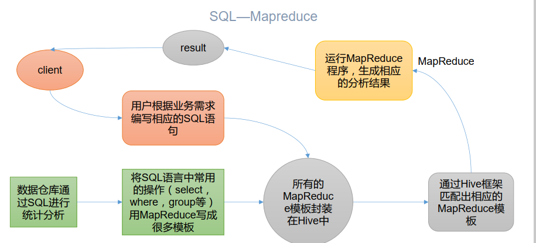
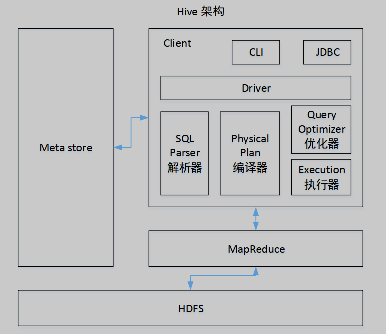
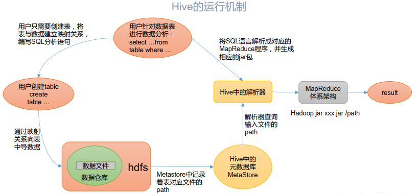
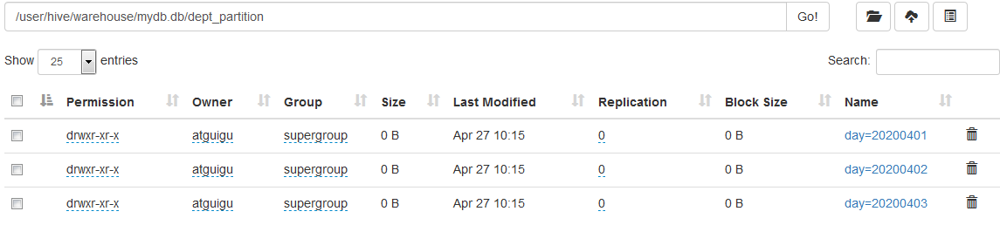

官方文档：https://cwiki.apache.org/confluence/display/Hive/Home


GitHub：https://github.com/apache/hive


# 第 1 章 Hive 基本概念

## 1.1 什么是 Hive

1） hive 简介
Hive：由 Facebook 开源用于解决海量结构化日志的数据统计工具。
Hive 是基于 Hadoop 的一个数据仓库工具，可以将结构化的数据文件映射为一张表，并
提供类 SQL 查询功能。

2） Hive 本质：将 HQL 转化成 MapReduce 程序  



（1） Hive 处理的数据存储在 HDFS

（2） Hive 分析数据底层的实现是 MapReduce

（3） 执行程序运行在 Yarn 上  

## 1.2Hive 的优缺点

1.2.1 优点

（1） 操作接口采用类 SQL 语法，提供快速开发的能力（简单、容易上手）  

（2） 避免了去写 MapReduce，减少开发人员的学习成本。

（3） Hive 的执行延迟比较高，因此 Hive 常用于数据分析，对实时性要求不高的场合。

（4） Hive 优势在于处理大数据，对于处理小数据没有优势，因为 Hive 的执行延迟比较
高。

（5） Hive 支持用户自定义函数，用户可以根据自己的需求来实现自己的函数  

1.2.2 缺点

1） Hive 的 HQL 表达能力有限

（1）迭代式算法无法表达

（2）数据挖掘方面不擅长， 由于 MapReduce 数据处理流程的限制，效率更高的算法却
无法实现。

2） Hive 的效率比较低

（1） Hive 自动生成的 MapReduce 作业，通常情况下不够智能化

（2） Hive 调优比较困难，粒度较粗

## 1.3 Hive 架构原理  



### 1） 用户接口： Client

CLI（command-line interface）、 JDBC/ODBC(jdbc 访问 hive)、 WEBUI（浏览器访问 hive）  

### 2） 元数据： Metastore

元数据包括：表名、表所属的数据库（默认是 default）、表的拥有者、列/分区字段、
表的类型（是否是外部表）、表的数据所在目录等；

默认存储在自带的 derby 数据库中，推荐使用 MySQL 存储 Metastore

### 3） Hadoop

使用 HDFS 进行存储，使用 MapReduce 进行计算。

### 4） 驱动器： Driver

（1）解析器（SQL Parser）：将 SQL 字符串转换成抽象语法树 AST，这一步一般都用第
三方工具库完成，比如 antlr；对 AST 进行语法分析，比如表是否存在、字段是否存在、 SQL
语义是否有误。

（2）编译器（Physical Plan）：将 AST 编译生成逻辑执行计划。

（3）优化器（Query Optimizer）：对逻辑执行计划进行优化。

（4）执行器（Execution）：把逻辑执行计划转换成可以运行的物理计划。对于 Hive 来
说， 就是 MR/Spark  



Hive 通过给用户提供的一系列交互接口，接收到用户的指令(SQL)，使用自己的 Driver，
结合元数据(MetaStore)，将这些指令翻译成 MapReduce，提交到 Hadoop 中执行，最后，将
执行返回的结果输出到用户交互接口。

## 1.4 Hive 和数据库比较

由于 Hive 采用了类似 SQL 的查询语言 HQL(Hive Query Language)， 因此很容易将 Hive 理解为数据库。其实从结构上来看， Hive 和数据库除了拥有类似的查询语言，再无类似之处。
本文将从多个方面来阐述 Hive 和数据库的差异。数据库可以用在 Online 的应用中，但是
Hive 是为数据仓库而设计的，清楚这一点，有助于从应用角度理解 Hive 的特性。

### 1.4.1 查询语言

由于 SQL 被广泛的应用在数据仓库中，因此，专门针对 Hive 的特性设计了类 SQL 的查
询语言 HQL。熟悉 SQL 开发的开发者可以很方便的使用 Hive 进行开发。    

### 1.4.2 数据更新

由于 Hive 是针对数据仓库应用设计的，而数据仓库的内容是读多写少的。 因此， Hive 中
不建议对数据的改写，所有的数据都是在加载的时候确定好的。 而数据库中的数据通常是需
要经常进行修改的，因此可以使用 INSERT INTO … VALUES 添加数据，使用 UPDATE … SET 修
改数据。

### 1.4.3 执行延迟

Hive 在查询数据的时候，由于没有索引，需要扫描整个表，因此延迟较高。另外一个导
致 Hive 执行延迟高的因素是 MapReduce 框架。由于 MapReduce 本身具有较高的延迟，因此
在利用 MapReduce 执行 Hive 查询时，也会有较高的延迟。相对的，数据库的执行延迟较低。
当然，这个低是有条件的，即数据规模较小，当数据规模大到超过数据库的处理能力的时候，
Hive 的并行计算显然能体现出优势。

### 1.4.4 数据规模

由于 Hive 建立在集群上并可以利用 MapReduce 进行并行计算，因此可以支持很大规模
的数据；对应的，数据库可以支持的数据规模较小。  

# 第 2 章 Hive 安装  

2.1 Hive 安装地址

1） Hive 官网地址
http://hive.apache.org/

2） 文档查看地址
https://cwiki.apache.org/confluence/display/Hive/GettingStarted

3） 下载地址  

http://archive.apache.org/dist/hive/

4） github 地址
https://github.com/apache/hive

## 2.2Hive 安装部署

### 2.2.1 安装 Hive

1） 把 apache-hive-3.1.2-bin.tar.gz 上传到 linux 的/opt/software 目录下

2） 解压 apache-hive-3.1.2-bin.tar.gz 到/opt/module/目录下面

```
[atguigu@hadoop102 software]$ tar -zxvf /opt/software/apache-hive-3.1.2-
bin.tar.gz -C /opt/module/
```

3） 修改 apache-hive-3.1.2-bin.tar.gz 的名称为 hive

```
[atguigu@hadoop102 software]$ mv /opt/module/apache-hive-3.1.2-bin/
/opt/module/hive
```

4） 修改/etc/profile.d/my_env.sh， 添加环境变量

```
[atguigu@hadoop102 software]$ sudo vim /etc/profile.d/my_env.sh  
```

4） 修改/etc/profile.d/my_env.sh， 添加环境变量

```
[atguigu@hadoop102 software]$ sudo vim /etc/profile.d/my_env.sh
```

5） 添加内容

```
#HIVE_HOME
export HIVE_HOME=/opt/module/hive
export PATH=$PATH:$HIVE_HOME/bin
```

6） 解决日志 Jar 包冲突

```
[atguigu@hadoop102 software]$ mv $HIVE_HOME/lib/log4j-slf4j-impl-
2.10.0.jar $HIVE_HOME/lib/log4j-slf4j-impl-2.10.0.bak
```

7）初始化元数据库

```
[atguigu@hadoop102 hive]$ bin/schematool -dbType derby -initSchema  
```

2.2.2 启动并使用 Hive

1）启动 Hive

```
[atguigu@hadoop102 hive]$ bin/hive
```

2）使用 Hive

```
hive> show databases;

hive> show tables;

hive> create table test(id int);

hive> insert into test values(1);

hive> select * from test;
```

3）在 CRT 窗口中开启另一个窗口开启 Hive，在/tmp/atguigu 目录下监控 hive.log 文件

```
Caused by: ERROR XSDB6: Another instance of Derby may have already booted
the database /opt/module/hive/metastore_db.
at
org.apache.derby.iapi.error.StandardException.newException(Unknown
Source)
at
org.apache.derby.iapi.error.StandardException.newException(UnknownSource)
at
org.apache.derby.impl.store.raw.data.BaseDataFileFactory.privGetJBMSLockO
nDB(Unknown Source)
at
org.apache.derby.impl.store.raw.data.BaseDataFileFactory.run(Unknown
Source)
...  
```

**原因在于 Hive 默认使用的元数据库为 derby，开启 Hive 之后就会占用元数据库， 且不与
其他客户端共享数据， 所以我们需要将 Hive 的元数据地址改为 MySQL。**  

## 2.3MySQL 安装  

## 2.4 Hive 元数据配置到 MySQL  

2.4.1 拷贝驱动

将 MySQL 的 JDBC 驱动拷贝到 Hive 的 lib 目录下

```
[atguigu@hadoop102 software]$ cp /opt/software/mysql-connector-java-
5.1.37.jar $HIVE_HOME/lib
```

2.4.2 配置 Metastore 到 MySQL

1） 在$HIVE_HOME/conf 目录下新建 hive-site.xml 文件

```
[atguigu@hadoop102 software]$ vim $HIVE_HOME/conf/hive-site.xml
```

添加如下内容  

```
<?xml version="1.0"?>
<?xml-stylesheet type="text/xsl" href="configuration.xsl"?>
<configuration>
<!-- jdbc 连接的 URL -->
<property>
<name>javax.jdo.option.ConnectionURL</name>
<value>jdbc:mysql://hadoop102:3306/metastore?useSSL=false</value>
</property>
<!-- jdbc 连接的 Driver-->
<property>
<name>javax.jdo.option.ConnectionDriverName</name>
<value>com.mysql.jdbc.Driver</value>
</property>
<!-- jdbc 连接的 username-->
<property>
<name>javax.jdo.option.ConnectionUserName</name>
<value>root</value>
</property>
<!-- jdbc 连接的 password -->
<property>
<name>javax.jdo.option.ConnectionPassword</name>
<value>000000</value>
</property>
<!-- Hive 元数据存储版本的验证 -->
<property>
<name>hive.metastore.schema.verification</name>
<value>false</value>
</property>
<!--元数据存储授权-->
<property>
<name>hive.metastore.event.db.notification.api.auth</name>
<value>false</value>
</property>
<!-- Hive 默认在 HDFS 的工作目录 -->
<property>
<name>hive.metastore.warehouse.dir</name>
<value>/user/hive/warehouse</value>
</property>
</configuration>
```

2） 登陆 MySQL

```
[atguigu@hadoop102 software]$ mysql -uroot -p000000
```

3） 新建 Hive 元数据库

```
mysql> create database metastore;
mysql> quit;
```

4） 初始化 Hive 元数据库

```
[atguigu@hadoop102 software]$ schematool -initSchema -dbType mysql -verbose  
```

2.4.3 再次启动 Hive  

## 2.5 使用元数据服务的方式访问 Hive  

1） 在 hive-site.xml 文件中添加如下配置信息

```
<!-- 指定存储元数据要连接的地址 -->
<property>
<name>hive.metastore.uris</name>
<value>thrift://hadoop102:9083</value>
</property>
```

2） 启动 metastore

```
[atguigu@hadoop202 hive]$ hive --service metastore
2020-04-24 16:58:08: Starting Hive Metastore Server
```

注意: 启动后窗口不能再操作，需打开一个新的 shell 窗口做别的操作

3） 启动 hive

```
[atguigu@hadoop202 hive]$ bin/hive  
```

## 2.6 使用 JDBC 方式访问 Hive  

1） 在 hive-site.xml 文件中添加如下配置信息  

```
<!-- 指定 hiveserver2 连接的 host -->
<property>
<name>hive.server2.thrift.bind.host</name>
<value>hadoop102</value>
</property>
<!-- 指定 hiveserver2 连接的端口号 -->
<property>
<name>hive.server2.thrift.port</name>
<value>10000</value>
</property>
```

2）启动 hiveserver2

```
[atguigu@hadoop102 hive]$ bin/hive --service hiveserver2
```

3） 启动 beeline 客户端（需要多等待一会）

```
[atguigu@hadoop102 hive]$ bin/beeline -u jdbc:hive2://hadoop102:10000 -n
atguigu  
```

## 2.7 Hive 常用交互命令  

## 2.8 Hive 其他命令操作  

## 2.9 Hive 常见属性配置  

2.9.1 Hive 运行日志信息配置

1） Hive 的 log 默认存放在/tmp/atguigu/hive.log 目录下（当前用户名下）

2） 修改 hive 的 log 存放日志到/opt/module/hive/logs

（1） 修改/opt/module/hive/conf/hive-log4j2.properties.template 文件名称为
hive-log4j2.properties  

```
[atguigu@hadoop102 conf]$ pwd
/opt/module/hive/conf
[atguigu@hadoop102 conf]$ mv hive-log4j2.properties.template hivelog4j2.properties
```

（2） 在 hive-log4j2.properties 文件中修改 log 存放位置  

```
hive.log.dir=/opt/module/hive/logs
```

2.9.2 打印 当前库 和 表头

在 hive-site.xml 中加入如下两个配置:  

```
<property>
<name>hive.cli.print.header</name>
<value>true</value>
</property>
<property>
<name>hive.cli.print.current.db</name>
<value>true</value>
</property>
```

2.9.3 参数配置方式

1） 查看当前所有的配置信息  

```
hive>set;
```

2） 参数的配置三种方式

（1） 配置文件方式

默认配置文件： hive-default.xml

用户自定义配置文件： hive-site.xml

注意： 用户自定义配置会覆盖默认配置。 另外， Hive 也会读入 Hadoop 的配置， 因为 Hive
是作为 Hadoop 的客户端启动的， Hive 的配置会覆盖 Hadoop 的配置。配置文件的设定对本
机启动的所有 Hive 进程都有效。

（2）命令行参数方式

启动 Hive 时，可以在命令行添加-hiveconf param=value 来设定参数  

例如：  

```
[atguigu@hadoop103 hive]$ bin/hive -hiveconf mapred.reduce.tasks=10;
```

注意：仅对本次 hive 启动有效

查看参数设置：  

```
hive (default)> set mapred.reduce.tasks;
```

（3）参数声明方式

可以在 HQL 中使用 SET 关键字设定参数

例如：  

```
hive (default)> set mapred.reduce.tasks=100;
```

注意：仅对本次 hive 启动有效。

查看参数设置  

```
hive (default)> set mapred.reduce.tasks;
```

上述三种设定方式的优先级依次递增。即配置文件<命令行参数<参数声明。注意某些系
统级的参数，例如 log4j 相关的设定，必须用前两种方式设定，因为那些参数的读取在会话
建立以前已经完成了。  

# 第 3 章 Hive 数据类型  

## 3.1 基本数据类型  

| Hive 数据类型 | Java 数据类型 | 长度                                                   | 例子                                   |
| ------------- | ------------- | ------------------------------------------------------ | -------------------------------------- |
| TINYINT       | byte          | 1byte 有符号整数                                       | 20                                     |
| SMALINT       | short         | 2byte 有符号整数                                       | 20                                     |
| INT           | int           | 4byte 有符号整数                                       | 20                                     |
| BIGINT        | long          | 8byte 有符号整数                                       | 20                                     |
| BOOLEAN       | boolean       | 布尔类型， true 或者 false                             | TRUE FALSE                             |
| FLOAT         | float         | 单精度浮点数                                           | 3.14159                                |
| DOUBLE        | double        | 双精度浮点数                                           | 3.14159                                |
| STRING        | string        | 字符系列。可以指定字 符集。可以使用单引号或者双 引号。 | ‘ now is the time ’ “for all good men” |
| TIMESTAMP     | 时间类型      |                                                        |                                        |
| BINARY        | 字节数组      |                                                        |                                        |

对于 Hive 的 String 类型相当于数据库的 varchar 类型，该类型是一个可变的字符串，不
过它不能声明其中最多能存储多少个字符，理论上它可以存储 2GB 的字符数。  

## 3.2 集合数据类型  

| 数据类型 | 描述                                                         | 语法示例                                          |
| -------- | ------------------------------------------------------------ | ------------------------------------------------- |
| STRUCT   | 和 c 语言中的 struct 类似，都可以通过“点”符号访 问元素内容。例如，如果某个列的数据类型是 STRUCT{first STRING, last STRING},那么第 1 个元素可以通过字段.first 来 引用。 | struct() 例 如 struct<street:string, city:string> |
| MAP      | MAP 是一组键-值对元组集合，使用数组表示法可以 访问数据。例如，如果某个列的数据类型是 MAP，其中键 ->值对是’ first’ ->’ John’和’ last’ ->’ Doe’，那么可以 通过字段名[‘last’ ]获取最后一个元素 | map() 例如 map<string, int>                       |
| ARRAY    | 数组是一组具有相同类型和名称的变量的集合。这些 变量称为数组的元素，每个数组元素都有一个编号，编号从 零开始。例如，数组值为[‘John’ , ‘Doe’ ]，那么第 2 个 元素可以通过数组名[1]进行引用 | Array() 例如 array<string>                        |

Hive 有三种复杂数据类型 ARRAY、 MAP 和 STRUCT。 ARRAY 和 MAP 与 Java 中的 Array
和 Map 类似，而 STRUCT 与 C 语言中的 Struct 类似，它封装了一个命名字段集合，复杂数据
类型允许任意层次的嵌套  

## 3.3 类型转化  

Hive 的原子数据类型是可以进行隐式转换的，类似于 Java 的类型转换，例如某表达式
使用 INT 类型， TINYINT 会自动转换为 INT 类型，但是 Hive 不会进行反向转化，例如，某表
达式使用 TINYINT 类型， INT 不会自动转换为 TINYINT 类型，它会返回错误，除非使用 CAST
操作。

1） 隐式类型转换规则如下  

（1）任何整数类型都可以隐式地转换为一个范围更广的类型，如 TINYINT 可以转换成
INT， INT 可以转换成 BIGINT。

（2）所有整数类型、 FLOAT 和 STRING 类型都可以隐式地转换成 DOUBLE。

（3） TINYINT、 SMALLINT、 INT 都可以转换为 FLOAT。

（4） BOOLEAN 类型不可以转换为任何其它的类型。  

2） 可以使用 CAST 操作显示进行数据类型转换

例如 CAST('1' AS INT)将把字符串'1' 转换成整数 1；如果强制类型转换失败，如执行
CAST('X' AS INT)，表达式返回空值 NULL  

```
0: jdbc:hive2://hadoop102:10000> select '1'+2, cast('1'as int) + 2;
+------+------+--+
| _c0 | _c1 |
+------+------+--+
| 3.0 | 3 |
+------+------+--+
```

# 第 4 章 DDL 数据定义  

4.1 创建数据库

```
CREATE DATABASE [IF NOT EXISTS] database_name
[COMMENT database_comment]
[LOCATION hdfs_path]
[WITH DBPROPERTIES (property_name=property_value, ...)];
```

1）创建一个数据库，数据库在 HDFS 上的默认存储路径是/user/hive/warehouse/*.db。

```
hive (default)> create database db_hive;
```

2）避免要创建的数据库已经存在错误，增加 if not exists 判断。（标准写法）

```
hive (default)> create database db_hive;
FAILED: Execution Error, return code 1 from
org.apache.hadoop.hive.ql.exec.DDLTask. Database db_hive already exists
hive (default)> create database if not exists db_hive;
```

3）创建一个数据库，指定数据库在 HDFS 上存放的位置

```
hive (default)> create database db_hive2 location '/db_hive2.db';  
```

## 4.2 查询数据库  

## 4.3 修改数据库  

## 4.4 删除数据库  

## 4.5 创建表  

1） 建表语法  

```
CREATE [EXTERNAL] TABLE [IF NOT EXISTS] table_name
[(col_name data_type [COMMENT col_comment], ...)]
[COMMENT table_comment]
[PARTITIONED BY (col_name data_type [COMMENT col_comment], ...)]
[CLUSTERED BY (col_name, col_name, ...)
[SORTED BY (col_name [ASC|DESC], ...)] INTO num_buckets BUCKETS]
[ROW FORMAT row_format]
[STORED AS file_format]
[LOCATION hdfs_path]
[TBLPROPERTIES (property_name=property_value, ...)]
[AS select_statement]
```

2） 字段解释说明

（1） CREATE TABLE 创建一个指定名字的表。如果相同名字的表已经存在， 则抛出异常；
用户可以用 IF NOT EXISTS 选项来忽略这个异常。  

（2） EXTERNAL 关键字可以让用户创建一个外部表，在建表的同时可以指定一个指向实
际数据的路径（LOCATION） ， 在删除表的时候，内部表的元数据和数据会被一起删除，而外
部表只删除元数据，不删除数据。

（3） COMMENT：为表和列添加注释。

（4） PARTITIONED BY 创建分区表

（5） CLUSTERED BY 创建分桶表

（6） SORTED BY 不常用， 对桶中的一个或多个列另外排序

（7） ROW FORMAT  

```
DELIMITED [FIELDS TERMINATED BY char] [COLLECTION ITEMS TERMINATED BY char]
[MAP KEYS TERMINATED BY char] [LINES TERMINATED BY char]
| SERDE serde_name [WITH SERDEPROPERTIES (property_name=property_value,
property_name=property_value, ...)]
```

用户在建表的时候可以自定义 SerDe 或者使用自带的 SerDe。如果没有指定 ROW
FORMAT 或者 ROW FORMAT DELIMITED，将会使用自带的 SerDe。在建表的时候，用户还需
要为表指定列，用户在指定表的列的同时也会指定自定义的 SerDe， Hive 通过 SerDe 确定表
的具体的列的数据。

SerDe 是 Serialize/Deserilize 的简称， hive 使用 Serde 进行行对象的序列与反序列化。

（8） STORED AS 指定存储文件类型
常用的存储文件类型： SEQUENCEFILE（二进制序列文件）、 TEXTFILE（文本）、 RCFILE（列
式存储格式文件）
如果文件数据是纯文本，可以使用STORED AS TEXTFILE。如果数据需要压缩，使用 STORED
AS SEQUENCEFILE。

（9） LOCATION ：指定表在 HDFS 上的存储位置。

（10） AS：后跟查询语句， 根据查询结果创建表。

（11） LIKE 允许用户复制现有的表结构，但是不复制数据  

### 4.5.1 管理表  

1） 理论

默认创建的表都是所谓的管理表，有时也被称为内部表。因为这种表， Hive 会（或多或
少地）控制着数据的生命周期。 Hive 默认情况下会将这些表的数据存储在由配置项  hive.metastore.warehouse.dir(例如， /user/hive/warehouse)所定义的目录的子目录下。

当我们删除一个管理表时， Hive 也会删除这个表中数据。 管理表不适合和其他工具共享
数据  

### 4.5.2 外部表  

1） 理论

因为表是外部表， 所以 Hive 并非认为其完全拥有这份数据。删除该表并不会删除掉这
份数据，不过描述表的元数据信息会被删除掉。

2） 管理表和外部表的使用场景

每天将收集到的网站日志定期流入 HDFS 文本文件。在外部表（原始日志表）的基础上
做大量的统计分析，用到的中间表、结果表使用内部表存储，数据通过 SELECT+INSERT 进入内部表。    

### 4.5.3 管理表与外部表的互相转换  

## 4.6 修改表  

## 4.7 删除表  

# 第 5 章 DML 数据操作

## 5.1 数据导入

### 5.1.1 向表中装载数据（Load）  

1） 语法  

```
hive> load data [local] inpath '数据的 path' [overwrite] into table
student [partition (partcol1=val1,…)];
```

（1） load data:表示加载数据

（2） local:表示从本地加载数据到 hive 表； 否则从 HDFS 加载数据到 hive 表

（3） inpath:表示加载数据的路径

（4） overwrite:表示覆盖表中已有数据，否则表示追加

（5） into table:表示加载到哪张表

（6） student:表示具体的表  

（7） partition:表示上传到指定分区  

### 5.1.2 通过查询语句向表中插入数据（Insert）  

1） 创建一张表  

```
hive (default)> create table student_par(id int, name string) row format
delimited fields terminated by '\t';
```

2） 基本插入数据  

```
hive (default)> insert into table student_par
values(1,'wangwu'),(2,'zhaoliu');
```

3） 基本模式插入（根据单张表查询结果）  

```
hive (default)> insert overwrite table student_par
select id, name from student where month='201709';
```

insert into： 以追加数据的方式插入到表或分区， 原有数据不会删除

insert overwrite： 会覆盖表中已存在的数据

注意： insert 不支持插入部分字段  

4） 多表（多分区） 插入模式（根据多张表查询结果）  

```
hive (default)> from student
insert overwrite table student partition(month='201707')
select id, name where month='201709'
insert overwrite table student partition(month='201706')
select id, name where month='201709';
```

### 5.1.3 查询语句中创建表并加载数据（As Select）  

### 5.1.4 创建表时通过 Location 指定加载数据路径  

1） 上传数据到 hdfs 上  

```
hive (default)> dfs -mkdir /student;
hive (default)> dfs -put /opt/module/datas/student.txt /student;
```

2） 创建表，并指定在 hdfs 上的位置  

```
hive (default)> create external table if not exists student5(
id int, name string
)
row format delimited fields terminated by '\t'
location '/student;
```

3） 查询数据  

```
hive (default)> select * from student5;  
```

### 5.1.5 Import 数据到指定 Hive 表中  

注意： 先用 export 导出后， 再将数据导入  

```
hive (default)> import table student2
from '/user/hive/warehouse/export/student';
```

## 5.2 数据导出  

### 5.2.1 Insert 导出  

### 5.2.2 Hadoop 命令导出到本地  

### 5.2.3 Hive Shell 命令导出  

### 5.2.4 Export 导出到 HDFS 上  

### 5.2.5 Sqoop 导出  

### 5.2.6 清除表中数据（Truncate）  

# 第 6 章 查询  

查询语句语法：  

```
SELECT [ALL | DISTINCT] select_expr, select_expr, ...
FROM table_reference
[WHERE where_condition]
[GROUP BY col_list]
[ORDER BY col_list]
[CLUSTER BY col_list
| [DISTRIBUTE BY col_list] [SORT BY col_list]
]
[LIMIT number]
```

## 6.1 基本查询（Select…From）  

### 6.1.1 全表和特定列查询  

### 6.1.2 列别名  

### 6.1.3 算术运算符  

### 6.1.4 常用函数  

### 6.1.5 Limit 语句  

### 6.1.6 Where 语句  

### 6.1.7 比较运算符（Between/In/ Is Null）  

| 操作符                 | 支持的数据类型 | 描述                                                         |
| ---------------------- | -------------- | ------------------------------------------------------------ |
| A=B                    | 基本数据类型   | 如果 A 等于 B 则返回 TRUE，反之返回 FALSE                    |
| A<=>B                  | 基本数据类型   | 如果 A 和 B 都为 NULL，则返回 TRUE， 如果一边为 NULL， 返回 False |
| A<>B, A!=B             | 基本数据类型   | A 或者 B 为 NULL 则返回 NULL；如果 A 不等于 B，则返回 TRUE，反之返回 FALSE |
| A<B                    | 基本数据类型   | A 或者 B 为 NULL，则返回 NULL；如果 A 小于 B，则返回 TRUE，反之返回 FALSE |
| A<=B                   | 基本数据类型   | A 或者 B 为 NULL，则返回 NULL；如果 A 小于等于 B，则返 回 TRUE，反之返回 FALSE |
| A>B                    | 基本数据类型   | A 或者 B 为 NULL，则返回 NULL；如果 A 大于 B，则返回 TRUE，反之返回 FALSE |
| A>=B                   | 基本数据类型   | A 或者 B 为 NULL，则返回 NULL；如果 A 大于等于 B，则返 回 TRUE，反之返回 FALSE |
| A [NOT] BETWEEN B ND C | 基本数据类型   | 如果 A， B 或者 C 任一为 NULL，则结果为 NULL。如果 A 的 值大于等于 B 而且小于或等于 C，则结果为 TRUE，反之为 FALSE。 如果使用 NOT 关键字则可达到相反的效果。 |
| A IS NULL              | 所有数据类型   | 如果 A 等于 NULL，则返回 TRUE，反之返回 FALSE                |
| A IS NOT NULL          | 所有数据类型   | 如果 A 不等于 NULL，则返回 TRUE，反之返回 FALSE              |
| IN(数值 1, 数值 2)     | 所有数据类型   | 使用 IN 运算显示列表中的值                                   |
| A [NOT] LIKE B         | STRING 类型    | B 是一个 SQL 下的简单正则表达式， 也叫通配符模式， 如 果 A 与其匹配的话，则返回 TRUE；反之返回 FALSE。 B 的表达式 说明如下：‘x%’表示 A 必须以字母‘x’开头，‘%x’表示 A 必须以字母’ x’结尾，而‘%x%’表示 A 包含有字母’ x’ ,可以 位于开头，结尾或者字符串中间。如果使用 NOT 关键字则可达到 相反的效果。 |
| A RLIKE B, A REGEXP B  | STRING 类型    | B 是基于 java 的正则表达式，如果 A 与其匹配，则返回 TRUE；反之返回 FALSE。匹配使用的是 JDK 中的正则表达式接口实现的，因为正则也依据其中的规则。例如，正则表达式必须和 整个字符串 A 相匹配，而不是只需与其字符串匹配。 |

### 6.1.8 Like 和 RLike  

1）使用 LIKE 运算选择类似的值

2）选择条件可以包含字符或数字:

% 代表零个或多个字符(任意个字符)。

_ 代表一个字符。

3） RLIKE 子句
RLIKE 子句是 Hive 中这个功能的一个扩展，其可以通过 Java 的正则表达式这个更强大
的语言来指定匹配条件  

## 6.2 分组  

6.2.1 Group By 语句  

6.2.2 Having 语句  

## 6.3 Join 语句  

## 6.4 排序  

### 6.4.1 全局排序（Order By）

Order By： 全局排序， 只有一个 Reducer

1） 使用 ORDER BY 子句排序

ASC（ascend） : 升序（默认）

DESC（descend） : 降序  

2） ORDER BY 子句在 SELECT 语句的结尾  

### 6.4.2 按照别名排序  

按照员工薪水的 2 倍排序  

```
hive (default)> select ename, sal*2 twosal from emp order by twosal;
```

### 6.4.3 多个列排序

按照部门和工资升序排序  

```
hive (default)> select ename, deptno, sal from emp order by deptno, sal;
```

### 6.4.4 每个 Reduce 内部排序（Sort By）  

Sort By： 对于大规模的数据集 order by 的效率非常低。在很多情况下， 并不需要全局排
序， 此时可以使用 sort by。

Sort by 为每个 reducer 产生一个排序文件。 每个 Reducer 内部进行排序， 对全局结果集
来说不是排序  

1） 设置 reduce 个数  

```
hive (default)> set mapreduce.job.reduces=3;
```

2） 查看设置 reduce 个数  

```
hive (default)> set mapreduce.job.reduces;
```

3） 根据部门编号降序查看员工信息  

```
hive (default)> select * from emp sort by deptno desc;
```

4） 将查询结果导入到文件中（按照部门编号降序排序）  

```
hive (default)> insert overwrite local directory
'/opt/module/data/sortby-result'
select * from emp sort by deptno desc;
```

### 6.4.5 分区（Distribute By）  

Distribute By： 在有些情况下， 我们需要控制某个特定行应该到哪个 reducer， 通常是为
了进行后续的聚集操作。 distribute by 子句可以做这件事。 distribute by 类似 MR 中 partition
（自定义分区） ，进行分区，结合 sort by 使用。

对于 distribute by 进行测试，一定要分配多 reduce 进行处理，否则无法看到 distribute
by 的效果。  

注意：

➢ distribute by 的分区规则是根据分区字段的 hash 码与 reduce 的个数进行模除后，
余数相同的分到一个区。

➢ Hive 要求 DISTRIBUTE BY 语句要写在 SORT BY 语句之前。  

### 6.4.6 Cluster By  

当 distribute by 和 sorts by 字段相同时，可以使用 cluster by 方式。

cluster by 除了具有 distribute by 的功能外还兼具 sort by 的功能。但是排序只能是升序
排序， 不能指定排序规则为 ASC 或者 DESC。  

以下两种写法等价  

```
hive (default)> select * from emp cluster by deptno;
hive (default)> select * from emp distribute by deptno sort by deptno;
```

注意： 按照部门编号分区，不一定就是固定死的数值，可以是 20 号和 30 号部门分到一
个分区里面去  

# 第 7 章 分区表和分桶表  

## 7.1 分区表  

分区表实际上就是对应一个 HDFS 文件系统上的独立的文件夹，该文件夹下是该分区所
有的数据文件。 Hive 中的分区就是分目录，把一个大的数据集根据业务需要分割成小的数据
集。在查询时通过 WHERE 子句中的表达式选择查询所需要的指定的分区，这样的查询效率
会提高很多  

### 7.1.1 分区表基本操作  

1）引入分区表（需要根据日期对日志进行管理, 通过部门信息模拟）  

```
dept_20200401.log
dept_20200402.log
dept_20200403.log
```

2） 创建分区表语法  

```
hive (default)> create table dept_partition(
deptno int, dname string, loc string
)
partitioned by (day string)
row format delimited fields terminated by '\t';
```

注意：分区字段不能是表中已经存在的数据，可以将分区字段看作表的伪列

3） 加载数据到分区表中  

（1） 数据准备  

（2） 加载数据  

```
hive (default)> load data local inpath
'/opt/module/hive/datas/dept_20200401.log' into table dept_partition
partition(day='20200401');
hive (default)> load data local inpath
'/opt/module/hive/datas/dept_20200402.log' into table dept_partition
partition(day='20200402');
hive (default)> load data local inpath
'/opt/module/hive/datas/dept_20200403.log' into table dept_partition
partition(day='20200403');
```

注意：分区表加载数据时，必须指定分区  



4） 查询分区表中数据  

单分区查询  

```
hive (default)> select * from dept_partition where day='20200401';
```

多分区联合查询  

```
hive (default)> select * from dept_partition where day='20200401'
union
select * from dept_partition where day='20200402'
union
select * from dept_partition where day='20200403';
hive (default)> select * from dept_partition where day='20200401' or
day='20200402' or day='20200403';
```

5） 增加分区  

创建单个分区  

```
hive (default)> alter table dept_partition add partition(day='20200404');
```

同时创建多个分区  

```
hive (default)> alter table dept_partition add partition(day='20200405')
partition(day='20200406');
```

6） 删除分区  

删除单个分区  

```
hive (default)> alter table dept_partition drop partition
(day='20200406');
```

同时删除多个分区  

```
hive (default)> alter table dept_partition drop partition
(day='20200404'), partition(day='20200405');
```

7） 查看分区表有多少分区  

```
hive> show partitions dept_partition;
```

8） 查看分区表结构  

```
hive> desc formatted dept_partition;
# Partition Information
# col_name data_type comment
month string
```

### 7.1.2 二级分区  

### 7.1.3 动态分区调整  

关系型数据库中， 对分区表 Insert 数据时候， 数据库自动会根据分区字段的值， 将数据
插入到相应的分区中， Hive 中也提供了类似的机制， 即动态分区(Dynamic Partition)， 只不过，
使用 Hive 的动态分区， 需要进行相应的配置  

1）开启动态分区参数设置

（1）开启动态分区功能（默认 true，开启）  

```
hive.exec.dynamic.partition=true
```

（2）设置为非严格模式（动态分区的模式，默认 strict，表示必须指定至少一个分区为
静态分区， nonstrict 模式表示允许所有的分区字段都可以使用动态分区。）  

```
hive.exec.dynamic.partition.mode=nonstrict
```

（3）在所有执行 MR 的节点上，最大一共可以创建多少个动态分区。默认 1000  

```
hive.exec.max.dynamic.partitions=1000
```

（4） 在每个执行 MR 的节点上，最大可以创建多少个动态分区。 该参数需要根据实际
的数据来设定。比如：源数据中包含了一年的数据，即 day 字段有 365 个值，那么该参数就
需要设置成大于 365，如果使用默认值 100，则会报错  

```
hive.exec.max.dynamic.partitions.pernode=100
```

（5）整个 MR Job 中，最大可以创建多少个 HDFS 文件。默认 100000  

```
hive.exec.max.created.files=100000
```

（6）当有空分区生成时，是否抛出异常。一般不需要设置。默认 false  

```
hive.error.on.empty.partition=false
```

7.2 分桶表  

分区提供一个隔离数据和优化查询的便利方式。不过，并非所有的数据集都可形成合理
的分区。 对于一张表或者分区， Hive 可以进一步组织成桶，也就是更为细粒度的数据范围
划分。

分桶是将数据集分解成更容易管理的若干部分的另一个技术。

分区针对的是数据的存储路径；分桶针对的是数据文件。  

分桶表操作需要注意的事项:  

（1） reduce 的个数设置为-1,让 Job 自行决定需要用多少个 reduce 或者将 reduce 的个
数设置为大于等于分桶表的桶数

（2）从 hdfs 中 load 数据到分桶表中，避免本地文件找不到问题  

（3） 不要使用本地模式  

3） insert 方式将数据导入分桶表  

```
hive(default)>insert into table stu_buck select * from student_insert;
```

## 7.3 抽样查询  

对于非常大的数据集，有时用户需要使用的是一个具有代表性的查询结果而不是全部结
果。 Hive 可以通过对表进行抽样来满足这个需求。

语法: TABLESAMPLE(BUCKET x OUT OF y)  

# 第 8 章 函数  

## 8.1 系统内置函数  

## 8.2 常用内置函数  

## 8.3 自定义函数  

## 8.4 自定义 UDF 函数  