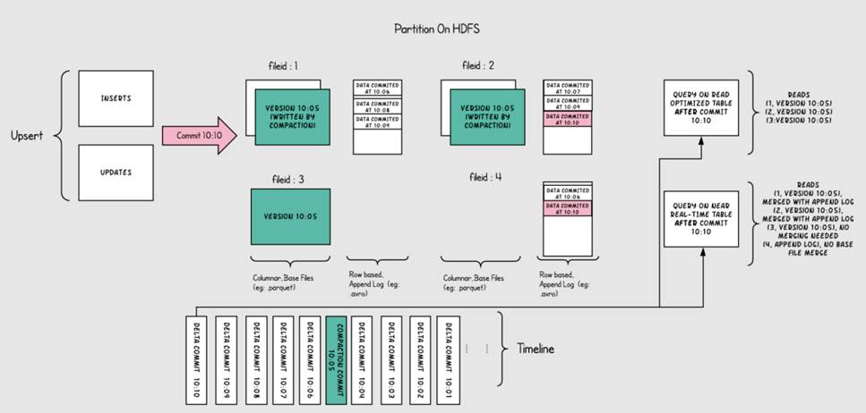
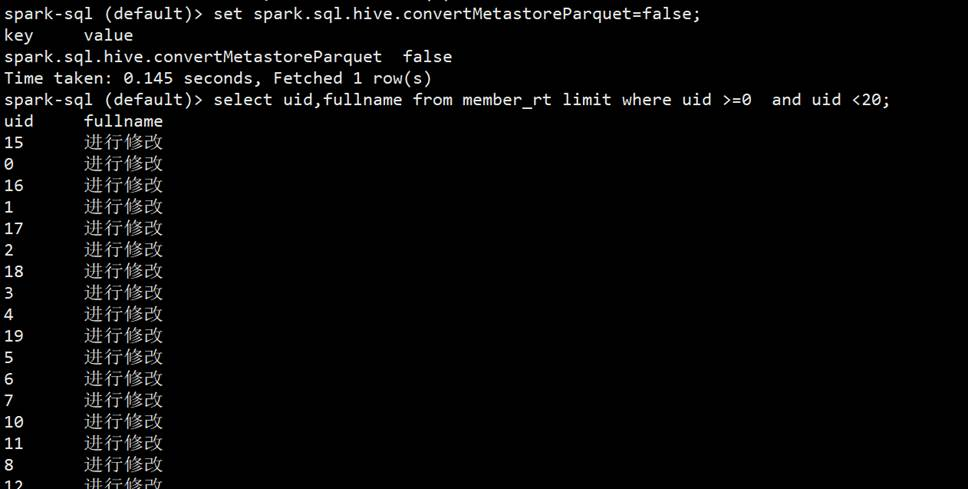
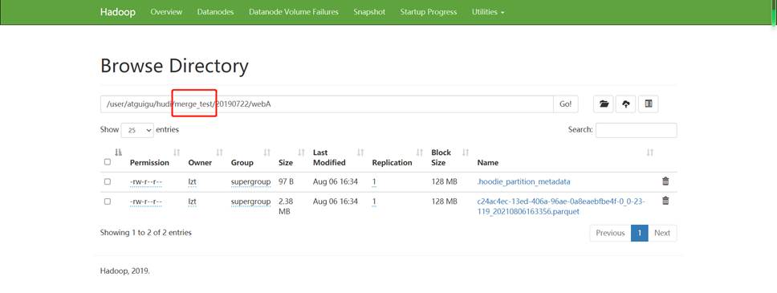

Hadoop Updates and Incrementals（HUdI）

官方文档：https://hudi.apache.org/cn/docs/overview


GitHub：https://github.com/apache/hudi

 

# 第1章 Hudi介绍

## 1.1介绍

   Hudi将流处理引入大数据， 提供新鲜数据，同时比传统批处理效率高一个数据量级。


 

## 1.2特性

（1）快速upsert,可插入索引

（2）以原子方式操作数据并具有回滚功能

（3）写入器和查询之间的快照隔离

（4）savepoint用户数据恢复的保存点

（5）管理文件大小，使用统计数据布局

（6）异步压缩行列数据

（7）具有时间线来追踪元数据血统

（8）通过聚类优化数据集

# 第2章  概要

## 2.1 Timeline

   hudi的核心是维护在不同时刻在表上执行的所有操作的时间表，提供表的即时视图，同时还有效地支持按时间顺序检索数据。Hudi的时刻由以下组件组成：

（1）Instant action: 在表上执行的操作类型

（2）Instant time: 即时时间，通常是一个时间戳，它安装action的开始时间单调递增

（3）State: 时刻的当前状态

   

hudi保证在时间线上的操作都是基于即时时间的，两者的时间保持一致并且是原子性的。

acion操作包括：

（1）commits: 表示将一批数据原子写入表中

（2）cleans: 清除表中不在需要的旧版本文件的后台活动。

（3）delta_commit:增量提交是指将一批数据原子性写入MergeOnRead类型的表中，其中部分或者所有数据可以写入增量日志中。

（4）compaction: 协调hudi中差异数据结构的后台活动，例如：将更新从基于行的日志文件变成列格式。在内部，压缩的表现为时间轴上的特殊提交。

（5）rollback:表示提交操作不成功且已经回滚，会删除在写入过程中产生的数据

（6）savepoint:将某些文件标记为“已保存”，以便清理程序时不会被清楚。在需要数据恢复的情况下，有助于将数据集还原到时间轴上某个点。

 

   任何时刻都会处于以下state:

（1）requested:表示一个动作已被安排，但尚未启动

（2）inflight:表是当前正在执行操作

（3）completed:表是在时间线上完成了操作


上图显示了hudi表上10:00和10:20之间发生的更新插入，每5分钟一次，将提交元数据流以及其他后台清理/压缩操作在hudi时间轴上。观察的关键点是，提交时间表示数据的到达时间，而实际数据组织则反应了实际时间或事件时间，即数据所反映的从07:00开始的每小时时段。在权衡数据延迟和完整性，这是两个关键概念。

如果有延迟到达的数据（事件时间为9:00的数据在10:20达到，延迟>1小时），可以看到upsert将数据生成到更旧的时间段/文件夹中。在时间轴的帮助下，增量查询可以只提取10:00以后成功提交的新数据，并非高效地只消费更改过的文件，且无需扫描更大的文件范围，例如07:00后的所有时间段。

## 2.2 File Layout

Hudi会在DFS分布式文件系统上的basepath基本路径下组织成目录结构。每张对应的表都会成多个分区，这些分区是包含该分区的数据文件的文件夹，与hive的目录结构非常相似。

在每个分区内，文件被组织成文件组，文件id为唯一标识。每个文件组包含多个切片，其中每个切片包含在某个提交/压缩即时时间生成的基本列文件（parquet文件），以及自生成基本文件以来对基本文件的插入/更新的一组日志文件（*.log）。Hudi采用MVCC设计,其中压缩操作会将日志和基本文件合并成新的文件片，清理操作会将未使用/较旧的文件片删除来回收DFS上的空间。

 

   MVCC（Multi-Version Concurrency Control）：多版本并行发控制机制

   Multi-Versioning:产生多版本的数据内容，使得读写可以不互相阻塞

   Concurrency Control：并发控制，使得并行执行的内容能保持串行化结果  

## 2.3 Index

Hudi通过索引机制将映射的给定的hoodie key（record key+partition path）映射到文件id（唯一标示），从而提供高效的upsert操作。记录键和文件组/文件ID之间的这种映射，一旦记录的第一个版本写入文件就永远不会改变。

## 2.4 Table Types& Queries

Hudi表类型定义了如何在DFS上对数据进行索引和布局，以及如何在此类组织上实现上述操作和时间轴活动（即如何写入数据）。同样，查询类型定义了底层数据如何暴露给查询（即如何读取数据）。 

| Table Type                 | Supported Query types                    |
| -------------------------- | ---------------------------------------- |
| Copy on Write （写时复制） | 快照查询+增量查询                        |
| Merge on Read （读时合并） | 快照查询+增量查询+读取优化查询（近实时） |

 

   Table Types:

（1）Copy on Write:使用列式存储来存储数据（例如：parquet）,通过在写入期间执行同步合并来简单地更新和重现文件

（2）Merge on Read:使用列式存储（parquet）+行式文件（arvo）组合存储数据。更新记录到增量文件中，然后进行同步或异步压缩来生成新版本的列式文件。

  

   下面总结了两种表类型之间的权衡

| 权衡                              | CopyOnWrite               | MergeOnRead          |
| --------------------------------- | ------------------------- | -------------------- |
| 数据延迟                          | 高                        | 低                   |
| 查询延迟                          | 低                        | 高                   |
| Update(I/O) 更新成本              | 高（重写整个Parquet文件） | 低（追加到增量日志） |
| Parquet File Size                 | 低（更新成本I/O高）       | 较大（低更新成本）   |
| Write Amplification（WA写入放大） | 大                        | 低（取决于压缩策略） |

 

 Query Types:

（1）Snapshot Queries:快照查询，在此视图上的查询将看到某个提交和压缩操作的最新快照。对于merge on read的表，它通过即时合并最新文件切片的基本文件和增量文件来展示近乎实时的数据（几分钟）。对于copy on write的表，它提供了对现有parquet表的直接替代，同时提供了upsert/delete和其他写入功能。

（2）Incremental Queries:增量查询，该视图智能看到从某个提交/压缩写入数据集的新数据。该视图有效地提供了chang stream,来支持增量视图

（3）Read Optimized Queries:读优化视图，在此视图上的查询将查看到给定提交或压缩操作中的最新快照。该视图将最新文件切片的列暴露个查询，并保证与非hudi列式数据集相比，具有相同列式查询功能。

 

 下面总结了两种查询的权衡

| 权衡     | Snapshot                                | Read Optimized   |
| -------- | --------------------------------------- | ---------------- |
| 数据延迟 | 低                                      | 高               |
| 查询延迟 | 高（合并列式基础文件+行式增量日志文件） | 低(原始列式数据) |

## 2.5 Copy on Write Table

Copy on Write表中的文件切片仅包含基本/列文件，并且每次提交都会生成新版本的基本文件。换句话说，每次提交操作都会被压缩，以便存储列式数据，因此Write Amplification写入放大非常高（即使只有一个字节的数据被提交修改，我们也需要重写整个列数据文件），而读取数据成本则没有增加，所以这种表适合于做分析工作，读取密集型的操作。

 下图说明了copy on write的表是如何工作的


   随着数据被写入，对现有文件组的更新会为该文件组生成一个带有提交即时间标记的新切片，而插入分配一个新文件组并写入该文件组第一个切片。这些切片和提交即时时间在上图用同一颜色标识。针对图上右侧sql查询，首先检查时间轴上的最新提交并过滤掉之前的旧数据（根据时间查询最新数据），如上图所示粉色数据在10:10被提交，第一次查询是在10:10之前，所以出现不到粉色数据，第二次查询时间在10:10之后，可以查询到粉色数据（以被提交的数据）。

   Copy on Write表从根本上改进表的管理方式

（1）在原有文件上进行自动更新数据，而不是重新刷新整个表/分区

（2）能够只读取修改部分的数据，而不是浪费查询无效数据

（3）严格控制文件大小来保证查询性能（小文件会显著降低查询性能）

## 2.6 Merge on Read Table

Merge on Read表是copy on write的超集，它仍然支持通过仅向用户公开最新的文件切片中的基本/列来对表进行查询优化。用户每次对表文件的upsert操作都会以增量日志的形式进行存储，增量日志会对应每个文件最新的ID来帮助用户完成快照查询。因此这种表类型，能够智能平衡读取和写放大（wa）,提供近乎实时的数据。这种表最重要的是压缩器，它用来选择将对应增量日志数据压缩到表的基本文件中，来保持查询时的性能（较大的增量日志文件会影响合并时间和查询时间）

下图说明了该表的工作原理，并显示两种查询类型：快照查询和读取优化查询



（1）如上图所示，现在每一分钟提交一次，这种操作是在别的表里（copy on write table）无法做到的

（2）现在有一个增量日志文件，它保存对基本列文件中记录的传入更新（对表的修改），在图中，增量日志文件包含从10:05到10:10的所有数据。基本列文件仍然使用commit来进行版本控制，因此如果只看基本列文件，那么表的表的布局就像copy on write表一样。

（3）定期压缩过程会协调增量日志文件和基本列文件进行合并，并生成新版本的基本列文件，就如图中10：05所发生的情况一样。

（4）查询表的方式有两种，Read Optimized query和Snapshot query,取决于我们选择是要查询性能还是数据新鲜度

（5）如上图所示，Read Optimized query查询不到10:05之后的数据（查询不到增量日志里的数据），而Snapshot query则可以查询到全量数据（基本列数据+行式的增量日志数据）。

（6）压缩触发是解决所有难题的关键，通过实施压缩策略，会快速缩新分区数据，来保证用户使用Read Optimized query可以查询到X分钟内的数据

 

​    Merge on Read Table是直接在DFS上启用近实时（near real-time）处理，而不是将数据复制到外部专用系统中。该表还有些次要的好处，例如通过避免数据的同步合并来减少写入放大（WA）

 

# 第3章 基础用例

## 3.1近实时读取

Hudi在各种读取数据方面也有很多好处，Hudi在DFS分布式存储系统上存储数据强制执行了最小文件大小，这样有助于解决HDFS和存储上的小文件问题，显著的提升了查询性能。并且Hudi每次提交数据的方式都是原子性的，这样也避免了查询时受到部分写入的影响。

将外部各种OLTP的数据源（比如日志数据、数据库、外部源）写入到Hudi中也是一个常见的问题，Hudi存储这些数据，原始数据层的构建也是非常关键。

对应RDBMS这种关系型数据库的数据写入，Hudi提供了Upserts操作来提供增量修改或新增，而不是采用昂贵的且低效的批量加载。使用Debezium或Kafka Connect或Sqoop等工具将数据导入到Hudi对应在DFS上的表是非常常见的一种方案。对于像NoSql这样的数据库（Cassandra / Voldemort / HBase）即使中等规模的数据量会存储十亿行左右，所以使用完全批量加载的方式根本不行，如果读取要跟上数据的高更新的变化量，则需要更有效的方法。

即使对于像Kafka这样的不可变数据源，通常也需要根据DFS上存储的内容对传入事件进行重复数据的删除。Hudi通过使用不同类型的索引来快速解决这个问题。

所有的一切都可以通过Hudi DeltaStreamer工具无缝实现，该工具Hudi官方一直在尝试增加更多数据源，该工具提供一个连续模式，可以异步地自我管理集群/压缩，而不会阻止数据的写入，显著提高数据新鲜度。

 

Hudi+Debezium+flink+spark同步方案：

https://mp.weixin.qq.com/s?__biz=MzIyMzQ0NjA0MQ==&mid=2247485857&idx=1&sn=ef0329a4eccdff7998d5a9a45a773e77&chksm=e81f5cd7df68d5c1826ab76a51a0dbe6f04b63b6b5062247ac297c2f6b860f4cd2906578c3be&scene=178&cur_album_id=1608246604526911489#rd

## 3.2数据删除

 Hudi还提供了删除存储在数据中的数据的能力，更重要的是提供了处理大量写入放大(wa)的有效方法，这些通过Merge On Read 表类型基于user_id(任何辅助键)随件删除产生的结果。Hudi可以基于日志提供优雅的并发控制，保证数据的写入和读取可以持续发生，因为后台压缩作业分摊数据的重写和强制删除所需要的成本。

 Hudi还解锁了数据聚类等特殊功能，允许用户优化数据布局来进行删除。具体来说，用户可以基于user_id（辅助键）对旧的事件日志数据进行聚类，这样评估数据需要删除的数据就可以快速的定位，对于分区则在时间戳上进行了聚类优化，提高查询性能。

## 3.3分析和存储

   数据的存储和分析一般我们分为两类数据，实时处理和离线批量处理。通常实时处理由Druid、Memsql或clickhouse提供支持，并且有kafka或pulsar提供服务，这种模型非常昂贵。

​    如果数据会在很晚之后才被写入到数据湖中，那么就需要进行批处理，Hudi也提供对Persto/Spark Sql等交互时Sql引擎的访问，这些引擎可以轻松横向扩展，并在几秒钟诶返回查询结果。

   与实时数据集市相比，通过将数据新鲜度缩短到几分钟，Hudi可以为大量数据应用程序提供更高效的替代方案。

 

## 3.4增量处理管道

在传统数据仓库中，整个数仓的工作流可能会发生数据延迟的问题，比如上游工作流U每小时会在Hive建立分区，每小时结束时使用该处理时间作为event time，提供1小时的数据有效新鲜度，然后下游工作流D在U完成后立即启动，并在接下来一小时内进行自己的处理，将有效延迟增加到了2小时。这样的例子忽略了数据迟到现象，即processing_time和event time并不是同一时间而是分开的，比如移动设备或者传感器间歇性的连接所造成，这种现象并不是异常而是常态,那么在这种情况下，保证正确性的唯一补救措施是每小时一遍一遍得重新处理那些迟到的数据，这样可能会严重危害到整个生态系统的效率。

那么Hudi也提供了解决方案，它提供一种以记录粒度（不是目录/分区）从上有Hudi表中消费数据（包括后期迟到数据）的方法，可以有效地更新/协调后期数据到达，上下游两张表的调度可以更频繁，例如15分钟，并可以在下游表提供30分钟的端延迟。为了实现这一目标，Hudi采纳了spark streaming、Kafka、Flink、Oracle Streaming等技术框架的概念。

具体可以查看链接：

https://www.oreilly.com/content/ubers-case-for-incremental-processing-on-hadoop/

# 第4章 Hudi快速构建

## 4.1 安装环境准备

Hadoop集群

Hive

Spark3.0.1

### 4.1.1 Maven安装

（1）把apache-maven-3.6.1-bin.tar.gz上传到linux的/opt/software目录下

（2）解压apache-maven-3.6.1-bin.tar.gz到/opt/module/目录下面

```
[root@hadoop103 software]# tar -zxvf apache-maven-3.6.1-bin.tar.gz -C /opt/module/
```

（3）修改apache-maven-3.6.1的名称为maven

[root@hadoop103 software]# cd /opt/module/

```
[root@hadoop103 module]# mv apache-maven-3.6.1/ maven
```

（4）添加环境变量到/etc/profile中

```
[root@hadoop103 module]# vim /etc/profile
```

```
#MAVEN_HOME
export MAVEN_HOME=/opt/module/maven
export PATH=$PATH:$MAVEN_HOME/bin
```

（5）测试安装结果

```
[root@hadoop103 module]# source /etc/profile

[root@hadoop103 module]# mvn -v
```

（6）修改setting.xml，指定为阿里云

```
[root@hadoop103 module]# vim maven/conf/settings.xml 
```

<!-- 添加阿里云镜像-->

```
<mirror>
    <id>nexus-aliyun</id>
    <mirrorOf>central</mirrorOf>
    <name>Nexus aliyun</name>
    <url>http://maven.aliyun.com/nexus/content/groups/public</url>
</mirror>
```

 


### 4.1.2 Git安装

```
[root@hadoop103 module]# yum install git

[root@hadoop103 module]# git --version
```


### 4.1.3 解决依赖问题

（1）建立对应目录

```
[root@hadoop103 ~]# cd .m2/

[root@hadoop103 .m2]# cd repository/

[root@hadoop103 repository]# cd org/

[root@hadoop103 org]# mkdir pentaho 

[root@hadoop103 pentaho]# mkdir pentaho-aggdesigner-algorithm

[root@hadoop103 pentaho-aggdesigner-algorithm]# mkdir 5.1.5-jhyde
```

（3）上传pentaho-aggdesigner-algorithm-5.1.5-jhyde.jar


### 4.1.3 构建hudi

（1）通过国内镜像拉取源码

```
[root@hadoop103 module]# git clone --branch release-0.8.0 https://gitee.com/apache/Hudi.git
```

（2）修改pom.xml

```
[root@hadoop103 module]# cd Hudi/

[root@hadoop103 hudi]$ vim pom.xml 
```

```
 <repository>
​     <id>nexus-aliyun</id>
​    <name>nexus-aliyun</name>
​    <url>http://maven.aliyun.com/nexus/content/groups/public/</url>
​    <releases>
​      <enabled>true</enabled>
​    </releases>
​    <snapshots>
​      <enabled>false</enabled>
​    </snapshots>
  </repository>
```

 

（3）构建

```
[root@hadoop103 Hudi]# mvn clean package -DskipTests -Dspark3 -Dscala-2.12 
```


（4）编译好之后文件目录对应Hudi下的packaging目录


# 第5章 Spark操作

## 5.1 Spark-shell启动

（1）spark-shell启动,需要指定spark-avro模块，因为默认环境里没有，spark-avro模块版本好需要和spark版本对应，这里都是3.0.1，并且使用Hudi编译好的jar包。

```
[root@hadoop103 ~]# spark-shell --jars /opt/module/Hudi/packaging/hudi-spark-bundle/target/hudi-spark3-bundle_2.12-0.8.0.jar --packages org.apache.spark:spark-avro_2.12:3.0.1 --conf 'spark.serializer=org.apache.spark.serializer.KryoSerializer'
```


### 5.1.2 设置表名

设置表名，基本路径和数据生成器

```
scala> import org.apache.hudi.QuickstartUtils._
import org.apache.hudi.QuickstartUtils._ 

scala> import scala.collection.JavaConversions._
import scala.collection.JavaConversions._
 
scala> import org.apache.spark.sql.SaveMode._
import org.apache.spark.sql.SaveMode._

scala> import org.apache.hudi.DataSourceReadOptions._
import org.apache.hudi.DataSourceReadOptions._

scala> import org.apache.hudi.DataSourceWriteOptions._
import org.apache.hudi.DataSourceWriteOptions._

scala> import org.apache.hudi.config.HoodieWriteConfig._
import org.apache.hudi.config.HoodieWriteConfig._

scala> val tableName = "hudi_trips_cow"
tableName: String = hudi_trips_cow

scala> val basePath = "file:///tmp/hudi_trips_cow"
basePath: String = file:///tmp/hudi_trips_cow

scala> val dataGen = new DataGenerator
dataGen: org.apache.hudi.QuickstartUtils.DataGenerator = org.apache.hudi.QuickstartUtils$DataGenerator@5cdd5ff9
```

 

### 5.1.3 插入数据

新增数据，生成一些数据，将其加载到DataFrame中，然后将DataFrame写入Hudi表

```
scala> val inserts = convertToStringList(dataGen.generateInserts(10))

scala> val df = spark.read.json(spark.sparkContext.parallelize(inserts, 2))

scala> df.write.format("hudi").

​    options(getQuickstartWriteConfigs).

​    option(PRECOMBINE_FIELD_OPT_KEY, "ts").

​    option(RECORDKEY_FIELD_OPT_KEY, "uuid").

​    option(PARTITIONPATH_FIELD_OPT_KEY, "partitionpath").

​    option(TABLE_NAME, tableName).

​    mode(Overwrite).

​    save(basePath)
```

Mode(overwrite)将覆盖重新创建表（如果已存在）。可以检查/tmp/hudi_trps_cow 路径下是否有数据生成。

```
[root@hadoop103 ~]# cd /tmp/hudi_trips_cow/

[root@hadoop103 hudi_trips_cow]# ls

americas asia
```


### 5.1.4 查询数据

```
scala> val tripsSnapshotDF = spark.read.format("hudi").load(basePath + "/*/*/*/*")

scala> tripsSnapshotDF.createOrReplaceTempView("hudi_trips_snapshot")

scala> spark.sql("select fare, begin_lon, begin_lat, ts from hudi_trips_snapshot where fare > 20.0").show()

+------------------+-------------------+-------------------+---+

|       fare|     begin_lon|     begin_lat| ts|

+------------------+-------------------+-------------------+---+

| 64.27696295884016| 0.4923479652912024| 0.5731835407930634|0.0|

| 33.92216483948643| 0.9694586417848392| 0.1856488085068272|0.0|

| 27.79478688582596| 0.6273212202489661|0.11488393157088261|0.0|

| 93.56018115236618|0.14285051259466197|0.21624150367601136|0.0|

| 43.4923811219014| 0.8779402295427752| 0.6100070562136587|0.0|

| 66.62084366450246|0.03844104444445928| 0.0750588760043035|0.0|

|34.158284716382845|0.46157858450465483| 0.4726905879569653|0.0|

| 41.06290929046368| 0.8192868687714224| 0.651058505660742|0.0|

+------------------+-------------------+-------------------+---+

scala> spark.sql("select _hoodie_commit_time, _hoodie_record_key, _hoodie_partition_path, rider, driver, fare from hudi_trips_snapshot").show()

+-------------------+--------------------+----------------------+---------+----------+------------------+

|_hoodie_commit_time| _hoodie_record_key|_hoodie_partition_path|  rider|  driver|       fare|

+-------------------+--------------------+----------------------+---------+----------+------------------+

|   20200701105144|6007a624-d942-4e0...| americas/united_s...|rider-213|driver-213| 64.27696295884016|

|   20200701105144|db7c6361-3f05-48d...| americas/united_s...|rider-213|driver-213| 33.92216483948643|

|   20200701105144|dfd0e7d9-f10c-468...| americas/united_s...|rider-213|driver-213|19.179139106643607|

|   20200701105144|e36365c8-5b3a-415...| americas/united_s...|rider-213|driver-213| 27.79478688582596|

|   20200701105144|fb92c00e-dea2-48e...| americas/united_s...|rider-213|driver-213| 93.56018115236618|

|   20200701105144|98be3080-a058-47d...| americas/brazil/s...|rider-213|driver-213| 43.4923811219014|

|   20200701105144|3dd6ef72-4196-469...| americas/brazil/s...|rider-213|driver-213| 66.62084366450246|

|   20200701105144|20f9463f-1c14-4e6...| americas/brazil/s...|rider-213|driver-213|34.158284716382845|

|   20200701105144|1585ad3a-11c9-43c...|  asia/india/chennai|rider-213|driver-213|17.851135255091155|

|   20200701105144|d40daa90-cf1a-4d1...|  asia/india/chennai|rider-213|driver-213| 41.06290929046368|

+-------------------+--------------------+----------------------+---------+----------+------------------+
```

由于测试数据分区是 区域/国家/城市，所以load(basePath “/*/*/*/*”)

### 5.1.5 修改数据

类似于插入新数据，使用数据生成器生成新数据对历史数据进行更新。将数据加载到DataFrame中并将DataFrame写入Hudi表中

```
scala> val updates = convertToStringList(dataGen.generateUpdates(10))

scala> val df = spark.read.json(spark.sparkContext.parallelize(updates, 2))

scala> df.write.format("hudi").

   |  options(getQuickstartWriteConfigs).

   |  option(PRECOMBINE_FIELD_OPT_KEY, "ts").

   |  option(RECORDKEY_FIELD_OPT_KEY, "uuid").

   |  option(PARTITIONPATH_FIELD_OPT_KEY, "partitionpath").

   |  option(TABLE_NAME, tableName).

   |  mode(Append).

   |  save(basePath)
```


### 5.1.6 增量查询

Hudi还提供了获取自给定提交时间戳以来以更改记录流的功能。这可以通过使用Hudi的增量查询并提供开始流进行更改的开始时间来实现。

```
scala>spark.read.format("hudi").load(basePath+"/*/*/*/*").createOrReplaceTempView("hudi_trips_snapshot")

scala> val commits = spark.sql("select distinct(_hoodie_commit_time) as commitTime from hudi_trips_snapshot order by commitTime").map(k => k.getString(0)).take(50)

scala> val beginTime = commits(commits.length - 2)

beginTime: String = 20200701105144

scala> val tripsIncrementalDF = spark.read.format("hudi").

   |  option(QUERY_TYPE_OPT_KEY, QUERY_TYPE_INCREMENTAL_OPT_VAL).

   |  option(BEGIN_INSTANTTIME_OPT_KEY, beginTime).

   |  load(basePath)

scala> tripsIncrementalDF.createOrReplaceTempView("hudi_trips_incremental")

scala> spark.sql("select `_hoodie_commit_time`, fare, begin_lon, begin_lat, ts from hudi_trips_incremental where fare > 20.0").show()

+-------------------+------------------+--------------------+-------------------+---+

|_hoodie_commit_time|       fare|      begin_lon|     begin_lat| ts|

+-------------------+------------------+--------------------+-------------------+---+

|   20200701110546|49.527694252432056| 0.5142184937933181| 0.7340133901254792|0.0|

|   20200701110546| 90.9053809533154| 0.19949323322922063|0.18294079059016366|0.0|

|   20200701110546| 98.3428192817987| 0.3349917833248327| 0.4777395067707303|0.0|

|   20200701110546| 90.25710109008239| 0.4006983139989222|0.08528650347654165|0.0|

|   20200701110546| 63.72504913279929|  0.888493603696927| 0.6570857443423376|0.0|

|   20200701110546| 29.47661370147079|0.010872312870502165| 0.1593867607188556|0.0|

+-------------------+------------------+--------------------+-------------------+---+
```

这将提供在beginTime提交后的数据，并且fare>20的数据

### 5.1.7 时间点查询

根据特定时间查询，可以将endTime指向特定时间，beginTime指向000（表示最早提交时间）

 

```
scala> val beginTime = "000"

beginTime: String = 000

 

scala> val endTime = commits(commits.length - 2)

endTime: String = 20200701105144

scala> val tripsPointInTimeDF = spark.read.format("hudi").

   |  option(QUERY_TYPE_OPT_KEY, QUERY_TYPE_INCREMENTAL_OPT_VAL).

   |  option(BEGIN_INSTANTTIME_OPT_KEY, beginTime).

   |  option(END_INSTANTTIME_OPT_KEY, endTime).

   |  load(basePath)

scala> tripsPointInTimeDF.createOrReplaceTempView("hudi_trips_point_in_time")

scala> spark.sql("select `_hoodie_commit_time`, fare, begin_lon, begin_lat, ts from hudi_trips_point_in_time where fare > 20.0").show()

+-------------------+------------------+-------------------+-------------------+---+

|_hoodie_commit_time|       fare|     begin_lon|     begin_lat| ts|

+-------------------+------------------+-------------------+-------------------+---+

|   20200701105144| 64.27696295884016| 0.4923479652912024| 0.5731835407930634|0.0|

|   20200701105144| 33.92216483948643| 0.9694586417848392| 0.1856488085068272|0.0|

|   20200701105144| 27.79478688582596| 0.6273212202489661|0.11488393157088261|0.0|

|   20200701105144| 93.56018115236618|0.14285051259466197|0.21624150367601136|0.0|

|   20200701105144| 43.4923811219014| 0.8779402295427752| 0.6100070562136587|0.0|

|   20200701105144| 66.62084366450246|0.03844104444445928| 0.0750588760043035|0.0|

|   20200701105144|34.158284716382845|0.46157858450465483| 0.4726905879569653|0.0|

|   20200701105144| 41.06290929046368| 0.8192868687714224| 0.651058505660742|0.0|

+-------------------+------------------+-------------------+-------------------+---+
```

 

### 5.1.8 删除数据

```
scala> spark.sql("select uuid, partitionPath from hudi_trips_snapshot").count()

res12: Long = 10

scala> val ds = spark.sql("select uuid, partitionPath from hudi_trips_snapshot").limit(2)

scala> val deletes = dataGen.generateDeletes(ds.collectAsList())

scala> val df = spark.read.json(spark.sparkContext.parallelize(deletes, 2));

scala> df.write.format("hudi").

   |  options(getQuickstartWriteConfigs).

   |  option(OPERATION_OPT_KEY,"delete").

   |  option(PRECOMBINE_FIELD_OPT_KEY, "ts").

   |  option(RECORDKEY_FIELD_OPT_KEY, "uuid").

   |  option(PARTITIONPATH_FIELD_OPT_KEY, "partitionpath").

   |  option(TABLE_NAME, tableName).

   |  mode(Append).

   |  save(basePath)

scala> val roAfterDeleteViewDF = spark. read. format("hudi"). load(basePath + "/*/*/*/*")

scala> roAfterDeleteViewDF.registerTempTable("hudi_trips_snapshot")

scala> spark.sql("select uuid, partitionPath from hudi_trips_snapshot").count()

res15: Long = 8
```

只有append模式，才支持删除功能

### 5.1.9 覆盖数据

（1）对于一些批量etl操作，overwrite覆盖分区内的数据这种操作可能会比upsert操作效率更高，即一次重新计算目标分区内的数据。因为overwrite操作可以绕过upsert操作总需要的索引、预聚合步骤。

```
scala>spark.read.format("hudi").load(basePath+"/*/*/*/*").select("uuid","partitionpath"). sort("partitionpath","uuid"). show(100, false)

 

21/08/04 13:00:08 WARN DefaultSource: Loading Base File Only View.

+------------------------------------+------------------------------------+

|uuid                |partitionpath            |

+------------------------------------+------------------------------------+

|0fb8f685-6db5-4d58-a7b1-79da5a1e0e00|americas/brazil/sao_paulo      |

|31705950-ccff-4555-9f95-afb1e2438346|americas/brazil/sao_paulo      |

|b3c04064-81aa-429b-a0eb-5b1e5c87dde8|americas/brazil/sao_paulo      |

|b24917ba-e241-4c1d-bb64-e5d70cb984a3|americas/united_states/san_francisco|

|c32e33b7-1fff-4422-a026-62efcf912863|americas/united_states/san_francisco|

|c4f2075a-a36d-45a5-ac8a-f2a18fabe2a2|americas/united_states/san_francisco|

|40fe2e44-7d38-4660-8369-987ec7c4ba82|asia/india/chennai         |

|53081003-176e-47bd-b408-8130cd623f77|asia/india/chennai         |

+------------------------------------+------------------------------------+

 

scala> val inserts = convertToStringList(dataGen.generateInserts(10))

scala> val df = spark.

   |  read.json(spark.sparkContext.parallelize(inserts, 2)).

   |  filter("partitionpath = 'americas/united_states/san_francisco'")

 

scala> df.write.format("hudi").

   |  options(getQuickstartWriteConfigs).

   |  option(OPERATION_OPT_KEY,"insert_overwrite").

   |  option(PRECOMBINE_FIELD_OPT_KEY, "ts").

   |  option(RECORDKEY_FIELD_OPT_KEY, "uuid").

   |  option(PARTITIONPATH_FIELD_OPT_KEY, "partitionpath").

   |  option(TABLE_NAME, tableName).

   |  mode(Append).

   |  save(basePath)

 

scala> spark.

   |  read.format("hudi").

   |  load(basePath + "/*/*/*/*").

   |  select("uuid","partitionpath").

   |  sort("partitionpath","uuid").

   |  show(100, false)
```

 

## 5.2 Spark 写数据

   这一节主要介绍，使用Delta Streamer工具从外部源甚至其他Hudi表中读取和更改的方法，以及使用Hudi数据源通过upserts加速Spark作业的方法。然后使用各种查询引擎来进行查询表数据。

### 5.2.1 Write Operations

  Delta Streamer工具提供3种不同的写入的操作方式

（1）Upsert:这是默认操作，输入数据时会通过索引判定为插入或更新。

（2）Insert:此操作与upsert类似，但是完全跳过索引，因此效率可能比upsert高的多，但也只适用于允许数据重复的场景。

（3）Bulk_Insert:upsert和insert操作都将数据保存到内存中，以更快的存储计算，因此在引导加载初始化表的时候会比较麻烦。那么大批插入的方式实现了基于排序的数据写入算法，可以很好地负载百TB的初始化负载。

### 5.2.2 Delta Streamer

  Hudi Delta Streamer提供了从不同来源（DFS或Kafka）读取数据的方法，具有以下功能

（1）精准一次的从kafka消费数据，支持从Sqoop或HiveIncrementalPuller的输出或DFS文件的增量导入

（2）支持手动创建arvo文件或者使用Confluent注册

（3）支持传入数据类型有json、arvo或自定义类型

（4）具有checkpoint检查点，回滚和恢复的公民

 

测试：

（1）启动kafka集群，创建测试用的topic

```
[root@hadoop103 kafka_2.11-2.4.0]# bin/kafka-topics.sh --bootstrap-server hadoop101:9092 --create --replication-factor 2 --partitions 3 --topic test
```

（2）准备java生产者代码往topic发送测试数据

```
package com.atguigu.util;

 import com.alibaba.fastjson.JSONObject;
 import org.apache.kafka.clients.producer.KafkaProducer;
 import org.apache.kafka.clients.producer.ProducerRecord;

 import java.util.Properties;
 import java.util.Random;

 public class TestProducer {
   public static void main(String[] args) {
     Properties props = new Properties();
     props.put("bootstrap.servers", "hadoop101:9092,hadoop102:9092,hadoop103:9092");
     props.put("acks", "-1");
     props.put("batch.size", "1048576");
     props.put("linger.ms", "5");
     props.put("compression.type", "snappy");
     props.put("buffer.memory", "33554432");
     props.put("key.serializer",
         "org.apache.kafka.common.serialization.StringSerializer");
     props.put("value.serializer",
         "org.apache.kafka.common.serialization.StringSerializer");
     KafkaProducer<String, String> producer = new KafkaProducer<String, String>(props);
     Random random = new Random();
     for (int i = 0; i < 10000000; i++) {
       JSONObject model = new JSONObject();
       model.put("userid", i);
       model.put("username", "name" + i);
       model.put("age", 18);
       model.put("partition", random.nextInt(100));
       producer.send(new ProducerRecord<String, String>("test", model.toJSONString()));
     }
     producer.flush();
     producer.close();
   }
 }
```

（3）定义arvo所需schema文件

```
[root@hadoop103 lizunting]# vim source-schema-json.avsc

{    

 "type": "record",

 "name": "Profiles",  

 "fields": [

  {

   "name": "userid",

   "type": [ "null", "string" ],

   "default": null

  },

  {

   "name": "username",

   "type": [ "null", "string" ],

   "default": null

  },

  {

   "name": "age",

   "type": [ "null", "string" ],

   "default": null

  },

  {

   "name": "partition",

   "type": [ "null", "string" ],

   "default": null

  }

 ]

}
```

 

```
[root@hadoop103 lizunting]# cp source-schema-json.avsc target-schema-json.avsc
```

（4）根据源码里提供的模板，编写自己的kafka source的配置文件

```
[root@hadoop103 ~]# cp /opt/module/Hudi/hudi-utilities/src/test/resources/delta-streamer-config/kafka-source.properties /root/lizunting/

[root@hadoop103 ~]# vim /root/lizunting/kafka-source.properties 

include=hdfs://mycluster/user/hudi-properties/base.properties

# Key fields, for kafka example

hoodie.datasource.write.recordkey.field=userid

hoodie.datasource.write.partitionpath.field=partition

# schema provider configs

hoodie.deltastreamer.schemaprovider.source.schema.file=hdfs://mycluster/user/hudi-properties/source-schema-json.avsc

hoodie.deltastreamer.schemaprovider.target.schema.file=hdfs://mycluster/user/hudi-properties/target-schema-json.avsc

#hoodie.deltastreamer.schemaprovider.registry.url=http://hadoop103:8081/

# Kafka Source

#hoodie.deltastreamer.source.kafka.topic=uber_trips

hoodie.deltastreamer.source.kafka.topic=test

#Kafka props

bootstrap.servers=hadoop101:9092,hadoop102:9092,hadoop103:9092

auto.offset.reset=earliest

group.id=test-group

enable.auto.commit=false
```

（5）将配置文件上传到hdfs

```
[root@hadoop103 lizunting]# hadoop dfs -mkdir -p /user/hudi-properties

[root@hadoop103 lizunting]# hadoop dfs -put kafka-source.properties /user/hudi-properties

[root@hadoop103 lizunting]# hadoop dfs -put /opt/module/Hudi/hudi-utilities/src/test/resources/delta-streamer-config/base.properties /user/hudi-properties

[root@hadoop103 lizunting]# hadoop dfs -put source-schema-json.avsc /user/hudi-properties

[root@hadoop103 lizunting]# hadoop dfs -put target-schema-json.avsc /user/hudi-properties
```

（6）运行对应命令

```
[root@hadoop103 lizunting]# spark-submit --class org.apache.hudi.utilities.deltastreamer.HoodieDeltaStreamer \

`ls /opt/module/Hudi/packaging/hudi-utilities-bundle/target/hudi-utilities-bundle_2.12-0.8.0.jar` \

 --props hdfs://mycluster/user/hudi-properties/kafka-source.properties \

 --schemaprovider-class org.apache.hudi.utilities.schema.FilebasedSchemaProvider \

--source-class org.apache.hudi.utilities.sources.JsonKafkaSource \

--source-ordering-field userid --target-base-path hdfs://mycluster/user/hudi \

--target-table hudi-test --op INSERT --table-type MERGE_ON_READ
```

（7）运行成功查看Hdfs数据


（8）已有数据块和目录，通过spark-shell进行查询

```
scala> spark.read.format("hudi").load("/user/hudi/*").show
```


### 5.2.3 Spark DataFrame写数据

#### 5.2.3.1 pom.xml

```
<dependencies>
    <dependency>
        <groupId>org.apache.hudi</groupId>
        <artifactId>hudi-client</artifactId>
        <scope>provided</scope>
        <version>0.8.0</version>
        <type>pom</type>
    </dependency>
    <dependency>
        <groupId>org.apache.hudi</groupId>
        <artifactId>hudi-spark-bundle_2.12</artifactId>
        <scope>provided</scope>
        <version>0.8.0</version>
    </dependency>
    <dependency>
        <groupId>org.apache.hudi</groupId>
        <artifactId>hudi-hadoop-mr-bundle</artifactId>
        <exclusions>
            <exclusion>
                <groupId>jackson-databind</groupId>
                <artifactId>com.fasterxml.jackson.core</artifactId>
            </exclusion>
            <exclusion>
                <groupId>com.fasterxml.jackson.core</groupId>
                <artifactId>jackson-annotations</artifactId>
            </exclusion>
        </exclusions>
        <version>0.8.0</version>
        <scope>provided</scope>
    </dependency>

    <!--        &lt;!&ndash; Spark的依赖引入 &ndash;&gt;-->
    <dependency>
        <groupId>org.apache.spark</groupId>
        <artifactId>spark-core_2.12</artifactId>
        <scope>provided</scope>
        <version>3.0.1</version>
    </dependency>
    <!--        <dependency>-->
    <!--            <groupId>org.scala-lang</groupId>-->
    <!--            <artifactId>scala-library</artifactId>-->
    <!--            <version>2.12.10</version>-->
    <!--        </dependency>-->
    <dependency>
        <groupId>org.apache.spark</groupId>
        <artifactId>spark-sql_2.12</artifactId>
        <scope>provided</scope>
        <version>3.0.1</version>
    </dependency>
    <dependency>
        <groupId>org.apache.spark</groupId>
        <artifactId>spark-hive_2.12</artifactId>
        <scope>provided</scope>
        <version>3.0.1</version>
    </dependency>
    <dependency>
        <groupId>org.apache.spark</groupId>
        <artifactId>spark-avro_2.12</artifactId>
        <scope>provided</scope>
        <version>3.0.1</version>
    </dependency>
    <dependency>
        <groupId>org.apache.hadoop</groupId>
        <artifactId>hadoop-client</artifactId>
        <scope>provided</scope>
        <version>2.7.2</version>
    </dependency>
    <dependency>
        <groupId>org.spark-project.hive</groupId>
        <artifactId>hive-jdbc</artifactId>
        <scope>provided</scope>
        <version>1.2.1.spark2</version>
    </dependency>

</dependencies>

```


#### 5.2.3.2 case class

```
class DwsMember(
         uid: Int,
         ad_id: Int,
         var fullname: String,
         iconurl: String,
         dt: String,
         dn: String
        )
```

 

#### 5.2.3.3 对接hive

（1）将Hudi目录编译好的hudi-hadoop-mr-bundle-0.8.0.jar，复制到hive的lib下让hive支持hudi,需要重启hive服务

```
[root@hadoop103 lizunting]# cd /opt/module/Hudi/packaging/hudi-hadoop-mr-bundle/target/

[root@hadoop103 target]# scp hudi-hadoop-mr-bundle-0.8.0.jar hadoop101:/opt/module/apache-hive-3.1.2-bin/lib
```


#### 5.2.3.4 Spark写入Hudi并同步hive表

```
package com.atguigu.hudi.test

 import org.apache.hudi.DataSourceWriteOptions
 import org.apache.hudi.config.HoodieIndexConfig
 import org.apache.hudi.hive.MultiPartKeysValueExtractor
 import org.apache.hudi.index.HoodieIndex
 import org.apache.spark.SparkConf
 import org.apache.spark.sql.{SaveMode, SparkSession}

 object TableOperator {
  def main(args: Array[String]): Unit = {
   val sparkConf = new SparkConf().setAppName("test_operator").setMaster("local[*]")
    .set("spark.serializer", "org.apache.spark.serializer.KryoSerializer")
   val sparkSession = SparkSession.builder().config(sparkConf).enableHiveSupport().getOrCreate()
   insertData(sparkSession);
  }

  def insertData(sparkSession: SparkSession) = {
   import org.apache.spark.sql.functions._
   val commitTime = System.currentTimeMillis().toString //生成提交时间
   val resultDF = sparkSession.read.json("/user/atguigu/ods/member.log")
    .withColumn("ts", lit(commitTime)) //添加ts时间戳
    .withColumn("hudipartition", concat_ws("/", col("dt"), col("dn"))) //添加分区 两个字段组合分区
   Class.forName("org.apache.hive.jdbc.HiveDriver")
   resultDF.write.format("hudi")
    .option(DataSourceWriteOptions.TABLE_TYPE_OPT_KEY, DataSourceWriteOptions.MOR_TABLE_TYPE_OPT_VAL) //选择表的类型 到底是MERGE_ON_READ 还是 COPY_ON_WRITE
    .option(DataSourceWriteOptions.RECORDKEY_FIELD_OPT_KEY, "uid") //设置主键
    .option(DataSourceWriteOptions.PRECOMBINE_FIELD_OPT_KEY, "ts") //数据更新时间戳的
    .option(DataSourceWriteOptions.PARTITIONPATH_FIELD_OPT_KEY, "hudipartition") //hudi分区列
    .option("hoodie.table.name", "member") //hudi表名
    .option(DataSourceWriteOptions.HIVE_URL_OPT_KEY, "jdbc:hive2://hadoop101:10000") //hiveserver2地址
    .option(DataSourceWriteOptions.HIVE_DATABASE_OPT_KEY, "default") //设置hudi与hive同步的数据库
    .option(DataSourceWriteOptions.HIVE_TABLE_OPT_KEY, "member") //设置hudi与hive同步的表名
    .option(DataSourceWriteOptions.HIVE_PARTITION_FIELDS_OPT_KEY, "dt,dn") //hive表同步的分区列
    .option(DataSourceWriteOptions.HIVE_PARTITION_EXTRACTOR_CLASS_OPT_KEY, classOf[MultiPartKeysValueExtractor].getName) // 分区提取器 按/ 提取分区
    .option(DataSourceWriteOptions.HIVE_SYNC_ENABLED_OPT_KEY, "true") //设置数据集注册并同步到hive
    .option(HoodieIndexConfig.BLOOM_INDEX_UPDATE_PARTITION_PATH, "true") //设置当分区变更时，当前数据的分区目录是否变更
    .option(HoodieIndexConfig.INDEX_TYPE_PROP, HoodieIndex.IndexType.GLOBAL_BLOOM.name()) //设置索引类型目前有HBASE,INMEMORY,BLOOM,GLOBAL_BLOOM 四种索引 为了保证分区变更后能找到必须设置全局GLOBAL_BLOOM
    .option("hoodie.insert.shuffle.parallelism", "12")
    .option("hoodie.upsert.shuffle.parallelism", "12")
    .mode(SaveMode.Append)
    .save("/user/atguigu/hudi/hivetest")
  }
 }
```


#### 5.2.3.5通过spark查询数据

（1）查看9870页面，已有数据


（2）通过spark查询数据,将代码打成jar包，集群测试（local模式有依赖冲突问题）

```
/**
 * 查询hdfs上的hudi数据
 *
 * @param sparkSession
 */
 def queryData(sparkSession: SparkSession) = {
  val df = sparkSession.read.format("org.apache.hudi")
   .load("/user/atguigu/hudi/hivetest/*/*")
  df.show()
 }
```

（3）测试

```
[root@hadoop103 lizunting]# spark-submit --class com.atguigu.hudi.test.TableOperators --packages org.apache.spark:spark-avro_2.12:3.0.1 --jars /opt/module/Hudi/packaging/hudi-utilities-bundle/target/hudi-utilities-bundle_2.12-0.8.0.jar hudi-spark-demo-1.0-SNAPSHOT-jar-with-dependencies.jar


```


#### 5.2.3.6使用Sql查询

（1）因为代码在插入数据时也指定了同步至hive,所以这个时候hive种也会生成对应的表。进入到hive查看对应的表。会生成两张表分别以ro和rt结尾。


（2）那么就可以用hive sql或者spark sql查询了


（3）使用spark sql

```
[root@hadoop103 lizunting]# spark-sql --jars /opt/module/Hudi/packaging/hudi-spark-bundle/target/hudi-spark3-bundle_2.12-0.8.0.jar --packages org.apache.spark:spark-avro_2.12:3.0.1 --conf 'spark.serializer=org.apache.spark.serializer.KryoSerializer'
```


### 5.2.4修改数据

#### 5.2.4.1代码修数据逻辑

（1）编写代码，进行修改

```
 /**
  * 修改数据，hudi支持行级更新
  */
  def updateData(sparkSession: SparkSession) = {
   //只查询20条数据,并进行修改，修改这20条数据的fullname值
   import org.apache.spark.sql.functions._
   val commitTime = System.currentTimeMillis().toString //生成提交时间
   val resultDF = sparkSession.read.json("/user/atguigu/ods/member.log")
    .withColumn("ts", lit(commitTime)) //添加ts时间戳
    .withColumn("hudipartition", concat_ws("/", col("dt"), col("dn")))
    .where("uid >=0 and uid <20")
    .withColumn("fullname", lit("进行修改"))

   //改完数据之后，进行插入，表会根据DataSourceWriteOptions.RECORDKEY_FIELD_OPT_KEY 主键进行判断修改
   //插入类型必须是append模 才能起到修改作用
   resultDF.write.format("hudi")
    .option(DataSourceWriteOptions.TABLE_TYPE_OPT_KEY, DataSourceWriteOptions.MOR_TABLE_TYPE_OPT_VAL) //选择表的类型 到底是MERGE_ON_READ 还是 COPY_ON_WRITE
    .option(DataSourceWriteOptions.RECORDKEY_FIELD_OPT_KEY, "uid") //设置主键
    .option(DataSourceWriteOptions.PRECOMBINE_FIELD_OPT_KEY, "ts") //数据更新时间戳的
    .option(DataSourceWriteOptions.PARTITIONPATH_FIELD_OPT_KEY, "hudipartition") //hudi分区列
    .option("hoodie.table.name", "member") //hudi表名
    .option(DataSourceWriteOptions.HIVE_URL_OPT_KEY, "jdbc:hive2://hadoop101:10000") //hiveserver2地址
    .option(DataSourceWriteOptions.HIVE_DATABASE_OPT_KEY, "default") //设置hudi与hive同步的数据库
    .option(DataSourceWriteOptions.HIVE_TABLE_OPT_KEY, "member") //设置hudi与hive同步的表名
    .option(DataSourceWriteOptions.HIVE_PARTITION_FIELDS_OPT_KEY, "dt,dn") //hive表同步的分区列
    .option(DataSourceWriteOptions.HIVE_PARTITION_EXTRACTOR_CLASS_OPT_KEY, classOf[MultiPartKeysValueExtractor].getName) // 分区提取器 按/ 提取分区
    .option(DataSourceWriteOptions.HIVE_SYNC_ENABLED_OPT_KEY, "true") //设置数据集注册并同步到hive
    .option(HoodieIndexConfig.BLOOM_INDEX_UPDATE_PARTITION_PATH, "true") //设置当分区变更时，当前数据的分区目录是否变更
    .option(HoodieIndexConfig.INDEX_TYPE_PROP, HoodieIndex.IndexType.GLOBAL_BLOOM.name()) //设置索引类型目前有HBASE,INMEMORY,BLOOM,GLOBAL_BLOOM 四种索引 为了保证分区变更后能找到必须设置全局GLOBAL_BLOOM
    .option("hoodie.insert.shuffle.parallelism", "12")
    .option("hoodie.upsert.shuffle.parallelism", "12")
    .mode(SaveMode.Append)
    .save("/user/atguigu/hudi/hivetest")
  }
 }
```

（2）插入成功后，查看hdfs上的路径文件变化，因为插入表的类型为Merge_On_Read表，所以变化数据为增量日志的形式。


#### 5.2.4.1查询验证

（1）查询验证，先使用hive查询。先查询member_ro表并无变化

```
hive (default)> select uid,fullname from member_ro where uid >=0 and uid <20;
```


（2）再查询member_rt表,可以查询到新增变化数据。

```
hive (default)> select uid,fullname from member_rt where uid >=0 and uid <20;
```


（3）在使用spark-sql查询，注意了如果直接进行查询两张表都无法看到变化数据

```
spark-sql (default)> select uid,fullname from member_rt limit where uid >=0 and uid <20;
```

（4）需要设置参数，将spark.sql.hive.convertMetastoreParquet设置为false

```
spark-sql (default)> set spark.sql.hive.convertMetastoreParquet=false;

spark-sql (default)> select uid,fullname from member_rt limit where uid >=0 and uid <20;
```



## 5.3快照查询

（1）spark默认快照查询，也可以不指定类型

```
[root@hadoop103 ~]# spark-shell --jars /opt/module/Hudi/packaging/hudi-spark-bundle/target/hudi-spark3-bundle_2.12-0.8.0.jar --packages org.apache.spark:spark-avro_2.12:3.0.1 --conf 'spark.serializer=org.apache.spark.serializer.KryoSerializer'

scala> import org.apache.hudi.DataSourceReadOptions

scala> spark.read.format("hudi").option(DataSourceReadOptions.QUERY_TYPE_OPT_KEY, DataSourceReadOptions.QUERY_TYPE_SNAPSHOT_OPT_VAL).load("/user/atguigu/hudi/hivetest/*/*").where("uid>=0 and uid<20").show
```


## 5.4增量查询

（1）查询前40条数据，分别包含修改的20条数据和未修改的20条数据

```
 /**
  * 查询hdfs上的hudi数据
  *
  * @param sparkSession
  */
  def queryData(sparkSession: SparkSession) = {
 //  val df = sparkSession.read.format("org.apache.hudi")
 //   .load("/user/atguigu/hudi/hivetest/*/*")
 //  df.show()
   sparkSession.sql("set spark.sql.hive.convertMetastoreParquet=false")
   sparkSession.sql("select * from member_rt order where uid>=0 and uid <40 order by uid").show(40)
  }
```


（2）可以看到进行修改的数据和修改的数据commit时间戳是不一样的。那么hudi提供使用时间戳增量查询。指定查询类型为增量查询，并且传入时间戳，那么spark会查询时间戳以后的数据。

```
scala> spark.read.format("hudi").option(DataSourceReadOptions.QUERY_TYPE_OPT_KEY, DataSourceReadOptions.QUERY_TYPE_INCREMENTAL_OPT_VAL).option(DataSourceReadOptions.BEGIN_INSTANTTIME_OPT_KEY,"20210805165813").load("/user/atguigu/hudi/hivetest/").show(40)
```


（3）DataSourceReadOptions.BEGIN_INSTANTTIME_OPT_KEY是开始时间戳，也对应有DataSourceReadOptions.END_INSTANTTIME_OPT_KEY结束时间戳，增量查询也可以给时间范围进行查询

## 5.5Merge on Read表和Copy on Write表对比

### 5.5.1写对比

（1）编写代码，将数据插入到表中，分别指定不同类型的表。

```
package com.atguigu.hudi.test

 import org.apache.hudi.DataSourceWriteOptions
 import org.apache.hudi.config.HoodieIndexConfig
 import org.apache.hudi.hive.MultiPartKeysValueExtractor
 import org.apache.hudi.index.HoodieIndex
 import org.apache.spark.SparkConf
 import org.apache.spark.sql.{SaveMode, SparkSession}

 object TableTypeTest {
  def main(args: Array[String]): Unit = {
   val sparkConf = new SparkConf().setAppName("test_operator").setMaster("local[*]")
    .set("spark.serializer", "org.apache.spark.serializer.KryoSerializer")
   val sparkSession = SparkSession.builder().config(sparkConf).enableHiveSupport().getOrCreate()
   insertMergeOnReadTable(sparkSession)
   insertCopyOnReadTable(sparkSession)
  }

  def insertMergeOnReadTable(sparkSession: SparkSession) = {
   import org.apache.spark.sql.functions._
   val commitTime = System.currentTimeMillis().toString //生成提交时间
   val resultDF = sparkSession.read.json("/user/atguigu/ods/member.log")
    .withColumn("ts", lit(commitTime)) //添加ts时间戳
    .withColumn("hudipartition", concat_ws("/", col("dt"), col("dn"))) //添加分区 两个字段组合分区
   Class.forName("org.apache.hive.jdbc.HiveDriver")
   resultDF.write.format("hudi")
    .option(DataSourceWriteOptions.TABLE_TYPE_OPT_KEY, DataSourceWriteOptions.MOR_TABLE_TYPE_OPT_VAL) //选择表的类型 到底是MERGE_ON_READ 还是 COPY_ON_WRITE
    .option(DataSourceWriteOptions.RECORDKEY_FIELD_OPT_KEY, "uid") //设置主键
    .option(DataSourceWriteOptions.PRECOMBINE_FIELD_OPT_KEY, "ts") //数据更新时间戳的
    .option(DataSourceWriteOptions.PARTITIONPATH_FIELD_OPT_KEY, "hudipartition") //hudi分区列
    .option("hoodie.table.name", "merge_member") //hudi表名
    .option(DataSourceWriteOptions.HIVE_URL_OPT_KEY, "jdbc:hive2://hadoop101:10000") //hiveserver2地址
    .option(DataSourceWriteOptions.HIVE_DATABASE_OPT_KEY, "default") //设置hudi与hive同步的数据库
    .option(DataSourceWriteOptions.HIVE_TABLE_OPT_KEY, "merge_member") //设置hudi与hive同步的表名
    .option(DataSourceWriteOptions.HIVE_PARTITION_FIELDS_OPT_KEY, "dt,dn") //hive表同步的分区列
    .option(DataSourceWriteOptions.HIVE_PARTITION_EXTRACTOR_CLASS_OPT_KEY, classOf[MultiPartKeysValueExtractor].getName) // 分区提取器 按/ 提取分区
    .option(DataSourceWriteOptions.HIVE_SYNC_ENABLED_OPT_KEY, "true") //设置数据集注册并同步到hive
    .option(HoodieIndexConfig.BLOOM_INDEX_UPDATE_PARTITION_PATH, "true") //设置当分区变更时，当前数据的分区目录是否变更
    .option(HoodieIndexConfig.INDEX_TYPE_PROP, HoodieIndex.IndexType.GLOBAL_BLOOM.name()) //设置索引类型目前有HBASE,INMEMORY,BLOOM,GLOBAL_BLOOM 四种索引 为了保证分区变更后能找到必须设置全局GLOBAL_BLOOM
    .option("hoodie.insert.shuffle.parallelism", "12")
    .option("hoodie.upsert.shuffle.parallelism", "12")
    .mode(SaveMode.Append)
    .save("/user/atguigu/hudi/merge_test")
  }

  def insertCopyOnReadTable(sparkSession: SparkSession) = {
   import org.apache.spark.sql.functions._
   val commitTime = System.currentTimeMillis().toString //生成提交时间
   val resultDF = sparkSession.read.json("/user/atguigu/ods/member.log")
    .withColumn("ts", lit(commitTime)) //添加ts时间戳
    .withColumn("hudipartition", concat_ws("/", col("dt"), col("dn"))) //添加分区 两个字段组合分区
   Class.forName("org.apache.hive.jdbc.HiveDriver")
   resultDF.write.format("hudi")
    .option(DataSourceWriteOptions.TABLE_TYPE_OPT_KEY, DataSourceWriteOptions.COW_TABLE_TYPE_OPT_VAL) //选择表的类型 到底是MERGE_ON_READ 还是 COPY_ON_WRITE
    .option(DataSourceWriteOptions.RECORDKEY_FIELD_OPT_KEY, "uid") //设置主键
    .option(DataSourceWriteOptions.PRECOMBINE_FIELD_OPT_KEY, "ts") //数据更新时间戳的
    .option(DataSourceWriteOptions.PARTITIONPATH_FIELD_OPT_KEY, "hudipartition") //hudi分区列
    .option("hoodie.table.name", "copy_member") //hudi表名
    .option(DataSourceWriteOptions.HIVE_URL_OPT_KEY, "jdbc:hive2://hadoop101:10000") //hiveserver2地址
    .option(DataSourceWriteOptions.HIVE_DATABASE_OPT_KEY, "default") //设置hudi与hive同步的数据库
    .option(DataSourceWriteOptions.HIVE_TABLE_OPT_KEY, "copy_member") //设置hudi与hive同步的表名
    .option(DataSourceWriteOptions.HIVE_PARTITION_FIELDS_OPT_KEY, "dt,dn") //hive表同步的分区列
    .option(DataSourceWriteOptions.HIVE_PARTITION_EXTRACTOR_CLASS_OPT_KEY, classOf[MultiPartKeysValueExtractor].getName) // 分区提取器 按/ 提取分区
    .option(DataSourceWriteOptions.HIVE_SYNC_ENABLED_OPT_KEY, "true") //设置数据集注册并同步到hive
    .option(HoodieIndexConfig.BLOOM_INDEX_UPDATE_PARTITION_PATH, "true") //设置当分区变更时，当前数据的分区目录是否变更
    .option(HoodieIndexConfig.INDEX_TYPE_PROP, HoodieIndex.IndexType.GLOBAL_BLOOM.name()) //设置索引类型目前有HBASE,INMEMORY,BLOOM,GLOBAL_BLOOM 四种索引 为了保证分区变更后能找到必须设置全局GLOBAL_BLOOM
    .option("hoodie.insert.shuffle.parallelism", "12")
    .option("hoodie.upsert.shuffle.parallelism", "12")
    .mode(SaveMode.Append)
    .save("/user/atguigu/hudi/copy_test")
  }
 }
```

（2）插入后查看9870页面，可以看到两张表初始插入数据后，并无区别，表的基本列文件都为parquet列式存储。




（3）对表进行修改操作,还是和之前操作一样，只查询20条数据并修改fullname字段，使用append模式写入对应的两种表中去。

```
def updateData(sparkSession: SparkSession)={
  import org.apache.spark.sql.functions._
  val commitTime = System.currentTimeMillis().toString //生成提交时间
  val resultDF = sparkSession.read.json("/user/atguigu/ods/member.log")
   .withColumn("ts", lit(commitTime)) //添加ts时间戳
   .withColumn("hudipartition", concat_ws("/", col("dt"), col("dn")))
   .where("uid >=0 and uid <20")
   .withColumn("fullname", lit("hahahaha"))

  resultDF.write.format("hudi")
   .option(DataSourceWriteOptions.TABLE_TYPE_OPT_KEY, DataSourceWriteOptions.MOR_TABLE_TYPE_OPT_VAL) //选择表的类型 到底是MERGE_ON_READ 还是 COPY_ON_WRITE
   .option(DataSourceWriteOptions.RECORDKEY_FIELD_OPT_KEY, "uid") //设置主键
   .option(DataSourceWriteOptions.PRECOMBINE_FIELD_OPT_KEY, "ts") //数据更新时间戳的
   .option(DataSourceWriteOptions.PARTITIONPATH_FIELD_OPT_KEY, "hudipartition") //hudi分区列
   .option("hoodie.table.name", "merge_member") //hudi表名
   .option(DataSourceWriteOptions.HIVE_URL_OPT_KEY, "jdbc:hive2://hadoop101:10000") //hiveserver2地址
   .option(DataSourceWriteOptions.HIVE_DATABASE_OPT_KEY, "default") //设置hudi与hive同步的数据库
   .option(DataSourceWriteOptions.HIVE_TABLE_OPT_KEY, "merge_member") //设置hudi与hive同步的表名
   .option(DataSourceWriteOptions.HIVE_PARTITION_FIELDS_OPT_KEY, "dt,dn") //hive表同步的分区列
   .option(DataSourceWriteOptions.HIVE_PARTITION_EXTRACTOR_CLASS_OPT_KEY, classOf[MultiPartKeysValueExtractor].getName) // 分区提取器 按/ 提取分区
   .option(DataSourceWriteOptions.HIVE_SYNC_ENABLED_OPT_KEY, "true") //设置数据集注册并同步到hive
   .option(HoodieIndexConfig.BLOOM_INDEX_UPDATE_PARTITION_PATH, "true") //设置当分区变更时，当前数据的分区目录是否变更
   .option(HoodieIndexConfig.INDEX_TYPE_PROP, HoodieIndex.IndexType.GLOBAL_BLOOM.name()) //设置索引类型目前有HBASE,INMEMORY,BLOOM,GLOBAL_BLOOM 四种索引 为了保证分区变更后能找到必须设置全局GLOBAL_BLOOM
   .option("hoodie.insert.shuffle.parallelism", "12")
   .option("hoodie.upsert.shuffle.parallelism", "12")
   .mode(SaveMode.Append)
   .save("/user/atguigu/hudi/merge_test")

  resultDF.write.format("hudi")
   .option(DataSourceWriteOptions.TABLE_TYPE_OPT_KEY, DataSourceWriteOptions.COW_TABLE_TYPE_OPT_VAL) //选择表的类型 到底是MERGE_ON_READ 还是 COPY_ON_WRITE
   .option(DataSourceWriteOptions.RECORDKEY_FIELD_OPT_KEY, "uid") //设置主键
   .option(DataSourceWriteOptions.PRECOMBINE_FIELD_OPT_KEY, "ts") //数据更新时间戳的
   .option(DataSourceWriteOptions.PARTITIONPATH_FIELD_OPT_KEY, "hudipartition") //hudi分区列
   .option("hoodie.table.name", "copy_member") //hudi表名
   .option(DataSourceWriteOptions.HIVE_URL_OPT_KEY, "jdbc:hive2://hadoop101:10000") //hiveserver2地址
   .option(DataSourceWriteOptions.HIVE_DATABASE_OPT_KEY, "default") //设置hudi与hive同步的数据库
   .option(DataSourceWriteOptions.HIVE_TABLE_OPT_KEY, "copy_member") //设置hudi与hive同步的表名
   .option(DataSourceWriteOptions.HIVE_PARTITION_FIELDS_OPT_KEY, "dt,dn") //hive表同步的分区列
   .option(DataSourceWriteOptions.HIVE_PARTITION_EXTRACTOR_CLASS_OPT_KEY, classOf[MultiPartKeysValueExtractor].getName) // 分区提取器 按/ 提取分区
   .option(DataSourceWriteOptions.HIVE_SYNC_ENABLED_OPT_KEY, "true") //设置数据集注册并同步到hive
   .option(HoodieIndexConfig.BLOOM_INDEX_UPDATE_PARTITION_PATH, "true") //设置当分区变更时，当前数据的分区目录是否变更
   .option(HoodieIndexConfig.INDEX_TYPE_PROP, HoodieIndex.IndexType.GLOBAL_BLOOM.name()) //设置索引类型目前有HBASE,INMEMORY,BLOOM,GLOBAL_BLOOM 四种索引 为了保证分区变更后能找到必须设置全局GLOBAL_BLOOM
   .option("hoodie.insert.shuffle.parallelism", "12")
   .option("hoodie.upsert.shuffle.parallelism", "12")
   .mode(SaveMode.Append)
   .save("/user/atguigu/hudi/copy_test")
 }
```

（4）修改数据成功后再次查看9870页面。


（5）可以看出Merge on Read发生修改操作，是讲变化数据写入行式增量日志，而Copy on Write表则是和旧数据进行合并再次写入全量数据。这也验证了官方所说的Copy on Write表写入数据延迟高，wa写入大。而Merge on Read表写入成本低延迟低，wa写入小。所以如果这张表是经常需要修改和写入的建议采纳哦使用Merge on Read表。


（6）并且增量数据是行式，存储，所以可以直接可以用hadoop命令查看对应增量内容

[root@hadoop103 ~]# hadoop dfs -cat /user/atguigu/hudi/merge_test/20190722/webA/.c24ac4ec-13ed-406a-96ae-0a8eaebfbe4f-0_20210806163356.log.1_0-25-134


### 5.5.2读对比

#### 5.5.2.1表结构

（1）从概念上讲，hudi将数据存在DFS上，提供3中查询，分别为快照查询、增量查询、读取优化查询。并且Hudi也支持将表同步到hive中，同步之后就会看到文档上方所演示的一样会有ro和rt结尾的表。

（2）如果表类型为copy on write，那么对应的hive里的建表会采用HoodieParquetInputFormat 格式行快照查询和增量查询

（3）打开hive,查看刚才插入数据时所创建的表。已多出对应hive表

```
hive (default)> show tables;
```


（4）查看copy_member建表语句

```
hive (default)> show create table copy_member;
```


（5）如果表类型为Merge On Read类型那么会得到两张表，分别以ro和rt结尾。rt结尾的表支持快照查询和增量查询，查询rt表将会查询表基本列数据和增量日志数据的合并视图，立马可以查询到修改后的数据。而ro表则只查询表中基本列数据并不会去查询增量日志里的数据。rt表采用HoodieParquetRealtimeInputFormat格式进行存储，ro表采用HoodieParquetInputFormat格式进行存储

（6）查看两张表建表语句

```
hive (default)> show create table merge_member_ro;
```


```
hive (default)> show create table merge_member_rt;
```


#### 5.5.2.2查询

（1）两门两张图是，是两张表支持的查询引擎及类型


（2）快照查询，是指查询当前时间点的数据表，所以如果表是copy on write类型的表，那么直接进行查询就可以查看到修改后的数据。执行sql只查询上述文档中修改后的20条数据。

```
hive (default)> select uid,fullname from copy_member where uid >=0 and uid<20;
```


（3）如果是merge on read 表查询rt结尾的表为最新快照表,如果是使用spark sql查询，需要将spark.sql.hive.convertMetastoreParquet参数设置为false

```
hive (default)> select uid,fullname from merge_member_rt where uid >=0 and uid<20;
```


（4）查询ro结尾的表，则对应是读取优化查询，只查询最基本列数据，并不会看到被修改的数据。

```
hive (default)> select uid,fullname from merge_member_ro where uid >=0 and uid<20;
```


（5）两种类型的表都支持增量查询，这边就不演示了，可以查看5.4章

### 5.6 Structured Streaming实时写Hudi

（1）再创建一个测试用的topic test2

```
[root@hadoop103 kafka_2.11-2.4.0]# bin/kafka-topics.sh --bootstrap-server hadoop101:9092 --create --replication-factor 2 --partitions 12 --topic test2
```

（2）编写生产者代码往test2里发数据，只控制表数据为一个分区

```
import com.alibaba.fastjson.JSONObject;
 import org.apache.kafka.clients.producer.KafkaProducer;
 import org.apache.kafka.clients.producer.ProducerRecord;

 import java.util.Properties;
 import java.util.Random;

 public class TestProducer2 {
   public static void main(String[] args) {
     Properties props = new Properties();
     props.put("bootstrap.servers", "hadoop101:9092,hadoop102:9092,hadoop103:9092");
     props.put("acks", "-1");
     props.put("batch.size", "1048576");
     props.put("linger.ms", "5");
     props.put("compression.type", "snappy");
     props.put("buffer.memory", "33554432");
     props.put("key.serializer",
         "org.apache.kafka.common.serialization.StringSerializer");
     props.put("value.serializer",
         "org.apache.kafka.common.serialization.StringSerializer");
     KafkaProducer<String, String> producer = new KafkaProducer<String, String>(props);
     Random random = new Random();
     for (int i = 0; i < 10000000; i++) {
       JSONObject model = new JSONObject();
       model.put("userid", i);
       model.put("username", "name" + i);
       model.put("age", 18);
       model.put("partition", "20210808");
       producer.send(new ProducerRecord<String, String>("test2", model.toJSONString()));
     }
     producer.flush();
     producer.close();
   }
 }
```

（2）增加pom依赖

```
<dependency>
   <groupId>org.apache.spark</groupId>
   <artifactId>spark-sql-kafka-0-10_2.12</artifactId>
   <!--      <scope>provided</scope>-->
   <version>${spark.version}</version>
 </dependency>
```

（3）编写代码，消费test topic，将数据写入hudi中

```
package com.atguigu.hudi.test

 import java.util.concurrent.TimeUnit

 import com.alibaba.fastjson.{JSON, JSONObject}
 import org.apache.hudi.DataSourceWriteOptions
 import org.apache.hudi.config.HoodieIndexConfig
 import org.apache.hudi.hive.MultiPartKeysValueExtractor
 import org.apache.hudi.index.HoodieIndex
 import org.apache.spark.SparkConf
 import org.apache.spark.sql.streaming.Trigger
 import org.apache.spark.sql.{Dataset, SaveMode, SparkSession}

 object StructuredStreamingTest {
  def main(args: Array[String]): Unit = {
   val sparkConf = new SparkConf()
    .setAppName("test-app")
    .set("spark.serializer", "org.apache.spark.serializer.KryoSerializer")

.set("spark.sql.shuffle.partitions", "12")
 //   .setMaster("local[*]")
   val sparkSession = SparkSession.builder().config(sparkConf).getOrCreate()
   val df = sparkSession.readStream.format("kafka")
    .option("kafka.bootstrap.servers", "hadoop101:9092,hadoop102:9092,hadoop103:9092")
    .option("subscribe", "test2")
    .option("startingOffsets", "earliest")
    .option("maxOffsetsPerTrigger", "20000")
    .load()

   import sparkSession.implicits._
   val query = df.selectExpr("cast (value as string)").as[String]
    .map(item => {
     val jsonObj: JSONObject = JSON.parseObject(item)
     val userid = jsonObj.getString("userid").toLong;
     val username = jsonObj.getString("username")
     val age = jsonObj.getString("age").toInt
     val partition = jsonObj.getString("partition").toInt
     val ts = System.currentTimeMillis()
     new Model(userid, username, age, partition, ts)
    }).writeStream.foreachBatch { (batchDF: Dataset[Model], batchid: Long) =>
    batchDF.write.format("hudi")
     .option(DataSourceWriteOptions.TABLE_TYPE_OPT_KEY, DataSourceWriteOptions.MOR_TABLE_TYPE_OPT_VAL) //选择表的类型 到底是MERGE_ON_READ 还是 COPY_ON_WRITE
     .option(DataSourceWriteOptions.RECORDKEY_FIELD_OPT_KEY, "userid") //设置主键
     .option(DataSourceWriteOptions.PRECOMBINE_FIELD_OPT_KEY, "ts") //数据更新时间戳的
     .option(DataSourceWriteOptions.PARTITIONPATH_FIELD_OPT_KEY, "partition") //hudi分区列
     .option("hoodie.table.name", "kafak_test_tabel") //hudi表名
     .option(DataSourceWriteOptions.HIVE_URL_OPT_KEY, "jdbc:hive2://hadoop101:10000") //hiveserver2地址
     .option(DataSourceWriteOptions.HIVE_DATABASE_OPT_KEY, "default") //设置hudi与hive同步的数据库
     .option(DataSourceWriteOptions.HIVE_TABLE_OPT_KEY, "kafak_test_tabel") //设置hudi与hive同步的表名
     .option(DataSourceWriteOptions.HIVE_PARTITION_FIELDS_OPT_KEY, "partition") //hive表同步的分区列
     .option(DataSourceWriteOptions.HIVE_PARTITION_EXTRACTOR_CLASS_OPT_KEY, classOf[MultiPartKeysValueExtractor].getName) // 分区提取器 按/ 提取分区
     .option(DataSourceWriteOptions.HIVE_SYNC_ENABLED_OPT_KEY, "true") //设置数据集注册并同步到hive
     .option(HoodieIndexConfig.BLOOM_INDEX_UPDATE_PARTITION_PATH, "true") //设置当分区变更时，当前数据的分区目录是否变更
     .option(HoodieIndexConfig.INDEX_TYPE_PROP, HoodieIndex.IndexType.GLOBAL_BLOOM.name()) //设置索引类型目前有HBASE,INMEMORY,BLOOM,GLOBAL_BLOOM 四种索引 为了保证分区变更后能找到必须设置全局GLOBAL_BLOOM
     .option("hoodie.insert.shuffle.parallelism", "12")
     .option("hoodie.upsert.shuffle.parallelism", "12")
     .mode(SaveMode.Append)
     .save("/ss/hudi/test-table")
   }.option("checkpointLocation", "/ss/checkpoint")
 //   .trigger(Trigger.ProcessingTime(5, TimeUnit.MINUTES))
    .start()
   query.awaitTermination()
  }
```

（4）打成jar包，集群上测试

```
[root@hadoop103 lizunting]# spark-submit --master yarn --deploy-mode client --driver-memory 1g --num-executors 3 --executor-cores 4  --executor-memory 4g --queue spark --class com.atguigu.hudi.test.StructuredStreamingTest --jars /opt/module/Hudi/packaging/hudi-spark-bundle/target/hudi-spark3-bundle_2.12-0.8.0.jar --packages org.apache.spark:spark-avro_2.12:3.0.1 hudi-spark-demo-1.0-SNAPSHOT-jar-with-dependencies.jar
```

（5）Spark实时写Hudi，虽然hudi自动帮我们解决小文件问题，但是正因为有个缩小分区操作，实时的速度并不会非常快，而且每批次也会产生一个文件。


（6）所以建议在使用结构化流实时写hudi可以将trigger触发时间设置大点比如5分钟一次，那么落到hudi上1小时也只会产生12个文件。maxOffsetsPerTrigger参数可以控制每批消费的数据量


# 第6章 并发控制

## 6.1 Hudi支持的并发控制

（1）MVCC：Hudi的表操作，如压缩、清理、提交，hudi会利用多版本并发控制来提供多个表操作写入和查询之间的快照隔离。使用MVCC这种模型，Hudi支持并发任意数量的操作作业，并保证不会发生任何冲突。Hudi默认这种模型。

（2）OPTIMISTIC CONCURRENCY：针对写入操作（upsert、insert等）利用乐观并发控制来启用多个写入器将数据写到同一个表中，Hudi支持文件级的乐观一致性，即对于发生在同一个表中的任何2个提交（写入），如果它们没有写入正在更改的重叠文件，则允许两个写入都成功。此功能处于实验阶段，需要用到Zookeeper或HiveMetastore来获取锁。

 

## 6.2 使用并发写

### 6.2.1参数

（1）如果需要开启乐观并发写入，需要设置以下属性

```
hoodie.write.concurrency.mode=optimistic_concurrency_control

hoodie.cleaner.policy.failed.writes=LAZY

hoodie.write.lock.provider=<lock-provider-classname>
```

（2）Hudi获取锁的服务提供两种模式使用zookeeper或者HiveMetaStore（选一种即可），相关zookeeper参数

```
hoodie.write.lock.provider=org.apache.hudi.client.transaction.lock.ZookeeperBasedLockProvider

hoodie.write.lock.zookeeper.url

hoodie.write.lock.zookeeper.port

hoodie.write.lock.zookeeper.lock_key

hoodie.write.lock.zookeeper.base_path
```

（3）相关HiveMetastore参数

```
hoodie.write.lock.provider=org.apache.hudi.hive.HiveMetastoreBasedLockProvider

hoodie.write.lock.hivemetastore.database

hoodie.write.lock.hivemetastore.table
```


### 6.2.2使用Spark DataFrame并发写入

（1）编写代码写入数据

```
package com.atguigu.hudi.test

 import org.apache.hudi.DataSourceWriteOptions
 import org.apache.hudi.config.HoodieIndexConfig
 import org.apache.hudi.hive.MultiPartKeysValueExtractor
 import org.apache.hudi.index.HoodieIndex
 import org.apache.spark.SparkConf
 import org.apache.spark.sql.{SaveMode, SparkSession}

 object MultiWriterTest {
  def main(args: Array[String]): Unit = {
   val sparkConf = new SparkConf().setAppName("test_operator").setMaster("local[*]")
    .set("spark.serializer", "org.apache.spark.serializer.KryoSerializer")
   val sparkSession = SparkSession.builder().config(sparkConf).enableHiveSupport().getOrCreate()
   multiWriterTest(sparkSession)
  }

  def multiWriterTest(sparkSession: SparkSession) = {
   import org.apache.spark.sql.functions._
   val commitTime = System.currentTimeMillis().toString //生成提交时间
   val resultDF = sparkSession.read.json("/user/atguigu/ods/member.log")
    .withColumn("ts", lit(commitTime)) //添加ts时间戳
    .withColumn("hudipartition", concat_ws("/", col("dt"), col("dn"))) //添加分区 两个字段组合分区
   Class.forName("org.apache.hive.jdbc.HiveDriver")
   resultDF.write.format("hudi")
    .option(DataSourceWriteOptions.TABLE_TYPE_OPT_KEY, DataSourceWriteOptions.COW_TABLE_TYPE_OPT_VAL) //选择表的类型 到底是MERGE_ON_READ 还是 COPY_ON_WRITE
    .option(DataSourceWriteOptions.RECORDKEY_FIELD_OPT_KEY, "uid") //设置主键
    .option(DataSourceWriteOptions.PRECOMBINE_FIELD_OPT_KEY, "ts") //数据更新时间戳的
    .option(DataSourceWriteOptions.PARTITIONPATH_FIELD_OPT_KEY, "hudipartition") //hudi分区列
    .option("hoodie.table.name", "multiwriter_member") //hudi表名
    .option(DataSourceWriteOptions.HIVE_URL_OPT_KEY, "jdbc:hive2://hadoop101:10000") //hiveserver2地址
    .option(DataSourceWriteOptions.HIVE_DATABASE_OPT_KEY, "default") //设置hudi与hive同步的数据库
    .option(DataSourceWriteOptions.HIVE_TABLE_OPT_KEY, "multiwriter_member") //设置hudi与hive同步的表名
    .option(DataSourceWriteOptions.HIVE_PARTITION_FIELDS_OPT_KEY, "dt,dn") //hive表同步的分区列
    .option(DataSourceWriteOptions.HIVE_PARTITION_EXTRACTOR_CLASS_OPT_KEY, classOf[MultiPartKeysValueExtractor].getName) // 分区提取器 按/ 提取分区
    .option(DataSourceWriteOptions.HIVE_SYNC_ENABLED_OPT_KEY, "true") //设置数据集注册并同步到hive
    .option(HoodieIndexConfig.BLOOM_INDEX_UPDATE_PARTITION_PATH, "true") //设置当分区变更时，当前数据的分区目录是否变更
    .option(HoodieIndexConfig.INDEX_TYPE_PROP, HoodieIndex.IndexType.GLOBAL_BLOOM.name()) //设置索引类型目前有HBASE,INMEMORY,BLOOM,GLOBAL_BLOOM 四种索引 为了保证分区变更后能找到必须设置全局GLOBAL_BLOOM
    .option("hoodie.insert.shuffle.parallelism", "12")
    .option("hoodie.upsert.shuffle.parallelism", "12")
    .option("hoodie.cleaner.policy.failed.writes", "LAZY")
    .option("hoodie.write.concurrency.mode", "optimistic_concurrency_control")
    .option("hoodie.write.lock.provider", "org.apache.hudi.client.transaction.lock.ZookeeperBasedLockProvider")
    .option("hoodie.write.lock.zookeeper.url", "hadoop101,hadoop102,hadoop103")
    .option("hoodie.write.lock.zookeeper.port", "2181")
    .option("hoodie.write.lock.zookeeper.lock_key", "test_table")
    .option("hoodie.write.lock.zookeeper.base_path", "/multiwriter_test")
    .mode(SaveMode.Append)
    .save("/user/atguigu/hudi/multiwriter_member")
  }
 }
```

（2）使用zk客户端，验证是否使用了zk。

```
[root@hadoop103 ~]# /opt/module/apache-zookeeper-3.5.7-bin/bin/zkCli.sh 

[zk: localhost:2181(CONNECTED) 0] ls /
```


（3）zk下产生了对应的目录，/multiwriter_test下的目录，为代码里指定的lock_key

```
[zk: localhost:2181(CONNECTED) 4] ls /multiwriter_test
```


### 6.2.3使用Delta Streamer并发写入

（1）还是拿文档上述的例子，使用Delta Streamer消费kafka种的数据写入到hudi中，这次加上并发写的参数。进入配置文件目录，修改配置文件添加对应参数，提交到Hdfs上

```
[root@hadoop103 ~]# cd lizunting/

[root@hadoop103 lizunting]# cp kafka-source.properties kafka-multiwriter-source.propertis

[root@hadoop103 lizunting]# vim kafka-multiwriter-source.propertis 

 

hoodie.cleaner.policy.failed.writes=LAZY

hoodie.write.concurrency.mode=optimistic_concurrency_control

hoodie.write.lock.provider=org.apache.hudi.client.transaction.lock.ZookeeperBasedLockProvider

hoodie.write.lock.zookeeper.url=hadoop101,hadoop102,hadoop103

hoodie.write.lock.zookeeper.port=2181

hoodie.write.lock.zookeeper.lock_key=test_table2

hoodie.write.lock.zookeeper.base_path=/multiwriter_test2

 

[root@hadoop103 lizunting]# hadoop dfs -put kafka-multiwriter-source.propertis /user/hudi-properties
```

 

（2）运行Delta Streamer

```
[root@hadoop103 lizunting]# spark-submit --class org.apache.hudi.utilities.deltastreamer.HoodieDeltaStreamer `ls /opt/module/Hudi/packaging/hudi-utilities-bundle/target/hudi-utilities-bundle_2.12-0.8.0.jar` --props hdfs://mycluster/user/hudi-properties/kafka-multiwriter-source.propertis --schemaprovider-class org.apache.hudi.utilities.schema.FilebasedSchemaProvider --source-class org.apache.hudi.utilities.sources.JsonKafkaSource --source-ordering-field userid --target-base-path hdfs://mycluster/user/hudi/multiwriter-test --target-table hudi-multiwriter-test --op INSERT --table-type MERGE_ON_READ
```

（3）查看zk是否产生新的目录

```
[root@hadoop103 lizunting]# /opt/module/apache-zookeeper-3.5.7-bin/bin/zkCli.sh 
```


# 第7章 Flink操作

## 7.1 启动flink

（1）hudi(0.8)适用于Flink-11.x版本，scala使用2.12（默认是2.11但上方编译的时候指定了2.12）。Flink官网下载对应版本，并上传进行解压安装客户端。

```
[root@hadoop103 software]# tar -zxvf flink-1.11.3-bin-scala_2.12.tgz -C /opt/module/
```

（2）添加hadoop环境变量

```
[root@hadoop103 module]# cd /opt/module/flink-1.11.3/bin/

[root@hadoop103 bin]# vim config.sh 

export HADOOP_COMMON_HOME=/opt/module/hadoop-3.1.3

export HADOOP_HDFS_HOME=/opt/module/hadoop-3.1.3

export HADOOP_YARN_HOME=/opt/module/hadoop-3.1.3

export HADOOP_MAPRED_HOME=/opt/module/hadoop-3.1.3

export HADOOP_CLASSPATH=`hadoop classpath
```

（3）启动flink集群

```
[root@hadoop103 bin]# ./start-cluster.sh 
```

（4）启动flink sql client，并关联编译好的hudi依赖包

```
[root@hadoop103 bin]# ./sql-client.sh embedded -j /opt/module/Hudi/packaging/hudi-flink-bundle/target/hudi-flink-bundle_2.12-0.8.0.jar
```


## 7.2 Flink Sql Client操作

### 7.2.1插入数据

（1）设置返回结果模式为tableau,让结果直接显示，设置处理模式为批处理

```
Flink SQL> set execution.result-mode=tableau;

Flink SQL> SET execution.type = batch;
```

（2）创建一张Merge on Read的表，如果不指定默认为copy on write表

```
CREATE TABLE t1

( uuid VARCHAR(20), 

name VARCHAR(10), 

age INT, ts TIMESTAMP(3), 

`partition` VARCHAR(20)

)PARTITIONED BY (`partition`)

WITH ( 

'connector' = 'hudi', 

'path' = 'hdfs://mycluster/flink-hudi/t1', 

'table.type' = 'MERGE_ON_READ');
```

（3）插入数据

```
INSERT INTO t1 VALUES ('id1','Danny',23,TIMESTAMP '1970-01-01 00:00:01','par1'), ('id2','Stephen',33,TIMESTAMP '1970-01-01 00:00:02','par1'), ('id3','Julian',53,TIMESTAMP '1970-01-01 00:00:03','par2'), ('id4','Fabian',31,TIMESTAMP '1970-01-01 00:00:04','par2'), ('id5','Sophia',18,TIMESTAMP '1970-01-01 00:00:05','par3'), ('id6','Emma',20,TIMESTAMP '1970-01-01 00:00:06','par3'), ('id7','Bob',44,TIMESTAMP '1970-01-01 00:00:07','par4'), ('id8','Han',56,TIMESTAMP '1970-01-01 00:00:08','par4');
```

（4）查看flink ui提示成功，查看对应9870页面,hdfs路径下已有数据产生


（5）查询表数据

Flink SQL> select *from t1;


### 7.2.2修改数据

（1）flink sql操作hudi时很多参数不像spark需要一一设置，但是都有default默认值，比如文档上方建了t1表，插入数据时没有像spark一样指定唯一键，但是不代表flink的表就没有。参照官网参数可以看到flink表中唯一键的默认值为uuid.


（2）所以t1表的主键其实已经指定好为uuid，那么sql语句则可进行修改操作

```
Flink SQL> insert into t1 values ('id1','Danny',27,TIMESTAMP '1970-01-01 00:00:01','par1');
```

（3）修改uuid为id1的数据，将原来年龄23岁改为27岁，flink sql除非第一次建表插入数据模式为overwrite，后续操作都是默认为append模式，可以直接触发修改操作。修改完毕后进行查询

```
Flink SQL> select *from t1;
```


### 7.2.3流式查询（有bug）

（1）hudi还提供flink sql流式查询，需要定义一个开始时间，那么该时间戳以后数据更改都会进行实时的更新。再建一张t2表指定相应参数,指定开始提交时间为2021年8月9号13点42分整开始，指定表每次检查提交间隔时间为4秒，默认1分钟。

```
CREATE TABLE t2(

 uuid VARCHAR(20),

 name VARCHAR(10),

 age INT,

 ts TIMESTAMP(3),

 `partition` VARCHAR(20)

)

PARTITIONED BY (`partition`)

WITH (

 'connector' = 'hudi',

 'path' = 'hdfs://mycluster/flink-hudi/t2',

 'table.type' = 'MERGE_ON_READ',

 'read.streaming.enabled' = 'true', 

 'read.streaming.start-commit' = '20210809134200' ,

 'read.streaming.check-interval' = '4' 

);
```

（2）设置执行模式为流，进行查询

```
Flink SQL> SET execution.type=streaming;

Flink SQL> select *from t2;
```


（3）发生报错，经过查询发现网上其他人也有这个问题，需要换成flink1.12+master0.9才能解决。

（4）所以此版本(0.8)还是不推荐使用flink操作Hudi

# 第8章 CDC方案

   0.8版本Hudi对flink支持并不完善，所以CDC方案可以采用上述链接地址的方案，使用flink加spark的同步方案，这里我会将Spark Streaming写hudi改成 Structured Streaming

Hudi+Debezium+flink+spark同步方案：

https://mp.weixin.qq.com/s?__biz=MzIyMzQ0NjA0MQ==&mid=2247485857&idx=1&sn=ef0329a4eccdff7998d5a9a45a773e77&chksm=e81f5cd7df68d5c1826ab76a51a0dbe6f04b63b6b5062247ac297c2f6b860f4cd2906578c3be&scene=178&cur_album_id=1608246604526911489#rd


## 8.1 MySql建立测试表

（1）连接mysql,创建测试库，创建测试表

```
[root@hadoop101 ~]# mysql -uroot -p123456

mysql> create database test_db DEFAULT CHARACTER SET utf8mb4 COLLATE utf8mb4_general_ci;

mysql> use test_db;

CREATE TABLE test_student(

id INT,

NAME VARCHAR(50),

age INT,

email VARCHAR(50),

qq VARCHAR(20),

UNIQUE KEY `test_student_unqie_id`(id))ENGINE=INNODB ;
```

（2）修改配置文件，开启binlog功能

```
[root@hadoop101 software]# vim /usr/share/mysql/my-default.cnf 

[mysqld]

server_id=1

log-bin=mysql-bin

binlog-format=ROW
```

（3）复制my-default.conf到/etc路径下

```
[root@hadoop101 software]# cp /usr/share/mysql/my-default.cnf /etc/my.cnf
```

（4）重启mysql,设置相应参数

```
[root@hadoop101 ~]# service mysql restart

[root@hadoop101 ~]# mysql -uroot -p123456

mysql> SET SESSION binlog_format = 'ROW';

mysql> SET GLOBAL binlog_format = 'ROW';

mysql> set session binlog_row_image=FULL;

mysql> set global binlog_row_image=FULL;
```


## 8.2 Flink CDC监控测试表变化

### 8.2.1添加依赖

```
<dependency>
    <groupId>com.alibaba.ververica</groupId>
    <artifactId>flink-connector-mysql-cdc</artifactId>
    <version>1.1.1</version>
</dependency>
<dependency>
    <groupId>org.apache.flink</groupId>
    <artifactId>flink-clients_${scala.binary.version}</artifactId>
    <version>${flink.version}</version>
</dependency>
<dependency>
    <groupId>org.apache.flink</groupId>
    <artifactId>flink-connector-kafka-0.10_${scala.binary.version}</artifactId>
    <version>${flink.version}</version>
</dependency>
<dependency>
    <groupId>org.apache.flink</groupId>
    <artifactId>flink-streaming-java_${scala.binary.version}</artifactId>
    <version>${flink.version}</version>
</dependency>

```


### 8.2.2编写代码监控表并输出到kafka

（1）创建测试用的topic

```
[root@hadoop103 kafka_2.11-2.4.0]# bin/kafka-topics.sh --bootstrap-server hadoop101:9092 --create --replication-factor 2 --partitions 12 --topic test-cdc
```

（2）编写代码监控mysql binlog发送数据到对应topic

```
package com.atguigu.hudi.cdc

 import com.alibaba.fastjson.JSONObject
 import com.alibaba.ververica.cdc.connectors.mysql.MySQLSource
 import com.alibaba.ververica.cdc.debezium.DebeziumDeserializationSchema
 import io.debezium.data.Envelope
 import org.apache.flink.api.common.serialization.SimpleStringSchema
 import org.apache.flink.api.common.typeinfo.{TypeHint, TypeInformation}
 import org.apache.flink.streaming.api.environment.StreamExecutionEnvironment
 import org.apache.flink.streaming.connectors.kafka.FlinkKafkaProducer010
 import org.apache.flink.util.Collector
 import org.apache.kafka.connect.data.{Field, Struct}
 import org.apache.kafka.connect.source.SourceRecord

 object MySqlCdcTest {
  def main(args: Array[String]): Unit = {
   val env = StreamExecutionEnvironment.getExecutionEnvironment
   val mySQLSource = MySQLSource.builder[String]()
    .hostname("hadoop101")
    .port(3306)
    .databaseList("test_db")
    .username("root")
    .password("123456")
    //   .deserializer(new StringDebeziumDeserializationSchema)
    .deserializer(new MyDebeziumDeserializationSchema)
    .build()
   //  env.addSource(mySQLSource).print().setParallelism(1)
   val brokerList = "hadoop101:9092,hadoop102:9092,hadoop103:9092"
   env.addSource(mySQLSource).addSink(new FlinkKafkaProducer010[String](brokerList, "test-cdc",new SimpleStringSchema))
   env.execute()
  }

  case class MyDebeziumDeserializationSchema() extends DebeziumDeserializationSchema[String] {
   override def deserialize(sourceRecord: SourceRecord, collector: Collector[String]): Unit = {
    val topic = sourceRecord.topic();
    val database = topic.split("\\.")(1);
    val table = topic.split("\\.")(2)
    val operation = Envelope.operationFor(sourceRecord).toString
    val value: Struct = sourceRecord.value().asInstanceOf[Struct]
    val after = value.getStruct("after") //新增和修改后的数据
    val before = value.getStruct("before") //执行修改前的数据
    val jsonObject = new JSONObject();
    val afterData = new JSONObject()
    val beforeData = new JSONObject()
    if (after != null) {
     for (field <- after.schema().fields().toArray()) {
      afterData.put(field.asInstanceOf[Field].name(), after.get(field.asInstanceOf[Field]))
     }
    }
    if (before != null) {
     for (field <- before.schema().fields().toArray) {
      beforeData.put(field.asInstanceOf[Field].name(),     before.get(field.asInstanceOf[Field]))
     }
    }
    jsonObject.put("op", operation)
    jsonObject.put("database", database)
    jsonObject.put("table", table)
 if (!afterData.isEmpty) {
  jsonObject.put("afterData", afterData)
 }
 if (!beforeData.isEmpty) {
 jsonObject.put("beforeData", beforeData)
}
collector.collect(jsonObject.toJSONString)
 }

   override def getProducedType: TypeInformation[String] = {
    TypeInformation.of(new TypeHint[String] {})
   }
  }

 }
```

  

## 8.3 Structured Streaming消费数据写入Hudi

```
package com.atguigu.hudi.cdc

 import java.util.concurrent.TimeUnit

 import com.alibaba.fastjson.{JSON, JSONObject}
 import org.apache.hudi.DataSourceWriteOptions
 import org.apache.hudi.config.HoodieIndexConfig
 import org.apache.hudi.hive.{MultiPartKeysValueExtractor, NonPartitionedExtractor}
 import org.apache.hudi.index.HoodieIndex
 import org.apache.hudi.keygen.NonpartitionedKeyGenerator
 import org.apache.spark.SparkConf
 import org.apache.spark.sql.streaming.Trigger
 import org.apache.spark.sql.{Dataset, SaveMode, SparkSession}


 object SSKafkaToHudi {

  case class Model(op: String, database: String, table: String, afterData: String, beforeData: String, ts_ms: Long)

  case class Student(id: Int, name: String, age: Int, email: String, qq: String, ts: Long)

  def main(args: Array[String]): Unit = {
   val sparkConf = new SparkConf()
    .setAppName("test-app")
    .set("spark.serializer", "org.apache.spark.serializer.KryoSerializer")
    .set("spark.sql.shuffle.partitions", "12")
    .setMaster("local[*]")

   val sparkSession = SparkSession.builder().config(sparkConf).getOrCreate()
   val df = sparkSession.readStream.format("kafka")
    .option("kafka.bootstrap.servers", "hadoop101:9092,hadoop102:9092,hadoop103:9092")
    .option("subscribe", "test-cdc")
    .option("startingOffsets", "earliest")
    .option("maxOffsetsPerTrigger", "20000")
    .load()
   import sparkSession.implicits._
   val query = df.selectExpr("cast (value as string)").as[String]
    .map(item => {
     val jsonObj: JSONObject = JSON.parseObject(item)
     val op = jsonObj.getString("op")
     val database = jsonObj.getString("daatabase")
     val table = jsonObj.getString("table")
     val afterData = if (jsonObj.containsKey("afterData")) jsonObj.getString("afterData") else ""
     val beforeData = if (jsonObj.containsKey("beforeData")) jsonObj.getString("beforeData") else ""
     val ts_ms = jsonObj.getString("ts_ms").toLong
     Model(op, database, table, afterData, beforeData, ts_ms)
    }).writeStream.foreachBatch { (batchDF: Dataset[Model], batchid: Long) =>
    batchDF.cache() //缓存数据
   val upsertData = batchDF.filter("op =='CREATE' or op =='UPDATE'") //新增数据 和修改数据
   val deleteData = batchDF.filter("op =='DELETE'") //删除数据
    upsertHudi(upsertData, sparkSession)
    deleteHudi(deleteData, sparkSession);
    batchDF.unpersist().show() //释放缓存
   }.option("checkpointLocation", "/ss/checkpoint")
    .trigger(Trigger.ProcessingTime(10, TimeUnit.SECONDS))
    .start()
   query.awaitTermination()
  }

  /**
  *新增和修改数据 方法
  * @param batchDF
  * @param sparkSession
  */
  def upsertHudi(batchDF: Dataset[Model], sparkSession: SparkSession) = {
   //解析afterData里的json数据
   import sparkSession.implicits._
   val result = batchDF.mapPartitions(partitions => {
    partitions.map(item => {
     val aflterData = item.afterData
     val afterJson = JSON.parseObject(aflterData)
     val qq = afterJson.getString("qq")
     val name = afterJson.getString("name")
     val id = afterJson.getString("id").toInt
     val age = afterJson.getString("age").toInt
     val email = afterJson.getString("email")
     val ts = item.ts_ms
     Student(id, name, age, email, qq, ts)
    })
   })
   result.write.format("hudi")
    .option(DataSourceWriteOptions.TABLE_TYPE_OPT_KEY, DataSourceWriteOptions.MOR_TABLE_TYPE_OPT_VAL) //选择表的类型 到底是MERGE_ON_READ 还是 COPY_ON_WRITE
    .option(DataSourceWriteOptions.RECORDKEY_FIELD_OPT_KEY, "id") //设置主键
    .option(DataSourceWriteOptions.PRECOMBINE_FIELD_OPT_KEY, "ts") //数据更新时间戳的
    .option(DataSourceWriteOptions.PARTITIONPATH_FIELD_OPT_KEY, "") //hudi分区列
    .option(DataSourceWriteOptions.HIVE_PARTITION_FIELDS_OPT_KEY, "") //hive对应的分区列
    .option("hoodie.table.name", "cdc_test_table") //hudi表名
    .option(DataSourceWriteOptions.HIVE_URL_OPT_KEY, "jdbc:hive2://hadoop101:10000") //hiveserver2地址
    .option(DataSourceWriteOptions.HIVE_DATABASE_OPT_KEY, "default") //设置hudi与hive同步的数据库
    .option(DataSourceWriteOptions.HIVE_TABLE_OPT_KEY, "cdc_test_table") //设置hudi与hive同步的表名
    .option(DataSourceWriteOptions.KEYGENERATOR_CLASS_OPT_KEY, classOf[NonpartitionedKeyGenerator].getName)
    .option(DataSourceWriteOptions.HIVE_PARTITION_EXTRACTOR_CLASS_OPT_KEY, classOf[NonPartitionedExtractor].getName) // 没有分区
    .option(DataSourceWriteOptions.HIVE_SYNC_ENABLED_OPT_KEY, "true") //设置数据集注册并同步到hive
    .option(HoodieIndexConfig.BLOOM_INDEX_UPDATE_PARTITION_PATH, "true") //设置当分区变更时，当前数据的分区目录是否变更
    .option(HoodieIndexConfig.INDEX_TYPE_PROP, HoodieIndex.IndexType.GLOBAL_BLOOM.name()) //设置索引类型目前有HBASE,INMEMORY,BLOOM,GLOBAL_BLOOM 四种索引 为了保证分区变更后能找到必须设置全局GLOBAL_BLOOM
    .option("hoodie.bulkinsert.shuffle.parallelism", "12")
    .option("hoodie.insert.shuffle.parallelism", "12")
    .option("hoodie.upsert.shuffle.parallelism", "12")
    .option("hoodie.delete.shuffle.parallelism", "12")
    .option("hoodie.bootstrap.parallelism", "12")
    .mode(SaveMode.Append)
    .save("/ss/hudi/cdc")
  }

  /**
  * 删除数据方法
  * @param batchDF
  * @param sparkSession
  * @return
  */
  def deleteHudi(batchDF: Dataset[Model], sparkSession: SparkSession) = {
   import sparkSession.implicits._
   val result = batchDF.mapPartitions(partitions => {
    partitions.map(item => {
     val beforeData = item.beforeData
     val beforeJson = JSON.parseObject(beforeData)
     val qq = beforeJson.getString("qq")
     val name = beforeJson.getString("name")
     val id = beforeJson.getString("id").toInt
     val age = beforeJson.getString("age").toInt
     val email = beforeJson.getString("email")
     val ts = item.ts_ms
     Student(id, name, age, email, qq, ts)
    })
   })
   result.write.format("hudi")
    .option(DataSourceWriteOptions.TABLE_TYPE_OPT_KEY, DataSourceWriteOptions.MOR_TABLE_TYPE_OPT_VAL) //选择表的类型 到底是MERGE_ON_READ 还是 COPY_ON_WRITE
    .option(DataSourceWriteOptions.OPERATION_OPT_KEY, "delete") //删除数据操作
    .option(DataSourceWriteOptions.RECORDKEY_FIELD_OPT_KEY, "id") //设置主键
    .option(DataSourceWriteOptions.PRECOMBINE_FIELD_OPT_KEY, "ts") //数据更新时间戳的
    .option(DataSourceWriteOptions.PARTITIONPATH_FIELD_OPT_KEY, "") //hudi分区列
    .option(DataSourceWriteOptions.HIVE_PARTITION_FIELDS_OPT_KEY, "") //hive对应的分区列
    .option("hoodie.table.name", "cdc_test_table") //hudi表名
    .option(DataSourceWriteOptions.HIVE_URL_OPT_KEY, "jdbc:hive2://hadoop101:10000") //hiveserver2地址
    .option(DataSourceWriteOptions.HIVE_DATABASE_OPT_KEY, "default") //设置hudi与hive同步的数据库
    .option(DataSourceWriteOptions.HIVE_TABLE_OPT_KEY, "cdc_test_table") //设置hudi与hive同步的表名
    .option(DataSourceWriteOptions.KEYGENERATOR_CLASS_OPT_KEY, classOf[NonpartitionedKeyGenerator].getName)
    .option(DataSourceWriteOptions.HIVE_PARTITION_EXTRACTOR_CLASS_OPT_KEY, classOf[NonPartitionedExtractor].getName) // 没有分区
    .option(DataSourceWriteOptions.HIVE_SYNC_ENABLED_OPT_KEY, "true") //设置数据集注册并同步到hive
    .option(HoodieIndexConfig.BLOOM_INDEX_UPDATE_PARTITION_PATH, "true") //设置当分区变更时，当前数据的分区目录是否变更
    .option(HoodieIndexConfig.INDEX_TYPE_PROP, HoodieIndex.IndexType.GLOBAL_BLOOM.name()) //设置索引类型目前有HBASE,INMEMORY,BLOOM,GLOBAL_BLOOM 四种索引 为了保证分区变更后能找到必须设置全局GLOBAL_BLOOM
    .option("hoodie.bulkinsert.shuffle.parallelism", "12")
    .option("hoodie.insert.shuffle.parallelism", "12")
    .option("hoodie.upsert.shuffle.parallelism", "12")
    .option("hoodie.delete.shuffle.parallelism", "12")
    .option("hoodie.bootstrap.parallelism", "12")
    .mode(SaveMode.Append)
    .save("/ss/hudi/cdc")
  }
 }
```

.