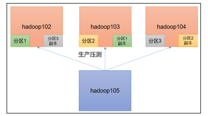
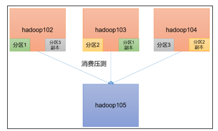

 

# Kafka快速入门

##  安装部署

###  集群规划

| hadoop102 | hadoop103 | hadoop104 |
| --------- | --------- | --------- |
| zk        | zk        | zk        |
| kafka     | kafka     | kafka     |

###  jar包下载

http://kafka.apache.org/downloads

###  集群部署

**1** **）解压安装包**

```
[atguigu@hadoop102 software]$ tar -zxvf kafka_2.11-2.4.1.tgz -C /opt/module/
```

**2** **）修改解压后的文件名称**

```
[atguigu@hadoop102 module]$ mv kafka_2.11-2.4.1/ kafka
```

**3** **）在/opt/module/kafka****目录下创建logs****文件夹**

```
[atguigu@hadoop102 kafka]$ mkdir logs
```

**4** **）修改配置文件**

```
[atguigu@hadoop102 kafka]$ cd config/

[atguigu@hadoop102 config]$ vi server.properties
```

修改或者增加以下内容：

\#broker的全局唯一编号，不能重复

```
broker.id=0
```

\#删除topic功能使能

```
delete.topic.enable=true
```

\#kafka运行日志存放的路径

```
log.dirs=/opt/module/kafka/data
```

\#配置连接Zookeeper集群地址

```
zookeeper.connect=hadoop102:2181,hadoop103:2181,hadoop104:2181/kafka
```

**5** **）配置环境变量**

```
[atguigu@hadoop102 module]$ sudo vi /etc/profile.d/my_env.sh

#KAFKA_HOME
export KAFKA_HOME=/opt/module/kafka
export PATH=$PATH:$KAFKA_HOME/bin

[atguigu@hadoop102 module]$ source /etc/profile.d/my_env.sh
```

**6** **）分发安装包**

```
[atguigu@hadoop102 module]$ xsync kafka/
```

注意：分发之后记得配置其他机器的环境变量

**7** **）分别在hadoop103** **和hadoop104** **上修改配置文件/opt/module/kafka/config/server.properties** **中的broker.id=1** **、broker.id=2**

注：broker.id不得重复

**8** **）启动集群**

依次在hadoop102、hadoop103、hadoop104节点上启动kafka

```
[atguigu@hadoop102 kafka]$ bin/kafka-server-start.sh -daemon /opt/module/kafka/config/server.properties

[atguigu@hadoop103 kafka]$ bin/kafka-server-start.sh -daemon  /opt/module/kafka/config/server.properties

[atguigu@hadoop104 kafka]$ bin/kafka-server-start.sh -daemon  /opt/module/kafka/config/server.properties
```

**9** **）关闭集群**

```
[atguigu@hadoop102 kafka]$ bin/kafka-server-stop.sh

[atguigu@hadoop103 kafka]$ bin/kafka-server-stop.sh

[atguigu@hadoop104 kafka]$ bin/kafka-server-stop.sh
```

### Kafka集群启动停止脚本

（1）在/home/atguigu/bin目录下创建脚本kf.sh

```
[atguigu@hadoop102 bin]$ vim kf.sh
```

​    在脚本中填写如下内容

```sh
#! /bin/bash

case $1 in

"start"){
  for i in hadoop102 hadoop103 hadoop104
  do
    echo " --------启动 $i Kafka-------"
    ssh $i "/opt/module/kafka/bin/kafka-server-start.sh -daemon /opt/module/kafka/config/server.properties"
  done
};;

"stop"){
  for i in hadoop102 hadoop103 hadoop104
  do
    echo " --------停止 $i Kafka-------"
    ssh $i "/opt/module/kafka/bin/kafka-server-stop.sh stop"
  done
};;

esac
```

（2）增加脚本执行权限

```
[atguigu@hadoop102 bin]$ chmod u+x kf.sh
```

（3）kf集群启动脚本

```
[atguigu@hadoop102 module]$ kf.sh start
```

（4）kf集群停止脚本

```
[atguigu@hadoop102 module]$ kf.sh stop
```


###  Kafka常用命令

**1** **）查看Kafka Topic ** **列表**

```
[atguigu@hadoop102 kafka]$ bin/kafka-topics.sh --zookeeper hadoop102:2181/kafka --list
```

**2** **）创建Kafka Topic**

进入到/opt/module/kafka/目录下创建日志主题

```
[atguigu@hadoop102 kafka]$ bin/kafka-topics.sh --zookeeper hadoop102:2181,hadoop103:2181,hadoop104:2181/kafka --create --replication-factor 1 --partitions 1 --topic topic_log
```

**3** **）删除Kafka Topic**

```
[atguigu@hadoop102 kafka]$ bin/kafka-topics.sh --delete --zookeeper hadoop102:2181,hadoop103:2181,hadoop104:2181/kafka --topic topic_log
```

**4** **）Kafka** **生产消息**

```sh
[atguigu@hadoop102 kafka]$ bin/kafka-console-producer.sh \
--broker-list hadoop102:9092 --topic topic_log
>hello world
>atguigu atguigu
```

**5** **）Kafka** **消费消息**

```sh
[atguigu@hadoop102 kafka]$ bin/kafka-console-consumer.sh \
--bootstrap-server hadoop102:9092 --from-beginning --topic topic_log
```

--from-beginning：会把主题中以往所有的数据都读取出来。根据业务场景选择是否增加该配置。

**6** **）查看Kafka Topic** **详情**

```sh
[atguigu@hadoop102 kafka]$ bin/kafka-topics.sh --zookeeper hadoop102:2181/kafka \
--describe --topic topic_log
```


###  Kafka机器数量计算

Kafka机器数量（经验公式）= 2 *（峰值生产速度 * 副本数 / 100）+ 1

先拿到峰值生产速度，再根据设定的副本数，就能预估出需要部署Kafka的数量。

1）峰值生产速度

峰值生产速度可以压测得到。

2）副本数

副本数默认是1个，在企业里面2-3个都有，2个居多。

副本多可以提高可靠性，但是会降低网络传输效率。

比如我们的峰值生产速度是50M/s。副本数为2。

Kafka机器数量 = 2 *（50 * 2 / 100）+ 1 = 3台

### Kafka压力测试

**1** **）** **Kafka** **压测**

用Kafka官方自带的脚本，对Kafka进行压测。

kafka-consumer-perf-test.sh

kafka-producer-perf-test.sh

Kafka压测时，在硬盘读写速度一定的情况下，可以查看到哪些地方出现了瓶颈（CPU，内存，网络IO）。一般都是网络IO达到瓶颈。 

**2** **）** **Kafka Producer** **压力测试**       

                            

​    （0）压测环境准备

​        ①hadoop102、hadoop103、hadoop104的网络带宽都设置为100mbps。

​        ②关闭hadoop102主机，并根据hadoop102克隆出hadoop105（修改IP和主机名称）

​        ③hadoop105的带宽不设限

​        ④创建一个test topic，设置为3个分区2个副本

```sh
[atguigu@hadoop102 kafka]$ bin/kafka-topics.sh --zookeeper hadoop102:2181,hadoop103:2181,hadoop104:2181/kafka --create --replication-factor 2 --partitions 3 --topic test
```

（1）在/opt/module/kafka/bin目录下面有这两个文件。我们来测试一下

```sh
[atguigu@hadoop102 kafka]$ bin/kafka-producer-perf-test.sh --topic test --record-size 100 --num-records 10000000 --throughput -1 --producer-props bootstrap.servers=hadoop102:9092,hadoop103:9092,hadoop104:9092
```

说明：

record-size是一条信息有多大，单位是字节。

num-records是总共发送多少条信息。

throughput 是每秒多少条信息，设成-1，表示不限流，尽可能快的生产数据，可测出生产者最大吞吐量。

（2）Kafka会打印下面的信息

```sh
699884 records sent, 139976.8 records/sec (13.35 MB/sec), 1345.6 ms avg latency, 2210.0 ms max latency.

713247 records sent, 141545.3 records/sec (13.50 MB/sec), 1577.4 ms avg latency, 3596.0 ms max latency.

773619 records sent, 153862.2 records/sec (14.67 MB/sec), 2326.8 ms avg latency, 4051.0 ms max latency.

773961 records sent, 154206.2 records/sec (15.71 MB/sec), 1964.1 ms avg latency, 2917.0 ms max latency.

776970 records sent, 154559.4 records/sec (15.74 MB/sec), 1960.2 ms avg latency, 2922.0 ms max latency.

776421 records sent, 154727.2 records/sec (15.76 MB/sec), 1960.4 ms avg latency, 2954.0 ms max latency.
```

参数解析：Kafka的吞吐量15m/s左右是否符合预期呢？

hadoop102、hadoop103、hadoop104三台集群的网络总带宽30m/s左右，由于是两个副本，所以Kafka的吞吐量30m/s ➗ 2（副本） = 15m/s 

**结论：网络带宽和副本都会影响吞吐量。**

（4）调整batch.size

**batch.size默认值是16k。**

batch.size较小，会降低吞吐量。比如说，批次大小为0则完全禁用批处理，会一条一条发送消息）；

batch.size过大，会增加消息发送延迟。比如说，Batch设置为64k，但是要等待5秒钟Batch才凑满了64k，才能发送出去。那这条消息的延迟就是5秒钟。

```sh
[atguigu@hadoop102 kafka]$ bin/kafka-producer-perf-test.sh --topic test --record-size 100 --num-records 10000000 --throughput -1 --producer-props bootstrap.servers=hadoop102:9092,hadoop103:9092,hadoop104:9092 batch.size=500
```

输出结果

```sh
69169 records sent, 13833.8 records/sec (1.32 MB/sec), 2517.6 ms avg latency, 4299.0 ms max latency.

105372 records sent, 21074.4 records/sec (2.01 MB/sec), 6748.4 ms avg latency, 9016.0 ms max latency.

113188 records sent, 22637.6 records/sec (2.16 MB/sec), 11348.0 ms avg latency, 13196.0 ms max latency.

108896 records sent, 21779.2 records/sec (2.08 MB/sec), 12272.6 ms avg latency, 12870.0 ms max latency.
```

（5）linger.ms

如果设置batch size为64k，但是比如过了10分钟也没有凑够64k，怎么办？

可以设置，linger.ms。比如linger.ms=5ms，那么就是要发送的数据没有到64k，5ms后，数据也会发出去。

（6）总结

同时设置batch.size和 linger.ms，就是哪个条件先满足就都会将消息发送出去

Kafka需要考虑高吞吐量与延时的平衡。

**3** **）** **Kafka Consumer** **压力测试**

​     

（1）Consumer的测试，如果这四个指标（IO，CPU，内存，网络）都不能改变，考虑增加分区数来提升性能。

```sh
[atguigu@hadoop102 kafka]$ bin/kafka-consumer-perf-test.sh --broker-list hadoop102:9092,hadoop103:9092,hadoop104:9092 --topic test --fetch-size 10000 --messages 10000000 --threads 1
```

①参数说明：

--broker-list指定Kafka集群地址

--topic 指定topic的名称

--fetch-size 指定每次fetch的数据的大小

--messages 总共要消费的消息个数

②测试结果说明：

start.time, end.time, data.consumed.in.MB, **MB.sec,** data.consumed.in.nMsg**, nMsg.sec**

2021-08-03 21:17:21:778, 2021-08-03 21:18:19:775, 514.7169, 8.8749, 5397198, 93059.9514

**开始测试时间，测试结束数据，共消费数据**514.7169MB，吞吐量8.8749**MB/s**

（2）调整fetch-size

①增加fetch-size值，观察消费吞吐量。

```sh
[atguigu@hadoop102 kafka]$ bin/kafka-consumer-perf-test.sh --broker-list hadoop102:9092,hadoop103:9092,hadoop104:9092 --topic test --fetch-size 100000 --messages 10000000 --threads 1
```

②测试结果说明：

start.time, end.time, data.consumed.in.MB, **MB.sec,** data.consumed.in.nMsg**, nMsg.sec**

2021-08-03 21:22:57:671, 2021-08-03 21:23:41:938, 514.7169, 11.6276, 5397198, 121923.7355

（3）总结

吞吐量受网络带宽和fetch-size的影响

### Kafka分区数计算

（1）创建一个只有1个分区的topic

（2）测试这个topic的producer吞吐量和consumer吞吐量。

（3）假设他们的值分别是Tp和Tc，单位可以是MB/s。

（4）然后假设总的目标吞吐量是Tt，那么分区数 = Tt / min（Tp，Tc）

例如：producer吞吐量 = 20m/s；consumer吞吐量 = 50m/s，期望吞吐量100m/s；

分区数 = 100 / 20 = 5分区

https://blog.csdn.net/weixin_42641909/article/details/89294698

分区数一般设置为：3-10个