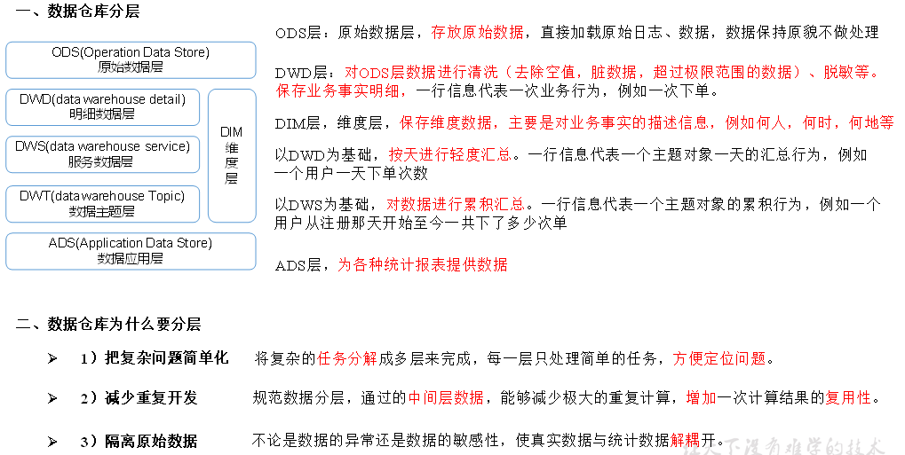
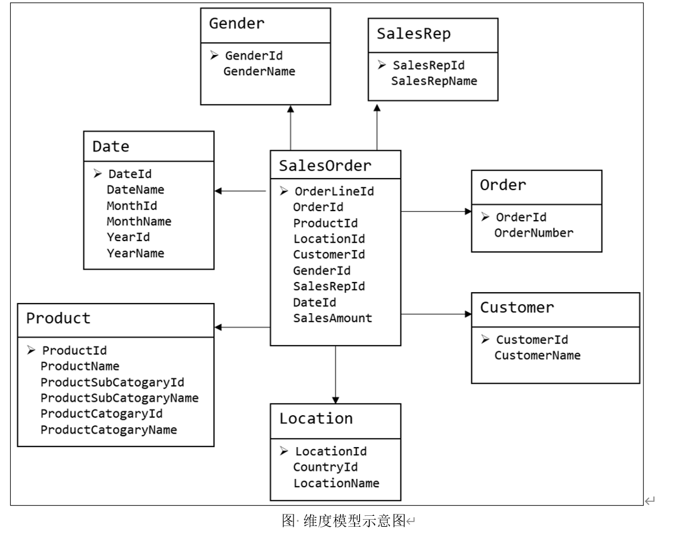
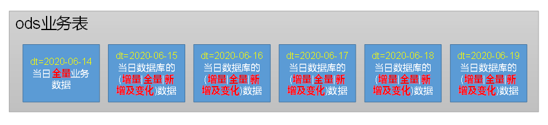
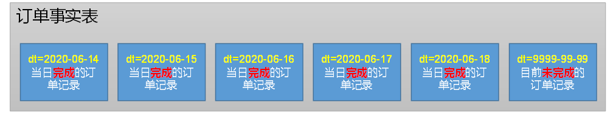

第1章 数仓分层

## 1.1 为什么要分层

​                               



## 1.2 数仓命名规范

### 1.2.1 表命名

Ø ODS层命名为ods_表名

Ø DIM层命名为dim_表名

Ø DWD层命名为dwd_表名

Ø DWS层命名为dws_表名  

Ø DWT层命名为dwt_表名

Ø ADS层命名为ads_表名

Ø 临时表命名为tmp_表名

### 1.2.2 脚本命名

Ø 数据源_to_目标_db/log.sh

Ø 用户行为脚本以log为后缀；业务数据脚本以db为后缀。


### 1.2.3 表字段类型

Ø 数量类型为bigint

Ø 金额类型为decimal(16, 2)，表示：16位有效数字，其中小数部分2位

Ø 字符串(名字，描述信息等)类型为string

Ø 主键外键类型为string

Ø 时间戳类型为bigint

# 第2章 数仓理论

## 2.1 范式理论

### 2.1.1 范式概念

1）定义

数据建模必须遵循一定的规则，在关系建模中，这种规则就是范式。

2）目的

采用范式，可以降低数据的冗余性。

为什么要降低数据冗余性？

（1）十几年前，磁盘很贵，为了减少磁盘存储。

（2）以前没有分布式系统，都是单机，只能增加磁盘，磁盘个数也是有限的

（3）一次修改，需要修改多个表，很难保证数据一致性

3）缺点

范式的缺点是获取数据时，需要通过Join拼接出最后的数据。

4）分类

目前业界范式有：第一范式(1NF)、第二范式(2NF)、第三范式(3NF)、巴斯-科德范式(BCNF)、第四范式(4NF)、第五范式(5NF)。 

### 2.1.2 三范式区分


## 2.2 关系建模与维度建模

关系建模和维度建模是两种数据仓库的建模技术。关系建模由Bill Inmon所倡导，维度建模由Ralph Kimball所倡导。

### 2.2.1 关系建模

关系建模将复杂的数据抽象为两个概念——实体和关系，并使用规范化的方式表示出来。关系模型如图所示，从图中可以看出，较为松散、零碎，物理表数量多。


关系模型严格遵循第三范式（3NF），数据冗余程度低，数据的一致性容易得到保证。由于数据分布于众多的表中，查询会相对复杂，在大数据的场景下，查询效率相对较低。

### 2.2.2 维度建模

维度模型如图所示，从图中可以看出，模型相对清晰、简洁。 



维度模型以数据分析作为出发点，不遵循三范式，故数据存在一定的冗余。维度模型面向业务，将业务用事实表和维度表呈现出来。表结构简单，故查询简单，查询效率较高。

## 2.3 维度表和事实表（重点）

### 2.3.1 维度表

**维度表**：一般是对事实的**描述信息**。每一张维表对应现实世界中的一个对象或者概念。  例如：用户、商品、日期、地区等。

**维表的特征：**

Ø 维表的范围很宽（具有多个属性、列比较多）

Ø 跟事实表相比，行数相对较小：通常< 10万条

Ø 内容相对固定：编码表

时间维度表：

| 日期ID     | day of week | day of year | 季度 | 节假日 |
| ---------- | ----------- | ----------- | ---- | ------ |
| 2020-01-01 | 2           | 1           | 1    | 元旦   |
| 2020-01-02 | 3           | 2           | 1    | 无     |
| 2020-01-03 | 4           | 3           | 1    | 无     |
| 2020-01-04 | 5           | 4           | 1    | 无     |
| 2020-01-05 | 6           | 5           | 1    | 无     |

### 2.3.2 事实表

**事实表中的** **每行数据代表一个业务事件（下单、支付、退款、评价等）**。“事实”这个术语表示的是业务事件的**度量值（可统计次数、个数、金额等）**，例如，2020年5月21日，宋宋老师在京东花了250块钱买了一瓶海狗人参丸。维度表：时间、用户、商品、商家。事实表：250块钱、一瓶

每一个事实表的行包括：具有可加性的数值型的度量值、与维表相连接的外键，通常具有两个和两个以上的外键。

事实表的特征：

Ø 非常的大

Ø 内容相对的窄：列数较少（主要是外键id和度量值）

Ø 经常发生变化，每天会新增加很多。

**1** **）事务型事实表**

以**每个事务或事件为单位**，例如一个销售订单记录，一笔支付记录等，作为事实表里的一行数据。一旦事务被提交，事实表数据被插入，数据就不再进行更改，其更新方式为增量更新。

**2** **）周期型快照事实表**

周期型快照事实表中**不会保留所有数据**，**只保留固定时间间隔的数据**，例如每天或者每月的销售额，或每月的账户余额等。

例如购物车，有加减商品，随时都有可能变化，但是我们更关心每天结束时这里面有多少商品，方便我们后期统计分析。

**3** **）累积型快照事实表**

**累计快照事实表用于跟踪业务事实的变化。**例如，数据仓库中可能需要累积或者存储订单从下订单开始，到订单商品被打包、运输、和签收的各个业务阶段的时间点数据来跟踪订单声明周期的进展情况。当这个业务过程进行时，事实表的记录也要不断更新。

| **订单id** | **用户id** | **下单时间** | **打包时间** | **发货时间** | **签收时间** | **订单金额** |
| ---------- | ---------- | ------------ | ------------ | ------------ | ------------ | ------------ |
|            |            | 3-8          | 3-8          | 3-9          | 3-10         |              |

## 2.4 维度模型分类

在维度建模的基础上又分为三种模型：星型模型、雪花模型、星座模型。

​                               

 

## 2.5 数据仓库建模（绝对重点）

### 2.5.1 ODS层

1）HDFS用户行为数据

​                                   

2）HDFS业务数据


3）针对HDFS上的用户行为数据和业务数据，我们如何规划处理？

（1）保持数据原貌不做任何修改，起到备份数据的作用。

（2）数据采用压缩，减少磁盘存储空间（例如：原始数据100G，可以压缩到10G左右）

（3）创建分区表，防止后续的全表扫描

### 2.5.2 DIM层和DWD层

DIM层DWD层需构建维度模型，一般采用星型模型，呈现的状态一般为星座模型。

维度建模一般按照以下四个步骤：

**选择业务过程→声明粒度→确认维度→确认事实**

**（1** **）选择业务过程**

在业务系统中，挑选我们感兴趣的业务线，比如下单业务，支付业务，退款业务，物流业务，一条业务线对应一张事实表。

**（2** **）声明粒度**

数据粒度指数据仓库的数据中保存数据的细化程度或综合程度的级别。

声明粒度意味着精确定义事实表中的一行数据表示什么，应该尽可能选择**最小粒度**，以此来应各种各样的需求。

**典型的粒度声明如下：**

订单事实表中一行数据表示的是一个订单中的一个商品项。

支付事实表中一行数据表示的是一个支付记录。

**（3** **）确定维度**

维度的主要作用是描述业务是事实，主要表示的是“谁，何处，何时”等信息。

确定维度的原则是：后续需求中是否要分析相关维度的指标。例如，需要统计，什么时间下的订单多，哪个地区下的订单多，哪个用户下的订单多。需要确定的维度就包括：时间维度、地区维度、用户维度。

**（4** **）确定事实**

此处的“事实”一词，指的是业务中的度量值（次数、个数、件数、金额，可以进行累加），例如订单金额、下单次数等。

在DWD层，以**业务过程**为建模驱动，基于每个具体业务过程的特点，构建**最细粒度**的明细层事实表。事实表可做适当的宽表化处理。

事实表和维度表的关联比较灵活，但是为了应对更复杂的业务需求，可以将能关联上的表尽量关联上。

|                | **时间** | **用户** | **地区** | **商品** | **优惠券** | **活动** | **度量值**                      |
| -------------- | -------- | -------- | -------- | -------- | ---------- | -------- | ------------------------------- |
| **订单**       | √        | √        | √        |          |            |          | 运费/优惠金额/原始金额/最终金额 |
| **订单详情**   | √        | √        | √        | √        | √          | √        | 件数/优惠金额/原始金额/最终金额 |
| **支付**       | √        | √        | √        |          |            |          | 支付金额                        |
| **加购**       | √        | √        |          | √        |            |          | 件数/金额                       |
| **收藏**       | √        | √        |          | √        |            |          | 次数                            |
| **评价**       | √        | √        |          | √        |            |          | 次数                            |
| **退单**       | √        | √        | √        | √        |            |          | 件数/金额                       |
| **退款**       | √        | √        | √        | √        |            |          | 件数/金额                       |
| **优惠券领用** | √        | √        |          |          | √          |          | 次数                            |

至此，数据仓库的维度建模已经完毕，DWD层是以业务过程为驱动。

DWS层、DWT层和ADS层都是以需求为驱动，和维度建模已经没有关系了。

DWS和DWT都是建宽表，按照主题去建表。主题相当于观察问题的角度。对应着维度表。

### 2.5.3 DWS层与DWT层

DWS层和DWT层统称宽表层，这两层的设计思想大致相同，通过以下案例进行阐述。

1）问题引出：两个需求，统计每个省份订单的个数、统计每个省份订单的总金额

2）处理办法：都是将省份表和订单表进行join，group by省份，然后计算。同样数据被计算了两次，实际上类似的场景还会更多。

​    那怎么设计能避免重复计算呢？

针对上述场景，可以设计一张地区宽表，其主键为地区ID，字段包含为：下单次数、下单金额、支付次数、支付金额等。上述所有指标都统一进行计算，并将结果保存在该宽表中，这样就能有效避免数据的重复计算。

3）总结：

（１）需要建哪些宽表：以维度为基准。

（２）宽表里面的字段：是站在不同维度的角度去看事实表，重点关注事实表聚合后的度量值。

（３）DWS和DWT层的区别：DWS层存放的所有主题对象当天的汇总行为，例如每个地区当天的下单次数，下单金额等，DWT层存放的是所有主题对象的累积行为，例如每个地区最近７天（１５天、３０天、６０天）的下单次数、下单金额等。

### 2.5.4 ADS层

​    对电商系统各大主题指标分别进行分析。

# 第3章 数仓环境搭建

## 3.1 Hive环境搭建

**3.1.1 Hive** **引擎简介**

​    Hive引擎包括：默认MR、tez、spark

Hive on Spark：Hive既作为存储元数据又负责SQL的解析优化，**语法是HQL语法**，执行引擎变成了Spark，Spark负责采用RDD执行。

Spark on Hive : Hive只作为存储元数据，Spark负责SQL解析优化，**语法是Spark SQL语法**，Spark负责采用RDD执行。

**3.1.2 Hive on Spark** **配置**

**1** **）兼容性说明**

注意：官网下载的Hive3.1.2和Spark3.0.0默认是不兼容的。因为Hive3.1.2支持的Spark版本是2.4.5，所以需要我们**重新编译Hive3.1.2版本**。

编译步骤：官网下载Hive3.1.2源码，修改pom文件中引用的Spark版本为3.0.0，如果编译通过，直接打包获取jar包。如果报错，就根据提示，修改相关方法，直到不报错，打包获取jar包。

**2** **）在Hive** **所在节点部署Spark**

如果之前已经部署了Spark，则该步骤可以跳过，但要检查SPARK_HOME的环境变量配置是否正确。

（1）Spark官网下载jar包地址：

http://spark.apache.org/downloads.html

（2）上传并解压解压spark-3.0.0-bin-hadoop3.2.tgz

```sh
[atguigu@hadoop102 software]$ tar -zxvf spark-3.0.0-bin-hadoop3.2.tgz -C /opt/module/

[atguigu@hadoop102 software]$ mv /opt/module/spark-3.0.0-bin-hadoop3.2 /opt/module/spark
```

（3）配置SPARK_HOME环境变量

```sh
[atguigu@hadoop102 software]$ sudo vim /etc/profile.d/my_env.sh
```

添加如下内容

\

```sh
# SPARK_HOME

export SPARK_HOME=/opt/module/spark

export PATH=$PATH:$SPARK_HOME/bin
```

source 使其生效

```sh
[atguigu@hadoop102 software]$ source /etc/profile.d/my_env.sh
```

**３）在hive** **中创建spark** **配置文件**

```sh
[atguigu@hadoop102 software]$ vim /opt/module/hive/conf/spark-defaults.conf
```

添加如下内容（在执行任务时，会根据如下参数执行）

```conf
spark.master                yarn
spark.eventLog.enabled          true
spark.eventLog.dir            hdfs://hadoop102:8020/spark-history
spark.executor.memory          1g
spark.driver.memory          1g
```

在HDFS创建如下路径，用于存储历史日志

```sh
[atguigu@hadoop102 software]$ hadoop fs -mkdir /spark-history
```

**４）向HDFS** **上传Spark** **纯净版jar** **包**

​    说明1：由于Spark3.0.0非纯净版默认支持的是hive2.3.7版本，直接使用会和安装的Hive3.1.2出现兼容性问题。所以采用Spark纯净版jar包，不包含hadoop和hive相关依赖，避免冲突。

​    说明2：Hive任务最终由Spark来执行，Spark任务资源分配由Yarn来调度，该任务有可能被分配到集群的任何一个节点。所以需要将Spark的依赖上传到HDFS集群路径，这样集群中任何一个节点都能获取到。

（1）上传并解压spark-3.0.0-bin-without-hadoop.tgz

```sh
[atguigu@hadoop102 software]$ tar -zxvf /opt/software/spark-3.0.0-bin-without-hadoop.tgz
```

（2）上传Spark纯净版jar包到HDFS

```sh
[atguigu@hadoop102 software]$ hadoop fs -mkdir /spark-jars

[atguigu@hadoop102 software]$ hadoop fs -put spark-3.0.0-bin-without-hadoop/jars/* /spark-jars
```

**５）修改hive-site.xml** **文件**

```sh
[atguigu@hadoop102 ~]$ vim /opt/module/hive/conf/hive-site.xml
```

添加如下内容

```xml
<!--Spark依赖位置（注意：端口号8020必须和namenode的端口号一致）-->
<property>
  <name>spark.yarn.jars</name>
  <value>hdfs://hadoop102:8020/spark-jars/*</value>
</property>
 
<!--Hive执行引擎-->
<property>
  <name>hive.execution.engine</name>
  <value>spark</value>
</property>
```

**3.1.3 Hive on Spark** **测试**

（1）启动hive客户端

```sh
[atguigu@hadoop102 hive]$ bin/hive
```

（2）创建一张测试表

```sh
hive (default)> create table student(id int, name string);
```

（3）通过insert测试效果

```sh
hive (default)> insert into table student values(1,'abc');
```

若结果如下，则说明配置成功


## 3.2 Yarn配置

### 3.2.1 增加ApplicationMaster资源比例

容量调度器对每个资源队列中同时运行的Application Master占用的资源进行了限制，该限制通过*yarn.scheduler.capacity.maximum-am-resource-percent*参数实现，其默认值是0.1，表示每个资源队列上Application Master最多可使用的资源为该队列总资源的10%，目的是防止大部分资源都被Application Master占用，而导致Map/Reduce Task无法执行。

生产环境该参数可使用默认值。但学习环境，集群资源总数很少，如果只分配10%的资源给Application Master，则可能出现，同一时刻只能运行一个Job的情况，因为一个Application Master使用的资源就可能已经达到10%的上限了。故此处可将该值适当调大。

（1）在hadoop102的*/opt/module/hadoop-3.1.3/etc/hadoop/capacity-scheduler.xml*文件中**修改**如下参数值

```xml
[atguigu@hadoop102 hadoop]$ vim capacity-scheduler.xml

<property>

  <name>yarn.scheduler.capacity.maximum-am-resource-percent</name>

  <value>0.8</value>

</property
```

（2）分发capacity-scheduler.xml配置文件

```sh
[atguigu@hadoop102 hadoop]$ xsync capacity-scheduler.xml
```

（3）关闭正在运行的任务，重新启动yarn集群

```sh
[atguigu@hadoop103 hadoop-3.1.3]$ sbin/stop-yarn.sh

[atguigu@hadoop103 hadoop-3.1.3]$ sbin/start-yarn.sh
```


## 3.3 数仓开发环境

数仓开发工具可选用DBeaver或者DataGrip。两者都需要用到JDBC协议连接到Hive，故需要启动HiveServer2。

**1.** **启动HiveServer2**

```sh
[atguigu@hadoop102 hive]$ hiveserver2
```

**2.** **配置DataGrip** **连接**

**1** **）创建连接**


**2** **）配置连接属性**

所有属性配置，和Hive的beeline客户端配置一致即可。初次使用，配置过程会提示缺少JDBC驱动，按照提示下载即可。

**3.** **测试使用**

**创建数据库gmall** **，并观察是否创建成功。**

**1** **）创建数据库**

**2** **）查看数据库**

**3** **）修改连接，指明连接数据库**

**4** **）选择当前数据库为gmall**

## 3.4 数据准备

一般企业在搭建数仓时，业务系统中会存在一定的历史数据，此处为模拟真实场景，需准备若干历史数据。假定数仓上线的日期为2020-06-14，具体说明如下。 

**1.** **用户行为日志**

用户行为日志，一般是没有历史数据的，故日志只需要准备2020-06-14一天的数据。具体操作如下：

1）启动日志采集通道，包括Flume、Kafak等

2）修改两个日志服务器（hadoop102、hadoop103）中的/opt/module/applog/application.yml配置文件，将mock.date参数改为2020-06-14。

3）执行日志生成脚本lg.sh。

4）观察HDFS是否出现相应文件。

​                               

**2.** **业务数据**

业务数据一般存在历史数据，此处需准备2020-06-10至2020-06-14的数据。具体操作如下。

1）修改hadoop102节点上的/opt/module/db_log/application.properties文件，将mock.date、mock.clear，mock.clear.user三个参数调整为如图所示的值。

 

2）执行模拟生成业务数据的命令，生成第一天2020-06-10的历史数据。

```sh
[atguigu@hadoop102 db_log]$ java -jar gmall2020-mock-db-2021-01-22.jar
```

3）修改*/opt/module/db_log/application.properties*文件，将mock.date、mock.clear，mock.clear.user三个参数调整为如图所示的值。

 

4）执行模拟生成业务数据的命令，生成第二天2020-06-11的历史数据。

```sh
[atguigu@hadoop102 db_log]$ java -jar gmall2020-mock-db-2021-01-22.jar
```

5）之后只修改/opt/module/db_log/application.properties文件中的mock.date参数，依次改为2020-06-12，2020-06-13，2020-06-14，并分别生成对应日期的数据。

6）执行mysql_to_hdfs_init.sh脚本，将模拟生成的业务数据同步到HDFS。

```sh
[atguigu@hadoop102 bin]$ mysql_to_hdfs_init.sh all 2020-06-14
```

7）观察HDFS上是否出现相应的数据

# 第4章 数仓搭建-ODS层

1）保持数据原貌不做任何修改，起到备份数据的作用。

2）数据采用LZO压缩，减少磁盘存储空间。100G数据可以压缩到10G以内。

3）创建分区表，防止后续的全表扫描，在企业开发中大量使用分区表。

4）创建外部表。在企业开发中，除了自己用的临时表，创建内部表外，绝大多数场景都是创建外部表。

## 4.1 ODS层（用户行为数据）

### 4.1.1 创建日志表ods_log

1）创建支持lzo压缩的分区表

（1）建表语句

```sql
hive (gmall)> 

drop table if exists ods_log;

CREATE EXTERNAL TABLE ods_log (`line` string)

PARTITIONED BY (`dt` string) -- 按照时间创建分区

STORED AS -- 指定存储方式，读数据采用LzoTextInputFormat；

 INPUTFORMAT 'com.hadoop.mapred.DeprecatedLzoTextInputFormat'

 OUTPUTFORMAT 'org.apache.hadoop.hive.ql.io.HiveIgnoreKeyTextOutputFormat'

LOCATION '/warehouse/gmall/ods/ods_log' -- 指定数据在hdfs上的存储位置

;
```

说明Hive的LZO压缩：https://cwiki.apache.org/confluence/display/Hive/LanguageManual+LZO

（2）分区规划

​                             

2）加载数据

 

```sql
hive (gmall)> 

load data inpath '/origin_data/gmall/log/topic_log/2020-06-14' into table ods_log partition(dt='2020-06-14');
```

注意：时间格式都配置成YYYY-MM-DD格式，这是Hive默认支持的时间格式

3）为lzo压缩文件创建索引

```sh
[atguigu@hadoop102 bin]$ hadoop jar /opt/module/hadoop-3.1.3/share/hadoop/common/hadoop-lzo-0.4.20.jar com.hadoop.compression.lzo.DistributedLzoIndexer /warehouse/gmall/ods/ods_log/dt=2020-06-14
```


### 4.1.2 Shell中单引号和双引号区别

1）在/home/atguigu/bin创建一个test.sh文件

```sh
[atguigu@hadoop102 bin]$ vim test.sh 
```

在文件中添加如下内容

```sh
#!/bin/bash

do_date=$1 

echo '$do_date'

echo "$do_date"

echo "'$do_date'"

echo '"$do_date"'

echo `date
```

2）查看执行结果

```sh
[atguigu@hadoop102 bin]$ test.sh 2020-06-14

$do_date
2020-06-14
'2020-06-14'
"$do_date"
```

2020年 06月 18日 星期四 21:02:08 CST

3）总结：

（1）单引号不取变量值

（2）双引号取变量值

（3）反引号`，执行引号中命令

（4）双引号内部嵌套单引号，取出变量值

（5）单引号内部嵌套双引号，不取出变量值

### 4.1.3 ODS层日志表加载数据脚本

**1** **）编写脚本**

（1）在hadoop102的/home/atguigu/bin目录下创建脚本

```sh
[atguigu@hadoop102 bin]$ vim hdfs_to_ods_log.sh
```

​    在脚本中编写如下内容

```sh
#!/bin/bash

# 定义变量方便修改
APP=gmall
# 如果是输入的日期按照取输入日期；如果没输入日期取当前时间的前一天

if [ -n "$1" ] ;then
  do_date=$1
else 
  do_date=`date -d "-1 day" +%F`
fi  

echo ================== 日志日期为 $do_date ==================
sql="
load data inpath '/origin_data/$APP/log/topic_log/$do_date' into table ${APP}.ods_log partition(dt='$do_date');"

hive -e "$sql"

hadoop jar /opt/module/hadoop-3.1.3/share/hadoop/common/hadoop-lzo-0.4.20.jar com.hadoop.compression.lzo.DistributedLzoIndexer /warehouse/$APP/ods/ods_log/dt=$do_date
```

（1）说明1：

**[ -n 变量值 ] 判断变量的值，是否为空**

-- 变量的值，非空，返回true

-- 变量的值，为空，返回false

**注意：[ -n 变量值 ]不会解析数据，使用[ -n 变量值 ]时，需要对变量加上双引号(" ")**

（2）说明2：

查看date命令的使用，date --help

（2）增加脚本执行权限

```
[atguigu@hadoop102 bin]$ chmod 777 hdfs_to_ods_log.sh
```

2）脚本使用

（1）执行脚本

```sh
[atguigu@hadoop102 module]$ hdfs_to_ods_log.sh 2020-06-14
```

（2）查看导入数据

## 4.2 ODS层（业务数据）

ODS层业务表分区规划如下



ODS层业务表数据装载思路如下


### 4.2.1 活动信息表

```sql
DROP TABLE IF EXISTS ods_activity_info;

CREATE EXTERNAL TABLE ods_activity_info(

  `id` STRING COMMENT '编号',

  `activity_name` STRING COMMENT '活动名称',

  `activity_type` STRING COMMENT '活动类型',

  `start_time` STRING COMMENT '开始时间',

  `end_time` STRING COMMENT '结束时间',

  `create_time` STRING COMMENT '创建时间'

) COMMENT '活动信息表'

PARTITIONED BY (`dt` STRING)

ROW FORMAT DELIMITED FIELDS TERMINATED BY '\t'

STORED AS

 INPUTFORMAT 'com.hadoop.mapred.DeprecatedLzoTextInputFormat'

 OUTPUTFORMAT 'org.apache.hadoop.hive.ql.io.HiveIgnoreKeyTextOutputFormat'

LOCATION '/warehouse/gmall/ods/ods_activity_info/';
```


### 4.2.2 活动规则表

```sql
DROP TABLE IF EXISTS ods_activity_rule;

CREATE EXTERNAL TABLE ods_activity_rule(

  `id` STRING COMMENT '编号',

  `activity_id` STRING COMMENT '活动ID',

  `activity_type` STRING COMMENT '活动类型',

  `condition_amount` DECIMAL(16,2) COMMENT '满减金额',

  `condition_num` BIGINT COMMENT '满减件数',

  `benefit_amount` DECIMAL(16,2) COMMENT '优惠金额',

  `benefit_discount` DECIMAL(16,2) COMMENT '优惠折扣',

  `benefit_level` STRING COMMENT '优惠级别'

) COMMENT '活动规则表'

PARTITIONED BY (`dt` STRING)

ROW FORMAT DELIMITED FIELDS TERMINATED BY '\t'

STORED AS

 INPUTFORMAT 'com.hadoop.mapred.DeprecatedLzoTextInputFormat'

 OUTPUTFORMAT 'org.apache.hadoop.hive.ql.io.HiveIgnoreKeyTextOutputFormat'

LOCATION '/warehouse/gmall/ods/ods_activity_rule/';
```


### 4.2.3 一级品类表

```sql
DROP TABLE IF EXISTS ods_base_category1;

CREATE EXTERNAL TABLE ods_base_category1(

  `id` STRING COMMENT 'id',

  `name` STRING COMMENT '名称'

) COMMENT '商品一级分类表'

PARTITIONED BY (`dt` STRING)

ROW FORMAT DELIMITED FIELDS TERMINATED BY '\t'

STORED AS

 INPUTFORMAT 'com.hadoop.mapred.DeprecatedLzoTextInputFormat'

 OUTPUTFORMAT 'org.apache.hadoop.hive.ql.io.HiveIgnoreKeyTextOutputFormat'

LOCATION '/warehouse/gmall/ods/ods_base_category1/';
```


### 4.2.4 二级品类表

```sql
DROP TABLE IF EXISTS ods_base_category2;

CREATE EXTERNAL TABLE ods_base_category2(

  `id` STRING COMMENT ' id',

  `name` STRING COMMENT '名称',

  `category1_id` STRING COMMENT '一级品类id'

) COMMENT '商品二级分类表'

PARTITIONED BY (`dt` STRING)

ROW FORMAT DELIMITED FIELDS TERMINATED BY '\t'

STORED AS

 INPUTFORMAT 'com.hadoop.mapred.DeprecatedLzoTextInputFormat'

 OUTPUTFORMAT 'org.apache.hadoop.hive.ql.io.HiveIgnoreKeyTextOutputFormat'

LOCATION '/warehouse/gmall/ods/ods_base_category2/';
```


### 4.2.5 三级品类表

```sql
DROP TABLE IF EXISTS ods_base_category3;

CREATE EXTERNAL TABLE ods_base_category3(

  `id` STRING COMMENT ' id',

  `name` STRING COMMENT '名称',

  `category2_id` STRING COMMENT '二级品类id'

) COMMENT '商品三级分类表'

PARTITIONED BY (`dt` STRING)

ROW FORMAT DELIMITED FIELDS TERMINATED BY '\t'

STORED AS

 INPUTFORMAT 'com.hadoop.mapred.DeprecatedLzoTextInputFormat'

 OUTPUTFORMAT 'org.apache.hadoop.hive.ql.io.HiveIgnoreKeyTextOutputFormat'

LOCATION '/warehouse/gmall/ods/ods_base_category3/';
```


### 4.2.6 编码字典表

```sql
DROP TABLE IF EXISTS ods_base_dic;

CREATE EXTERNAL TABLE ods_base_dic(

  `dic_code` STRING COMMENT '编号',

  `dic_name` STRING COMMENT '编码名称',

  `parent_code` STRING COMMENT '父编码',

  `create_time` STRING COMMENT '创建日期',

  `operate_time` STRING COMMENT '操作日期'

) COMMENT '编码字典表'

PARTITIONED BY (`dt` STRING)

ROW FORMAT DELIMITED FIELDS TERMINATED BY '\t'

STORED AS

 INPUTFORMAT 'com.hadoop.mapred.DeprecatedLzoTextInputFormat'

 OUTPUTFORMAT 'org.apache.hadoop.hive.ql.io.HiveIgnoreKeyTextOutputFormat'

LOCATION '/warehouse/gmall/ods/ods_base_dic/';
```


### 4.2.7 省份表

```sql
DROP TABLE IF EXISTS ods_base_province;

CREATE EXTERNAL TABLE ods_base_province (

  `id` STRING COMMENT '编号',

  `name` STRING COMMENT '省份名称',

  `region_id` STRING COMMENT '地区ID',

  `area_code` STRING COMMENT '地区编码',

  `iso_code` STRING COMMENT 'ISO-3166编码，供可视化使用',

  `iso_3166_2` STRING COMMENT 'IOS-3166-2编码，供可视化使用'

) COMMENT '省份表'

ROW FORMAT DELIMITED FIELDS TERMINATED BY '\t'

STORED AS

 INPUTFORMAT 'com.hadoop.mapred.DeprecatedLzoTextInputFormat'

 OUTPUTFORMAT 'org.apache.hadoop.hive.ql.io.HiveIgnoreKeyTextOutputFormat'

LOCATION '/warehouse/gmall/ods/ods_base_province/';
```


### 4.2.8 地区表

```sql
DROP TABLE IF EXISTS ods_base_region;

CREATE EXTERNAL TABLE ods_base_region (

  `id` STRING COMMENT '编号',

  `region_name` STRING COMMENT '地区名称'

) COMMENT '地区表'

ROW FORMAT DELIMITED FIELDS TERMINATED BY '\t'

STORED AS

 INPUTFORMAT 'com.hadoop.mapred.DeprecatedLzoTextInputFormat'

 OUTPUTFORMAT 'org.apache.hadoop.hive.ql.io.HiveIgnoreKeyTextOutputFormat'

LOCATION '/warehouse/gmall/ods/ods_base_region/';
```


### 4.2.9 品牌表

```sql
DROP TABLE IF EXISTS ods_base_trademark;

CREATE EXTERNAL TABLE ods_base_trademark (

  `id` STRING COMMENT '编号',

  `tm_name` STRING COMMENT '品牌名称'

) COMMENT '品牌表'

PARTITIONED BY (`dt` STRING)

ROW FORMAT DELIMITED FIELDS TERMINATED BY '\t'

STORED AS

 INPUTFORMAT 'com.hadoop.mapred.DeprecatedLzoTextInputFormat'

 OUTPUTFORMAT 'org.apache.hadoop.hive.ql.io.HiveIgnoreKeyTextOutputFormat'

LOCATION '/warehouse/gmall/ods/ods_base_trademark/';
```


### 4.2.10 购物车表

```sql
DROP TABLE IF EXISTS ods_cart_info;

CREATE EXTERNAL TABLE ods_cart_info(

  `id` STRING COMMENT '编号',

  `user_id` STRING COMMENT '用户id',

  `sku_id` STRING COMMENT 'skuid',

  `cart_price` DECIMAL(16,2) COMMENT '放入购物车时价格',

  `sku_num` BIGINT COMMENT '数量',

  `sku_name` STRING COMMENT 'sku名称 (冗余)',

  `create_time` STRING COMMENT '创建时间',

  `operate_time` STRING COMMENT '修改时间',

  `is_ordered` STRING COMMENT '是否已经下单',

  `order_time` STRING COMMENT '下单时间',

  `source_type` STRING COMMENT '来源类型',

  `source_id` STRING COMMENT '来源编号'

) COMMENT '加购表'

PARTITIONED BY (`dt` STRING)

ROW FORMAT DELIMITED FIELDS TERMINATED BY '\t'

STORED AS

 INPUTFORMAT 'com.hadoop.mapred.DeprecatedLzoTextInputFormat'

 OUTPUTFORMAT 'org.apache.hadoop.hive.ql.io.HiveIgnoreKeyTextOutputFormat'

LOCATION '/warehouse/gmall/ods/ods_cart_info/';
```


### 4.2.11 评论表

```sql
DROP TABLE IF EXISTS ods_comment_info;

CREATE EXTERNAL TABLE ods_comment_info(

  `id` STRING COMMENT '编号',

  `user_id` STRING COMMENT '用户ID',

  `sku_id` STRING COMMENT '商品sku',

  `spu_id` STRING COMMENT '商品spu',

  `order_id` STRING COMMENT '订单ID',

  `appraise` STRING COMMENT '评价',

  `create_time` STRING COMMENT '评价时间'

) COMMENT '商品评论表'

PARTITIONED BY (`dt` STRING)

ROW FORMAT DELIMITED FIELDS TERMINATED BY '\t'

STORED AS

 INPUTFORMAT 'com.hadoop.mapred.DeprecatedLzoTextInputFormat'

 OUTPUTFORMAT 'org.apache.hadoop.hive.ql.io.HiveIgnoreKeyTextOutputFormat'

LOCATION '/warehouse/gmall/ods/ods_comment_info/';
```


### 4.2.12 优惠券信息表

```sql
DROP TABLE IF EXISTS ods_coupon_info;

CREATE EXTERNAL TABLE ods_coupon_info(

  `id` STRING COMMENT '购物券编号',

  `coupon_name` STRING COMMENT '购物券名称',

  `coupon_type` STRING COMMENT '购物券类型 1 现金券 2 折扣券 3 满减券 4 满件打折券',

  `condition_amount` DECIMAL(16,2) COMMENT '满额数',

  `condition_num` BIGINT COMMENT '满件数',

  `activity_id` STRING COMMENT '活动编号',

  `benefit_amount` DECIMAL(16,2) COMMENT '减金额',

   `benefit_discount` DECIMAL(16,2) COMMENT '折扣',

  `create_time` STRING COMMENT '创建时间',

  `range_type` STRING COMMENT '范围类型 1、商品 2、品类 3、品牌',

  `limit_num` BIGINT COMMENT '最多领用次数',

  `taken_count` BIGINT COMMENT '已领用次数',

  `start_time` STRING COMMENT '开始领取时间',

  `end_time` STRING COMMENT '结束领取时间',

  `operate_time` STRING COMMENT '修改时间',

  `expire_time` STRING COMMENT '过期时间'

) COMMENT '优惠券表'

PARTITIONED BY (`dt` STRING)

ROW FORMAT DELIMITED FIELDS TERMINATED BY '\t'

STORED AS

 INPUTFORMAT 'com.hadoop.mapred.DeprecatedLzoTextInputFormat'

 OUTPUTFORMAT 'org.apache.hadoop.hive.ql.io.HiveIgnoreKeyTextOutputFormat'

LOCATION '/warehouse/gmall/ods/ods_coupon_info/';
```


### 4.2.13 优惠券领用表

```sql
DROP TABLE IF EXISTS ods_coupon_use;

CREATE EXTERNAL TABLE ods_coupon_use(

  `id` STRING COMMENT '编号',

  `coupon_id` STRING COMMENT '优惠券ID',

  `user_id` STRING COMMENT 'skuid',

  `order_id` STRING COMMENT 'spuid',

  `coupon_status` STRING COMMENT '优惠券状态',

  `get_time` STRING COMMENT '领取时间',

  `using_time` STRING COMMENT '使用时间(下单)',

  `used_time` STRING COMMENT '使用时间(支付)',

  `expire_time` STRING COMMENT '过期时间'

) COMMENT '优惠券领用表'

PARTITIONED BY (`dt` STRING)

ROW FORMAT DELIMITED FIELDS TERMINATED BY '\t'

STORED AS

 INPUTFORMAT 'com.hadoop.mapred.DeprecatedLzoTextInputFormat'

 OUTPUTFORMAT 'org.apache.hadoop.hive.ql.io.HiveIgnoreKeyTextOutputFormat'

LOCATION '/warehouse/gmall/ods/ods_coupon_use/';
```


### 4.2.14 收藏表

```sql
DROP TABLE IF EXISTS ods_favor_info;

CREATE EXTERNAL TABLE ods_favor_info(

  `id` STRING COMMENT '编号',

  `user_id` STRING COMMENT '用户id',

  `sku_id` STRING COMMENT 'skuid',

  `spu_id` STRING COMMENT 'spuid',

  `is_cancel` STRING COMMENT '是否取消',

  `create_time` STRING COMMENT '收藏时间',

  `cancel_time` STRING COMMENT '取消时间'

) COMMENT '商品收藏表'

PARTITIONED BY (`dt` STRING)

ROW FORMAT DELIMITED FIELDS TERMINATED BY '\t'

STORED AS

 INPUTFORMAT 'com.hadoop.mapred.DeprecatedLzoTextInputFormat'

 OUTPUTFORMAT 'org.apache.hadoop.hive.ql.io.HiveIgnoreKeyTextOutputFormat'

LOCATION '/warehouse/gmall/ods/ods_favor_info/';
```


### 4.2.15 订单明细表

```sql
DROP TABLE IF EXISTS ods_order_detail;

CREATE EXTERNAL TABLE ods_order_detail(

  `id` STRING COMMENT '编号',

  `order_id` STRING COMMENT '订单号',

  `sku_id` STRING COMMENT '商品id',

  `sku_name` STRING COMMENT '商品名称',

  `order_price` DECIMAL(16,2) COMMENT '商品价格',

  `sku_num` BIGINT COMMENT '商品数量',

  `create_time` STRING COMMENT '创建时间',

  `source_type` STRING COMMENT '来源类型',

  `source_id` STRING COMMENT '来源编号',

  `split_final_amount` DECIMAL(16,2) COMMENT '分摊最终金额',

  `split_activity_amount` DECIMAL(16,2) COMMENT '分摊活动优惠',

  `split_coupon_amount` DECIMAL(16,2) COMMENT '分摊优惠券优惠'

) COMMENT '订单详情表'

PARTITIONED BY (`dt` STRING)

ROW FORMAT DELIMITED FIELDS TERMINATED BY '\t'

STORED AS

 INPUTFORMAT 'com.hadoop.mapred.DeprecatedLzoTextInputFormat'

 OUTPUTFORMAT 'org.apache.hadoop.hive.ql.io.HiveIgnoreKeyTextOutputFormat'

LOCATION '/warehouse/gmall/ods/ods_order_detail/';
```


### 4.2.16 订单明细活动关联表

```sql
DROP TABLE IF EXISTS ods_order_detail_activity;

CREATE EXTERNAL TABLE ods_order_detail_activity(

  `id` STRING COMMENT '编号',

  `order_id` STRING COMMENT '订单号',

  `order_detail_id` STRING COMMENT '订单明细id',

  `activity_id` STRING COMMENT '活动id',

  `activity_rule_id` STRING COMMENT '活动规则id',

  `sku_id` BIGINT COMMENT '商品id',

  `create_time` STRING COMMENT '创建时间'

) COMMENT '订单详情活动关联表'

PARTITIONED BY (`dt` STRING)

ROW FORMAT DELIMITED FIELDS TERMINATED BY '\t'

STORED AS

 INPUTFORMAT 'com.hadoop.mapred.DeprecatedLzoTextInputFormat'

 OUTPUTFORMAT 'org.apache.hadoop.hive.ql.io.HiveIgnoreKeyTextOutputFormat'

LOCATION '/warehouse/gmall/ods/ods_order_detail_activity/';
```


### 4.2.17 订单明细优惠券关联表

```sql
DROP TABLE IF EXISTS ods_order_detail_coupon;

CREATE EXTERNAL TABLE ods_order_detail_coupon(

  `id` STRING COMMENT '编号',

  `order_id` STRING COMMENT '订单号',

  `order_detail_id` STRING COMMENT '订单明细id',

  `coupon_id` STRING COMMENT '优惠券id',

  `coupon_use_id` STRING COMMENT '优惠券领用记录id',

  `sku_id` STRING COMMENT '商品id',

  `create_time` STRING COMMENT '创建时间'

) COMMENT '订单详情活动关联表'

PARTITIONED BY (`dt` STRING)

ROW FORMAT DELIMITED FIELDS TERMINATED BY '\t'

STORED AS

 INPUTFORMAT 'com.hadoop.mapred.DeprecatedLzoTextInputFormat'

 OUTPUTFORMAT 'org.apache.hadoop.hive.ql.io.HiveIgnoreKeyTextOutputFormat'

LOCATION '/warehouse/gmall/ods/ods_order_detail_coupon/';
```


### 4.2.18 订单表

```sql
DROP TABLE IF EXISTS ods_order_info;

CREATE EXTERNAL TABLE ods_order_info (

  `id` STRING COMMENT '订单号',

  `final_amount` DECIMAL(16,2) COMMENT '订单最终金额',

  `order_status` STRING COMMENT '订单状态',

  `user_id` STRING COMMENT '用户id',

  `payment_way` STRING COMMENT '支付方式',

  `delivery_address` STRING COMMENT '送货地址',

  `out_trade_no` STRING COMMENT '支付流水号',

  `create_time` STRING COMMENT '创建时间',

  `operate_time` STRING COMMENT '操作时间',

  `expire_time` STRING COMMENT '过期时间',

  `tracking_no` STRING COMMENT '物流单编号',

  `province_id` STRING COMMENT '省份ID',

  `activity_reduce_amount` DECIMAL(16,2) COMMENT '活动减免金额',

  `coupon_reduce_amount` DECIMAL(16,2) COMMENT '优惠券减免金额',

  `original_amount` DECIMAL(16,2) COMMENT '订单原价金额',

  `feight_fee` DECIMAL(16,2) COMMENT '运费',

  `feight_fee_reduce` DECIMAL(16,2) COMMENT '运费减免'

) COMMENT '订单表'

PARTITIONED BY (`dt` STRING)

ROW FORMAT DELIMITED FIELDS TERMINATED BY '\t'

STORED AS

 INPUTFORMAT 'com.hadoop.mapred.DeprecatedLzoTextInputFormat'

 OUTPUTFORMAT 'org.apache.hadoop.hive.ql.io.HiveIgnoreKeyTextOutputFormat'

LOCATION '/warehouse/gmall/ods/ods_order_info/';
```


### 4.2.19 退单表

```sql
DROP TABLE IF EXISTS ods_order_refund_info;

CREATE EXTERNAL TABLE ods_order_refund_info(

  `id` STRING COMMENT '编号',

  `user_id` STRING COMMENT '用户ID',

  `order_id` STRING COMMENT '订单ID',

  `sku_id` STRING COMMENT '商品ID',

  `refund_type` STRING COMMENT '退单类型',

  `refund_num` BIGINT COMMENT '退单件数',

  `refund_amount` DECIMAL(16,2) COMMENT '退单金额',

  `refund_reason_type` STRING COMMENT '退单原因类型',

  `refund_status` STRING COMMENT '退单状态',--退单状态应包含买家申请、卖家审核、卖家收货、退款完成等状态。此处未涉及到，故该表按增量处理

  `create_time` STRING COMMENT '退单时间'

) COMMENT '退单表'

PARTITIONED BY (`dt` STRING)

ROW FORMAT DELIMITED FIELDS TERMINATED BY '\t'

STORED AS

 INPUTFORMAT 'com.hadoop.mapred.DeprecatedLzoTextInputFormat'

 OUTPUTFORMAT 'org.apache.hadoop.hive.ql.io.HiveIgnoreKeyTextOutputFormat'

LOCATION '/warehouse/gmall/ods/ods_order_refund_info/';
```


### 4.2.20 订单状态日志表

```sql
DROP TABLE IF EXISTS ods_order_status_log;

CREATE EXTERNAL TABLE ods_order_status_log (

  `id` STRING COMMENT '编号',

  `order_id` STRING COMMENT '订单ID',

  `order_status` STRING COMMENT '订单状态',

  `operate_time` STRING COMMENT '修改时间'

) COMMENT '订单状态表'

PARTITIONED BY (`dt` STRING)

ROW FORMAT DELIMITED FIELDS TERMINATED BY '\t'

STORED AS

 INPUTFORMAT 'com.hadoop.mapred.DeprecatedLzoTextInputFormat'

 OUTPUTFORMAT 'org.apache.hadoop.hive.ql.io.HiveIgnoreKeyTextOutputFormat'

LOCATION '/warehouse/gmall/ods/ods_order_status_log/';
```


### 4.2.21 支付表

```sql
DROP TABLE IF EXISTS ods_payment_info;

CREATE EXTERNAL TABLE ods_payment_info(

  `id` STRING COMMENT '编号',

  `out_trade_no` STRING COMMENT '对外业务编号',

  `order_id` STRING COMMENT '订单编号',

  `user_id` STRING COMMENT '用户编号',

  `payment_type` STRING COMMENT '支付类型',

  `trade_no` STRING COMMENT '交易编号',

  `payment_amount` DECIMAL(16,2) COMMENT '支付金额',

  `subject` STRING COMMENT '交易内容',

  `payment_status` STRING COMMENT '支付状态',

  `create_time` STRING COMMENT '创建时间',

   `callback_time` STRING COMMENT '回调时间'

) COMMENT '支付流水表'

PARTITIONED BY (`dt` STRING)

ROW FORMAT DELIMITED FIELDS TERMINATED BY '\t'

STORED AS

 INPUTFORMAT 'com.hadoop.mapred.DeprecatedLzoTextInputFormat'

 OUTPUTFORMAT 'org.apache.hadoop.hive.ql.io.HiveIgnoreKeyTextOutputFormat'

LOCATION '/warehouse/gmall/ods/ods_payment_info/';
```


### 4.2.22 退款表

```sql
DROP TABLE IF EXISTS ods_refund_payment;

CREATE EXTERNAL TABLE ods_refund_payment(

  `id` STRING COMMENT '编号',

  `out_trade_no` STRING COMMENT '对外业务编号',

  `order_id` STRING COMMENT '订单编号',

  `sku_id` STRING COMMENT 'SKU编号',

  `payment_type` STRING COMMENT '支付类型',

  `trade_no` STRING COMMENT '交易编号',

  `refund_amount` DECIMAL(16,2) COMMENT '支付金额',

  `subject` STRING COMMENT '交易内容',

  `refund_status` STRING COMMENT '支付状态',

  `create_time` STRING COMMENT '创建时间',

  `callback_time` STRING COMMENT '回调时间'

) COMMENT '支付流水表'

PARTITIONED BY (`dt` STRING)

ROW FORMAT DELIMITED FIELDS TERMINATED BY '\t'

STORED AS

 INPUTFORMAT 'com.hadoop.mapred.DeprecatedLzoTextInputFormat'

 OUTPUTFORMAT 'org.apache.hadoop.hive.ql.io.HiveIgnoreKeyTextOutputFormat'

LOCATION '/warehouse/gmall/ods/ods_refund_payment/';
```


### 4.2.23 商品平台属性表

```sql
DROP TABLE IF EXISTS ods_sku_attr_value;

CREATE EXTERNAL TABLE ods_sku_attr_value(

  `id` STRING COMMENT '编号',

  `attr_id` STRING COMMENT '平台属性ID',

  `value_id` STRING COMMENT '平台属性值ID',

  `sku_id` STRING COMMENT '商品ID',

  `attr_name` STRING COMMENT '平台属性名称',

  `value_name` STRING COMMENT '平台属性值名称'

) COMMENT 'sku平台属性表'

PARTITIONED BY (`dt` STRING)

ROW FORMAT DELIMITED FIELDS TERMINATED BY '\t'

STORED AS

 INPUTFORMAT 'com.hadoop.mapred.DeprecatedLzoTextInputFormat'

 OUTPUTFORMAT 'org.apache.hadoop.hive.ql.io.HiveIgnoreKeyTextOutputFormat'

LOCATION '/warehouse/gmall/ods/ods_sku_attr_value/';
```


### 4.2.24 商品（SKU）表

```sql
DROP TABLE IF EXISTS ods_sku_info;

CREATE EXTERNAL TABLE ods_sku_info(

  `id` STRING COMMENT 'skuId',

  `spu_id` STRING COMMENT 'spuid',

  `price` DECIMAL(16,2) COMMENT '价格',

  `sku_name` STRING COMMENT '商品名称',

  `sku_desc` STRING COMMENT '商品描述',

  `weight` DECIMAL(16,2) COMMENT '重量',

  `tm_id` STRING COMMENT '品牌id',

  `category3_id` STRING COMMENT '品类id',

  `is_sale` STRING COMMENT '是否在售',

  `create_time` STRING COMMENT '创建时间'

) COMMENT 'SKU商品表'

PARTITIONED BY (`dt` STRING)

ROW FORMAT DELIMITED FIELDS TERMINATED BY '\t'

STORED AS

 INPUTFORMAT 'com.hadoop.mapred.DeprecatedLzoTextInputFormat'

 OUTPUTFORMAT 'org.apache.hadoop.hive.ql.io.HiveIgnoreKeyTextOutputFormat'

LOCATION '/warehouse/gmall/ods/ods_sku_info/';
```


### 4.2.25 商品销售属性表

```sql
DROP TABLE IF EXISTS ods_sku_sale_attr_value;

CREATE EXTERNAL TABLE ods_sku_sale_attr_value(

  `id` STRING COMMENT '编号',

  `sku_id` STRING COMMENT 'sku_id',

  `spu_id` STRING COMMENT 'spu_id',

  `sale_attr_value_id` STRING COMMENT '销售属性值id',

  `sale_attr_id` STRING COMMENT '销售属性id',

  `sale_attr_name` STRING COMMENT '销售属性名称',

  `sale_attr_value_name` STRING COMMENT '销售属性值名称'

) COMMENT 'sku销售属性名称'

PARTITIONED BY (`dt` STRING)

ROW FORMAT DELIMITED FIELDS TERMINATED BY '\t'

STORED AS

 INPUTFORMAT 'com.hadoop.mapred.DeprecatedLzoTextInputFormat'

 OUTPUTFORMAT 'org.apache.hadoop.hive.ql.io.HiveIgnoreKeyTextOutputFormat'

LOCATION '/warehouse/gmall/ods/ods_sku_sale_attr_value/';
```


### 4.2.26 商品（SPU）表

```sql
DROP TABLE IF EXISTS ods_spu_info;

CREATE EXTERNAL TABLE ods_spu_info(

  `id` STRING COMMENT 'spuid',

  `spu_name` STRING COMMENT 'spu名称',

  `category3_id` STRING COMMENT '品类id',

  `tm_id` STRING COMMENT '品牌id'

) COMMENT 'SPU商品表'

PARTITIONED BY (`dt` STRING)

ROW FORMAT DELIMITED FIELDS TERMINATED BY '\t'

STORED AS

 INPUTFORMAT 'com.hadoop.mapred.DeprecatedLzoTextInputFormat'

 OUTPUTFORMAT 'org.apache.hadoop.hive.ql.io.HiveIgnoreKeyTextOutputFormat'

LOCATION '/warehouse/gmall/ods/ods_spu_info/';
```


### 4.2.27 用户表

```sql
DROP TABLE IF EXISTS ods_user_info;

CREATE EXTERNAL TABLE ods_user_info(

  `id` STRING COMMENT '用户id',

  `login_name` STRING COMMENT '用户名称',

  `nick_name` STRING COMMENT '用户昵称',

  `name` STRING COMMENT '用户姓名',

  `phone_num` STRING COMMENT '手机号码',

  `email` STRING COMMENT '邮箱',

  `user_level` STRING COMMENT '用户等级',

  `birthday` STRING COMMENT '生日',

  `gender` STRING COMMENT '性别',

  `create_time` STRING COMMENT '创建时间',

  `operate_time` STRING COMMENT '操作时间'

) COMMENT '用户表'

PARTITIONED BY (`dt` STRING)

ROW FORMAT DELIMITED FIELDS TERMINATED BY '\t'

STORED AS

 INPUTFORMAT 'com.hadoop.mapred.DeprecatedLzoTextInputFormat'

 OUTPUTFORMAT 'org.apache.hadoop.hive.ql.io.HiveIgnoreKeyTextOutputFormat'

LOCATION '/warehouse/gmall/ods/ods_user_info/';
```


### 4.2.28 ODS层业务表首日数据装载脚本

**1** **）编写脚本**

（1）在/home/atguigu/bin目录下创建脚本hdfs_to_ods_db_init.sh

```
[atguigu@hadoop102 bin]$ vim hdfs_to_ods_db_init.sh
```

在脚本中填写如下内容

```sh
#!/bin/bash

APP=gmall
if [ -n "$2" ] ;then
  do_date=$2
else 
  echo "请传入日期参数"
  exit
fi 

ods_order_info=" 
load data inpath '/origin_data/$APP/db/order_info/$do_date' OVERWRITE into table ${APP}.ods_order_info partition(dt='$do_date');"

ods_order_detail="
load data inpath '/origin_data/$APP/db/order_detail/$do_date' OVERWRITE into table ${APP}.ods_order_detail partition(dt='$do_date');"
 
ods_sku_info="
load data inpath '/origin_data/$APP/db/sku_info/$do_date' OVERWRITE into table ${APP}.ods_sku_info partition(dt='$do_date');"
 
ods_user_info="
load data inpath '/origin_data/$APP/db/user_info/$do_date' OVERWRITE into table ${APP}.ods_user_info partition(dt='$do_date');"

ods_payment_info="
load data inpath '/origin_data/$APP/db/payment_info/$do_date' OVERWRITE into table ${APP}.ods_payment_info partition(dt='$do_date');"

ods_base_category1="
load data inpath '/origin_data/$APP/db/base_category1/$do_date' OVERWRITE into table ${APP}.ods_base_category1 partition(dt='$do_date');"

ods_base_category2="
load data inpath '/origin_data/$APP/db/base_category2/$do_date' OVERWRITE into table ${APP}.ods_base_category2 partition(dt='$do_date');"

ods_base_category3="
load data inpath '/origin_data/$APP/db/base_category3/$do_date' OVERWRITE into table ${APP}.ods_base_category3 partition(dt='$do_date'); "

ods_base_trademark="
load data inpath '/origin_data/$APP/db/base_trademark/$do_date' OVERWRITE into table ${APP}.ods_base_trademark partition(dt='$do_date'); "

ods_activity_info="
load data inpath '/origin_data/$APP/db/activity_info/$do_date' OVERWRITE into table ${APP}.ods_activity_info partition(dt='$do_date'); "

ods_cart_info="
load data inpath '/origin_data/$APP/db/cart_info/$do_date' OVERWRITE into table ${APP}.ods_cart_info partition(dt='$do_date'); "

ods_comment_info="
load data inpath '/origin_data/$APP/db/comment_info/$do_date' OVERWRITE into table ${APP}.ods_comment_info partition(dt='$do_date'); "

ods_coupon_info="
load data inpath '/origin_data/$APP/db/coupon_info/$do_date' OVERWRITE into table ${APP}.ods_coupon_info partition(dt='$do_date'); "

ods_coupon_use="
load data inpath '/origin_data/$APP/db/coupon_use/$do_date' OVERWRITE into table ${APP}.ods_coupon_use partition(dt='$do_date'); "

ods_favor_info="
load data inpath '/origin_data/$APP/db/favor_info/$do_date' OVERWRITE into table ${APP}.ods_favor_info partition(dt='$do_date'); "

ods_order_refund_info="
load data inpath '/origin_data/$APP/db/order_refund_info/$do_date' OVERWRITE into table ${APP}.ods_order_refund_info partition(dt='$do_date'); "

ods_order_status_log="
load data inpath '/origin_data/$APP/db/order_status_log/$do_date' OVERWRITE into table ${APP}.ods_order_status_log partition(dt='$do_date'); "

ods_spu_info="
load data inpath '/origin_data/$APP/db/spu_info/$do_date' OVERWRITE into table ${APP}.ods_spu_info partition(dt='$do_date'); "

ods_activity_rule="
load data inpath '/origin_data/$APP/db/activity_rule/$do_date' OVERWRITE into table ${APP}.ods_activity_rule partition(dt='$do_date');" 

ods_base_dic="
load data inpath '/origin_data/$APP/db/base_dic/$do_date' OVERWRITE into table ${APP}.ods_base_dic partition(dt='$do_date'); "

ods_order_detail_activity="
load data inpath '/origin_data/$APP/db/order_detail_activity/$do_date' OVERWRITE into table ${APP}.ods_order_detail_activity partition(dt='$do_date'); "

ods_order_detail_coupon="
load data inpath '/origin_data/$APP/db/order_detail_coupon/$do_date' OVERWRITE into table ${APP}.ods_order_detail_coupon partition(dt='$do_date'); "

ods_refund_payment="
load data inpath '/origin_data/$APP/db/refund_payment/$do_date' OVERWRITE into table ${APP}.ods_refund_payment partition(dt='$do_date'); "

ods_sku_attr_value="
load data inpath '/origin_data/$APP/db/sku_attr_value/$do_date' OVERWRITE into table ${APP}.ods_sku_attr_value partition(dt='$do_date'); "

ods_sku_sale_attr_value="
load data inpath '/origin_data/$APP/db/sku_sale_attr_value/$do_date' OVERWRITE into table ${APP}.ods_sku_sale_attr_value partition(dt='$do_date'); "

ods_base_province=" 
load data inpath '/origin_data/$APP/db/base_province/$do_date' OVERWRITE into table ${APP}.ods_base_province;"

ods_base_region="
load data inpath '/origin_data/$APP/db/base_region/$do_date' OVERWRITE into table ${APP}.ods_base_region;"

case $1 in
  "ods_order_info"){
​    hive -e "$ods_order_info"
  };;
  
  "ods_order_detail"){
​    hive -e "$ods_order_detail"
  };;
  
  "ods_sku_info"){
​    hive -e "$ods_sku_info"
  };;

  "ods_user_info"){
​    hive -e "$ods_user_info"
  };;

  "ods_payment_info"){
​    hive -e "$ods_payment_info"
  };;

  "ods_base_category1"){
​    hive -e "$ods_base_category1"
  };;

  "ods_base_category2"){
​    hive -e "$ods_base_category2"
  };;

  "ods_base_category3"){
​    hive -e "$ods_base_category3"
  };;

  "ods_base_trademark"){
​    hive -e "$ods_base_trademark"
  };;

  "ods_activity_info"){
​    hive -e "$ods_activity_info"
  };;

  "ods_cart_info"){
​    hive -e "$ods_cart_info"
  };;
  "ods_comment_info"){
​    hive -e "$ods_comment_info"
  };;

  "ods_coupon_info"){
​    hive -e "$ods_coupon_info"
  };;
  
  "ods_coupon_use"){
​    hive -e "$ods_coupon_use"
  };;

  "ods_favor_info"){
​    hive -e "$ods_favor_info"
  };;

  "ods_order_refund_info"){
​    hive -e "$ods_order_refund_info"
  };;

  "ods_order_status_log"){
​    hive -e "$ods_order_status_log"
  };;

  "ods_spu_info"){
​    hive -e "$ods_spu_info"
  };;

  "ods_activity_rule"){
​    hive -e "$ods_activity_rule"
  };;

  "ods_base_dic"){
​    hive -e "$ods_base_dic"
  };;

  "ods_order_detail_activity"){
​    hive -e "$ods_order_detail_activity"
  };;

  "ods_order_detail_coupon"){
​    hive -e "$ods_order_detail_coupon"
  };;

  "ods_refund_payment"){
​    hive -e "$ods_refund_payment"
  };;

  "ods_sku_attr_value"){
​    hive -e "$ods_sku_attr_value"
  };;

  "ods_sku_sale_attr_value"){
​    hive -e "$ods_sku_sale_attr_value"
  };;

  "ods_base_province"){
​    hive -e "$ods_base_province"
  };;

  "ods_base_region"){
​    hive -e "$ods_base_region"
  };;

  "all"){
​    hive -e "$ods_order_info$ods_order_detail$ods_sku_info$ods_user_info$ods_payment_info$ods_base_category1$ods_base_category2$ods_base_category3$ods_base_trademark$ods_activity_info$ods_cart_info$ods_comment_info$ods_coupon_info$ods_coupon_use$ods_favor_info$ods_order_refund_info$ods_order_status_log$ods_spu_info$ods_activity_rule$ods_base_dic$ods_order_detail_activity$ods_order_detail_coupon$ods_refund_payment$ods_sku_attr_value$ods_sku_sale_attr_value$ods_base_province$ods_base_region"
  };;

esac
```

（2）增加执行权限

```sh
[atguigu@hadoop102 bin]$ chmod +x hdfs_to_ods_db_init.sh
```

**2** **）脚本使用**

（1）执行脚本

```sh
[atguigu@hadoop102 bin]$ hdfs_to_ods_db_init.sh all 2020-06-14
```

（2）查看数据是否导入成功

### 4.2.29 ODS层业务表每日数据装载脚本

**1** **）编写脚本**

（1）在/home/atguigu/bin目录下创建脚本hdfs_to_ods_db.sh

```
[atguigu@hadoop102 bin]$ vim hdfs_to_ods_db.sh
```

在脚本中填写如下内容

```sh
#!/bin/bash 

APP=gmall 

\# 如果是输入的日期按照取输入日期；如果没输入日期取当前时间的前一天

if [ -n "$2" ] ;then

  do_date=$2

else 

  do_date=`date -d "-1 day" +%F`

fi

ods_order_info=" 

load data inpath '/origin_data/$APP/db/order_info/$do_date' OVERWRITE into table ${APP}.ods_order_info partition(dt='$do_date');"

ods_order_detail="

load data inpath '/origin_data/$APP/db/order_detail/$do_date' OVERWRITE into table ${APP}.ods_order_detail partition(dt='$do_date');"

ods_sku_info="

load data inpath '/origin_data/$APP/db/sku_info/$do_date' OVERWRITE into table ${APP}.ods_sku_info partition(dt='$do_date');"

ods_user_info="

load data inpath '/origin_data/$APP/db/user_info/$do_date' OVERWRITE into table ${APP}.ods_user_info partition(dt='$do_date');"

ods_payment_info="

load data inpath '/origin_data/$APP/db/payment_info/$do_date' OVERWRITE into table ${APP}.ods_payment_info partition(dt='$do_date');"

ods_base_category1="

load data inpath '/origin_data/$APP/db/base_category1/$do_date' OVERWRITE into table ${APP}.ods_base_category1 partition(dt='$do_date');"

ods_base_category2="

load data inpath '/origin_data/$APP/db/base_category2/$do_date' OVERWRITE into table ${APP}.ods_base_category2 partition(dt='$do_date');"

ods_base_category3="

load data inpath '/origin_data/$APP/db/base_category3/$do_date' OVERWRITE into table ${APP}.ods_base_category3 partition(dt='$do_date'); "

ods_base_trademark="

load data inpath '/origin_data/$APP/db/base_trademark/$do_date' OVERWRITE into table ${APP}.ods_base_trademark partition(dt='$do_date'); "

ods_activity_info="

load data inpath '/origin_data/$APP/db/activity_info/$do_date' OVERWRITE into table ${APP}.ods_activity_info partition(dt='$do_date'); "

ods_cart_info="

load data inpath '/origin_data/$APP/db/cart_info/$do_date' OVERWRITE into table ${APP}.ods_cart_info partition(dt='$do_date'); "

ods_comment_info="

load data inpath '/origin_data/$APP/db/comment_info/$do_date' OVERWRITE into table ${APP}.ods_comment_info partition(dt='$do_date'); "

ods_coupon_info="

load data inpath '/origin_data/$APP/db/coupon_info/$do_date' OVERWRITE into table ${APP}.ods_coupon_info partition(dt='$do_date'); "

ods_coupon_use="

load data inpath '/origin_data/$APP/db/coupon_use/$do_date' OVERWRITE into table ${APP}.ods_coupon_use partition(dt='$do_date'); "

ods_favor_info="

load data inpath '/origin_data/$APP/db/favor_info/$do_date' OVERWRITE into table ${APP}.ods_favor_info partition(dt='$do_date'); "

ods_order_refund_info="

load data inpath '/origin_data/$APP/db/order_refund_info/$do_date' OVERWRITE into table ${APP}.ods_order_refund_info partition(dt='$do_date'); "

ods_order_status_log="

load data inpath '/origin_data/$APP/db/order_status_log/$do_date' OVERWRITE into table ${APP}.ods_order_status_log partition(dt='$do_date'); "

ods_spu_info="

load data inpath '/origin_data/$APP/db/spu_info/$do_date' OVERWRITE into table ${APP}.ods_spu_info partition(dt='$do_date'); "

ods_activity_rule="

load data inpath '/origin_data/$APP/db/activity_rule/$do_date' OVERWRITE into table ${APP}.ods_activity_rule partition(dt='$do_date');" 

ods_base_dic="

load data inpath '/origin_data/$APP/db/base_dic/$do_date' OVERWRITE into table ${APP}.ods_base_dic partition(dt='$do_date'); "

ods_order_detail_activity="

load data inpath '/origin_data/$APP/db/order_detail_activity/$do_date' OVERWRITE into table ${APP}.ods_order_detail_activity partition(dt='$do_date'); "

ods_order_detail_coupon="

load data inpath '/origin_data/$APP/db/order_detail_coupon/$do_date' OVERWRITE into table ${APP}.ods_order_detail_coupon partition(dt='$do_date'); "

ods_refund_payment="

load data inpath '/origin_data/$APP/db/refund_payment/$do_date' OVERWRITE into table ${APP}.ods_refund_payment partition(dt='$do_date'); "

ods_sku_attr_value="

load data inpath '/origin_data/$APP/db/sku_attr_value/$do_date' OVERWRITE into table ${APP}.ods_sku_attr_value partition(dt='$do_date'); "

ods_sku_sale_attr_value="

load data inpath '/origin_data/$APP/db/sku_sale_attr_value/$do_date' OVERWRITE into table ${APP}.ods_sku_sale_attr_value partition(dt='$do_date'); "

ods_base_province=" 

load data inpath '/origin_data/$APP/db/base_province/$do_date' OVERWRITE into table ${APP}.ods_base_province;"

ods_base_region="

load data inpath '/origin_data/$APP/db/base_region/$do_date' OVERWRITE into table ${APP}.ods_base_region;"

case $1 in

  "ods_order_info"){
​    hive -e "$ods_order_info"
  };;

  "ods_order_detail"){
​    hive -e "$ods_order_detail"
  };;

  "ods_sku_info"){
​    hive -e "$ods_sku_info"
  };;

  "ods_user_info"){
​    hive -e "$ods_user_info"
  };;

  "ods_payment_info"){
​    hive -e "$ods_payment_info"
  };;

  "ods_base_category1"){
​    hive -e "$ods_base_category1"
  };;

  "ods_base_category2"){
​    hive -e "$ods_base_category2"
  };;

  "ods_base_category3"){
​    hive -e "$ods_base_category3"
  };;

  "ods_base_trademark"){
​    hive -e "$ods_base_trademark"
  };;

  "ods_activity_info"){
​    hive -e "$ods_activity_info"
  };;

  "ods_cart_info"){
​    hive -e "$ods_cart_info"
  };;

  "ods_comment_info"){
​    hive -e "$ods_comment_info"
  };;

  "ods_coupon_info"){
​    hive -e "$ods_coupon_info"
  };;

  "ods_coupon_use"){
​    hive -e "$ods_coupon_use"
  };;

  "ods_favor_info"){
​    hive -e "$ods_favor_info"
  };;

  "ods_order_refund_info"){
​    hive -e "$ods_order_refund_info"
  };;

  "ods_order_status_log"){
​    hive -e "$ods_order_status_log"
  };;

  "ods_spu_info"){
​    hive -e "$ods_spu_info"
  };;

  "ods_activity_rule"){
​    hive -e "$ods_activity_rule"
  };;

  "ods_base_dic"){
​    hive -e "$ods_base_dic"
  };;

  "ods_order_detail_activity"){
​    hive -e "$ods_order_detail_activity"
  };;

  "ods_order_detail_coupon"){
​    hive -e "$ods_order_detail_coupon"
  };;

  "ods_refund_payment"){
​    hive -e "$ods_refund_payment"
  };;

  "ods_sku_attr_value"){
​    hive -e "$ods_sku_attr_value"
  };;

  "ods_sku_sale_attr_value"){
​    hive -e "$ods_sku_sale_attr_value"
  };;

  "all"){
​    hive -e "$ods_order_info$ods_order_detail$ods_sku_info$ods_user_info$ods_payment_info$ods_base_category1$ods_base_category2$ods_base_category3$ods_base_trademark$ods_activity_info$ods_cart_info$ods_comment_info$ods_coupon_info$ods_coupon_use$ods_favor_info$ods_order_refund_info$ods_order_status_log$ods_spu_info$ods_activity_rule$ods_base_dic$ods_order_detail_activity$ods_order_detail_coupon$ods_refund_payment$ods_sku_attr_value$ods_sku_sale_attr_value"
  };;

esac
```

（2）修改权限

```sh
[atguigu@hadoop102 bin]$ chmod +x hdfs_to_ods_db.sh
```

**2** **）脚本使用**

（1）执行脚本

```sh
[atguigu@hadoop102 bin]$ hdfs_to_ods_db.sh all 2020-06-14
```

（2）查看数据是否导入成功

# 第5章 数仓搭建-DIM层

## 5.1 商品维度表（全量）

**1.** **建表语句**

```sql
DROP TABLE IF EXISTS dim_sku_info;

CREATE EXTERNAL TABLE dim_sku_info (

  `id` STRING COMMENT '商品id',

  `price` DECIMAL(16,2) COMMENT '商品价格',

  `sku_name` STRING COMMENT '商品名称',

  `sku_desc` STRING COMMENT '商品描述',

  `weight` DECIMAL(16,2) COMMENT '重量',

  `is_sale` BOOLEAN COMMENT '是否在售',

  `spu_id` STRING COMMENT 'spu编号',

  `spu_name` STRING COMMENT 'spu名称',

  `category3_id` STRING COMMENT '三级分类id',

  `category3_name` STRING COMMENT '三级分类名称',

  `category2_id` STRING COMMENT '二级分类id',

  `category2_name` STRING COMMENT '二级分类名称',

  `category1_id` STRING COMMENT '一级分类id',

  `category1_name` STRING COMMENT '一级分类名称',

  `tm_id` STRING COMMENT '品牌id',

  `tm_name` STRING COMMENT '品牌名称',

  `sku_attr_values` ARRAY<STRUCT<attr_id:STRING,value_id:STRING,attr_name:STRING,value_name:STRING>> COMMENT '平台属性',

  `sku_sale_attr_values` ARRAY<STRUCT<sale_attr_id:STRING,sale_attr_value_id:STRING,sale_attr_name:STRING,sale_attr_value_name:STRING>> COMMENT '销售属性',

  `create_time` STRING COMMENT '创建时间'

) COMMENT '商品维度表'

PARTITIONED BY (`dt` STRING)

STORED AS PARQUET

LOCATION '/warehouse/gmall/dim/dim_sku_info/'

TBLPROPERTIES ("parquet.compression"="lzo");
```

**2.** **分区规划**

​                               

**3.** **数据装载**

 

**１）Hive** **读取索引文件问题**

**（1** **）两种方式，分别查询数据有多少行**

```sql
hive (gmall)> select * from ods_log;
Time taken: 0.706 seconds, Fetched: 2955 row(s)

hive (gmall)> select count(*) from ods_log;
2959
```

**（2** **）两次查询结果不一致。**

**原因是**select * from ods_log不执行MR操作，直接采用的是ods_log建表语句中指定的DeprecatedLzoTextInputFormat，能够识别lzo.index为索引文件。

select count(*) from ods_log执行MR操作，会先经过hive.input.format，其默认值为CombineHiveInputFormat，其会先将索引文件当成小文件合并，将其当做普通文件处理。更严重的是，这会导致LZO文件无法切片。

```sql
hive (gmall)> 

hive.input.format=org.apache.hadoop.hive.ql.io.CombineHiveInputFormat;
```

**解决办法：修改**CombineHiveInputFormat为HiveInputFormat

```sql
hive (gmall)> 

set hive.input.format=org.apache.hadoop.hive.ql.io.HiveInputFormat;
```

**２）首日装载**

```sql
with

sku as

(

  select

​    id,

​    price,

​    sku_name,

​    sku_desc,

​    weight,

​    is_sale,

​    spu_id,

​    category3_id,

​    tm_id,

​    create_time

  from ods_sku_info

  where dt='2020-06-14'

),

spu as

(

  select

​    id,

​    spu_name

  from ods_spu_info

  where dt='2020-06-14'

),

c3 as

(

  select

​    id,

​    name,

​    category2_id

  from ods_base_category3

  where dt='2020-06-14'

),

c2 as

(

  select

​    id,

​    name,

​    category1_id

  from ods_base_category2

  where dt='2020-06-14'

),

c1 as

(

  select

​    id,

​    name

  from ods_base_category1

  where dt='2020-06-14'

),

tm as

(

  select

​    id,

​    tm_name

  from ods_base_trademark

  where dt='2020-06-14'

),

attr as

(

  select

​    sku_id,

​    collect_set(named_struct('attr_id',attr_id,'value_id',value_id,'attr_name',attr_name,'value_name',value_name)) attrs

  from ods_sku_attr_value

  where dt='2020-06-14'

  group by sku_id

),

sale_attr as

(

  select

​    sku_id,

​    collect_set(named_struct('sale_attr_id',sale_attr_id,'sale_attr_value_id',sale_attr_value_id,'sale_attr_name',sale_attr_name,'sale_attr_value_name',sale_attr_value_name)) sale_attrs

  from ods_sku_sale_attr_value

  where dt='2020-06-14'

  group by sku_id

)

insert overwrite table dim_sku_info partition(dt='2020-06-14')

select

  sku.id,

  sku.price,

  sku.sku_name,

  sku.sku_desc,

  sku.weight,

  sku.is_sale,

  sku.spu_id,

  spu.spu_name,

  sku.category3_id,

  c3.name,

  c3.category2_id,

  c2.name,

  c2.category1_id,

  c1.name,

  sku.tm_id,

  tm.tm_name,

  attr.attrs,

  sale_attr.sale_attrs,

  sku.create_time

from sku

left join spu on sku.spu_id=spu.id

left join c3 on sku.category3_id=c3.id

left join c2 on c3.category2_id=c2.id

left join c1 on c2.category1_id=c1.id

left join tm on sku.tm_id=tm.id

left join attr on sku.id=attr.sku_id

left join sale_attr on sku.id=sale_attr.sku_id;
```

**３）每日装载**

```sql
with

sku as

(

  select

​    id,

​    price,

​    sku_name,

​    sku_desc,

​    weight,

​    is_sale,

​    spu_id,

​    category3_id,

​    tm_id,

​    create_time

  from ods_sku_info

  where dt='2020-06-15'

),

spu as

(

  select

​    id,

​    spu_name

  from ods_spu_info

  where dt='2020-06-15'

),

c3 as

(

  select

​    id,

​    name,

​    category2_id

  from ods_base_category3

  where dt='2020-06-15'

),

c2 as

(

  select

​    id,

​    name,

​    category1_id

  from ods_base_category2

  where dt='2020-06-15'

),

c1 as

(

  select

​    id,

​    name

  from ods_base_category1

  where dt='2020-06-15'

),

tm as

(

  select

​    id,

​    tm_name

  from ods_base_trademark

  where dt='2020-06-15'

),

attr as

(

  select

​    sku_id,

​    collect_set(named_struct('attr_id',attr_id,'value_id',value_id,'attr_name',attr_name,'value_name',value_name)) attrs

  from ods_sku_attr_value

  where dt='2020-06-15'

  group by sku_id

),

sale_attr as

(

  select

​    sku_id,

​    collect_set(named_struct('sale_attr_id',sale_attr_id,'sale_attr_value_id',sale_attr_value_id,'sale_attr_name',sale_attr_name,'sale_attr_value_name',sale_attr_value_name)) sale_attrs

  from ods_sku_sale_attr_value

  where dt='2020-06-15'

  group by sku_id

)

insert overwrite table dim_sku_info partition(dt='2020-06-15')

select

  sku.id,

  sku.price,

  sku.sku_name,

  sku.sku_desc,

  sku.weight,

  sku.is_sale,

  sku.spu_id,

  spu.spu_name,

  sku.category3_id,

  c3.name,

  c3.category2_id,

  c2.name,

  c2.category1_id,

  c1.name,

  sku.tm_id,

  tm.tm_name,

  attr.attrs,

  sale_attr.sale_attrs,

  sku.create_time

from sku

left join spu on sku.spu_id=spu.id

left join c3 on sku.category3_id=c3.id

left join c2 on c3.category2_id=c2.id

left join c1 on c2.category1_id=c1.id

left join tm on sku.tm_id=tm.id

left join attr on sku.id=attr.sku_id

left join sale_attr on sku.id=sale_attr.sku_id;
```


## 5.2 优惠券维度表（全量）

**1.** **建表语句**

```sql
DROP TABLE IF EXISTS dim_coupon_info;

CREATE EXTERNAL TABLE dim_coupon_info(

  `id` STRING COMMENT '购物券编号',

  `coupon_name` STRING COMMENT '购物券名称',

  `coupon_type` STRING COMMENT '购物券类型 1 现金券 2 折扣券 3 满减券 4 满件打折券',

  `condition_amount` DECIMAL(16,2) COMMENT '满额数',

  `condition_num` BIGINT COMMENT '满件数',

  `activity_id` STRING COMMENT '活动编号',

  `benefit_amount` DECIMAL(16,2) COMMENT '减金额',

  `benefit_discount` DECIMAL(16,2) COMMENT '折扣',

  `create_time` STRING COMMENT '创建时间',

  `range_type` STRING COMMENT '范围类型 1、商品 2、品类 3、品牌',

  `limit_num` BIGINT COMMENT '最多领取次数',

  `taken_count` BIGINT COMMENT '已领取次数',

  `start_time` STRING COMMENT '可以领取的开始日期',

  `end_time` STRING COMMENT '可以领取的结束日期',

  `operate_time` STRING COMMENT '修改时间',

  `expire_time` STRING COMMENT '过期时间'

) COMMENT '优惠券维度表'

PARTITIONED BY (`dt` STRING)

STORED AS PARQUET

LOCATION '/warehouse/gmall/dim/dim_coupon_info/'

TBLPROPERTIES ("parquet.compression"="lzo");
```

**2.** **分区规划**

 

**3.** **数据装载**

 

首日装载

略

每日装载

略

## 5.3 活动维度表（全量）

**1. ** **建表语句**

```sql
DROP TABLE IF EXISTS dim_activity_rule_info;

CREATE EXTERNAL TABLE dim_activity_rule_info(

  `activity_rule_id` STRING COMMENT '活动规则ID',

  `activity_id` STRING COMMENT '活动ID',

  `activity_name` STRING COMMENT '活动名称',

  `activity_type` STRING COMMENT '活动类型',

  `start_time` STRING COMMENT '开始时间',

  `end_time` STRING COMMENT '结束时间',

  `create_time` STRING COMMENT '创建时间',

  `condition_amount` DECIMAL(16,2) COMMENT '满减金额',

  `condition_num` BIGINT COMMENT '满减件数',

  `benefit_amount` DECIMAL(16,2) COMMENT '优惠金额',

  `benefit_discount` DECIMAL(16,2) COMMENT '优惠折扣',

  `benefit_level` STRING COMMENT '优惠级别'

) COMMENT '活动信息表'

PARTITIONED BY (`dt` STRING)

STORED AS PARQUET

LOCATION '/warehouse/gmall/dim/dim_activity_rule_info/'

TBLPROPERTIES ("parquet.compression"="lzo");
```

**2.** **分区规划**

 

**3.** **数据装载**

 

**1** **）首日装载**

2 )每日装载


## 5.4 地区维度表（特殊）

**1.** **建表语句**

```sql
DROP TABLE IF EXISTS dim_base_province;

CREATE EXTERNAL TABLE dim_base_province (

  `id` STRING COMMENT 'id',

  `province_name` STRING COMMENT '省市名称',

  `area_code` STRING COMMENT '地区编码',

  `iso_code` STRING COMMENT 'ISO-3166编码，供可视化使用',

  `iso_3166_2` STRING COMMENT 'IOS-3166-2编码，供可视化使用',

  `region_id` STRING COMMENT '地区id',

  `region_name` STRING COMMENT '地区名称'

) COMMENT '地区维度表'

STORED AS PARQUET

LOCATION '/warehouse/gmall/dim/dim_base_province/'

TBLPROPERTIES ("parquet.compression"="lzo");
```

**2.** **数据装载**

地区维度表数据相对稳定，变化概率较低，故无需每日装载。


```sql
insert overwrite table dim_base_province

select

  bp.id,

  bp.name,

  bp.area_code,

  bp.iso_code,

  bp.iso_3166_2,

  bp.region_id,

  br.region_name

from ods_base_province bp

join ods_base_region br on bp.region_id = br.id;
```


## 5.5 时间维度表（特殊）

**1.** **建表语句**

```sql
DROP TABLE IF EXISTS dim_date_info;

CREATE EXTERNAL TABLE dim_date_info(

  `date_id` STRING COMMENT '日',

  `week_id` STRING COMMENT '周ID',

  `week_day` STRING COMMENT '周几',

  `day` STRING COMMENT '每月的第几天',

  `month` STRING COMMENT '第几月',

  `quarter` STRING COMMENT '第几季度',

  `year` STRING COMMENT '年',

  `is_workday` STRING COMMENT '是否是工作日',

  `holiday_id` STRING COMMENT '节假日'

) COMMENT '时间维度表'

STORED AS PARQUET

LOCATION '/warehouse/gmall/dim/dim_date_info/'

TBLPROPERTIES ("parquet.compression"="lzo");
```

**2. ** **数据装载**

通常情况下，时间维度表的数据并不是来自于业务系统，而是手动写入，并且由于时间维度表数据的可预见性，无须每日导入，一般可一次性导入一年的数据。

1）创建临时表

```sql
DROP TABLE IF EXISTS tmp_dim_date_info;

CREATE EXTERNAL TABLE tmp_dim_date_info (

  `date_id` STRING COMMENT '日',

  `week_id` STRING COMMENT '周ID',

  `week_day` STRING COMMENT '周几',

  `day` STRING COMMENT '每月的第几天',

  `month` STRING COMMENT '第几月',

  `quarter` STRING COMMENT '第几季度',

  `year` STRING COMMENT '年',

  `is_workday` STRING COMMENT '是否是工作日',

  `holiday_id` STRING COMMENT '节假日'

) COMMENT '时间维度表'

ROW FORMAT DELIMITED FIELDS TERMINATED BY '\t'

LOCATION '/warehouse/gmall/tmp/tmp_dim_date_info/';
```

2）将数据文件上传到HFDS上临时表指定路径/warehouse/gmall/tmp/tmp_dim_date_info/ 

3）执行以下语句将其导入时间维度表

```sql
insert overwrite table dim_date_info select * from tmp_dim_date_info;
```

4）检查数据是否导入成功

```sql
select * from dim_date_info;
```


## 5.6 用户维度表（拉链表）

### 5.6.1 拉链表概述

**1** **）什么是拉链表**

 

**2** **）为什么要做拉链表**

 

**3** **）如何使用拉链表**

 

**4** **）拉链表形成过程**

 

### 5.6.2 制作拉链表

**1.** **建表语句**

```sql
DROP TABLE IF EXISTS dim_user_info;

CREATE EXTERNAL TABLE dim_user_info(

  `id` STRING COMMENT '用户id',

  `login_name` STRING COMMENT '用户名称',

  `nick_name` STRING COMMENT '用户昵称',

  `name` STRING COMMENT '用户姓名',

  `phone_num` STRING COMMENT '手机号码',

  `email` STRING COMMENT '邮箱',

  `user_level` STRING COMMENT '用户等级',

  `birthday` STRING COMMENT '生日',

  `gender` STRING COMMENT '性别',

  `create_time` STRING COMMENT '创建时间',

  `operate_time` STRING COMMENT '操作时间',

  `start_date` STRING COMMENT '开始日期',

  `end_date` STRING COMMENT '结束日期'

) COMMENT '用户表'

PARTITIONED BY (`dt` STRING)

STORED AS PARQUET

LOCATION '/warehouse/gmall/dim/dim_user_info/'

TBLPROPERTIES ("parquet.compression"="lzo");
```

**2.** **分区规划**

 

**3.** **数据装载**

 

**1** **）首日装载**

拉链表首日装载，需要进行初始化操作，具体工作为将截止到初始化当日的全部历史用户导入一次性导入到拉链表中。目前的ods_user_info表的第一个分区，即2020-06-14分区中就是全部的历史用户，故将该分区数据进行一定处理后导入拉链表的9999-99-99分区即可。

```sql
略
```

**2** **）每日装载**

**（1** **）实现思路**

 

**（2** **）sql** **编写**

```sql
略
```


## 5.7 DIM层首日数据装载脚本

**1** **）编写脚本**

（1）在/home/atguigu/bin目录下创建脚本ods_to_dim_db_init.sh

```sql
[atguigu@hadoop102 bin]$ vim ods_to_dim_db_init.sh
```

在脚本中填写如下内容

```sh
略
```

（2）增加执行权限

```sh
[atguigu@hadoop102 bin]$ chmod +x ods_to_dim_db_init.sh
```

**2** **）脚本使用**

（1）执行脚本

```sh
[atguigu@hadoop102 bin]$ ods_to_dim_db_init.sh all 2020-06-14
```

**注意：该脚本不包含时间维度表的装载，时间维度表需手动装载数据，参考5.5** **节。**

（2）查看数据是否导入成功

## 5.8 DIM层每日数据装载脚本

**1** **）编写脚本**

（1）在/home/atguigu/bin目录下创建脚本ods_to_dim_db.sh

```
[atguigu@hadoop102 bin]$ vim ods_to_dim_db.sh
```

在脚本中填写如下内容

```
略
```

（2）增加执行权限

```sh
[atguigu@hadoop102 bin]$ chmod +x ods_to_dim_db.sh
```

**2** **）脚本使用**

（1）执行脚本

```sh
[atguigu@hadoop102 bin]$ ods_to_dim_db.sh all 2020-06-14
```

（2）查看数据是否导入成功

# 第6章 数仓搭建-DWD层

1）对用户行为数据解析。

2）对业务数据采用**维度模型**重新建模。

## 6.1 DWD层（用户行为日志）

### 6.1.1 日志解析思路

**1** **）日志结构回顾**

（1）页面埋点日志

​                               

（2）启动日志

 

**2** **）日志解析思路**

 

### 6.1.2 get_json_object函数使用

1）数据

```
[{"name":"大郎","sex":"男","age":"25"},{"name":"西门庆","sex":"男","age":"47"}]
```

2）取出第一个json对象

```
hive (gmall)>

select get_json_object('[{"name":"大郎","sex":"男","age":"25"},{"name":"西门庆","sex":"男","age":"47"}]','$[0]');
```

结果是：{"name":"大郎","sex":"男","age":"25"}

3）取出第一个json的age字段的值

```
hive (gmall)>

SELECT get_json_object('[{"name":"大郎","sex":"男","age":"25"},{"name":"西门庆","sex":"男","age":"47"}]',"$[0].age");
```

结果是：25

### 6.1.3 启动日志表

**启动日志解析思路：**启动日志表中每行数据对应一个启动记录，一个启动记录应该包含日志中的公共信息和启动信息。先将所有包含start字段的日志过滤出来，然后使用get_json_object函数解析每个字段。

 

**1** **）建表语句**

```sql
DROP TABLE IF EXISTS dwd_start_log;

CREATE EXTERNAL TABLE dwd_start_log(

  `area_code` STRING COMMENT '地区编码',

  `brand` STRING COMMENT '手机品牌',

  `channel` STRING COMMENT '渠道',

  `is_new` STRING COMMENT '是否首次启动',

  `model` STRING COMMENT '手机型号',

  `mid_id` STRING COMMENT '设备id',

  `os` STRING COMMENT '操作系统',

  `user_id` STRING COMMENT '会员id',

  `version_code` STRING COMMENT 'app版本号',

  `entry` STRING COMMENT 'icon手机图标 notice 通知 install 安装后启动',

  `loading_time` BIGINT COMMENT '启动加载时间',

  `open_ad_id` STRING COMMENT '广告页ID ',

  `open_ad_ms` BIGINT COMMENT '广告总共播放时间',

  `open_ad_skip_ms` BIGINT COMMENT '用户跳过广告时点',

  `ts` BIGINT COMMENT '时间'

) COMMENT '启动日志表'

PARTITIONED BY (`dt` STRING) -- 按照时间创建分区

STORED AS PARQUET -- 采用parquet列式存储

LOCATION '/warehouse/gmall/dwd/dwd_start_log' -- 指定在HDFS上存储位置

TBLPROPERTIES('parquet.compression'='lzo') -- 采用LZO压缩

;
```

**2** **）数据导入**

 

```sql
hive (gmall)> 

insert overwrite table dwd_start_log partition(dt='2020-06-14')

select

  get_json_object(line,'$.common.ar'),

  get_json_object(line,'$.common.ba'),

  get_json_object(line,'$.common.ch'),

  get_json_object(line,'$.common.is_new'),

  get_json_object(line,'$.common.md'),

  get_json_object(line,'$.common.mid'),

  get_json_object(line,'$.common.os'),

  get_json_object(line,'$.common.uid'),

  get_json_object(line,'$.common.vc'),

  get_json_object(line,'$.start.entry'),

  get_json_object(line,'$.start.loading_time'),

  get_json_object(line,'$.start.open_ad_id'),

  get_json_object(line,'$.start.open_ad_ms'),

  get_json_object(line,'$.start.open_ad_skip_ms'),

  get_json_object(line,'$.ts')

from ods_log

where dt='2020-06-14'

and get_json_object(line,'$.start') is not null;
```

**3 ** **）查看数据**

```
hive (gmall)> 

select * from dwd_start_log where dt='2020-06-14' limit 2;
```


### 6.1.4 页面日志表

**页面日志解析思路：**页面日志表中每行数据对应一个页面访问记录，一个页面访问记录应该包含日志中的公共信息和页面信息。先将所有包含page字段的日志过滤出来，然后使用get_json_object函数解析每个字段。

 

**1** **）建表语句**

```sql
DROP TABLE IF EXISTS dwd_page_log;

CREATE EXTERNAL TABLE dwd_page_log(

  `area_code` STRING COMMENT '地区编码',

  `brand` STRING COMMENT '手机品牌',

  `channel` STRING COMMENT '渠道',

  `is_new` STRING COMMENT '是否首次启动',

  `model` STRING COMMENT '手机型号',

  `mid_id` STRING COMMENT '设备id',

  `os` STRING COMMENT '操作系统',

  `user_id` STRING COMMENT '会员id',

  `version_code` STRING COMMENT 'app版本号',

  `during_time` BIGINT COMMENT '持续时间毫秒',

  `page_item` STRING COMMENT '目标id ',

  `page_item_type` STRING COMMENT '目标类型',

  `last_page_id` STRING COMMENT '上页类型',

  `page_id` STRING COMMENT '页面ID ',

  `source_type` STRING COMMENT '来源类型',

  `ts` bigint

) COMMENT '页面日志表'

PARTITIONED BY (`dt` STRING)

STORED AS PARQUET

LOCATION '/warehouse/gmall/dwd/dwd_page_log'

TBLPROPERTIES('parquet.compression'='lzo');
```

**2** **）数据导入**

```sql
hive (gmall)>

insert overwrite table dwd_page_log partition(dt='2020-06-14')

select

  get_json_object(line,'$.common.ar'),

  get_json_object(line,'$.common.ba'),

  get_json_object(line,'$.common.ch'),

  get_json_object(line,'$.common.is_new'),

  get_json_object(line,'$.common.md'),

  get_json_object(line,'$.common.mid'),

  get_json_object(line,'$.common.os'),

  get_json_object(line,'$.common.uid'),

  get_json_object(line,'$.common.vc'),

  get_json_object(line,'$.page.during_time'),

  get_json_object(line,'$.page.item'),

  get_json_object(line,'$.page.item_type'),

  get_json_object(line,'$.page.last_page_id'),

  get_json_object(line,'$.page.page_id'),

  get_json_object(line,'$.page.source_type'),

  get_json_object(line,'$.ts')

from ods_log

where dt='2020-06-14'

and get_json_object(line,'$.page') is not null;
```

**3** **）查看数据**

```
hive (gmall)> 

select * from dwd_page_log where dt='2020-06-14' limit 2;
```


### 6.1.5 动作日志表

**动作日志解析思路：**动作日志表中每行数据对应用户的一个动作记录，一个动作记录应当包含公共信息、页面信息以及动作信息。先将包含action字段的日志过滤出来，然后通过UDTF函数，将action数组“炸开”（类似于explode函数的效果），然后使用get_json_object函数解析每个字段。

 

**1** **）建表语句**

```sql
DROP TABLE IF EXISTS dwd_action_log;

CREATE EXTERNAL TABLE dwd_action_log(

  `area_code` STRING COMMENT '地区编码',

  `brand` STRING COMMENT '手机品牌',

  `channel` STRING COMMENT '渠道',

  `is_new` STRING COMMENT '是否首次启动',

  `model` STRING COMMENT '手机型号',

  `mid_id` STRING COMMENT '设备id',

  `os` STRING COMMENT '操作系统',

  `user_id` STRING COMMENT '会员id',

  `version_code` STRING COMMENT 'app版本号',

  `during_time` BIGINT COMMENT '持续时间毫秒',

  `page_item` STRING COMMENT '目标id ',

  `page_item_type` STRING COMMENT '目标类型',

  `last_page_id` STRING COMMENT '上页类型',

  `page_id` STRING COMMENT '页面id ',

  `source_type` STRING COMMENT '来源类型',

  `action_id` STRING COMMENT '动作id',

  `item` STRING COMMENT '目标id ',

  `item_type` STRING COMMENT '目标类型',

  `ts` BIGINT COMMENT '时间'

) COMMENT '动作日志表'

PARTITIONED BY (`dt` STRING)

STORED AS PARQUET

LOCATION '/warehouse/gmall/dwd/dwd_action_log'

TBLPROPERTIES('parquet.compression'='lzo');
```

**2**  **）创建UDTF** **函数——设计思路**

 

 

 

**3** **）创建UDTF** **函数——编写代码**

**（1** **）创建一个maven** **工程：hivefunction**

**（2** **）创建包名：com.atguigu.hive.udtf**

**（3** **）引入如下依赖**

```
<dependencies>
   <!--添加hive依赖-->
   <dependency>
     <groupId>org.apache.hive</groupId>
     <artifactId>hive-exec</artifactId>
     <version>3.1.2</version>
   </dependency>
 </dependencies>
```

**（4** **）编码**

```java
package com.atguigu.hive.udtf;

import org.apache.hadoop.hive.ql.exec.UDFArgumentException;

import org.apache.hadoop.hive.ql.metadata.HiveException;

import org.apache.hadoop.hive.ql.udf.generic.GenericUDTF;

import org.apache.hadoop.hive.serde2.objectinspector.ObjectInspector;

import org.apache.hadoop.hive.serde2.objectinspector.ObjectInspectorFactory;

import org.apache.hadoop.hive.serde2.objectinspector.PrimitiveObjectInspector;

import org.apache.hadoop.hive.serde2.objectinspector.StructObjectInspector;

import org.apache.hadoop.hive.serde2.objectinspector.primitive.PrimitiveObjectInspectorFactory;

import org.json.JSONArray;

import java.util.ArrayList;

import java.util.List;

public class ExplodeJSONArray extends GenericUDTF {

  @Override

  public StructObjectInspector initialize(ObjectInspector[] argOIs) throws UDFArgumentException {

​    // 1 参数合法性检查

​    if (argOIs.length != 1) {

​      throw new UDFArgumentException("explode_json_array 只需要一个参数");

​    }

​    // 2 第一个参数必须为string

​    //判断参数是否为基础数据类型

​    if (argOIs[0].getCategory() != ObjectInspector.Category.PRIMITIVE) {

​      throw new UDFArgumentException("explode_json_array 只接受基础类型参数");

​    }

​    //将参数对象检查器强转为基础类型对象检查器

​    PrimitiveObjectInspector argumentOI = (PrimitiveObjectInspector) argOIs[0];

​    //判断参数是否为String类型

​    if (argumentOI.getPrimitiveCategory() != PrimitiveObjectInspector.PrimitiveCategory.STRING) {

​      throw new UDFArgumentException("explode_json_array 只接受string类型的参数");

​    }

​    // 3 定义返回值名称和类型

​    List<String> fieldNames = new ArrayList<String>();

​    List<ObjectInspector> fieldOIs = new ArrayList<ObjectInspector>();

​    fieldNames.add("items");

   fieldOIs.add(PrimitiveObjectInspectorFactory.javaStringObjectInspector);

​    return ObjectInspectorFactory.getStandardStructObjectInspector(fieldNames, fieldOIs);

  }

  public void process(Object[] objects) throws HiveException {

​    // 1 获取传入的数据

​    String jsonArray = objects[0].toString();

​    // 2 将string转换为json数组

​    JSONArray actions = new JSONArray(jsonArray);

​    // 3 循环一次，取出数组中的一个json，并写出

​    for (int i = 0; i < actions.length(); i++) {

​      String[] result = new String[1];

​      result[0] = actions.getString(i);

​      forward(result);
​    }
  }

  public void close() throws HiveException {

  }
}
```

**4 ** **）创建函数**

（1）打包

（2）将hivefunction-1.0-SNAPSHOT.jar上传到hadoop102的/opt/module，然后再将该jar包上传到HDFS的/user/hive/jars路径下

```
[atguigu@hadoop102 module]$ hadoop fs -mkdir -p /user/hive/jars

[atguigu@hadoop102 module]$ hadoop fs -put hivefunction-1.0-SNAPSHOT.jar /user/hive/jars
```

（3）创建永久函数与开发好的java class关联

```sql
create function explode_json_array as 'com.atguigu.hive.udtf.ExplodeJSONArray' using jar 'hdfs://hadoop102:8020/user/hive/jars/hivefunction-1.0-SNAPSHOT.jar';
```

（4）注意：如果修改了自定义函数重新生成jar包怎么处理？只需要替换HDFS路径上的旧jar包，然后重启Hive客户端即可。

**5** **）数据导入**

```sql
insert overwrite table dwd_action_log partition(dt='2020-06-14')

select

  get_json_object(line,'$.common.ar'),

  get_json_object(line,'$.common.ba'),

  get_json_object(line,'$.common.ch'),

  get_json_object(line,'$.common.is_new'),

  get_json_object(line,'$.common.md'),

  get_json_object(line,'$.common.mid'),

  get_json_object(line,'$.common.os'),

  get_json_object(line,'$.common.uid'),

  get_json_object(line,'$.common.vc'),

  get_json_object(line,'$.page.during_time'),

  get_json_object(line,'$.page.item'),

  get_json_object(line,'$.page.item_type'),

  get_json_object(line,'$.page.last_page_id'),

  get_json_object(line,'$.page.page_id'),

  get_json_object(line,'$.page.source_type'),

  get_json_object(action,'$.action_id'),

  get_json_object(action,'$.item'),

  get_json_object(action,'$.item_type'),

  get_json_object(action,'$.ts')

from ods_log lateral view explode_json_array(get_json_object(line,'$.actions')) tmp as action

where dt='2020-06-14'

and get_json_object(line,'$.actions') is not null;
```

**3 ** **）查看数据**

```
select * from dwd_action_log where dt='2020-06-14' limit 2;
```


### 6.1.6 曝光日志表

**曝光日志解析思路：**曝光日志表中每行数据对应一个曝光记录，一个曝光记录应当包含公共信息、页面信息以及曝光信息。先将包含display字段的日志过滤出来，然后通过UDTF函数，将display数组“炸开”（类似于explode函数的效果），然后使用get_json_object函数解析每个字段。

 


**1** **）建表语句**

```sql
DROP TABLE IF EXISTS dwd_display_log;

CREATE EXTERNAL TABLE dwd_display_log(

  `area_code` STRING COMMENT '地区编码',

  `brand` STRING COMMENT '手机品牌',

  `channel` STRING COMMENT '渠道',

  `is_new` STRING COMMENT '是否首次启动',

  `model` STRING COMMENT '手机型号',

  `mid_id` STRING COMMENT '设备id',

  `os` STRING COMMENT '操作系统',

  `user_id` STRING COMMENT '会员id',

  `version_code` STRING COMMENT 'app版本号',

  `during_time` BIGINT COMMENT 'app版本号',

  `page_item` STRING COMMENT '目标id ',

  `page_item_type` STRING COMMENT '目标类型',

  `last_page_id` STRING COMMENT '上页类型',

  `page_id` STRING COMMENT '页面ID ',

  `source_type` STRING COMMENT '来源类型',

  `ts` BIGINT COMMENT 'app版本号',

  `display_type` STRING COMMENT '曝光类型',

  `item` STRING COMMENT '曝光对象id ',

  `item_type` STRING COMMENT 'app版本号',

  `order` BIGINT COMMENT '曝光顺序',

  `pos_id` BIGINT COMMENT '曝光位置'

) COMMENT '曝光日志表'

PARTITIONED BY (`dt` STRING)

STORED AS PARQUET

LOCATION '/warehouse/gmall/dwd/dwd_display_log'

TBLPROPERTIES('parquet.compression'='lzo'); 
```

**2 ** **）数据导入**

```sql
insert overwrite table dwd_display_log partition(dt='2020-06-14')

select

  get_json_object(line,'$.common.ar'),

  get_json_object(line,'$.common.ba'),

  get_json_object(line,'$.common.ch'),

  get_json_object(line,'$.common.is_new'),

  get_json_object(line,'$.common.md'),

  get_json_object(line,'$.common.mid'),

  get_json_object(line,'$.common.os'),

  get_json_object(line,'$.common.uid'),

  get_json_object(line,'$.common.vc'),

  get_json_object(line,'$.page.during_time'),

  get_json_object(line,'$.page.item'),

  get_json_object(line,'$.page.item_type'),

  get_json_object(line,'$.page.last_page_id'),

  get_json_object(line,'$.page.page_id'),

  get_json_object(line,'$.page.source_type'),

  get_json_object(line,'$.ts'),

  get_json_object(display,'$.display_type'),

  get_json_object(display,'$.item'),

  get_json_object(display,'$.item_type'),

  get_json_object(display,'$.order'),

  get_json_object(display,'$.pos_id')

from ods_log lateral view explode_json_array(get_json_object(line,'$.displays')) tmp as display

where dt='2020-06-14'

and get_json_object(line,'$.displays') is not null;
```

**3 ** **）查看数据**

```
select * from dwd_display_log where dt='2020-06-14' limit 2;
```


### 6.1.7 错误日志表

**错误日志解析思路：**错误日志表中每行数据对应一个错误记录，为方便定位错误，一个错误记录应当包含与之对应的公共信息、页面信息、曝光信息、动作信息、启动信息以及错误信息。先将包含err字段的日志过滤出来，然后使用get_json_object函数解析所有字段 


**1** **）建表语句**

```sql
DROP TABLE IF EXISTS dwd_error_log;

CREATE EXTERNAL TABLE dwd_error_log(

  `area_code` STRING COMMENT '地区编码',

  `brand` STRING COMMENT '手机品牌',

  `channel` STRING COMMENT '渠道',

  `is_new` STRING COMMENT '是否首次启动',

  `model` STRING COMMENT '手机型号',

  `mid_id` STRING COMMENT '设备id',

  `os` STRING COMMENT '操作系统',

  `user_id` STRING COMMENT '会员id',

  `version_code` STRING COMMENT 'app版本号',

  `page_item` STRING COMMENT '目标id ',

  `page_item_type` STRING COMMENT '目标类型',

  `last_page_id` STRING COMMENT '上页类型',

  `page_id` STRING COMMENT '页面ID ',

  `source_type` STRING COMMENT '来源类型',

  `entry` STRING COMMENT ' icon手机图标 notice 通知 install 安装后启动',

  `loading_time` STRING COMMENT '启动加载时间',

  `open_ad_id` STRING COMMENT '广告页ID ',

  `open_ad_ms` STRING COMMENT '广告总共播放时间',

  `open_ad_skip_ms` STRING COMMENT '用户跳过广告时点',

  `actions` STRING COMMENT '动作',

  `displays` STRING COMMENT '曝光',

  `ts` STRING COMMENT '时间',

  `error_code` STRING COMMENT '错误码',

  `msg` STRING COMMENT '错误信息'

) COMMENT '错误日志表'

PARTITIONED BY (`dt` STRING)

STORED AS PARQUET

LOCATION '/warehouse/gmall/dwd/dwd_error_log'

TBLPROPERTIES('parquet.compression'='lzo');
```

**说明：此处为对动作数组和曝光数组做处理，如需分析错误与单个动作或曝光的关联，可先使用explode_json_array** **函数将数组“炸开”，再使用get_json_object** **函数获取具体字段。**

**4 ** **）数据导入**

```sql
insert overwrite table dwd_error_log partition(dt='2020-06-14')

select

  get_json_object(line,'$.common.ar'),

  get_json_object(line,'$.common.ba'),

  get_json_object(line,'$.common.ch'),

  get_json_object(line,'$.common.is_new'),

  get_json_object(line,'$.common.md'),

  get_json_object(line,'$.common.mid'),

  get_json_object(line,'$.common.os'),

  get_json_object(line,'$.common.uid'),

  get_json_object(line,'$.common.vc'),

  get_json_object(line,'$.page.item'),

  get_json_object(line,'$.page.item_type'),

  get_json_object(line,'$.page.last_page_id'),

  get_json_object(line,'$.page.page_id'),

  get_json_object(line,'$.page.source_type'),

  get_json_object(line,'$.start.entry'),

  get_json_object(line,'$.start.loading_time'),

  get_json_object(line,'$.start.open_ad_id'),

  get_json_object(line,'$.start.open_ad_ms'),

  get_json_object(line,'$.start.open_ad_skip_ms'),

  get_json_object(line,'$.actions'),

  get_json_object(line,'$.displays'),

  get_json_object(line,'$.ts'),

  get_json_object(line,'$.err.error_code'),

  get_json_object(line,'$.err.msg')

from ods_log

where dt='2020-06-14'

and get_json_object(line,'$.err') is not null;
```

**5** **）查看数据**

```
hive (gmall)> 

select * from dwd_error_log where dt='2020-06-14' limit 2;
```

### 6.1.8 DWD层用户行为数据加载脚本

1）编写脚本

（1）在hadoop102的/home/atguigu/bin目录下创建脚本

```
[atguigu@hadoop102 bin]$ vim ods_to_dwd_log.sh
```

​    在脚本中编写如下内容

```sh
略
```

（2）增加脚本执行权限

```
[atguigu@hadoop102 bin]$ chmod 777 ods_to_dwd_log.sh
```

**2 ** **）脚本使用**

（1）执行脚本

```
[atguigu@hadoop102 module]$ ods_to_dwd_log.sh all 2020-06-14
```

（2）查询导入结果

## 6.2 DWD层（业务数据）

业务数据方面DWD层的搭建主要注意点在于维度建模。

### 6.2.1 评价事实表（事务型事实表）

1）建表语句

```sql
DROP TABLE IF EXISTS dwd_comment_info;

CREATE EXTERNAL TABLE dwd_comment_info(

  `id` STRING COMMENT '编号',

  `user_id` STRING COMMENT '用户ID',

  `sku_id` STRING COMMENT '商品sku',

  `spu_id` STRING COMMENT '商品spu',

  `order_id` STRING COMMENT '订单ID',

  `appraise` STRING COMMENT '评价(好评、中评、差评、默认评价)',

  `create_time` STRING COMMENT '评价时间'

) COMMENT '评价事实表'

PARTITIONED BY (`dt` STRING)

STORED AS PARQUET

LOCATION '/warehouse/gmall/dwd/dwd_comment_info/'

TBLPROPERTIES ("parquet.compression"="lzo");
```

2）分区规划

 

3）数据装载

 

（1）首日装载

```sql
略
```

（2）每日装载

```sql
略
```


### 6.2.2 订单明细事实表（事务型事实表）

1）建表语句

```sql
DROP TABLE IF EXISTS dwd_order_detail;

CREATE EXTERNAL TABLE dwd_order_detail (

  `id` STRING COMMENT '订单编号',

  `order_id` STRING COMMENT '订单号',

  `user_id` STRING COMMENT '用户id',

  `sku_id` STRING COMMENT 'sku商品id',

  `province_id` STRING COMMENT '省份ID',

  `activity_id` STRING COMMENT '活动ID',

  `activity_rule_id` STRING COMMENT '活动规则ID',

  `coupon_id` STRING COMMENT '优惠券ID',

  `create_time` STRING COMMENT '创建时间',

  `source_type` STRING COMMENT '来源类型',

  `source_id` STRING COMMENT '来源编号',

  `sku_num` BIGINT COMMENT '商品数量',

  `original_amount` DECIMAL(16,2) COMMENT '原始价格',

  `split_activity_amount` DECIMAL(16,2) COMMENT '活动优惠分摊',

  `split_coupon_amount` DECIMAL(16,2) COMMENT '优惠券优惠分摊',

  `split_final_amount` DECIMAL(16,2) COMMENT '最终价格分摊'

) COMMENT '订单明细事实表表'

PARTITIONED BY (`dt` STRING)

STORED AS PARQUET

LOCATION '/warehouse/gmall/dwd/dwd_order_detail/'

TBLPROPERTIES ("parquet.compression"="lzo");
```

2）分区规划

 

3）数据装载

 

（1）首日装载

```sql
略
```

（2）每日装载

```sql
略
```


### 6.2.3 退单事实表（事务型事实表）

1）建表语句

```sql
DROP TABLE IF EXISTS dwd_order_refund_info;

CREATE EXTERNAL TABLE dwd_order_refund_info(

  `id` STRING COMMENT '编号',

  `user_id` STRING COMMENT '用户ID',

  `order_id` STRING COMMENT '订单ID',

  `sku_id` STRING COMMENT '商品ID',

  `province_id` STRING COMMENT '地区ID',

  `refund_type` STRING COMMENT '退单类型',

  `refund_num` BIGINT COMMENT '退单件数',

  `refund_amount` DECIMAL(16,2) COMMENT '退单金额',

  `refund_reason_type` STRING COMMENT '退单原因类型',

  `create_time` STRING COMMENT '退单时间'

) COMMENT '退单事实表'

PARTITIONED BY (`dt` STRING)

STORED AS PARQUET

LOCATION '/warehouse/gmall/dwd/dwd_order_refund_info/'

TBLPROPERTIES ("parquet.compression"="lzo");
```

2）分区规划

 

3）数据装载

 

（1）首日装载

```sql
略
```

（2）每日装载

```sql
略
```

3）查询加载结果

### 6.2.4 加购事实表（周期型快照事实表，每日快照）

1）建表语句

```ql
DROP TABLE IF EXISTS dwd_cart_info;
 CREATE EXTERNAL TABLE dwd_cart_info(
   `id` STRING COMMENT '编号',
   `user_id` STRING COMMENT '用户ID',
   `sku_id` STRING COMMENT '商品ID',
   `source_type` STRING COMMENT '来源类型',
   `source_id` STRING COMMENT '来源编号',
   `cart_price` DECIMAL(16,2) COMMENT '加入购物车时的价格',
   `is_ordered` STRING COMMENT '是否已下单',
   `create_time` STRING COMMENT '创建时间',
   `operate_time` STRING COMMENT '修改时间',
   `order_time` STRING COMMENT '下单时间',
   `sku_num` BIGINT COMMENT '加购数量'
 ) COMMENT '加购事实表'
 PARTITIONED BY (`dt` STRING)
 STORED AS PARQUET
 LOCATION '/warehouse/gmall/dwd/dwd_cart_info/'
 TBLPROPERTIES ("parquet.compression"="lzo");
```

2）分区规划

 

3）数据装载

 

（1）首日装载

```sql
略
```

（2）每日装载

```sql
略
```


### 6.2.5 收藏事实表（周期型快照事实表，每日快照）

1）建表语句

```sql
DROP TABLE IF EXISTS dwd_favor_info;

CREATE EXTERNAL TABLE dwd_favor_info(

  `id` STRING COMMENT '编号',

  `user_id` STRING COMMENT '用户id',

  `sku_id` STRING COMMENT 'skuid',

  `spu_id` STRING COMMENT 'spuid',

  `is_cancel` STRING COMMENT '是否取消',

  `create_time` STRING COMMENT '收藏时间',

  `cancel_time` STRING COMMENT '取消时间'

) COMMENT '收藏事实表'

PARTITIONED BY (`dt` STRING)

STORED AS PARQUET

LOCATION '/warehouse/gmall/dwd/dwd_favor_info/'

TBLPROPERTIES ("parquet.compression"="lzo");
```

2）分区规划

 

3）数据装载

 

（1）首日装载

```sql
略
```

（2）每日装载

```sql
略
```


### 6.2.6 优惠券领用事实表（累积型快照事实表）

1）建表语句

```sql
DROP TABLE IF EXISTS dwd_coupon_use;

CREATE EXTERNAL TABLE dwd_coupon_use(

  `id` STRING COMMENT '编号',

  `coupon_id` STRING COMMENT '优惠券ID',

  `user_id` STRING COMMENT 'userid',

  `order_id` STRING COMMENT '订单id',

  `coupon_status` STRING COMMENT '优惠券状态',

  `get_time` STRING COMMENT '领取时间',

  `using_time` STRING COMMENT '使用时间(下单)',

  `used_time` STRING COMMENT '使用时间(支付)',

  `expire_time` STRING COMMENT '过期时间'

) COMMENT '优惠券领用事实表'

PARTITIONED BY (`dt` STRING)

STORED AS PARQUET

LOCATION '/warehouse/gmall/dwd/dwd_coupon_use/'

TBLPROPERTIES ("parquet.compression"="lzo");
```

2）分区规划

 

3）数据装载

 

（1）首日装载

```sql
略
```

（2）每日装载

a.装载逻辑

 


### 6.2.7 支付事实表（累积型快照事实表）

1）建表语句

```sql
DROP TABLE IF EXISTS dwd_payment_info;

CREATE EXTERNAL TABLE dwd_payment_info (

  `id` STRING COMMENT '编号',

  `order_id` STRING COMMENT '订单编号',

  `user_id` STRING COMMENT '用户编号',

  `province_id` STRING COMMENT '地区ID',

  `trade_no` STRING COMMENT '交易编号',

  `out_trade_no` STRING COMMENT '对外交易编号',

  `payment_type` STRING COMMENT '支付类型',

  `payment_amount` DECIMAL(16,2) COMMENT '支付金额',

  `payment_status` STRING COMMENT '支付状态',

  `create_time` STRING COMMENT '创建时间',--调用第三方支付接口的时间

  `callback_time` STRING COMMENT '完成时间'--支付完成时间，即支付成功回调时间

) COMMENT '支付事实表表'

PARTITIONED BY (`dt` STRING)

STORED AS PARQUET

LOCATION '/warehouse/gmall/dwd/dwd_payment_info/'

TBLPROPERTIES ("parquet.compression"="lzo");
```

2）分区规划

 

3）数据装载

 

（1）首日装载

```sql
略
```

（2）每日装载

```sql
略
```


### 6.2.8 退款事实表（累积型快照事实表）

1）建表语句

```sql
DROP TABLE IF EXISTS dwd_refund_payment;

CREATE EXTERNAL TABLE dwd_refund_payment (

  `id` STRING COMMENT '编号',

  `user_id` STRING COMMENT '用户ID',

  `order_id` STRING COMMENT '订单编号',

  `sku_id` STRING COMMENT 'SKU编号',

  `province_id` STRING COMMENT '地区ID',

  `trade_no` STRING COMMENT '交易编号',

  `out_trade_no` STRING COMMENT '对外交易编号',

  `payment_type` STRING COMMENT '支付类型',

  `refund_amount` DECIMAL(16,2) COMMENT '退款金额',

  `refund_status` STRING COMMENT '退款状态',

  `create_time` STRING COMMENT '创建时间',--调用第三方支付接口的时间

  `callback_time` STRING COMMENT '回调时间'--支付接口回调时间，即支付成功时间

) COMMENT '退款事实表'

PARTITIONED BY (`dt` STRING)

STORED AS PARQUET

LOCATION '/warehouse/gmall/dwd/dwd_refund_payment/'

TBLPROPERTIES ("parquet.compression"="lzo");
```

2）分区规划

 

3）数据装载

 

（1）首日装载

```sql
略
```

（2）每日装载

```sql
略
```

3）查询加载结果

### 6.2.9 订单事实表（累积型快照事实表）

1）建表语句

```sql
DROP TABLE IF EXISTS dwd_order_info;
 CREATE EXTERNAL TABLE dwd_order_info(
   `id` STRING COMMENT '编号',
   `order_status` STRING COMMENT '订单状态',
   `user_id` STRING COMMENT '用户ID',
   `province_id` STRING COMMENT '地区ID',
   `payment_way` STRING COMMENT '支付方式',
   `delivery_address` STRING COMMENT '邮寄地址',
   `out_trade_no` STRING COMMENT '对外交易编号',
   `tracking_no` STRING COMMENT '物流单号',
   `create_time` STRING COMMENT '创建时间(未支付状态)',
   `payment_time` STRING COMMENT '支付时间(已支付状态)',
   `cancel_time` STRING COMMENT '取消时间(已取消状态)',
   `finish_time` STRING COMMENT '完成时间(已完成状态)',
   `refund_time` STRING COMMENT '退款时间(退款中状态)',
   `refund_finish_time` STRING COMMENT '退款完成时间(退款完成状态)',
   `expire_time` STRING COMMENT '过期时间',
   `feight_fee` DECIMAL(16,2) COMMENT '运费',
   `feight_fee_reduce` DECIMAL(16,2) COMMENT '运费减免',
   `activity_reduce_amount` DECIMAL(16,2) COMMENT '活动减免',
   `coupon_reduce_amount` DECIMAL(16,2) COMMENT '优惠券减免',
   `original_amount` DECIMAL(16,2) COMMENT '订单原始价格',
   `final_amount` DECIMAL(16,2) COMMENT '订单最终价格'
 ) COMMENT '订单事实表'
 PARTITIONED BY (`dt` STRING)
 STORED AS PARQUET
 LOCATION '/warehouse/gmall/dwd/dwd_order_info/'
 TBLPROPERTIES ("parquet.compression"="lzo");
```

2）分区规划

 

3）数据装载

 

（1）首日装载

```sql
略
```

（2）每日装载

```sql
略
```


### 6.2.10 DWD层业务数据首日装载脚本

**1** **）编写脚本**

（1）在/home/atguigu/bin目录下创建脚本ods_to_dwd_db_init.sh

```
[atguigu@hadoop102 bin]$ vim ods_to_dwd_db_init.sh
```

在脚本中填写如下内容

```sh
略
```

（2）增加执行权限

```
[atguigu@hadoop102 bin]$ chmod +x ods_to_dwd_db_init.sh
```

**2** **）脚本使用**

（1）执行脚本

```
[atguigu@hadoop102 bin]$ ods_to_dwd_db_init.sh all 2020-06-14
```

（2）查看数据是否导入成功

### 6.2.11 DWD层业务数据每日装载脚本

**1** **）编写脚本**

（1）在/home/atguigu/bin目录下创建脚本ods_to_dwd_db.sh

```
[atguigu@hadoop102 bin]$ vim ods_to_dwd_db.sh
```

在脚本中填写如下内容

```sh
略
```

（2）增加脚本执行权限

```
[atguigu@hadoop102 bin]$ chmod 777 ods_to_dwd_db.sh
```

**2** **）脚本使用**

（1）执行脚本

```
[atguigu@hadoop102 bin]$ ods_to_dwd_db.sh all 2020-06-14
```

（2）查看数据是否导入成功

# 第7章 数仓搭建-DWS层

## 7.1 系统函数

### 7.1.1 nvl函数

1）基本语法

NVL（表达式1，表达式2）

如果表达式1为空值，NVL返回值为表达式2的值，否则返回表达式1的值。

该函数的目的是把一个空值（null）转换成一个实际的值。其表达式的值可以是数字型、字符型和日期型。但是表达式1和表达式2的数据类型必须为同一个类型。

2）案例实操

```sql
hive (gmall)> select nvl(1,0);
1

hive (gmall)> select nvl(null,"hello");
hello
```


### 7.1.2 日期处理函数

1）date_format函数（根据格式整理日期）

```
hive (gmall)> select date_format('2020-06-14','yyyy-MM');

2020-06
```

2）date_add函数（加减日期）

```
hive (gmall)> select date_add('2020-06-14',-1);

2020-06-13

hive (gmall)> select date_add('2020-06-14',1);

2020-06-15
```

3）next_day函数

​    （1）取当前天的下一个周一

```
hive (gmall)> select next_day('2020-06-14','MO');

2020-06-15
```

说明：星期一到星期日的英文（Monday，Tuesday、Wednesday、Thursday、Friday、Saturday、Sunday）

（2）取当前周的周一

```
hive (gmall)> select date_add(next_day('2020-06-14','MO'),-7);

2020-06-8
```

4）last_day函数（求当月最后一天日期）

```
hive (gmall)> select last_day('2020-06-14');

2020-06-30
```


### 7.1.3 复杂数据类型定义

1）map结构数据定义

```
map<string,string>
```

2）array结构数据定义

```
array<string>
```

3）struct结构数据定义

```scala
struct<id:int,name:string,age:int>
```

4）struct和array嵌套定义

```scala
array<struct<id:int,name:string,age:int>>
```


## 7.2 DWS层


### 7.2.1 访客主题

1）建表语句

```sql
DROP TABLE IF EXISTS dws_visitor_action_daycount;

CREATE EXTERNAL TABLE dws_visitor_action_daycount

(

  `mid_id` STRING COMMENT '设备id',

  `brand` STRING COMMENT '设备品牌',

  `model` STRING COMMENT '设备型号',

  `is_new` STRING COMMENT '是否首次访问',

  `channel` ARRAY<STRING> COMMENT '渠道',

  `os` ARRAY<STRING> COMMENT '操作系统',

  `area_code` ARRAY<STRING> COMMENT '地区ID',

  `version_code` ARRAY<STRING> COMMENT '应用版本',

  `visit_count` BIGINT COMMENT '访问次数',

  `page_stats` ARRAY<STRUCT<page_id:STRING,page_count:BIGINT,during_time:BIGINT>> COMMENT '页面访问统计'

) COMMENT '每日设备行为表'

PARTITIONED BY(`dt` STRING)

STORED AS PARQUET

LOCATION '/warehouse/gmall/dws/dws_visitor_action_daycount'

TBLPROPERTIES ("parquet.compression"="lzo");
```

2）数据装载

```sql
略
```

3）查询加载结果

### 7.2.2 用户主题

1）建表语句

```sql
DROP TABLE IF EXISTS dws_user_action_daycount;

CREATE EXTERNAL TABLE dws_user_action_daycount

(

  `user_id` STRING COMMENT '用户id',

  `login_count` BIGINT COMMENT '登录次数',

  `cart_count` BIGINT COMMENT '加入购物车次数',

  `favor_count` BIGINT COMMENT '收藏次数',

  `order_count` BIGINT COMMENT '下单次数',

  `order_activity_count` BIGINT COMMENT '订单参与活动次数',

  `order_activity_reduce_amount` DECIMAL(16,2) COMMENT '订单减免金额(活动)',

  `order_coupon_count` BIGINT COMMENT '订单用券次数',

  `order_coupon_reduce_amount` DECIMAL(16,2) COMMENT '订单减免金额(优惠券)',

  `order_original_amount` DECIMAL(16,2) COMMENT '订单单原始金额',

  `order_final_amount` DECIMAL(16,2) COMMENT '订单总金额',

  `payment_count` BIGINT COMMENT '支付次数',

  `payment_amount` DECIMAL(16,2) COMMENT '支付金额',

  `refund_order_count` BIGINT COMMENT '退单次数',

  `refund_order_num` BIGINT COMMENT '退单件数',

  `refund_order_amount` DECIMAL(16,2) COMMENT '退单金额',

  `refund_payment_count` BIGINT COMMENT '退款次数',

  `refund_payment_num` BIGINT COMMENT '退款件数',

  `refund_payment_amount` DECIMAL(16,2) COMMENT '退款金额',

  `coupon_get_count` BIGINT COMMENT '优惠券领取次数',

  `coupon_using_count` BIGINT COMMENT '优惠券使用(下单)次数',

  `coupon_used_count` BIGINT COMMENT '优惠券使用(支付)次数',

  `appraise_good_count` BIGINT COMMENT '好评数',

  `appraise_mid_count` BIGINT COMMENT '中评数',

  `appraise_bad_count` BIGINT COMMENT '差评数',

  `appraise_default_count` BIGINT COMMENT '默认评价数',

  `order_detail_stats` array<struct<sku_id:string,sku_num:bigint,order_count:bigint,activity_reduce_amount:decimal(16,2),coupon_reduce_amount:decimal(16,2),original_amount:decimal(16,2),final_amount:decimal(16,2)>> COMMENT '下单明细统计'

) COMMENT '每日用户行为'

PARTITIONED BY (`dt` STRING)

STORED AS PARQUET

LOCATION '/warehouse/gmall/dws/dws_user_action_daycount/'

TBLPROPERTIES ("parquet.compression"="lzo");
```

2）数据装载

（1）首日装载

```sql
略
```

（2）每日装载

```sql
略
```

3）查询加载结果

### 7.2.3 商品主题

1）建表语句

```sql
略
```

（2）每日装载

```sql
略
```

3）查询加载结果

### 7.2.4 优惠券主题

1）建表语句

```sql
DROP TABLE IF EXISTS dws_coupon_info_daycount;

CREATE EXTERNAL TABLE dws_coupon_info_daycount(

  `coupon_id` STRING COMMENT '优惠券ID',

  `get_count` BIGINT COMMENT '被领取次数',

  `order_count` BIGINT COMMENT '被使用(下单)次数', 

  `order_reduce_amount` DECIMAL(16,2) COMMENT '用券下单优惠金额',

  `order_original_amount` DECIMAL(16,2) COMMENT '用券订单原价金额',

  `order_final_amount` DECIMAL(16,2) COMMENT '用券下单最终金额',

  `payment_count` BIGINT COMMENT '被使用(支付)次数',

  `payment_reduce_amount` DECIMAL(16,2) COMMENT '用券支付优惠金额',

  `payment_amount` DECIMAL(16,2) COMMENT '用券支付总金额',

  `expire_count` BIGINT COMMENT '过期次数'

) COMMENT '每日活动统计'

PARTITIONED BY (`dt` STRING)

STORED AS PARQUET

LOCATION '/warehouse/gmall/dws/dws_coupon_info_daycount/'

TBLPROPERTIES ("parquet.compression"="lzo");
```

2）数据装载

（1）首日装载

（2）每日装载

3）查询加载结果

 

### 7.2.5 活动主题

1）建表语句

```sql
DROP TABLE IF EXISTS dws_activity_info_daycount;
 CREATE EXTERNAL TABLE dws_activity_info_daycount(
   `activity_rule_id` STRING COMMENT '活动规则ID',
   `activity_id` STRING COMMENT '活动ID',
   `order_count` BIGINT COMMENT '参与某活动某规则下单次数',  `order_reduce_amount` DECIMAL(16,2) COMMENT '参与某活动某规则下单减免金额',
   `order_original_amount` DECIMAL(16,2) COMMENT '参与某活动某规则下单原始金额',
   `order_final_amount` DECIMAL(16,2) COMMENT '参与某活动某规则下单最终金额',
   `payment_count` BIGINT COMMENT '参与某活动某规则支付次数',
   `payment_reduce_amount` DECIMAL(16,2) COMMENT '参与某活动某规则支付减免金额',
   `payment_amount` DECIMAL(16,2) COMMENT '参与某活动某规则支付金额'
 ) COMMENT '每日活动统计'
 PARTITIONED BY (`dt` STRING)
 STORED AS PARQUET
 LOCATION '/warehouse/gmall/dws/dws_activity_info_daycount/'
 TBLPROPERTIES ("parquet.compression"="lzo");
```

2）数据装载

### 7.2.6 地区主题

1）建表语句

```sql
DROP TABLE IF EXISTS dws_area_stats_daycount;

CREATE EXTERNAL TABLE dws_area_stats_daycount(

  `province_id` STRING COMMENT '地区编号',

  `visit_count` BIGINT COMMENT '访问次数',

  `login_count` BIGINT COMMENT '登录次数',

  `visitor_count` BIGINT COMMENT '访客人数',

  `user_count` BIGINT COMMENT '用户人数',

  `order_count` BIGINT COMMENT '下单次数',

  `order_original_amount` DECIMAL(16,2) COMMENT '下单原始金额',

  `order_final_amount` DECIMAL(16,2) COMMENT '下单最终金额',

  `payment_count` BIGINT COMMENT '支付次数',

  `payment_amount` DECIMAL(16,2) COMMENT '支付金额',

  `refund_order_count` BIGINT COMMENT '退单次数',

  `refund_order_amount` DECIMAL(16,2) COMMENT '退单金额',

  `refund_payment_count` BIGINT COMMENT '退款次数',

  `refund_payment_amount` DECIMAL(16,2) COMMENT '退款金额'

) COMMENT '每日地区统计表'

PARTITIONED BY (`dt` STRING)

STORED AS PARQUET

LOCATION '/warehouse/gmall/dws/dws_area_stats_daycount/'

TBLPROPERTIES ("parquet.compression"="lzo");
```

2）数据装载

3）查询加载结果

### 7.2.7 DWS层首日数据装载脚本

**1** **）编写脚本**

（1）在/home/atguigu/bin目录下创建脚本dwd_to_dws_init.sh

（2）增加执行权限

[atguigu@hadoop102 bin]$ chmod +x dwd_to_dws_init.sh

**2** **）脚本使用**

（1）执行脚本

[atguigu@hadoop102 bin]$ dwd_to_dws_init.sh all 2020-06-14

（2）查看数据是否导入成功

### 7.2.8 DWS层每日数据装载脚本

1）编写脚本

（1）在/home/atguigu/bin目录下创建脚本dwd_to_dws.sh

（2）增加执行权限

[atguigu@hadoop102 bin]$ chmod +x dwd_to_dws.sh

**2** **）脚本使用**

（1）执行脚本

[atguigu@hadoop102 bin]$ dwd_to_dws.sh all 2020-06-14

（2）查看数据是否导入成功

# 第8章 数仓搭建-DWT层

## 8.1 访客主题

1）建表语句

```sql
DROP TABLE IF EXISTS dwt_visitor_topic;

CREATE EXTERNAL TABLE dwt_visitor_topic

(

  `mid_id` STRING COMMENT '设备id',

  `brand` STRING COMMENT '手机品牌',

  `model` STRING COMMENT '手机型号',

  `channel` ARRAY<STRING> COMMENT '渠道',

  `os` ARRAY<STRING> COMMENT '操作系统',

  `area_code` ARRAY<STRING> COMMENT '地区ID',

  `version_code` ARRAY<STRING> COMMENT '应用版本',

  `visit_date_first` STRING COMMENT '首次访问时间',

  `visit_date_last` STRING COMMENT '末次访问时间',

  `visit_last_1d_count` BIGINT COMMENT '最近1日访问次数',

  `visit_last_1d_day_count` BIGINT COMMENT '最近1日访问天数',

  `visit_last_7d_count` BIGINT COMMENT '最近7日访问次数',

  `visit_last_7d_day_count` BIGINT COMMENT '最近7日访问天数',

  `visit_last_30d_count` BIGINT COMMENT '最近30日访问次数',

  `visit_last_30d_day_count` BIGINT COMMENT '最近30日访问天数',

  `visit_count` BIGINT COMMENT '累积访问次数',

  `visit_day_count` BIGINT COMMENT '累积访问天数'

) COMMENT '设备主题宽表'

PARTITIONED BY (`dt` STRING)

STORED AS PARQUET

LOCATION '/warehouse/gmall/dwt/dwt_visitor_topic'

TBLPROPERTIES ("parquet.compression"="lzo");
```

2）数据装载

3）查询加载结果

## 8.2 用户主题

1）建表语句

```sql
DROP TABLE IF EXISTS dwt_user_topic;

CREATE EXTERNAL TABLE dwt_user_topic

(

  `user_id` STRING COMMENT '用户id',

  `login_date_first` STRING COMMENT '首次活跃日期',

  `login_date_last` STRING COMMENT '末次活跃日期',

  `login_date_1d_count` STRING COMMENT '最近1日登录次数',

  `login_last_1d_day_count` BIGINT COMMENT '最近1日登录天数',

  `login_last_7d_count` BIGINT COMMENT '最近7日登录次数',

  `login_last_7d_day_count` BIGINT COMMENT '最近7日登录天数',

  `login_last_30d_count` BIGINT COMMENT '最近30日登录次数',

  `login_last_30d_day_count` BIGINT COMMENT '最近30日登录天数',

  `login_count` BIGINT COMMENT '累积登录次数',

  `login_day_count` BIGINT COMMENT '累积登录天数',

  `order_date_first` STRING COMMENT '首次下单时间',

  `order_date_last` STRING COMMENT '末次下单时间',

  `order_last_1d_count` BIGINT COMMENT '最近1日下单次数',

  `order_activity_last_1d_count` BIGINT COMMENT '最近1日订单参与活动次数',

  `order_activity_reduce_last_1d_amount` DECIMAL(16,2) COMMENT '最近1日订单减免金额(活动)',

  `order_coupon_last_1d_count` BIGINT COMMENT '最近1日下单用券次数',

  `order_coupon_reduce_last_1d_amount` DECIMAL(16,2) COMMENT '最近1日订单减免金额(优惠券)',

  `order_last_1d_original_amount` DECIMAL(16,2) COMMENT '最近1日原始下单金额',

  `order_last_1d_final_amount` DECIMAL(16,2) COMMENT '最近1日最终下单金额',

  `order_last_7d_count` BIGINT COMMENT '最近7日下单次数',

  `order_activity_last_7d_count` BIGINT COMMENT '最近7日订单参与活动次数',

  `order_activity_reduce_last_7d_amount` DECIMAL(16,2) COMMENT '最近7日订单减免金额(活动)',

  `order_coupon_last_7d_count` BIGINT COMMENT '最近7日下单用券次数',

  `order_coupon_reduce_last_7d_amount` DECIMAL(16,2) COMMENT '最近7日订单减免金额(优惠券)',

  `order_last_7d_original_amount` DECIMAL(16,2) COMMENT '最近7日原始下单金额',

  `order_last_7d_final_amount` DECIMAL(16,2) COMMENT '最近7日最终下单金额',

  `order_last_30d_count` BIGINT COMMENT '最近30日下单次数',

  `order_activity_last_30d_count` BIGINT COMMENT '最近30日订单参与活动次数',

  `order_activity_reduce_last_30d_amount` DECIMAL(16,2) COMMENT '最近30日订单减免金额(活动)',

  `order_coupon_last_30d_count` BIGINT COMMENT '最近30日下单用券次数',

  `order_coupon_reduce_last_30d_amount` DECIMAL(16,2) COMMENT '最近30日订单减免金额(优惠券)',

  `order_last_30d_original_amount` DECIMAL(16,2) COMMENT '最近30日原始下单金额',

  `order_last_30d_final_amount` DECIMAL(16,2) COMMENT '最近30日最终下单金额',

  `order_count` BIGINT COMMENT '累积下单次数',

  `order_activity_count` BIGINT COMMENT '累积订单参与活动次数',

  `order_activity_reduce_amount` DECIMAL(16,2) COMMENT '累积订单减免金额(活动)',

  `order_coupon_count` BIGINT COMMENT '累积下单用券次数',

  `order_coupon_reduce_amount` DECIMAL(16,2) COMMENT '累积订单减免金额(优惠券)',

  `order_original_amount` DECIMAL(16,2) COMMENT '累积原始下单金额',

  `order_final_amount` DECIMAL(16,2) COMMENT '累积最终下单金额',

  `payment_date_first` STRING COMMENT '首次支付时间',

  `payment_date_last` STRING COMMENT '末次支付时间',

  `payment_last_1d_count` BIGINT COMMENT '最近1日支付次数',

  `payment_last_1d_amount` DECIMAL(16,2) COMMENT '最近1日支付金额',

  `payment_last_7d_count` BIGINT COMMENT '最近7日支付次数',

  `payment_last_7d_amount` DECIMAL(16,2) COMMENT '最近7日支付金额',

  `payment_last_30d_count` BIGINT COMMENT '最近30日支付次数',

  `payment_last_30d_amount` DECIMAL(16,2) COMMENT '最近30日支付金额',

  `payment_count` BIGINT COMMENT '累积支付次数',

  `payment_amount` DECIMAL(16,2) COMMENT '累积支付金额',

  `refund_order_last_1d_count` BIGINT COMMENT '最近1日退单次数',

  `refund_order_last_1d_num` BIGINT COMMENT '最近1日退单件数',

  `refund_order_last_1d_amount` DECIMAL(16,2) COMMENT '最近1日退单金额',

  `refund_order_last_7d_count` BIGINT COMMENT '最近7日退单次数',

  `refund_order_last_7d_num` BIGINT COMMENT '最近7日退单件数',

  `refund_order_last_7d_amount` DECIMAL(16,2) COMMENT '最近7日退单金额',

  `refund_order_last_30d_count` BIGINT COMMENT '最近30日退单次数',

  `refund_order_last_30d_num` BIGINT COMMENT '最近30日退单件数',

  `refund_order_last_30d_amount` DECIMAL(16,2) COMMENT '最近30日退单金额',

  `refund_order_count` BIGINT COMMENT '累积退单次数',

  `refund_order_num` BIGINT COMMENT '累积退单件数',

  `refund_order_amount` DECIMAL(16,2) COMMENT '累积退单金额',

  `refund_payment_last_1d_count` BIGINT COMMENT '最近1日退款次数',

  `refund_payment_last_1d_num` BIGINT COMMENT '最近1日退款件数',

  `refund_payment_last_1d_amount` DECIMAL(16,2) COMMENT '最近1日退款金额',

  `refund_payment_last_7d_count` BIGINT COMMENT '最近7日退款次数',

  `refund_payment_last_7d_num` BIGINT COMMENT '最近7日退款件数',

  `refund_payment_last_7d_amount` DECIMAL(16,2) COMMENT '最近7日退款金额',

  `refund_payment_last_30d_count` BIGINT COMMENT '最近30日退款次数',

  `refund_payment_last_30d_num` BIGINT COMMENT '最近30日退款件数',

  `refund_payment_last_30d_amount` DECIMAL(16,2) COMMENT '最近30日退款金额',

  `refund_payment_count` BIGINT COMMENT '累积退款次数',

  `refund_payment_num` BIGINT COMMENT '累积退款件数',

  `refund_payment_amount` DECIMAL(16,2) COMMENT '累积退款金额',

  `cart_last_1d_count` BIGINT COMMENT '最近1日加入购物车次数',

  `cart_last_7d_count` BIGINT COMMENT '最近7日加入购物车次数',

  `cart_last_30d_count` BIGINT COMMENT '最近30日加入购物车次数',

  `cart_count` BIGINT COMMENT '累积加入购物车次数',

  `favor_last_1d_count` BIGINT COMMENT '最近1日收藏次数',

  `favor_last_7d_count` BIGINT COMMENT '最近7日收藏次数',

  `favor_last_30d_count` BIGINT COMMENT '最近30日收藏次数',

  `favor_count` BIGINT COMMENT '累积收藏次数',

  `coupon_last_1d_get_count` BIGINT COMMENT '最近1日领券次数',

  `coupon_last_1d_using_count` BIGINT COMMENT '最近1日用券(下单)次数',

  `coupon_last_1d_used_count` BIGINT COMMENT '最近1日用券(支付)次数',

  `coupon_last_7d_get_count` BIGINT COMMENT '最近7日领券次数',

  `coupon_last_7d_using_count` BIGINT COMMENT '最近7日用券(下单)次数',

  `coupon_last_7d_used_count` BIGINT COMMENT '最近7日用券(支付)次数',

  `coupon_last_30d_get_count` BIGINT COMMENT '最近30日领券次数',

  `coupon_last_30d_using_count` BIGINT COMMENT '最近30日用券(下单)次数',

  `coupon_last_30d_used_count` BIGINT COMMENT '最近30日用券(支付)次数',

  `coupon_get_count` BIGINT COMMENT '累积领券次数',

  `coupon_using_count` BIGINT COMMENT '累积用券(下单)次数',

  `coupon_used_count` BIGINT COMMENT '累积用券(支付)次数',

  `appraise_last_1d_good_count` BIGINT COMMENT '最近1日好评次数',

  `appraise_last_1d_mid_count` BIGINT COMMENT '最近1日中评次数',

  `appraise_last_1d_bad_count` BIGINT COMMENT '最近1日差评次数',

  `appraise_last_1d_default_count` BIGINT COMMENT '最近1日默认评价次数',

  `appraise_last_7d_good_count` BIGINT COMMENT '最近7日好评次数',

  `appraise_last_7d_mid_count` BIGINT COMMENT '最近7日中评次数',

  `appraise_last_7d_bad_count` BIGINT COMMENT '最近7日差评次数',

  `appraise_last_7d_default_count` BIGINT COMMENT '最近7日默认评价次数',

  `appraise_last_30d_good_count` BIGINT COMMENT '最近30日好评次数',

  `appraise_last_30d_mid_count` BIGINT COMMENT '最近30日中评次数',

  `appraise_last_30d_bad_count` BIGINT COMMENT '最近30日差评次数',

  `appraise_last_30d_default_count` BIGINT COMMENT '最近30日默认评价次数',

  `appraise_good_count` BIGINT COMMENT '累积好评次数',

  `appraise_mid_count` BIGINT COMMENT '累积中评次数',

  `appraise_bad_count` BIGINT COMMENT '累积差评次数',

  `appraise_default_count` BIGINT COMMENT '累积默认评价次数'

)COMMENT '会员主题宽表'

PARTITIONED BY (`dt` STRING)

STORED AS PARQUET

LOCATION '/warehouse/gmall/dwt/dwt_user_topic/'

TBLPROPERTIES ("parquet.compression"="lzo");
```

2）数据装载


（1）首日装载

（2）每日装载


3）查询加载结果

## 8.3 商品主题

1）建表语句

```sql
DROP TABLE IF EXISTS dwt_sku_topic;

CREATE EXTERNAL TABLE dwt_sku_topic

(

  `sku_id` STRING COMMENT 'sku_id',

  `order_last_1d_count` BIGINT COMMENT '最近1日被下单次数',

  `order_last_1d_num` BIGINT COMMENT '最近1日被下单件数',

  `order_activity_last_1d_count` BIGINT COMMENT '最近1日参与活动被下单次数',

  `order_coupon_last_1d_count` BIGINT COMMENT '最近1日使用优惠券被下单次数',

  `order_activity_reduce_last_1d_amount` DECIMAL(16,2) COMMENT '最近1日优惠金额(活动)',

  `order_coupon_reduce_last_1d_amount` DECIMAL(16,2) COMMENT '最近1日优惠金额(优惠券)',

  `order_last_1d_original_amount` DECIMAL(16,2) COMMENT '最近1日被下单原始金额',

  `order_last_1d_final_amount` DECIMAL(16,2) COMMENT '最近1日被下单最终金额',

  `order_last_7d_count` BIGINT COMMENT '最近7日被下单次数',

  `order_last_7d_num` BIGINT COMMENT '最近7日被下单件数',

   `order_activity_last_7d_count` BIGINT COMMENT '最近7日参与活动被下单次数',

  `order_coupon_last_7d_count` BIGINT COMMENT '最近7日使用优惠券被下单次数',

  `order_activity_reduce_last_7d_amount` DECIMAL(16,2) COMMENT '最近7日优惠金额(活动)',

  `order_coupon_reduce_last_7d_amount` DECIMAL(16,2) COMMENT '最近7日优惠金额(优惠券)',

  `order_last_7d_original_amount` DECIMAL(16,2) COMMENT '最近7日被下单原始金额',

  `order_last_7d_final_amount` DECIMAL(16,2) COMMENT '最近7日被下单最终金额',

  `order_last_30d_count` BIGINT COMMENT '最近30日被下单次数',

  `order_last_30d_num` BIGINT COMMENT '最近30日被下单件数',

  `order_activity_last_30d_count` BIGINT COMMENT '最近30日参与活动被下单次数',

  `order_coupon_last_30d_count` BIGINT COMMENT '最近30日使用优惠券被下单次数',

  `order_activity_reduce_last_30d_amount` DECIMAL(16,2) COMMENT '最近30日优惠金额(活动)',

  `order_coupon_reduce_last_30d_amount` DECIMAL(16,2) COMMENT '最近30日优惠金额(优惠券)',

  `order_last_30d_original_amount` DECIMAL(16,2) COMMENT '最近30日被下单原始金额',

  `order_last_30d_final_amount` DECIMAL(16,2) COMMENT '最近30日被下单最终金额',

  `order_count` BIGINT COMMENT '累积被下单次数',

  `order_num` BIGINT COMMENT '累积被下单件数',

  `order_activity_count` BIGINT COMMENT '累积参与活动被下单次数',

  `order_coupon_count` BIGINT COMMENT '累积使用优惠券被下单次数',

  `order_activity_reduce_amount` DECIMAL(16,2) COMMENT '累积优惠金额(活动)',

  `order_coupon_reduce_amount` DECIMAL(16,2) COMMENT '累积优惠金额(优惠券)',

  `order_original_amount` DECIMAL(16,2) COMMENT '累积被下单原始金额',

  `order_final_amount` DECIMAL(16,2) COMMENT '累积被下单最终金额',

  `payment_last_1d_count` BIGINT COMMENT '最近1日被支付次数',

  `payment_last_1d_num` BIGINT COMMENT '最近1日被支付件数',

  `payment_last_1d_amount` DECIMAL(16,2) COMMENT '最近1日被支付金额',

  `payment_last_7d_count` BIGINT COMMENT '最近7日被支付次数',

   `payment_last_7d_num` BIGINT COMMENT '最近7日被支付件数',

  `payment_last_7d_amount` DECIMAL(16,2) COMMENT '最近7日被支付金额',

  `payment_last_30d_count` BIGINT COMMENT '最近30日被支付次数',

  `payment_last_30d_num` BIGINT COMMENT '最近30日被支付件数',

  `payment_last_30d_amount` DECIMAL(16,2) COMMENT '最近30日被支付金额',

  `payment_count` BIGINT COMMENT '累积被支付次数',

  `payment_num` BIGINT COMMENT '累积被支付件数',

  `payment_amount` DECIMAL(16,2) COMMENT '累积被支付金额',

  `refund_order_last_1d_count` BIGINT COMMENT '最近1日退单次数',

  `refund_order_last_1d_num` BIGINT COMMENT '最近1日退单件数',

  `refund_order_last_1d_amount` DECIMAL(16,2) COMMENT '最近1日退单金额',

  `refund_order_last_7d_count` BIGINT COMMENT '最近7日退单次数',

  `refund_order_last_7d_num` BIGINT COMMENT '最近7日退单件数',

  `refund_order_last_7d_amount` DECIMAL(16,2) COMMENT '最近7日退单金额',

  `refund_order_last_30d_count` BIGINT COMMENT '最近30日退单次数',

  `refund_order_last_30d_num` BIGINT COMMENT '最近30日退单件数',

  `refund_order_last_30d_amount` DECIMAL(16,2) COMMENT '最近30日退单金额',

  `refund_order_count` BIGINT COMMENT '累积退单次数',

  `refund_order_num` BIGINT COMMENT '累积退单件数',

  `refund_order_amount` DECIMAL(16,2) COMMENT '累积退单金额',

  `refund_payment_last_1d_count` BIGINT COMMENT '最近1日退款次数',

  `refund_payment_last_1d_num` BIGINT COMMENT '最近1日退款件数',

  `refund_payment_last_1d_amount` DECIMAL(16,2) COMMENT '最近1日退款金额',

  `refund_payment_last_7d_count` BIGINT COMMENT '最近7日退款次数',

  `refund_payment_last_7d_num` BIGINT COMMENT '最近7日退款件数',

  `refund_payment_last_7d_amount` DECIMAL(16,2) COMMENT '最近7日退款金额',

  `refund_payment_last_30d_count` BIGINT COMMENT '最近30日退款次数',

  `refund_payment_last_30d_num` BIGINT COMMENT '最近30日退款件数',

  `refund_payment_last_30d_amount` DECIMAL(16,2) COMMENT '最近30日退款金额',

  `refund_payment_count` BIGINT COMMENT '累积退款次数',

  `refund_payment_num` BIGINT COMMENT '累积退款件数',

  `refund_payment_amount` DECIMAL(16,2) COMMENT '累积退款金额',

  `cart_last_1d_count` BIGINT COMMENT '最近1日被加入购物车次数',

  `cart_last_7d_count` BIGINT COMMENT '最近7日被加入购物车次数',

  `cart_last_30d_count` BIGINT COMMENT '最近30日被加入购物车次数',

  `cart_count` BIGINT COMMENT '累积被加入购物车次数',

  `favor_last_1d_count` BIGINT COMMENT '最近1日被收藏次数',

  `favor_last_7d_count` BIGINT COMMENT '最近7日被收藏次数',

  `favor_last_30d_count` BIGINT COMMENT '最近30日被收藏次数',

  `favor_count` BIGINT COMMENT '累积被收藏次数',

  `appraise_last_1d_good_count` BIGINT COMMENT '最近1日好评数',

  `appraise_last_1d_mid_count` BIGINT COMMENT '最近1日中评数',

  `appraise_last_1d_bad_count` BIGINT COMMENT '最近1日差评数',

  `appraise_last_1d_default_count` BIGINT COMMENT '最近1日默认评价数',

  `appraise_last_7d_good_count` BIGINT COMMENT '最近7日好评数',

  `appraise_last_7d_mid_count` BIGINT COMMENT '最近7日中评数',

  `appraise_last_7d_bad_count` BIGINT COMMENT '最近7日差评数',

  `appraise_last_7d_default_count` BIGINT COMMENT '最近7日默认评价数',

  `appraise_last_30d_good_count` BIGINT COMMENT '最近30日好评数',

  `appraise_last_30d_mid_count` BIGINT COMMENT '最近30日中评数',

  `appraise_last_30d_bad_count` BIGINT COMMENT '最近30日差评数',

  `appraise_last_30d_default_count` BIGINT COMMENT '最近30日默认评价数',

  `appraise_good_count` BIGINT COMMENT '累积好评数',

  `appraise_mid_count` BIGINT COMMENT '累积中评数',

  `appraise_bad_count` BIGINT COMMENT '累积差评数',

  `appraise_default_count` BIGINT COMMENT '累积默认评价数'

 )COMMENT '商品主题宽表'

PARTITIONED BY (`dt` STRING)

STORED AS PARQUET

LOCATION '/warehouse/gmall/dwt/dwt_sku_topic/'

TBLPROPERTIES ("parquet.compression"="lzo");
```

2）数据装载

（1）首日装载

（2）每日装载

3）查询加载结果

## 8.4 优惠券主题

1）建表语句

```sql
DROP TABLE IF EXISTS dwt_coupon_topic;

CREATE EXTERNAL TABLE dwt_coupon_topic(

  `coupon_id` STRING COMMENT '优惠券ID',

  `get_last_1d_count` BIGINT COMMENT '最近1日领取次数',

  `get_last_7d_count` BIGINT COMMENT '最近7日领取次数',

  `get_last_30d_count` BIGINT COMMENT '最近30日领取次数',

  `get_count` BIGINT COMMENT '累积领取次数',

  `order_last_1d_count` BIGINT COMMENT '最近1日使用某券下单次数',

  `order_last_1d_reduce_amount` DECIMAL(16,2) COMMENT '最近1日使用某券下单优惠金额',

  `order_last_1d_original_amount` DECIMAL(16,2) COMMENT '最近1日使用某券下单原始金额',

  `order_last_1d_final_amount` DECIMAL(16,2) COMMENT '最近1日使用某券下单最终金额',

  `order_last_7d_count` BIGINT COMMENT '最近7日使用某券下单次数',

  `order_last_7d_reduce_amount` DECIMAL(16,2) COMMENT '最近7日使用某券下单优惠金额',

  `order_last_7d_original_amount` DECIMAL(16,2) COMMENT '最近7日使用某券下单原始金额',

  `order_last_7d_final_amount` DECIMAL(16,2) COMMENT '最近7日使用某券下单最终金额',

  `order_last_30d_count` BIGINT COMMENT '最近30日使用某券下单次数',

  `order_last_30d_reduce_amount` DECIMAL(16,2) COMMENT '最近30日使用某券下单优惠金额',

  `order_last_30d_original_amount` DECIMAL(16,2) COMMENT '最近30日使用某券下单原始金额',

  `order_last_30d_final_amount` DECIMAL(16,2) COMMENT '最近30日使用某券下单最终金额',

  `order_count` BIGINT COMMENT '累积使用(下单)次数',

  `order_reduce_amount` DECIMAL(16,2) COMMENT '使用某券累积下单优惠金额',

  `order_original_amount` DECIMAL(16,2) COMMENT '使用某券累积下单原始金额',

  `order_final_amount` DECIMAL(16,2) COMMENT '使用某券累积下单最终金额',

  `payment_last_1d_count` BIGINT COMMENT '最近1日使用某券支付次数',

  `payment_last_1d_reduce_amount` DECIMAL(16,2) COMMENT '最近1日使用某券优惠金额',

  `payment_last_1d_amount` DECIMAL(16,2) COMMENT '最近1日使用某券支付金额',

  `payment_last_7d_count` BIGINT COMMENT '最近7日使用某券支付次数',

  `payment_last_7d_reduce_amount` DECIMAL(16,2) COMMENT '最近7日使用某券优惠金额',

  `payment_last_7d_amount` DECIMAL(16,2) COMMENT '最近7日使用某券支付金额',

  `payment_last_30d_count` BIGINT COMMENT '最近30日使用某券支付次数',

  `payment_last_30d_reduce_amount` DECIMAL(16,2) COMMENT '最近30日使用某券优惠金额',

  `payment_last_30d_amount` DECIMAL(16,2) COMMENT '最近30日使用某券支付金额',

  `payment_count` BIGINT COMMENT '累积使用(支付)次数',

  `payment_reduce_amount` DECIMAL(16,2) COMMENT '使用某券累积优惠金额',

  `payment_amount` DECIMAL(16,2) COMMENT '使用某券累积支付金额',

  `expire_last_1d_count` BIGINT COMMENT '最近1日过期次数',

  `expire_last_7d_count` BIGINT COMMENT '最近7日过期次数',

  `expire_last_30d_count` BIGINT COMMENT '最近30日过期次数',

  `expire_count` BIGINT COMMENT '累积过期次数'

)comment '优惠券主题表'

PARTITIONED BY (`dt` STRING)

STORED AS PARQUET

LOCATION '/warehouse/gmall/dwt/dwt_coupon_topic/'

TBLPROPERTIES ("parquet.compression"="lzo");
```

2）数据装载

（1）首日装载

（2）每日装载

3）查询加载结果

## 8.5 活动主题

1）建表语句

```sql
DROP TABLE IF EXISTS dwt_activity_topic;
 CREATE EXTERNAL TABLE dwt_activity_topic(

  `activity_rule_id` STRING COMMENT '活动规则ID',

  `activity_id` STRING COMMENT '活动ID',

  `order_last_1d_count` BIGINT COMMENT '最近1日参与某活动某规则下单次数',

  `order_last_1d_reduce_amount` DECIMAL(16,2) COMMENT '最近1日参与某活动某规则下单优惠金额',

  `order_last_1d_original_amount` DECIMAL(16,2) COMMENT '最近1日参与某活动某规则下单原始金额',

  `order_last_1d_final_amount` DECIMAL(16,2) COMMENT '最近1日参与某活动某规则下单最终金额',

  `order_count` BIGINT COMMENT '参与某活动某规则累积下单次数',

  `order_reduce_amount` DECIMAL(16,2) COMMENT '参与某活动某规则累积下单优惠金额',

  `order_original_amount` DECIMAL(16,2) COMMENT '参与某活动某规则累积下单原始金额',

  `order_final_amount` DECIMAL(16,2) COMMENT '参与某活动某规则累积下单最终金额',

  `payment_last_1d_count` BIGINT COMMENT '最近1日参与某活动某规则支付次数',

  `payment_last_1d_reduce_amount` DECIMAL(16,2) COMMENT '最近1日参与某活动某规则支付优惠金额',

  `payment_last_1d_amount` DECIMAL(16,2) COMMENT '最近1日参与某活动某规则支付金额',

  `payment_count` BIGINT COMMENT '参与某活动某规则累积支付次数',

  `payment_reduce_amount` DECIMAL(16,2) COMMENT '参与某活动某规则累积支付优惠金额',

  `payment_amount` DECIMAL(16,2) COMMENT '参与某活动某规则累积支付金额'

) COMMENT '活动主题宽表'

PARTITIONED BY (`dt` STRING)

STORED AS PARQUET

LOCATION '/warehouse/gmall/dwt/dwt_activity_topic/'

TBLPROPERTIES ("parquet.compression"="lzo");
```

2）数据装载

（1）首日装载

（2）每日装载

3）查询加载结果

## 8.6 地区主题

1）建表语句

```sql
DROP TABLE IF EXISTS dwt_area_topic;

CREATE EXTERNAL TABLE dwt_area_topic(

  `province_id` STRING COMMENT '编号',

  `visit_last_1d_count` BIGINT COMMENT '最近1日访客访问次数',

  `login_last_1d_count` BIGINT COMMENT '最近1日用户访问次数',

  `visit_last_7d_count` BIGINT COMMENT '最近7访客访问次数',

  `login_last_7d_count` BIGINT COMMENT '最近7日用户访问次数',

  `visit_last_30d_count` BIGINT COMMENT '最近30日访客访问次数',

  `login_last_30d_count` BIGINT COMMENT '最近30日用户访问次数',

  `visit_count` BIGINT COMMENT '累积访客访问次数',

  `login_count` BIGINT COMMENT '累积用户访问次数',

  `order_last_1d_count` BIGINT COMMENT '最近1天下单次数',

  `order_last_1d_original_amount` DECIMAL(16,2) COMMENT '最近1天下单原始金额',

  `order_last_1d_final_amount` DECIMAL(16,2) COMMENT '最近1天下单最终金额',

  `order_last_7d_count` BIGINT COMMENT '最近7天下单次数',

  `order_last_7d_original_amount` DECIMAL(16,2) COMMENT '最近7天下单原始金额',

  `order_last_7d_final_amount` DECIMAL(16,2) COMMENT '最近7天下单最终金额',

  `order_last_30d_count` BIGINT COMMENT '最近30天下单次数',

  `order_last_30d_original_amount` DECIMAL(16,2) COMMENT '最近30天下单原始金额',

  `order_last_30d_final_amount` DECIMAL(16,2) COMMENT '最近30天下单最终金额',

  `order_count` BIGINT COMMENT '累积下单次数',

  `order_original_amount` DECIMAL(16,2) COMMENT '累积下单原始金额',

  `order_final_amount` DECIMAL(16,2) COMMENT '累积下单最终金额',

  `payment_last_1d_count` BIGINT COMMENT '最近1天支付次数',

  `payment_last_1d_amount` DECIMAL(16,2) COMMENT '最近1天支付金额',

  `payment_last_7d_count` BIGINT COMMENT '最近7天支付次数',

  `payment_last_7d_amount` DECIMAL(16,2) COMMENT '最近7天支付金额',

  `payment_last_30d_count` BIGINT COMMENT '最近30天支付次数',

  `payment_last_30d_amount` DECIMAL(16,2) COMMENT '最近30天支付金额',

  `payment_count` BIGINT COMMENT '累积支付次数',

  `payment_amount` DECIMAL(16,2) COMMENT '累积支付金额',

  `refund_order_last_1d_count` BIGINT COMMENT '最近1天退单次数',

  `refund_order_last_1d_amount` DECIMAL(16,2) COMMENT '最近1天退单金额',

  `refund_order_last_7d_count` BIGINT COMMENT '最近7天退单次数',

  `refund_order_last_7d_amount` DECIMAL(16,2) COMMENT '最近7天退单金额',

  `refund_order_last_30d_count` BIGINT COMMENT '最近30天退单次数',

  `refund_order_last_30d_amount` DECIMAL(16,2) COMMENT '最近30天退单金额',

  `refund_order_count` BIGINT COMMENT '累积退单次数',

  `refund_order_amount` DECIMAL(16,2) COMMENT '累积退单金额',

  `refund_payment_last_1d_count` BIGINT COMMENT '最近1天退款次数',

  `refund_payment_last_1d_amount` DECIMAL(16,2) COMMENT '最近1天退款金额',

  `refund_payment_last_7d_count` BIGINT COMMENT '最近7天退款次数',

  `refund_payment_last_7d_amount` DECIMAL(16,2) COMMENT '最近7天退款金额',

  `refund_payment_last_30d_count` BIGINT COMMENT '最近30天退款次数',

  `refund_payment_last_30d_amount` DECIMAL(16,2) COMMENT '最近30天退款金额',

  `refund_payment_count` BIGINT COMMENT '累积退款次数',

  `refund_payment_amount` DECIMAL(16,2) COMMENT '累积退款金额'

) COMMENT '地区主题宽表'

PARTITIONED BY (`dt` STRING)

STORED AS PARQUET

LOCATION '/warehouse/gmall/dwt/dwt_area_topic/'

TBLPROPERTIES ("parquet.compression"="lzo");
```

2）数据装载

（1）首日装载

（2）每日装载

3）查询加载结果

## 8.7 DWT层首日数据导入脚本

1）编写脚本

（1）在/home/atguigu/bin目录下创建脚本dws_to_dwt_init.sh

```
[atguigu@hadoop102 bin]$ vim dws_to_dwt_init.sh
```

（2）增加执行权限

```
[atguigu@hadoop102 bin]$ chmod +x dws_to_dwt_init.sh
```

**2** **）脚本使用**

（1）执行脚本

```
[atguigu@hadoop102 bin]$ dws_to_dwt_init.sh all 2020-06-14
```

（2）查看数据是否导入成功

## 8.8 DWT层每日数据导入脚本

**1** **）编写脚本**

（1）在/home/atguigu/bin目录下创建脚本dws_to_dwt.sh

```
[atguigu@hadoop102 bin]$ vim dws_to_dwt.sh
```

（2）增加脚本执行权限

```
[atguigu@hadoop102 bin]$ chmod 777 dws_to_dwt.sh
```

2）脚本使用

（1）执行脚本

```
[atguigu@hadoop102 bin]$ dws_to_dwt.sh 2020-06-14
```

（2）查看导入数据

# 第9章 数仓搭建-ADS层

## 9.1 建表说明

ADS层不涉及建模，建表根据具体需求而定。

## 9.2 访客主题

### 9.2.1 访客统计

该需求为访客综合统计，其中包含若干指标，以下为对每个指标的解释说明。

| 指标             | 说明                                   | 对应字段         |
| ---------------- | -------------------------------------- | ---------------- |
| 访客数           | 统计访问人数                           | uv_count         |
| 页面停留时长     | 统计所有页面访问记录总时长，以秒为单位 | duration_sec     |
| 平均页面停留时长 | 统计每个会话平均停留时长，以秒为单位   | avg_duration_sec |
| 页面浏览总数     | 统计所有页面访问记录总数               | page_count       |
| 平均页面浏览数   | 统计每个会话平均浏览页面数             | avg_page_count   |
| 会话总数         | 统计会话总数                           | sv_count         |
| 跳出数           | 统计只浏览一个页面的会话个数           | bounce_count     |
| 跳出率           | 只有一个页面的会话的比例               | bounce_rate      |

**1.** **建表语句**

```sql
DROP TABLE IF EXISTS ads_visit_stats;

CREATE EXTERNAL TABLE ads_visit_stats (

 `dt` STRING COMMENT '统计日期',

 `is_new` STRING COMMENT '新老标识,1:新,0:老',

 `recent_days` BIGINT COMMENT '最近天数,1:最近1天,7:最近7天,30:最近30天',

 `channel` STRING COMMENT '渠道',

 `uv_count` BIGINT COMMENT '日活(访问人数)',

 `duration_sec` BIGINT COMMENT '页面停留总时长',

 `avg_duration_sec` BIGINT COMMENT '一次会话，页面停留平均时长,单位为描述',

 `page_count` BIGINT COMMENT '页面总浏览数',

 `avg_page_count` BIGINT COMMENT '一次会话，页面平均浏览数',

 `sv_count` BIGINT COMMENT '会话次数',

 `bounce_count` BIGINT COMMENT '跳出数',

 `bounce_rate` DECIMAL(16,2) COMMENT '跳出率'

) COMMENT '访客统计'

ROW FORMAT DELIMITED FIELDS TERMINATED BY '\t'

LOCATION '/warehouse/gmall/ads/ads_visit_stats/';
```

**2.** **数据装载**

**思路分析：该需求的关键点为会话的划分，总体实现思路可分为以下几步：**

**第一步：对所有页面访问记录进行会话的划分。**

**第二步：统计每个会话的浏览时长和浏览页面数。**

**第三步：统计上述各指标。**

### 9.2.2 路径分析

用户路径分析，顾名思义，就是指用户在APP或网站中的访问路径。为了衡量网站优化的效果或营销推广的效果，以及了解用户行为偏好，时常要对访问路径进行分析。

用户访问路径的可视化通常使用桑基图。如下图所示，该图可真实还原用户的访问路径，包括页面跳转和页面访问次序。

桑基图需要我们提供每种页面跳转的次数，每个跳转由source/target表示，source指跳转起始页面，target表示跳转终到页面。


**1.** **建表语句**

```sql
DROP TABLE IF EXISTS ads_page_path;

CREATE EXTERNAL TABLE ads_page_path

(

  `dt` STRING COMMENT '统计日期',

  `recent_days` BIGINT COMMENT '最近天数,1:最近1天,7:最近7天,30:最近30天',

  `source` STRING COMMENT '跳转起始页面ID',

  `target` STRING COMMENT '跳转终到页面ID',

  `path_count` BIGINT COMMENT '跳转次数'

) COMMENT '页面浏览路径'

ROW FORMAT DELIMITED FIELDS TERMINATED BY '\t'

LOCATION '/warehouse/gmall/ads/ads_page_path/';
```

**2.** **数据装载**

**思路分析：该需求要统计的就是每种跳转的次数，故理论上对source/target** **进行分组count()** **即可。统计时需注意以下两点：**

**第一点：桑基图的source** **不允许为空，但target** **可为空。**

**第二点：桑基图所展示的流程不允许存在环。**


## 9.3 用户主题

### 9.3.1 用户统计

该需求为用户综合统计，其中包含若干指标，以下为对每个指标的解释说明。

| 指标           | 说明                   | 对应字段             |
| -------------- | ---------------------- | -------------------- |
| 新增用户数     | 统计新增注册用户人数   | new_user_count       |
| 新增下单用户数 | 统计新增下单用户人数   | new_order_user_count |
| 下单总金额     | 统计所有订单总额       | order_final_amount   |
| 下单用户数     | 统计下单用户总数       | order_user_count     |
| 未下单用户数   | 统计活跃但未下单用户数 | no_order_user_count  |

**1.**  **建表语句**

```sql
DROP TABLE IF EXISTS ads_user_total;

CREATE EXTERNAL TABLE `ads_user_total` (

 `dt` STRING COMMENT '统计日期',

 `recent_days` BIGINT COMMENT '最近天数,0:累积值,1:最近1天,7:最近7天,30:最近30天',

 `new_user_count` BIGINT COMMENT '新注册用户数',

 `new_order_user_count` BIGINT COMMENT '新增下单用户数',

 `order_final_amount` DECIMAL(16,2) COMMENT '下单总金额',

 `order_user_count` BIGINT COMMENT '下单用户数',

 `no_order_user_count` BIGINT COMMENT '未下单用户数(具体指活跃用户中未下单用户)'

) COMMENT '用户统计'

ROW FORMAT DELIMITED FIELDS TERMINATED BY '\t'

LOCATION '/warehouse/gmall/ads/ads_user_total/';
```

**2.** **数据装载**


### 9.3.2 用户变动统计

该需求包括两个指标，分别为流失用户数和回流用户数，以下为对两个指标的解释说明。

| 指标       | 说明                                                         | 对应字段             |
| ---------- | ------------------------------------------------------------ | -------------------- |
| 流失用户数 | 之前活跃过的用户，最近一段时间未活跃，就称为流失用户。此处要求统计7日前（只包含7日前当天）活跃，但最近7日未活跃的用户总数。 | user_churn_count     |
| 回流用户数 | 之前的活跃用户，一段时间未活跃（流失），今日又活跃了，就称为回流用户。此处要求统计回流用户总数。 | new_order_user_count |

**1.** **建表语句**

```sql
DROP TABLE IF EXISTS ads_user_change;

CREATE EXTERNAL TABLE `ads_user_change` (

 `dt` STRING COMMENT '统计日期',

 `user_churn_count` BIGINT COMMENT '流失用户数',

 `user_back_count` BIGINT COMMENT '回流用户数'

) COMMENT '用户变动统计'

ROW FORMAT DELIMITED FIELDS TERMINATED BY '\t'

LOCATION '/warehouse/gmall/ads/ads_user_change/';
```

**2.** **数据装载**

**思路分析：**

**流失用户：末次活跃时间为7** **日前的用户即为流失用户。**

**回流用户：末次活跃时间为今日，上次活跃时间在8****日前的用户即为回流用户。**


### 9.3.3 用户行为漏斗分析

漏斗分析是一个数据分析模型，它能够科学反映一个业务过程从起点到终点各阶段用户转化情况。由于其能将各阶段环节都展示出来，故哪个阶段存在问题，就能一目了然。


该需求要求统计一个完整的购物流程各个阶段的人数。

**1.** **建表语句**

```sql
DROP TABLE IF EXISTS ads_user_action;

CREATE EXTERNAL TABLE `ads_user_action` (

 `dt` STRING COMMENT '统计日期',

 `recent_days` BIGINT COMMENT '最近天数,1:最近1天,7:最近7天,30:最近30天',

 `home_count` BIGINT COMMENT '浏览首页人数',

 `good_detail_count` BIGINT COMMENT '浏览商品详情页人数',

 `cart_count` BIGINT COMMENT '加入购物车人数',

 `order_count` BIGINT COMMENT '下单人数',

 `payment_count` BIGINT COMMENT '支付人数'

) COMMENT '漏斗分析'

ROW FORMAT DELIMITED FIELDS TERMINATED BY '\t'

LOCATION '/warehouse/gmall/ads/ads_user_action/';
```

**2.** **数据装载**

### 9.3.4 用户留存率

留存分析一般包含新增留存和活跃留存分析。

新增留存分析是分析某天的新增用户中，有多少人有后续的活跃行为。活跃留存分析是分析某天的活跃用户中，有多少人有后续的活跃行为。

留存分析是衡量产品对用户价值高低的重要指标。

此处要求统计新增留存率，新增留存率具体是指留存用户数与新增用户数的比值，例如2020-06-14新增100个用户，1日之后（2020-06-15）这100人中有80个人活跃了，那2020-06-14的1日留存数则为80，2020-06-14的1日留存率则为80%。

要求统计每天的1至7日留存率，如下图所示。


**1.** **建表语句**

```sql
DROP TABLE IF EXISTS ads_user_retention;

CREATE EXTERNAL TABLE ads_user_retention (

 `dt` STRING COMMENT '统计日期',

 `create_date` STRING COMMENT '用户新增日期',

 `retention_day` BIGINT COMMENT '截至当前日期留存天数',

 `retention_count` BIGINT COMMENT '留存用户数量',

 `new_user_count` BIGINT COMMENT '新增用户数量',

 `retention_rate` DECIMAL(16,2) COMMENT '留存率'

) COMMENT '用户留存率'

ROW FORMAT DELIMITED FIELDS TERMINATED BY '\t'

LOCATION '/warehouse/gmall/ads/ads_user_retention/';
```

**2.** **数据装载**


## 9.4 商品主题

### 9.4.1 商品统计

该指标为商品综合统计，包含每个spu被下单总次数和被下单总金额。

**1.** **建表语句**

```sql
DROP TABLE IF EXISTS ads_order_spu_stats;

CREATE EXTERNAL TABLE `ads_order_spu_stats` (

  `dt` STRING COMMENT '统计日期',

  `recent_days` BIGINT COMMENT '最近天数,1:最近1天,7:最近7天,30:最近30天',

  `spu_id` STRING COMMENT '商品ID',

  `spu_name` STRING COMMENT '商品名称',

  `tm_id` STRING COMMENT '品牌ID',

  `tm_name` STRING COMMENT '品牌名称',

  `category3_id` STRING COMMENT '三级品类ID',

  `category3_name` STRING COMMENT '三级品类名称',

  `category2_id` STRING COMMENT '二级品类ID',

  `category2_name` STRING COMMENT '二级品类名称',

  `category1_id` STRING COMMENT '一级品类ID',

  `category1_name` STRING COMMENT '一级品类名称',

  `order_count` BIGINT COMMENT '订单数',

  `order_amount` DECIMAL(16,2) COMMENT '订单金额'

) COMMENT '商品销售统计'

ROW FORMAT DELIMITED FIELDS TERMINATED BY '\t'

LOCATION '/warehouse/gmall/ads/ads_order_spu_stats/';
```

**2.** **数据装载**


### 9.4.2 品牌复购率

品牌复购率是指一段时间内重复购买某品牌的人数与购买过该品牌的人数的比值。重复购买即购买次数大于等于2，购买过即购买次数大于1。

此处要求统计最近1,7,30天的各品牌复购率。

**1.** **建表语句**

```sql
DROP TABLE IF EXISTS ads_repeat_purchase;

CREATE EXTERNAL TABLE `ads_repeat_purchase` (

 `dt` STRING COMMENT '统计日期',

 `recent_days` BIGINT COMMENT '最近天数,1:最近1天,7:最近7天,30:最近30天',

 `tm_id` STRING COMMENT '品牌ID',

 `tm_name` STRING COMMENT '品牌名称',

 `order_repeat_rate` DECIMAL(16,2) COMMENT '复购率'

) COMMENT '品牌复购率'

ROW FORMAT DELIMITED FIELDS TERMINATED BY '\t'

LOCATION '/warehouse/gmall/ads/ads_repeat_purchase/';
```

**2.** **数据装载**

**思路分析：该需求可分两步实现：**

**第一步：统计每个用户购买每个品牌的次数。**

**第二步：分别统计购买次数大于1** **的人数和大于2** **的人数。**

 

## 9.5 订单主题

### 9.5.1 订单统计

该需求包含订单总数，订单总金额和下单总人数。

**1.** **建表语句**

```sql
DROP TABLE IF EXISTS ads_order_total;

CREATE EXTERNAL TABLE `ads_order_total` (

 `dt` STRING COMMENT '统计日期',

 `recent_days` BIGINT COMMENT '最近天数,1:最近1天,7:最近7天,30:最近30天',

 `order_count` BIGINT COMMENT '订单数',

 `order_amount` DECIMAL(16,2) COMMENT '订单金额',

 `order_user_count` BIGINT COMMENT '下单人数'

) COMMENT '订单统计'

ROW FORMAT DELIMITED FIELDS TERMINATED BY '\t'

LOCATION '/warehouse/gmall/ads/ads_order_total/';
```

**2.** **数据装载**


### 9.5.2 各地区订单统计

该需求包含各省份订单总数和订单总金额。

**1.** **建表语句** 

```sql
DROP TABLE IF EXISTS ads_order_by_province;

CREATE EXTERNAL TABLE `ads_order_by_province` (

 `dt` STRING COMMENT '统计日期',

 `recent_days` BIGINT COMMENT '最近天数,1:最近1天,7:最近7天,30:最近30天',

 `province_id` STRING COMMENT '省份ID',

 `province_name` STRING COMMENT '省份名称',

 `area_code` STRING COMMENT '地区编码',

 `iso_code` STRING COMMENT '国际标准地区编码',

 `iso_code_3166_2` STRING COMMENT '国际标准地区编码',

 `order_count` BIGINT COMMENT '订单数',

 `order_amount` DECIMAL(16,2) COMMENT '订单金额'

) COMMENT '各地区订单统计'

ROW FORMAT DELIMITED FIELDS TERMINATED BY '\t'

LOCATION '/warehouse/gmall/ads/ads_order_by_province/';
```

**2.** **数据装载**


## 9.6 优惠券主题

### 9.6.1 优惠券统计

该需求要求统计最近30日发布的所有优惠券的领用情况和补贴率，补贴率是指，优惠金额与使用优惠券的订单的原价金额的比值。

**1.** **建表语句**

```sql
DROP TABLE IF EXISTS ads_coupon_stats;

CREATE EXTERNAL TABLE ads_coupon_stats (

 `dt` STRING COMMENT '统计日期',

 `coupon_id` STRING COMMENT '优惠券ID',

 `coupon_name` STRING COMMENT '优惠券名称',

 `start_date` STRING COMMENT '发布日期',

 `rule_name` STRING COMMENT '优惠规则，例如满100元减10元',

 `get_count` BIGINT COMMENT '领取次数',

 `order_count` BIGINT COMMENT '使用(下单)次数',

 `expire_count` BIGINT COMMENT '过期次数',

 `order_original_amount` DECIMAL(16,2) COMMENT '使用优惠券订单原始金额',

 `order_final_amount` DECIMAL(16,2) COMMENT '使用优惠券订单最终金额',

 `reduce_amount` DECIMAL(16,2) COMMENT '优惠金额',

 `reduce_rate` DECIMAL(16,2) COMMENT '补贴率'

) COMMENT '商品销售统计'

ROW FORMAT DELIMITED FIELDS TERMINATED BY '\t'

LOCATION '/warehouse/gmall/ads/ads_coupon_stats/';
```

**2.** **数据装载**


**9.7** **活动主题**

**9.7.1** **活动统计**

该需求要求统计最近30日发布的所有活动的参与情况和补贴率，补贴率是指，优惠金额与参与活动的订单原价金额的比值。

**1.** **建表语句**

```sql
DROP TABLE IF EXISTS ads_activity_stats;

CREATE EXTERNAL TABLE `ads_activity_stats` (

 `dt` STRING COMMENT '统计日期',

 `activity_id` STRING COMMENT '活动ID',

 `activity_name` STRING COMMENT '活动名称',

 `start_date` STRING COMMENT '活动开始日期',

 `order_count` BIGINT COMMENT '参与活动订单数',

 `order_original_amount` DECIMAL(16,2) COMMENT '参与活动订单原始金额',

 `order_final_amount` DECIMAL(16,2) COMMENT '参与活动订单最终金额',

 `reduce_amount` DECIMAL(16,2) COMMENT '优惠金额',

 `reduce_rate` DECIMAL(16,2) COMMENT '补贴率'

) COMMENT '商品销售统计'

ROW FORMAT DELIMITED FIELDS TERMINATED BY '\t'

LOCATION '/warehouse/gmall/ads/ads_activity_stats/';
```

**2.** **数据装载**


## 9.8 ADS层业务数据导入脚本

**1** **）编写脚本**

（2）增加脚本执行权限

```
[atguigu@hadoop102 bin]$ chmod 777 dwt_to_ads.sh
```

2）脚本使用

（1）执行脚本

```
[atguigu@hadoop102 bin]$ dwt_to_ads.sh all 2020-06-14               
```

（2）查看数据是否导入

# 第10章 全流程调度

## 10.1 Azkaban部署

详见：尚硅谷大数据技术之Azkaban


## 10.2 创建MySQL数据库和表

1）创建gmall_report数据库


**注:SQL** **语句**

```
CREATE DATABASE `gmall_report` CHARACTER SET 'utf8' COLLATE 'utf8_general_ci';
```

2）创建表

（1）访客统计

```sql
DROP TABLE IF EXISTS ads_visit_stats;

CREATE TABLE `ads_visit_stats` (

 `dt` DATE NOT NULL COMMENT '统计日期',

 `is_new` VARCHAR(255) NOT NULL COMMENT '新老标识,1:新,0:老',

 `recent_days` INT NOT NULL COMMENT '最近天数,1:最近1天,7:最近7天,30:最近30天',

 `channel` VARCHAR(255) NOT NULL COMMENT '渠道',

 `uv_count` BIGINT(20) DEFAULT NULL COMMENT '日活(访问人数)',

 `duration_sec` BIGINT(20) DEFAULT NULL COMMENT '页面停留总时长',

 `avg_duration_sec` BIGINT(20) DEFAULT NULL COMMENT '一次会话，页面停留平均时长',

 `page_count` BIGINT(20) DEFAULT NULL COMMENT '页面总浏览数',

 `avg_page_count` BIGINT(20) DEFAULT NULL COMMENT '一次会话，页面平均浏览数',

 `sv_count` BIGINT(20) DEFAULT NULL COMMENT '会话次数',

 `bounce_count` BIGINT(20) DEFAULT NULL COMMENT '跳出数',

 `bounce_rate` DECIMAL(16,2) DEFAULT NULL COMMENT '跳出率',

 PRIMARY KEY (`dt`,`recent_days`,`is_new`,`channel`)

) ENGINE=INNODB DEFAULT CHARSET=utf8;
```

（2）页面路径分析

```sql
DROP TABLE IF EXISTS ads_page_path;

CREATE TABLE `ads_page_path` (   

 `dt` DATE NOT NULL COMMENT '统计日期',

 `recent_days` BIGINT(20) NOT NULL COMMENT '最近天数,1:最近1天,7:最近7天,30:最近30天',

 `source` VARCHAR(255) DEFAULT NULL COMMENT '跳转起始页面',

 `target` VARCHAR(255) DEFAULT NULL COMMENT '跳转终到页面',

 `path_count` BIGINT(255) DEFAULT NULL COMMENT '跳转次数',

 UNIQUE KEY (`dt`,`recent_days`,`source`,`target`) USING BTREE   

) ENGINE=INNODB DEFAULT CHARSET=utf8 ROW_FORMAT=DYNAMIC;
```

（3）用户统计

```sql
DROP TABLE IF EXISTS ads_user_total;

CREATE TABLE `ads_user_total` (      

 `dt` DATE NOT NULL COMMENT '统计日期',

 `recent_days` BIGINT(20) NOT NULL COMMENT '最近天数,0:累积值,1:最近1天,7:最近7天,30:最近30天',

 `new_user_count` BIGINT(20) DEFAULT NULL COMMENT '新注册用户数',

 `new_order_user_count` BIGINT(20) DEFAULT NULL COMMENT '新增下单用户数',

 `order_final_amount` DECIMAL(16,2) DEFAULT NULL COMMENT '下单总金额',

 `order_user_count` BIGINT(20) DEFAULT NULL COMMENT '下单用户数',

 `no_order_user_count` BIGINT(20) DEFAULT NULL COMMENT '未下单用户数(具体指活跃用户中未下单用户)',

 PRIMARY KEY (`dt`,`recent_days`)      

) ENGINE=INNODB DEFAULT CHARSET=utf8;
```

（4）用户变动统计

```sql
DROP TABLE IF EXISTS ads_user_change;

CREATE TABLE `ads_user_change` (

 `dt` DATE NOT NULL COMMENT '统计日期',

 `user_churn_count` BIGINT(20) DEFAULT NULL COMMENT '流失用户数',

 `user_back_count` BIGINT(20) DEFAULT NULL COMMENT '回流用户数',

 PRIMARY KEY (`dt`)

) ENGINE=INNODB DEFAULT CHARSET=utf8;
```

（5）用户行为漏斗分析

```sql
DROP TABLE IF EXISTS ads_user_action;

CREATE TABLE `ads_user_action` (

 `dt` DATE NOT NULL COMMENT '统计日期',

 `recent_days` BIGINT(20) NOT NULL COMMENT '最近天数,1:最近1天,7:最近7天,30:最近30天',

 `home_count` BIGINT(20) DEFAULT NULL COMMENT '浏览首页人数',

 `good_detail_count` BIGINT(20) DEFAULT NULL COMMENT '浏览商品详情页人数',

 `cart_count` BIGINT(20) DEFAULT NULL COMMENT '加入购物车人数',

 `order_count` BIGINT(20) DEFAULT NULL COMMENT '下单人数',

 `payment_count` BIGINT(20) DEFAULT NULL COMMENT '支付人数',

 PRIMARY KEY (`dt`,`recent_days`) USING BTREE

) ENGINE=INNODB DEFAULT CHARSET=utf8 ROW_FORMAT=DYNAMIC;
```

（6）用户留存率分析

```sql
DROP TABLE IF EXISTS ads_user_retention;

CREATE TABLE `ads_user_retention` (   

 `dt` DATE DEFAULT NULL COMMENT '统计日期',

 `create_date` VARCHAR(255) NOT NULL COMMENT '用户新增日期',

 `retention_day` BIGINT(20) NOT NULL COMMENT '截至当前日期留存天数',

 `retention_count` BIGINT(20) DEFAULT NULL COMMENT '留存用户数量',

 `new_user_count` BIGINT(20) DEFAULT NULL COMMENT '新增用户数量',

 `retention_rate` DECIMAL(16,2) DEFAULT NULL COMMENT '留存率',

 PRIMARY KEY (`create_date`,`retention_day`) USING BTREE    

) ENGINE=INNODB DEFAULT CHARSET=utf8 ROW_FORMAT=DYNAMIC;
```

（7）订单统计

```sql
DROP TABLE IF EXISTS ads_order_total;

 CREATE TABLE `ads_order_total` (  

 `dt` DATE NOT NULL COMMENT '统计日期', 

 `recent_days` BIGINT(20) NOT NULL COMMENT '最近天数,1:最近1天,7:最近7天,30:最近30天',

 `order_count` BIGINT(255) DEFAULT NULL COMMENT '订单数', 

 `order_amount` DECIMAL(16,2) DEFAULT NULL COMMENT '订单金额', 

 `order_user_count` BIGINT(255) DEFAULT NULL COMMENT '下单人数',

 PRIMARY KEY (`dt`,`recent_days`) 

) ENGINE=INNODB DEFAULT CHARSET=utf8 ROW_FORMAT=DYNAMIC;
```

（8）各省份订单统计

```sql
DROP TABLE IF EXISTS ads_order_by_province;

CREATE TABLE `ads_order_by_province` (

 `dt` DATE NOT NULL,

 `recent_days` BIGINT(20) NOT NULL COMMENT '最近天数,1:最近1天,7:最近7天,30:最近30天',

 `province_id` VARCHAR(255) NOT NULL COMMENT '统计日期',

 `province_name` VARCHAR(255) DEFAULT NULL COMMENT '省份名称',

 `area_code` VARCHAR(255) DEFAULT NULL COMMENT '地区编码',

 `iso_code` VARCHAR(255) DEFAULT NULL COMMENT '国际标准地区编码',

 `iso_code_3166_2` VARCHAR(255) DEFAULT NULL COMMENT '国际标准地区编码',

 `order_count` BIGINT(20) DEFAULT NULL COMMENT '订单数',

 `order_amount` DECIMAL(16,2) DEFAULT NULL COMMENT '订单金额',

 PRIMARY KEY (`dt`, `recent_days` ,`province_id`) USING BTREE    

) ENGINE=INNODB DEFAULT CHARSET=utf8 ROW_FORMAT=DYNAMIC;
```

（9）品牌复购率

```sql
DROP TABLE IF EXISTS ads_repeat_purchase;

CREATE TABLE `ads_repeat_purchase` (     

 `dt` DATE NOT NULL COMMENT '统计日期',

 `recent_days` BIGINT(20) NOT NULL COMMENT '最近天数,1:最近1天,7:最近7天,30:最近30天',

 `tm_id` VARCHAR(255) NOT NULL COMMENT '品牌ID',

 `tm_name` VARCHAR(255) DEFAULT NULL COMMENT '品牌名称',

 `order_repeat_rate` DECIMAL(16,2) DEFAULT NULL COMMENT '复购率',

 PRIMARY KEY (`dt` ,`recent_days`,`tm_id`)     

) ENGINE=INNODB DEFAULT CHARSET=utf8 ROW_FORMAT=DYNAMIC;
```

（10）商品统计

```sql
DROP TABLE IF EXISTS ads_order_spu_stats;

CREATE TABLE `ads_order_spu_stats` (

 `dt` DATE NOT NULL COMMENT '统计日期',

 `recent_days` BIGINT(20) NOT NULL COMMENT '最近天数,1:最近1天,7:最近7天,30:最近30天',

 `spu_id` VARCHAR(255) NOT NULL COMMENT '商品ID',

 `spu_name` VARCHAR(255) DEFAULT NULL COMMENT '商品名称',

 `tm_id` VARCHAR(255) NOT NULL COMMENT '品牌ID',

 `tm_name` VARCHAR(255) DEFAULT NULL COMMENT '品牌名称',

 `category3_id` VARCHAR(255) NOT NULL COMMENT '三级品类ID',

 `category3_name` VARCHAR(255) DEFAULT NULL COMMENT '三级品类名称',

 `category2_id` VARCHAR(255) NOT NULL COMMENT '二级品类ID',

 `category2_name` VARCHAR(255) DEFAULT NULL COMMENT '二级品类名称',

 `category1_id` VARCHAR(255) NOT NULL COMMENT '一级品类ID',

 `category1_name` VARCHAR(255) NOT NULL COMMENT '一级品类名称',

 `order_count` BIGINT(20) DEFAULT NULL COMMENT '订单数',

 `order_amount` DECIMAL(16,2) DEFAULT NULL COMMENT '订单金额', 

 PRIMARY KEY (`dt`,`recent_days`,`spu_id`) 

) ENGINE=INNODB DEFAULT CHARSET=utf8;
```

（11）活动统计

```sql
DROP TABLE IF EXISTS ads_activity_stats;

CREATE TABLE `ads_activity_stats` (

 `dt` DATE NOT NULL COMMENT '统计日期',

 `activity_id` VARCHAR(255) NOT NULL COMMENT '活动ID',

 `activity_name` VARCHAR(255) DEFAULT NULL COMMENT '活动名称',

 `start_date` DATE DEFAULT NULL COMMENT '开始日期',

 `order_count` BIGINT(11) DEFAULT NULL COMMENT '参与活动订单数',

 `order_original_amount` DECIMAL(16,2) DEFAULT NULL COMMENT '参与活动订单原始金额',

 `order_final_amount` DECIMAL(16,2) DEFAULT NULL COMMENT '参与活动订单最终金额',

 `reduce_amount` DECIMAL(16,2) DEFAULT NULL COMMENT '优惠金额',

 `reduce_rate` DECIMAL(16,2) DEFAULT NULL COMMENT '补贴率',

 PRIMARY KEY (`dt`,`activity_id` )

) ENGINE=INNODB DEFAULT CHARSET=utf8 ROW_FORMAT=DYNAMIC;
```

（12）优惠券统计

```sql
DROP TABLE IF EXISTS ads_coupon_stats;

CREATE TABLE `ads_coupon_stats` (

 `dt` DATE NOT NULL COMMENT '统计日期',

 `coupon_id` VARCHAR(255) NOT NULL COMMENT '优惠券ID',

 `coupon_name` VARCHAR(255) DEFAULT NULL COMMENT '优惠券名称',

 `start_date` DATE DEFAULT NULL COMMENT '开始日期', 

 `rule_name` VARCHAR(200) DEFAULT NULL COMMENT '优惠规则',

 `get_count` BIGINT(20) DEFAULT NULL COMMENT '领取次数',

 `order_count` BIGINT(20) DEFAULT NULL COMMENT '使用(下单)次数',

 `expire_count` BIGINT(20) DEFAULT NULL COMMENT '过期次数',

 `order_original_amount` DECIMAL(16,2) DEFAULT NULL COMMENT '使用优惠券订单原始金额',

 `order_final_amount` DECIMAL(16,2) DEFAULT NULL COMMENT '使用优惠券订单最终金额',

 `reduce_amount` DECIMAL(16,2) DEFAULT NULL COMMENT '优惠金额',

 `reduce_rate` DECIMAL(16,2) DEFAULT NULL COMMENT '补贴率',

 PRIMARY KEY (`dt`,`coupon_id` )

) ENGINE=INNODB DEFAULT CHARSET=utf8 ROW_FORMAT=DYNAMIC;
```


## 10.3 Sqoop导出脚本

1）编写Sqoop导出脚本

在/home/atguigu/bin目录下创建脚本hdfs_to_mysql.sh

```
[atguigu@hadoop102 bin]$ vim hdfs_to_mysql.sh
```

 关于导出update还是insert的问题

Ø --update-mode：

updateonly  只更新，无法插入新数据

​    allowinsert  允许新增 

Ø --update-key：允许更新的情况下，指定哪些字段匹配视为同一条数据，进行更新而不增加。多个字段用逗号分隔。

Ø --input-null-string和--input-null-non-string：

分别表示，将字符串列和非字符串列的空串和“null”转义。

官网地址：http://sqoop.apache.org/docs/1.4.6/SqoopUserGuide.html

Sqoop will by default import NULL values as string null. Hive is however using string \N to denote NULL values and therefore predicates dealing with NULL(like IS NULL) will not work correctly. You should append parameters --null-string and --null-non-string in case of import job or --input-null-string and --input-null-non-string in case of an export job if you wish to properly preserve NULL values. Because sqoop is using those parameters in generated code, you need to properly escape value \N to [\\N](file://N):

Hive中的Null在底层是以“\N”来存储，而MySQL中的Null在底层就是Null，为了保证数据两端的一致性。在导出数据时采用--input-null-string和--input-null-non-string两个参数。导入数据时采用--null-string和--null-non-string。

2）执行Sqoop导出脚本

```
[atguigu@hadoop102 bin]$ chmod 777 hdfs_to_mysql.sh

[atguigu@hadoop102 bin]$ hdfs_to_mysql.sh all
```


## 10.4 全调度流程

### 10.4.1 数据准备

1）用户行为数据准备

（1）修改/opt/module/applog下的application.properties

\#业务日期

mock.date=2020-06-15

注意：分发至其他需要生成数据的节点

```
[atguigu@hadoop102 applog]$ xsync application.properties
```

（2）生成数据

```
[atguigu@hadoop102 bin]$ lg.sh
```

注意：生成数据之后，记得查看HDFS数据是否存在！

（3）观察HDFS的/origin_data/gmall/log/topic_log/2020-06-15路径是否有数据

2）业务数据准备

（1）修改/opt/module/db_log下的application.properties

```
[atguigu@hadoop102 db_log]$ vim application.properties
```

\#业务日期

mock.date=2020-06-15

（2）生成数据

```
[atguigu@hadoop102 db_log]$ java -jar gmall2020-mock-db-2020-04-01.jar
```

（3）观察SQLyog中order_infor表中operate_time中有2020-06-15日期的数据


### 10.4.2 编写Azkaban工作流程配置文件

1）编写azkaban.project文件，内容如下

azkaban-flow-version: 2.0

2）编写gmall.flow文件，内容如下

```
nodes:

 \- name: mysql_to_hdfs

  type: command

  config:

   command: /home/atguigu/bin/mysql_to_hdfs.sh all ${dt}

  

 \- name: hdfs_to_ods_log

  type: command

  config:

   command: /home/atguigu/bin/hdfs_to_ods_log.sh ${dt}

   

 \- name: hdfs_to_ods_db

  type: command

  dependsOn: 

   \- mysql_to_hdfs

  config: 

   command: /home/atguigu/bin/hdfs_to_ods_db.sh all ${dt}

 

 \- name: ods_to_dim_db

  type: command

  dependsOn: 

   \- hdfs_to_ods_db

  config: 

   command: /home/atguigu/bin/ods_to_dim_db.sh all ${dt}

 

 \- name: ods_to_dwd_log

  type: command

  dependsOn: 

   \- hdfs_to_ods_log

  config: 

   command: /home/atguigu/bin/ods_to_dwd_log.sh all ${dt}

  

 \- name: ods_to_dwd_db

  type: command

  dependsOn: 

   \- hdfs_to_ods_db

  config: 

   command: /home/atguigu/bin/ods_to_dwd_db.sh all ${dt}

  

 \- name: dwd_to_dws

  type: command

  dependsOn:

   \- ods_to_dim_db

   \- ods_to_dwd_log

   \- ods_to_dwd_db

  config:

   command: /home/atguigu/bin/dwd_to_dws.sh all ${dt}

  

 \- name: dws_to_dwt

  type: command

  dependsOn:

   \- dwd_to_dws

  config:

   command: /home/atguigu/bin/dws_to_dwt.sh all ${dt}

  

 \- name: dwt_to_ads

  type: command

  dependsOn: 

   \- dws_to_dwt

  config:

   command: /home/atguigu/bin/dwt_to_ads.sh all ${dt}

   

 \- name: hdfs_to_mysql

  type: command

  dependsOn:

   \- dwt_to_ads

  config:

   command: /home/atguigu/bin/hdfs_to_mysql.sh all
```

3）将azkaban.project、gmall.flow文件压缩到一个zip文件，文件名称必须是英文。

  

4）在WebServer新建项目：http://hadoop102:8081/index


5）给项目名称命名和添加项目描述


6）gmall.zip文件上传


7）选择上传的文件


8）查看任务流


9）详细任务流展示


10）配置输入dt时间参数


10）执行成功


11）在SQLyog上查看结果


### 10.4.3 Azkaban多Executor模式下注意事项

Azkaban多Executor模式是指，在集群中多个节点部署Executor。在这种模式下， Azkaban web Server会根据策略，选取其中一个Executor去执行任务。

由于我们需要交给Azkaban调度的脚本，以及脚本需要的Hive，Sqoop等应用只在hadoop102部署了，为保证任务顺利执行，我们须在以下两种方案任选其一，推荐使用方案二。

方案一：指定特定的Executor（hadoop102）去执行任务。

1）在MySQL中azkaban数据库executors表中，查询hadoop102上的Executor的id。

```sh
mysql> use azkaban;

Reading table information for completion of table and column names

You can turn off this feature to get a quicker startup with -A

 

Database changed

mysql> select * from executors;

+----+-----------+-------+--------+

| id | host        | port | active |

+----+-----------+-------+--------+

| 1   | hadoop103 | 35985 |   1 |

| 2   | hadoop104 | 36363 |   1 |

| **3**   | hadoop102 | 12321 |   1 |

+----+-----------+-------+--------+

3 rows in set (0.00 sec)
```

2）在执行工作流程时加入useExecutor属性，如下


方案二：在Executor所在所有节点部署任务所需脚本和应用。

1）分发脚本、sqoop、spark、my_env.sh

```sh
[atguigu@hadoop102 ~]$ xsync /home/atguigu/bin/

[atguigu@hadoop102 ~]$ xsync /opt/module/hive

[atguigu@hadoop102 ~]$ xsync /opt/module/sqoop

[atguigu@hadoop102 ~]$ xsync /opt/module/spark

[atguigu@hadoop102 ~]$ sudo /home/atguigu/bin/xsync /etc/profile.d/my_env.sh
```

2）分发之后，在hadoop103，hadoop104重新加载环境变量配置文件，并重启Azkaban