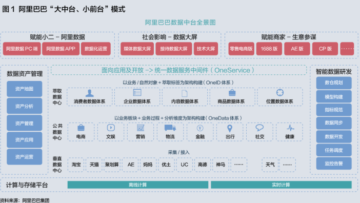
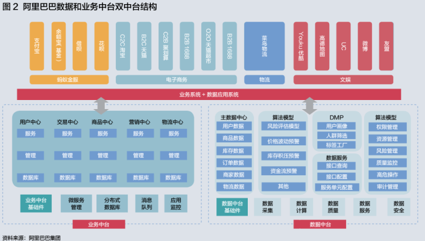
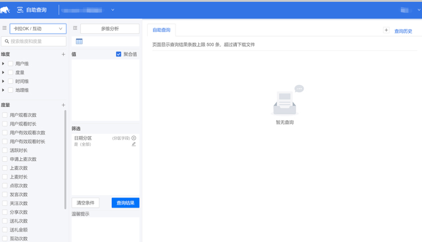
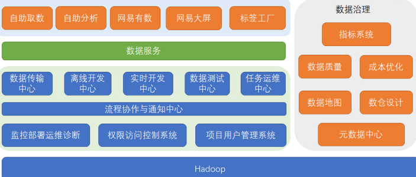
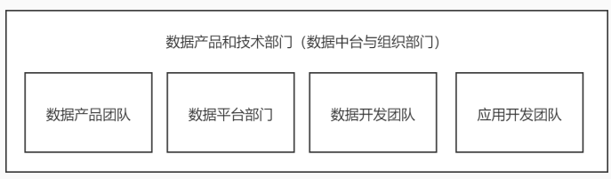
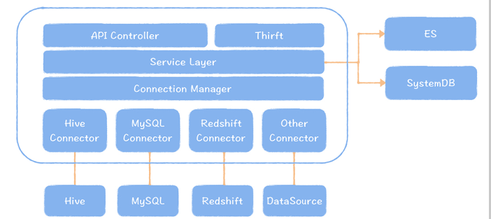
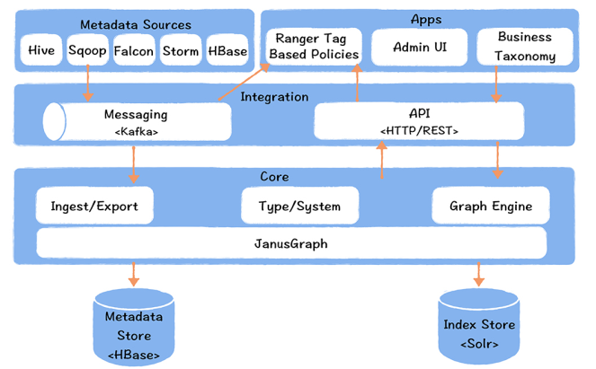
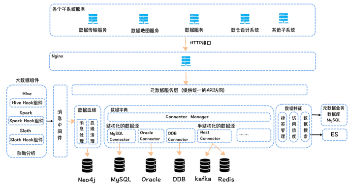
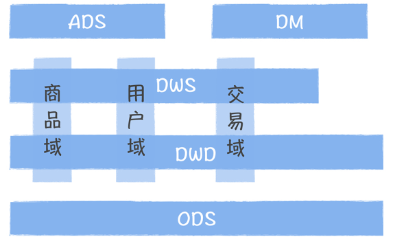

```
1、各大类常用存储相关技术组件：
HDFS
Kafka
HBase
ElasticSearch
2、各大类常用计算相关技术组件：
MapReduce
Spark
Flink
3、新老OLAP生态技术组件
Hive
ClickHouse
4、集群资源管理调度组件
YARN
Spark Standalone
Flink Standalone
5、大数据通用协调服务组件
ZooKeeper
6、数据收集和迁移
常用技术：flume，canal，sqoop，datax，waterdrop等
7、任务调度
常用技术：azkaban，oozie，dophinscheduler，airflow
8、部署运维
常用技术：cloudera manager, ambari，SaltStack等
9、监控告警
常用技术：Alertmanager+Prometheus，zabbix，openfalcon等
10、安全和权限
常用技术：Kerberos，ranger等
```

数据治理，数据地图，元数据管理，数据资产，数据血缘，数据湖等  

## 大纲：

```
01、数据中台由来
02、数据中台适合企业
03、如何构建数据中台
04、中台实现：元数据中心
05、中台实现：指标管理
06、中台实现：模型设计
07、中台实现：数据质量
08、中台实现：成本控制
09、中台实现：数据服务化
10、CDH和HDP大数据平台
```

## 数据中台由来  

数据库阶段 ---> 传统数仓 ---> 大数据平台 ----> 大数据中台  

## 数据存储起源：数据库

1979年：Oracle 1.0 商用数据库发布

1996年：MySQL 1.0 发布，到 2000 年以后开始火起来。

特点：数据库主要面向事务的增删改场景，一个数据库支撑多个简单单体应用，少量分析需求，借助数
据库直接完成。但当数据增长较快，复杂的大量的分析需求，借助数据库做分析开始吃力。

## 分析计算起源：传统数仓

商业智能（Business Intelligence）诞生在上个世纪 90 年代，它是将企业已有的数据转化为知识，帮
助企业做出经营分析决策。比如在零售行业的门店管理中，如何使得单个门店的利润最大化，我们就需
要分析每个商品的销售数据和库存信息，为每个商品制定合理的销售采购计划，有的商品存在滞销，应
该降价促销，有的商品比较畅销，需要根据对未来销售数据的预测，进行提前采购，这些都离不开大量
的数据分析。

而数据分析需要聚合多个业务系统的数据，比如需要集成交易系统的数据，需要集成仓储系统的数据等
等，同时需要保存历史数据，进行大数据量的范围查询。传统数据库面向单一业务系统，主要实现的是
面向事务的增删改查，已经不能满足数据分析的场景，这促使数据仓库概念的出现。

在 1991 年出版的《Building the Data Warehouse》中，数据仓库之父比尔·恩门（Bill Inmon）首
次给出了数据仓库的完整定义，他认为：数据仓库是在企业管理和决策中面向主题的、集成的、与时间
相关的，不可修改的数据集合。  

构建数据仓库，首先要把不同业务系统的数据同步到一个统一的数据仓库中，然后按照主题域方式组织
数据。主题域是业务过程的一个高层次的抽象，像商品、交易、用户、流量都能作为一个主题域，你可
以把它理解为数据仓库的一个目录。数据仓库中的数据一般是按照时间进行分区存放，一般会保留 3 年
以上，每个时间分区内的数据都是追加写的方式，对于某条记录是不可更新的。

Bill Inmon 提出的建模方法自顶向下（顶指数据的来源，在传统数据仓库中，就是各个业务数据
库），基于业务中各个实体以及实体之间的关系，构建数据仓库。比如之前数仓中讲到的：商品
表，用户表，交易表，两个实体表，一个关系表

Ralph Kimball 建模与 Bill Inmon 正好相反，是一种自底向上的模型设计方法，从数据分析的需求
出发，拆分维度和事实。那么用户、商品就是维度，库存、用户账户余额是事实。

这两种方法各有优劣，恩门建模因为是从数据源开始构建，构建成本比较高，适用于应用场景比较固定
的业务，比如金融领域，冗余数据少是它的优势。金博尔建模由于是从分析场景出发，适用于变化速度
比较快的业务，比如互联网业务。事实上，你会发现这两种模型你都在用。

传统数据仓库，第一次明确了数据分析的应用场景应该用单独的解决方案去实现，不再依赖于业务的数
据库。而随着互联网发展，数据呈指数级增长，传统数据仓库逐渐没落，开始进入到大数据时代。  

## 数据工厂时代：大数据平台

进入互联网时代，有两个最重要的变化。

一个是数据规模前所未有，一个成功的互联网产品日活可以过亿，就像你熟知的头条、抖音、快
手、网易云音乐，每天产生几千亿的用户行为。传统数据仓库难于扩展，根本无法承载如此规模的
海量数据。

另一个是数据类型变得异构化，互联网时代的数据除了来自业务数据库的结构化数据，还有来自
App、Web 的前端埋点数据，或者业务服务器的后端埋点日志，这些数据一般都是半结构化，甚
至无结构的。传统数据仓库对数据模型有严格的要求，在数据导入到数据仓库前，数据模型就必须
事先定义好，数据必须按照模型设计存储。

从 2003 年开始，互联网巨头谷歌先后发表了 3 篇论文，较为系统完整的阐述了海量数据的处理思路，
奠定了现代大数据的技术基础。提出了一种新的，面向数据分析的海量异构数据的统一计算、存储的方
法，完全分布式，易于扩展，可以使用价格低廉的机器堆出一个计算、存储能力很强的集群，满足海量
数据的处理要求。  

```
数据存储：HDFS，HBase，Kudu等
数据计算：MapReduce, Spark, Flink
交互式查询：Impala, Presto
在线实时分析：ClickHouse，Kylin，Doris，Druid，Kudu等
资源调度：YARN，Mesos，Kubernetes
任务调度：Oozie，Azakaban，AirFlow等
....
数据收集，数据迁移，服务协调，安装部署，数据治理等
```

基本上，到了 2010 年，Pentaho 创始人兼 CTO James Dixon 在纽约 Hadoop World 大会上提出了数
据湖（一个以原始格式存储数据的存储库或系统）的概念，标志着 Hadoop 从开源走向商业化成熟。典
型代表：Cloudera 和 Hortonworks 两家公司提供了成熟的商业化大数据平台解决方案CDH 和 HDP。

大数据平台的作用，就是为了提高数据研发的效率，降低数据研发的门槛，让数据能够在一个设备流水
线上快速地完成加工。大数据平台按照使用场景，分为数据集成、数据开发、数据测试……任务运维
等，大数据平台的使用对象是数据开发。大数据平台的底层是以 Hadoop 为代表的各种基础设施，分为
存储、计算、资源调度和运维监控等。  

大数据平台像一条设备流水线，经过大数据平台的加工，原始数据变成了指标，出现在各个报表或者数
据产品中。互联网高速发展，背后对数据的需求越来越多，数据的应用场景也越来越多，有大量的数据
产品进入到了我们运营的日常工作，成为运营工作中不可或缺的一部分。在电商业务中，有供应链系
统，供应链系统会根据各个商品的毛利、库存、销售数据以及商品的舆情，产生商品的补货决策，然后
推送给采购系统。随着数据需求的快速增长，报表、指标、数据模型越来越多，找不到数据，数据不好
用，数据需求响应速度慢等问题日益尖锐，成为阻塞数据产生价值的绊脚石。  

## 数据价值时代：中台产生

业务发展前期，为了快速实现业务的需求，烟囱式的开发导致企业不同业务线，甚至相同业务线的不同
应用之间，数据都是割裂的。两个数据应用的相同指标，展示的结果不一致，导致运营对数据的信任度
下降。数据割裂的另外一个问题，就是大量的重复计算、开发，导致的研发效率的浪费，计算、存储资
源的浪费，大数据的应用成本越来越高。

在国内，阿里最早提出了“数据中台”的概念。2014年，马云率队参观了实力强大的游戏公司supercell，
它的成功的游戏产品有很多，其独特优势是能够快速推出新产品，而依靠的就是中台系统。
马云深受启发，回到阿里后，便提出了“大中台、小前台”战略：沉淀共享服务，打破系统壁垒，业务快
速创新。其中“大中台”包含两部分，一个是业务中台，另一个是数据中台  

一般来说，数据中台是指通过数据技术对海量数据进行采集、计算、存储和处理，同时统一标准和口
径，形成全域级、可复用的数据资产中心和数据存储能力中心，形成大数据资产层，进而为客户提供高
效的服务。

形象地讲，数据中台构建的服务考虑了"可复用性"，每项服务都像一个积木，可以随意组合，灵活高效
地解决前台的个性化需求。

从效用意义上讲，狭义的数据中台是一套实现数据资产化的工具；广义的数据中台是一套利用数
据，进而帮助企业实现数字化转型的机制和方法；

从技术角度来看，数据中台是一种新型的 IT 架构；

从管理角度看，数据中台是一种新型的组织管理模式和理念；

从战略角度来看，数据中台是为了应对日益复杂的环境而构建的一种新型战略工具和竞争壁垒。

总之，数据中台的核心理念是"数据取之于业务，用之于业务"，跟传统数据平台相比，数据中台着眼于
业务的积累和沉淀，构建了从数据生产到消费、消费后数据返回到生产的闭环过程。

“让一切业务数据化，一切数据业务化” 是对数据中台系统功能的精要概括。  





数据中台的核心，是避免数据的重复计算，通过数据服务化，提高数据的共享能力，赋能数据应用。之
前，数据是要啥没啥，中间数据难于共享，无法积累。现在建设数据中台之后，要啥有啥，数据应用的
研发速度不再受限于数据开发的速度，然后我们就可以根据需求场景，快速孵化出很多数据应用，这些
应用让数据产生价值。

总的来说，数据中台吸收了传统数据仓库、数据湖、大数据平台的优势，同时又解决了数据共享的难
题，通过数据应用，实现数据价值的落地。  

## 大数据平台型企业的问题  

大量数据产品的出现，在不断提高企业运营效率的同时，也暴露出很多尖锐的问题，在我看来，主要有
五点。

指标口径不一致：主要原因：业务口径不一致、计算逻辑不一致、数据来源不一致。要实现一致，
就务必确保对同一个指标，只有一个业务口径，只加工一次，数据来源必须相同。

数据重复建设，需求响应时间长：解决数据复用的问题，要确保相同数据只加工一次，实现数据的
共享。

取数效率低：面对几千甚至上完张表，运营，开发或者分析师想要快速找到想要的数据，以及做到
精准理解这些数据意义，都非常的困难。所以需要构建一个全局的企业数据资产目录，实现数据地
图的功能，快速找到数据

数据质量差：没有数据稽核任务，运营不相信数据。存储数据链路，及时发现数据质量问题，并恢
复数据。

数据成本线性增长：大企业烟囱式开发，导致一个企业拥有很多小数仓，不同数仓可能开发相同任
务，导致资源浪费，而且也做不到淘汰低价值数据任务。所以解决方案的核心：解决数据重复建
设，打通数据孤岛。

因此：数据中台是企业构建的标准的、安全的、统一的、共享的数据组织，通过数据服务化的方式支撑
前端数据应用。数据中台消除了冗余数据，构建了企业级数据资产，提高了数据的共享能力。  

## 数据中台如何解决  

要解决烟囱式开发面临的数据存储冗余，数据计算冗余等问题，就只能构筑一个统一的平
台，提供统一的出入口：OneData OneService

由一个团队，负责所有指标的管控，明确每个指标的业务口径，数据来源和计算逻辑，消除指标二
义性，确保任何一个指标的意义和计算逻辑，在全公司都只有一个唯一的相同口径。

数据服务化，提高了数据应用接入和管理的效率。

对于非技术人员，数据中台提供了可视化的取数平台。你只需要选取指标、通过获取指标系统中每
个指标的可分析维度，然后勾选，添加筛选过滤条件，点击查询，就可以获取数据。

构建了企业数据地图，你可以很方便地检索有哪些数据，它们在哪些表中，又关联了哪些指标和维
度

数据只能加工一次，强调数据的复用性

成本控制，研发了一个数据成本治理系统，从应用维度、表维度、任务的维度、文件的维度进行全
面的治理。比如，某个任务产出的数据指标，在过去 30 天内都没有被访问过，所以这个任务是没
有作用没有意义的  



企业在选择数据中台的时候，
应该考虑这样几个因素。  

企业是否有大量的数据应用场景： 数据中台本身并不能直接产生业务价值，数据中台的本质是支
撑快速地孵化数据应用。所以当你的企业有较多数据应用的场景时（一般有 3 个以上就可以考
虑），就像我在课程开始时提到电商中有各种各样的数据应用场景，此时你要考虑构建一个数据中
台。

经过了快速的信息化建设，企业存在较多的业务数据的孤岛，需要整合各个业务系统的数据，进行
关联的分析，此时，你需要构建一个数据中台。比如在我们做电商的初期，仓储、供应链、市场运
营都是独立的数据仓库，当时数据分析的时候，往往跨了很多数据系统，为了消除这些数据孤岛，
就必须要构建一个数据中台。

当你的团队正在面临效率、质量和成本的苦恼时，面对大量的开发，却不知道如何提高效能，数据
经常出问题而束手无策，老板还要求你控制数据的成本，这个时候，数据中台可以帮助你。
当你所在的企业面临经营困难，需要通过数据实现精益运营，提高企业的运营效率的时候，你需要
构建一个数据中台，同时结合可视化的 BI 数据产品，实现数据从应用到中台的完整构建，在我的
接触中，这种类型往往出现在传统企业中。

企业规模也是必须要考虑的一个因素，数据中台因为投入大，收益偏长线，所以更适合业务相对稳
定的大公司，并不适合初创型的小公司。  

## 如何建设数据中台  

### 方法论

在 2016 年，阿里巴巴就提出了"大中台，小前台"，倡导数据中台建设，核心方法论：OneData 和
OneService

#### OneData

简而言之：OneData 就是所有数据只加工一次。

数据中台就是要在整个企业中形成一个公共数据层，消灭这些跨部门的小数仓，实现数据的复用，所以
强调数据只加工一次，不会因为不同的应用场景，不同的部门数据重复加工。

如何实现：

数据划分主题进行管理：表的命名，字段的命名等规范统一，做到见名知义

数据格式和字段命名和定义规范化：具体参考离线数仓项目讲解的表和字段命名规范：数仓分层-
业务主题域-业务过程-基础信息-分区规则

指标一致，不存在二义性：提供全局数据字典确保意义一致。

数据模型复用：推荐采用分层的设计方式，通常包括：ODS 原始数据层，DWD 明细数据层，
DWS 轻度汇总数据层，ADS应用数据层 / DM数据集市层，DIM 公共维度层。

数据完善：数据中台尽可能的覆盖到所有业务过程，用户和系统的一切行为都被记录下来永久保存

OneData 体系的目标是构建统一的数据规范标准，让数据成为一种资产，而不是成本。资产和成本的
差别在于资产是可以沉淀的，是可以被复用的。成本是消耗性质的、是临时的、无法被复用的。  

#### OneService

OneService，数据即服务，强调数据中台中的数据应该是通过 API 接口的方式被访问。记得我最开始在
数仓部门工作的时候，因为数据库权限的问题，我们任务的数据只会通过 sqoop 导出到我们的可视化
系统中。如果别的数据产品想要使用，只能给我们提需求，通过一些数据同步工具进行同步，慢慢的这
个负担越来越重。

现阶段企业数据应用现状：

数据量小的使用 MySQL：Hive数仓，Spark计算引擎的计算结果导出到 MySQL

数据量大的使用 HBase + ElasticSearch：解决海量数据中的低延迟高效查询

需要多维分析的可能需要 ClickHouse，Kylin，Greenplum：提供现在分析能力

实时性要求高的需要用到 Redis：提供高性能单点查询能力

因此，从不同的系统取数据，应用开发需要定制不同的访问接口。而且如果数据发生异常，还不能查出
影响到下游应用的那些应用或者报表。所以当你想下线一张表的时候，就无法实施，造成了上线容易，
下线难的囧状。

而 API 接口一方面对应用开发屏蔽了底层数据存储，使用统一标准的 API 接口查询数据，提高了数据接
入的速度。另一方面，对于数据开发，提高了数据应用的管理效率，建立了表到应用的链路关系。

如何实现：

屏蔽底层数据来源的不同：不同的数据来源，统一的数据出口

实现包括权限，日志，监控等管控能力的数据网关：权限控制，统计分析，流量控制，成本控制等

给用户屏蔽底层的物理数据模型，提供数据逻辑模型：动态拼接多张相同粒度的数据结构，简化接
入复杂度

提供无状态的，高性能和稳定可靠的数据服务

OneService 体系的目标是提高数据的共享能力，让数据可以被用得好，用得爽。  

### 技术



这个图完整地描述了数据中台支撑技术体系

1、大数据计算、存储基础设施

数据中台的底层是以 Hadoop 为代表的大数据计算、存储基础设施，提供了大数据运行所必须的
计算、存储资源。

2、工具产品

在 Hadoop 之上，浅绿色的部分是原有大数据平台范畴内的工具产品，覆盖了从数据集成、数据
开发、数据测试到任务运维的整套工具链产品。同时还包括基础的监控运维系统、权限访问控制系
统和项目用户的管理系统。由于涉及多人协作，所以还有一个流程协作与通知中心。

3、数据治理模块

灰色的部分，是数据中台的核心组成部分：数据治理模块。它对应的方法论就是 OneData 体系。
以元数据中心为基础，在统一了企业所有数据源的元数据基础上，提供了包括数据地图、数仓设
计、数据质量、成本优化以及指标管理在内的 5 个产品，分别对应的就是数据发现、模型、质
量、成本和指标的治理。

4、数据服务

深绿色的部分是数据服务，它是数据中台的门户，对外提供了统一的数据服务，对应的方法论就是
OneService。数据服务向下提供了应用和表的访问关系，使数据血缘可以延申到数据应用，向上
支撑了各种数据应用和服务，所有的系统通过统一的 API 接口获取数据。

5、数据产品和应用

在数据服务之上，是面向不同场景的数据产品和应用，包括面向非技术人员的自助取数系统；面向
数据开发、分析师的自助分析系统；面向敏捷数据分析场景的 BI 产品；活动直播场景下的大屏系
统；以及用户画像相关的标签工厂  

### 组织  

数据中台提供的是一个跨
个独立于业务线的部门。  

独立部门的最大风险是与业务脱节，所以我们对数据中台的组织定位是：懂业务，能够深入业务，扎根
业务。数据中台要管理所有的指标，而每个业务线之间的指标既有差异，也有交叉，要理解指标的口径
定义，就必须要了解业务的过程。同时，当我们要制定一些新的指标时，必须要了解各个业务线新的业
务目标，指标的本质还是为业务目标服务的。  



```
数据产品部门：负责数据中台、数据产品的体系规划、产品设计、规范制定、应用效果跟进，指标口径的定义和维护（有的部门是由分析师管理）。
数据平台部门：负责研发支撑数据中台构建的产品，例如指标系统、元数据心、数据地图等。
数据开发团队：负责维护数据中台的公共数据层，满足数据产品制定的数据求。
应用开发团队：负责开发数据应用产品，比如报表系统、电商中的供应链系统、高层看板、经营分析
```

数据中台的组织架构改革涉及原有各个部门的利益，所以这个是数据中台构建最难又不得不做的地方，
必须要取得高层领导的支持和重视。

## 数据中台实现：元数据中心  

### 元数据概念  

数据中台的构建，需要确保全局指标的业务口径一致，要把原先口径不一致的、重复的指标进行梳理，
整合成一个统一的指标字典。而这项工作的前提，是要搞清楚这些指标的业务口径、数据来源和计算逻
辑。而这些数据呢都是元数据。

元数据中心应该包括哪些元数据呢？ 什么样的数据是元数据？

```
元数据划为三类：数据字典、数据血缘和数据特征。  
```

数据字典：描述的是数据的结构信息：表结构信息，主要包括像表名，字段名称、类型和注释，表的数
据产出任务，表和字段的权限等

数据血缘：指一个表是直接通过哪些表加工而来。数据血缘一般会帮我们做影响分析和故障溯源。比如
说有一天，你的老板看到某个指标的数据违反常识，让你去排查这个指标计算是否正确，你首先需要找
到这个指标所在的表，然后顺着这个表的上游表逐个去排查校验数据，才能找到异常数据的根源。

数据特征：主要是指数据的属性信息：存储空间大小，数仓分层，访问热度，主题分类，关联指标等


### 元数据技术  

业界比较流行的元数据产品技术主要有：

开源的有 Netflix 的 Metacat、Apache 的 Atlas；

商业化的产品有 Cloudera Navigator。  

Metacat 介绍：https://github.com/Netflix/metacat，最大的优势：多数据源的可扩展架构  



从上面 Metacat 的架构图中，你可以看到，Metacat 的设计非常巧妙，它并没有单独再保存一份元数
据，而是采取直连数据源拉的方式，一方面它不存在保存两份元数据产生一致性的问题，另一方面，这
种架构设计很轻量化，每个数据源只要实现一个连接实现类即可。

Apache Atlas 介绍：http://atlas.apache.org/

血缘采集，一般可以通过三种方式：

通过静态解析 SQL，获得输入表和输出表；

通过实时抓取正在执行的 SQL，解析执行计划，获取输入表和输出表；

通过任务日志解析的方式，获取执行后的 SQL 输入表和输出表。

第一种方式，面临准确性的问题，因为任务没有执行，这个 SQL 对不对都是一个问题。第三种方式，
血缘虽然是执行后产生的，可以确保是准确的，但是时效性比较差，通常要分析大量的任务日志数据。
所以第二种方式，我认为是比较理想的实现方式，而 Atlas 就是这种实现。  



对于 Hive 计算引擎，Atlas 通过 Hook 方式，实时地捕捉任务执行计划，获取输入表和输出表，推送给
Kafka，由一个 Ingest 模块负责将血缘写入 JanusGraph 图数据库中。然后通过 API 的方式，基于图查
询引擎，获取血缘关系。对于 Spark，Atlas 提供了 Listener 的实现方式。

解释一下，什么叫做数据血缘：  

```
insert overwrite table t2 select classid, count(userid) as count_users from t1
group by classid;
```

t2 表是由 t1 表的数据计算来的，所以 t2 和 t1 是表血缘上下游关系，t2 的 classid 字段是由 t1 的
classid 字段产生的，count 字段是由 userid 经过按照 classid 字段聚合计算得到的，所以 t2 表的
classid 与 t1 的 classid 存在字段血缘，t2 表的 count 分别与 t1 表的 classid 和 userid 存在血缘关
系。  

### 元数据中心架构设计  

下图按照功能模块分为数据血缘、数据字典和数据特征  



元数据中心统一对外提供了 API 访问接口，数据传输、数据地图、数据服务等其他的子系统都可以通过
API 接口获取元数据。另外 Ranger 可以基于元数据中心提供的 API 接口，获取标签对应的表，然后根
据标签更新表对应的权限，实现基于标签的权限控制。  

### 元数据设计要点  

元数据中心是数据中台的基石，它提供了我们做数据治理的必须的数据支撑，数据的指标、模型、质
量、成本、安全等的治理，这些都离不开元数据中心的支撑。

元数据中心设计上必须注意扩展性，能够支持多个数据源，所以宜采用集成型的设计方式。

数据血缘需要支持字段级别的血缘，否则会影响溯源的范围和准确性。

数据地图提供了一站式的数据发现服务，解决了检索数据，理解数据的“找数据的需求”。  

## 数据中台实现：指标管理

指标是一种特定类型的元数据，公司的运营会围绕它进行工作，可以说，它是业务和数据的交汇点。指
标数据能不能用，会影响他们的日常工作。而且元数据在指标管理、模型设计、数据质量和成本治理四
个领域也都发挥着作用，而这些领域构成了数据中台 OneData 数据体系。  

### 为什么需要指标管理

举两个例子：

第一个：新用户

市场部门认定新用户是首次下单并完成支付的用户；

会员中心认定新用户是当日新注册用户。

第二个：7 日 UV

过去 7 日 UV 的平均值

过去 7 日所有 Vistor 的去重数量

定义不一致，口径不一致，计算逻辑就不一致。所以构建数据中台，需要提供全局一致的指标口径，输
出完备统一的指标字典。

又是一个 web 管理平台  

```
1、运营，产品 能查询已有的指标那些
2、可以指定新的指标的定义
3、这些指标，一般来说，要按照主题域进行分类管理
```

### 常见指标问题

一般进行烟囱式开发的企业都多多少少存在以下的指标问题：

相同指标名称，口径不一致：比如 "新用户销售额，7日UV"

相同口径，指标名称不一样：比如 "优惠券抵扣金额" 和 "优惠券消费金额"

不同限定词，描述相同事实过程的俩个指标，相同事实部分口径不一致

指标口径描述不清晰：比如 "关单金额  

指标命名难于理解：比如 "转化率" 和 "ROI"

指标数据来源和计算逻辑不清晰  

### 如何定义指标

面向主题：为了提高指标管理的效率，你需要按照业务线、主题域和业务过程三级目录方式管理指标

拆分原子指标和派生指标：统计周期、统计粒度、业务限定、原子指标，组成派生指标，所以原子指标可以定义为不能够按照上述规则进一步拆分的指标。比如：30 天内某商品的非会员购买用户数

命名规范：规范统一化，通俗易懂化。

关联的应用和可分析的维度

分等级管理  

### 如何构建指标系统

提供一个易于维护的规范标准化指标管理系统，具备查询，增删等功能。

数据中台团队必须要有一个专门负责指标管理的人或者小组（一般不超过 3 个人），最好是数据
产品经理来负责，如果你的公司没有这个职位，也可以让分析师承担。

提供一个完备的指标创建流程：提交指标需求，需求评审，模型设计和数据开发，验证，上线，应
用接入

### 指标管理总结

数据中台直接产出的核心指标必须实施强管理，由数据中台团队的专人或者小组负责，最好是数据
产品经理的角色。

指标的管理必须结合系统 + 规范的治理方法，明确每个角色的职责，通过系统化的方法实现。

不同的两个指标描述的相同业务过程中的相同事实部分口径不一致，是指标梳理过程中最常见的问
题，需要通过拆分原子指标和派生指标的方式解决。  

## 数据中台实现：模型设计

大多数公司的分析师会结合业务做一些数据分析（需要用到大量的数据），通过报表的方式服务于业务
部门的运营。但是在数据中台构建之前，分析师经常发现自己没有可以复用的数据，不得不使用原始数
据进行清洗、加工、计算指标。

烟囱式数据开发：数据模型无法复用，每次遇到新的需求，都从原始数据重新计算

### 如何构建可复用模型

大数据中台的数据模型：  



构建可复用模型的标准：数据模型可复用，完善且规范

统计明细层完善度：统计 DWD 层表被跨层引用次数即可，次数越多，证明完善度越好

DWS/ADS/DM 层完善度：能满足多少查询需求。  

## 数据中台实现：数据质量

现有的大数据平台，或者数仓项目，很难做到任务追踪和数据追踪。

数据部门晚于业务方发现数据异常，被投诉后才发现问题。

出现问题后，数据部门无法快速定位到数据异常的根源，排查用了较长的时间。

故障出现在数据加工链路的上游顶端，出现问题没有第一时间报警处理，导致问题修复时，所有下
游链路上的任务都要运行，修复时间成本非常高。

这些问题最终导致了数据长时间不可用。这就是数据质量的问题

###  数据质量问题的根源

对于一个做数据开发的人来讲，遇见数据质量的问题（也就是算错了数据的问题）是经常性的。通常进行排查和数据恢复，都需要较长的时间，和较大的代价。在多次问题的复盘中，总结出以下规律：

业务系统变更，包括表结构变更，源系统环境变更，源数据格式异常

数据开发 Bug + 数据开发任务变更：忘了修改数据源，写死数据分区，数据格式异常

物理资源不足：YARN 上多租户争抢资源导致数据延迟产出

基础设施不稳定：NameNode 高可用失效导致数据读写功能异常

### 如何提高数据质量

想提升数据质量，最重要的就是 “早发现，早恢复”：  

早发现，是要能够先于数据使用方发现数据的问题，尽可能在出现问题的源头发现问题，这样就为
“早恢复”争取到了大量的时间。

早恢复，就是要缩短故障恢复的时间，降低故障对数据产出的影响。

具体实施：

添加稽核校验任务：确保数据的完整性、一致性和准确性

建立全链路监控：可以基于血缘关系建立全链路数据质量监控。

通过智能预警，确保任务按时产出：延迟产出，异常任务等立即报警

通过应用的重要性区分数据等级，加快恢复速度  

### 如何衡量数据质量

对于数据治理做到什么程度，很难衡量，最好的办法就是量化。

某个时间点以前核心任务的产出完成比，超过规定时间，没有完成产出则稽核校验失效

基于稽核规则，计算表级别的质量分数。对于低于质量分数的表，分发到响应责任人进行改进。

需要立即介入的报警次数。超过规定次数的需要立即介入

数据产品 SLA。数据应用中的所有指标在规定时间内产出。如果没有，则计算不可用时间，不可用
时间越短，证明SLA越好  

4.8. 数据中台实现：成本控制

企业数据中台追求的是：高效，质量和成本。简单来说就是：快，准，省。所以能不能合理控制成本，
也是决定数据中台项目成功与否的关键。

如果老板问你：

今年大数据中台预算 5000W，都用来支撑什么业务了？
你们都做了哪些优化成本的举措呢？效果怎样？

正常来说，数据中台的成本，是按照人力，物力，按照机器数量和电费来算的，又不是按照数据应用来
算的，来自老板的这种灵魂拷问，还真是不好回答。但是一个公司的资源都是有限的，不可能无限增
加，所以这些资源肯定都需要确保应用在公司的核心战略上产生价值。所以数据中台刚好又是一个高消
耗支撑部门，所以如果想展现自己的价值，至少要做到两方面：

支撑好业务，获得业务部门的认可

精简架构，控制成本，为公司省钱

### 成本陷阱

根据经验，可以总结优化的地方还是挺多，如果都做到位，可以节省一半资源。相信很多小伙伴已经基
本中招。

数据上线容易，下线难，什么没有下线机制。

低价值的数据应用消耗了大量的机器资源。

烟囱式的开发模式导致数据加工重复。

数据倾斜导致资源分配利用不均衡
未设置数据生命周期，导致过期数据长期占用磁盘资源。

调度周期设置不合理，未形成闲忙搭配得当。

任务指定资源参数配置不当

数据为压缩存储  

### 精细化成本管理

第一：全局资产盘点

精细化成本管理的第一步，就是要对数据中台中，所有的数据进行一次全面盘点，基于元数据中心
提供的数据血缘，建立全链路的数据资产视图。

数据成本计算：一张表的成本 = 每个加工任务的计算资源成本 * m + 上有依赖表的存储资源成本 *
n

数据价值计算：给使用人数，使用频率，数据应用数，老板等因素加权计算

第二：发现问题

持续产生成本，但是已经没有使用的末端数据（“没有使用”一般指 30 天内没有访问）：没有使
用，却消耗了资源

数据应用价值很低，成本却很高，这些数据应用上游链路上的所有相关数据：低价值产出

高峰期高消耗的数据：高成本的数据

第三：治理优化

对于第一类问题，应该对表进行下线

对于第二类问题，我们需要按照应用粒度评估应用是否还有存在的必要，如果没有，则删除。

对于第三类问题，主要是针对高消耗的数据，又具体分为产出数据的任务高消耗和数据存储高消耗，分配到非高峰期运行即可。

第四：治理效果评估

最简单粗暴的标准：省了多少钱

下线了多少任务和数据；这些任务每日消耗了多少资源；数据占用了多少存储空间。

将上述节省资源换算成钱，这就是你为公司省的钱。  

##  数据中台实现：数据服务化

###   数据服务解决的问题

数据服务主要解决的问题：  

```
1、数据接入效率低
2、数据服务解决的问题
3、不确定数据应用在哪里
4、数据部门的字段更变导致数据应用变更
```

####  数据接入效率低

为了保障数据的查询速度，需要引入中间存储

数据量小：MySQL

低延时：Redis

数据量大：HBase

多维分析，数据量大：GreenPlum  

不同中间存储提供的 API 接口不一致，导致使用复杂度提高。维护困难。

解决方案：提供统一的 API 接口，为开发者和应用者屏蔽不同的中间存储和底层数据源  

####  数据服务解决的问题

中间存储中的数据无法复用

API接口根据应用高度定制化，也无法复用

数据服务暴露的不是数据，而是接口

数据服务具备限流功能，使得不同应用共享数据成为可能  

####   不确定数据应用在哪里

数据和应用的链路关系是断的

数据出现问题，不知道影响了哪个应用，无法优先恢复

下线数据，不知道下游还有没有应用访问

数据服务维护了数据应用和数据中台表的链路关系，建立全链路血缘  

####   数据部门的字段更变导致数据应用变更

汇总层模型根据需求不断优化是最频繁出现的事情
对应用开发来说，底层表变更简直就是噩梦

数据服务解耦了数据应用和数据，修改

数据服务的映射关系即可实现字段变更  

###  数据服务解决方案

为所有的数据应用提供统一的 API 接口服务

表现在：

接口规范化定义

数据网关

链路关系的维护

数据交付

提供多样中间存储

逻辑模型
API 接口

API 测试

数据服务实现了数据中台模型和数据应用的全链路打通，解决了任务异常影响分析和数据下线不知道影响哪些应用的难题；

基于相同主键的物理模型，可以构建逻辑模型，逻辑模型解决了数据复用的难题，提高了接口模型的发布效率；  