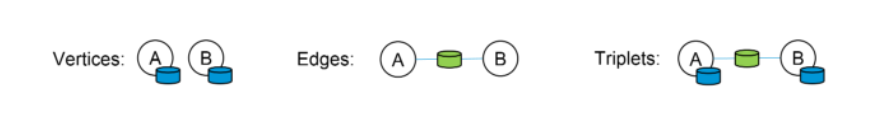
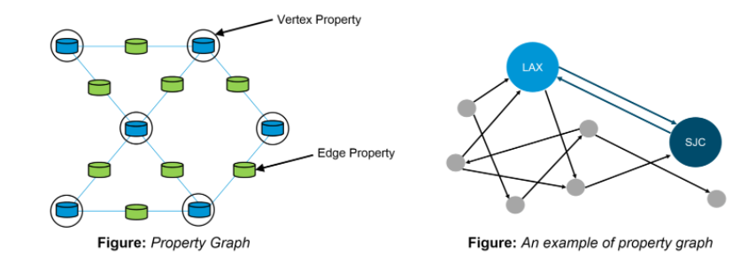
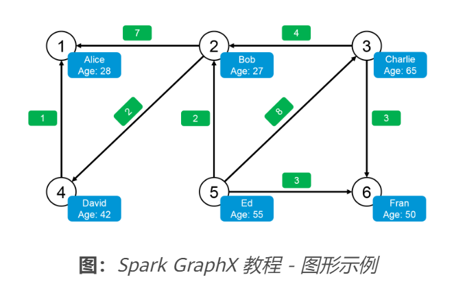
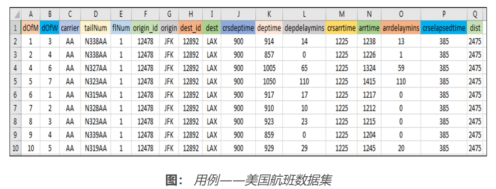

# Apache Spark 中的图形分析

> GraphX是 Apache Spark 用于图形和图形并行计算的 API。GraphX 在单个系统内统一了 ETL（提取、转换和加载）过程、探索性分析和迭代图计算。图的使用可以在 Facebook 的朋友、LinkedIn 的连接、互联网的路由器、天体物理学中星系和恒星之间的关系以及谷歌的地图中看到。尽管图计算的概念看起来很简单，但图的应用在灾难检测、银行、股票市场、银行和地理系统中的用例实际上

*GraphX*是 Apache Spark 用于图形和图形并行计算的 API。GraphX 在单个系统内统一了 ETL（提取、转换和加载）过程、探索性分析和迭代图计算。图的使用可以在 Facebook 的朋友、LinkedIn 的连接、互联网的路由器、天体物理学中星系和恒星之间的关系以及谷歌的地图中看到。尽管图计算的概念看起来很简单，但图的应用在灾难检测、银行、股票市场、银行和地理系统中的用例实际上是无限的，仅举几例。此 API 是***Apache Spark*** 的重要组成部分。了解 Spark GraphX 的概念、其特性和组件，并通过使用 GraphX 完成飞行数据分析的完整用例。

## **什么是图表？**

图是一种数学结构，相当于一组对象，其中一些对象对在某种意义上是相关的。这些关系可以使用形成图的边和顶点来表示。顶点代表对象，边显示这些对象之间的各种关系。



**图：** *Spark GraphX 教程——图中的顶点、边和三元组*

在计算机科学中，图是一种抽象的数据类型，旨在实现数学中的无向图和有向图概念，特别是图论领域。图数据结构还可以将某些*边值*与每条边相关联，例如符号标签或数字属性（成本、容量、长度、等等。）。

## **图计算的用例**

以下用例给出了图计算的视角以及使用图实现其他解决方案的进一步范围。

**灾害检测系统** 

图表可用于检测飓风、地震、海啸、森林火灾和火山等灾害，从而提供警告以提醒人们。

**Page Rank** 

Page Rank 可用于在任何网络（如论文引用网络或社交媒体网络）中寻找有影响力的人

图分析可用于监控金融交易并检测参与金融欺诈和洗钱的人员

**商业分析**

图表与机器学习一起使用时，有助于了解客户的购买趋势。

**地理信息系统**

图被广泛用于开发地理信息系统的功能，如流域划分和天气预报

## **什么是 Spark GraphX？**



GraphX 使用弹性分布式属性图扩展了 Spark RDD。 属性图是一个有向多重图，可以有多个平行边。每条边和顶点都有与之关联的用户定义属性。平行边允许多个相同顶点之间的关系。

## **Spark GraphX 特性**

以下是 Spark GraphX 的特点：

1. **灵活性**：
   Spark GraphX 适用于图形和计算。GraphX 在单个系统中统一了 ETL（提取、转换和加载）、探索性分析和迭代图计算。我们可以查看与图和集合相同的数据，使用 RDD 有效地转换和连接图，并使用 Pregel API 编写自定义迭代图算法。
2. **速度**：
   Spark GraphX 提供与最快的专业图形处理系统相当的性能。它可与最快的图形系统相媲美，同时保留了 Spark 的灵活性、容错性和易用性。
3. **不断增长的算法库**：
   我们可以从 Spark GraphX 提供的不断增长的图算法库中进行选择。一些流行的算法是页面排名、连通分量、标签传播、S​​VD++、强连通分量和三角形计数。

## **用例子理解GraphX**

我们现在将通过一个例子来理解 Spark GraphX 的概念。让我们考虑一个简单的图形，如下图所示。 



查看图表，我们可以提取有关人（顶点）和他们之间的关系（边）的信息。此处的图表代表 Twitter 用户以及他们在 Twitter 上关注的人。例如，Bob 在 Twitter 上关注了 Davide 和 Alice。

让我们使用 Apache Spark 实现相同的功能。首先，我们将为 GraphX 导入必要的类。

```python
//Importing the necessary classes 
import org.apache.spark._
import org.apache.spark.rdd.RDD 
import org.apache.spark.util.IntParam 
import org.apache.spark.graphx._
import org.apache.spark.graphx.util.GraphGenerators 
```

**显示顶点**： 此外，我们现在将显示用户（顶点）的所有姓名和年龄。

```python
val vertexRDD: RDD[(Long, (String, Int))] = sc.parallelize(vertexArray)
val edgeRDD: RDD[Edge[Int]] = sc.parallelize(edgeArray)
val graph: Graph[(String, Int), Int] = Graph(vertexRDD, edgeRDD)
graph.vertices.filter { case (id, (name, age)) => age > 30 }
.collect.foreach { case (id, (name, age)) => println(s"$name is $age")}
```

上述代码的输出如下：

```python
David is 42 
Fran is 50 
Ed is 55 
Charlie is 65
```

**Displaying Edges**：让我们看看推特上谁喜欢谁。

```python
for (triplet <- graph.triplets.collect)
{
println(s"${triplet.srcAttr._1} likes ${triplet.dstAttr._1}")
}
```

上述代码的输出如下：

```javascript
Bob likes Alice
Bob likes David
Charlie likes Bob
Charlie likes Fran
David likes Alice
Ed likes Bob
Ed likes Charlie
Ed likes Fran
```

现在我们已经了解了 GraphX 的基础知识，让我们深入一点，并对其进行一些高级计算。

**关注者数量**：我们图表中的每个用户都有不同数量的关注者。让我们看看每个用户的所有关注者。

```python
// Defining a class to more clearly model the user property
case class User(name: String, age: Int, inDeg: Int, outDeg: Int)
// Creating a user Graph
val initialUserGraph: Graph[User, Int] = graph.mapVertices{ case (id, (name, age)) => User(name, age, 0, 0) }
 
// Filling in the degree information
val userGraph = initialUserGraph.outerJoinVertices(initialUserGraph.inDegrees) {
case (id, u, inDegOpt) => User(u.name, u.age, inDegOpt.getOrElse(0), u.outDeg)
}.outerJoinVertices(initialUserGraph.outDegrees) {
case (id, u, outDegOpt) => User(u.name, u.age, u.inDeg, outDegOpt.getOrElse(0))
}
for ((id, property) <- userGraph.vertices.collect) {
println(s"User $id is called ${property.name} and is liked by ${property.inDeg} people.")
}
```

上述代码的输出如下：

```python
User 1 is called Alice and is liked by 2 people.
User 2 is called Bob and is liked by 2 people.
User 3 is called Charlie and is liked by 1 people.
User 4 is called David and is liked by 1 people.
User 5 is called Ed and is liked by 0 people.
User 6 is called Fran and is liked by 2 people.
```

**最老的追随者**：我们还可以根据追随者的特征对追随者进行排序。让我们按年龄找出每个用户的最老粉丝。

```python
// Finding the oldest follower for each user
val oldestFollower: VertexRDD[(String, Int)] = userGraph.mapReduceTriplets[(String, Int)](
// For each edge send a message to the destination vertex with the attribute of the source vertex
 edge => Iterator((edge.dstId, (edge.srcAttr.name, edge.srcAttr.age))),
 // To combine messages take the message for the older follower
 (a, b) => if (a._2 > b._2) a else b
 )
```

上述代码的输出如下：

```python
David is the oldest follower of Alice.
Charlie is the oldest follower of Bob.
Ed is the oldest follower of Charlie.
Bob is the oldest follower of David.
Ed does not have any followers.
Charlie is the oldest follower of Fran.
```

## **用例：使用 Spark GraphX 进行飞行数据分析**

现在我们已经了解了 Spark GraphX 的核心概念，让我们使用 GraphX 解决一个现实生活中的问题。这将有助于让我们有信心在未来开展任何 Spark 项目。

**问题陈述**：*要使用 Spark GraphX 分析实时航班数据，提供近乎实时的计算结果并使用 Google Data Studio 将结果可视化。*

**用例 - 要完成的计算**：

1. 计算航线总数
2. 计算并排序最长的航线
3. 显示顶点度数最高的机场
4. 根据 PageRank 列出最重要的机场
5. 列出飞行成本最低的航线

我们将使用 Spark GraphX 进行上述计算，并使用 Google Data Studio 将结果可视化。

**用例 – 数据集**：



**用例 - 流程图**：

下图清楚地解释了我们飞行数据分析中涉及的所有步骤。


**图：** *用例——使用 Spark GraphX 进行飞行数据分析的流程图*

**用例 – Spark 实现**：

找到下面的伪代码： 

```python
//Importing the necessary classes
import org.apache.spark._
...
import java.io.File
 
object airport {
  
 def main(args: Array[String]){
 
//Creating a Case Class Flight
case class Flight(dofM:String, dofW:String, ... ,dist:Int)
 
//Defining a Parse String function to parse input into Flight class
def parseFlight(str: String): Flight = {
val line = str.split(",")
Flight(line(0), line(1), ... , line(16).toInt)
}
val conf = new SparkConf().setAppName("airport").setMaster("local[2]")
val sc = new SparkContext(conf) 
//Load the data into a RDD 
 
val textRDD = sc.textFile("/home/edureka/usecases/airport/airportdataset.csv")
 
//Parse the RDD of CSV lines into an RDD of flight classes 
val flightsRDD = Map ParseFlight to Text RDD
 
//Create airports RDD with ID and Name
val airports = Map Flight OriginID and Origin
airports.take(1)
 
//Defining a default vertex called nowhere and mapping Airport ID for printlns
val nowhere = "nowhere"
val airportMap = Use Map Function .collect.toList.toMap
 
//Create routes RDD with sourceID, destinationID and distance
val routes = flightsRDD. Use Map Function .distinct
routes.take(2)
 
//Create edges RDD with sourceID, destinationID and distance
val edges = routes.map{( Map OriginID and DestinationID ) => Edge(org_id.toLong, dest_id.toLong, distance)}
edges.take(1)
 
//Define the graph and display some vertices and edges
val graph = Graph( Airports, Edges and Nowhere )
graph.vertices.take(2)
graph.edges.take(2)
 
//Query 1 - Find the total number of airports
val numairports = Vertices Number
 
//Query 2 - Calculate the total number of routes?
val numroutes = Number Of Edges
 
//Query 3 - Calculate those routes with distances more than 1000 miles
graph.edges.filter { Get the edge distance )=> distance > 1000}.take(3)
 
//Similarly write Scala code for the below queries
//Query 4 - Sort and print the longest routes
//Query 5 - Display highest degree vertices for incoming and outgoing flights of airports
//Query 6 - Get the airport name with IDs 10397 and 12478
//Query 7 - Find the airport with the highest incoming flights
//Query 8 - Find the airport with the highest outgoing flights
//Query 9 - Find the most important airports according to PageRank
//Query 10 - Sort the airports by ranking
//Query 11 - Display the most important airports
//Query 12 - Find the Routes with the lowest flight costs
//Query 13 - Find airports and their lowest flight costs
//Query 14 - Display airport codes along with sorted lowest flight costs
```

**用例 - 可视化结果**：

我们将使用 Google Data Studio 来可视化我们的分析。Google Data Studio 是 Google Analytics 360 Suite 下的产品。我们将使用地理地图服务将机场映射到美国地图上的相应位置并显示指标数量。

1. 显示每个机场的航班总数
2. 显示每个机场的目的地航线的度量总和
3. 显示每个机场所有航班的总延误时间


文章来源： 华为云社区

https://bbs.huaweicloud.com/blogs/315937