GitHub： https://github.com/streamxhub/streamx


官方文档：http://www.streamxhub.com/docs/intro


# 第1章 Streamx 介绍

## 1.1 什么是 Streamx

StreamX 项目的初衷是——让 Flink 开发更简单, 使用 StreamX 开发， 可以极大降低学
习成本和开发门槛， 让开发者只用关心最核心的业务， StreamX 规范了项目的配置， 鼓励函
数式编程， 定义了最佳的编程方式， 提供了一系列开箱即用的 Connectors， 标准化了配置、
开发、测试、部署、监控、运维的整个过程， 提供 scala 和 java 两套 api， 其最终目的是打造
一个一站式大数据平台， 流批一体， 湖仓一体的解决方案。

## 1.2 Streamx 的特色

⚫ 开发脚手架

⚫ 多版本 Flink 支持（1.12+）

⚫ 一系列开箱即用的 connectors

⚫ 支持项目编译功能（maven 编译）

⚫ 在线参数配置

⚫ 支持 Applicaion 模式， Yarn-Per-Job 模式启动

⚫ 快捷的日常操作（任务启动、停止、 savepoint， 从 savepoint 恢复）

⚫ 支持火焰图

⚫ 支持 notebook（在线任务开发）

⚫ 项目配置和依赖版本化管理

⚫ 支持任务备份、回滚（配置回滚）

⚫ 在线管理依赖（maven pom） 和自定义 jar  

⚫ 自定义 udf、连接器等支持

⚫ Flink SQL WebIDE

⚫ 支持 catalog、 hive

⚫ 任务运行失败发送告警邮件

⚫ 支持失败重启重试

⚫ 从任务开发阶段到部署管理全链路支持

⚫ ...  

# 第2章 Streamx 架构  

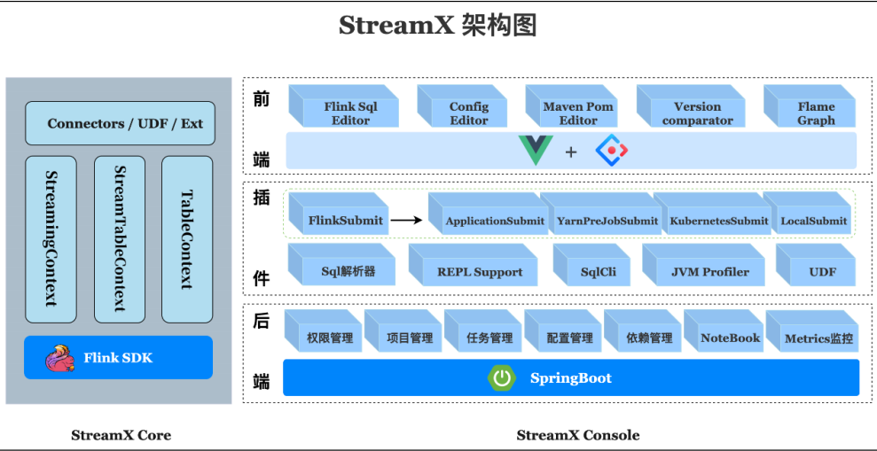

streamx-core 定位是一个开发时框架， 关注编码开发， 规范了配置文件,按照约定优于配
置的方式进行开发， 提供了一个开发时 RunTime Content 和一系列开箱即用的 Connector， 扩
展了 DataStream 相关的方法， 融合了 DataStream 和 Flink sql api， 简化繁琐的操作， 聚焦业
务本身， 提高开发效率和开发体验。

pump 是抽水机， 水泵的意思， streamx-pump 的定位是一个数据抽取的组件， 类似于 flinkx，  基于 streamx-core 中提供的各种 connector 开发， 目的是打造一个方便快捷， 开箱即用的大
数据实时数据抽取和迁移组件， 并且集成到 streamx-console 中， 解决实时数据源获取问题，
目前在规划中  

streamx-console 是一个综合实时数据平台， 低代码（Low Code） 平台， 可以较好的管理
Flink 任务， 集成了项目编译、发布、参数配置、启动、 savepoint， 火焰图（flame graph），
Flink SQL， 监控等诸多功能于一体， 大大简化了 Flink 任务的日常操作和维护， 融合了诸多
最佳实践。旧时王谢堂前燕， 飞入寻常百姓家， 让大公司有能力研发使用的项目， 现在人人
可以使用， 其最终目标是打造成一个实时数仓， 流批一体的一站式大数据解决方案。  

# 第3章 安装部署 Streamx  

基于社区于 2022 年 3 月 24 日发布的最新版本 1.2.2  

## 3.1 环境要求  


## 3.2 准备环境

### 3.2.1 linux 系统

选择 centos7.5。

### 3.2.2 jdk

选择 1.8。  

### 3.2.3 maven  

选择 3.8.5  

```
cd /opt/software
wget https://dlcdn.apache.org/maven/maven-3/3.8.5/binaries/apache-maven-
3.8.5-bin.tar.gz --no-check-certificate
tar -zxvf apache-maven-3.8.5-bin.tar.gz -C /opt/module
sudo ln -s /opt/module/apache-maven-3.8.5/bin/mvn /usr/bin/mvn
wget https://gitee.com/lzc2025/maven_setting/raw/master/settings.xml -O
/opt/module/apache-maven-3.8.5/conf/settings.xml
```

### 3.2.4 Node.js

console 前端部分采用 vue 开发，需要 nodejs 环境，下载安装最新的 nodejs 即可。

不同版本对应下载方式： https://github.com/nodesource/distributions  

```
curl -fsSL https://rpm.nodesource.com/setup_16.x | sudo bash -
sudo yum install -y nodejs
```

查看 nodejs 版本

```
node --version
```

### 3.2.5 MySQL

5.7.16

### 3.2.6 flink

选择 1.13.6。

需要配置 FLINK_HOME 环境变量  

```
export FLINK_HOME=/opt/module/flink-1.13.6
```

### 3.2.7 hadoop

选择 3.1.3。

配置相应的环境变量：  

```
export HADOOP_HOME=/opt/module/hadoop-3.1.3
export HADOOP_CLASSPATH=`hadoop classpath`
```

除了正常的配置外, 需要在 core-site.xml 中添加如下配置：  

```
<property>
<name>dfs.client.datanode-restart.timeout</name>
<value>30</value>
</property>
```

## 3.3 安装部署 Streamx

### 3.3.1 下载 Streamx  

```
cd /opt/software
wget
https://github.com/streamxhub/streamx/releases/download/v1.2.2/st
reamx-console-service-
1.2.2-bin.tar.gz
```

### 3.3.2 解压安装包  

```
tar -zxvf streamx-console-service-1.2.2-bin.tar.gz -C /opt/module
```

### 3.3.3 部署 Streamx 平台

1） 在 mysql 中创建数据库  

```
CREATE DATABASE `streamx` CHARACTER SET utf8 COLLATE
utf8_general_ci;
```

2） 初始化表  

```
use streamx;
source /opt/module/streamx-console-service-1.2.2/script/final.sql
```

3） 配置连接信息  

```yml
vim /opt/module/streamx-console-service-1.2.2/conf/application.yml
...
# 配置默认数据源
primary: primary
datasource:
# 数据源-1，名称为 primary
primary:
username: root
password: aaaaaa
driver-class-name: com.mysql.cj.jdbc.Driver
url:
jdbc:mysql://hadoop162:3306/streamx?useUnicode=true&characterEncoding=U
TF-
8&useJDBCCompliantTimezoneShift=true&useLegacyDatetimeCode=false&server
Timezone=GMT%2B8
...
streamx:
# HADOOP_USER_NAME
hadoop-user-name: atguigu
# 本地的工作空间,用于存放项目源码,构建的目录等.
workspace:
local: /opt/module/streamx_workspace
```

4） 启动 Server  

```
/opt/module/streamx-console-service-1.2.2/bin/startup.sh
```

启动成功之后使用 jps 可以看到如下进程。  


5） 浏览器登录系统

默认端口是 10000

http://hadoop162:10000/  


默认用户名： admin

默认密码： streamx  

### 3.3.4 系统配置  

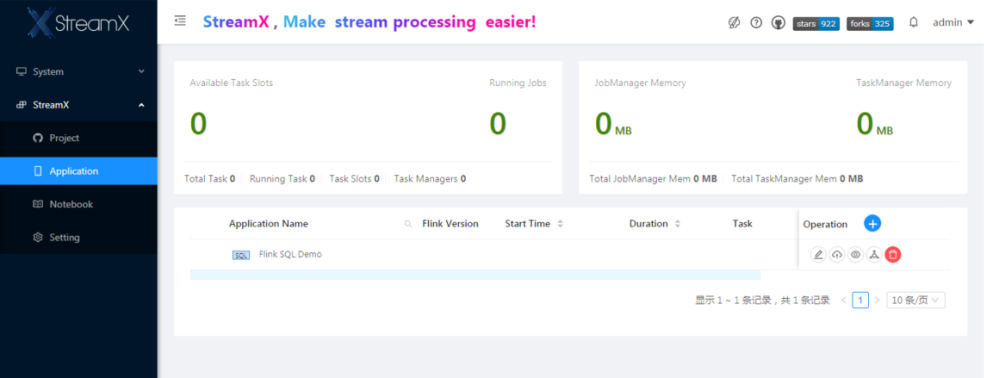

配置 Flink HOME。  

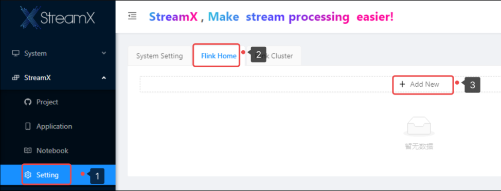

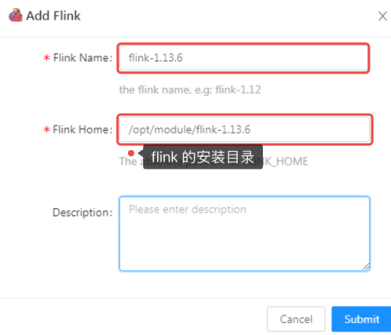

# 第4章 部署 flink stream 应用

## 4.1 创建 flink 项目  

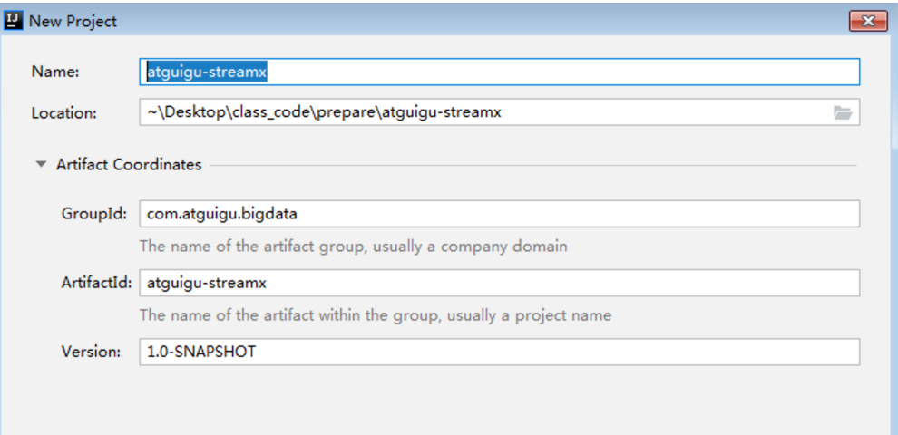

## 4.2 在 pom 文件中添加 flink 相关依赖  

```xml
<properties>
<flink.version>1.13.6</flink.version>
<scala.binary.version>2.11</scala.binary.version>
<slf4j.version>1.7.30</slf4j.version>
</properties>
<dependencies>
<dependency>
<groupId>org.apache.flink</groupId>
<artifactId>flink-java</artifactId>
<version>${flink.version}</version>
<scope>provided</scope>
</dependency>
<dependency>
<groupId>org.apache.flink</groupId>
<artifactId>flink-streaming-java_${scala.binary.version}</artifactId>
<version>${flink.version}</version>
<scope>provided</scope>
</dependency>
<dependency>
<groupId>org.apache.flink</groupId>
<artifactId>flink-clients_${scala.binary.version}</artifactId>
<version>${flink.version}</version>
<scope>provided</scope>
</dependency>
<dependency>
<groupId>org.apache.flink</groupId>
<artifactId>flink-runtime-web_${scala.binary.version}</artifactId>
<version>${flink.version}</version>
<scope>provided</scope>
</dependency>
<dependency>
<groupId>org.slf4j</groupId>
<artifactId>slf4j-api</artifactId>
<version>${slf4j.version}</version>
<scope>provided</scope>
</dependency>
<dependency>
<groupId>org.slf4j</groupId>
<artifactId>slf4j-log4j12</artifactId>
<version>${slf4j.version}</version>
<scope>provided</scope>
</dependency>
<dependency>
<groupId>org.apache.logging.log4j</groupId>
<artifactId>log4j-to-slf4j</artifactId>
<version>2.14.0</version>
<scope>provided</scope>
</dependency>
</dependencies>
<build>
<plugins>
<plugin>
<groupId>org.apache.maven.plugins</groupId>
<artifactId>maven-shade-plugin</artifactId>
<version>3.2.4</version>
<executions>
<execution>
<phase>package</phase>
<goals>
<goal>shade</goal>
</goals>
<configuration>
<artifactSet>
<excludes>
<exclude>com.google.code.findbugs:jsr305</exclude>
<exclude>org.slf4j:*</exclude>
<exclude>log4j:*</exclude>
</excludes>
</artifactSet>
<filters>
<filter>
<!-- Do not copy the signatures in the META-INF
folder.
Otherwise, this might cause SecurityExceptions when
using the JAR. -->
<artifact>*:*</artifact>
<excludes>
<exclude>META-INF/*.SF</exclude>
<exclude>META-INF/*.DSA</exclude>
<exclude>META-INF/*.RSA</exclude>
</excludes>
</filter>
</filters>
<transformers combine.children="append">
<transformer
implementation="org.apache.maven.plugins.shade.resource.ServicesResourceTransformer
">
</transformer>
</transformers>
</configuration>
</execution>
</executions>
</plugin>
</plugins>
</build>
```

## 4.3 示例代码  

```java
package com.atguigu.bigdata;
import org.apache.flink.api.common.functions.FlatMapFunction;
import org.apache.flink.api.common.functions.MapFunction;
import org.apache.flink.api.java.functions.KeySelector;
import org.apache.flink.api.java.tuple.Tuple2;
import org.apache.flink.streaming.api.environment.StreamExecutionEnvironment;
import org.apache.flink.util.Collector;
/**
* @Author lzc
* @Date 2022/3/24 15:28
*/
public class UnboundedWC {
public static void main(String[] args) throws Exception {
StreamExecutionEnvironment env =
StreamExecutionEnvironment.getExecutionEnvironment();
env.setParallelism(1);
env
.socketTextStream("hadoop162", 9999)
.flatMap(new FlatMapFunction<String, String>() {
@Override
public void flatMap(String line,
Collector<String> out) throws Exception {
for (String word : line.split(" ")) {
out.collect(word);
}
}
})
.map(new MapFunction<String, Tuple2<String, Long>>() {
@Override
public Tuple2<String, Long> map(String word) throws Exception {
return Tuple2.of(word, 1l);
}
})
.keyBy(new KeySelector<Tuple2<String, Long>, String>() {
@Override
public String getKey(Tuple2<String, Long> t) throws Exception {
return t.f0; // t._1
}
})
.sum(1)
.print();
env.execute();
}
}
```

## 4.4 代码推送到 gitee

在 streamx 平台部署应用的时候要求代码最好部署在 git 平台， 比如 github 或 gitee。 作
为国内用户我们选择比较稳定的 gitee。

示例项目推送地址  

```
https://gitee.com/lzc2025/atguigu-streamx.git
```

## 4.5 配置项目  

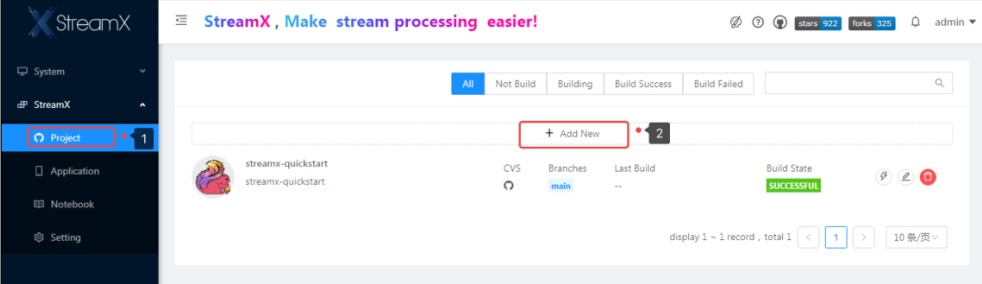

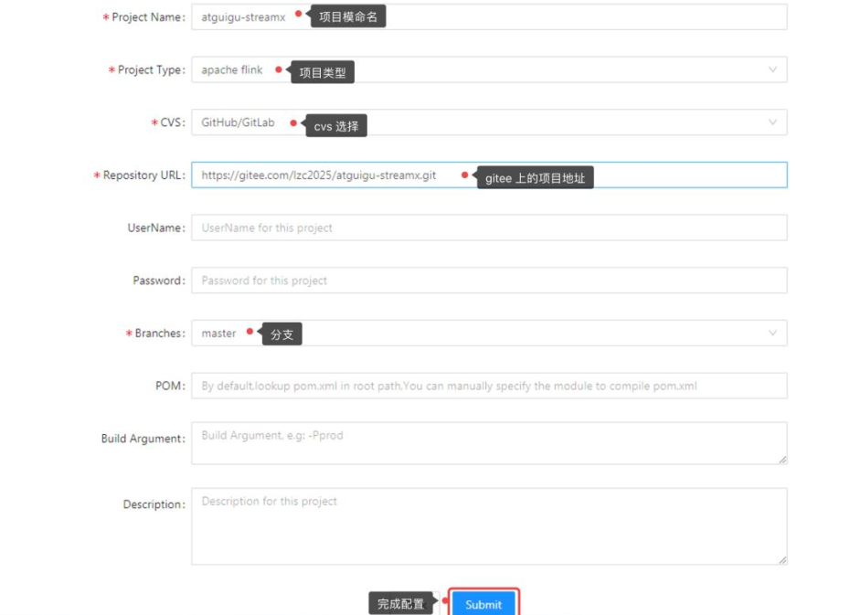

## 4.6 编译项目

编译前：  

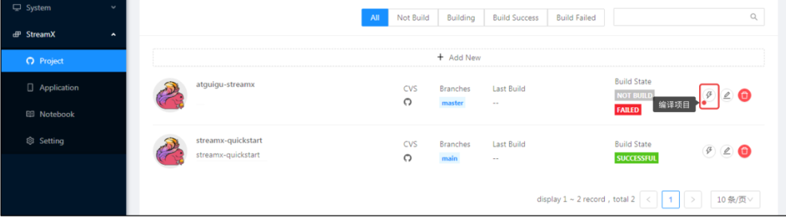

第一次编译需要的时间比较久, 因为需要下载许多的依赖。

编译成功后  

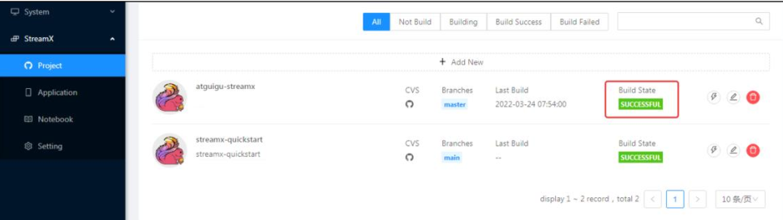

## 4.7 提交应用

1） 创建应用  

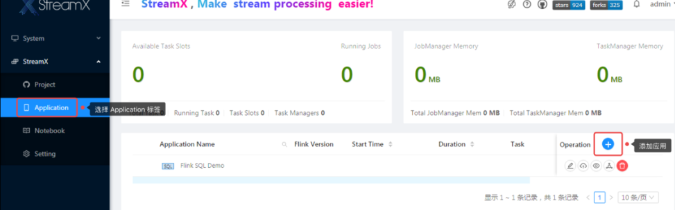

2） 配置应用  


3） 上线应用  


4） 启动应用（注意先启动 socket: nc -lk 9999）  

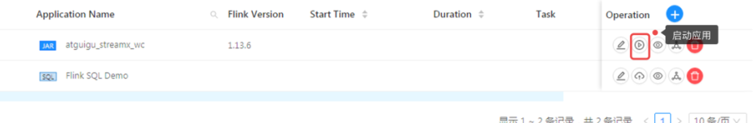


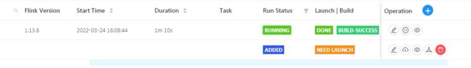

# 第5章 部署 flink sql 应用  

执行下面的 sql 语句：  

```SQL
create table t1 (
id string,
ts bigint,
vc int
) with(
'connector' = 'kafka',
'topic' = 't1',
'properties.bootstrap.servers' =
'hadoop162:9029,hadoop163:9092,hadoop164:9092',
'properties.group.id' = 'atguigu',
'scan.startup.mode' = 'latest-offset',
'format' = 'csv'
);
create table t2 (
id string,
ts bigint,
vc int
) with(
'connector' = 'print'
);

insert into t2 select * from t1;
```

kafka 连接器。  

```xml
<dependency>
<groupId>org.apache.flink</groupId>
<artifactId>flink-connector-kafka_2.11</artifactId>
<version>1.13.6</version>
</dependency
```

5.1 创建 application  

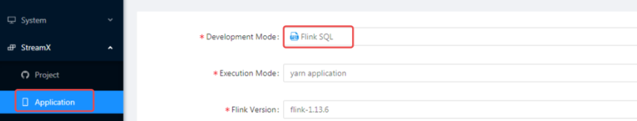


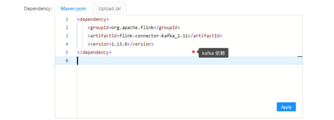


# 第6章 使用 Streamx API 开发应用  

## 6.1 项目配置  

配置在 StreamX 中是非常重要的概念。

针对参数设置的问题， 在 StreamX 中提出统一程序配置的概念， 把程序的一系列参数从
开发到部署阶段按照特定的格式配置到 application.yml 里， 抽象出一个通用的配置模板， 按
照这种规定的格式将上述配置的各项参数在配置文件里定义出来， 在程序启动的时候将这个
项目配置传入到程序中即可完成环境的初始化工作， 在任务启动的时候也会自动识别启动时
的参数， 于是就有了配置文件这一概念。

针对 Flink Sql 作业在代码里写 sql 的问题， StreamX 针对 Flink Sql 作业做了更高层级封
装和抽象， 开发者只需要将 sql 按照一定的规范要求定义到 sql.yaml 文件中,在程序启动时将
该 sql 文件传入到主程序中, 就会自动按照要求加载执行 sql， 于是就有了 sql 文件的概念。

两个术语：

配置文件： 把程序的一系列参数从开发到部署阶段按照特定的格式配置到文件里,这个
有特定作用的文件就是项目的配置文件。  

sql 文件： Flink Sql 任务中将提取出来的 sql 放到 sql.yaml 中,这个有特定作用的文件就
是项目的 sql 文件。  

### 6.1.1 配置文件

在 StreamX 中， DataStream 作业和 Flink Sql 作业配置文件是通用的， 换言之， 这个配
置文件既能定义 DataStream 的各项配置， 也能定义 Flink Sql 的各项配置（Flink Sql 作业中
配置文件是可选的）， 配置文件的格式必须是 yaml 格式， 必须得符合 yaml 的格式规范。

一个典型的配置文件如下：  

```yml
flink:
deployment:
option:
target: application
detached:
shutdownOnAttachedExit:
zookeeperNamespace:
jobmanager:
property: #@see: https://ci.apache.org/projects/flink/flink-docs-release-
1.12/deployment/config.html
$internal.application.main:
com.streamxhub.streamx.flink.quickstart.datastream.QuickStartApp
pipeline.name: QuickStart App(Flink 1.13)
taskmanager.numberOfTaskSlots: 1
parallelism.default: 2
jobmanager.memory:
flink.size:
heap.size:
jvm-metaspace.size:
jvm-overhead.max:
off-heap.size:
process.size:
taskmanager.memory:
flink.size:
framework.heap.size:
framework.off-heap.size:
managed.size:
process.size:
task.heap.size:
task.off-heap.size:
jvm-metaspace.size:
jvm-overhead.max:
jvm-overhead.min:
managed.fraction: 0.4
checkpoints:
enable: true
interval: 30000
mode: EXACTLY_ONCE
timeout: 300000
unaligned: true
watermark:
interval: 10000
# 状态后端
state:
backend:
value: rocksdb # 保存类型,在flink1.13中只有('rocksdb','hashmap')
checkpoints.num-retained: 1
# 重启策略
restart-strategy:
value: fixed-delay #重启策略[(fixed-delay|failure-rate|none)共3个可配置的策略
fixed-delay:
attempts: 3
delay: 5000
failure-rate:
max-failures-per-interval:
failure-rate-interval:
delay:
# table
table:
planner: blink # (blink|old|any)
mode: streaming #(batch|streaming)
# kafka source
kafka.source:
bootstrap.servers: kfk1:9092,kfk2:9092,kfk3:9092
topic: test_user
group.id: user_01
auto.offset.reset: earliest
# mysql
jdbc:
driverClassName: com.mysql.cj.jdbc.Driver
jdbcUrl:
jdbc:mysql://localhost:3306/test?useSSL=false&allowPublicKeyRetrieval=true
username: root
password: 123456
```

参数具体说明参考官网： https://www.streamxhub.com/zh-CN/docs/development/config  

### 6.1.2 SQL 文件

Sql 文件必须是 yaml 格式的文件， 得遵循 yaml 文件的定义规则， 具体内部 sql 格式的
定义非常简单， 如下：  

```sql
sql: |
CREATE TABLE datagen (
f_sequence INT,
f_random INT,
f_random_str STRING,
ts AS localtimestamp,
WATERMARK FOR ts AS ts
) WITH (
'connector' = 'datagen',
-- optional options --
'rows-per-second'='5',
'fields.f_sequence.kind'='sequence',
'fields.f_sequence.start'='1',
'fields.f_sequence.end'='1000',
'fields.f_random.min'='1',
'fields.f_random.max'='1000',
'fields.f_random_str.length'='10'
);
CREATE TABLE print_table (
f_sequence INT,
f_random INT,
f_random_str STRING
) WITH (
'connector' = 'print'
);
INSERT INTO print_table select f_sequence,f_random,f_random_str from datagen;
```

## 6.2 项目架构  


说明：

（1） assembly 是部署之后, 启动应用使用, 开发者不用关注

（2） logback.xml 是日志配置文件

（3） application.yml 就是项目配置文件（核心配置）  

```yml
flink:
deployment:
option:
target: application
detached:
shutdownOnAttachedExit:
zookeeperNamespace:
jobmanager:
property: #@see: https://ci.apache.org/projects/flink/flink-docs-release-
1.12/deployment/config.html
$internal.application.main: com.atguigu.streamx.StreamxKafkaDemo
yarn.application.name: stramx_kafka_demo
taskmanager.numberOfTaskSlots: 1
parallelism.default: 2
jobmanager.memory:
flink.size:
heap.size:
jvm-metaspace.size:
jvm-overhead.max:
off-heap.size:
process.size:
taskmanager.memory:
flink.size:
framework.heap.size:
framework.off-heap.size:
managed.size:
process.size:
task.heap.size:
task.off-heap.size:
jvm-metaspace.size:
jvm-overhead.max:
jvm-overhead.min:
managed.fraction: 0.4
checkpoints:
enable: false
interval: 30000
mode: EXACTLY_ONCE
timeout: 300000
unaligned: true
watermark:
interval: 10000
# 状态后端
state:
backend:
value: hashmap # 保存类型,在flink1.13中只有('rocksdb','hashmap')
checkpoints.num-retained: 1
# 重启策略
restart-strategy:
value: fixed-delay #重启策略[(fixed-delay|failure-rate|none)共3个可配置的策略]
fixed-delay:
attempts: 3
delay: 5000
failure-rate:
max-failures-per-interval:
failure-rate-interval:
delay:
# table
table:
planner: blink # (blink|old|any)
mode: streaming #(batch|streaming)
# kafka source 配置
kafka.source:
bootstrap.servers: hadoop162:9092,hadoop163:9092,hadoop164:9092
topic: s1
group.id: atguigu
auto.offset.reset: latest
```

（4） assembly.xml 是部署配置文件， 一般不需要修改  

```xml
<assembly>
<id>bin</id>
<formats>
<format>tar.gz</format>
</formats>
<fileSets>
<fileSet>
<directory>assembly/bin</directory>
<outputDirectory>bin</outputDirectory>
<fileMode>0755</fileMode>
</fileSet>
<fileSet>
<directory>${project.build.directory}</directory>
<outputDirectory>lib</outputDirectory>
<fileMode>0755</fileMode>
<includes>
<include>*.jar</include>
</includes>
<excludes>
<exclude>original-*.jar</exclude>
</excludes>
</fileSet>
<fileSet>
<directory>assembly/conf</directory>
<outputDirectory>conf</outputDirectory>
<fileMode>0755</fileMode>
</fileSet>
<fileSet>
<directory>assembly/logs</directory>
<outputDirectory>logs</outputDirectory>
<fileMode>0755</fileMode>
</fileSet>
<fileSet>
<directory>assembly/temp</directory>
<outputDirectory>temp</outputDirectory>
<fileMode>0755</fileMode>
</fileSet>
</fileSets>
</assembly>
```

（6） 其他配置可以从 gitee 项目下载: https://gitee.com/lzc2025/streamx_demo.git

## 6.3 Streamx API 开发流式应用

创建项目 streamx_demo

### 6.3.1 导入 maven 依赖  

```xml
<properties>
<flink.version>1.13.6</flink.version>
<scala.binary.version>2.11</scala.binary.version>
<streamx.flink.version>1.13</streamx.flink.version>
<streamx.version>1.2.2</streamx.version>
</properties>
<dependencies>
<dependency>
<groupId>org.apache.flink</groupId>
<artifactId>flink-java</artifactId>
<version>${flink.version}</version>
<scope>provided</scope>
</dependency>
<dependency>
<groupId>org.apache.flink</groupId>
<artifactId>flink-scala_${scala.binary.version}</artifactId>
<version>${flink.version}</version>
<scope>provided</scope>
</dependency>
<dependency>
<groupId>org.apache.flink</groupId>
<artifactId>flink-streaming-java_${scala.binary.version}</artifactId>
<version>${flink.version}</version>
<scope>provided</scope>
</dependency>
<dependency>
<groupId>org.apache.flink</groupId>
<artifactId>flink-streaming-scala_${scala.binary.version}</artifactId>
<version>${flink.version}</version>
<scope>provided</scope>
</dependency>
<dependency>
<groupId>org.apache.flink</groupId>
<artifactId>flink-clients_${scala.binary.version}</artifactId>
<version>${flink.version}</version>
<scope>provided</scope>
</dependency>
<dependency>
<groupId>org.apache.flink</groupId>
<artifactId>flink-runtime-web_${scala.binary.version}</artifactId>
<version>${flink.version}</version>
<scope>provided</scope>
</dependency>
<!--必须要导入的依赖-->
<!-- https://mvnrepository.com/artifact/com.streamxhub.streamx/streamx-flinkcore -->
<dependency>
<groupId>com.streamxhub.streamx</groupId>
<artifactId>streamx-flink-core</artifactId>
<version>${streamx.version}</version>
</dependency>
<dependency>
<groupId>com.streamxhub.streamx</groupId>
<artifactId>streamx-flink-shims_flink-${streamx.flink.version}</artifactId>
<version>${streamx.version}</version>
</dependency>
<!-- https://mvnrepository.com/artifact/org.apache.flink/flink-statebackendrocksdb -->
<dependency>
<groupId>org.apache.flink</groupId>
<artifactId>flink-statebackend-rocksdb_${scala.binary.version}</artifactId>
<version>${flink.version}</version>
</dependency>
</dependencies>
<build>
<plugins>
<!--(start) shade-->
<plugin>
<groupId>org.apache.maven.plugins</groupId>
<artifactId>maven-shade-plugin</artifactId>
<version>3.2.4</version>
<executions>
<execution>
<id>shade-flink</id>
<phase>none</phase>
</execution>
<execution>
<phase>package</phase>
<goals>
<goal>shade</goal>
</goals>
<configuration>
<createDependencyReducedPom>false</createDependencyReducedPom>
<artifactSet>
<excludes>
<exclude>org.apache.flink:force-shading</exclude>
<exclude>com.google.code.findbugs:jsr305</exclude>
<exclude>org.slf4j:*</exclude>
<exclude>log4j:*</exclude>
</excludes>
</artifactSet>
<filters>
<filter>
<artifact>*:*</artifact>
<excludes>
<exclude>META-INF/*.SF</exclude>
<exclude>META-INF/*.DSA</exclude>
<exclude>META-INF/*.RSA</exclude>
</excludes>
</filter>
</filters>
</configuration>
</execution>
</executions>
</plugin>
<!--(end) shade -->
<plugin>
<groupId>org.apache.maven.plugins</groupId>
<artifactId>maven-assembly-plugin</artifactId>
<version>3.1.1</version>
<executions>
<execution>
<id>distro-assembly</id>
<phase>package</phase>
<goals>
<goal>single</goal>
</goals>
</execution>
</executions>
<configuration>
<appendAssemblyId>false</appendAssemblyId>
<descriptors>
<descriptor>assembly.xml</descriptor>
</descriptors>
</configuration>
</plugin>
<!--同时指定java和scala为源码路径-->
<plugin>
<groupId>org.codehaus.mojo</groupId>
<artifactId>build-helper-maven-plugin</artifactId>
</plugin>
<!--maven-->
<plugin>
<groupId>org.apache.maven.plugins</groupId>
<artifactId>maven-compiler-plugin</artifactId>
</plugin>
<!--scala-->
<plugin>
<groupId>net.alchim31.maven</groupId>
<artifactId>scala-maven-plugin</artifactId>
</plugin>
</plugins>
</build>
```

### 6.3.2 Kafka Connector 的使用

6.3.2.1 添加依赖  

```xml
<!--flink-kafka-connector-->
<dependency>
<groupId>org.apache.flink</groupId>
<artifactId>flink-connector-kafka_${scala.binary.version}</artifactId>
<version>${flink.version}</version>
</dependency>
```

6.3.2.2 基础消费

1） 配置  

```yml
kafka.source:
bootstrap.servers:
hadoop162:9092,hadoop163:9092,hadoop164:9092
topic: s1
group.id: atguigu
auto.offset.reset: latest
```

2） 代码  

```scala
// 配置
StreamEnvConfig javaConfig = new StreamEnvConfig(args, null);
// 创建 StreamingContext 对象, 是一个核心类
StreamingContext ctx = new StreamingContext(javaConfig);
// 消费 kafka 数据
new KafkaSource<String>(ctx)
.getDataStream()
.map(new MapFunction<KafkaRecord<String>, String>() {
@Override
public String map(KafkaRecord<String> value) throws
Exception {
return value.value();
}
})
.print();
// 启动任务
ctx.start();
```

6.3.2.3 消费多个 topic

1） 配置  

```
kafka.source:
bootstrap.servers: hadoop162:9092,hadoop163:9092,hadoop164:9092
# 定义可能需要消费到的topic
topic: s1,s2,s3
group.id: atguigu
auto.offset.reset: latest
```

2） 代码  

```scala
new KafkaSource<String>(ctx)
.topic("s1") // 消费一个topic
.getDataStream()
.map(record -> record.value())
.print("one");
new KafkaSource<String>(ctx)
.topic("s1","s2") // 消费一组topic
.getDataStream()
.map(record -> record.value())
.print("two");
```

6.3.2.4 消费多个 Kafka 集群数据

1） 配置  

```
kafka.source:
kafka1:
# 配置第一个Kafka集群
bootstrap.servers: hadoop162:9092,hadoop163:9092,hadoop164:9092
topic: s1
group.id: atguigu1
auto.offset.reset: latest
enable.auto.commit: true
kafka2:
# 配置第二个kafka集群
bootstrap.servers: hadoop162:9092,hadoop163:9092,hadoop164:9092
topic: s2
group.id: atguigu2
auto.offset.reset: latest
enable.auto.commit: true
```

2） 代码  

```scala
new KafkaSource<String>(ctx)
.alias("kafka1") // 指定要消费的Kafka集群
.getDataStream()
.map(record -> record.value())
.print("one");
new KafkaSource<String>(ctx)
.alias("kafka2") // 指定要消费的Kafka集群
.getDataStream()
.map(record -> record.value())
.print("two");
```

6.3.2.5 其他一些高级用法参考官网  

https://www.streamxhub.com/zh-CN/docs/connector/Kafka-Connector  

### 6.3.3 Jdbc Connector 的使用

6.3.3.1 导入依赖  

```
<dependency>
<groupId>mysql</groupId>
<artifactId>mysql-connector-java</artifactId>
<version>5.1.49</version>
</dependency
```

6.3.3.2 配置  

```
jdbc:
driverClassName: com.mysql.jdbc.Driver
jdbcUrl:
jdbc:mysql://hadoop162:3306/test?useSSL=false&allowPublicKeyRetri
eval=true
username: root
password: aaaaaa
```

6.3.3.3 从 mysql 读取数据

Streamx 支持从 Mysql 读取数据， 但是仍然建议使用 Flink CDC。

6.3.3.4 向 Mysql 写入数据

从 kafka 读取数据然后写入到 Mysql 中。  

```scala
SingleOutputStreamOperator<WaterSensor> source = new KafkaSource<String>(ctx)
.alias("kafka1")
.getDataStream()
.map(record -> {
String[] data = record.value().split(",");
return new WaterSensor(data[0], Long.valueOf(data[1]),
Integer.valueOf(data[2]));
});
new JdbcSink<WaterSensor>(ctx)
.sql(new SQLFromFunction<WaterSensor>() {
// 抽取sql语句
@Override
public String from(WaterSensor ws) {
return String.format("insert into sensor(id, ts, vc)values('%s', %d,
%d)",
ws.getId(),
ws.getTs(),
ws.getVc()
);
}
})
.sink(source);
```

6.3.5 打包到 linux,提交到 yarn 执行

1） 把 streamx_demo-1.0-SNAPSHOT.tar.gz 上传到 linux， 解压  


2） 在 PATH 中配置 flink 环境变量  

```
export PATH=$FLINK_HOME:$PATH
```

3） 打开配置文件配置要执行的主类和在 yarn 执行的时的 job 名  

```
vim application.yaml
$internal.application.main: com.atguigu.streamx.StreamxKafkaDemo
yarn.application.name: stramx_kafka_demo
```

4） 向 yarn 平台提交任务  

```
bin/startup.sh
```

### 6.3.6 使用 streamx 平台提交应用  

6.3.6.1 创建 Project  

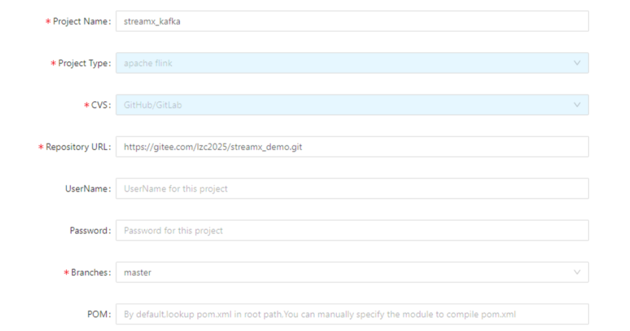

6.3.6.2 创建 Application

使用刚才 Project 创建一个 Application。  

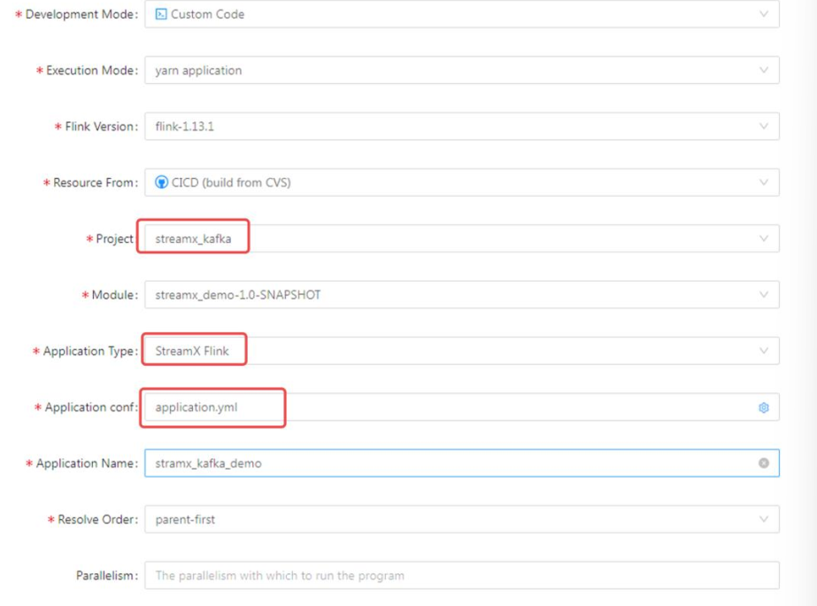

## 6.4 Streamx API 开发 SQL 应用  

### 6.4.1 导入依赖  

```
<dependency>
<groupId>org.apache.flink</groupId>
<artifactId>flink-table-planner-blink_${scala.binary.version}</artifactId>
<version>${flink.version}</version>
<scope>provided</scope>
</dependency>
<dependency>
<groupId>org.apache.flink</groupId>
<artifactId>flink-streaming-scala_${scala.binary.version}</artifactId>
<version>${flink.version}</version>
<scope>provided</scope>
</dependency>
<dependency>
<groupId>org.apache.flink</groupId>
<artifactId>flink-csv</artifactId>
<version>${flink.version}</version>
</dependency>
<dependency>
<groupId>org.apache.flink</groupId>
<artifactId>flink-json</artifactId>
<version>${flink.version}</version>
</dependency>
```

### 6.4.2 在 application.yml 中添加 table 相关配置  

```
# table
table:
planner: blink # (blink|old|any)
mode: streaming #(batch|streaming)
```

### 6.4.3 添加 sql.yml 文件  

在 conf 目录下添加 sql.yml 文件。  


```sql
first: |
create table s1 (
id string,
ts bigint,
vc int
) with(
'connector' = 'kafka',
'topic' = 's1',
'properties.bootstrap.servers' =
'hadoop162:9029,hadoop163:9092,hadoop164:9092',
'properties.group.id' = 'atguigu',
'scan.startup.mode' = 'latest-offset',
'format' = 'csv'
);
create table s2 (
id string,
ts bigint,
vc int
) with(
'connector' = 'print'
);
insert into s2 select * from s1;
```

### 6.4.4 创建 app 类  

```java
package com.atguigu.streamx;
import com.streamxhub.streamx.flink.core.TableContext;
import com.streamxhub.streamx.flink.core.TableEnvConfig;
public class StreamXSqlDemo {
public static void main(String[] args) {
TableEnvConfig tableEnvConfig = new TableEnvConfig(args, null);
TableContext ctx = new TableContext(tableEnvConfig);
ctx.sql("first");
}
}
```

### 6.4.5 执行查看结果  

添加程序参数：  

```
--sql
C:\Users\lzc\Desktop\class_code\prepare\streamx_demo\assembly\conf\sql.yml 

--conf
C:\Users\lzc\Desktop\class_code\prepare\streamx_demo\assembly\conf\application.yml
```

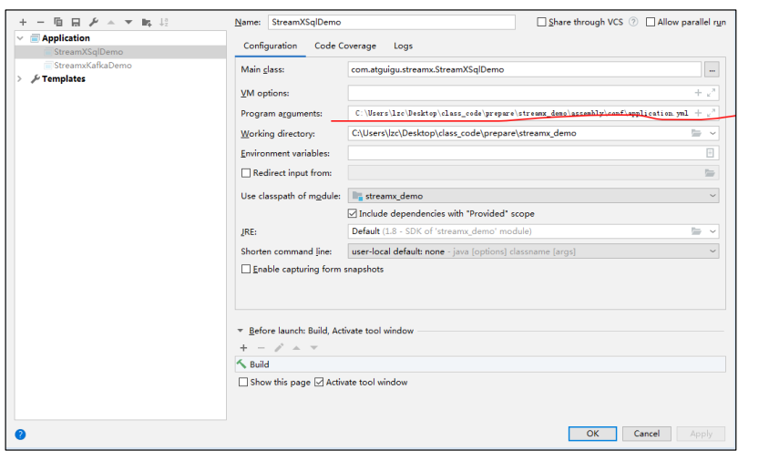